# 固定资产路由

<cite>
**本文引用的文件列表**
- [fixed-assets.ts](file://backend/src/routes/v2/fixed-assets.ts)
- [FixedAssetService.ts](file://backend/src/services/FixedAssetService.ts)
- [FixedAssetAllocationService.ts](file://backend/src/services/FixedAssetAllocationService.ts)
- [FixedAssetDepreciationService.ts](file://backend/src/services/FixedAssetDepreciationService.ts)
- [FixedAssetChangeService.ts](file://backend/src/services/FixedAssetChangeService.ts)
- [business.schema.ts](file://backend/src/schemas/business.schema.ts)
- [common.schema.ts](file://backend/src/schemas/common.schema.ts)
- [schema.ts](file://backend/src/db/schema.ts)
- [FinanceService.ts](file://backend/src/services/FinanceService.ts)
- [query-builder.ts](file://backend/src/utils/query-builder.ts)
- [state-machine.ts](file://backend/src/utils/state-machine.ts)
- [fixed-assets.test.ts](file://backend/test/routes/fixed-assets.test.ts)
</cite>

## 目录
1. [简介](#简介)
2. [项目结构](#项目结构)
3. [核心组件](#核心组件)
4. [架构总览](#架构总览)
5. [详细组件分析](#详细组件分析)
6. [依赖关系分析](#依赖关系分析)
7. [性能考量](#性能考量)
8. [故障排查指南](#故障排查指南)
9. [结论](#结论)
10. [附录](#附录)

## 简介
本文件面向固定资产全生命周期管理API，系统性梳理以下核心端点：
- 资产登记：POST /fixed-assets
- 信息更新：PUT /fixed-assets/{id}
- 折旧计算：POST /fixed-assets/{id}/depreciation
- 内部调拨：POST /fixed-assets/{id}/transfer
- 变卖处置：POST /fixed-assets/{id}/sell
- 采购入库（带财务流水）：POST /fixed-assets/purchase
- 分配资产：POST /fixed-assets/allocate
- 归还资产：POST /fixed-assets/{id}/return

文档重点说明：
- 资产状态机在API设计中的体现（采购、调拨、报废等操作如何驱动状态变更）
- FixedAssetService、FixedAssetAllocationService、FixedAssetDepreciationService、FixedAssetChangeService之间的协作关系
- 数据库事务如何保证资产变更与财务流水的一致性
- Zod验证模式如何保障请求参数的合法性

## 项目结构
固定资产相关模块分布如下：
- 路由层：backend/src/routes/v2/fixed-assets.ts
- 服务层：FixedAssetService、FixedAssetAllocationService、FixedAssetDepreciationService、FixedAssetChangeService
- 数据模型：backend/src/db/schema.ts（固定资产管理相关表）
- 验证模式：backend/src/schemas/business.schema.ts、backend/src/schemas/common.schema.ts
- 财务服务：FinanceService.ts（提供凭证号生成、余额校验、账户流水一致性）
- 工具：QueryBuilder（批量关联查询优化）、StateMachine（状态机工具）

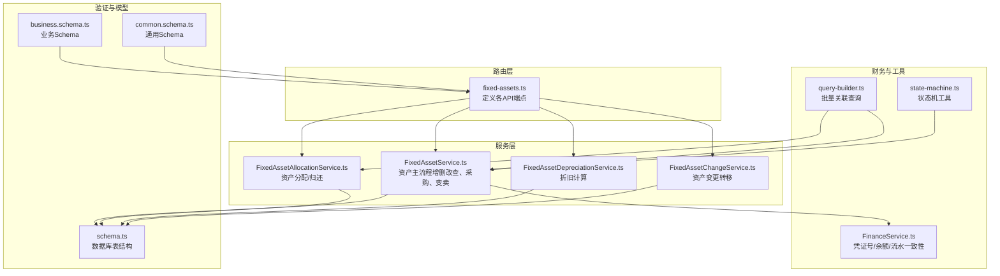

图表来源
- [fixed-assets.ts](file://backend/src/routes/v2/fixed-assets.ts#L1-L888)
- [FixedAssetService.ts](file://backend/src/services/FixedAssetService.ts#L1-L608)
- [FixedAssetAllocationService.ts](file://backend/src/services/FixedAssetAllocationService.ts#L1-L290)
- [FixedAssetDepreciationService.ts](file://backend/src/services/FixedAssetDepreciationService.ts#L1-L79)
- [FixedAssetChangeService.ts](file://backend/src/services/FixedAssetChangeService.ts#L1-L115)
- [business.schema.ts](file://backend/src/schemas/business.schema.ts#L1-L1069)
- [common.schema.ts](file://backend/src/schemas/common.schema.ts#L1-L234)
- [schema.ts](file://backend/src/db/schema.ts#L506-L574)
- [FinanceService.ts](file://backend/src/services/FinanceService.ts#L1-L443)
- [query-builder.ts](file://backend/src/utils/query-builder.ts#L1-L177)
- [state-machine.ts](file://backend/src/utils/state-machine.ts#L1-L89)

章节来源
- [fixed-assets.ts](file://backend/src/routes/v2/fixed-assets.ts#L1-L888)

## 核心组件
- 路由层（OpenAPIHono）：统一定义各端点的请求体、查询参数、响应结构，并通过Zod进行参数校验；权限控制与审计日志记录贯穿各端点。
- 服务层：
  - FixedAssetService：负责资产主流程（创建、更新、删除、查询、采购、变卖），并在事务内同步更新资产表、变更表、流水表。
  - FixedAssetAllocationService：负责资产分配与归还，维护分配表与资产状态、责任人、部门等字段。
  - FixedAssetDepreciationService：负责折旧计算，维护折旧表与资产当前净值。
  - FixedAssetChangeService：负责资产转移（部门/站点/责任人），维护变更表与资产目标字段。
- 验证层：Zod Schema覆盖请求体、查询参数、日期格式、枚举、金额与币种等约束。
- 数据模型：fixed_assets、fixed_asset_depreciations、fixed_asset_changes、fixed_asset_allocations等。
- 财务一致性：FinanceService提供凭证号生成、余额校验、账户流水一致性保障，配合事务实现强一致。

章节来源
- [FixedAssetService.ts](file://backend/src/services/FixedAssetService.ts#L1-L608)
- [FixedAssetAllocationService.ts](file://backend/src/services/FixedAssetAllocationService.ts#L1-L290)
- [FixedAssetDepreciationService.ts](file://backend/src/services/FixedAssetDepreciationService.ts#L1-L79)
- [FixedAssetChangeService.ts](file://backend/src/services/FixedAssetChangeService.ts#L1-L115)
- [business.schema.ts](file://backend/src/schemas/business.schema.ts#L275-L800)
- [common.schema.ts](file://backend/src/schemas/common.schema.ts#L1-L234)
- [schema.ts](file://backend/src/db/schema.ts#L506-L574)
- [FinanceService.ts](file://backend/src/services/FinanceService.ts#L1-L443)

## 架构总览
固定资产API采用“路由-服务-数据模型-财务服务”的分层架构，围绕Zod Schema进行严格输入校验，服务层通过数据库事务保证业务一致性，财务侧通过凭证号与账户流水实现账实一致。

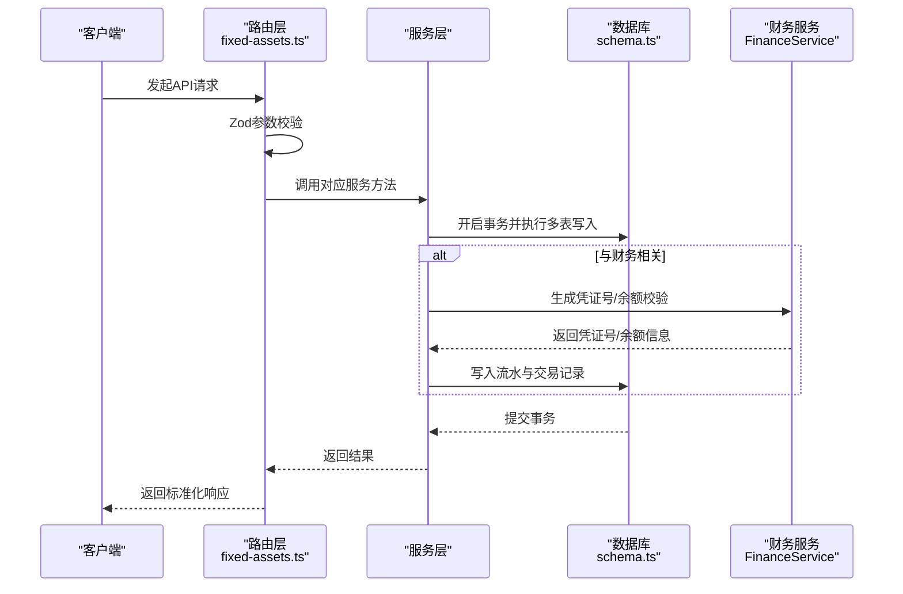

图表来源
- [fixed-assets.ts](file://backend/src/routes/v2/fixed-assets.ts#L313-L765)
- [FixedAssetService.ts](file://backend/src/services/FixedAssetService.ts#L313-L605)
- [FinanceService.ts](file://backend/src/services/FinanceService.ts#L25-L229)
- [schema.ts](file://backend/src/db/schema.ts#L506-L574)

## 详细组件分析

### 资产登记（POST /fixed-assets）
- 请求体校验：createFixedAssetSchema（资产编码、名称、采购日期、金额、币种、部门/站点/供应商/责任人、折旧方式、使用年限、状态等）。
- 权限与审计：路由层进行权限校验与审计日志记录。
- 服务实现：FixedAssetService.create插入资产表，设置初始状态与当前净值，返回资产ID与资产编码。
- 事务与一致性：无财务流水，不涉及跨表一致性。

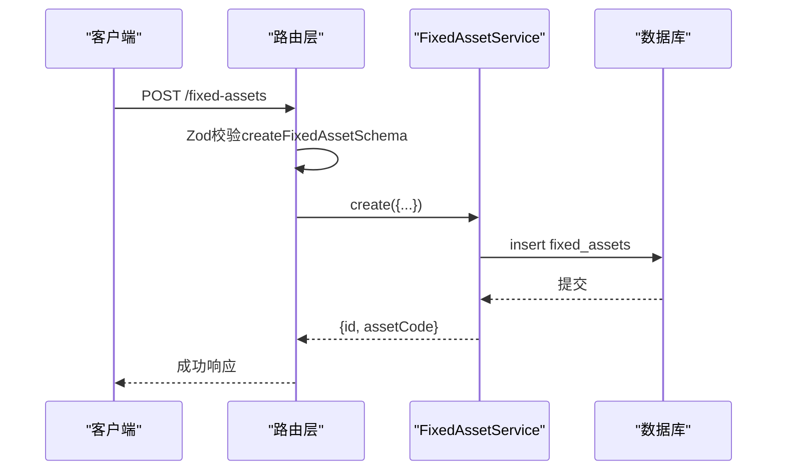

图表来源
- [fixed-assets.ts](file://backend/src/routes/v2/fixed-assets.ts#L313-L385)
- [business.schema.ts](file://backend/src/schemas/business.schema.ts#L275-L313)
- [FixedAssetService.ts](file://backend/src/services/FixedAssetService.ts#L183-L226)

章节来源
- [fixed-assets.ts](file://backend/src/routes/v2/fixed-assets.ts#L313-L385)
- [FixedAssetService.ts](file://backend/src/services/FixedAssetService.ts#L183-L226)
- [business.schema.ts](file://backend/src/schemas/business.schema.ts#L275-L313)

### 信息更新（PUT /fixed-assets/{id}）
- 请求体校验：updateFixedAssetSchema（名称、分类、采购日期、金额、币种、部门/站点/供应商/责任人、状态、备注等）。
- 服务实现：FixedAssetService.update更新资产表；若状态/部门/站点/责任人发生变更，同时写入资产变更表。
- 事务与一致性：单表更新，不涉及财务流水。

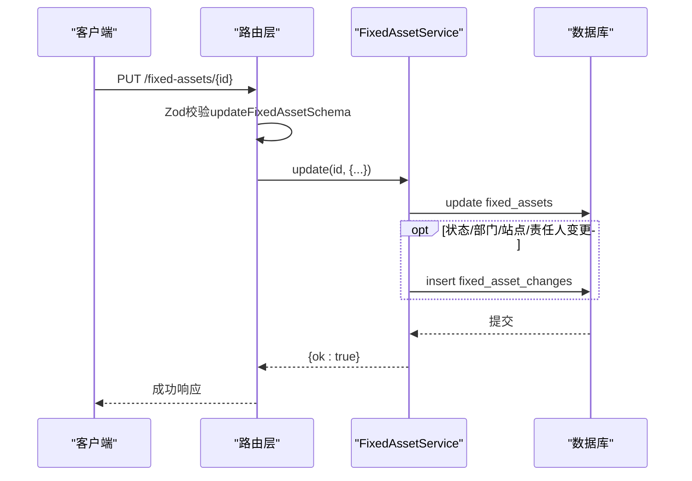

图表来源
- [fixed-assets.ts](file://backend/src/routes/v2/fixed-assets.ts#L388-L446)
- [business.schema.ts](file://backend/src/schemas/business.schema.ts#L298-L312)
- [FixedAssetService.ts](file://backend/src/services/FixedAssetService.ts#L228-L286)

章节来源
- [fixed-assets.ts](file://backend/src/routes/v2/fixed-assets.ts#L388-L446)
- [FixedAssetService.ts](file://backend/src/services/FixedAssetService.ts#L228-L286)
- [business.schema.ts](file://backend/src/schemas/business.schema.ts#L298-L312)

### 折旧计算（POST /fixed-assets/{id}/depreciation）
- 请求体校验：createDepreciationSchema（折旧日期、折旧金额、备注）。
- 服务实现：FixedAssetDepreciationService.createDepreciation累加累计折旧与剩余价值，写入折旧表并更新资产当前净值。
- 事务与一致性：单表写入折旧表并更新资产净值，保持金额与净值一致性。

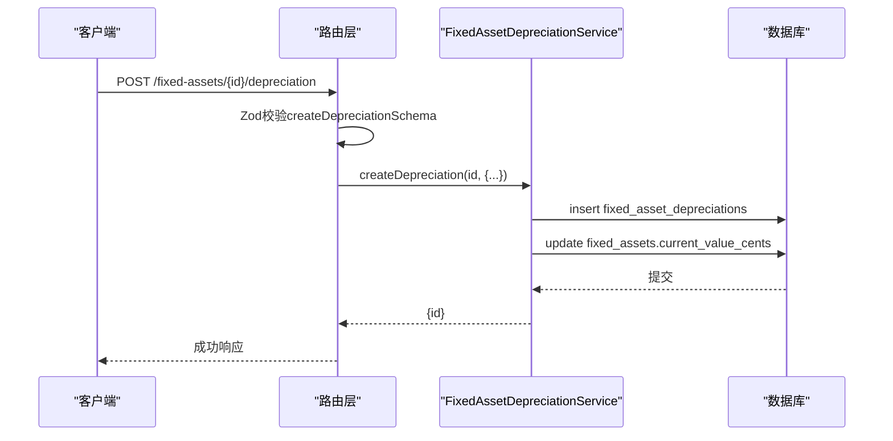

图表来源
- [fixed-assets.ts](file://backend/src/routes/v2/fixed-assets.ts#L488-L546)
- [business.schema.ts](file://backend/src/schemas/business.schema.ts#L327-L334)
- [FixedAssetDepreciationService.ts](file://backend/src/services/FixedAssetDepreciationService.ts#L1-L79)

章节来源
- [fixed-assets.ts](file://backend/src/routes/v2/fixed-assets.ts#L488-L546)
- [FixedAssetDepreciationService.ts](file://backend/src/services/FixedAssetDepreciationService.ts#L1-L79)
- [business.schema.ts](file://backend/src/schemas/business.schema.ts#L327-L334)

### 内部调拨（POST /fixed-assets/{id}/transfer）
- 请求体校验：transferFixedAssetSchema（转移日期、目标部门/站点/责任人、备注）。
- 服务实现：FixedAssetChangeService.transfer写入资产变更表，并根据传入字段更新资产的目标字段（部门/站点/责任人）。
- 事务与一致性：单表写入变更表并更新资产字段，不涉及财务流水。

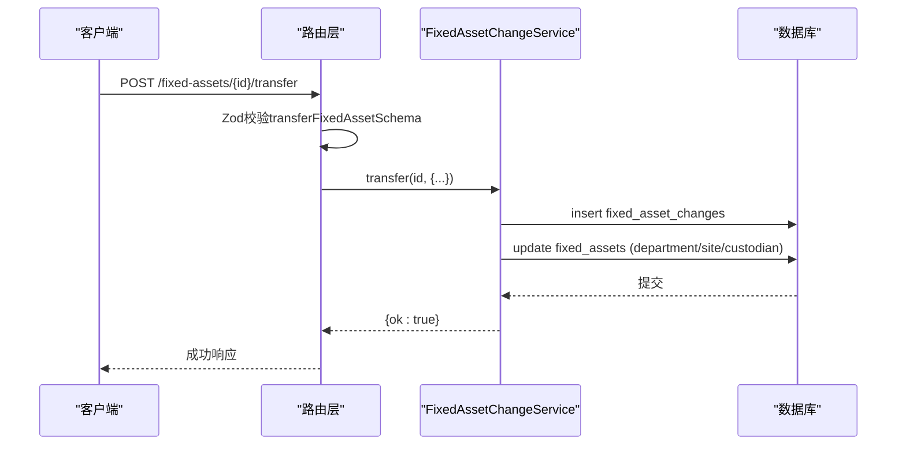

图表来源
- [fixed-assets.ts](file://backend/src/routes/v2/fixed-assets.ts#L548-L611)
- [business.schema.ts](file://backend/src/schemas/business.schema.ts#L737-L746)
- [FixedAssetChangeService.ts](file://backend/src/services/FixedAssetChangeService.ts#L1-L79)

章节来源
- [fixed-assets.ts](file://backend/src/routes/v2/fixed-assets.ts#L548-L611)
- [FixedAssetChangeService.ts](file://backend/src/services/FixedAssetChangeService.ts#L1-L79)
- [business.schema.ts](file://backend/src/schemas/business.schema.ts#L737-L746)

### 变卖处置（POST /fixed-assets/{id}/sell）
- 请求体校验：sellFixedAssetSchema（销售日期、售价、币种、收款账户、收支科目、买方、备注等）。
- 服务实现：FixedAssetService.sell在事务内：
  - 更新资产状态为“已售出”，记录销售信息；
  - 生成凭证号，写入cashFlows（收入类型）；
  - 写入accountTransactions（余额前后计算）；
  - 写入fixed_asset_changes记录销售变更。
- 事务与一致性：通过事务保证资产状态、流水与交易记录的一致性；FinanceService提供凭证号生成与余额校验。

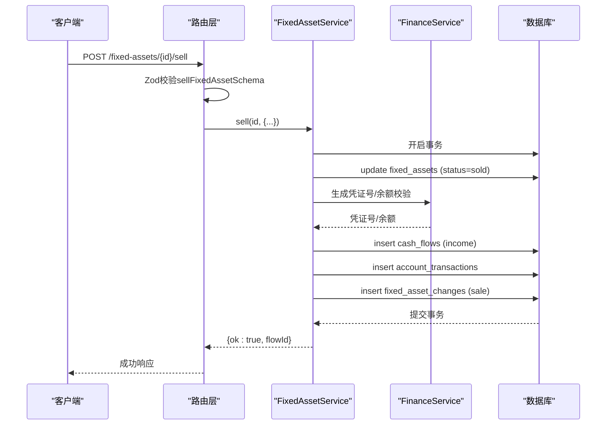

图表来源
- [fixed-assets.ts](file://backend/src/routes/v2/fixed-assets.ts#L694-L765)
- [business.schema.ts](file://backend/src/schemas/business.schema.ts#L767-L790)
- [FixedAssetService.ts](file://backend/src/services/FixedAssetService.ts#L470-L605)
- [FinanceService.ts](file://backend/src/services/FinanceService.ts#L25-L229)
- [schema.ts](file://backend/src/db/schema.ts#L159-L206)

章节来源
- [fixed-assets.ts](file://backend/src/routes/v2/fixed-assets.ts#L694-L765)
- [FixedAssetService.ts](file://backend/src/services/FixedAssetService.ts#L470-L605)
- [business.schema.ts](file://backend/src/schemas/business.schema.ts#L767-L790)
- [FinanceService.ts](file://backend/src/services/FinanceService.ts#L25-L229)

### 采购入库（POST /fixed-assets/purchase）
- 请求体校验：purchaseFixedAssetWithFlowSchema（资产编码、名称、采购日期、金额、币种、账户、科目、供应商、部门/站点/责任人、折旧方式、使用年限、备注等）。
- 服务实现：FixedAssetService.purchase在事务内：
  - 创建资产；
  - 生成凭证号，写入cashFlows（支出类型）；
  - 写入accountTransactions；
  - 写入fixed_asset_changes记录“购买”变更。
- 事务与一致性：通过事务保证资产、流水与交易记录的一致性；FinanceService提供凭证号生成与余额校验。

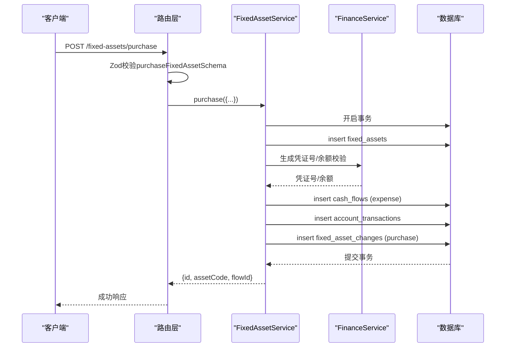

图表来源
- [fixed-assets.ts](file://backend/src/routes/v2/fixed-assets.ts#L613-L693)
- [business.schema.ts](file://backend/src/schemas/business.schema.ts#L748-L766)
- [FixedAssetService.ts](file://backend/src/services/FixedAssetService.ts#L313-L468)
- [FinanceService.ts](file://backend/src/services/FinanceService.ts#L25-L229)
- [schema.ts](file://backend/src/db/schema.ts#L159-L206)

章节来源
- [fixed-assets.ts](file://backend/src/routes/v2/fixed-assets.ts#L613-L693)
- [FixedAssetService.ts](file://backend/src/services/FixedAssetService.ts#L313-L468)
- [business.schema.ts](file://backend/src/schemas/business.schema.ts#L748-L766)
- [FinanceService.ts](file://backend/src/services/FinanceService.ts#L25-L229)

### 分配资产（POST /fixed-assets/allocate）
- 请求体校验：allocateFixedAssetSchema（资产ID、员工ID、分配日期、分配类型、预计归还日期、备注）。
- 服务实现：FixedAssetAllocationService.allocate在事务内：
  - 新增分配记录；
  - 更新资产状态为“使用中”，责任人设为员工，部门继承员工所在部门或资产原部门；
  - 写入资产变更表记录“分配”。
- 事务与一致性：单事务内完成分配与资产状态更新。

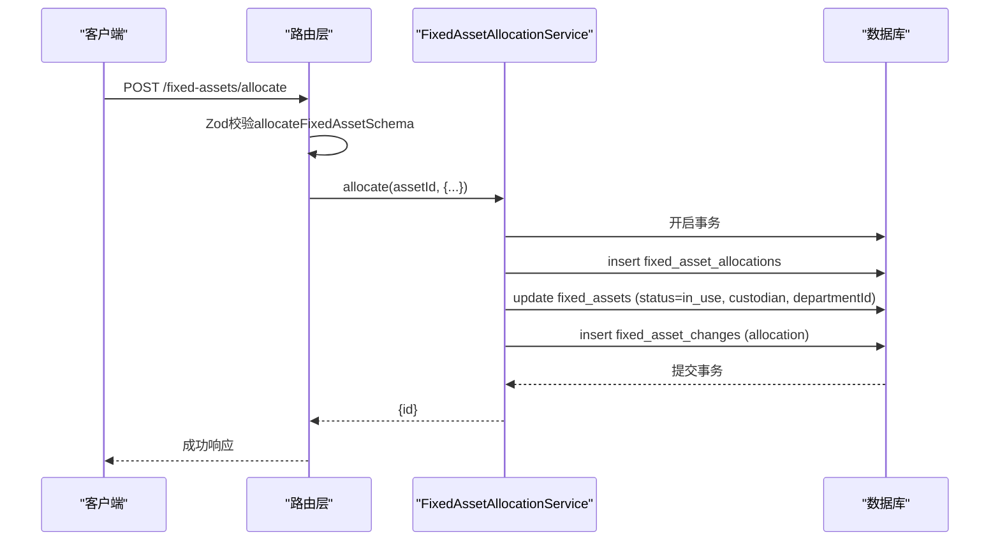

图表来源
- [fixed-assets.ts](file://backend/src/routes/v2/fixed-assets.ts#L767-L808)
- [business.schema.ts](file://backend/src/schemas/business.schema.ts#L315-L324)
- [FixedAssetAllocationService.ts](file://backend/src/services/FixedAssetAllocationService.ts#L106-L208)

章节来源
- [fixed-assets.ts](file://backend/src/routes/v2/fixed-assets.ts#L767-L808)
- [FixedAssetAllocationService.ts](file://backend/src/services/FixedAssetAllocationService.ts#L106-L208)
- [business.schema.ts](file://backend/src/schemas/business.schema.ts#L315-L324)

### 归还资产（POST /fixed-assets/{id}/return）
- 请求体校验：returnFixedAssetSchema（归还日期、归还类型、备注）。
- 服务实现：FixedAssetAllocationService.return在事务内：
  - 更新最新未归还分配记录的归还日期与类型；
  - 将资产状态置为“闲置”，责任人清空；
  - 写入资产变更表记录“归还”。
- 事务与一致性：单事务内完成归还与资产状态更新。

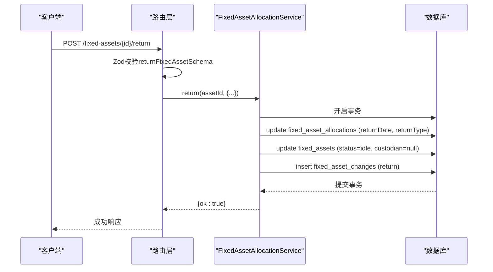

图表来源
- [fixed-assets.ts](file://backend/src/routes/v2/fixed-assets.ts#L809-L888)
- [business.schema.ts](file://backend/src/schemas/business.schema.ts#L782-L789)
- [FixedAssetAllocationService.ts](file://backend/src/services/FixedAssetAllocationService.ts#L210-L288)

章节来源
- [fixed-assets.ts](file://backend/src/routes/v2/fixed-assets.ts#L809-L888)
- [FixedAssetAllocationService.ts](file://backend/src/services/FixedAssetAllocationService.ts#L210-L288)
- [business.schema.ts](file://backend/src/schemas/business.schema.ts#L782-L789)

### 资产状态机在API设计中的体现
- 状态字段：资产表包含状态字段（in_use、idle、maintenance、scrapped、sold）。
- 状态变更来源：
  - 采购：购买成功后资产状态默认为“使用中”。
  - 分配：分配成功后资产状态变为“使用中”，责任人更新。
  - 归还：归还成功后资产状态变为“闲置”，责任人清空。
  - 变卖：变卖成功后资产状态变为“已售出”。
  - 调拨：调拨成功后更新部门/站点/责任人字段，状态保持不变。
- 状态机工具：提供状态转换合法性校验能力，可在服务层扩展使用（当前路由层未直接调用状态机，但可通过服务层集成）。

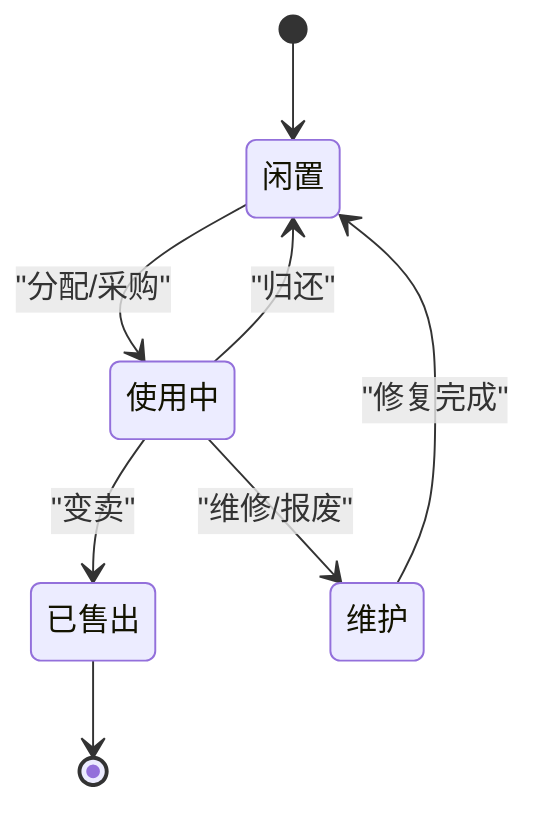

图表来源
- [schema.ts](file://backend/src/db/schema.ts#L518-L529)
- [FixedAssetService.ts](file://backend/src/services/FixedAssetService.ts#L470-L605)
- [FixedAssetAllocationService.ts](file://backend/src/services/FixedAssetAllocationService.ts#L106-L208)
- [FixedAssetChangeService.ts](file://backend/src/services/FixedAssetChangeService.ts#L1-L79)

章节来源
- [schema.ts](file://backend/src/db/schema.ts#L518-L529)
- [FixedAssetService.ts](file://backend/src/services/FixedAssetService.ts#L470-L605)
- [FixedAssetAllocationService.ts](file://backend/src/services/FixedAssetAllocationService.ts#L106-L208)
- [FixedAssetChangeService.ts](file://backend/src/services/FixedAssetChangeService.ts#L1-L79)
- [state-machine.ts](file://backend/src/utils/state-machine.ts#L1-L89)

### FixedAssetService 与 FixedAssetAllocationService 等子服务的协作
- 协作关系：
  - 路由层统一调度各服务；
  - FixedAssetService负责资产主流程与财务一致性；
  - FixedAssetAllocationService负责资产分配/归还；
  - FixedAssetDepreciationService负责折旧；
  - FixedAssetChangeService负责转移；
  - FinanceService提供凭证号生成与余额校验，确保财务流水与资产状态一致。
- 关键协作点：
  - 采购/变卖：FixedAssetService在事务内写入资产、流水与交易记录；
  - 分配/归还：FixedAssetAllocationService在事务内写入分配记录与资产状态；
  - 折旧：FixedAssetDepreciationService在事务内写入折旧记录并更新资产净值；
  - 调拨：FixedAssetChangeService在事务内写入变更记录并更新资产字段。

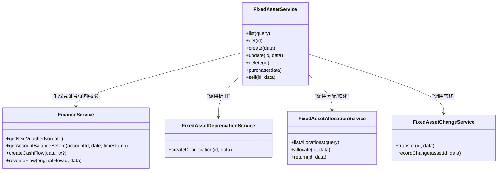

图表来源
- [FixedAssetService.ts](file://backend/src/services/FixedAssetService.ts#L1-L608)
- [FixedAssetAllocationService.ts](file://backend/src/services/FixedAssetAllocationService.ts#L1-L290)
- [FixedAssetDepreciationService.ts](file://backend/src/services/FixedAssetDepreciationService.ts#L1-L79)
- [FixedAssetChangeService.ts](file://backend/src/services/FixedAssetChangeService.ts#L1-L115)
- [FinanceService.ts](file://backend/src/services/FinanceService.ts#L1-L443)

章节来源
- [FixedAssetService.ts](file://backend/src/services/FixedAssetService.ts#L1-L608)
- [FixedAssetAllocationService.ts](file://backend/src/services/FixedAssetAllocationService.ts#L1-L290)
- [FixedAssetDepreciationService.ts](file://backend/src/services/FixedAssetDepreciationService.ts#L1-L79)
- [FixedAssetChangeService.ts](file://backend/src/services/FixedAssetChangeService.ts#L1-L115)
- [FinanceService.ts](file://backend/src/services/FinanceService.ts#L1-L443)

### 数据库事务与财务一致性
- 采购/变卖：FixedAssetService.purchase/sell在事务内完成资产、流水、交易记录与变更记录的原子性提交，确保账实一致。
- 凭证号生成：FinanceService.getNextVoucherNo按业务日期生成唯一凭证号，避免重复。
- 余额校验：FinanceService.getAccountBalanceBefore基于历史交易计算余额，避免并发导致的余额不一致。
- 乐观锁：FinanceService通过更新账户版本号实现并发冲突检测，防止并发写入导致的余额计算偏差。

章节来源
- [FixedAssetService.ts](file://backend/src/services/FixedAssetService.ts#L313-L605)
- [FinanceService.ts](file://backend/src/services/FinanceService.ts#L25-L229)
- [schema.ts](file://backend/src/db/schema.ts#L159-L206)

### Zod 验证模式与请求参数校验
- 日期格式：dateSchema（YYYY-MM-DD）。
- 枚举与必填：状态、分配类型、收支类型等通过枚举约束。
- 金额与币种：金额为非负/正整数，币种为3位字母代码。
- 复杂校验：凭证上传必填（voucherUrls或voucherUrl），金额与币种匹配等。
- 路由层：每个端点均通过Zod Schema对请求体/查询参数进行严格校验，不符合即返回错误。

章节来源
- [common.schema.ts](file://backend/src/schemas/common.schema.ts#L1-L234)
- [business.schema.ts](file://backend/src/schemas/business.schema.ts#L275-L800)
- [fixed-assets.ts](file://backend/src/routes/v2/fixed-assets.ts#L1-L888)

## 依赖关系分析
- 路由层依赖验证Schema与权限工具，调用服务层。
- 服务层依赖数据库Schema与FinanceService，保证财务一致性。
- 工具层（QueryBuilder、StateMachine）提升查询效率与状态控制能力。
- 测试覆盖：前端测试用例覆盖主要端点的请求与响应格式，验证路由层行为。

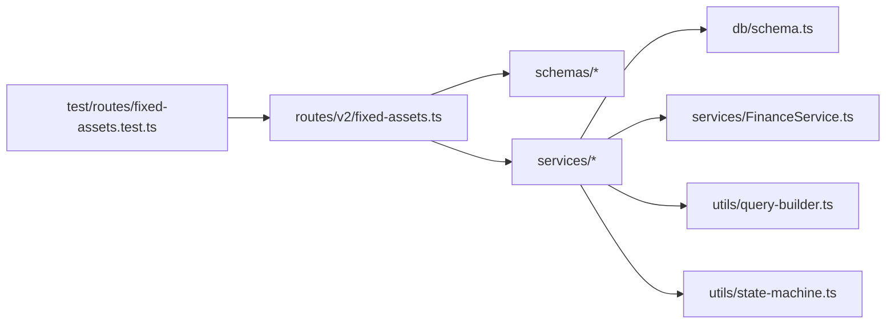

图表来源
- [fixed-assets.ts](file://backend/src/routes/v2/fixed-assets.ts#L1-L888)
- [business.schema.ts](file://backend/src/schemas/business.schema.ts#L1-L1069)
- [common.schema.ts](file://backend/src/schemas/common.schema.ts#L1-L234)
- [schema.ts](file://backend/src/db/schema.ts#L506-L574)
- [FinanceService.ts](file://backend/src/services/FinanceService.ts#L1-L443)
- [query-builder.ts](file://backend/src/utils/query-builder.ts#L1-L177)
- [state-machine.ts](file://backend/src/utils/state-machine.ts#L1-L89)
- [fixed-assets.test.ts](file://backend/test/routes/fixed-assets.test.ts#L1-L388)

章节来源
- [fixed-assets.ts](file://backend/src/routes/v2/fixed-assets.ts#L1-L888)
- [fixed-assets.test.ts](file://backend/test/routes/fixed-assets.test.ts#L1-L388)

## 性能考量
- 批量关联查询：FixedAssetService与FixedAssetAllocationService使用QueryBuilder提取关联ID并并行批量查询，降低N+1查询开销。
- 事务边界：将多表写入放入单事务，减少锁竞争与回滚成本。
- 乐观锁：FinanceService通过账户版本号实现并发冲突检测，避免余额计算偏差。
- 查询限制：路由层对分页参数进行上限控制，避免超大数据量查询。

章节来源
- [FixedAssetService.ts](file://backend/src/services/FixedAssetService.ts#L1-L180)
- [FixedAssetAllocationService.ts](file://backend/src/services/FixedAssetAllocationService.ts#L1-L105)
- [query-builder.ts](file://backend/src/utils/query-builder.ts#L1-L177)
- [FinanceService.ts](file://backend/src/services/FinanceService.ts#L146-L187)
- [common.schema.ts](file://backend/src/schemas/common.schema.ts#L24-L30)

## 故障排查指南
- 参数校验失败：检查请求体是否满足Zod Schema约束（日期格式、枚举、金额、币种、凭证上传等）。
- 权限不足：确认用户具备相应权限（如资产创建、折旧、转移、处置等）。
- 业务异常：
  - 资产已出售：变卖接口会拒绝重复变卖。
  - 存在折旧记录：删除资产前需先清理折旧记录。
  - 资产未分配或已归还：归还接口会拒绝非法状态。
- 财务异常：
  - 账户余额不足：支出类流水会触发余额校验。
  - 凭证号冲突：确保业务日期与序列号组合唯一。
- 并发冲突：账户版本号冲突会触发并发修改错误，需重试。

章节来源
- [FixedAssetService.ts](file://backend/src/services/FixedAssetService.ts#L288-L309)
- [FixedAssetService.ts](file://backend/src/services/FixedAssetService.ts#L470-L508)
- [FixedAssetAllocationService.ts](file://backend/src/services/FixedAssetAllocationService.ts#L120-L151)
- [FixedAssetAllocationService.ts](file://backend/src/services/FixedAssetAllocationService.ts#L222-L237)
- [FinanceService.ts](file://backend/src/services/FinanceService.ts#L146-L187)

## 结论
固定资产全生命周期管理API通过严格的Zod参数校验、清晰的服务层职责划分、严谨的数据库事务与财务一致性保障，实现了从采购入库、分配归还、折旧计算到内部调拨与变卖处置的完整闭环。资产状态机贯穿各关键操作，确保状态变更的合理性与可追溯性。推荐在服务层进一步引入状态机工具，以增强状态转换的可控性与可维护性。

## 附录
- 端点一览与校验要点：
  - POST /fixed-assets：createFixedAssetSchema
  - PUT /fixed-assets/{id}：updateFixedAssetSchema
  - POST /fixed-assets/{id}/depreciation：createDepreciationSchema
  - POST /fixed-assets/{id}/transfer：transferFixedAssetSchema
  - POST /fixed-assets/{id}/sell：sellFixedAssetSchema
  - POST /fixed-assets/purchase：purchaseFixedAssetSchema
  - POST /fixed-assets/allocate：allocateFixedAssetSchema
  - POST /fixed-assets/{id}/return：returnFixedAssetSchema

章节来源
- [fixed-assets.ts](file://backend/src/routes/v2/fixed-assets.ts#L313-L765)
- [business.schema.ts](file://backend/src/schemas/business.schema.ts#L275-L800)
- [common.schema.ts](file://backend/src/schemas/common.schema.ts#L1-L234)