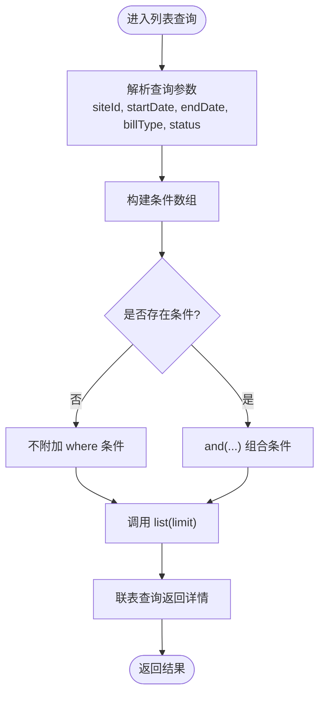

# 场地账单路由

<cite>
**本文引用的文件**
- [backend/src/routes/v2/site-bills.ts](file://backend/src/routes/v2/site-bills.ts)
- [backend/src/services/SiteBillService.ts](file://backend/src/services/SiteBillService.ts)
- [backend/src/db/schema.ts](file://backend/src/db/schema.ts)
- [backend/src/utils/permissions.ts](file://backend/src/utils/permissions.ts)
- [backend/src/middleware/permission.ts](file://backend/src/middleware/permission.ts)
- [backend/src/schemas/common.schema.ts](file://backend/src/schemas/common.schema.ts)
- [backend/src/utils/route-helpers.ts](file://backend/src/utils/route-helpers.ts)
- [backend/src/utils/audit.ts](file://backend/src/utils/audit.ts)
- [backend/src/utils/errors.ts](file://backend/src/utils/errors.ts)
- [backend/test/routes/v2/site-bills.test.ts](file://backend/test/routes/v2/site-bills.test.ts)
- [backend/test/services/SiteBillService.test.ts](file://backend/test/services/SiteBillService.test.ts)
- [frontend/src/features/sites/pages/SiteBillsPage.tsx](file://frontend/src/features/sites/pages/SiteBillsPage.tsx)
- [frontend/src/hooks/business/useSiteBills.ts](file://frontend/src/hooks/business/useSiteBills.ts)
</cite>

## 目录
1. [简介](#简介)
2. [项目结构](#项目结构)
3. [核心组件](#核心组件)
4. [架构总览](#架构总览)
5. [详细组件分析](#详细组件分析)
6. [依赖关系分析](#依赖关系分析)
7. [性能考量](#性能考量)
8. [故障排查指南](#故障排查指南)
9. [结论](#结论)
10. [附录](#附录)

## 简介
本文件面向“场地账单”业务，系统性梳理后端路由与服务层的实现，覆盖以下能力：
- 账单创建（POST /site-bills）
- 账单查询（GET /site-bills）
- 账单详情（GET /site-bills/{id}）
- 账单更新（PUT /site-bills/{id}）
- 账单删除（DELETE /site-bills/{id}）

同时说明：
- 多条件查询的实现方式（按场地、日期范围、账单类型、状态）
- 账单与财务流水的关系（如何通过SiteBillService实现状态管理）
- 权限控制策略（区分财务与场地管理员）
- 前端调用与展示要点

## 项目结构
后端采用 Hono + Drizzle ORM 的分层设计：
- 路由层：定义 OpenAPI 路由、请求校验、鉴权与审计
- 服务层：封装数据库读写、联表查询与业务逻辑
- 数据层：Drizzle Schema 定义表结构与索引
- 工具层：权限、审计、错误、响应、路由辅助

图表来源
- [backend/src/routes/v2/site-bills.ts](file://backend/src/routes/v2/site-bills.ts#L1-L491)
- [backend/src/services/SiteBillService.ts](file://backend/src/services/SiteBillService.ts#L1-L119)
- [backend/src/db/schema.ts](file://backend/src/db/schema.ts#L478-L494)
- [backend/src/utils/permissions.ts](file://backend/src/utils/permissions.ts#L99-L125)
- [backend/src/middleware/permission.ts](file://backend/src/middleware/permission.ts#L12-L19)
- [backend/src/utils/route-helpers.ts](file://backend/src/utils/route-helpers.ts#L16-L28)
- [backend/src/utils/audit.ts](file://backend/src/utils/audit.ts#L1-L200)
- [backend/src/utils/errors.ts](file://backend/src/utils/errors.ts#L1-L200)

章节来源
- [backend/src/routes/v2/site-bills.ts](file://backend/src/routes/v2/site-bills.ts#L1-L491)
- [backend/src/services/SiteBillService.ts](file://backend/src/services/SiteBillService.ts#L1-L119)
- [backend/src/db/schema.ts](file://backend/src/db/schema.ts#L478-L494)

## 核心组件
- 路由层（site-bills.ts）
  - 定义 OpenAPI 路由：GET/POST/PUT/DELETE /site-bills 与 GET /site-bills/{id}
  - 使用通用查询 Schema 对查询参数进行校验
  - 使用权限工具与中间件进行权限控制
  - 记录审计日志
- 服务层（SiteBillService.ts）
  - 提供 getById/list/create/update/delete
  - 联表查询返回账单及关联名称（站点、账户、类别、币种、创建人）
- 数据层（schema.ts）
  - 定义 site_bills 表字段与默认值
  - 定义 cash_flows 表字段（账单与流水存在业务关联）
- 工具层
  - 权限工具：hasPermission、getDataAccessFilter
  - 权限中间件：requirePermission、protectRoute
  - 审计：logAuditAction
  - 错误：Errors.*
  - 路由辅助：createRouteHandler

章节来源
- [backend/src/routes/v2/site-bills.ts](file://backend/src/routes/v2/site-bills.ts#L53-L157)
- [backend/src/services/SiteBillService.ts](file://backend/src/services/SiteBillService.ts#L11-L118)
- [backend/src/db/schema.ts](file://backend/src/db/schema.ts#L478-L494)
- [backend/src/utils/permissions.ts](file://backend/src/utils/permissions.ts#L99-L125)
- [backend/src/middleware/permission.ts](file://backend/src/middleware/permission.ts#L12-L19)
- [backend/src/utils/route-helpers.ts](file://backend/src/utils/route-helpers.ts#L16-L28)
- [backend/src/utils/audit.ts](file://backend/src/utils/audit.ts#L1-L200)
- [backend/src/utils/errors.ts](file://backend/src/utils/errors.ts#L1-L200)

## 架构总览
下图展示从路由到服务再到数据库的整体调用链路，以及权限与审计的横切关注点。

图表来源
- [backend/src/routes/v2/site-bills.ts](file://backend/src/routes/v2/site-bills.ts#L311-L369)
- [backend/src/utils/permissions.ts](file://backend/src/utils/permissions.ts#L99-L125)
- [backend/src/services/SiteBillService.ts](file://backend/src/services/SiteBillService.ts#L11-L118)
- [backend/src/db/schema.ts](file://backend/src/db/schema.ts#L478-L494)
- [backend/src/utils/audit.ts](file://backend/src/utils/audit.ts#L1-L200)

## 详细组件分析

### 路由与端点
- 列表查询（GET /site-bills）
  - 支持多条件过滤：siteId、startDate、endDate、billType、status
  - 使用 and(...) 动态拼装 where 条件
  - 返回联表后的账单详情（含站点、账户、类别、币种、创建人等名称）
- 创建（POST /site-bills）
  - 接收体中包含 siteId、billDate、billType、amountCents、currency、description、accountId、categoryId、status、paymentDate、memo、createdBy
  - 创建后记录审计日志，并再次查询返回完整详情
- 更新（PUT /site-bills/{id}）
  - 仅允许财务或场地管理员更新
  - 支持更新 billDate、billType、amountCents、currency、description、accountId、categoryId、status、paymentDate、memo
  - 更新后记录审计日志
- 删除（DELETE /site-bills/{id}）
  - 仅允许财务或场地管理员删除
  - 删除前先查询记录，不存在则返回未找到；删除成功后记录审计日志
- 详情（GET /site-bills/{id}）
  - 返回联表后的账单详情，不存在则返回未找到

章节来源
- [backend/src/routes/v2/site-bills.ts](file://backend/src/routes/v2/site-bills.ts#L53-L157)
- [backend/src/routes/v2/site-bills.ts](file://backend/src/routes/v2/site-bills.ts#L159-L278)
- [backend/src/routes/v2/site-bills.ts](file://backend/src/routes/v2/site-bills.ts#L281-L369)
- [backend/src/routes/v2/site-bills.ts](file://backend/src/routes/v2/site-bills.ts#L372-L428)
- [backend/src/routes/v2/site-bills.ts](file://backend/src/routes/v2/site-bills.ts#L430-L490)

### 服务层（SiteBillService）
- getById
  - 联表查询返回账单及关联名称（站点、账户、类别、币种、创建人）
- list
  - 支持 limit 与 where 条件，按账单日期与创建时间倒序
- create
  - 自动生成 id，设置默认状态为 pending，统一 createdAt/updatedAt
- update
  - 仅对传入字段进行更新，统一更新 updatedAt
- delete
  - 删除对应 id 的记录

图表来源
- [backend/src/services/SiteBillService.ts](file://backend/src/services/SiteBillService.ts#L1-L119)

章节来源
- [backend/src/services/SiteBillService.ts](file://backend/src/services/SiteBillService.ts#L11-L118)

### 数据模型（site_bills）
- 关键字段
  - id、siteId、billDate、billType、amountCents、currency、description、accountId、categoryId、status、paymentDate、memo、createdBy、createdAt、updatedAt
- 默认值
  - status 默认为 pending
- 与其他表的关联
  - siteId -> sites.id
  - accountId -> accounts.id
  - categoryId -> categories.id
  - currency -> currencies.code
  - createdBy -> employees.id

章节来源
- [backend/src/db/schema.ts](file://backend/src/db/schema.ts#L478-L494)

### 多条件查询实现
- 查询参数
  - siteId、startDate、endDate、billType、status
- 实现方式
  - 将每个非空参数作为条件加入数组，最终使用 and(...) 组合
  - 若无条件，则不附加 where
  - 通过 list(limit, whereClause) 返回结果
- 前端筛选
  - 前端页面提供站点、日期范围、账单类型、状态的筛选器，并将参数拼接到查询字符串

图表来源
- [backend/src/routes/v2/site-bills.ts](file://backend/src/routes/v2/site-bills.ts#L77-L127)
- [backend/src/schemas/common.schema.ts](file://backend/src/schemas/common.schema.ts#L209-L216)
- [frontend/src/features/sites/pages/SiteBillsPage.tsx](file://frontend/src/features/sites/pages/SiteBillsPage.tsx#L38-L45)
- [frontend/src/hooks/business/useSiteBills.ts](file://frontend/src/hooks/business/useSiteBills.ts#L40-L56)

章节来源
- [backend/src/routes/v2/site-bills.ts](file://backend/src/routes/v2/site-bills.ts#L77-L127)
- [backend/src/schemas/common.schema.ts](file://backend/src/schemas/common.schema.ts#L209-L216)
- [frontend/src/features/sites/pages/SiteBillsPage.tsx](file://frontend/src/features/sites/pages/SiteBillsPage.tsx#L193-L234)
- [frontend/src/hooks/business/useSiteBills.ts](file://frontend/src/hooks/business/useSiteBills.ts#L40-L56)

### 账单与财务流水的关联机制
- 数据模型层面
  - site_bills 表包含 siteId、accountId、categoryId、currency 等字段
  - cash_flows 表包含 voucherNo、bizDate、type、accountId、categoryId、amountCents、siteId、memo 等字段
- 关联关系
  - 两者均支持 siteId、accountId、categoryId、amountCents 等字段，便于业务上将账单与流水进行对账与核销
  - SiteBillService 本身未直接生成 cash_flows，但可通过 accountId、categoryId、amountCents、siteId 等字段在业务流程中与流水建立关联
- 状态管理
  - site_bills.status 支持 pending/paid/cancelled 等状态
  - SiteBillService 在 create 时默认状态为 pending，在 update 时可更新状态
  - 测试用例验证了更新后状态变更生效

章节来源
- [backend/src/db/schema.ts](file://backend/src/db/schema.ts#L159-L188)
- [backend/src/db/schema.ts](file://backend/src/db/schema.ts#L478-L494)
- [backend/test/services/SiteBillService.test.ts](file://backend/test/services/SiteBillService.test.ts#L102-L128)

### 权限控制策略
- 路由层权限
  - 更新与删除端点要求具备 finance.site_bill.update/delete 或 site.bill.update/delete 权限之一
  - 详情与列表端点未显式声明 requirePermission，但会基于 hasPermission 进行判断
- 权限工具
  - hasPermission(module, subModule, action) 用于判定用户是否拥有某模块子模块的某操作权限
  - getDataAccessFilter 可用于数据访问范围控制（按部门/组织/个人）
- 前端权限
  - 页面根据 hasPermission('site', 'bill', 'create') 控制是否显示“新建账单”按钮

图表来源
- [backend/src/routes/v2/site-bills.ts](file://backend/src/routes/v2/site-bills.ts#L311-L339)
- [backend/src/utils/permissions.ts](file://backend/src/utils/permissions.ts#L99-L125)
- [frontend/src/features/sites/pages/SiteBillsPage.tsx](file://frontend/src/features/sites/pages/SiteBillsPage.tsx#L47-L49)

章节来源
- [backend/src/routes/v2/site-bills.ts](file://backend/src/routes/v2/site-bills.ts#L311-L339)
- [backend/src/utils/permissions.ts](file://backend/src/utils/permissions.ts#L99-L125)
- [frontend/src/features/sites/pages/SiteBillsPage.tsx](file://frontend/src/features/sites/pages/SiteBillsPage.tsx#L47-L49)

### 前端集成与使用
- 页面组件
  - SiteBillsPage.tsx 提供筛选器、表格展示、新建/编辑/删除弹窗
- 查询 Hook
  - useSiteBills 将筛选参数拼接为查询字符串并发起请求
  - useCreateSiteBill/useUpdateSiteBill/useDeleteSiteBill 调用对应后端端点
- 数据格式
  - 前端将金额以“元”输入，内部转换为“分”存储
  - 时间字段统一为字符串格式

章节来源
- [frontend/src/features/sites/pages/SiteBillsPage.tsx](file://frontend/src/features/sites/pages/SiteBillsPage.tsx#L38-L45)
- [frontend/src/features/sites/pages/SiteBillsPage.tsx](file://frontend/src/features/sites/pages/SiteBillsPage.tsx#L93-L117)
- [frontend/src/features/sites/pages/SiteBillsPage.tsx](file://frontend/src/features/sites/pages/SiteBillsPage.tsx#L119-L147)
- [frontend/src/features/sites/pages/SiteBillsPage.tsx](file://frontend/src/features/sites/pages/SiteBillsPage.tsx#L149-L157)
- [frontend/src/hooks/business/useSiteBills.ts](file://frontend/src/hooks/business/useSiteBills.ts#L40-L56)
- [frontend/src/hooks/business/useSiteBills.ts](file://frontend/src/hooks/business/useSiteBills.ts#L61-L84)
- [frontend/src/hooks/business/useSiteBills.ts](file://frontend/src/hooks/business/useSiteBills.ts#L86-L115)
- [frontend/src/hooks/business/useSiteBills.ts](file://frontend/src/hooks/business/useSiteBills.ts#L117-L130)

## 依赖关系分析
- 路由依赖
  - 依赖权限工具与中间件进行权限校验
  - 依赖审计工具记录操作
  - 依赖路由辅助统一响应格式
- 服务依赖
  - 依赖 Drizzle ORM 进行数据库操作
  - 依赖 schema 中的表结构
- 前端依赖
  - 依赖 API 配置与 HTTP 客户端
  - 依赖 React Query 进行缓存与刷新

图表来源
- [backend/src/routes/v2/site-bills.ts](file://backend/src/routes/v2/site-bills.ts#L1-L491)
- [backend/src/utils/permissions.ts](file://backend/src/utils/permissions.ts#L99-L125)
- [backend/src/middleware/permission.ts](file://backend/src/middleware/permission.ts#L12-L19)
- [backend/src/utils/route-helpers.ts](file://backend/src/utils/route-helpers.ts#L16-L28)
- [backend/src/utils/audit.ts](file://backend/src/utils/audit.ts#L1-L200)
- [backend/src/services/SiteBillService.ts](file://backend/src/services/SiteBillService.ts#L1-L119)
- [backend/src/db/schema.ts](file://backend/src/db/schema.ts#L478-L494)
- [frontend/src/features/sites/pages/SiteBillsPage.tsx](file://frontend/src/features/sites/pages/SiteBillsPage.tsx#L1-L480)
- [frontend/src/hooks/business/useSiteBills.ts](file://frontend/src/hooks/business/useSiteBills.ts#L1-L132)

章节来源
- [backend/src/routes/v2/site-bills.ts](file://backend/src/routes/v2/site-bills.ts#L1-L491)
- [backend/src/services/SiteBillService.ts](file://backend/src/services/SiteBillService.ts#L1-L119)
- [backend/src/db/schema.ts](file://backend/src/db/schema.ts#L478-L494)
- [frontend/src/features/sites/pages/SiteBillsPage.tsx](file://frontend/src/features/sites/pages/SiteBillsPage.tsx#L1-L480)
- [frontend/src/hooks/business/useSiteBills.ts](file://frontend/src/hooks/business/useSiteBills.ts#L1-L132)

## 性能考量
- 查询性能
  - 列表查询支持 limit 与 where 条件，建议在高频查询场景下为 siteId、billDate、status 等字段建立合适索引（可参考 cash_flows 的索引模式）
- 事务与一致性
  - SiteBillService 的 CRUD 操作均为单表操作，无需跨表事务
- 响应格式
  - 路由统一使用 createRouteHandler 包裹，减少重复样板代码

[本节为通用指导，不涉及具体文件分析]

## 故障排查指南
- 403 禁止访问
  - 检查用户是否具备 finance.site_bill.update/delete 或 site.bill.update/delete 权限
  - 参考：[backend/src/routes/v2/site-bills.ts](file://backend/src/routes/v2/site-bills.ts#L311-L339)
- 404 未找到
  - 删除或查询时若记录不存在，返回未找到
  - 参考：[backend/src/routes/v2/site-bills.ts](file://backend/src/routes/v2/site-bills.ts#L408-L411)
- 审计日志
  - 更新/删除会记录审计日志，可用于追踪操作
  - 参考：[backend/src/utils/audit.ts](file://backend/src/utils/audit.ts#L1-L200)
- 前端筛选无效
  - 确认筛选参数已正确拼接到查询字符串
  - 参考：[frontend/src/hooks/business/useSiteBills.ts](file://frontend/src/hooks/business/useSiteBills.ts#L40-L56)

章节来源
- [backend/src/routes/v2/site-bills.ts](file://backend/src/routes/v2/site-bills.ts#L311-L339)
- [backend/src/routes/v2/site-bills.ts](file://backend/src/routes/v2/site-bills.ts#L408-L411)
- [backend/src/utils/audit.ts](file://backend/src/utils/audit.ts#L1-L200)
- [frontend/src/hooks/business/useSiteBills.ts](file://frontend/src/hooks/business/useSiteBills.ts#L40-L56)

## 结论
- 路由层提供了完整的 CRUD 与多条件查询能力，并通过权限与审计增强安全性与可追溯性
- 服务层以 SiteBillService 为核心，封装了联表查询与基础 CRUD，职责清晰
- 数据层通过 site_bills 与 cash_flows 的字段设计，为账单与流水的业务关联提供了基础
- 前端页面与 Hook 完整覆盖了筛选、增删改查与状态展示

[本节为总结性内容，不涉及具体文件分析]

## 附录

### API 定义概览
- 列表查询（GET /site-bills）
  - 查询参数：siteId、startDate、endDate、billType、status
  - 返回：results 数组，每项包含账单详情与关联名称
- 创建（POST /site-bills）
  - 请求体：siteId、billDate、billType、amountCents、currency、description、accountId、categoryId、status、paymentDate、memo、createdBy
  - 返回：创建后的完整账单详情
- 更新（PUT /site-bills/{id}）
  - 路径参数：id
  - 请求体：billDate、billType、amountCents、currency、description、accountId、categoryId、status、paymentDate、memo
  - 返回：更新后的完整账单详情
- 删除（DELETE /site-bills/{id}）
  - 路径参数：id
  - 返回：{ ok: true }
- 详情（GET /site-bills/{id}）
  - 路径参数：id
  - 返回：完整账单详情

章节来源
- [backend/src/routes/v2/site-bills.ts](file://backend/src/routes/v2/site-bills.ts#L53-L157)
- [backend/src/routes/v2/site-bills.ts](file://backend/src/routes/v2/site-bills.ts#L159-L278)
- [backend/src/routes/v2/site-bills.ts](file://backend/src/routes/v2/site-bills.ts#L281-L369)
- [backend/src/routes/v2/site-bills.ts](file://backend/src/routes/v2/site-bills.ts#L372-L428)
- [backend/src/routes/v2/site-bills.ts](file://backend/src/routes/v2/site-bills.ts#L430-L490)