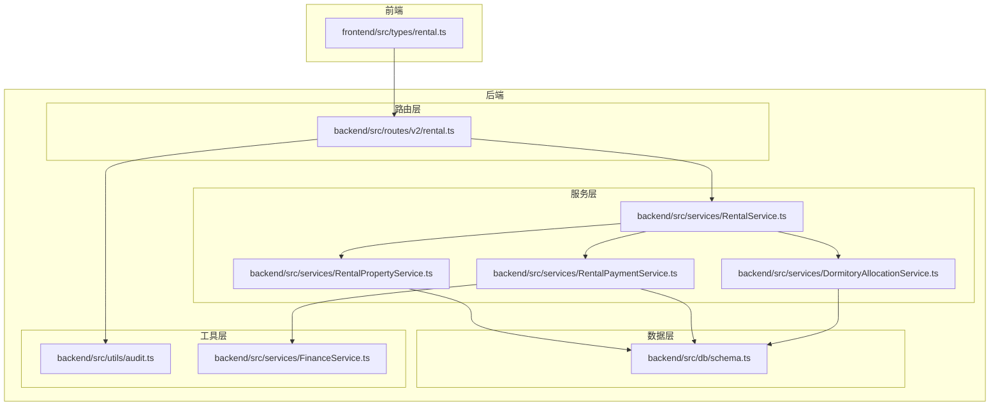
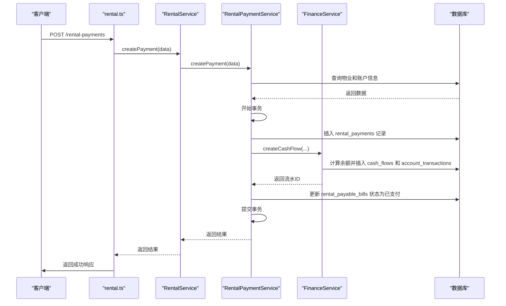
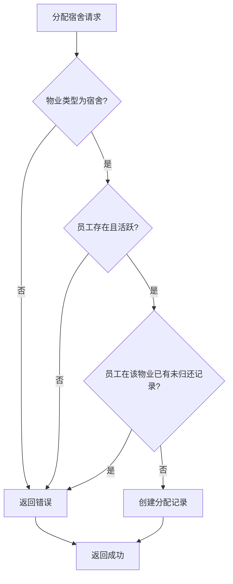
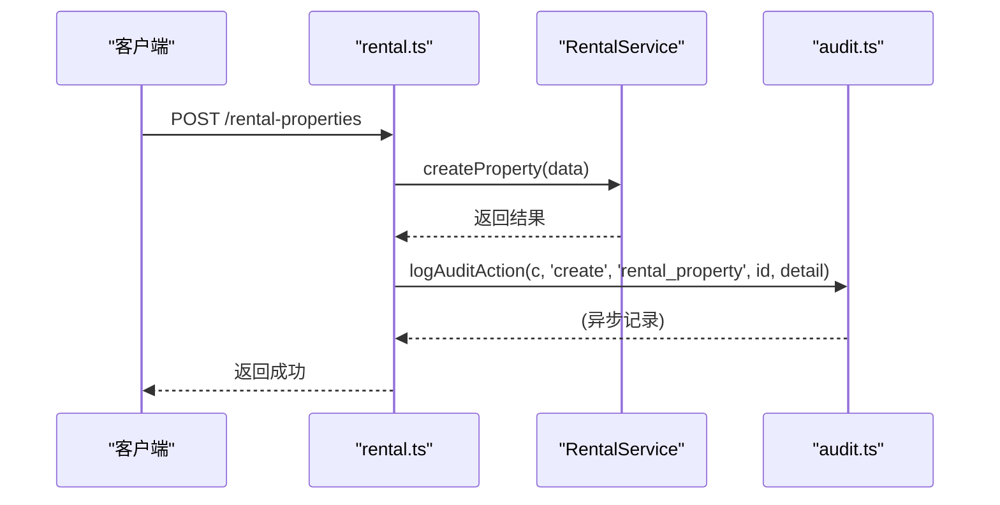
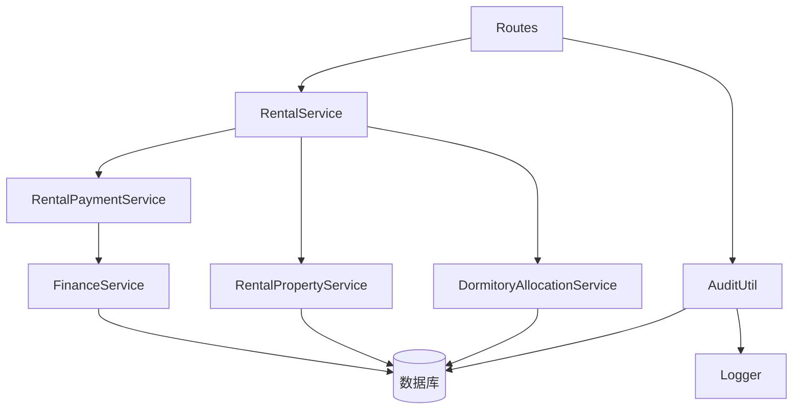

# 租赁管理路由

<cite>
**本文档引用的文件**
- [rental.ts](file://backend/src/routes/v2/rental.ts)
- [RentalService.ts](file://backend/src/services/RentalService.ts)
- [RentalPropertyService.ts](file://backend/src/services/RentalPropertyService.ts)
- [DormitoryAllocationService.ts](file://backend/src/services/DormitoryAllocationService.ts)
- [RentalPaymentService.ts](file://backend/src/services/RentalPaymentService.ts)
- [audit.ts](file://backend/src/utils/audit.ts)
- [schema.ts](file://backend/src/db/schema.ts)
- [business.schema.ts](file://backend/src/schemas/business.schema.ts)
- [FinanceService.ts](file://backend/src/services/FinanceService.ts)
- [rental.test.ts](file://backend/test/routes/rental.test.ts)
- [rental.ts](file://frontend/src/types/rental.ts)
</cite>

## 目录
1. [简介](#简介)
2. [项目结构](#项目结构)
3. [核心组件](#核心组件)
4. [架构概述](#架构概述)
5. [详细组件分析](#详细组件分析)
6. [依赖分析](#依赖分析)
7. [性能考虑](#性能考虑)
8. [故障排除指南](#故障排除指南)
9. [结论](#结论)

## 简介
本文档旨在全面阐述财务系统中租赁管理模块的API设计与实现。该模块主要负责租赁物业的维护、员工宿舍的分配与归还、以及租赁付款的处理。其核心功能是通过`POST /rental-properties/generate-payable-bills`端点，根据租赁合同的配置，周期性地自动生成应付账单，并与财务流水系统集成，确保租赁业务的完整性和可追溯性。整个流程由`RentalService`作为门面服务，协调`RentalPropertyService`、`RentalPaymentService`和`DormitoryAllocationService`三个子服务共同完成。所有关键操作均通过审计中间件进行记录，以满足合规性要求。

## 项目结构
租赁管理功能的代码分布在后端的`routes/v2`、`services`和`db`等目录中。前端则在`src/types`中定义了相关的类型。该模块遵循清晰的分层架构，路由层负责HTTP接口的定义与请求处理，服务层实现核心业务逻辑，数据访问层则通过Drizzle ORM与数据库交互。



**Diagram sources**
- [rental.ts](file://backend/src/routes/v2/rental.ts)
- [RentalService.ts](file://backend/src/services/RentalService.ts)
- [RentalPropertyService.ts](file://backend/src/services/RentalPropertyService.ts)
- [RentalPaymentService.ts](file://backend/src/services/RentalPaymentService.ts)
- [DormitoryAllocationService.ts](file://backend/src/services/DormitoryAllocationService.ts)
- [schema.ts](file://backend/src/db/schema.ts)
- [audit.ts](file://backend/src/utils/audit.ts)
- [FinanceService.ts](file://backend/src/services/FinanceService.ts)
- [rental.ts](file://frontend/src/types/rental.ts)

**Section sources**
- [rental.ts](file://backend/src/routes/v2/rental.ts)
- [RentalService.ts](file://backend/src/services/RentalService.ts)
- [RentalPropertyService.ts](file://backend/src/services/RentalPropertyService.ts)
- [RentalPaymentService.ts](file://backend/src/services/RentalPaymentService.ts)
- [DormitoryAllocationService.ts](file://backend/src/services/DormitoryAllocationService.ts)
- [schema.ts](file://backend/src/db/schema.ts)
- [audit.ts](file://backend/src/utils/audit.ts)
- [FinanceService.ts](file://backend/src/services/FinanceService.ts)
- [rental.ts](file://frontend/src/types/rental.ts)

## 核心组件
租赁管理模块的核心由`RentalService`门面类驱动，它封装了对物业、账单和付款三个子服务的调用。`RentalPropertyService`负责管理租赁物业的CRUD操作和变更历史。`DormitoryAllocationService`处理员工宿舍的分配与归还，确保一人一宿。`RentalPaymentService`是核心，它不仅处理付款记录，还负责生成应付账单，并通过`FinanceService`将付款行为转化为财务流水，实现业务与财务的集成。

**Section sources**
- [RentalService.ts](file://backend/src/services/RentalService.ts)
- [RentalPropertyService.ts](file://backend/src/services/RentalPropertyService.ts)
- [RentalPaymentService.ts](file://backend/src/services/RentalPaymentService.ts)
- [DormitoryAllocationService.ts](file://backend/src/services/DormitoryAllocationService.ts)

## 架构概述
该模块采用门面模式（Facade Pattern），`RentalService`作为统一入口，简化了外部调用。业务逻辑与数据访问分离，服务层不直接操作数据库，而是通过Drizzle ORM的查询构建器。当创建租赁付款时，`RentalPaymentService`会启动一个数据库事务，确保在创建付款记录的同时，能原子性地生成对应的财务流水和账户交易记录，保证了数据的一致性。



**Diagram sources**
- [rental.ts](file://backend/src/routes/v2/rental.ts)
- [RentalService.ts](file://backend/src/services/RentalService.ts)
- [RentalPaymentService.ts](file://backend/src/services/RentalPaymentService.ts)
- [FinanceService.ts](file://backend/src/services/FinanceService.ts)
- [schema.ts](file://backend/src/db/schema.ts)

## 详细组件分析

### 租赁物业服务分析
`RentalPropertyService`提供了对`rental_properties`表的完整操作。它支持根据物业类型、状态和部门进行筛选查询。在创建物业时，会检查物业代码的唯一性。更新物业时，如果关键字段（如租金、租期、状态）发生变化，则会自动在`rental_changes`表中创建一条变更记录，用于追踪物业的历史变更。

```mermaid
classDiagram
class RentalPropertyService {
+listProperties(query) Promise~any~
+getProperty(id) Promise~any~
+createProperty(data) Promise~{id : string}~
+updateProperty(id, data) Promise~void~
+deleteProperty(id) Promise~any~
+listRentalChanges(propertyId) Promise~any~
+createRentalChange(data) Promise~{id : string}~
}
class rentalProperties {
+id : string
+propertyCode : string
+name : string
+propertyType : string
+monthlyRentCents : number
+leaseStartDate : string
+status : string
}
class rentalChanges {
+id : string
+propertyId : string
+changeType : string
+fromMonthlyRentCents : number
+toMonthlyRentCents : number
+fromStatus : string
+toStatus : string
}
RentalPropertyService --> rentalProperties : "操作"
RentalPropertyService --> rentalChanges : "创建"
```

**Diagram sources**
- [RentalPropertyService.ts](file://backend/src/services/RentalPropertyService.ts)
- [schema.ts](file://backend/src/db/schema.ts)

**Section sources**
- [RentalPropertyService.ts](file://backend/src/services/RentalPropertyService.ts)
- [schema.ts](file://backend/src/db/schema.ts)

### 宿舍分配服务分析
`DormitoryAllocationService`专门处理员工宿舍的分配与归还。其核心业务规则包括：1) 只能对类型为`dormitory`的物业进行分配；2) 员工必须是活跃状态；3) 同一员工在同一物业下不能有未归还的分配记录。分配成功后，会生成一条`dormitory_allocations`记录。归还操作则通过更新`returnDate`字段来标记。



**Diagram sources**
- [DormitoryAllocationService.ts](file://backend/src/services/DormitoryAllocationService.ts)
- [schema.ts](file://backend/src/db/schema.ts)

**Section sources**
- [DormitoryAllocationService.ts](file://backend/src/services/DormitoryAllocationService.ts)
- [schema.ts](file://backend/src/db/schema.ts)

### 租赁付款与应付账单分析
`RentalPaymentService`是整个租赁模块的核心。它通过`generatePayableBills`方法实现周期性账单的生成。该方法会遍历所有状态为`active`且有租期的物业，根据其`paymentPeriodMonths`和`paymentDay`计算出下一个付款日期。如果该日期在当前日期之后15天内，则生成一张新的应付账单。创建付款时，会调用`FinanceService`来生成财务流水和账户交易，确保资金流动被正确记录。

```mermaid
classDiagram
class RentalPaymentService {
+listPayments(query) Promise~any~
+createPayment(data) Promise~{id, flowId, voucherNo}~
+updatePayment(id, data) Promise~void~
+deletePayment(id) Promise~any~
+generatePayableBills(userId) Promise~{generated, bills}~
+listPayableBills(query) Promise~any~
+markBillPaid(id) Promise~{ok : boolean}~
}
class rentalPayments {
+id : string
+propertyId : string
+year : number
+month : number
+amountCents : number
}
class rentalPayableBills {
+id : string
+propertyId : string
+dueDate : string
+amountCents : number
+status : string
+paidPaymentId : string
}
class cashFlows {
+id : string
+voucherNo : string
+type : string
+amountCents : number
}
class accountTransactions {
+id : string
+flowId : string
+balanceBeforeCents : number
+balanceAfterCents : number
}
RentalPaymentService --> rentalPayments : "CRUD"
RentalPaymentService --> rentalPayableBills : "CRUD"
RentalPaymentService --> FinanceService : "委托"
FinanceService --> cashFlows : "创建"
FinanceService --> accountTransactions : "创建"
```

**Diagram sources**
- [RentalPaymentService.ts](file://backend/src/services/RentalPaymentService.ts)
- [FinanceService.ts](file://backend/src/services/FinanceService.ts)
- [schema.ts](file://backend/src/db/schema.ts)

**Section sources**
- [RentalPaymentService.ts](file://backend/src/services/RentalPaymentService.ts)
- [FinanceService.ts](file://backend/src/services/FinanceService.ts)
- [schema.ts](file://backend/src/db/schema.ts)

### 门面服务与审计分析
`RentalService`作为门面，将复杂的子服务调用封装起来，对外提供简洁的接口。例如，`getProperty`方法会同时获取物业信息、付款记录和分配记录。所有关键的写操作（创建、更新、删除）在路由层处理完毕后，都会调用`logAuditAction`函数，将操作记录到`auditLogs`表中，包括操作者、操作类型、实体、实体ID和操作详情。



**Diagram sources**
- [RentalService.ts](file://backend/src/services/RentalService.ts)
- [rental.ts](file://backend/src/routes/v2/rental.ts)
- [audit.ts](file://backend/src/utils/audit.ts)

**Section sources**
- [RentalService.ts](file://backend/src/services/RentalService.ts)
- [rental.ts](file://backend/src/routes/v2/rental.ts)
- [audit.ts](file://backend/src/utils/audit.ts)

## 依赖分析
该模块的依赖关系清晰。`RentalService`依赖于三个具体的子服务。`RentalPaymentService`除了依赖数据库外，还强依赖于`FinanceService`来处理财务流水。`FinanceService`自身也依赖数据库，并实现了乐观锁机制来防止账户余额的并发修改。审计工具`audit.ts`依赖于`Logger`和数据库会话管理，但它以非阻塞的方式记录日志，避免影响主业务流程。



**Diagram sources**
- [RentalService.ts](file://backend/src/services/RentalService.ts)
- [RentalPropertyService.ts](file://backend/src/services/RentalPropertyService.ts)
- [RentalPaymentService.ts](file://backend/src/services/RentalPaymentService.ts)
- [DormitoryAllocationService.ts](file://backend/src/services/DormitoryAllocationService.ts)
- [FinanceService.ts](file://backend/src/services/FinanceService.ts)
- [audit.ts](file://backend/src/utils/audit.ts)
- [schema.ts](file://backend/src/db/schema.ts)

**Section sources**
- [RentalService.ts](file://backend/src/services/RentalService.ts)
- [RentalPropertyService.ts](file://backend/src/services/RentalPropertyService.ts)
- [RentalPaymentService.ts](file://backend/src/services/RentalPaymentService.ts)
- [DormitoryAllocationService.ts](file://backend/src/services/DormitoryAllocationService.ts)
- [FinanceService.ts](file://backend/src/services/FinanceService.ts)
- [audit.ts](file://backend/src/utils/audit.ts)
- [schema.ts](file://backend/src/db/schema.ts)

## 性能考虑
1.  **数据库查询优化**：所有列表查询都使用了`leftJoin`来获取关联信息（如部门名称、账户名称），减少了前端的多次请求。`listProperties`等方法使用了`orderBy(desc(rentalProperties.createdAt))`，并建议在`createdAt`字段上建立索引。
2.  **事务处理**：`createPayment`方法使用了数据库事务，确保了付款记录、财务流水和账单状态更新的原子性。
3.  **乐观锁**：`FinanceService`在处理财务流水时，通过更新`accounts`表的`version`字段来实现乐观锁，有效防止了并发修改导致的余额错误。
4.  **异步审计**：审计日志的记录通过`ctx.waitUntil()`在后台异步执行，避免了阻塞主业务流程，提升了API响应速度。

## 故障排除指南
1.  **无法创建付款**：检查`propertyId`和`accountId`是否正确，确认物业和账户是否存在且状态为`active`。检查账户币种是否与付款币种匹配。
2.  **无法生成应付账单**：确认物业的`status`为`active`，并且`leaseStartDate`和`leaseEndDate`已设置。检查`paymentPeriodMonths`和`paymentDay`的配置是否正确。
3.  **无法分配宿舍**：确认`propertyType`为`dormitory`，员工状态为`active`，并且该员工在该宿舍没有未归还的记录。
4.  **删除物业失败**：系统会检查该物业下是否存在付款记录，如果有，则不允许删除。需要先删除所有相关的付款记录。
5.  **审计日志缺失**：检查`logAuditAction`函数的调用是否在所有关键操作之后，并确认`auditService`已正确注入到请求上下文中。

**Section sources**
- [RentalPaymentService.ts](file://backend/src/services/RentalPaymentService.ts)
- [RentalPropertyService.ts](file://backend/src/services/RentalPropertyService.ts)
- [DormitoryAllocationService.ts](file://backend/src/services/DormitoryAllocationService.ts)
- [audit.ts](file://backend/src/utils/audit.ts)

## 结论
租赁管理模块通过清晰的分层架构和门面模式，实现了租赁业务的完整闭环。其核心亮点在于`RentalPaymentService`能够自动化地生成应付账单，并通过与`FinanceService`的集成，无缝地将业务操作转化为财务流水，极大地提高了财务处理的效率和准确性。严格的业务规则（如宿舍分配）和全面的审计日志确保了系统的安全与合规。整体设计合理，代码结构清晰，易于维护和扩展。