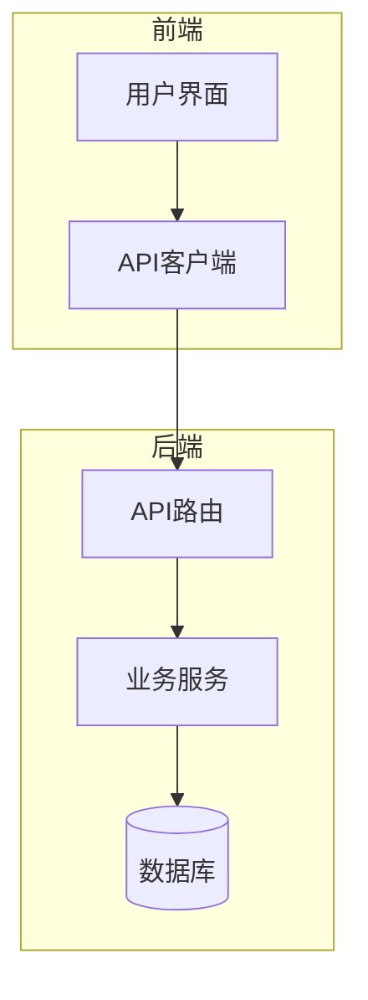
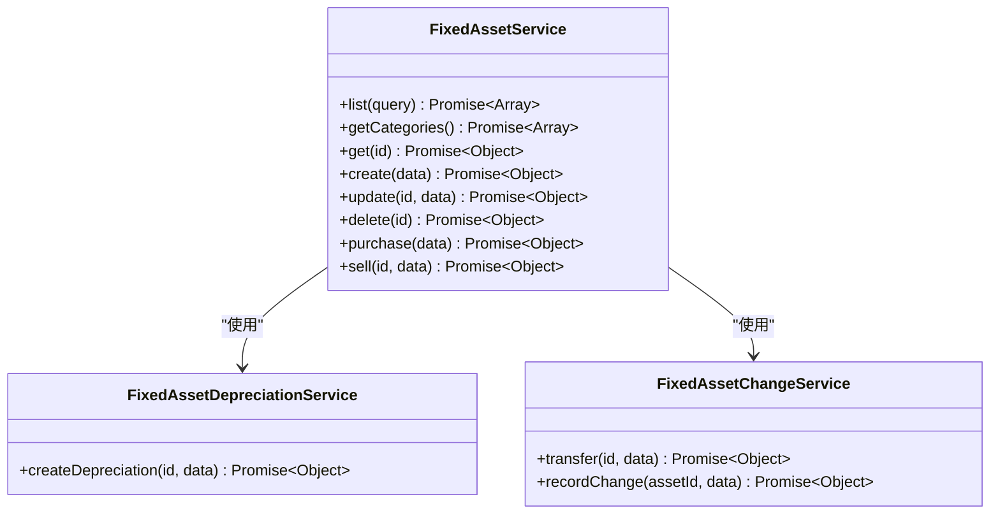
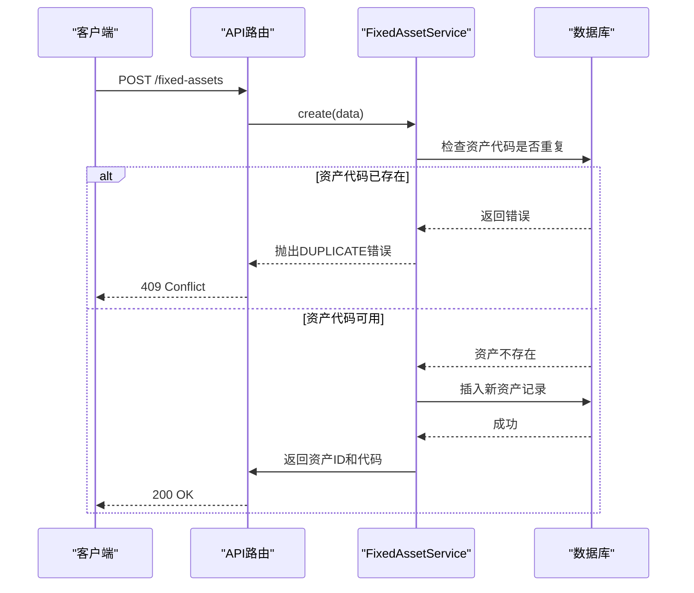
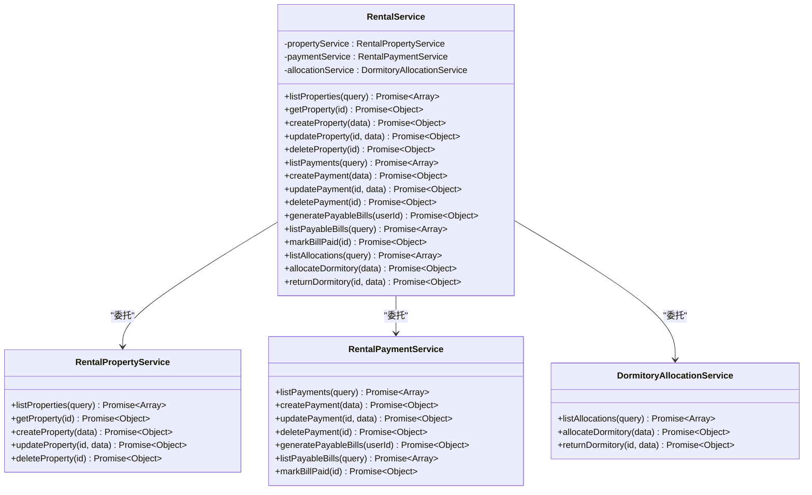
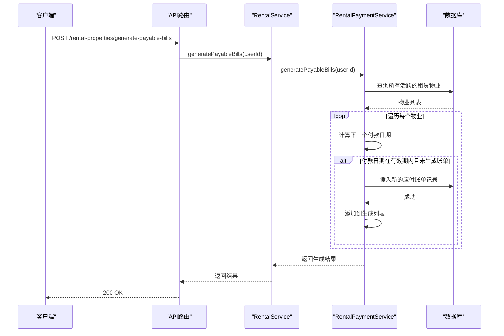
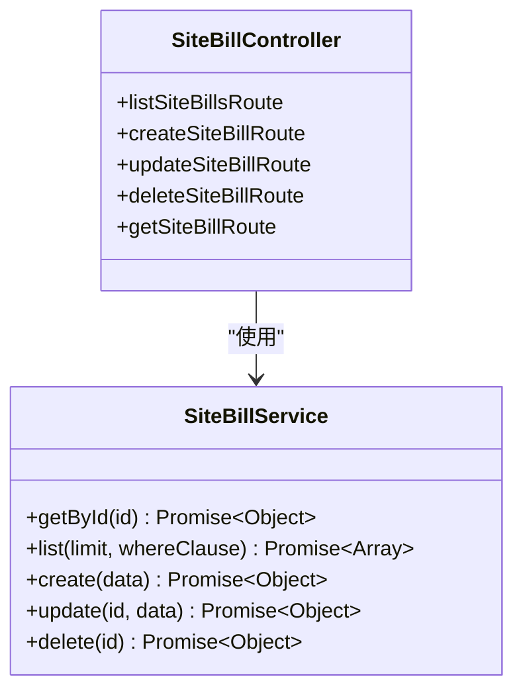
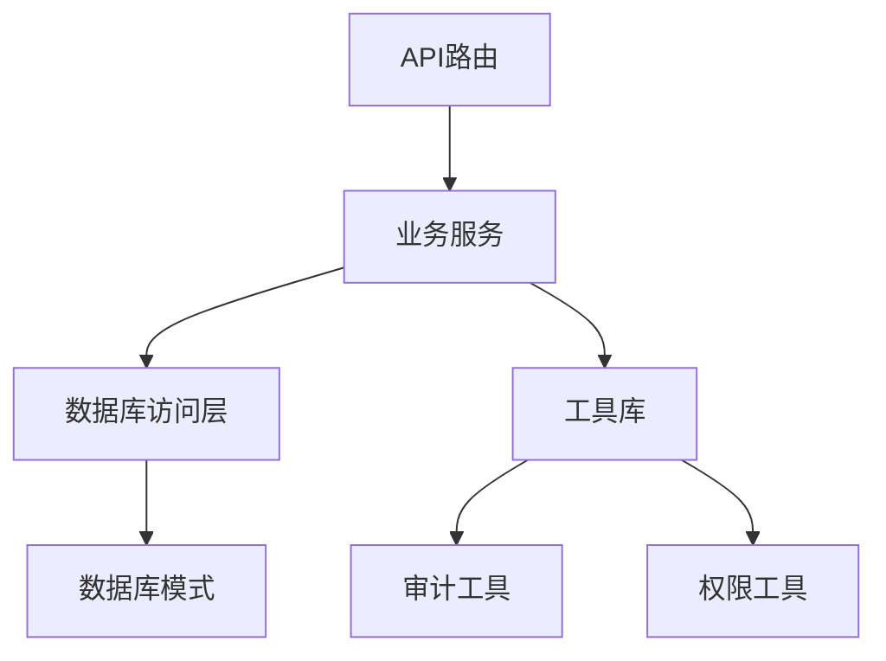

# 资产管理路由

<cite>
**本文档引用的文件**   
- [fixed-assets.ts](file://backend/src/routes/v2/fixed-assets.ts)
- [rental.ts](file://backend/src/routes/v2/rental.ts)
- [site-bills.ts](file://backend/src/routes/v2/site-bills.ts)
- [FixedAssetService.ts](file://backend/src/services/FixedAssetService.ts)
- [RentalService.ts](file://backend/src/services/RentalService.ts)
- [SiteBillService.ts](file://backend/src/services/SiteBillService.ts)
- [FixedAssetDepreciationService.ts](file://backend/src/services/FixedAssetDepreciationService.ts)
- [FixedAssetChangeService.ts](file://backend/src/services/FixedAssetChangeService.ts)
- [RentalPropertyService.ts](file://backend/src/services/RentalPropertyService.ts)
- [RentalPaymentService.ts](file://backend/src/services/RentalPaymentService.ts)
- [DormitoryAllocationService.ts](file://backend/src/services/DormitoryAllocationService.ts)
- [audit.ts](file://backend/src/utils/audit.ts)
- [schema.ts](file://backend/src/db/schema.ts)
</cite>

## 目录
1. [引言](#引言)
2. [项目结构](#项目结构)
3. [核心组件](#核心组件)
4. [架构概述](#架构概述)
5. [详细组件分析](#详细组件分析)
6. [依赖分析](#依赖分析)
7. [性能考虑](#性能考虑)
8. [故障排除指南](#故障排除指南)
9. [结论](#结论)

## 引言
本文档旨在为财务管理系统中的固定资产管理与租赁管理相关API提供全面的技术文档。文档覆盖了资产登记、折旧计算、调拨处置（fixed-assets）、租赁物业维护（rental）以及场地账单处理（site-bills）等核心端点。重点阐述了资产状态变更的RESTful设计模式，说明如何通过PATCH请求触发状态机转换。同时，文档详细描述了租赁账单的周期性生成逻辑及其API接口设计。通过分析RentalService和FixedAssetService，揭示了业务逻辑的封装方式，并展示了如何利用数据库触发器与审计中间件确保资产变更的可追溯性。

## 项目结构
项目采用分层架构设计，后端代码位于`backend/src`目录下，主要分为`routes`、`services`、`db`、`utils`等模块。`routes`目录存放API路由定义，`services`目录包含业务逻辑服务，`db`目录管理数据库模式和迁移，`utils`目录提供通用工具函数。前端代码位于`frontend`目录，采用现代前端框架构建用户界面。整体结构清晰，职责分离明确，便于维护和扩展。

**Section sources**
- [project_structure](file://)

## 核心组件
系统的核心组件包括固定资产服务（FixedAssetService）、租赁服务（RentalService）和场地账单服务（SiteBillService）。这些服务通过清晰的API接口与前端交互，实现了资产全生命周期管理、租赁物业维护和场地费用处理等关键业务功能。每个服务都封装了复杂的业务逻辑，并通过中间件确保了权限控制和操作审计。

**Section sources**
- [fixed-assets.ts](file://backend/src/routes/v2/fixed-assets.ts)
- [rental.ts](file://backend/src/routes/v2/rental.ts)
- [site-bills.ts](file://backend/src/routes/v2/site-bills.ts)

## 架构概述
系统采用微服务架构风格，通过Hono框架实现RESTful API。业务逻辑被封装在独立的服务类中，如`FixedAssetService`和`RentalService`，这些服务通过依赖注入的方式在路由处理器中使用。数据访问层使用Drizzle ORM与SQLite数据库交互，确保了数据操作的安全性和一致性。整个架构强调了模块化、可测试性和可维护性。

**Diagram sources **
- [fixed-assets.ts](file://backend/src/routes/v2/fixed-assets.ts)
- [rental.ts](file://backend/src/routes/v2/rental.ts)
- [site-bills.ts](file://backend/src/routes/v2/site-bills.ts)

## 详细组件分析

### 固定资产管理分析
固定资产模块提供了资产的全生命周期管理功能，包括创建、更新、删除、折旧、调拨和变卖等操作。资产状态机确保了状态转换的合法性，所有变更操作都会被记录并触发审计日志。

#### 固定资产服务类图

**Diagram sources **
- [FixedAssetService.ts](file://backend/src/services/FixedAssetService.ts)
- [FixedAssetDepreciationService.ts](file://backend/src/services/FixedAssetDepreciationService.ts)
- [FixedAssetChangeService.ts](file://backend/src/services/FixedAssetChangeService.ts)

#### 固定资产创建流程序列图

**Diagram sources **
- [fixed-assets.ts](file://backend/src/routes/v2/fixed-assets.ts)
- [FixedAssetService.ts](file://backend/src/services/FixedAssetService.ts)

### 租赁管理分析
租赁管理模块采用门面模式（Facade Pattern），通过`RentalService`统一对外提供接口，内部委托给`RentalPropertyService`、`RentalPaymentService`和`DormitoryAllocationService`三个具体服务。这种设计简化了客户端的调用，同时保持了内部模块的独立性。

#### 租赁服务类图

**Diagram sources **
- [RentalService.ts](file://backend/src/services/RentalService.ts)
- [RentalPropertyService.ts](file://backend/src/services/RentalPropertyService.ts)
- [RentalPaymentService.ts](file://backend/src/services/RentalPaymentService.ts)
- [DormitoryAllocationService.ts](file://backend/src/services/DormitoryAllocationService.ts)

#### 租赁账单生成流程序列图

**Diagram sources **
- [rental.ts](file://backend/src/routes/v2/rental.ts)
- [RentalService.ts](file://backend/src/services/RentalService.ts)
- [RentalPaymentService.ts](file://backend/src/services/RentalPaymentService.ts)

### 场地账单管理分析
场地账单模块提供了对场地相关费用的增删改查功能，支持按场地、日期范围、账单类型和状态进行查询。该模块与固定资产和租赁管理模块并列，共同构成了系统的资产管理核心。

#### 场地账单服务类图

**Diagram sources **
- [site-bills.ts](file://backend/src/routes/v2/site-bills.ts)
- [SiteBillService.ts](file://backend/src/services/SiteBillService.ts)

## 依赖分析
系统各组件之间存在清晰的依赖关系。API路由依赖于业务服务，业务服务依赖于数据库访问层和工具库。通过依赖注入，服务实例被传递给路由处理器，实现了控制反转。数据库模式文件（schema.ts）是所有数据访问操作的基础，被服务层和路由层共同依赖。

**Diagram sources **
- [fixed-assets.ts](file://backend/src/routes/v2/fixed-assets.ts)
- [rental.ts](file://backend/src/routes/v2/rental.ts)
- [site-bills.ts](file://backend/src/routes/v2/site-bills.ts)
- [FixedAssetService.ts](file://backend/src/services/FixedAssetService.ts)
- [RentalService.ts](file://backend/src/services/RentalService.ts)
- [SiteBillService.ts](file://backend/src/services/SiteBillService.ts)
- [audit.ts](file://backend/src/utils/audit.ts)

**Section sources**
- [fixed-assets.ts](file://backend/src/routes/v2/fixed-assets.ts)
- [rental.ts](file://backend/src/routes/v2/rental.ts)
- [site-bills.ts](file://backend/src/routes/v2/site-bills.ts)
- [FixedAssetService.ts](file://backend/src/services/FixedAssetService.ts)
- [RentalService.ts](file://backend/src/services/RentalService.ts)
- [SiteBillService.ts](file://backend/src/services/SiteBillService.ts)
- [audit.ts](file://backend/src/utils/audit.ts)

## 性能考虑
系统在性能方面进行了多项优化。数据库查询使用了索引和分页，避免了全表扫描。服务层采用了批量获取关联数据的策略，减少了数据库往返次数。审计日志的记录使用了`waitUntil`机制，确保不会阻塞主请求流程。对于复杂的计算，如折旧计算和账单生成，系统在事务中执行，保证了数据的一致性。

## 故障排除指南
当遇到API调用失败时，首先检查请求的权限是否正确。对于403错误，确认用户是否具有执行该操作的权限。对于404错误，检查资源ID是否正确。对于409错误，通常是资源冲突，如资产代码重复。对于500错误，查看服务日志以获取更详细的错误信息。审计日志是排查问题的重要工具，可以追溯所有关键操作的历史记录。

**Section sources**
- [fixed-assets.ts](file://backend/src/routes/v2/fixed-assets.ts)
- [rental.ts](file://backend/src/routes/v2/rental.ts)
- [site-bills.ts](file://backend/src/routes/v2/site-bills.ts)
- [audit.ts](file://backend/src/utils/audit.ts)

## 结论
本文档全面介绍了财务管理系统中的资产管理与租赁管理API。通过分析代码结构和业务逻辑，展示了系统如何实现资产全生命周期管理、租赁物业维护和场地账单处理。系统设计遵循了RESTful原则，采用了清晰的分层架构和模块化设计，确保了代码的可维护性和可扩展性。审计机制和状态机的引入，进一步增强了系统的安全性和数据一致性。