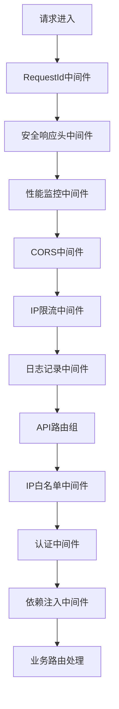
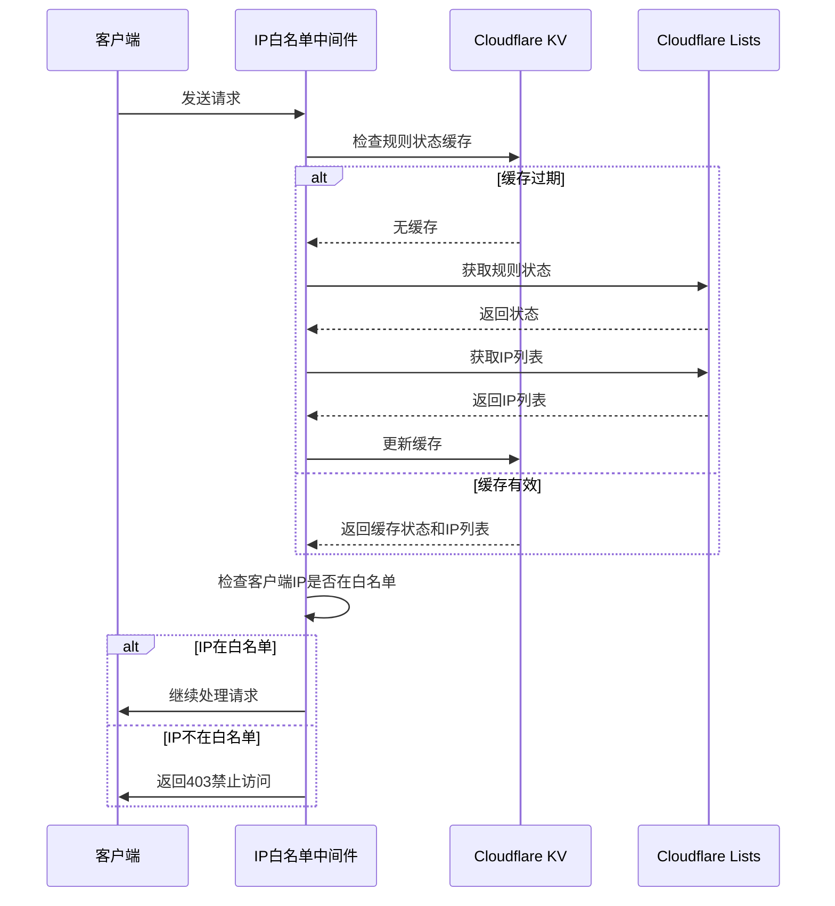
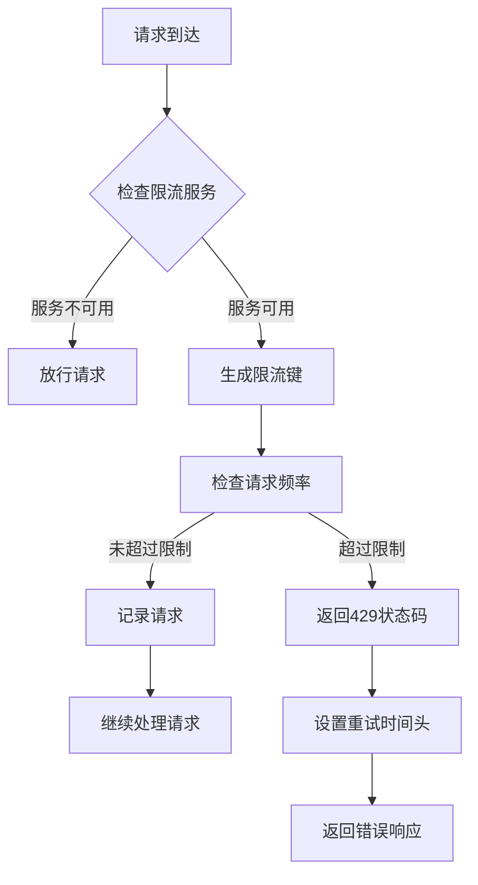
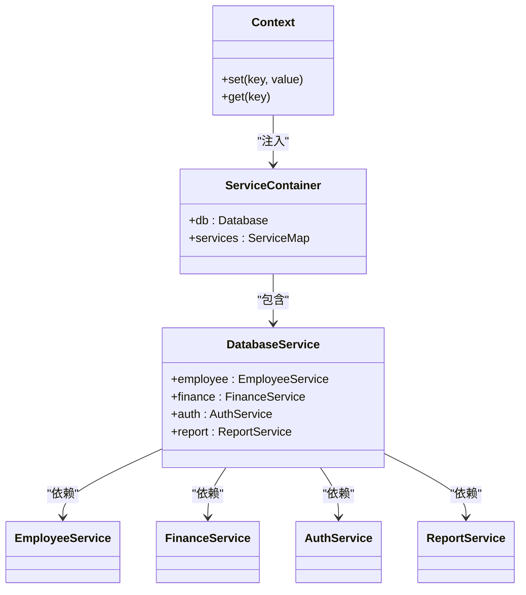
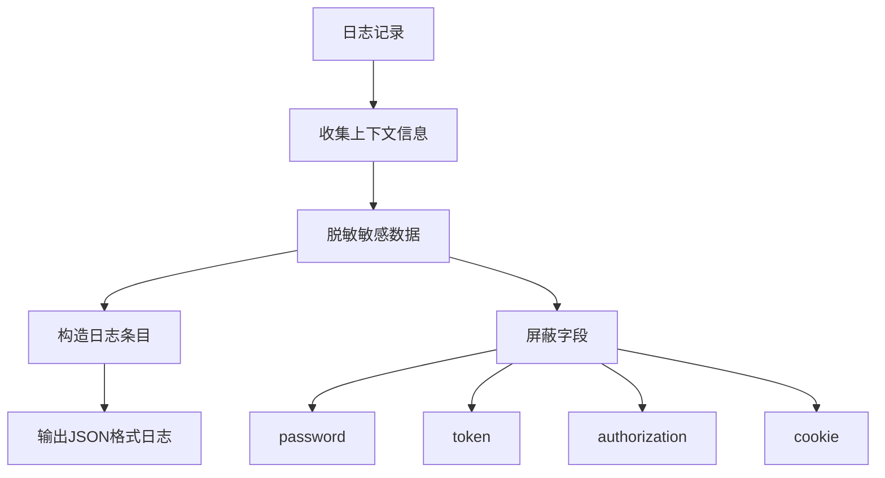

# 中间件系统

<cite>
**本文档引用的文件**
- [middleware.ts](file://backend/src/middleware.ts)
- [middleware/di.ts](file://backend/src/middleware/di.ts)
- [middleware/requestId.ts](file://backend/src/middleware/requestId.ts)
- [middleware/security.ts](file://backend/src/middleware/security.ts)
- [middleware/performance.ts](file://backend/src/middleware/performance.ts)
- [middleware/ipWhitelist.ts](file://backend/src/middleware/ipWhitelist.ts)
- [middleware/rateLimit.ts](file://backend/src/middleware/rateLimit.ts)
- [utils/logger.ts](file://backend/src/utils/logger.ts)
- [index.ts](file://backend/src/index.ts)
- [services/RateLimitService.ts](file://backend/src/services/RateLimitService.ts)
- [services/IPWhitelistService.ts](file://backend/src/services/IPWhitelistService.ts)
- [routes/v2/auth.ts](file://backend/src/routes/v2/auth.ts)
- [utils/validation.ts](file://backend/src/utils/validation.ts)
</cite>

## 目录
1. [引言](#引言)
2. [中间件链构建](#中间件链构建)
3. [全局中间件执行顺序与功能](#全局中间件执行顺序与功能)
4. [自定义中间件实现](#自定义中间件实现)
5. [上下文数据传递与依赖注入](#上下文数据传递与依赖注入)
6. [日志中间件](#日志中间件)
7. [结论](#结论)

## 引言

本系统采用Hono框架构建了完整的中间件体系，实现了从请求标识、安全防护、性能监控到身份认证的全流程处理。中间件系统通过分层设计，将不同职责的中间件按特定顺序组合，确保每个请求都能得到安全、高效、可追踪的处理。

## 中间件链构建

系统的中间件链在`index.ts`文件中通过模块化方式构建，采用分层应用策略。全局中间件应用于所有请求，而API特定中间件则通过版本化路由组进行管理。

**Diagram sources**
- [index.ts](file://backend/src/index.ts#L56-L81)
- [index.ts](file://backend/src/index.ts#L313-L315)

**Section sources**
- [index.ts](file://backend/src/index.ts#L56-L81)
- [index.ts](file://backend/src/index.ts#L313-L315)

## 全局中间件执行顺序与功能

### requestIdMiddleware
生成唯一请求ID，用于请求追踪和日志关联。优先检查`cf-ray`或`x-request-id`头部，若不存在则生成UUID。

**Section sources**
- [middleware/requestId.ts](file://backend/src/middleware/requestId.ts#L4-L18)

### securityHeaders
设置安全响应头，包括内容类型保护、点击劫持防护、XSS过滤、HTTPS强制等，提升应用安全性。

**Section sources**
- [middleware/security.ts](file://backend/src/middleware/security.ts#L19-L79)

### cors
处理跨域请求，根据来源域名动态设置响应头，支持本地开发和生产环境的跨域需求。

**Section sources**
- [index.ts](file://backend/src/index.ts#L59-L77)

### performanceMonitor
记录请求处理时间、响应大小等性能指标，对超过1秒的慢请求进行特殊标记。

**Section sources**
- [middleware/performance.ts](file://backend/src/middleware/performance.ts#L14-L68)

### authMiddleware
JWT与数据库会话结合的身份认证，通过滑动窗口机制自动续期会话，减少数据库查询压力。

**Section sources**
- [middleware.ts](file://backend/src/middleware.ts#L17-L110)

## 自定义中间件实现

### validateJson
使用Zod进行请求体验证，确保输入数据符合预期格式。虽然未在提供的代码中直接展示，但通过OpenAPI路由定义可推断其存在。

### ipWhitelist
基于Cloudflare Lists实现的IP白名单访问控制，支持动态添加、删除IP地址，并通过KV缓存提高查询效率。

**Diagram sources**
- [middleware/ipWhitelist.ts](file://backend/src/middleware/ipWhitelist.ts#L12-L75)
- [services/IPWhitelistService.ts](file://backend/src/services/IPWhitelistService.ts#L1-L141)

**Section sources**
- [middleware/ipWhitelist.ts](file://backend/src/middleware/ipWhitelist.ts#L12-L75)

### rateLimit
保护敏感接口的请求限流，基于Cloudflare KV实现滑动窗口算法，支持多种限流策略。

**Diagram sources**
- [middleware/rateLimit.ts](file://backend/src/middleware/rateLimit.ts#L21-L59)
- [services/RateLimitService.ts](file://backend/src/services/RateLimitService.ts#L15-L94)

**Section sources**
- [middleware/rateLimit.ts](file://backend/src/middleware/rateLimit.ts#L21-L59)
- [services/RateLimitService.ts](file://backend/src/services/RateLimitService.ts#L1-L145)

## 上下文数据传递与依赖注入

### 依赖注入中间件
`di.ts`文件中的依赖注入中间件负责初始化所有服务实例，并通过Hono的Context机制注入到请求上下文中。

**Diagram sources**
- [middleware/di.ts](file://backend/src/middleware/di.ts#L41-L155)

**Section sources**
- [middleware/di.ts](file://backend/src/middleware/di.ts#L41-L155)

### 数据传递机制
中间件通过`c.set()`方法将数据写入Context，后续中间件和路由处理器通过`c.get()`方法读取。例如，认证中间件将用户ID、职位信息等写入Context，供后续业务逻辑使用。

## 日志中间件

### logger.ts
日志中间件负责记录请求上下文信息，并对敏感数据进行脱敏处理。

**Diagram sources**
- [utils/logger.ts](file://backend/src/utils/logger.ts#L15-L52)

**Section sources**
- [utils/logger.ts](file://backend/src/utils/logger.ts#L15-L110)

### 脱敏机制
日志系统内置敏感字段列表，自动识别并屏蔽密码、令牌、授权信息等敏感数据，确保日志安全。

## 结论

本中间件系统通过分层设计和模块化实现，构建了一个安全、高效、可维护的请求处理管道。各中间件职责单一，通过Context机制实现数据共享，依赖注入模式降低了组件间的耦合度。系统不仅提供了基础的请求处理功能，还集成了性能监控、安全防护、访问控制等企业级特性，为业务的稳定运行提供了坚实基础。