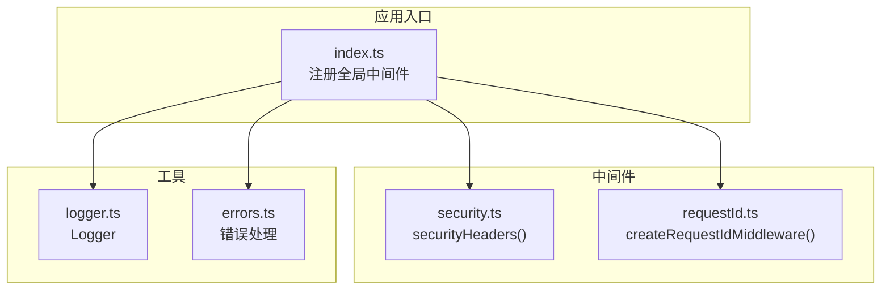
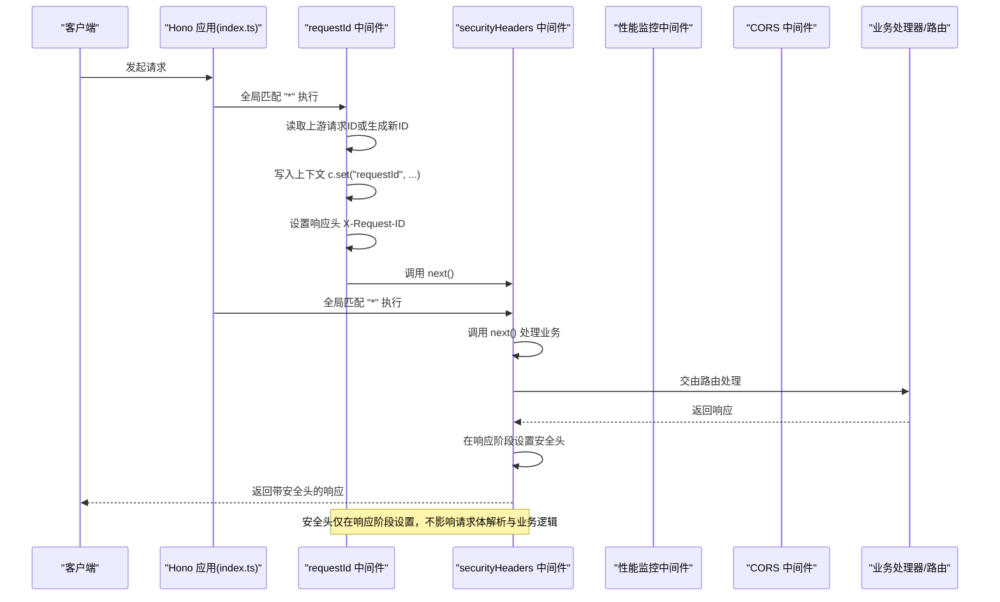
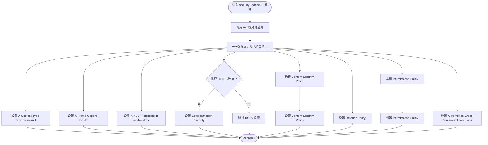
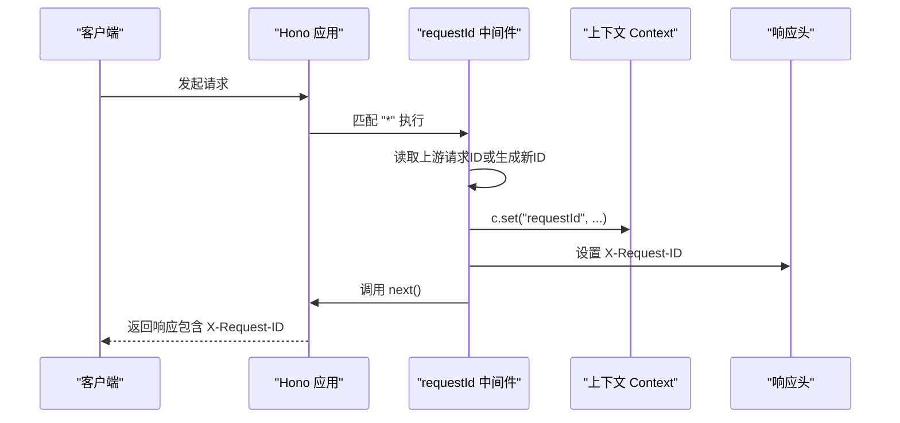
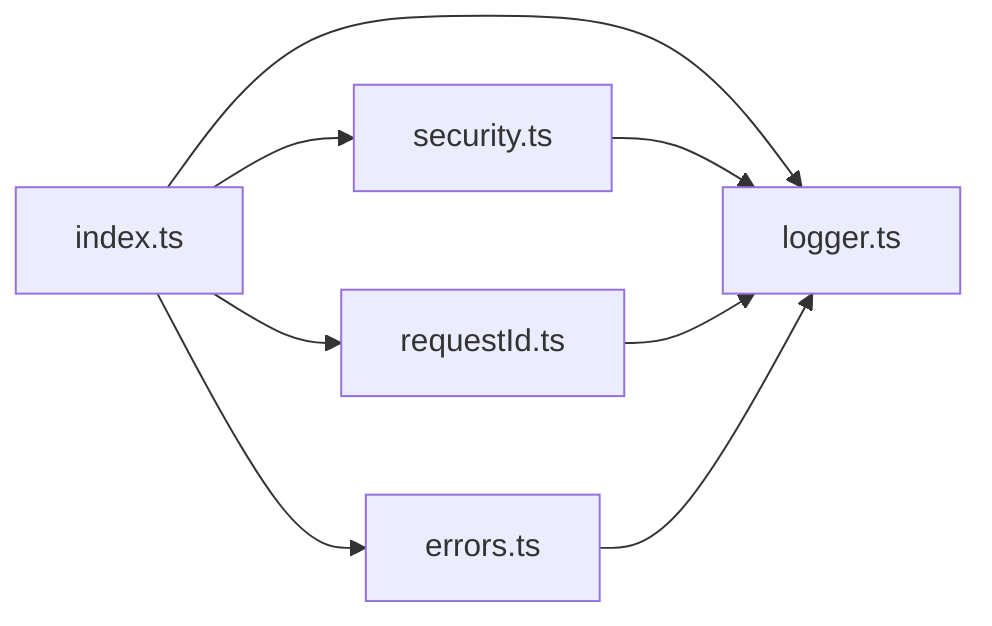

# 安全中间件

<cite>
**本文引用的文件**
- [security.ts](file://backend/src/middleware/security.ts)
- [requestId.ts](file://backend/src/middleware/requestId.ts)
- [index.ts](file://backend/src/index.ts)
- [logger.ts](file://backend/src/utils/logger.ts)
- [errors.ts](file://backend/src/utils/errors.ts)
</cite>

## 目录
1. [简介](#简介)
2. [项目结构](#项目结构)
3. [核心组件](#核心组件)
4. [架构总览](#架构总览)
5. [组件详解](#组件详解)
6. [依赖关系分析](#依赖关系分析)
7. [性能考量](#性能考量)
8. [故障排查指南](#故障排查指南)
9. [结论](#结论)

## 简介
本文件聚焦于后端安全中间件，包括：
- securityHeaders 中间件：统一设置安全响应头，强化浏览器与网络层防护，涵盖 Content-Security-Policy、X-Content-Type-Options、X-Frame-Options、X-XSS-Protection、Strict-Transport-Security、Referrer-Policy、Permissions-Policy、X-Permitted-Cross-Domain-Policies 等。
- requestId 中间件：生成唯一请求 ID（优先复用上游传入的请求 ID），注入到请求上下文与响应头，便于全链路追踪与日志关联。
- 结合 Hono 中间件链顺序，说明两者对系统安全性与可观测性的增强作用。

## 项目结构
安全相关中间件位于 backend/src/middleware 目录，全局中间件在 backend/src/index.ts 中注册；日志工具在 backend/src/utils/logger.ts 中实现，可从上下文中读取请求 ID 与用户信息。

图表来源
- [index.ts](file://backend/src/index.ts#L52-L96)
- [security.ts](file://backend/src/middleware/security.ts#L19-L80)
- [requestId.ts](file://backend/src/middleware/requestId.ts#L1-L18)
- [logger.ts](file://backend/src/utils/logger.ts#L54-L110)
- [errors.ts](file://backend/src/utils/errors.ts#L138-L228)

章节来源
- [index.ts](file://backend/src/index.ts#L52-L96)

## 核心组件
- securityHeaders 中间件
  - 在请求处理完成后设置安全响应头，覆盖常见 Web 攻击面，如 MIME 嗅探、点击劫持、XSS、强制 HTTPS、内容来源白名单、跨域策略与浏览器能力控制。
- requestId 中间件
  - 优先复用上游传入的请求 ID（例如来自 Cloudflare 或负载均衡器），否则生成新的标识；将该 ID 注入上下文与响应头，供日志与审计使用。

章节来源
- [security.ts](file://backend/src/middleware/security.ts#L19-L80)
- [requestId.ts](file://backend/src/middleware/requestId.ts#L1-L18)

## 架构总览
下图展示了 Hono 中间件链中安全与请求 ID 中间件的执行顺序与影响范围。

图表来源
- [index.ts](file://backend/src/index.ts#L52-L96)
- [security.ts](file://backend/src/middleware/security.ts#L19-L80)
- [requestId.ts](file://backend/src/middleware/requestId.ts#L1-L18)

章节来源
- [index.ts](file://backend/src/index.ts#L52-L96)

## 组件详解

### securityHeaders 中间件
- 功能要点
  - 在调用 next() 之后设置安全响应头，确保对最终响应生效。
  - 关键头说明
    - X-Content-Type-Options: nosniff，阻止浏览器 MIME 类型嗅探，降低 MIME 型攻击风险。
    - X-Frame-Options: DENY，禁止页面被嵌入 iframe，缓解点击劫持。
    - X-XSS-Protection: 1; mode=block，启用浏览器内置 XSS 过滤器。
    - Strict-Transport-Security: 仅在 HTTPS 下设置，强制后续通信走 HTTPS，支持子域名与预加载。
    - Content-Security-Policy: 默认仅允许同源，允许必要的第三方资源（如 Cloudflare CDN、字体等），限制 frame-ancestors、form-action 等，降低 XSS 与注入风险。
    - Referrer-Policy: strict-origin-when-cross-origin，控制 referrer 信息泄露范围。
    - Permissions-Policy: 禁用摄像头、麦克风、支付等不常用能力，降低浏览器侧滥用风险。
    - X-Permitted-Cross-Domain-Policies: none，限制跨域策略文件使用。
- 安全影响
  - 显著降低常见 Web 攻击面，包括点击劫持、XSS、MIME 嗅探、不安全传输等。
  - CSP 策略可根据前端部署位置（如 Cloudflare Pages）进行调整，确保静态资源与 WebSocket 正常访问。

章节来源
- [security.ts](file://backend/src/middleware/security.ts#L19-L80)

### requestId 中间件
- 功能要点
  - 优先从请求头读取上游请求 ID（如 cf-ray、x-request-id），若不存在则生成新的标识。
  - 将请求 ID 写入上下文 c.set('requestId', ...)，供日志与审计使用。
  - 将请求 ID 写入响应头 X-Request-ID，便于客户端调试与跨服务追踪。
- 上下文与日志一致性
  - 日志工具 Logger.getContext 会从上下文读取 requestId，保证日志条目与请求 ID 关联一致。
  - 错误处理中间件在记录错误时同样可携带上下文，确保问题定位时具备完整链路信息。

章节来源
- [requestId.ts](file://backend/src/middleware/requestId.ts#L1-L18)
- [logger.ts](file://backend/src/utils/logger.ts#L54-L110)
- [errors.ts](file://backend/src/utils/errors.ts#L138-L228)

### 中间件链顺序与执行时机
- 全局中间件注册顺序（节选）
  - 全局请求 ID 中间件：app.use('*', createRequestIdMiddleware())
  - 安全响应头中间件：app.use('*', securityHeaders())
  - 性能监控中间件：app.use('*', performanceMonitor())
  - CORS 中间件：app.use('*', cors(...))
  - 通用 API 速率限制：app.use('/api/*', apiRateLimitByIP)
  - 请求完成日志中间件：app.use('*', async (c, next) => {...})，在 next() 后记录耗时与状态码
- 执行顺序与影响
  - 请求 ID 中间件先于安全头中间件执行，确保安全头设置时上下文已包含 requestId。
  - 安全头中间件在 next() 之后设置，不会干扰请求体解析与业务逻辑，仅影响响应阶段。
  - 请求完成日志中间件在安全头设置之后，可完整记录响应状态与耗时，且可携带 requestId 与用户信息。

章节来源
- [index.ts](file://backend/src/index.ts#L52-L96)

### 安全响应头设置流程（流程图）

图表来源
- [security.ts](file://backend/src/middleware/security.ts#L19-L80)

### 请求 ID 生成与注入（序列图）

图表来源
- [requestId.ts](file://backend/src/middleware/requestId.ts#L1-L18)
- [logger.ts](file://backend/src/utils/logger.ts#L54-L110)

## 依赖关系分析
- 中间件依赖
  - securityHeaders 依赖 Hono 的 Context 与 Next，用于在响应阶段设置头。
  - requestId 依赖 Hono 的 Context，使用 c.set/c.header 注入上下文与响应头。
- 工具依赖
  - Logger 从上下文读取 requestId、userId、IP 等，形成统一日志结构。
  - 错误处理中间件在记录错误时可携带上下文，确保问题定位时具备请求 ID 与用户信息。
- 注册依赖
  - index.ts 中集中注册全局中间件，明确中间件链顺序，保障安全头在响应阶段生效。

图表来源
- [index.ts](file://backend/src/index.ts#L52-L96)
- [security.ts](file://backend/src/middleware/security.ts#L19-L80)
- [requestId.ts](file://backend/src/middleware/requestId.ts#L1-L18)
- [logger.ts](file://backend/src/utils/logger.ts#L54-L110)
- [errors.ts](file://backend/src/utils/errors.ts#L138-L228)

章节来源
- [index.ts](file://backend/src/index.ts#L52-L96)

## 性能考量
- 安全头中间件仅在响应阶段设置，开销极小，对请求处理时间影响可忽略。
- 请求 ID 中间件仅做一次上下文写入与响应头设置，成本很低。
- 建议在生产环境开启 HSTS 与严格的 CSP，以换取更强的安全性；同时注意 CSP 变更可能影响前端静态资源加载，需按部署环境调整。

## 故障排查指南
- 客户端未收到 X-Request-ID
  - 检查请求是否经过 requestId 中间件（确认全局中间件注册顺序）。
  - 确认上游是否透传了 cf-ray/x-request-id。
- 安全头未生效
  - 确认 securityHeaders 在 next() 之后设置，且未被后续中间件覆盖。
  - 若部署在非 HTTPS 环境，HSTS 不会设置属正常行为。
- 日志中缺少 requestId
  - 确认 Logger.getContext 能从上下文读取 c.get('requestId')。
  - 检查中间件链顺序，确保 requestId 在安全头之前执行。
- 错误日志未包含上下文
  - 确认错误处理中间件在记录错误时传入了上下文参数 c。

章节来源
- [requestId.ts](file://backend/src/middleware/requestId.ts#L1-L18)
- [security.ts](file://backend/src/middleware/security.ts#L19-L80)
- [logger.ts](file://backend/src/utils/logger.ts#L54-L110)
- [errors.ts](file://backend/src/utils/errors.ts#L138-L228)

## 结论
- securityHeaders 中间件通过在响应阶段统一设置安全头，显著提升系统抗攻击能力，建议在生产环境保持严格策略。
- requestId 中间件提供全链路追踪基础，结合日志工具可实现端到端的上下文一致性与问题定位。
- 在 Hono 中间件链中，先注入请求 ID、再设置安全头、最后记录日志与处理错误，既保证安全性，又兼顾可观测性与可维护性。