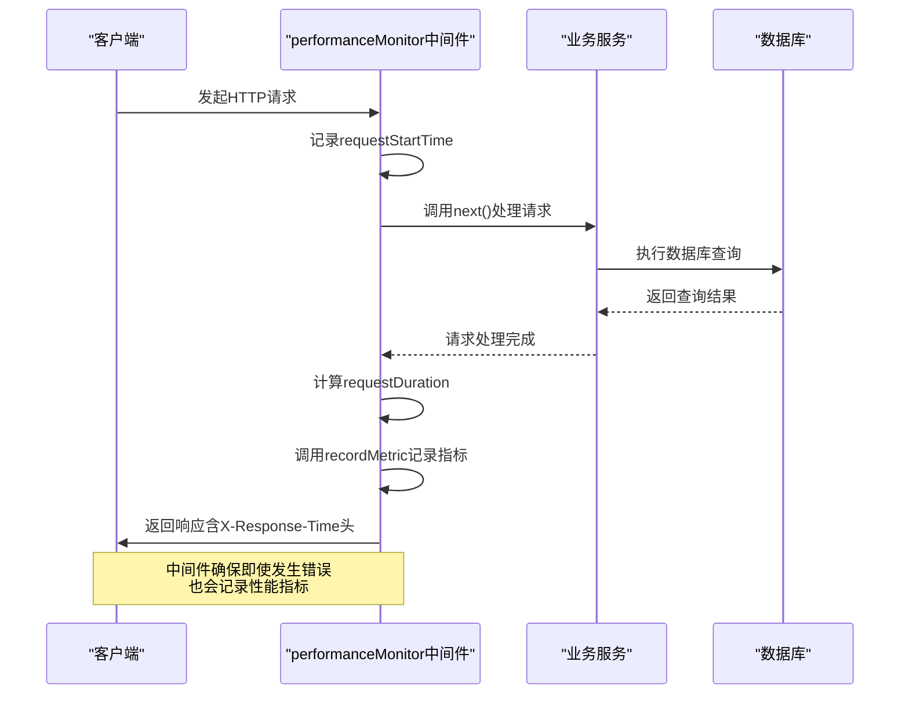
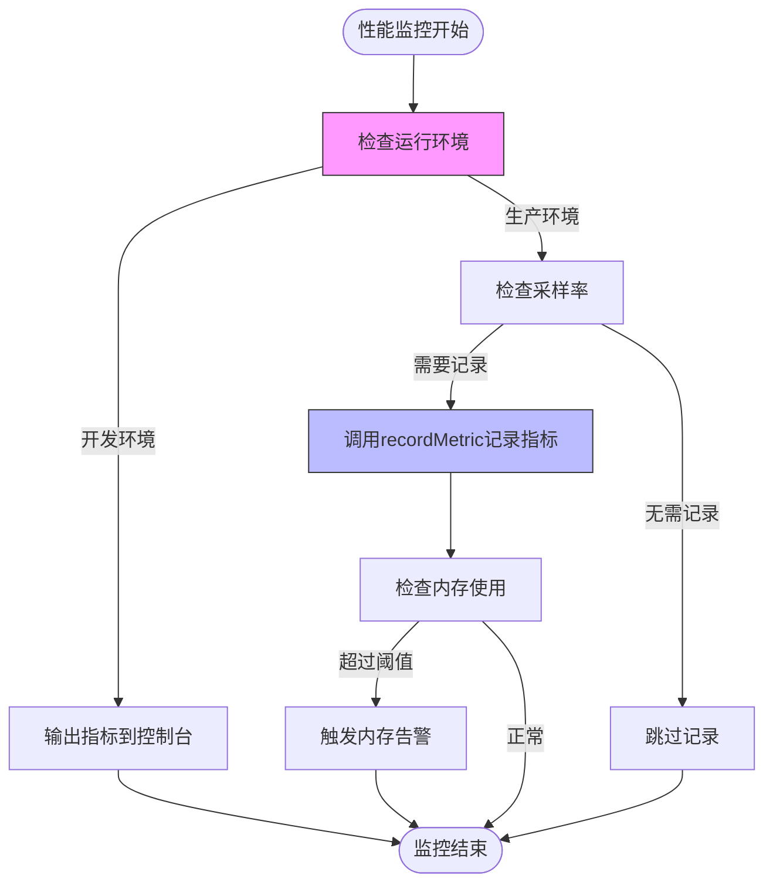

# 性能监控中间件

<cite>
**本文档引用的文件**   
- [performance.ts](file://backend/src/middleware/performance.ts)
- [monitoring.ts](file://backend/src/utils/monitoring.ts)
- [cloudflare.ts](file://backend/src/utils/cloudflare.ts)
- [wrangler.toml](file://backend/wrangler.toml)
- [index.ts](file://backend/src/index.ts)
</cite>

## 目录
1. [简介](#简介)
2. [性能监控中间件核心功能](#性能监控中间件核心功能)
3. [与Cloudflare Workers平台的集成](#与cloudflare-workers平台的集成)
4. [性能指标采集与日志输出](#性能指标采集与日志输出)
5. [系统性能影响与优化建议](#系统性能影响与优化建议)
6. [结论](#结论)

## 简介
性能监控中间件是本系统中用于采集和记录应用性能指标的核心组件。该中间件通过集成Cloudflare Workers平台的性能API，实现了对每个HTTP请求的处理时长、数据库查询时间、内存使用等关键性能指标的全面监控。中间件采用非侵入式设计，通过Hono框架的中间件机制自动注入到请求处理流程中，无需修改业务逻辑代码即可实现性能数据的采集。监控数据不仅用于开发和运维阶段的性能分析，还通过健康检查接口暴露给外部监控系统，为系统稳定性提供保障。

## 性能监控中间件核心功能

性能监控中间件提供了全面的性能指标采集能力，主要功能包括请求处理时间监控、数据库查询性能监控和内存使用监控。中间件通过`performanceMonitor`函数实现HTTP请求的全链路监控，从请求进入开始记录时间戳，到响应完成时计算总耗时，并将结果作为性能指标记录。对于数据库操作，中间件提供了`monitorDbQuery`装饰器函数，可以包装任何异步数据库查询函数，自动记录查询执行时间。此外，中间件还包含`recordMemoryUsage`函数用于监控内存使用情况，尽管在Cloudflare Workers环境中该功能可能受限。

中间件的设计充分考虑了错误处理的完整性，即使在请求处理过程中发生异常，依然会记录请求的处理时间，并将状态标记为"error"，确保性能数据的完整性。对于慢请求（超过1秒）和慢查询（超过500毫秒），中间件会生成专门的性能指标，便于快速识别性能瓶颈。所有采集的性能指标都通过统一的`MonitoringService`进行管理，支持后续的统计分析和上报。

**Section sources**
- [performance.ts](file://backend/src/middleware/performance.ts#L1-L159)
- [monitoring.ts](file://backend/src/utils/monitoring.ts#L122-L270)

## 与Cloudflare Workers平台的集成

性能监控中间件深度集成了Cloudflare Workers平台的特性和API，充分利用了平台提供的性能监控能力。在`wrangler.toml`配置文件中，已经启用了Workers的可观测性功能，包括日志记录和调用日志，为性能监控提供了基础支持。中间件通过Workers运行时提供的`performance.now()` API获取高精度的时间戳，确保性能测量的准确性。该API在Workers环境中提供亚毫秒级的时间精度，远优于传统的`Date.now()`方法。

中间件还通过`cloudflare.ts`工具类与Cloudflare的其他服务进行集成，虽然这些集成主要用于IP白名单管理，但展示了系统与Cloudflare生态的深度整合能力。在生产环境中，监控服务预留了与外部监控系统（如Sentry、Datadog或Cloudflare Analytics）集成的接口，可以通过实现`sendToExternalService`方法将性能数据上报到专业的监控平台。Workers的边缘计算特性使得性能监控数据可以在全球多个边缘节点本地采集，减少了数据上报的延迟和网络开销。

**Section sources**
- [wrangler.toml](file://backend/wrangler.toml#L19-L27)
- [cloudflare.ts](file://backend/src/utils/cloudflare.ts#L1-L800)
- [performance.ts](file://backend/src/middleware/performance.ts#L22-L23)

## 性能指标采集与日志输出

性能监控中间件通过一系列精心设计的函数实现了性能指标的采集和日志输出。`performanceMonitor`中间件在请求处理流程中扮演关键角色，它在`try-catch`块中包裹`next()`调用，确保无论请求成功或失败都能记录处理时间。采集的指标包括HTTP请求持续时间（http.request.duration）、响应大小（http.response.size）和慢请求（http.request.slow）。对于数据库查询，`monitorDbQuery`装饰器通过高阶函数的方式包装查询函数，在执行前后记录时间戳，计算查询耗时，并记录db.query.duration、db.query.slow和db.query.error等指标。

所有性能指标都通过`MonitoringService`的`recordMetric`方法进行记录，该方法接受指标名称、数值、单位和标签作为参数。标签系统允许对指标进行多维度分类，例如按HTTP方法、请求路径和状态码进行分组。在开发环境中，这些指标会输出到控制台，便于调试；在生产环境中，则可以通过健康检查接口`/api/health`获取性能统计信息。该接口返回最近一小时内请求处理时间和数据库查询时间的平均值、P95和P99分位数，为系统性能评估提供量化依据。

**Diagram sources**
- [performance.ts](file://backend/src/middleware/performance.ts#L18-L68)
- [monitoring.ts](file://backend/src/utils/monitoring.ts#L177-L200)

**Section sources**
- [performance.ts](file://backend/src/middleware/performance.ts#L32-L57)
- [monitoring.ts](file://backend/src/utils/monitoring.ts#L177-L200)
- [index.ts](file://backend/src/index.ts#L144-L187)

## 系统性能影响与优化建议

性能监控中间件在提供强大监控能力的同时，也对系统性能产生一定影响，主要体现在内存占用和CPU开销两个方面。`MonitoringService`在内存中维护了错误记录和性能指标的队列，分别限制为1000条和5000条，通过FIFO（先进先出）策略管理内存使用，防止内存无限增长。然而，在高并发场景下，频繁的指标记录操作会产生一定的CPU开销，特别是在`recordMetric`方法中对数组的push和shift操作。

为优化性能影响，建议实施以下策略：首先，采用采样策略，在生产环境中并非记录所有请求的详细指标，而是对异常情况（如慢请求、错误请求）进行完整记录，对正常请求仅记录聚合指标。其次，优化指标上报机制，避免实时上报带来的网络开销，可以采用批量上报或异步上报的方式。对于内存使用监控，由于在Cloudflare Workers环境中`performance.memory`可能不可用，建议仅在支持的环境中启用，并设置合理的采样间隔（默认60秒）。

另一个重要的优化建议是合理使用`monitorDbQuery`装饰器，仅对关键的、耗时较长的数据库查询进行监控，避免对所有简单查询都进行包装，以减少函数调用的开销。同时，可以考虑在非高峰时段增加监控的详细程度，在业务高峰期则降低采样率，实现性能监控与系统性能的平衡。

**Diagram sources**
- [monitoring.ts](file://backend/src/utils/monitoring.ts#L125-L126)
- [performance.ts](file://backend/src/middleware/performance.ts#L143-L159)

**Section sources**
- [monitoring.ts](file://backend/src/utils/monitoring.ts#L123-L127)
- [performance.ts](file://backend/src/middleware/performance.ts#L143-L159)

## 结论
性能监控中间件为系统提供了全面、可靠的性能监控能力，通过与Cloudflare Workers平台的深度集成，实现了对请求处理时间、数据库查询性能和内存使用等关键指标的采集。中间件设计合理，既保证了监控的完整性，又通过内存队列限制和错误处理机制确保了自身的稳定性。通过健康检查接口暴露的性能统计数据，为系统运维提供了重要的决策依据。未来可以进一步优化指标上报机制，集成专业的外部监控服务，并根据业务需求调整采样策略，实现监控效果与系统性能的最佳平衡。