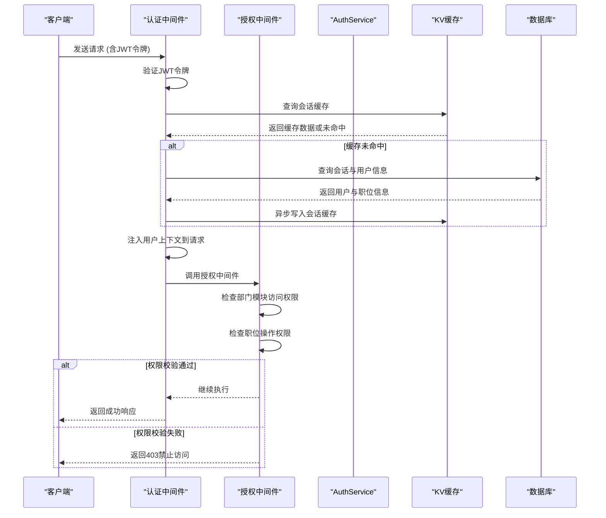

# 认证与授权中间件

<cite>
**本文档引用文件**   
- [middleware.ts](file://backend/src/middleware.ts#L1-L120)
- [auth.ts](file://backend/src/routes/v2/auth.ts#L1-L688)
- [AuthService.ts](file://backend/src/services/AuthService.ts#L1-L495)
- [permission.ts](file://backend/src/middleware/permission.ts#L1-L43)
- [permissions.ts](file://backend/src/utils/permissions.ts#L1-L273)
- [jwt.ts](file://backend/src/utils/jwt.ts#L1-L132)
- [db.ts](file://backend/src/utils/db.ts#L1-L239)
- [di.ts](file://backend/src/middleware/di.ts#L1-L156)
- [PermissionService.ts](file://backend/src/services/PermissionService.ts#L1-L147)
- [employees.ts](file://backend/src/routes/v2/employees.ts#L1-L602)
</cite>

## 目录
1. [简介](#简介)
2. [认证中间件分析](#认证中间件分析)
3. [授权中间件分析](#授权中间件分析)
4. [认证与授权流程交互图](#认证与授权流程交互图)
5. [双因素认证（TOTP）处理机制](#双因素认证totp处理机制)
6. [权限校验实现细节](#权限校验实现细节)
7. [敏感操作权限校验流程](#敏感操作权限校验流程)
8. [失败处理机制](#失败处理机制)

## 简介
本系统实现了基于JWT令牌和数据库会话的组合认证机制，结合RBAC（基于角色的访问控制）模型进行细粒度的接口级权限管理。认证中间件负责验证用户身份、解析用户会话并处理双因素认证状态，而授权中间件则基于用户角色和权限配置执行访问控制。中间件通过依赖注入方式与AuthService等服务交互，获取用户权限信息，并在请求上下文中注入当前用户信息，为后续业务逻辑提供安全的访问控制基础。

## 认证中间件分析

认证中间件通过JWT令牌与数据库会话相结合的方式验证用户身份。中间件首先检查请求路径是否为公开路径，若是则直接放行。对于需要认证的路径，中间件从请求头、Cookie或自定义头中提取认证令牌。系统使用自定义实现的JWT工具进行令牌验证，验证通过后，优先从KV缓存中获取会话数据，若缓存未命中则回退到数据库查询，并异步更新缓存。

中间件实现了滑动窗口续期机制，用户每次活跃时会自动延长7天会话有效期，同时异步更新数据库和KV缓存中的会话过期时间。会话数据包含用户ID、职位信息、员工信息及部门允许的功能模块列表，这些信息被注入到请求上下文中，供后续中间件和业务逻辑使用。

**Section sources**
- [middleware.ts](file://backend/src/middleware.ts#L14-L120)
- [jwt.ts](file://backend/src/utils/jwt.ts#L96-L124)
- [db.ts](file://backend/src/utils/db.ts#L45-L147)

## 授权中间件分析

授权中间件基于RBAC模型实现接口级权限管理。系统定义了六种职位角色：总部主管、总部专员、项目主管、项目专员、组长、工程师，每种角色具有不同的数据访问范围和操作权限。权限校验分为两个层次：首先检查部门是否允许访问指定模块，然后检查职位是否具有具体操作权限。

中间件通过`requirePermission`函数创建权限校验中间件，该函数接受模块名、子模块名和操作名作为参数。在权限判断时，系统首先通过`hasDepartmentModuleAccess`检查部门模块访问权限，然后通过`hasPermission`检查具体操作权限。对于需要审批权限的操作，系统通过`canApproveApplication`方法检查用户是否具有审批下属申请的权限。

**Section sources**
- [permission.ts](file://backend/src/middleware/permission.ts#L12-L43)
- [permissions.ts](file://backend/src/utils/permissions.ts#L99-L125)
- [PermissionService.ts](file://backend/src/services/PermissionService.ts#L12-L108)

## 认证与授权流程交互图

**Diagram sources **
- [middleware.ts](file://backend/src/middleware.ts#L17-L110)
- [permission.ts](file://backend/src/middleware/permission.ts#L12-L18)
- [AuthService.ts](file://backend/src/services/AuthService.ts#L34-L148)

## 双因素认证（TOTP）处理机制

系统实现了基于TOTP（基于时间的一次性密码）的双因素认证机制。当系统全局启用2FA且用户已绑定TOTP密钥时，新设备首次登录需要验证TOTP验证码。系统通过`TrustedDeviceService`生成设备指纹，检查是否为信任设备。若非信任设备，则要求用户提供TOTP验证码进行验证，验证通过后将设备添加到信任设备列表。

用户激活账号和重置密码时也支持TOTP验证。系统提供了完整的TOTP管理功能，包括生成TOTP密钥和QR码、验证TOTP验证码、重置TOTP绑定等。管理员可以为员工重置TOTP，用户也可以通过邮箱验证的方式自助重置TOTP。

**Section sources**
- [AuthService.ts](file://backend/src/services/AuthService.ts#L78-L113)
- [auth.ts](file://backend/src/routes/v2/auth.ts#L348-L386)
- [employees.ts](file://backend/src/routes/v2/employees.ts#L290-L329)
- [auth.ts](file://backend/src/routes/v2/auth.ts#L573-L685)

## 权限校验实现细节

权限校验基于职位的JSON权限配置实现。每个职位具有`permissions`字段，定义了该职位在各个模块的操作权限。权限检查采用"部门允许的模块 ∩ 职位定义的操作权限"的计算方式。系统提供了`hasPermission`工具函数，接收模块名、子模块名和操作名作为参数，返回是否具有相应权限。

对于数据访问控制，系统提供了`getDataAccessFilter`工具函数，根据用户职位层级返回SQL过滤条件。总部人员（level=1）可以访问所有数据，项目人员（level=2）只能访问本项目数据，组长（team_leader）只能访问本组数据，工程师（team_engineer）只能访问自己的数据。这些过滤条件被应用于查询语句中，确保数据访问的安全性。

**Section sources**
- [permissions.ts](file://backend/src/utils/permissions.ts#L99-L125)
- [permissions.ts](file://backend/src/utils/permissions.ts#L196-L263)
- [employees.ts](file://backend/src/routes/v2/employees.ts#L46-L103)

## 敏感操作权限校验流程

对于敏感操作如员工信息修改、薪资发放、财务审批等，系统实施严格的权限校验流程。以员工信息修改为例，路由处理器首先调用`hasPermission`检查用户是否具有`hr.employee.update`权限，若无权限则直接返回403禁止访问。对于需要审批权限的操作，系统调用`canApproveApplication`方法检查用户是否具有审批下属申请的权限。

在员工离职、转正、重置密码等敏感操作中，系统不仅检查权限，还记录详细的审计日志，包括操作人、操作对象、操作内容和IP地址等信息。这些日志被用于安全审计和问题追溯，确保系统的操作可追溯、可审计。

**Section sources**
- [employees.ts](file://backend/src/routes/v2/employees.ts#L364-L397)
- [employees.ts](file://backend/src/routes/v2/employees.ts#L474-L482)
- [AuthService.ts](file://backend/src/services/AuthService.ts#L129-L140)

## 失败处理机制

系统实现了完善的认证与授权失败处理机制。认证失败时，系统返回401未授权状态码，并记录详细的错误日志。对于不存在的路由，系统优先返回404未找到，而非401未授权，以避免暴露系统接口信息。授权失败时，系统返回403禁止访问状态码，并抛出预定义的错误对象。

系统还实现了多种限流机制，防止暴力破解攻击。登录、密码重置、TOTP重置等敏感操作均应用了速率限制中间件，限制单位时间内的请求次数。对于连续失败的认证尝试，系统会记录审计日志，并可配置告警通知，及时发现潜在的安全威胁。

**Section sources**
- [middleware.ts](file://backend/src/middleware.ts#L29-L38)
- [permission.ts](file://backend/src/middleware/permission.ts#L15-L16)
- [auth.ts](file://backend/src/routes/v2/auth.ts#L176-L177)
- [auth.ts](file://backend/src/routes/v2/auth.ts#L510-L511)