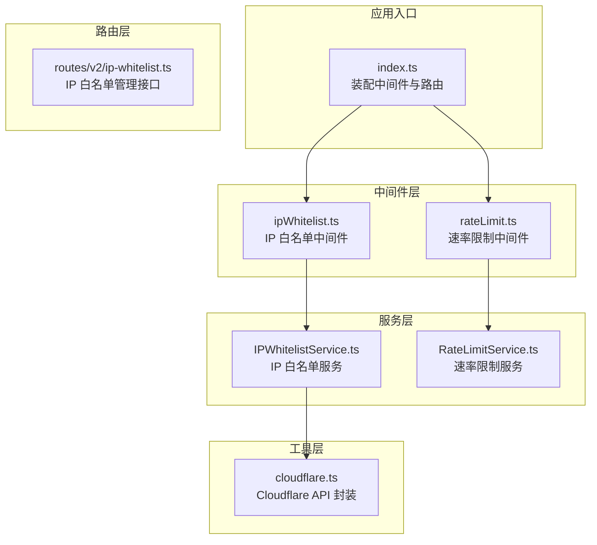
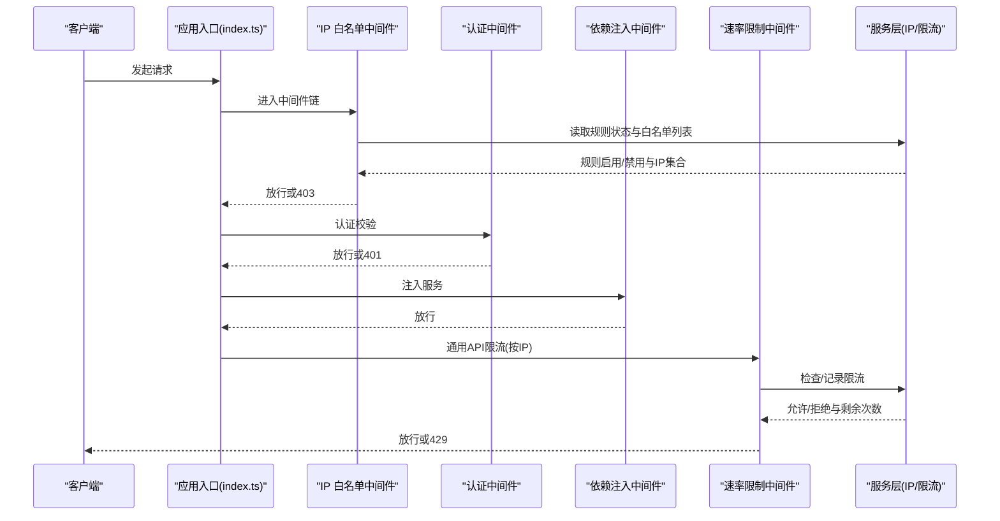
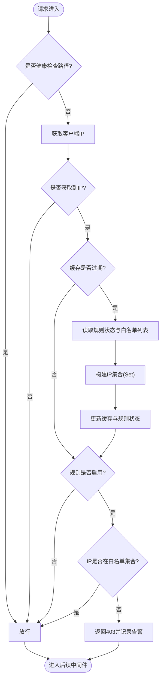
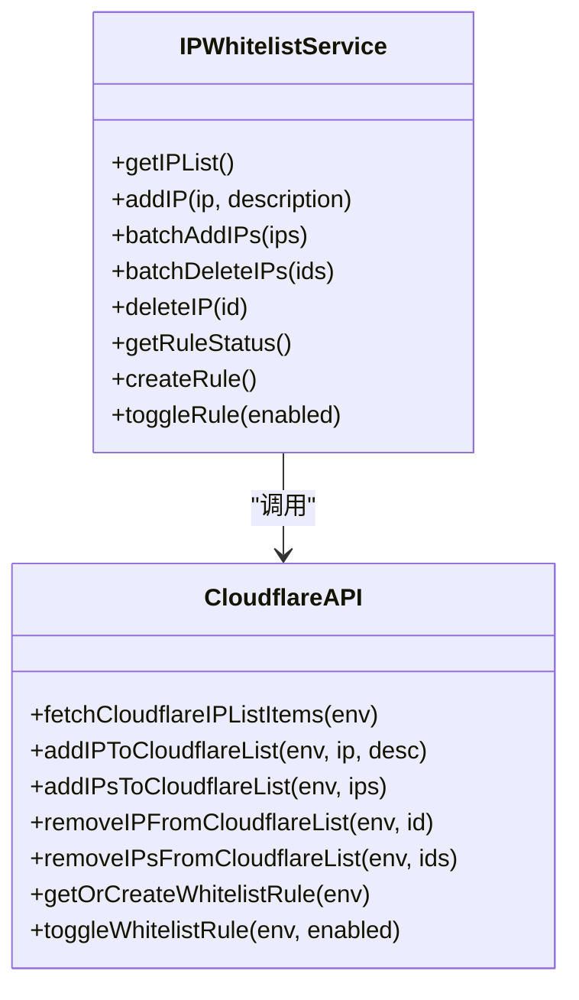
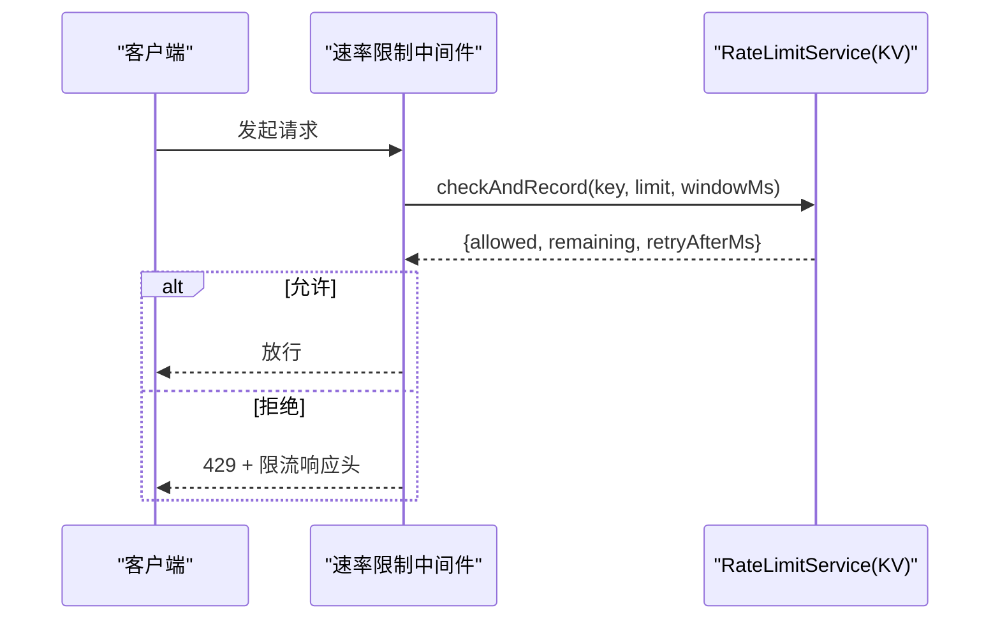
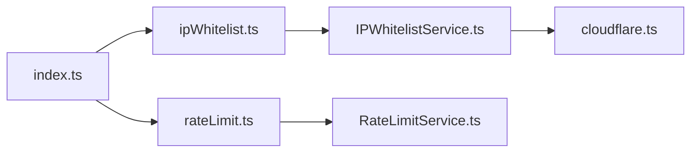

# 访问控制中间件

<cite>
**本文引用的文件**
- [backend/src/middleware/ipWhitelist.ts](file://backend/src/middleware/ipWhitelist.ts)
- [backend/src/services/IPWhitelistService.ts](file://backend/src/services/IPWhitelistService.ts)
- [backend/src/utils/cloudflare.ts](file://backend/src/utils/cloudflare.ts)
- [backend/src/routes/v2/ip-whitelist.ts](file://backend/src/routes/v2/ip-whitelist.ts)
- [backend/src/middleware/rateLimit.ts](file://backend/src/middleware/rateLimit.ts)
- [backend/src/services/RateLimitService.ts](file://backend/src/services/RateLimitService.ts)
- [backend/src/index.ts](file://backend/src/index.ts)
- [backend/test/routes/ip-whitelist.test.ts](file://backend/test/routes/ip-whitelist.test.ts)
</cite>

## 目录
1. [简介](#简介)
2. [项目结构](#项目结构)
3. [核心组件](#核心组件)
4. [架构总览](#架构总览)
5. [组件详解](#组件详解)
6. [依赖关系分析](#依赖关系分析)
7. [性能与可靠性](#性能与可靠性)
8. [故障排查指南](#故障排查指南)
9. [结论](#结论)
10. [附录](#附录)

## 简介
本文件面向系统运维与开发人员，系统性梳理并说明两类访问控制中间件：
- IP 白名单中间件：基于 Cloudflare IP List 与自定义防火墙规则，对来源 IP 进行准入控制，并提供动态开关与缓存刷新能力。
- 速率限制中间件：基于 Cloudflare KV 的滑动窗口算法实现令牌桶式限流，保护敏感接口与通用 API，支持按 IP 与按用户维度限流。

文档重点覆盖：
- IP 白名单策略与 CIDR 匹配说明
- 速率限制算法与配置要点
- 中间件在应用中的装配与使用方式
- 动态更新机制与运维实践
- 防护 DDoS 与未授权访问的策略建议

## 项目结构
访问控制相关代码主要分布在以下位置：
- 中间件层：IP 白名单与速率限制中间件
- 服务层：IP 白名单服务与速率限制服务
- 工具层：Cloudflare API 封装
- 路由层：IP 白名单管理接口
- 应用入口：中间件装配与全局限流策略

图表来源
- [backend/src/index.ts](file://backend/src/index.ts#L56-L80)
- [backend/src/middleware/ipWhitelist.ts](file://backend/src/middleware/ipWhitelist.ts#L1-L76)
- [backend/src/middleware/rateLimit.ts](file://backend/src/middleware/rateLimit.ts#L1-L134)
- [backend/src/services/IPWhitelistService.ts](file://backend/src/services/IPWhitelistService.ts#L1-L141)
- [backend/src/services/RateLimitService.ts](file://backend/src/services/RateLimitService.ts#L1-L145)
- [backend/src/utils/cloudflare.ts](file://backend/src/utils/cloudflare.ts#L1-L120)
- [backend/src/routes/v2/ip-whitelist.ts](file://backend/src/routes/v2/ip-whitelist.ts#L1-L120)

章节来源
- [backend/src/index.ts](file://backend/src/index.ts#L56-L80)

## 核心组件
- IP 白名单中间件：在请求进入业务路由前，读取客户端 IP，查询 Cloudflare IP List，若规则启用且 IP 不在白名单，则拒绝访问；同时内置短 TTL 的内存缓存以降低 API 调用频率。
- 速率限制中间件：提供多类限流策略（登录、密码重置、TOTP、通用 API），基于 Cloudflare KV 的滑动窗口算法实现，返回标准的限流响应头与错误码。
- IP 白名单服务：封装 Cloudflare IP List 与自定义规则的增删改查、批量导入导出、规则启停等操作。
- 速率限制服务：在 KV 中维护每个限流键的时间戳数组，计算剩余次数与重试时间，支持重置计数器。

章节来源
- [backend/src/middleware/ipWhitelist.ts](file://backend/src/middleware/ipWhitelist.ts#L1-L76)
- [backend/src/services/IPWhitelistService.ts](file://backend/src/services/IPWhitelistService.ts#L1-L141)
- [backend/src/middleware/rateLimit.ts](file://backend/src/middleware/rateLimit.ts#L1-L134)
- [backend/src/services/RateLimitService.ts](file://backend/src/services/RateLimitService.ts#L1-L145)

## 架构总览
下图展示了请求在系统中的处理流程，包括 IP 白名单与速率限制的介入点。

图表来源
- [backend/src/index.ts](file://backend/src/index.ts#L56-L80)
- [backend/src/middleware/ipWhitelist.ts](file://backend/src/middleware/ipWhitelist.ts#L1-L76)
- [backend/src/middleware/rateLimit.ts](file://backend/src/middleware/rateLimit.ts#L1-L134)
- [backend/src/services/IPWhitelistService.ts](file://backend/src/services/IPWhitelistService.ts#L1-L141)
- [backend/src/services/RateLimitService.ts](file://backend/src/services/RateLimitService.ts#L1-L145)

## 组件详解

### IP 白名单中间件
- 功能要点
  - 健康检查路径放行（/api/health、/api/version）。
  - 优先从 Cloudflare 提供的头部获取真实客户端 IP；若缺失，在生产环境通常不应出现，开发环境默认放行并记录警告。
  - 内置短 TTL 的内存缓存，周期性刷新规则状态与白名单集合，减少对外部 API 的调用压力。
  - 当规则启用时，若客户端 IP 不在白名单集合中，返回 403 并记录告警；异常情况下返回 500。
- CIDR 匹配说明
  - 当前中间件采用“精确匹配”策略，即从 Cloudflare IP List 中读取 IP 列表并放入 Set 进行包含判断。
  - 若需支持 CIDR 段匹配，可在中间件中引入 CIDR 解析与匹配逻辑（例如使用库进行前缀匹配），并在缓存更新时将 IP 列表转换为 CIDR 集合，随后在请求阶段进行 CIDR 判断。
- 动态更新机制
  - 通过 IP 白名单管理接口可新增、批量新增、删除、同步 IP，以及启停规则。
  - 中间件缓存 TTL 为 1 分钟，到期后自动刷新；若刷新失败，保留旧缓存以保证服务连续性（fail-safe）。

图表来源
- [backend/src/middleware/ipWhitelist.ts](file://backend/src/middleware/ipWhitelist.ts#L1-L76)

章节来源
- [backend/src/middleware/ipWhitelist.ts](file://backend/src/middleware/ipWhitelist.ts#L1-L76)

### IP 白名单服务与 Cloudflare 集成
- IP 列表管理
  - 读取 Cloudflare IP List 中的条目，映射为内部结构。
  - 新增单个或批量 IP，返回成功/失败统计与错误明细。
  - 删除单个或批量 IP，返回成功/失败统计。
- 自定义规则管理
  - 获取/创建白名单规则（基于 Cloudflare Zone Rulesets），表达式使用 IP 列表变量进行匹配。
  - 启停规则，支持默认关闭以确保安全基线。

图表来源
- [backend/src/services/IPWhitelistService.ts](file://backend/src/services/IPWhitelistService.ts#L1-L141)
- [backend/src/utils/cloudflare.ts](file://backend/src/utils/cloudflare.ts#L576-L763)

章节来源
- [backend/src/services/IPWhitelistService.ts](file://backend/src/services/IPWhitelistService.ts#L1-L141)
- [backend/src/utils/cloudflare.ts](file://backend/src/utils/cloudflare.ts#L576-L763)

### 速率限制中间件与服务
- 限流算法
  - 基于 Cloudflare KV 的滑动窗口：在 KV 中保存每个限流键的时间戳数组，窗口外的旧时间戳被过滤，超过阈值则拒绝并计算重试时间。
  - 记录请求时会设置 TTL 为窗口时间的两倍，避免过早清理导致限流失效。
- 中间件策略
  - 通用 API 限流（按 IP）：默认对 /api/* 路由生效，保护整体 API。
  - 登录限流（按 IP）：每分钟最多 N 次，适合防暴力破解。
  - 密码重置限流（按 IP）：每小时最多 N 次。
  - TOTP 重置限流（按邮箱）：每小时最多 N 次。
  - 通用 API 限流（按用户）：优先使用 userId，否则回退到 IP。
- 响应头与错误
  - 设置 X-RateLimit-Limit、X-RateLimit-Remaining、X-RateLimit-Reset、Retry-After。
  - 超限时返回 429 与统一错误结构。

图表来源
- [backend/src/middleware/rateLimit.ts](file://backend/src/middleware/rateLimit.ts#L1-L134)
- [backend/src/services/RateLimitService.ts](file://backend/src/services/RateLimitService.ts#L1-L145)

章节来源
- [backend/src/middleware/rateLimit.ts](file://backend/src/middleware/rateLimit.ts#L1-L134)
- [backend/src/services/RateLimitService.ts](file://backend/src/services/RateLimitService.ts#L1-L145)

### IP 白名单管理接口
- 接口能力
  - 获取白名单列表、新增单个、批量新增、批量删除、同步、删除、获取规则状态、启停规则、创建规则。
- 权限控制
  - 所有接口均要求具备系统配置更新权限，未授权返回 403。
- 测试覆盖
  - 单元测试覆盖批量删除、删除、获取规则状态等关键路径。

章节来源
- [backend/src/routes/v2/ip-whitelist.ts](file://backend/src/routes/v2/ip-whitelist.ts#L1-L415)
- [backend/test/routes/ip-whitelist.test.ts](file://backend/test/routes/ip-whitelist.test.ts#L96-L141)

## 依赖关系分析
- 中间件装配
  - 应用入口对 /api/* 路由统一启用按 IP 的通用 API 限流。
  - API 版本路由对所有 V2 路由启用 IP 白名单中间件、认证中间件与依赖注入中间件。
- 服务依赖
  - IP 白名单中间件依赖 IP 白名单服务；IP 白名单服务依赖 Cloudflare API。
  - 速率限制中间件依赖速率限制服务；速率限制服务依赖 Cloudflare KV。
- 路由依赖
  - IP 白名单管理路由依赖 IP 白名单服务，提供动态更新能力。

图表来源
- [backend/src/index.ts](file://backend/src/index.ts#L56-L80)
- [backend/src/middleware/ipWhitelist.ts](file://backend/src/middleware/ipWhitelist.ts#L1-L76)
- [backend/src/middleware/rateLimit.ts](file://backend/src/middleware/rateLimit.ts#L1-L134)
- [backend/src/services/IPWhitelistService.ts](file://backend/src/services/IPWhitelistService.ts#L1-L141)
- [backend/src/services/RateLimitService.ts](file://backend/src/services/RateLimitService.ts#L1-L145)
- [backend/src/utils/cloudflare.ts](file://backend/src/utils/cloudflare.ts#L1-L120)

章节来源
- [backend/src/index.ts](file://backend/src/index.ts#L56-L80)

## 性能与可靠性
- IP 白名单中间件
  - 内存缓存（1 分钟 TTL）显著降低 Cloudflare API 调用频次；刷新失败时保留旧缓存，避免雪崩。
  - 健康检查路径放行，减少不必要的外部调用。
- 速率限制服务
  - 滑动窗口算法简单高效，KV 存储与 TTL 管理避免长期占用空间。
  - 记录请求时设置较长 TTL，确保限流窗口稳定。
- 中间件顺序
  - IP 白名单在认证之前，可尽早阻断不受信任来源，降低下游负载。
  - 通用 API 限流对 /api/* 生效，覆盖所有 V2 路由。

[本节为通用性能讨论，不直接分析具体文件]

## 故障排查指南
- IP 白名单不生效
  - 检查规则状态是否启用；确认 Cloudflare IP List 是否存在且包含目标 IP。
  - 查看中间件日志，确认缓存刷新是否成功。
- 速率限制误伤
  - 检查限流键前缀与维度（IP vs 用户）是否正确；确认 KV 中是否存在对应键。
  - 调整限流阈值与窗口大小，观察响应头中的剩余次数与重试时间。
- Cloudflare API 配置
  - 确认必要的 Token 与 Account/Zone ID 已正确配置；检查网络连通性与权限范围。
- 健康检查
  - /api/health 与 /api/version 应始终可访问，便于快速定位中间件链路问题。

章节来源
- [backend/src/middleware/ipWhitelist.ts](file://backend/src/middleware/ipWhitelist.ts#L1-L76)
- [backend/src/middleware/rateLimit.ts](file://backend/src/middleware/rateLimit.ts#L1-L134)
- [backend/src/utils/cloudflare.ts](file://backend/src/utils/cloudflare.ts#L1-L120)

## 结论
该访问控制体系通过“白名单准入 + 限流防护”的组合，有效提升了系统的安全性与稳定性：
- IP 白名单中间件基于 Cloudflare IP List 与规则，提供灵活的动态更新与缓存优化。
- 速率限制中间件基于 KV 的滑动窗口算法，覆盖敏感接口与通用 API，具备良好的可扩展性。
- 在实际部署中，建议：
  - 明确白名单来源与 CIDR 策略，必要时增强中间件以支持 CIDR 匹配。
  - 根据业务流量特征调整限流阈值与窗口，结合响应头进行监控与告警。
  - 保持规则启停的最小化，默认关闭，按需启用。

[本节为总结性内容，不直接分析具体文件]

## 附录

### 如何配置不同接口的限流策略
- 通用 API 限流（按 IP）
  - 已在应用入口对 /api/* 路由启用，适用于大多数公开接口。
  - 参考路径：[backend/src/index.ts](file://backend/src/index.ts#L78-L80)
- 登录限流（按 IP）
  - 适用于登录接口，防止暴力破解。
  - 参考路径：[backend/src/middleware/rateLimit.ts](file://backend/src/middleware/rateLimit.ts#L62-L72)
- 密码重置限流（按 IP）
  - 适用于密码重置接口。
  - 参考路径：[backend/src/middleware/rateLimit.ts](file://backend/src/middleware/rateLimit.ts#L73-L82)
- TOTP 重置限流（按邮箱）
  - 适用于邮箱维度的 TOTP 重置接口。
  - 参考路径：[backend/src/middleware/rateLimit.ts](file://backend/src/middleware/rateLimit.ts#L83-L98)
- 通用 API 限流（按用户）
  - 适用于登录后的用户接口，优先使用 userId。
  - 参考路径：[backend/src/middleware/rateLimit.ts](file://backend/src/middleware/rateLimit.ts#L99-L109)

章节来源
- [backend/src/index.ts](file://backend/src/index.ts#L78-L80)
- [backend/src/middleware/rateLimit.ts](file://backend/src/middleware/rateLimit.ts#L62-L109)

### IP 白名单的动态更新机制
- 通过管理接口进行增删改查与规则启停：
  - 新增/批量新增/删除/批量删除/同步/删除/获取规则状态/启停规则/创建规则。
  - 参考路径：[backend/src/routes/v2/ip-whitelist.ts](file://backend/src/routes/v2/ip-whitelist.ts#L52-L415)
- 中间件侧缓存刷新：
  - 每次请求检查缓存 TTL，过期则刷新；刷新失败保留旧缓存。
  - 参考路径：[backend/src/middleware/ipWhitelist.ts](file://backend/src/middleware/ipWhitelist.ts#L36-L58)

章节来源
- [backend/src/routes/v2/ip-whitelist.ts](file://backend/src/routes/v2/ip-whitelist.ts#L52-L415)
- [backend/src/middleware/ipWhitelist.ts](file://backend/src/middleware/ipWhitelist.ts#L36-L58)

### 保护系统免受 DDoS 与未授权访问
- DDoS 防护
  - 通过通用 API 限流（按 IP）与 IP 白名单中间件，可有效限制突发流量与不受信任来源的访问。
  - 建议配合 CDN 层的 DDoS 防护策略，中间件层作为第二道防线。
- 未授权访问
  - IP 白名单中间件在认证前阻断不受信任来源；认证中间件负责用户身份校验。
  - 速率限制中间件对敏感接口进行访问控制，降低爆破风险。

[本节为通用指导，不直接分析具体文件]