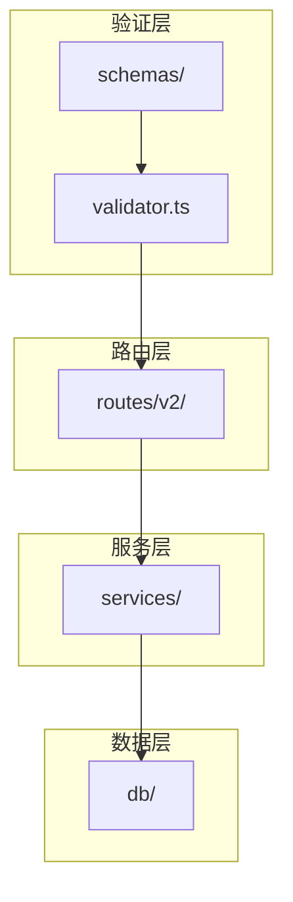
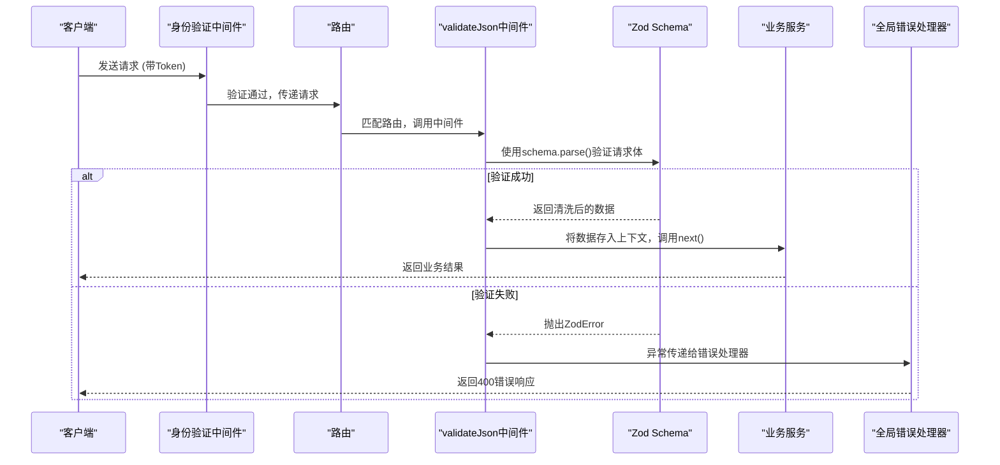
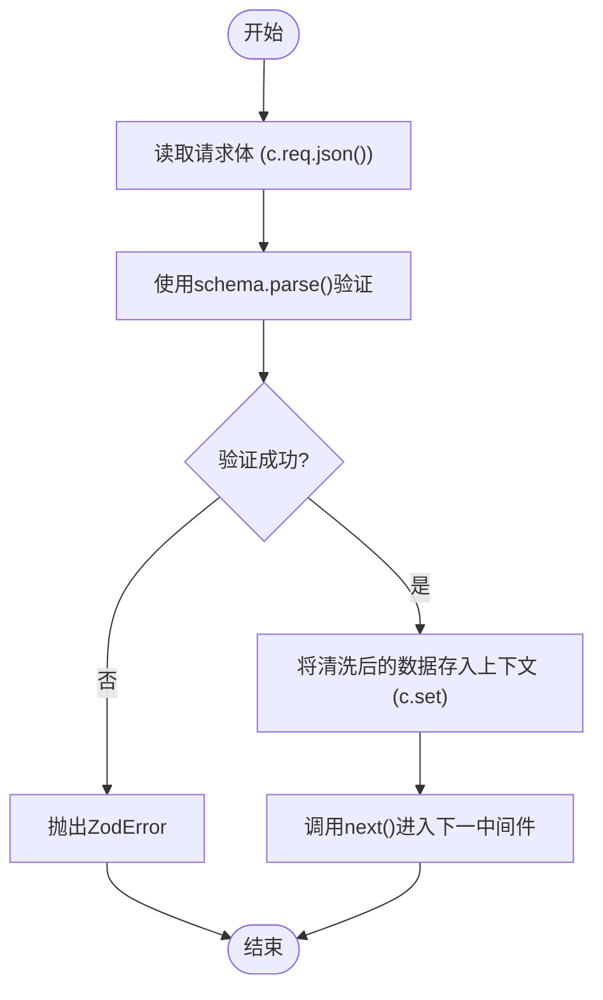
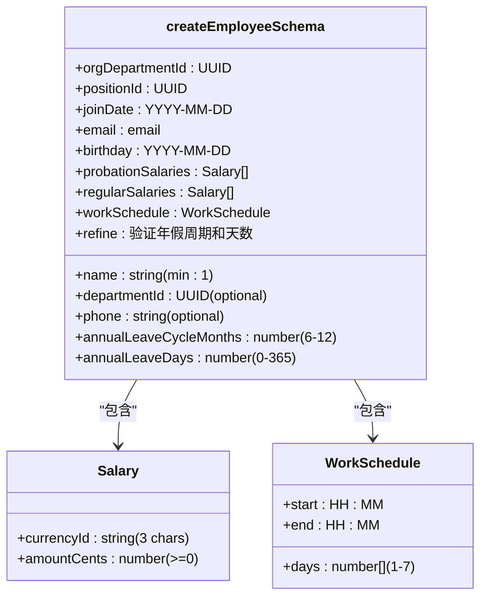
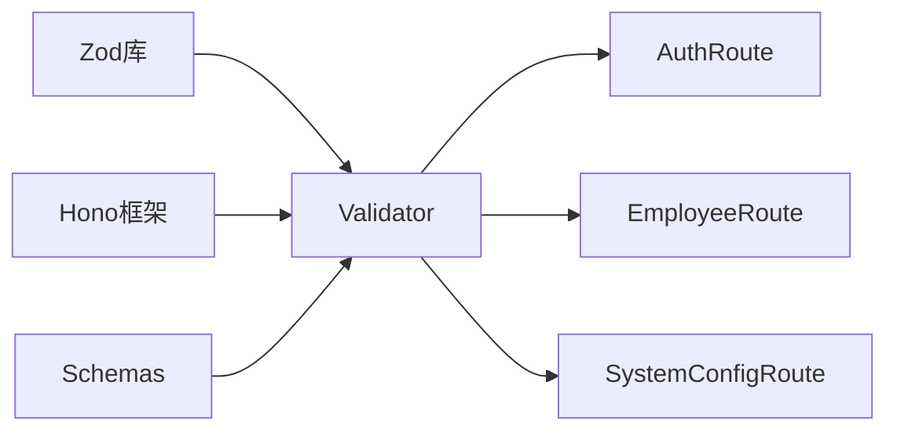

# 请求验证中间件

<cite>
**本文档引用的文件**  
- [di.ts](file://backend/src/middleware/di.ts)
- [validator.ts](file://backend/src/utils/validator.ts)
- [errors.ts](file://backend/src/utils/errors.ts)
- [business.schema.ts](file://backend/src/schemas/business.schema.ts)
- [common.schema.ts](file://backend/src/schemas/common.schema.ts)
- [auth.ts](file://backend/src/routes/v2/auth.ts)
- [employees.ts](file://backend/src/routes/v2/employees.ts)
- [system-config.ts](file://backend/src/routes/v2/system-config.ts)
</cite>

## 目录
1. [简介](#简介)
2. [项目结构](#项目结构)
3. [核心组件](#核心组件)
4. [架构概述](#架构概述)
5. [详细组件分析](#详细组件分析)
6. [依赖分析](#依赖分析)
7. [性能考虑](#性能考虑)
8. [故障排除指南](#故障排除指南)
9. [结论](#结论)
10. [附录](#附录)（如有必要）

## 简介
本文档详细介绍了财务系统中的请求验证中间件，重点阐述了 `validateJson` 中间件如何利用 Zod schema 对请求体进行类型验证和数据清洗。文档说明了该中间件与依赖注入系统（di.ts）的集成方式，以及如何在运行时动态加载验证规则。通过具体示例展示了如何定义和应用自定义验证规则，以及验证失败时的错误响应格式。此外，还阐述了该中间件如何确保 API 输入数据的完整性和安全性，并与 OpenAPI 规范保持一致。

## 项目结构
该项目采用分层架构，将业务逻辑、数据访问、中间件和路由清晰分离。核心的请求验证功能位于 `backend/src/utils/validator.ts` 文件中，作为独立的工具函数实现。验证规则（schemas）被组织在 `backend/src/schemas/` 目录下，分为通用规则（common.schema.ts）和业务规则（business.schema.ts）。这些验证中间件通过 Hono 框架的路由系统，在 `backend/src/routes/v2/` 目录下的各个 API 路由中被应用。



**Diagram sources**
- [validator.ts](file://backend/src/utils/validator.ts)
- [schemas](file://backend/src/schemas/)
- [routes/v2](file://backend/src/routes/v2/)

**Section sources**
- [validator.ts](file://backend/src/utils/validator.ts)
- [schemas](file://backend/src/schemas/)
- [routes/v2](file://backend/src/routes/v2/)

## 核心组件
`validateJson` 是请求验证的核心组件，它是一个高阶函数，接收一个 Zod schema 作为参数，并返回一个新的中间件函数。该中间件在请求处理流程中执行，负责解析请求体、应用 schema 进行验证和数据清洗，并将清洗后的数据存入请求上下文（Context）中，供后续的业务逻辑使用。其设计遵循单一职责原则，专注于输入验证，与业务逻辑完全解耦。

**Section sources**
- [validator.ts](file://backend/src/utils/validator.ts#L12-L18)

## 架构概述
整个验证系统的架构基于 Hono 框架的中间件机制。当一个 HTTP 请求到达时，它首先经过身份验证中间件，然后进入路由匹配。一旦匹配到特定路由，与该路由关联的 `validateJson` 中间件就会被触发。该中间件从 `schemas/` 目录中导入预定义的 Zod schema，对请求体进行验证。如果验证成功，清洗后的数据会被挂载到上下文对象上；如果失败，则会抛出一个 `ZodError`，该错误会被全局错误处理器捕获并转换为标准的 JSON 错误响应。



**Diagram sources**
- [validator.ts](file://backend/src/utils/validator.ts#L12-L18)
- [errors.ts](file://backend/src/utils/errors.ts#L181-L200)

## 详细组件分析

### validateJson 中间件分析
`validateJson` 中间件是整个验证系统的核心。它利用 Zod 库的强大功能，不仅进行类型检查，还能执行复杂的业务规则验证（如日期格式、邮箱格式、数值范围等），并能将输入数据“清洗”或“转换”为预期的格式（例如，将字符串数字转换为整数）。

#### 实现原理
该中间件是一个典型的 Hono 中间件，遵循 `(c: Context, next: Next) => Promise<void>` 的签名。它通过 `c.req.json()` 异步读取请求体，然后使用传入的 Zod schema 的 `parse` 方法进行同步验证。`parse` 方法是“断言式”的，意味着如果数据不符合 schema，它会立即抛出一个 `ZodError` 异常。验证通过后，清洗后的数据通过 `c.set('validatedData', result)` 存储在请求上下文中，键名为 `validatedData`。



**Diagram sources**
- [validator.ts](file://backend/src/utils/validator.ts#L12-L18)

#### 与依赖注入系统的集成
`validateJson` 中间件本身是无状态的，不直接依赖任何服务。然而，它与依赖注入（DI）系统（di.ts）紧密协作。DI 系统负责创建和管理所有服务实例（如 `EmployeeService`, `AuthService` 等），并将它们注入到请求上下文中。`validateJson` 中间件则负责确保传递给这些服务的数据是有效和安全的。这种设计实现了关注点分离：DI 系统管理对象生命周期和依赖关系，而验证中间件则专注于数据完整性。

**Section sources**
- [validator.ts](file://backend/src/utils/validator.ts#L12-L18)
- [di.ts](file://backend/src/middleware/di.ts#L41-L155)

### 自定义验证规则示例
自定义验证规则在 `backend/src/schemas/` 目录下定义。以下是一个具体的示例，展示了如何定义一个用于创建员工的复杂 schema。

#### 创建员工Schema


**Diagram sources**
- [business.schema.ts](file://backend/src/schemas/business.schema.ts#L45-L86)

该 schema 不仅定义了基本字段类型，还通过 `.refine()` 方法添加了自定义业务规则，例如确保年假周期在6到12个月之间。当 `validateJson(createEmployeeSchema)` 被调用时，所有这些规则都会自动执行。

### 验证失败的错误响应
当请求体验证失败时，系统会返回一个结构化的 JSON 错误响应。这个响应格式是统一的，便于前端解析和用户理解。

#### 错误响应格式
```json
{
  "success": false,
  "error": {
    "code": "VAL_BAD_REQUEST",
    "message": "验证失败",
    "details": {
      "errors": [
        {
          "path": "email",
          "message": "邮箱格式不正确",
          "code": "invalid_string"
        },
        {
          "path": "amountCents",
          "message": "amountCents必须大于0",
          "code": "too_small"
        }
      ]
    }
  }
}
```

这个响应由 `backend/src/utils/errors.ts` 文件中的全局错误处理器生成。它捕获 `ZodError`，提取其中的详细信息（如错误路径、消息和错误代码），并将其包装成一个符合项目标准的错误对象，最后以 HTTP 400 状态码返回。

**Section sources**
- [errors.ts](file://backend/src/utils/errors.ts#L181-L200)
- [business.schema.ts](file://backend/src/schemas/business.schema.ts)

## 依赖分析
`validateJson` 中间件的主要依赖是 Zod 库，它提供了强大的模式定义和验证能力。它还依赖于 Hono 框架的 `Context` 和 `Next` 类型，以实现中间件功能。在项目内部，它直接依赖于在 `schemas/` 目录中定义的各种 schema 模块。业务路由（如 `auth.ts`, `employees.ts`）则依赖于 `validator.ts` 来应用这些验证规则。



**Diagram sources**
- [validator.ts](file://backend/src/utils/validator.ts#L5-L6)
- [auth.ts](file://backend/src/routes/v2/auth.ts)
- [employees.ts](file://backend/src/routes/v2/employees.ts)
- [system-config.ts](file://backend/src/routes/v2/system-config.ts)

## 性能考虑
由于 `validateJson` 在每个请求的处理链中执行，其性能至关重要。Zod 的 `parse` 方法是同步的，这有助于避免在验证阶段引入额外的异步开销。然而，复杂的 schema 和大型请求体可能会增加 CPU 负载。建议对 schema 进行优化，避免不必要的深度嵌套和复杂的正则表达式。此外，验证应在业务逻辑执行前尽早进行，以便在早期就拒绝无效请求，从而节省后续昂贵的数据库查询或计算资源。

## 故障排除指南
当遇到验证相关的问题时，可以按照以下步骤进行排查：

1.  **检查错误响应**：首先查看返回的 JSON 错误响应，`details.errors` 数组会明确指出是哪个字段 (`path`) 和什么原因 (`message`) 导致了验证失败。
2.  **核对请求体**：根据错误信息，仔细检查客户端发送的请求体数据，确保其格式、类型和值都符合 API 文档的要求。
3.  **审查Schema定义**：如果请求体看起来是正确的，但仍然验证失败，请检查对应的 Zod schema 定义（在 `schemas/` 目录下），确认是否有过于严格的规则或拼写错误。
4.  **检查中间件应用**：确认 `validateJson` 中间件是否已正确应用到目标路由上。例如，在 `auth.ts` 中，`loginRoute` 的 `request.body.schema` 是否指向了正确的 `loginSchema`。

**Section sources**
- [errors.ts](file://backend/src/utils/errors.ts#L181-L200)
- [business.schema.ts](file://backend/src/schemas/business.schema.ts)
- [auth.ts](file://backend/src/routes/v2/auth.ts)

## 结论
`validateJson` 请求验证中间件是保障系统 API 数据安全性和一致性的关键组件。它通过与 Zod schema 和 OpenAPI 规范的紧密结合，实现了强大而灵活的输入验证。其与依赖注入系统的协同工作，确保了从数据入口到业务处理的整个流程都建立在可靠的数据基础之上。该设计不仅提高了代码的健壮性，也极大地简化了前端开发和 API 文档的维护工作。