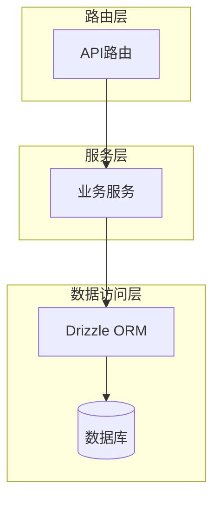
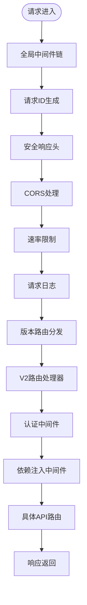
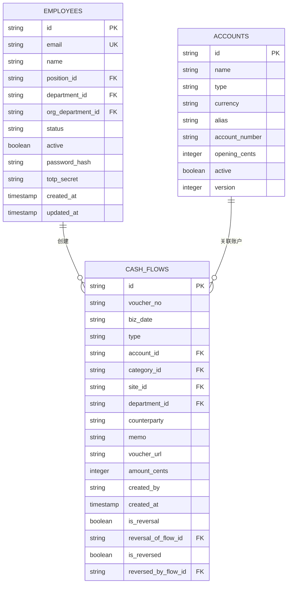
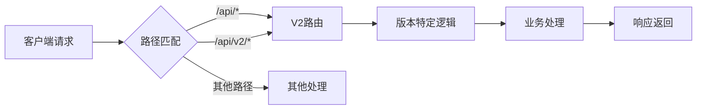
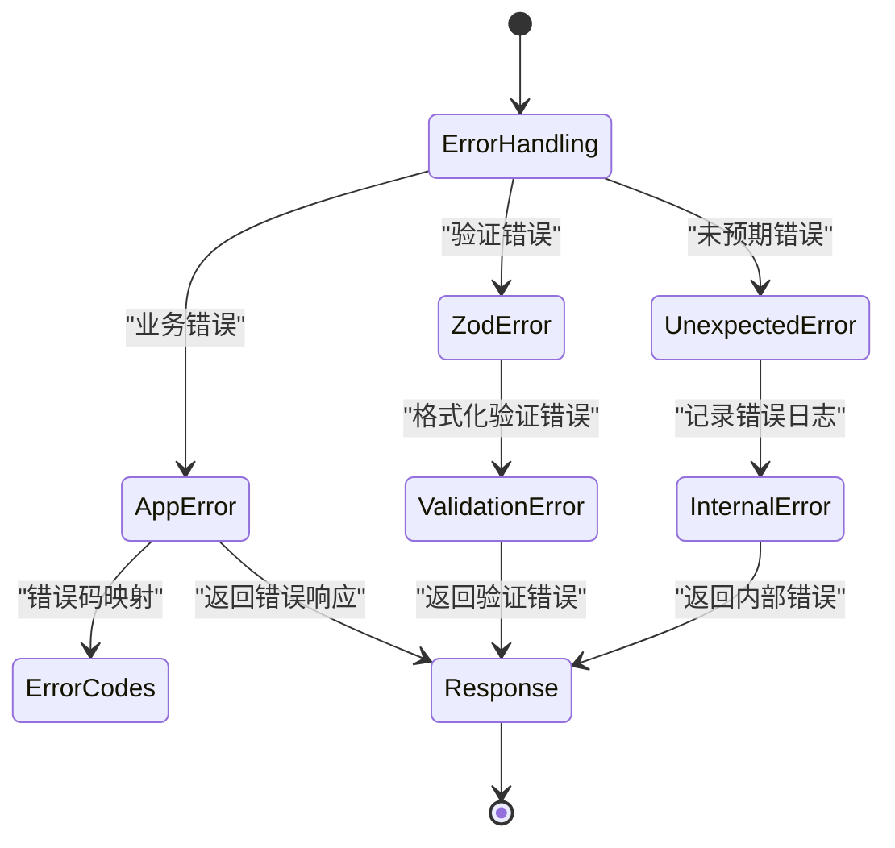
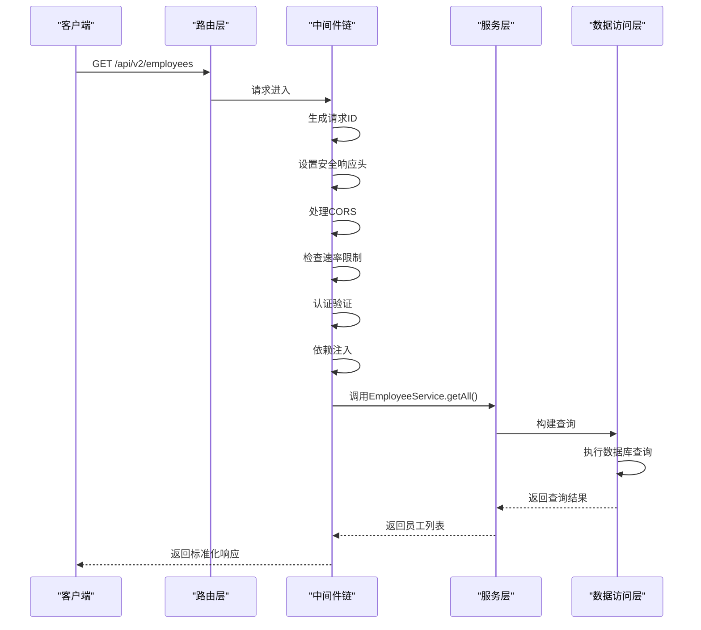
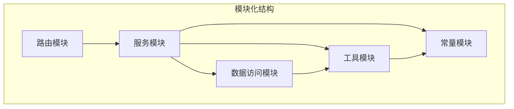

# 后端架构

<cite>
**本文档引用的文件**   
- [index.ts](file://backend/src/index.ts)
- [middleware.ts](file://backend/src/middleware.ts)
- [di.ts](file://backend/src/middleware/di.ts)
- [errorCodes.ts](file://backend/src/constants/errorCodes.ts)
- [response.ts](file://backend/src/utils/response.ts)
- [db/index.ts](file://backend/src/db/index.ts)
- [AccountService.ts](file://backend/src/services/AccountService.ts)
- [auth.ts](file://backend/src/routes/v2/auth.ts)
- [employees.ts](file://backend/src/routes/v2/employees.ts)
- [schema.ts](file://backend/src/db/schema.ts)
- [route-helpers.ts](file://backend/src/utils/route-helpers.ts)
- [drizzle.config.ts](file://backend/drizzle.config.ts)
</cite>

## 目录
1. [项目结构](#项目结构)
2. [核心架构设计](#核心架构设计)
3. [路由层分析](#路由层分析)
4. [服务层分析](#服务层分析)
5. [数据访问层分析](#数据访问层分析)
6. [API版本控制与RESTful设计](#apiversion控制与restful设计)
7. [错误处理机制](#错误处理机制)
8. [响应封装机制](#响应封装机制)
9. [典型请求生命周期](#典型请求生命周期)
10. [模块化组织方式](#模块化组织方式)

## 项目结构

后端项目采用清晰的分层架构，主要目录结构如下：

```
backend/
├── drizzle/                # Drizzle ORM迁移文件
├── scripts/                # 脚本文件
├── src/
│   ├── config/             # 配置文件
│   ├── constants/          # 常量定义
│   ├── db/                 # 数据库相关
│   ├── middleware/         # 中间件
│   ├── routes/v2/          # V2版本API路由
│   ├── schemas/            # 数据验证模式
│   ├── services/           # 业务服务
│   ├── types/              # 类型定义
│   ├── utils/              # 工具函数
│   ├── index.ts            # 应用入口
│   ├── middleware.ts       # 认证中间件
│   └── types.ts
├── test/                   # 测试文件
```

这种组织方式将路由、服务、数据访问等关注点分离，提高了代码的可维护性和可测试性。

## 核心架构设计

系统采用典型的三层架构设计：路由层、服务层和数据访问层。这种分层架构确保了各层职责分明，降低了耦合度。



**Diagram sources**
- [index.ts](file://backend/src/index.ts#L53-L362)
- [di.ts](file://backend/src/middleware/di.ts#L41-L156)
- [db/index.ts](file://backend/src/db/index.ts#L4-L6)

**Section sources**
- [index.ts](file://backend/src/index.ts#L53-L362)
- [di.ts](file://backend/src/middleware/di.ts#L41-L156)

## 路由层分析

路由层基于Hono框架构建，采用OpenAPI规范定义API接口。所有V2版本的API路由都注册在`/api/v2`路径下。



**Diagram sources**
- [index.ts](file://backend/src/index.ts#L56-L347)
- [middleware.ts](file://backend/src/middleware.ts#L17-L120)
- [di.ts](file://backend/src/middleware/di.ts#L41-L156)

**Section sources**
- [index.ts](file://backend/src/index.ts#L56-L347)
- [middleware.ts](file://backend/src/middleware.ts#L17-L120)

### 中间件链处理

Hono的中间件链按顺序处理请求，每个中间件负责特定的功能：

1. **请求ID生成**: 为每个请求生成唯一ID，便于追踪
2. **安全响应头**: 设置X-Content-Type-Options、X-Frame-Options等安全头
3. **CORS处理**: 配置跨域资源共享策略
4. **速率限制**: 基于IP的API调用频率限制
5. **认证中间件**: JWT令牌验证和用户会话管理
6. **依赖注入**: 初始化服务实例并注入到请求上下文

## 服务层分析

服务层封装了核心业务逻辑，通过依赖注入模式协调各个操作。

```mermaid
classDiagram
class Service {
<<abstract>>
+db : DrizzleD1Database
}
class AccountService {
+getAccounts(search? : string)
+getAccountTransactions(accountId, page, pageSize)
+createAccount(data)
+updateAccount(id, data)
+deleteAccount(id)
}
class EmployeeService {
+getAll(filters)
+getById(id)
+create(data)
+update(id, data)
+delete(id)
}
class AuthService {
+login(email, password, totp)
+logout(sessionId)
+activateAccount(token, password, totpSecret, totpCode)
+resetPassword(token, password)
+requestPasswordReset(email)
}
Service <|-- AccountService
Service <|-- EmployeeService
Service <|-- AuthService
AccountService --> "1" "Database"
EmployeeService --> "1" "Database"
AuthService --> "1" "Database"
```

**Diagram sources**
- [AccountService.ts](file://backend/src/services/AccountService.ts#L12-L168)
- [EmployeeService.ts](file://backend/src/services/EmployeeService.ts)
- [AuthService.ts](file://backend/src/services/AuthService.ts)

**Section sources**
- [AccountService.ts](file://backend/src/services/AccountService.ts#L12-L168)
- [di.ts](file://backend/src/middleware/di.ts#L45-L152)

### 依赖注入机制

依赖注入中间件在请求处理前初始化所有服务实例，并将其注入到请求上下文中：

```typescript
export const di = async (c, next) => {
  const db = createDb(c.env.DB)
  
  // 初始化服务实例
  const employeeService = new EmployeeService(db, emailService)
  const financeService = new FinanceService(db)
  const authService = new AuthService(db, c.env.SESSIONS_KV, systemConfigService)
  
  // 注入到上下文
  c.set('db', db)
  c.set('services', {
    employee: employeeService,
    finance: financeService,
    auth: authService
  })
  
  await next()
}
```

## 数据访问层分析

数据访问层基于Drizzle ORM实现，提供了类型安全的数据库操作。



**Diagram sources**
- [schema.ts](file://backend/src/db/schema.ts#L14-L200)
- [db/index.ts](file://backend/src/db/index.ts#L4-L6)

**Section sources**
- [schema.ts](file://backend/src/db/schema.ts#L14-L200)
- [db/index.ts](file://backend/src/db/index.ts#L4-L6)

### Drizzle ORM集成

Drizzle ORM通过以下方式与数据库交互：

1. **模式定义**: 在`schema.ts`中定义数据库表结构
2. **数据库连接**: 通过`createDb`函数创建Drizzle实例
3. **查询构建**: 使用Drizzle的查询API构建类型安全的SQL查询
4. **事务管理**: 支持数据库事务操作

## API版本控制与RESTful设计

系统采用显式的API版本控制策略，所有V2版本的API都通过`/api/v2`路径访问。



**Diagram sources**
- [index.ts](file://backend/src/index.ts#L307-L347)
- [auth.ts](file://backend/src/routes/v2/auth.ts#L28-L688)

**Section sources**
- [index.ts](file://backend/src/index.ts#L307-L347)
- [auth.ts](file://backend/src/routes/v2/auth.ts#L28-L688)

### RESTful设计规范

API设计遵循RESTful原则：

- **资源导向**: 使用名词表示资源（如`/employees`, `/accounts`）
- **HTTP方法**: 使用标准HTTP方法（GET、POST、PUT、DELETE）
- **状态码**: 正确使用HTTP状态码
- **无状态**: 每个请求包含所有必要信息
- **HATEOAS**: 响应中包含相关资源链接

## 错误处理机制

系统采用统一的错误处理机制，通过`errorCodes.ts`定义标准错误码。



**Diagram sources**
- [errorCodes.ts](file://backend/src/constants/errorCodes.ts#L5-L32)
- [errors.ts](file://backend/src/utils/errors.ts#L8-L228)

**Section sources**
- [errorCodes.ts](file://backend/src/constants/errorCodes.ts#L5-L32)
- [errors.ts](file://backend/src/utils/errors.ts#L8-L228)

### 错误码分类

错误码分为四大类：

- **认证与授权 (AUTH)**: 如`AUTH_UNAUTHORIZED`, `AUTH_FORBIDDEN`
- **验证 (VALIDATION)**: 如`VALIDATION_BAD_REQUEST`, `VALIDATION_REQUIRED_FIELD`
- **业务逻辑 (BUSINESS)**: 如`BUSINESS_NOT_FOUND`, `BUSINESS_DUPLICATE`
- **系统 (SYSTEM)**: 如`SYSTEM_INTERNAL_ERROR`, `SYSTEM_DB_ERROR`

## 响应封装机制

系统使用`response.ts`文件统一响应格式，确保API响应的一致性。

```mermaid
classDiagram
class ApiResponse {
<<interface>>
+success : boolean
}
class ApiSuccessResponse {
+success : true
+data : T
+message? : string
}
class ApiErrorResponse {
+success : false
+error : {
+code : string
+message : string
+details? : any
}
}
class PaginatedData {
+items : T[]
+pagination : PaginationMeta
}
class PaginationMeta {
+page : number
+pageSize : number
+total : number
+totalPages : number
}
ApiResponse <|-- ApiSuccessResponse
ApiResponse <|-- ApiErrorResponse
ApiSuccessResponse <|-- ApiPagedResponse
ApiPagedResponse --> PaginatedData
PaginatedData --> PaginationMeta
```

**Diagram sources**
- [response.ts](file://backend/src/utils/response.ts#L9-L132)

**Section sources**
- [response.ts](file://backend/src/utils/response.ts#L9-L132)

### 响应格式

统一的响应格式包括：

- **成功响应**: `{ success: true, data: T, message?: string }`
- **错误响应**: `{ success: false, error: { code: string, message: string, details?: any } }`
- **分页响应**: 包含数据项和分页元信息
- **游标分页**: 支持基于游标的分页

## 典型请求生命周期

以员工列表查询为例，展示一个典型请求从入口到数据库的完整生命周期。



**Diagram sources**
- [employees.ts](file://backend/src/routes/v2/employees.ts#L20-L200)
- [EmployeeService.ts](file://backend/src/services/EmployeeService.ts)
- [AccountService.ts](file://backend/src/services/AccountService.ts#L15-L44)

**Section sources**
- [employees.ts](file://backend/src/routes/v2/employees.ts#L20-L200)
- [AccountService.ts](file://backend/src/services/AccountService.ts#L15-L44)

## 模块化组织方式

系统采用模块化组织方式，提升了代码的可维护性和可扩展性。



**Diagram sources**
- [index.ts](file://backend/src/index.ts#L26-L51)
- [services/](file://backend/src/services/)
- [routes/v2/](file://backend/src/routes/v2/)

**Section sources**
- [index.ts](file://backend/src/index.ts#L26-L51)
- [services/](file://backend/src/services/)
- [routes/v2/](file://backend/src/routes/v2/)

### 模块化优势

1. **关注点分离**: 每个模块负责特定功能
2. **易于测试**: 模块可以独立进行单元测试
3. **可重用性**: 服务和工具可以在不同路由间共享
4. **可维护性**: 修改一个模块不影响其他模块
5. **可扩展性**: 可以轻松添加新模块而不影响现有代码

这种模块化设计为后续功能扩展提供了清晰的路径，新功能可以按照现有模式添加到相应的模块中。