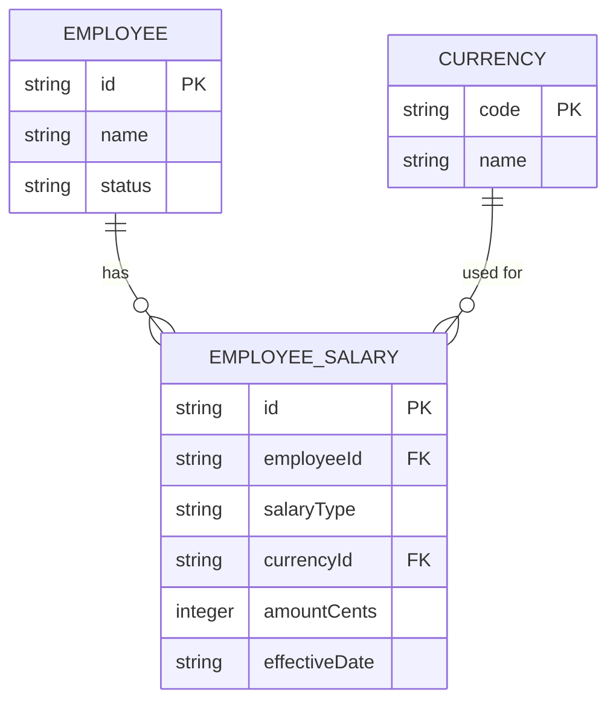
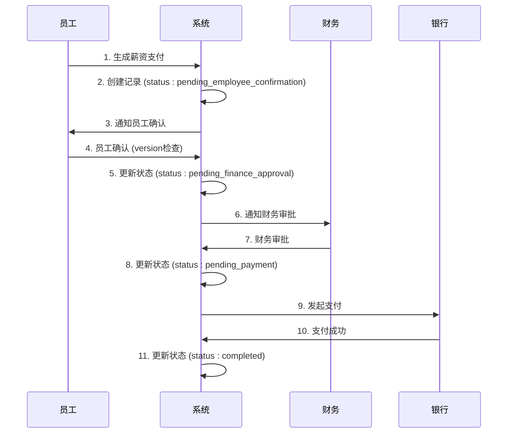
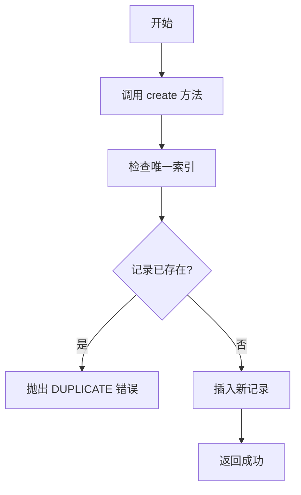
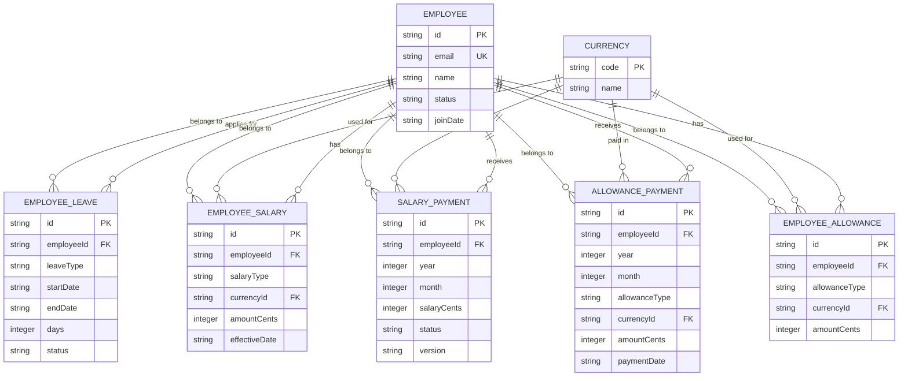

# 人事薪酬数据模型

<cite>
**本文档引用的文件**   
- [schema.ts](file://backend/src/db/schema.ts)
- [migration_add_salary_tables.sql](file://backend/src/db/migration_add_salary_tables.sql)
- [SalaryService.ts](file://backend/src/services/SalaryService.ts)
- [SalaryPaymentService.ts](file://backend/src/services/SalaryPaymentService.ts)
- [EmployeeLeaveService.ts](file://backend/src/services/EmployeeLeaveService.ts)
- [AllowancePaymentService.ts](file://backend/src/services/AllowancePaymentService.ts)
- [salary-payments.ts](file://backend/src/routes/v2/salary-payments.ts)
- [employee-leaves.ts](file://backend/src/routes/v2/employee-leaves.ts)
- [allowance-payments.ts](file://backend/src/routes/v2/allowance-payments.ts)
- [state-machine.ts](file://backend/src/utils/state-machine.ts)
- [optimistic-lock.ts](file://backend/src/utils/optimistic-lock.ts)
- [SalaryPaymentGenerationService.ts](file://backend/src/services/SalaryPaymentGenerationService.ts)
- [SalaryPaymentProcessingService.ts](file://backend/src/services/SalaryPaymentProcessingService.ts)
</cite>

## 目录
1. [简介](#简介)
2. [核心表结构与关系](#核心表结构与关系)
3. [员工薪资表 (employeeSalaries)](#员工薪资表-employeesalaries)
4. [薪资发放表 (salaryPayments)](#薪资发放表-salarypayments)
5. [员工请假表 (employeeLeaves)](#员工请假表-employeeleaves)
6. [津贴发放表 (allowancePayments)](#津贴发放表-allowancepayments)
7. [实体关系图 (ER Diagram)](#实体关系图-er-diagram)

## 简介
本文档旨在全面解析人事薪酬系统中的核心数据模型。该模型围绕员工的薪资、请假和津贴等关键人事活动构建，通过 `employeeSalaries`、`salaryPayments`、`employeeLeaves` 和 `allowancePayments` 四个核心表来管理相关数据。文档将深入探讨这些表的结构、字段含义、业务逻辑以及它们之间的关系，特别关注多币种薪资支持、薪资发放流程、请假审批机制以及防止重复发放的唯一索引等关键设计。

**Section sources**
- [schema.ts](file://backend/src/db/schema.ts)

## 核心表结构与关系
人事薪酬数据模型的核心由四个主要数据表构成，它们共同支撑起薪资、请假和津贴的管理功能。`employees` 表作为基础，存储所有员工信息。`employeeSalaries` 表记录员工的薪资标准，`salaryPayments` 表管理薪资的发放流程，`employeeLeaves` 表处理请假申请，而 `allowancePayments` 表则负责记录各类津贴的发放。这些表通过 `employeeId` 等外键与 `employees` 表紧密关联，形成一个完整的业务闭环。

**Section sources**
- [schema.ts](file://backend/src/db/schema.ts)

## 员工薪资表 (employeeSalaries)

`employeeSalaries` 表用于存储员工的薪资标准，支持试用期和正式薪资，并允许多币种配置。

### 表结构分析
该表的关键字段包括：
- **`employeeId`**: 员工ID，外键关联 `employees` 表。
- **`salaryType`**: 薪资类型，枚举值为 `'probation'` (试用期) 或 `'regular'` (正式)。
- **`currencyId`**: 币种ID，外键关联 `currencies` 表，支持多币种薪资。
- **`amountCents`**: 薪资金额，以“分”为单位存储，避免浮点数精度问题。
- **`effectiveDate`**: 生效日期，用于标识该薪资记录的生效时间。

### 业务逻辑
系统通过 `SalaryService` 服务类来管理薪资记录。该服务提供了创建、更新、删除和查询薪资的接口。当需要为员工设置薪资时，可以调用 `create` 方法。系统支持为同一员工设置不同币种的薪资，例如，同时设置 USDT 和 CNY 的薪资。在生成月度薪资支付时，系统会根据员工的当前状态（试用或正式）优先选择 USDT 币种的薪资作为基准。

**Diagram sources**
- [schema.ts](file://backend/src/db/schema.ts#L220-L229)
- [SalaryService.ts](file://backend/src/services/SalaryService.ts#L1-L186)

**Section sources**
- [schema.ts](file://backend/src/db/schema.ts#L220-L229)
- [migration_add_salary_tables.sql](file://backend/src/db/migration_add_salary_tables.sql#L1-L10)
- [SalaryService.ts](file://backend/src/services/SalaryService.ts#L1-L186)

## 薪资发放表 (salaryPayments)

`salaryPayments` 表是薪资发放流程的核心，它管理从生成到支付完成的整个生命周期，并通过状态机和乐观锁确保数据一致性。

### 表结构分析
该表的关键字段包括：
- **`status`**: 支付状态，是一个关键的状态机字段，其值包括：
  - `pending_employee_confirmation`: 待员工确认
  - `pending_finance_approval`: 待财务审批
  - `pending_payment`: 待支付
  - `pending_payment_confirmation`: 待支付确认
  - `completed`: 已完成
- **`version`**: 乐观锁版本号，用于解决并发修改冲突。每次更新记录时，版本号会递增。
- **`allocationStatus`**: 分配状态，用于管理多币种薪资的分配流程。
- **`employeeConfirmedBy` / `financeApprovedBy`**: 记录确认和审批操作的执行人。
- **`paymentVoucherPath`**: 支付凭证的存储路径。

### 业务流程与状态机
薪资发放流程遵循一个严格的线性状态流转：`pending_employee_confirmation` → `pending_finance_approval` → `pending_payment` → `pending_payment_confirmation` → `completed`。该流程由 `salaryPaymentStateMachine` 状态机严格控制，确保状态只能按预定义的路径转换，防止非法操作。

### 乐观锁机制
在 `employeeConfirm` 和 `financeApprove` 等关键更新操作中，系统会检查 `expectedVersion` 参数。`SalaryPaymentService` 会调用 `validateVersion` 函数来验证当前数据库中的 `version` 是否与客户端传入的 `expectedVersion` 一致。如果版本不匹配，说明记录已被其他用户修改，系统将抛出并发冲突错误，要求用户刷新页面后重试。

**Diagram sources**
- [schema.ts](file://backend/src/db/schema.ts#L286-L316)
- [state-machine.ts](file://backend/src/utils/state-machine.ts#L48-L54)
- [optimistic-lock.ts](file://backend/src/utils/optimistic-lock.ts#L16-L32)
- [SalaryPaymentService.ts](file://backend/src/services/SalaryPaymentService.ts#L117-L171)
- [salary-payments.ts](file://backend/src/routes/v2/salary-payments.ts#L205-L245)

**Section sources**
- [schema.ts](file://backend/src/db/schema.ts#L286-L316)
- [SalaryPaymentService.ts](file://backend/src/services/SalaryPaymentService.ts#L1-L326)
- [salary-payments.ts](file://backend/src/routes/v2/salary-payments.ts#L1-L604)
- [state-machine.ts](file://backend/src/utils/state-machine.ts#L48-L54)
- [optimistic-lock.ts](file://backend/src/utils/optimistic-lock.ts#L16-L32)
- [SalaryPaymentGenerationService.ts](file://backend/src/services/SalaryPaymentGenerationService.ts#L1-L278)
- [SalaryPaymentProcessingService.ts](file://backend/src/services/SalaryPaymentProcessingService.ts#L1-L378)

## 员工请假表 (employeeLeaves)

`employeeLeaves` 表用于处理员工的请假申请和审批流程。

### 表结构分析
该表的关键字段包括：
- **`leaveType`**: 请假类型，如年假、病假等。
- **`startDate` / `endDate`**: 请假的开始和结束日期。
- **`days`**: 请假天数。
- **`status`**: 申请状态，枚举值为 `'pending'` (待审批), `'approved'` (已批准), `'rejected'` (已拒绝)。
- **`approvedBy` / `approvedAt`**: 记录审批人和审批时间。

### 业务逻辑
请假流程由 `EmployeeLeaveService` 服务类管理。员工通过 `createLeave` 方法提交申请，状态默认为 `pending`。拥有审批权限的HR或主管可以通过 `updateLeaveStatus` 方法将状态更新为 `approved` 或 `rejected`。该流程同样由一个状态机 (`leaveStateMachine`) 控制，只允许从 `pending` 状态转换到 `approved` 或 `rejected` 状态，确保流程的严谨性。

**Section sources**
- [schema.ts](file://backend/src/db/schema.ts#L269-L284)
- [EmployeeLeaveService.ts](file://backend/src/services/EmployeeLeaveService.ts#L1-L182)
- [employee-leaves.ts](file://backend/src/routes/v2/employee-leaves.ts#L1-L176)
- [state-machine.ts](file://backend/src/utils/state-machine.ts#L83-L87)

## 津贴发放表 (allowancePayments)

`allowancePayments` 表用于记录员工津贴的发放情况，并通过唯一索引防止重复发放。

### 表结构分析
该表的关键字段包括：
- **`year` / `month`**: 津贴发放的年份和月份。
- **`allowanceType`**: 津贴类型，如住房、交通、餐补等。
- **`currencyId`**: 津贴发放的币种。
- **`amountCents`**: 津贴金额，以“分”为单位。
- **`paymentDate`**: 实际发放日期。

### 唯一索引防重机制
该表定义了一个名为 `idx_unq_allowance_payments_emp_period_type` 的唯一索引，其组合字段为 `(employeeId, year, month, allowanceType)`。这意味着对于同一个员工、同一年月、同一种类型的津贴，系统只允许存在一条记录。在 `AllowancePaymentService` 的 `create` 方法中，系统会先查询数据库，检查是否存在满足这四个字段组合的记录。如果存在，则抛出 `DUPLICATE` 错误，从而有效防止了重复发放。

**Diagram sources**
- [schema.ts](file://backend/src/db/schema.ts#L241-L267)
- [AllowancePaymentService.ts](file://backend/src/services/AllowancePaymentService.ts#L62-L79)

**Section sources**
- [schema.ts](file://backend/src/db/schema.ts#L241-L267)
- [AllowancePaymentService.ts](file://backend/src/services/AllowancePaymentService.ts#L1-L269)
- [allowance-payments.ts](file://backend/src/routes/v2/allowance-payments.ts#L1-L442)

## 实体关系图 (ER Diagram)

**Diagram sources**
- [schema.ts](file://backend/src/db/schema.ts)