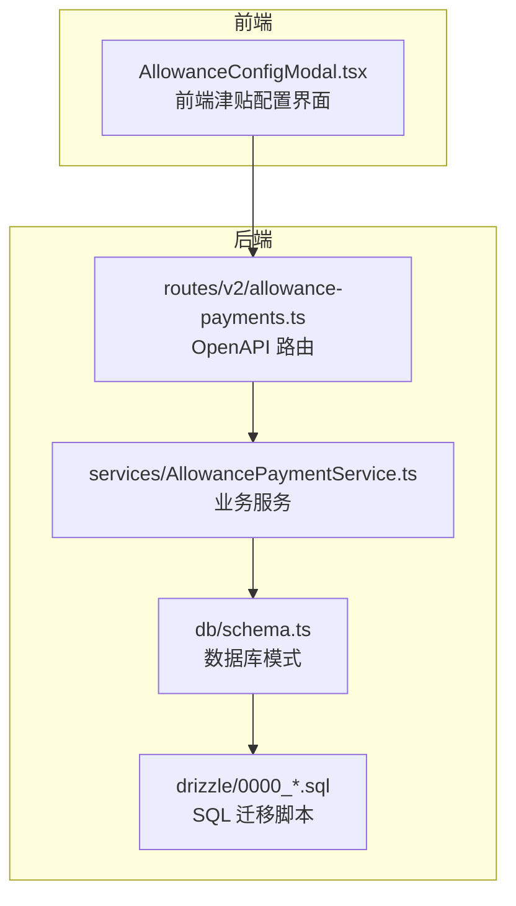
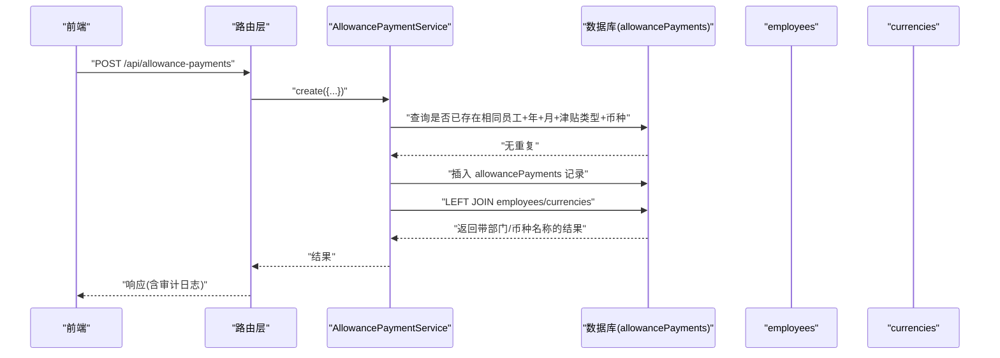
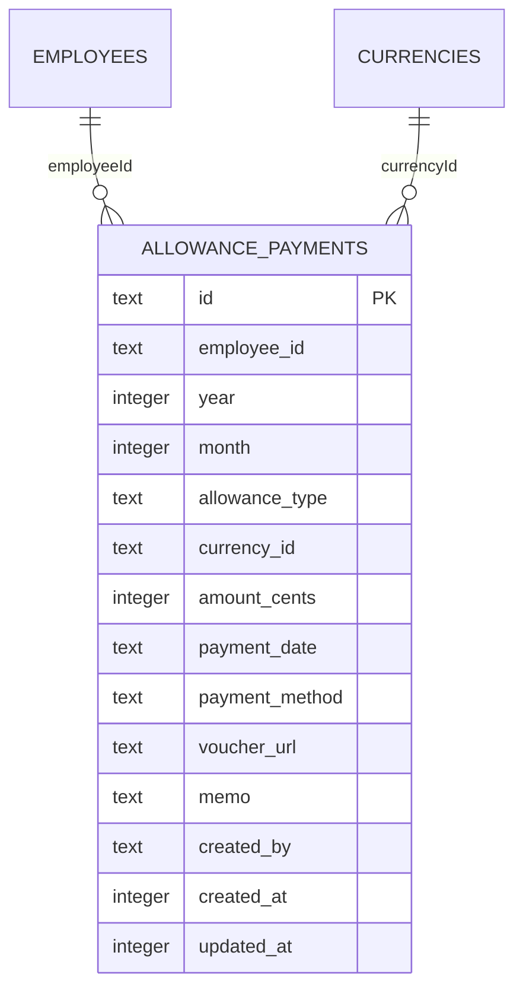
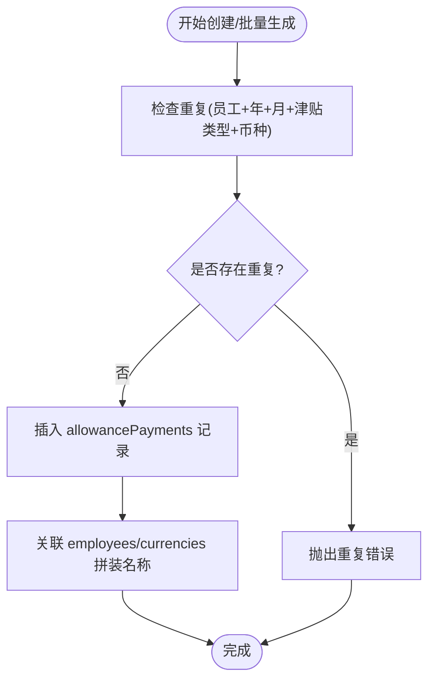
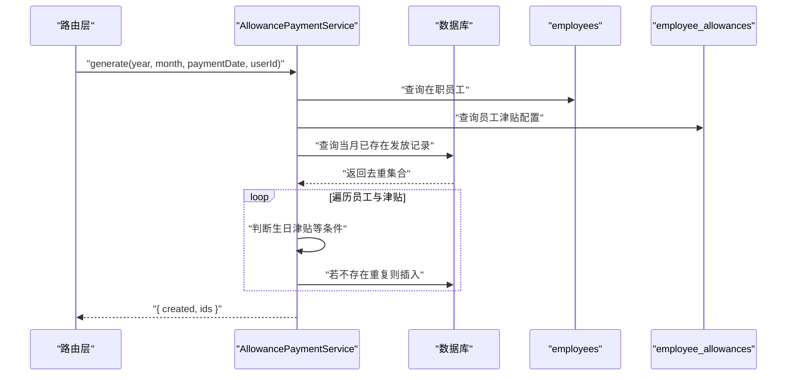
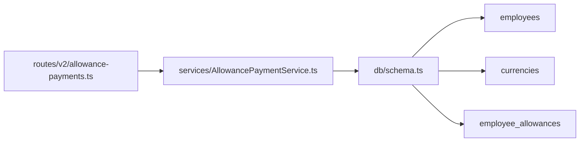

# 津贴管理数据模型

<cite>
**本文引用的文件列表**
- [schema.ts](file://backend/src/db/schema.ts)
- [0000_chemical_may_parker.sql](file://backend/drizzle/0000_chemical_may_parker.sql)
- [AllowancePaymentService.ts](file://backend/src/services/AllowancePaymentService.ts)
- [allowance-payments.ts](file://backend/src/routes/v2/allowance-payments.ts)
- [employee.schema.ts](file://frontend/src/validations/employee.schema.ts)
- [AllowanceConfigModal.tsx](file://frontend/src/features/employees/components/modals/AllowanceConfigModal.tsx)
- [openapi.json](file://backend/openapi.json)
</cite>

## 目录
1. [简介](#简介)
2. [项目结构](#项目结构)
3. [核心组件](#核心组件)
4. [架构总览](#架构总览)
5. [详细组件分析](#详细组件分析)
6. [依赖分析](#依赖分析)
7. [性能考虑](#性能考虑)
8. [故障排查指南](#故障排查指南)
9. [结论](#结论)
10. [附录](#附录)

## 简介
本文件系统性梳理“津贴管理”数据模型，聚焦 allowancePayments 表的结构设计、防重复机制、与员工与币种表的关联关系，以及在财务审计中的关键字段（如付款日期、凭证链接）的作用。同时结合 AllowancePaymentService 的批量发放与单笔发放流程，帮助读者快速理解从接口到服务再到数据库的完整链路。

## 项目结构
围绕津贴管理的核心文件分布如下：
- 数据库层：定义 allowancePayments 表及唯一索引、与 employees/currencies 的外键关系
- 服务层：提供查询、创建、更新、删除、批量生成、统计等能力
- 路由层：定义 OpenAPI 接口，负责参数校验、审计日志与响应封装
- 前端层：提供津贴配置界面与校验规则，支撑后端数据模型

图表来源
- [allowance-payments.ts](file://backend/src/routes/v2/allowance-payments.ts#L1-L442)
- [AllowancePaymentService.ts](file://backend/src/services/AllowancePaymentService.ts#L1-L269)
- [schema.ts](file://backend/src/db/schema.ts#L241-L267)
- [0000_chemical_may_parker.sql](file://backend/drizzle/0000_chemical_may_parker.sql#L42-L59)

章节来源
- [allowance-payments.ts](file://backend/src/routes/v2/allowance-payments.ts#L1-L442)
- [AllowancePaymentService.ts](file://backend/src/services/AllowancePaymentService.ts#L1-L269)
- [schema.ts](file://backend/src/db/schema.ts#L241-L267)
- [0000_chemical_may_parker.sql](file://backend/drizzle/0000_chemical_may_parker.sql#L42-L59)

## 核心组件
- allowancePayments 表：记录员工月度津贴发放明细，包含年、月、津贴类型、币种、金额、付款日期、付款方式、凭证链接、备注、创建者与时间戳等字段，并通过唯一索引防止重复
- AllowancePaymentService：提供列表、创建、更新、删除、批量生成、年度统计等方法
- 路由层：对请求进行参数校验、调用服务并写入审计日志
- 前端：提供津贴配置界面与校验，支持生活、住房、交通、餐补、生日等类型

章节来源
- [schema.ts](file://backend/src/db/schema.ts#L241-L267)
- [AllowancePaymentService.ts](file://backend/src/services/AllowancePaymentService.ts#L12-L269)
- [allowance-payments.ts](file://backend/src/routes/v2/allowance-payments.ts#L1-L442)
- [employee.schema.ts](file://frontend/src/validations/employee.schema.ts#L27-L49)
- [AllowanceConfigModal.tsx](file://frontend/src/features/employees/components/modals/AllowanceConfigModal.tsx#L1-L30)

## 架构总览
下图展示从前端到数据库的完整调用链路，以及 allowancePayments 表与 employees、currencies 的关联关系。

图表来源
- [allowance-payments.ts](file://backend/src/routes/v2/allowance-payments.ts#L260-L319)
- [AllowancePaymentService.ts](file://backend/src/services/AllowancePaymentService.ts#L49-L118)
- [schema.ts](file://backend/src/db/schema.ts#L241-L267)

## 详细组件分析

### allowancePayments 表结构与防重机制
- 字段概览
  - 主键：id
  - 关联字段：employeeId（外键至 employees.id）、currencyId（外键至 currencies.code）
  - 业务字段：year、month、allowanceType、amountCents、paymentDate、paymentMethod、voucherUrl、memo、createdBy、createdAt、updatedAt
- 防重复约束
  - 唯一索引：idx_unq_allowance_payments_emp_period_type(employeeId, year, month, allowanceType)
  - 服务层在创建前还会对比 currencyId，确保同一员工在同一年月的同一津贴类型且币种一致时不可重复
- 与 employees、currencies 的关联
  - 服务层在查询时通过 LEFT JOIN 将员工姓名、部门名称、币种名称拼接返回，便于前端展示

图表来源
- [schema.ts](file://backend/src/db/schema.ts#L241-L267)
- [0000_chemical_may_parker.sql](file://backend/drizzle/0000_chemical_may_parker.sql#L42-L59)

章节来源
- [schema.ts](file://backend/src/db/schema.ts#L241-L267)
- [0000_chemical_may_parker.sql](file://backend/drizzle/0000_chemical_may_parker.sql#L42-L59)

### 防重复机制实现细节
- 唯一索引层面：以员工、年、月、津贴类型为维度，天然阻止重复
- 服务层层面：在创建时额外比较币种，避免同一员工在同一年月的同一津贴类型但不同币种的情况下被误判为重复
- 批量生成时：先查询当月已存在的发放记录，构建去重集合，再逐条插入

图表来源
- [AllowancePaymentService.ts](file://backend/src/services/AllowancePaymentService.ts#L62-L95)
- [schema.ts](file://backend/src/db/schema.ts#L241-L267)

章节来源
- [AllowancePaymentService.ts](file://backend/src/services/AllowancePaymentService.ts#L62-L95)

### 字段语义与财务审计要点
- 年月：用于分组统计与报表归集
- 津贴类型：支持生活、住房、交通、餐补、生日等类型，便于分类核算
- 发放金额：以“分”为单位存储，避免浮点误差
- 付款日期：记录实际发放日期，便于资金计划与对账
- 凭证链接：指向财务附件或电子凭证地址，满足审计留痕
- 付款方式：默认现金，可扩展为银行转账、第三方支付等
- 备注：用于补充说明，如特殊调整原因

章节来源
- [allowance-payments.ts](file://backend/src/routes/v2/allowance-payments.ts#L13-L32)
- [AllowancePaymentService.ts](file://backend/src/services/AllowancePaymentService.ts#L49-L118)

### 与 employees、currencies 的关联关系
- 与 employees：通过 employeeId 关联，查询时拼接员工姓名与部门名称，便于前端展示
- 与 currencies：通过 currencyId 关联，查询时拼接币种名称，便于前端展示

章节来源
- [AllowancePaymentService.ts](file://backend/src/services/AllowancePaymentService.ts#L12-L47)
- [schema.ts](file://backend/src/db/schema.ts#L241-L267)

### 批量发放与单笔发放业务流程
- 单笔发放
  - 路由层接收参数并校验
  - 服务层先查重（员工+年+月+津贴类型+币种），无重复则插入
  - 返回带员工、部门、币种名称的结果
- 批量发放
  - 服务层获取在职员工与员工津贴配置
  - 查询当月已存在的发放记录，构建去重集合
  - 对每个符合条件的津贴项，若未重复则插入
  - 返回创建数量与记录 ID 列表

图表来源
- [allowance-payments.ts](file://backend/src/routes/v2/allowance-payments.ts#L34-L45)
- [AllowancePaymentService.ts](file://backend/src/services/AllowancePaymentService.ts#L155-L231)

章节来源
- [allowance-payments.ts](file://backend/src/routes/v2/allowance-payments.ts#L34-L45)
- [AllowancePaymentService.ts](file://backend/src/services/AllowancePaymentService.ts#L155-L231)

### 前端支持与校验
- 前端津贴配置界面支持生活、住房、交通、餐补、生日等类型，金额以“分”为单位输入
- 校验规则确保每种类型的币种与金额非负

章节来源
- [employee.schema.ts](file://frontend/src/validations/employee.schema.ts#L27-L49)
- [AllowanceConfigModal.tsx](file://frontend/src/features/employees/components/modals/AllowanceConfigModal.tsx#L1-L30)

## 依赖分析
- 组件耦合
  - 路由层依赖服务层；服务层依赖数据库模式与 employees、currencies 表
  - allowancePayments 与 employees、currencies 存在外键关系，保证数据一致性
- 唯一索引与服务层双重防重，降低并发冲突风险
- 前端通过校验与后端保持一致的数据口径（币种、金额单位）

图表来源
- [allowance-payments.ts](file://backend/src/routes/v2/allowance-payments.ts#L1-L442)
- [AllowancePaymentService.ts](file://backend/src/services/AllowancePaymentService.ts#L1-L269)
- [schema.ts](file://backend/src/db/schema.ts#L241-L267)

章节来源
- [schema.ts](file://backend/src/db/schema.ts#L241-L267)
- [AllowancePaymentService.ts](file://backend/src/services/AllowancePaymentService.ts#L1-L269)
- [allowance-payments.ts](file://backend/src/routes/v2/allowance-payments.ts#L1-L442)

## 性能考虑
- 查询优化
  - 列表查询按年、月、员工排序，利于前端分页与筛选
  - 批量生成时先查当月已存在记录，使用集合去重，减少重复插入
- 存储优化
  - 金额统一以“分”存储，避免浮点误差
  - 唯一索引覆盖员工、年、月、津贴类型，命中率高
- 并发控制
  - 唯一索引与服务层双重校验，有效降低重复插入风险

[本节为通用建议，不直接分析具体文件]

## 故障排查指南
- 创建失败提示重复
  - 现象：创建时抛出重复错误
  - 排查：确认是否同一员工在同一年月的同一津贴类型且币种一致
  - 参考：服务层创建逻辑与唯一索引
- 批量生成未创建预期记录
  - 现象：批量生成后创建数小于预期
  - 排查：检查员工入职日期、生日津贴条件、当月是否已有记录
  - 参考：批量生成逻辑与去重集合
- 审计日志缺失
  - 现象：操作未留痕
  - 排查：确认路由层是否正确记录审计日志
  - 参考：路由层审计日志调用

章节来源
- [AllowancePaymentService.ts](file://backend/src/services/AllowancePaymentService.ts#L62-L118)
- [allowance-payments.ts](file://backend/src/routes/v2/allowance-payments.ts#L297-L318)
- [AllowancePaymentService.ts](file://backend/src/services/AllowancePaymentService.ts#L155-L231)

## 结论
allowancePayments 表通过唯一索引与服务层双重防重机制，确保了“同一员工在同一年月的同一津贴类型且币种一致”的发放记录唯一性。配合与 employees、currencies 的关联查询，实现了良好的前端展示与审计留痕。AllowancePaymentService 提供了完善的单笔与批量发放能力，满足日常财务运营需求。

[本节为总结性内容，不直接分析具体文件]

## 附录
- 接口定义参考
  - OpenAPI 中 allowance-payments 的 create/update/delete/generate 接口字段与响应结构
- 前端类型与校验
  - 前端对津贴配置的类型与金额进行校验，与后端保持一致

章节来源
- [openapi.json](file://backend/openapi.json#L10145-L10182)
- [openapi.json](file://backend/openapi.json#L10726-L10821)