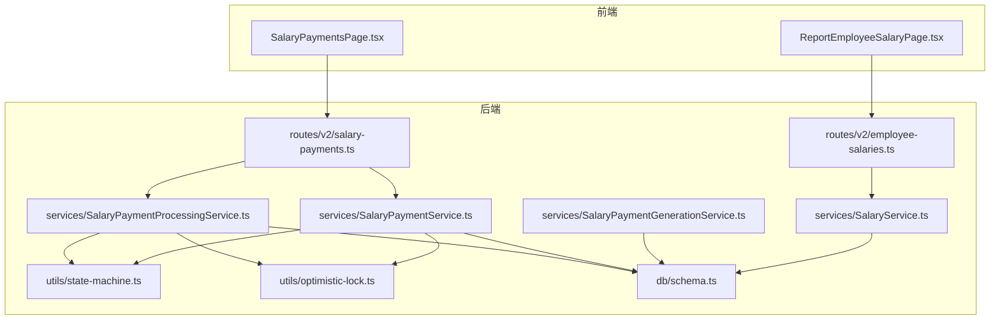
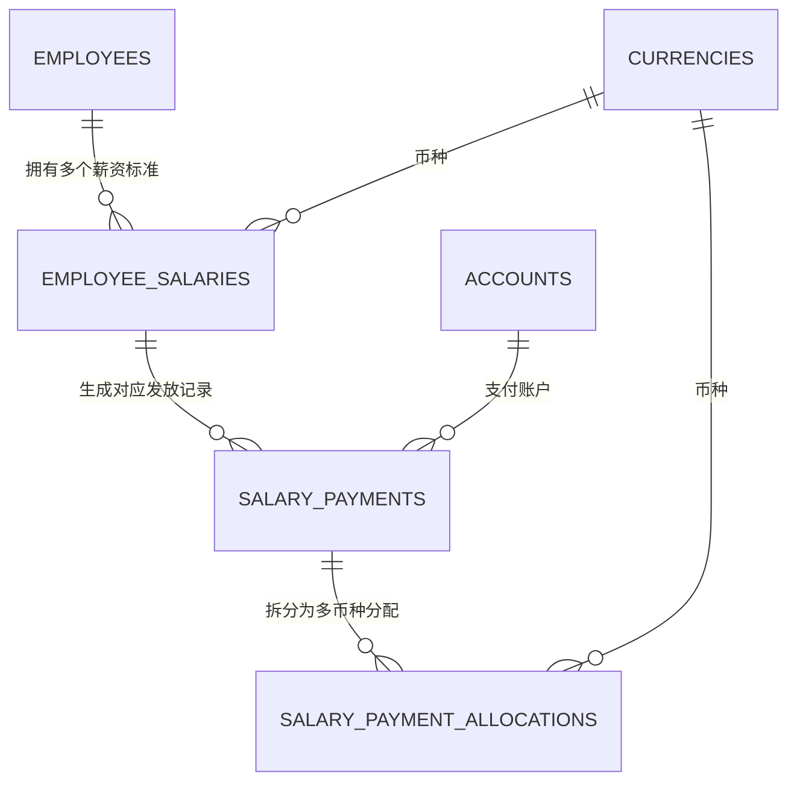
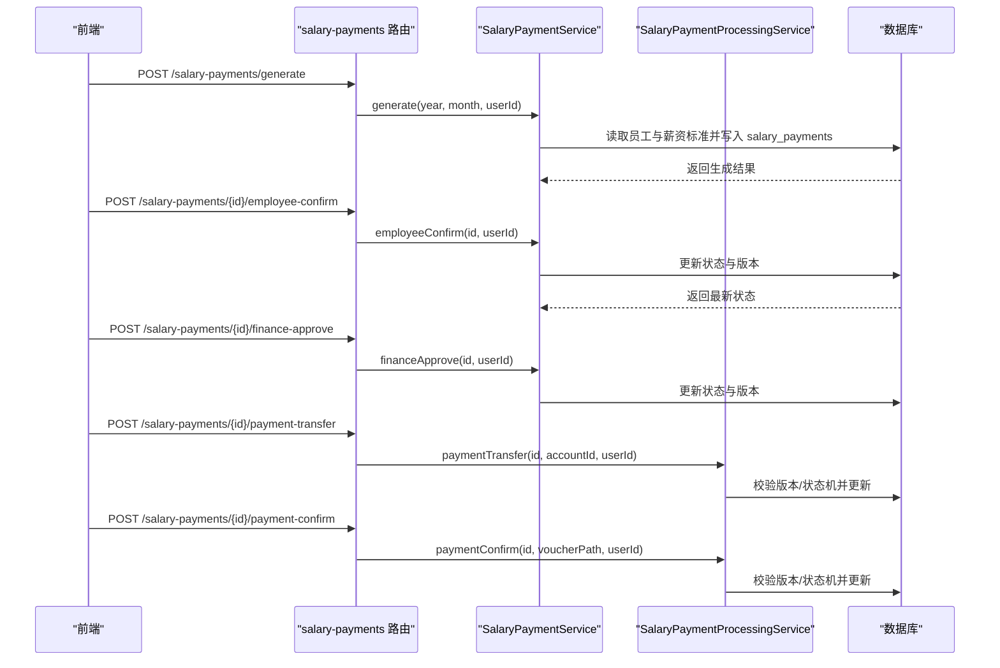
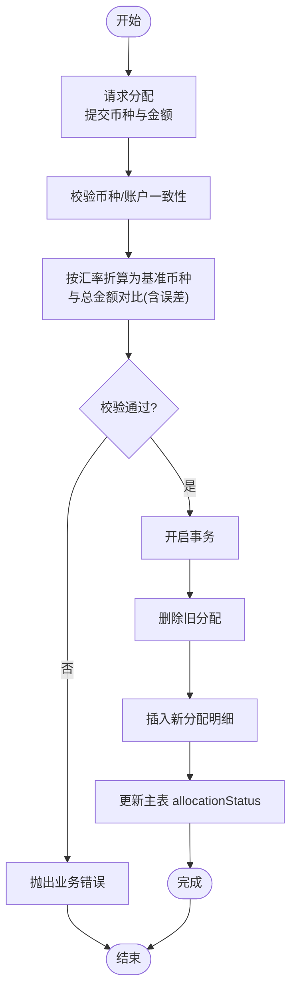
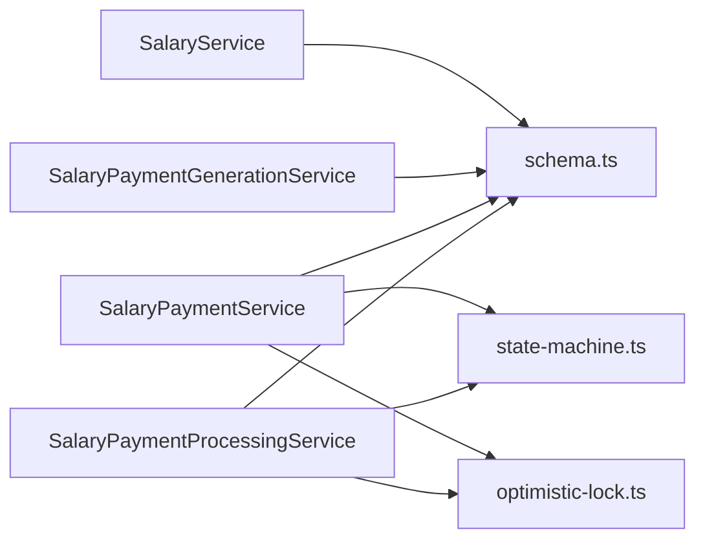

# 薪资管理数据模型

<cite>
**本文引用的文件**
- [schema.ts](file://backend/src/db/schema.ts)
- [0000_chemical_may_parker.sql](file://backend/drizzle/0000_chemical_may_parker.sql)
- [migration_add_salary_tables.sql](file://backend/src/db/migration_add_salary_tables.sql)
- [SalaryService.ts](file://backend/src/services/SalaryService.ts)
- [SalaryPaymentGenerationService.ts](file://backend/src/services/SalaryPaymentGenerationService.ts)
- [SalaryPaymentService.ts](file://backend/src/services/SalaryPaymentService.ts)
- [SalaryPaymentProcessingService.ts](file://backend/src/services/SalaryPaymentProcessingService.ts)
- [state-machine.ts](file://backend/src/utils/state-machine.ts)
- [optimistic-lock.ts](file://backend/src/utils/optimistic-lock.ts)
- [employee-salaries.ts](file://backend/src/routes/v2/employee-salaries.ts)
- [salary-payments.ts](file://backend/src/routes/v2/salary-payments.ts)
- [salary.schema.ts](file://frontend/src/validations/salary.schema.ts)
- [SalaryPaymentsPage.tsx](file://frontend/src/features/hr/pages/SalaryPaymentsPage.tsx)
- [ReportEmployeeSalaryPage.tsx](file://frontend/src/features/reports/pages/ReportEmployeeSalaryPage.tsx)
</cite>

## 目录
1. [简介](#简介)
2. [项目结构](#项目结构)
3. [核心组件](#核心组件)
4. [架构总览](#架构总览)
5. [详细组件分析](#详细组件分析)
6. [依赖分析](#依赖分析)
7. [性能考虑](#性能考虑)
8. [故障排查指南](#故障排查指南)
9. [结论](#结论)
10. [附录](#附录)

## 简介
本文件聚焦于薪资管理的数据模型与业务流程，围绕以下关键点展开：
- 解析 employeeSalaries 表如何存储员工的试用期与正式薪资，支持多币种，并记录生效日期。
- 解释 salaryPayments 表如何管理薪资发放的完整生命周期（员工确认、财务审批、支付执行、支付确认），并通过 version 字段实现乐观锁以防止并发冲突。
- 说明 salaryPaymentAllocations 表如何支持多币种薪资分配与审批流。
- 提供 ER 图展示员工、薪资标准、薪资发放记录之间的关系。
- 结合 SalaryService 的业务逻辑，给出典型使用场景与流程。

## 项目结构
薪资相关的核心代码分布在以下模块：
- 数据库模式定义：backend/src/db/schema.ts
- 路由层：backend/src/routes/v2/employee-salaries.ts、backend/src/routes/v2/salary-payments.ts
- 服务层：SalaryService.ts、SalaryPaymentGenerationService.ts、SalaryPaymentService.ts、SalaryPaymentProcessingService.ts
- 工具层：state-machine.ts（状态机）、optimistic-lock.ts（乐观锁）

图表来源
- [employee-salaries.ts](file://backend/src/routes/v2/employee-salaries.ts#L1-L258)
- [salary-payments.ts](file://backend/src/routes/v2/salary-payments.ts#L1-L604)
- [SalaryService.ts](file://backend/src/services/SalaryService.ts#L1-L186)
- [SalaryPaymentGenerationService.ts](file://backend/src/services/SalaryPaymentGenerationService.ts#L1-L276)
- [SalaryPaymentService.ts](file://backend/src/services/SalaryPaymentService.ts#L1-L325)
- [SalaryPaymentProcessingService.ts](file://backend/src/services/SalaryPaymentProcessingService.ts#L1-L378)
- [state-machine.ts](file://backend/src/utils/state-machine.ts#L1-L89)
- [optimistic-lock.ts](file://backend/src/utils/optimistic-lock.ts#L1-L41)
- [schema.ts](file://backend/src/db/schema.ts#L220-L331)

章节来源
- [employee-salaries.ts](file://backend/src/routes/v2/employee-salaries.ts#L1-L258)
- [salary-payments.ts](file://backend/src/routes/v2/salary-payments.ts#L1-L604)
- [schema.ts](file://backend/src/db/schema.ts#L220-L331)

## 核心组件
- employeeSalaries：存储员工的薪资标准（试用期/正式），支持多币种与生效日期，便于按币种汇总与计算。
- salaryPayments：记录单月薪资发放的生命周期与状态，包含版本号用于乐观锁。
- salaryPaymentAllocations：记录每笔薪资发放的多币种分配明细，支持审批与拒绝。
- SalaryService：提供员工薪资的查询、创建、批量更新、删除与合计统计。
- SalaryPaymentGenerationService：根据员工与薪资标准生成当月薪资发放记录。
- SalaryPaymentService：负责状态推进（员工确认、财务审批、回退）与查询。
- SalaryPaymentProcessingService：负责支付转账、支付确认、分配请求与审批。
- StateMachine：定义薪资支付状态机，确保状态转换合法。
- OptimisticLock：提供版本校验与递增，防止并发覆盖。

章节来源
- [schema.ts](file://backend/src/db/schema.ts#L220-L331)
- [SalaryService.ts](file://backend/src/services/SalaryService.ts#L1-L186)
- [SalaryPaymentGenerationService.ts](file://backend/src/services/SalaryPaymentGenerationService.ts#L1-L276)
- [SalaryPaymentService.ts](file://backend/src/services/SalaryPaymentService.ts#L1-L325)
- [SalaryPaymentProcessingService.ts](file://backend/src/services/SalaryPaymentProcessingService.ts#L1-L378)
- [state-machine.ts](file://backend/src/utils/state-machine.ts#L1-L89)
- [optimistic-lock.ts](file://backend/src/utils/optimistic-lock.ts#L1-L41)

## 架构总览
下图展示了员工、薪资标准、薪资发放与分配之间的关系，以及状态机驱动的流转过程。

图表来源
- [schema.ts](file://backend/src/db/schema.ts#L14-L48)
- [schema.ts](file://backend/src/db/schema.ts#L220-L331)

## 详细组件分析

### employeeSalaries 表：多币种薪资标准
- 字段要点
  - 员工标识：employeeId
  - 薪资类型：salaryType（'probation'/'regular'）
  - 币种：currencyId（关联 currencies）
  - 金额：amountCents（整数分）
  - 生效日期：effectiveDate（可选）
  - 时间戳：createdAt/updatedAt
- 设计意图
  - 支持同一员工在不同币种下的试用期与正式薪资并存。
  - 通过 effectiveDate 可扩展支持“历史生效”策略（如变更生效时间）。
  - 与 currencies 关联，保证币种有效性。
- 查询与聚合
  - SalaryService 提供按员工与类型查询、批量更新、删除与按币种求和。
  - 支持按币种统计员工总薪资，便于报表与对账。

章节来源
- [schema.ts](file://backend/src/db/schema.ts#L220-L229)
- [SalaryService.ts](file://backend/src/services/SalaryService.ts#L1-L186)

### salaryPayments 表：薪资发放生命周期与并发控制
- 字段要点
  - 年/月：year/month
  - 员工：employeeId
  - 总金额：salaryCents
  - 状态：status（pending_employee_confirmation/pending_finance_approval/pending_payment/pending_payment_confirmation/completed）
  - 分配状态：allocationStatus（pending/requested/approved）
  - 各环节签字与时间：employee_confirmed_by/at、finance_approved_by/at、payment_transferred_by/at、payment_confirmed_by/at
  - 支付凭证：payment_voucher_path
  - 回滚字段：rollback_reason/by/at
  - 版本号：version（乐观锁）
  - 时间戳：createdAt/updatedAt
- 并发控制
  - 乐观锁：version 字段配合 optimistic-lock 工具进行校验与递增，避免并发覆盖。
- 生命周期与状态机
  - 状态机定义了合法的顺序转换，服务层在推进状态前进行校验。
  - 支持回退（rollback）到上一状态，同时记录回退原因与操作历史。

章节来源
- [schema.ts](file://backend/src/db/schema.ts#L286-L316)
- [state-machine.ts](file://backend/src/utils/state-machine.ts#L44-L54)
- [optimistic-lock.ts](file://backend/src/utils/optimistic-lock.ts#L1-L41)
- [SalaryPaymentService.ts](file://backend/src/services/SalaryPaymentService.ts#L275-L325)

### salaryPaymentAllocations 表：多币种分配与审批
- 字段要点
  - 关联：salary_payment_id
  - 币种：currency_id
  - 金额：amount_cents
  - 账户：account_id（可选，若存在需与币种一致）
  - 状态：status（pending/approved/rejected）
  - 请求与审批：requested_by/at、approved_by/at
  - 时间戳：createdAt/updatedAt
- 分配流程
  - 请求分配：校验币种与账户一致性，计算多币种折算为基准币种的总额并与 salaryPayments.salaryCents 对比（允许一定误差）。
  - 审批/拒绝：支持全批或部分批处理，自动更新主表 allocationStatus。
  - 支付转账/确认：在分配完成后推进支付状态。

章节来源
- [schema.ts](file://backend/src/db/schema.ts#L318-L331)
- [SalaryPaymentProcessingService.ts](file://backend/src/services/SalaryPaymentProcessingService.ts#L179-L378)

### 路由与前端集成
- 员工薪资路由
  - 列表、创建、批量更新、删除，返回带币种与员工名的详情。
- 薪资发放路由
  - 生成、查询、状态推进（员工确认、财务审批、支付转账/确认）、分配请求与审批、删除。
- 前端页面
  - 薪资发放页与员工薪资报表页通过路由与服务交互，实现查询、生成与状态推进。

章节来源
- [employee-salaries.ts](file://backend/src/routes/v2/employee-salaries.ts#L1-L258)
- [salary-payments.ts](file://backend/src/routes/v2/salary-payments.ts#L1-L604)
- [SalaryPaymentsPage.tsx](file://frontend/src/features/hr/pages/SalaryPaymentsPage.tsx)
- [ReportEmployeeSalaryPage.tsx](file://frontend/src/features/reports/pages/ReportEmployeeSalaryPage.tsx)

### 典型使用场景与流程

#### 场景一：生成并发放当月薪资
- 步骤
  1) 生成：调用生成服务，基于在职员工与薪资标准生成当月薪资发放记录。
  2) 员工确认：员工在前端确认，服务推进状态至 pending_finance_approval。
  3) 财务审批：财务人员审批，服务推进至 pending_payment。
  4) 支付转账：选择账户并提交转账，服务推进至 pending_payment_confirmation。
  5) 支付确认：上传支付凭证，服务推进至 completed。
- 并发保障：每次状态推进均携带并校验 version，防止并发覆盖。

图表来源
- [salary-payments.ts](file://backend/src/routes/v2/salary-payments.ts#L52-L203)
- [SalaryPaymentService.ts](file://backend/src/services/SalaryPaymentService.ts#L1-L325)
- [SalaryPaymentProcessingService.ts](file://backend/src/services/SalaryPaymentProcessingService.ts#L30-L177)

#### 场景二：多币种薪资分配
- 步骤
  1) 请求分配：提交多币种分配明细，服务校验币种与账户一致性，并将各币种金额按汇率折算为基准币种，与总金额对比（允许误差）。
  2) 审批/拒绝：支持全批或部分批处理，自动更新主表 allocationStatus。
  3) 支付执行：分配完成后推进支付状态。
- 并发保障：分配请求与审批均使用事务，且主表更新携带版本号。

图表来源
- [SalaryPaymentProcessingService.ts](file://backend/src/services/SalaryPaymentProcessingService.ts#L179-L278)

## 依赖分析
- 组件耦合
  - SalaryService 依赖 schema 中的 employeeSalaries/currencies/employees。
  - SalaryPaymentGenerationService 依赖 employees、employeeSalaries、currencies、salaryPayments。
  - SalaryPaymentService 与 SalaryPaymentProcessingService 均依赖 schema 中的 salaryPayments/salaryPaymentAllocations/accounts/currencies。
  - 乐观锁与状态机被两者共同使用，提升一致性与可维护性。
- 外部依赖
  - Drizzle ORM 用于数据库访问与事务。
  - 前端通过路由与服务交互，使用查询缓存与失效策略。

图表来源
- [schema.ts](file://backend/src/db/schema.ts#L220-L331)
- [SalaryService.ts](file://backend/src/services/SalaryService.ts#L1-L186)
- [SalaryPaymentGenerationService.ts](file://backend/src/services/SalaryPaymentGenerationService.ts#L1-L276)
- [SalaryPaymentService.ts](file://backend/src/services/SalaryPaymentService.ts#L1-L325)
- [SalaryPaymentProcessingService.ts](file://backend/src/services/SalaryPaymentProcessingService.ts#L1-L378)
- [state-machine.ts](file://backend/src/utils/state-machine.ts#L1-L89)
- [optimistic-lock.ts](file://backend/src/utils/optimistic-lock.ts#L1-L41)

## 性能考虑
- 查询优化
  - 在 salaryPayments 上对 (employeeId, year, month) 建唯一索引，避免重复生成与高效查询。
  - 在 employeeSalaries 上按 employeeId/salaryType/currencyId 建索引，提升多币种查询与聚合效率。
- 事务与锁
  - 分配请求与审批采用事务，减少并发冲突概率。
  - 乐观锁版本号避免长事务下的写冲突。
- 前端缓存
  - 前端查询使用缓存与失效策略，减少重复请求。

## 故障排查指南
- 并发冲突
  - 现象：更新失败或提示“数据已被其他用户修改”。
  - 排查：确认是否携带并使用最新 version；检查前端是否正确刷新。
  - 参考：乐观锁工具与服务层状态推进逻辑。
- 状态转换错误
  - 现象：状态推进时报错“不允许从状态 X 转换到 Y”。
  - 排查：核对当前状态与状态机定义；确认是否已完成前置步骤（如分配审批）。
  - 参考：状态机定义与服务层状态推进逻辑。
- 分配金额不匹配
  - 现象：多币种分配总额与总金额差异超过允许误差。
  - 排查：检查汇率输入与币种有效性；确认折算逻辑。
  - 参考：分配请求与审批服务逻辑。
- 账户币种不匹配
  - 现象：分配中指定账户与币种不一致。
  - 排查：确保 account.currency 与 currency_id 一致。
  - 参考：分配请求与审批服务逻辑。

章节来源
- [optimistic-lock.ts](file://backend/src/utils/optimistic-lock.ts#L1-L41)
- [state-machine.ts](file://backend/src/utils/state-machine.ts#L1-L89)
- [SalaryPaymentProcessingService.ts](file://backend/src/services/SalaryPaymentProcessingService.ts#L179-L378)
- [SalaryPaymentService.ts](file://backend/src/services/SalaryPaymentService.ts#L275-L325)

## 结论
该数据模型通过 employeeSalaries 实现多币种薪资标准管理，通过 salaryPayments 与 salaryPaymentAllocations 实现薪资发放的全生命周期与多币种分配，辅以状态机与乐观锁确保流程合规与并发安全。SalaryService 与生成/处理服务分别承担标准维护与发放执行职责，路由与前端页面提供完整的业务入口。整体设计清晰、职责明确、易于扩展与维护。

## 附录

### 数据模型字段速览
- employeeSalaries
  - id、employeeId、salaryType、currencyId、amountCents、effectiveDate、createdAt、updatedAt
- salaryPayments
  - id、employeeId、year、month、salaryCents、status、allocationStatus、employee_confirmed_*、finance_approved_*、accountId、payment_*、rollback_*、version、createdAt、updatedAt
- salaryPaymentAllocations
  - id、salary_payment_id、currency_id、amount_cents、account_id、status、requested_*、approved_*、createdAt、updatedAt

章节来源
- [schema.ts](file://backend/src/db/schema.ts#L220-L331)

### 迁移与初始化
- 初始迁移包含 employee_salaries 与 employee_allowances 表。
- Drizzle 快照与 SQL 文件共同描述了表结构与列定义。

章节来源
- [migration_add_salary_tables.sql](file://backend/src/db/migration_add_salary_tables.sql#L1-L21)
- [0000_chemical_may_parker.sql](file://backend/drizzle/0000_chemical_may_parker.sql)