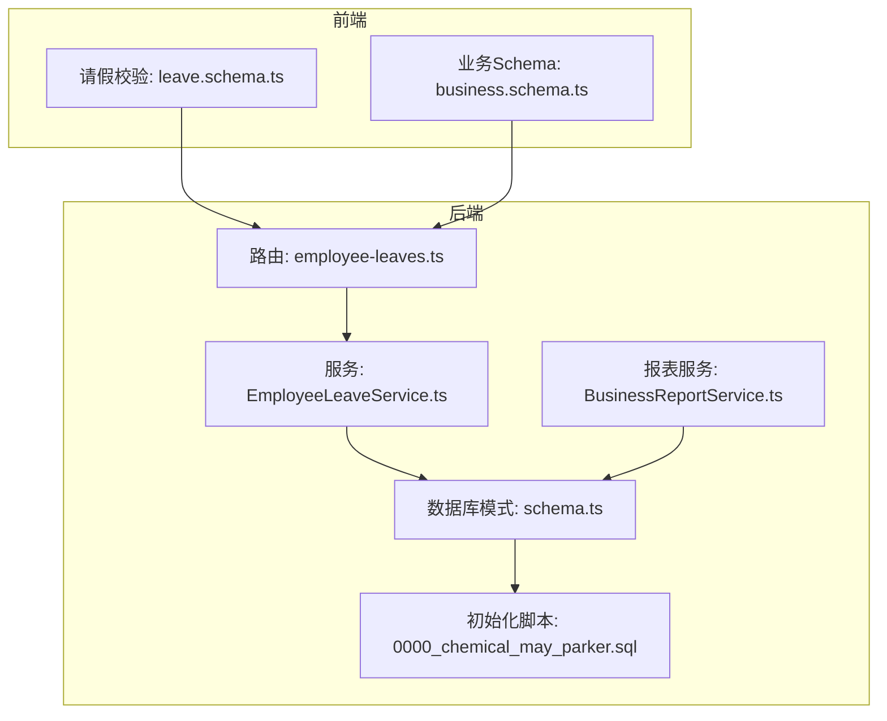
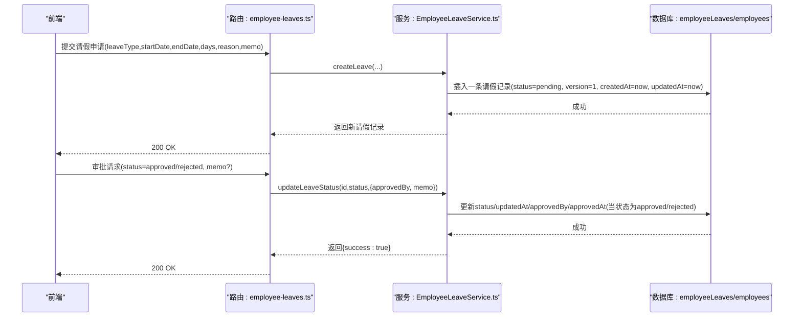
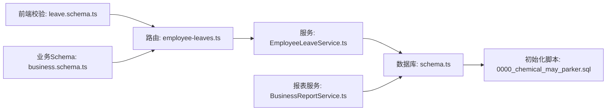

# 请假管理数据模型

<cite>
**本文引用的文件**
- [backend/src/db/schema.ts](file://backend/src/db/schema.ts)
- [backend/drizzle/0000_chemical_may_parker.sql](file://backend/drizzle/0000_chemical_may_parker.sql)
- [backend/src/routes/v2/employee-leaves.ts](file://backend/src/routes/v2/employee-leaves.ts)
- [backend/src/services/EmployeeLeaveService.ts](file://backend/src/services/EmployeeLeaveService.ts)
- [frontend/src/validations/leave.schema.ts](file://frontend/src/validations/leave.schema.ts)
- [backend/src/services/BusinessReportService.ts](file://backend/src/services/BusinessReportService.ts)
- [backend/src/schemas/business.schema.ts](file://backend/src/schemas/business.schema.ts)
</cite>

## 目录
1. [简介](#简介)
2. [项目结构](#项目结构)
3. [核心组件](#核心组件)
4. [架构总览](#架构总览)
5. [详细组件分析](#详细组件分析)
6. [依赖分析](#依赖分析)
7. [性能考虑](#性能考虑)
8. [故障排查指南](#故障排查指南)
9. [结论](#结论)

## 简介
本文件系统性梳理“请假管理”数据模型，围绕 employeeLeaves 表的结构、字段语义、业务流程与并发控制进行深入解析。重点覆盖：
- 请假类型、起止日期、天数、审批状态（pending、approved、rejected）及审批人信息的存储与流转
- version 字段实现的乐观锁机制在并发审批请求中的作用
- 与 employees 表的关联关系
- 通过 createdAt/updatedAt 追踪请假申请生命周期
- 结合 EmployeeLeaveService 的业务逻辑，说明请假申请、审批、撤销等操作的数据流

## 项目结构
请假相关代码分布在后端路由、服务层与数据库模式定义中，并由前端校验规则配合。

图表来源
- [backend/src/routes/v2/employee-leaves.ts](file://backend/src/routes/v2/employee-leaves.ts#L1-L176)
- [backend/src/services/EmployeeLeaveService.ts](file://backend/src/services/EmployeeLeaveService.ts#L1-L182)
- [backend/src/db/schema.ts](file://backend/src/db/schema.ts#L269-L284)
- [backend/drizzle/0000_chemical_may_parker.sql](file://backend/drizzle/0000_chemical_may_parker.sql#L213-L228)
- [backend/src/services/BusinessReportService.ts](file://backend/src/services/BusinessReportService.ts#L265-L300)
- [frontend/src/validations/leave.schema.ts](file://frontend/src/validations/leave.schema.ts#L1-L32)
- [backend/src/schemas/business.schema.ts](file://backend/src/schemas/business.schema.ts#L848-L869)

章节来源
- [backend/src/routes/v2/employee-leaves.ts](file://backend/src/routes/v2/employee-leaves.ts#L1-L176)
- [backend/src/services/EmployeeLeaveService.ts](file://backend/src/services/EmployeeLeaveService.ts#L1-L182)
- [backend/src/db/schema.ts](file://backend/src/db/schema.ts#L269-L284)
- [backend/drizzle/0000_chemical_may_parker.sql](file://backend/drizzle/0000_chemical_may_parker.sql#L213-L228)
- [frontend/src/validations/leave.schema.ts](file://frontend/src/validations/leave.schema.ts#L1-L32)
- [backend/src/schemas/business.schema.ts](file://backend/src/schemas/business.schema.ts#L848-L869)

## 核心组件
- 数据表：employeeLeaves
  - 主键：id
  - 外键：employeeId -> employees.id
  - 关键字段：leaveType、startDate、endDate、days、status、reason、memo、approvedBy、approvedAt、version、createdAt、updatedAt
- 路由层：提供请假列表、创建请假、更新状态（审批）接口
- 服务层：封装查询、插入、更新状态等业务逻辑
- 前端校验：约束请假类型、日期范围、天数、原因与备注长度

章节来源
- [backend/src/db/schema.ts](file://backend/src/db/schema.ts#L269-L284)
- [backend/drizzle/0000_chemical_may_parker.sql](file://backend/drizzle/0000_chemical_may_parker.sql#L213-L228)
- [backend/src/routes/v2/employee-leaves.ts](file://backend/src/routes/v2/employee-leaves.ts#L1-L176)
- [frontend/src/validations/leave.schema.ts](file://frontend/src/validations/leave.schema.ts#L1-L32)

## 架构总览
请假管理从“前端校验 -> 后端路由 -> 服务层 -> 数据库”的完整链路如下：

图表来源
- [backend/src/routes/v2/employee-leaves.ts](file://backend/src/routes/v2/employee-leaves.ts#L83-L176)
- [backend/src/services/EmployeeLeaveService.ts](file://backend/src/services/EmployeeLeaveService.ts#L100-L181)
- [backend/src/db/schema.ts](file://backend/src/db/schema.ts#L269-L284)

## 详细组件分析

### 数据表：employeeLeaves 字段与语义
- 主键与外键
  - id：唯一标识
  - employeeId：指向 employees.id，建立请假与员工的关联
- 请假基本信息
  - leaveType：请假类型（如 sick、annual、personal、other）
  - startDate/endDate：起止日期（字符串或日期格式）
  - days：请假天数（整数）
- 审批状态与审批人
  - status：默认 pending；可更新为 approved 或 rejected
  - approvedBy：审批人用户ID
  - approvedAt：审批时间戳
  - memo：审批备注
- 并发控制
  - version：乐观锁版本号，默认 1
- 时间戳
  - createdAt/updatedAt：记录创建与最后更新时间戳

章节来源
- [backend/src/db/schema.ts](file://backend/src/db/schema.ts#L269-L284)
- [backend/drizzle/0000_chemical_may_parker.sql](file://backend/drizzle/0000_chemical_may_parker.sql#L213-L228)

### 路由层：请假接口
- 列表查询
  - 支持按 employeeId、status 查询
  - 返回包含员工姓名、请假详情、审批人信息、时间戳等
- 创建请假
  - 校验权限（hr.leave.create）
  - 接收 employeeId、leaveType、startDate、endDate、days、reason、memo
  - 返回新建请假记录（status 默认 pending）
- 更新状态（审批）
  - 校验权限（hr.leave.approve）
  - 接收 id、status（枚举 pending、approved、rejected）、memo
  - 记录审批人与审批时间戳（当状态为 approved/rejected）

章节来源
- [backend/src/routes/v2/employee-leaves.ts](file://backend/src/routes/v2/employee-leaves.ts#L1-L176)

### 服务层：EmployeeLeaveService
- 列表查询
  - 左连接 employees，获取员工姓名与审批人姓名
  - 支持按 employeeId、status、year 过滤
  - 按 createdAt 降序返回
- 统计与报表
  - getLeaveStats：按年统计已批准的各类请假天数
- 创建请假
  - 生成唯一 id，设置 status=pending，version=1，createdAt/updatedAt=当前时间
  - 插入记录
- 更新状态（审批）
  - 设置 status、updatedAt
  - 当状态为 approved/rejected 且提供了 approvedBy 时，写入 approvedBy 与 approvedAt
  - 可选写入 memo

章节来源
- [backend/src/services/EmployeeLeaveService.ts](file://backend/src/services/EmployeeLeaveService.ts#L1-L182)

### 前端校验与业务Schema
- 前端校验
  - leaveType 枚举限制
  - startDate/endDate 校验与先后顺序
  - days 最小值与单位
  - reason/memo 长度限制
- 业务Schema
  - createEmployeeLeaveSchema：统一后端校验约束（如 days 必须为正数、日期先后关系）

章节来源
- [frontend/src/validations/leave.schema.ts](file://frontend/src/validations/leave.schema.ts#L1-L32)
- [backend/src/schemas/business.schema.ts](file://backend/src/schemas/business.schema.ts#L848-L869)

### 与 employees 表的关联关系
- 列表查询通过左连接 employees，获取员工姓名与审批人姓名
- 报表服务也基于 employeeLeaves 与 employees 的关联进行统计与展示

章节来源
- [backend/src/services/EmployeeLeaveService.ts](file://backend/src/services/EmployeeLeaveService.ts#L10-L52)
- [backend/src/services/BusinessReportService.ts](file://backend/src/services/BusinessReportService.ts#L265-L300)

### 生命周期追踪：createdAt/updatedAt
- createdAt：请假记录创建时间
- updatedAt：每次更新（包括状态变更、备注更新）都会刷新
- 用于排序与审计，便于追踪每条请假的全生命周期

章节来源
- [backend/src/services/EmployeeLeaveService.ts](file://backend/src/services/EmployeeLeaveService.ts#L100-L181)
- [backend/src/db/schema.ts](file://backend/src/db/schema.ts#L269-L284)

### 乐观锁：version 字段
- 设计意图
  - 在并发场景下，避免多个审批请求同时修改同一条请假记录导致的覆盖问题
- 实现要点
  - version 默认 1
  - 服务层未直接使用 version 进行条件更新，但 schema 中定义了 version 字段
- 建议实践
  - 若后续需要强一致的并发审批，可在更新审批状态时增加 version 条件（如 where version = @expectedVersion），并支持“版本冲突”错误处理
  - 当前实现以 updatedAt 作为“最后修改时间”依据，不保证严格的并发一致性

章节来源
- [backend/src/db/schema.ts](file://backend/src/db/schema.ts#L269-L284)

### 请假类型与状态机
- 请假类型（leaveType）
  - 前端与业务Schema限定为 sick、annual、personal、other
- 审批状态（status）
  - pending：待审批
  - approved：已批准
  - rejected：已拒绝

章节来源
- [frontend/src/validations/leave.schema.ts](file://frontend/src/validations/leave.schema.ts#L1-L32)
- [backend/src/schemas/business.schema.ts](file://backend/src/schemas/business.schema.ts#L848-L869)
- [backend/src/routes/v2/employee-leaves.ts](file://backend/src/routes/v2/employee-leaves.ts#L37-L41)

### 报表与统计：按年统计已批准请假
- 服务层提供 getLeaveStats，按员工与请假类型统计已批准的天数
- 报表服务在业务报表中复用 employeeLeaves 数据，计算月度扣减工作日等

章节来源
- [backend/src/services/EmployeeLeaveService.ts](file://backend/src/services/EmployeeLeaveService.ts#L81-L98)
- [backend/src/services/BusinessReportService.ts](file://backend/src/services/BusinessReportService.ts#L265-L300)

## 依赖分析
- 路由依赖服务层
- 服务层依赖数据库模式定义
- 数据库模式定义来源于初始化脚本
- 前端校验与业务Schema共同约束数据输入

图表来源
- [frontend/src/validations/leave.schema.ts](file://frontend/src/validations/leave.schema.ts#L1-L32)
- [backend/src/schemas/business.schema.ts](file://backend/src/schemas/business.schema.ts#L848-L869)
- [backend/src/routes/v2/employee-leaves.ts](file://backend/src/routes/v2/employee-leaves.ts#L1-L176)
- [backend/src/services/EmployeeLeaveService.ts](file://backend/src/services/EmployeeLeaveService.ts#L1-L182)
- [backend/src/db/schema.ts](file://backend/src/db/schema.ts#L269-L284)
- [backend/drizzle/0000_chemical_may_parker.sql](file://backend/drizzle/0000_chemical_may_parker.sql#L213-L228)
- [backend/src/services/BusinessReportService.ts](file://backend/src/services/BusinessReportService.ts#L265-L300)

## 性能考虑
- 查询优化
  - 列表查询按 employeeId、status、year 过滤，建议在相应列上建立索引（如 start_date、status、employee_id）
- 批量统计
  - getLeaveStats 使用分组聚合，注意数据量大时的索引与分区策略
- 并发控制
  - 当前未使用 version 条件更新，建议在关键路径引入版本号校验，避免“幽灵更新”

[本节为通用建议，无需特定文件来源]

## 故障排查指南
- 审批失败或状态未更新
  - 检查路由权限校验（hr.leave.approve）
  - 确认传入 status 为枚举值之一
  - 确认 approvedBy 是否正确传递
- 重复提交或数据不一致
  - 若未来引入乐观锁，请确认 version 条件更新逻辑
- 日期/天数异常
  - 前端与后端均有限制，需确保输入符合 leave.schema.ts 与 business.schema.ts 的约束

章节来源
- [backend/src/routes/v2/employee-leaves.ts](file://backend/src/routes/v2/employee-leaves.ts#L112-L176)
- [frontend/src/validations/leave.schema.ts](file://frontend/src/validations/leave.schema.ts#L1-L32)
- [backend/src/schemas/business.schema.ts](file://backend/src/schemas/business.schema.ts#L848-L869)

## 结论
employeeLeaves 表清晰地承载了请假的核心数据：类型、日期、天数、状态与审批人信息，并通过 createdAt/updatedAt 追踪生命周期。服务层提供了完整的 CRUD 与统计能力，前端校验保障了输入质量。当前未在更新审批状态时使用 version 条件，建议在未来增强并发控制，以更稳健地处理高并发审批场景。