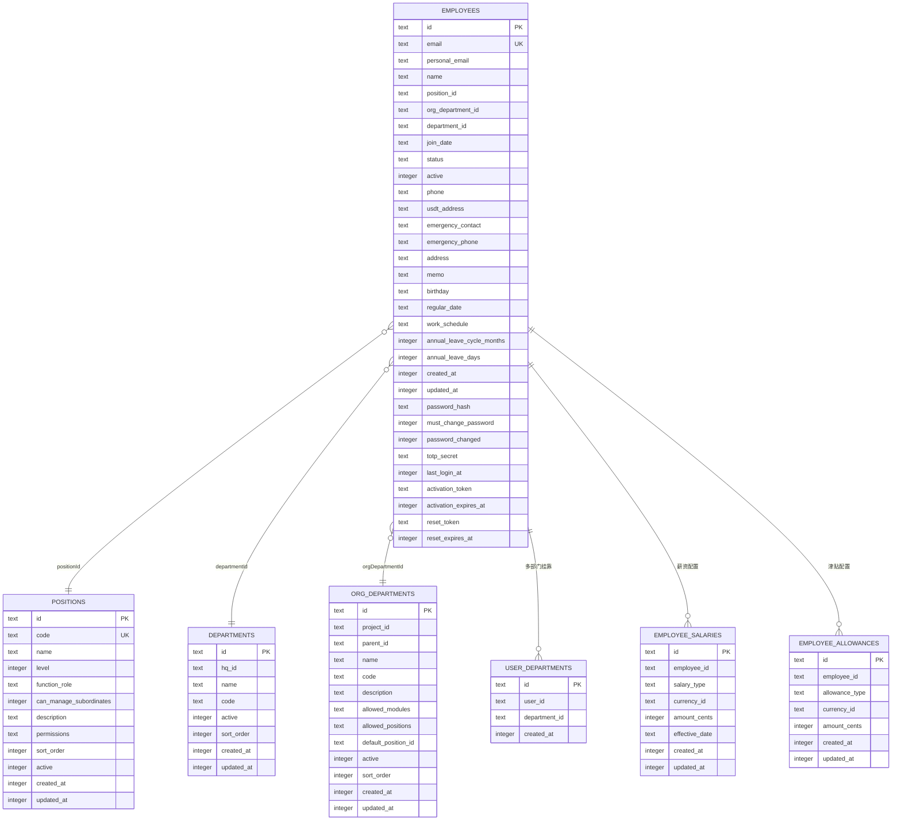

# 员工数据模型

<cite>
**本文引用的文件**
- [schema.ts](file://backend/src/db/schema.ts)
- [employee.schema.ts](file://backend/src/schemas/employee.schema.ts)
- [employees.ts](file://backend/src/routes/v2/employees.ts)
- [EmployeeService.ts](file://backend/src/services/EmployeeService.ts)
- [migration_add_salary_tables.sql](file://backend/src/db/migration_add_salary_tables.sql)
- [departments.ts](file://backend/src/routes/v2/master-data/departments.ts)
- [org-departments.ts](file://backend/src/routes/v2/master-data/org-departments.ts)
- [positions.ts](file://backend/src/routes/v2/master-data/positions.ts)
- [OrgDepartmentService.ts](file://backend/src/services/OrgDepartmentService.ts)
- [employee.schema.ts（前端）](file://frontend/src/validations/employee.schema.ts)
- [EmployeeForm.tsx](file://frontend/src/features/employees/components/forms/EmployeeForm.tsx)
- [EditEmployeeModal.tsx](file://frontend/src/features/employees/components/modals/EditEmployeeModal.tsx)
- [EmployeeStatusForm.tsx](file://frontend/src/features/employees/components/forms/EmployeeStatusForm.tsx)
- [domain.ts](file://frontend/src/types/domain.ts)
</cite>

## 目录
1. [简介](#简介)
2. [项目结构](#项目结构)
3. [核心组件](#核心组件)
4. [架构总览](#架构总览)
5. [详细组件分析](#详细组件分析)
6. [依赖分析](#依赖分析)
7. [性能考虑](#性能考虑)
8. [故障排查指南](#故障排查指南)
9. [结论](#结论)
10. [附录](#附录)

## 简介
本文件系统化梳理员工数据模型，围绕 employees、positions、departments、orgDepartments 等核心表展开，阐明员工个人信息、职位信息、薪资与津贴配置、认证与状态管理字段的结构与关系；解释 positions 的层级与功能角色、departments 与 orgDepartments 的多层级组织架构设计；说明 userDepartments 多对多关联表的作用；结合 createEmployeeSchema（后端 Zod Schema）与前端验证，展示前后端数据校验流程；最后给出 ER 图与员工全生命周期管理路径，帮助读者快速理解与使用该模型。

## 项目结构
- 后端采用 Drizzle ORM + SQLite，核心数据模型定义在 schema.ts 中，路由层在 employees.ts，业务逻辑集中在 EmployeeService.ts。
- 薪资与津贴独立表 employee_salaries、employee_allowances 通过迁移脚本创建，避免将大额金额字段冗余在 employees 主表。
- 前端通过 Zod Schema 在表单层进行强类型校验，后端同样以 Zod Schema 进行请求体校验与 OpenAPI 文档生成。

图表来源
- [schema.ts](file://backend/src/db/schema.ts#L14-L116)
- [EmployeeService.ts](file://backend/src/services/EmployeeService.ts#L307-L355)
- [employees.ts](file://backend/src/routes/v2/employees.ts#L1-L120)
- [employee.schema.ts（前端）](file://frontend/src/validations/employee.schema.ts#L1-L127)
- [EmployeeForm.tsx](file://frontend/src/features/employees/components/forms/EmployeeForm.tsx#L1-L120)

章节来源
- [schema.ts](file://backend/src/db/schema.ts#L14-L116)
- [employees.ts](file://backend/src/routes/v2/employees.ts#L1-L120)

## 核心组件
- employees 表：存储员工基本信息、职位外键、部门外键、组织部门外键、入职/转正/离职日期、状态与激活标志、认证字段（密码哈希、TOTP 秘钥、激活令牌）、工作日程、年假配置、备注等。
- positions 表：定义职位层级 level、功能角色 functionRole、是否可管理下属、排序、权限 JSON 等。
- departments 表：项目/总部部门，支持排序与激活状态。
- orgDepartments 表：组织部门树，支持父节点、项目归属、默认职位、允许模块/职位、排序与激活状态。
- userDepartments 表：员工与部门的多对多关联，便于跨部门/项目场景下的权限与数据访问控制。
- 薪资与津贴：employee_salaries、employee_allowances 独立表，按试用/正式区分薪资，按类型区分津贴，货币单位统一为“分”。

章节来源
- [schema.ts](file://backend/src/db/schema.ts#L14-L116)
- [migration_add_salary_tables.sql](file://backend/src/db/migration_add_salary_tables.sql#L1-L21)

## 架构总览
员工数据模型通过多表关联实现“组织-职位-员工”的清晰分层：
- 员工与职位：一对一（positionId）。
- 员工与部门：一对一（departmentId），同时通过 userDepartments 支持多部门挂靠。
- 员工与组织部门：一对一（orgDepartmentId），用于多层级组织树与模块/权限控制。
- 薪资与津贴：一对多（employee_id），与员工生命周期解耦，便于历史追溯与审计。

图表来源
- [schema.ts](file://backend/src/db/schema.ts#L14-L116)
- [migration_add_salary_tables.sql](file://backend/src/db/migration_add_salary_tables.sql#L1-L21)

## 详细组件分析

### employees 表：员工主信息与认证/状态字段
- 个人信息：姓名、邮箱（唯一）、个人邮箱、电话、USDT 地址、紧急联系人/电话、地址、生日、备注。
- 职位/部门/组织部门：positionId、departmentId、orgDepartmentId。
- 工作安排：workSchedule（JSON 字符串，后端序列化/反序列化）。
- 年假：annualLeaveCycleMonths（6/12）、annualLeaveDays。
- 状态与激活：status（probation/regular/resigned）、active（1/0）、regularDate、memo。
- 认证字段：passwordHash、mustChangePassword、passwordChanged、totpSecret、lastLoginAt、activationToken、activationExpiresAt、resetToken、resetExpiresAt。
- 时间戳：createdAt、updatedAt。

章节来源
- [schema.ts](file://backend/src/db/schema.ts#L14-L48)

### positions 表：职位层级与角色
- level：职位层级（1/2/…），用于权限与可见范围控制。
- functionRole：功能角色（如 employee、manager 等），用于权限矩阵与菜单控制。
- canManageSubordinates：是否可管理下属，配合层级实现上下级关系。
- permissions：JSON 字符串，存储权限配置。
- 排序与激活：sortOrder、active。

章节来源
- [schema.ts](file://backend/src/db/schema.ts#L50-L63)

### departments 与 orgDepartments：多层级组织架构
- departments：项目/总部部门，支持排序与激活。
- orgDepartments：组织部门树，包含：
  - parentId：父子关系。
  - projectId：归属项目。
  - defaultPositionId：默认职位。
  - allowedModules/allowedPositions：模块/职位白名单。
  - 排序与激活：sortOrder、active。
- 前端路由提供 orgDepartments 列表与详情，后端服务通过自连接查询构建树形结构与默认职位/父级/项目名称。

章节来源
- [schema.ts](file://backend/src/db/schema.ts#L65-L109)
- [org-departments.ts](file://backend/src/routes/v2/master-data/org-departments.ts#L1-L126)
- [OrgDepartmentService.ts](file://backend/src/services/OrgDepartmentService.ts#L16-L127)

### userDepartments：员工-部门多对多
- 设计目的：支持员工跨部门/项目挂靠，便于权限与数据访问控制（例如 HR 可查看多个部门员工）。
- 关键字段：userId、departmentId、createdAt。

章节来源
- [schema.ts](file://backend/src/db/schema.ts#L111-L116)
- [EmployeeService.ts](file://backend/src/services/EmployeeService.ts#L461-L481)

### 薪资与津贴：employee_salaries 与 employee_allowances
- 薪资：按试用/正式区分，货币单位“分”，支持生效日期。
- 津贴：按类型（生活/住房/交通/餐补）区分，货币单位“分”。

章节来源
- [migration_add_salary_tables.sql](file://backend/src/db/migration_add_salary_tables.sql#L1-L21)
- [employee.schema.ts](file://backend/src/schemas/employee.schema.ts#L91-L107)

### 前端 Zod 校验：CreateEmployeeSchema 与 UpdateEmployeeSchema
- CreateEmployeeSchema（后端）：要求姓名、组织部门、职位、入职日期、个人邮箱等；薪资/津贴数组至少一项；可选工作日程、年假配置。
- UpdateEmployeeSchema（后端）：字段可选，支持更新基本信息、联系方式、年假配置等。
- 前端 Zod 校验（前端）：与后端 schema 对齐，确保表单提交前的数据合法性与格式约束。

章节来源
- [employee.schema.ts（后端）](file://backend/src/schemas/employee.schema.ts#L71-L118)
- [employee.schema.ts（前端）](file://frontend/src/validations/employee.schema.ts#L1-L127)
- [EmployeeForm.tsx](file://frontend/src/features/employees/components/forms/EmployeeForm.tsx#L1-L120)
- [EditEmployeeModal.tsx](file://frontend/src/features/employees/components/modals/EditEmployeeModal.tsx#L1-L39)

### 员工全生命周期管理（后端服务）
- 创建员工：生成公司邮箱、确保个人邮箱加入邮件路由、设置激活令牌、写入认证字段、插入 userDepartments、返回创建结果。
- 更新员工：更新基本信息、联系方式、年假配置；必要时同步 userDepartments。
- 转正：将 status 更新为 regular，写入 regularDate。
- 离职：将 status 更新为 resigned，active 置 0，写入 memo（含离职原因），并根据邮箱禁用登录。
- 重新入职：将 status 回到 probation，active 置 1，重置 joinDate，并启用登录。
- 子级员工查询：基于职位层级与 canManageSubordinates 实现不同层级的可见范围。

图表来源
- [employees.ts](file://backend/src/routes/v2/employees.ts#L155-L241)
- [EmployeeService.ts](file://backend/src/services/EmployeeService.ts#L20-L255)

章节来源
- [employees.ts](file://backend/src/routes/v2/employees.ts#L155-L241)
- [EmployeeService.ts](file://backend/src/services/EmployeeService.ts#L20-L255)
- [EmployeeService.ts](file://backend/src/services/EmployeeService.ts#L485-L564)

### 员工状态变更（转正/离职/重新入职）
- 转正：仅当 status 为 probation 时允许，写入 regularDate。
- 离职：仅当 status 非 resigned 时允许，写入 memo（含原因），禁用登录。
- 重新入职：仅当 status 为 resigned 时允许，回到 probation，启用登录。

图表来源
- [EmployeeService.ts](file://backend/src/services/EmployeeService.ts#L485-L564)
- [EmployeeStatusForm.tsx](file://frontend/src/features/employees/components/forms/EmployeeStatusForm.tsx#L1-L120)

章节来源
- [EmployeeService.ts](file://backend/src/services/EmployeeService.ts#L485-L564)
- [EmployeeStatusForm.tsx](file://frontend/src/features/employees/components/forms/EmployeeStatusForm.tsx#L1-L120)

## 依赖分析
- 员工查询依赖：buildEmployeeQuery 通过左连接 departments、orgDepartments、positions，聚合员工、部门、组织部门、职位信息。
- 权限与可见范围：路由层使用 getDataAccessFilter 与 userDepartments、departments 协助限制查询范围。
- 职位权限：getUserPosition 返回职位详情（含 permissions JSON），用于前端菜单与按钮控制。

图表来源
- [employees.ts](file://backend/src/routes/v2/employees.ts#L46-L103)
- [EmployeeService.ts](file://backend/src/services/EmployeeService.ts#L307-L355)
- [positions.ts](file://backend/src/routes/v2/master-data/positions.ts#L1-L88)

章节来源
- [employees.ts](file://backend/src/routes/v2/employees.ts#L46-L103)
- [EmployeeService.ts](file://backend/src/services/EmployeeService.ts#L307-L355)
- [positions.ts](file://backend/src/routes/v2/master-data/positions.ts#L1-L88)

## 性能考虑
- 查询优化：employees 路由支持按 status、departmentId、orgDepartmentId、name、email、positionId 过滤，并限制默认条数；建议在高频字段上建立索引（如 status、departmentId、orgDepartmentId）。
- 关联查询：buildEmployeeQuery 使用 LEFT JOIN，注意避免 N+1 查询；前端分页与后端 limit/offset 控制返回量。
- 薪资/津贴：独立表设计降低 employees 表膨胀，查询时按需 JOIN，避免不必要的大字段传输。
- 缓存：departments 列表接口已内置查询缓存，建议对高频组织树与职位列表也引入缓存策略。

[本节为通用指导，不涉及具体文件分析]

## 故障排查指南
- 重复邮箱：创建员工时若个人邮箱已存在，抛出重复错误；应提示用户更换邮箱或联系管理员。
- 无权限访问：路由层对无职位/无权限用户拒绝访问；检查 getUserPosition 与 getDataAccessFilter 的返回值。
- 离职后仍可登录：离职工序会根据邮箱禁用 active；若未生效，检查邮箱字段一致性与更新语句。
- 邮件路由问题：创建员工时需确保个人邮箱加入 Cloudflare Email Routing；若失败，关注日志与返回状态。

章节来源
- [EmployeeService.ts](file://backend/src/services/EmployeeService.ts#L75-L84)
- [employees.ts](file://backend/src/routes/v2/employees.ts#L46-L103)
- [EmployeeService.ts](file://backend/src/services/EmployeeService.ts#L510-L535)

## 结论
该员工数据模型通过清晰的表结构与严格的前后端校验，实现了“组织-职位-员工”的完整关系建模，并以独立的薪资/津贴表支撑复杂的薪酬体系。userDepartments 提供灵活的多部门挂靠能力，配合 positions 的层级与权限，满足多层级组织的权限与可见范围需求。员工全生命周期管理（创建、转正、离职、重新入职）在后端服务中得到完整覆盖，前端通过 Zod Schema 保障表单数据质量。建议后续在高频字段上补充索引与缓存，进一步提升查询性能与用户体验。

[本节为总结，不涉及具体文件分析]

## 附录

### 前后端数据流与校验对照
- 前端：EmployeeForm 与 Zod 校验（create/update/leave/rejoin）。
- 后端：employees 路由使用 Zod Schema 校验请求体，EmployeeService 执行业务逻辑与数据库操作。

章节来源
- [EmployeeForm.tsx](file://frontend/src/features/employees/components/forms/EmployeeForm.tsx#L1-L120)
- [employee.schema.ts（前端）](file://frontend/src/validations/employee.schema.ts#L1-L127)
- [employees.ts](file://backend/src/routes/v2/employees.ts#L155-L241)
- [employee.schema.ts（后端）](file://backend/src/schemas/employee.schema.ts#L71-L118)

### 员工与部门、职位关系图（概念示意）

图表来源
- [schema.ts](file://backend/src/db/schema.ts#L50-L116)