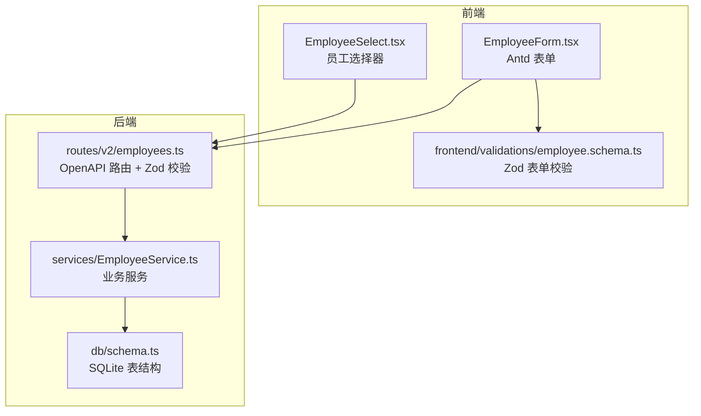
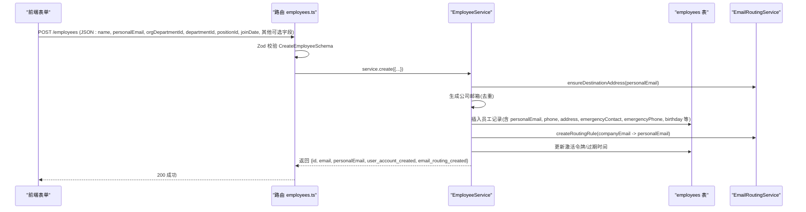
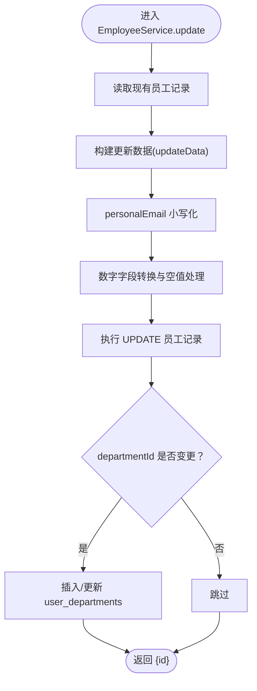
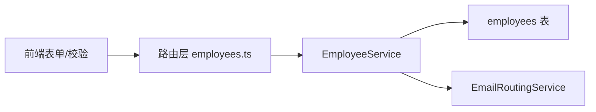

# 核心信息

<cite>
**本文引用的文件**
- [backend/src/schemas/employee.schema.ts](file://backend/src/schemas/employee.schema.ts)
- [backend/src/services/EmployeeService.ts](file://backend/src/services/EmployeeService.ts)
- [backend/src/routes/v2/employees.ts](file://backend/src/routes/v2/employees.ts)
- [backend/src/db/schema.ts](file://backend/src/db/schema.ts)
- [frontend/src/validations/employee.schema.ts](file://frontend/src/validations/employee.schema.ts)
- [frontend/src/features/employees/components/forms/EmployeeForm.tsx](file://frontend/src/features/employees/components/forms/EmployeeForm.tsx)
- [frontend/src/components/form/EmployeeSelect.tsx](file://frontend/src/components/form/EmployeeSelect.tsx)
- [frontend/src/types/domain.ts](file://frontend/src/types/domain.ts)
</cite>

## 目录
1. [简介](#简介)
2. [项目结构](#项目结构)
3. [核心组件](#核心组件)
4. [架构总览](#架构总览)
5. [详细组件分析](#详细组件分析)
6. [依赖关系分析](#依赖关系分析)
7. [性能考量](#性能考量)
8. [故障排查指南](#故障排查指南)
9. [结论](#结论)
10. [附录](#附录)

## 简介
本文件聚焦“员工核心信息”的字段定义与业务含义，围绕 employees 表中的 id、email、personalEmail、name、phone、birthday、address、emergencyContact、emergencyPhone 等字段展开，结合后端 Zod Schema 的验证规则与前端表单校验，说明字段的数据类型、约束与用途；并解释 personalEmail 作为真实邮箱用于接收邮件转发的特殊作用。同时，结合 CreateEmployeeSchema 和 UpdateEmployeeSchema，阐述前端如何通过 Zod 进行数据验证，包括邮箱、电话等字段的预处理与空值处理逻辑；最后给出在 EmployeeService 中创建与更新员工核心信息的实际调用路径，并说明这些字段在员工全生命周期管理中的作用，以及在前端 EmployeeSelect 等组件中的使用方式。

## 项目结构
- 后端采用 OpenAPI + Zod + Drizzle ORM + Cloudflare Email Routing 的组合：
  - 路由层负责请求体与查询参数的 Zod 校验与权限控制；
  - 服务层封装业务流程（如创建员工时生成公司邮箱、建立邮件路由、设置激活令牌等）；
  - 数据层使用 SQLite（D1）表结构定义 employees 等核心表。
- 前端使用 Ant Design 表单与 Zod Schema 双层校验，确保提交数据符合后端约束。

图表来源
- [backend/src/routes/v2/employees.ts](file://backend/src/routes/v2/employees.ts#L1-L120)
- [backend/src/services/EmployeeService.ts](file://backend/src/services/EmployeeService.ts#L1-L120)
- [backend/src/db/schema.ts](file://backend/src/db/schema.ts#L14-L48)
- [frontend/src/validations/employee.schema.ts](file://frontend/src/validations/employee.schema.ts#L1-L60)
- [frontend/src/features/employees/components/forms/EmployeeForm.tsx](file://frontend/src/features/employees/components/forms/EmployeeForm.tsx#L1-L120)
- [frontend/src/components/form/EmployeeSelect.tsx](file://frontend/src/components/form/EmployeeSelect.tsx#L1-L74)

章节来源
- [backend/src/routes/v2/employees.ts](file://backend/src/routes/v2/employees.ts#L1-L120)
- [backend/src/services/EmployeeService.ts](file://backend/src/services/EmployeeService.ts#L1-L120)
- [backend/src/db/schema.ts](file://backend/src/db/schema.ts#L14-L48)
- [frontend/src/validations/employee.schema.ts](file://frontend/src/validations/employee.schema.ts#L1-L60)
- [frontend/src/features/employees/components/forms/EmployeeForm.tsx](file://frontend/src/features/employees/components/forms/EmployeeForm.tsx#L1-L120)
- [frontend/src/components/form/EmployeeSelect.tsx](file://frontend/src/components/form/EmployeeSelect.tsx#L1-L74)

## 核心组件
- 后端 Zod Schema
  - CreateEmployeeSchema：定义创建员工时必填与可选字段，其中 personalEmail 为必填且必须是合法邮箱，用于接收邮件转发。
  - UpdateEmployeeSchema：定义更新员工时可选字段，personalEmail 可选且必须是合法邮箱。
- 员工服务 EmployeeService
  - create：生成公司邮箱、检查 personalEmail 唯一性、创建员工记录、建立邮件路由、设置激活令牌、维护用户部门映射。
  - update：按需更新字段，对 personalEmail 进行小写化处理，避免大小写差异导致的路由问题。
- 数据库 employees 表
  - 定义 id、email、personalEmail、name、phone、birthday、address、emergencyContact、emergencyPhone 等字段及索引约束。
- 前端表单与校验
  - EmployeeForm.tsx：Antd 表单字段映射，包含 personalEmail、phone_country_code、phone_number、emergencyPhone_country_code、emergencyPhone_number 等。
  - frontend/validations/employee.schema.ts：Zod 表单校验，对邮箱、日期、数字范围等进行约束。
  - EmployeeSelect.tsx：员工选择器组件，从后端拉取员工列表并格式化显示。

章节来源
- [backend/src/schemas/employee.schema.ts](file://backend/src/schemas/employee.schema.ts#L71-L118)
- [backend/src/services/EmployeeService.ts](file://backend/src/services/EmployeeService.ts#L20-L235)
- [backend/src/db/schema.ts](file://backend/src/db/schema.ts#L14-L48)
- [frontend/src/features/employees/components/forms/EmployeeForm.tsx](file://frontend/src/features/employees/components/forms/EmployeeForm.tsx#L90-L120)
- [frontend/src/validations/employee.schema.ts](file://frontend/src/validations/employee.schema.ts#L1-L40)
- [frontend/src/components/form/EmployeeSelect.tsx](file://frontend/src/components/form/EmployeeSelect.tsx#L30-L74)

## 架构总览
下面的序列图展示了从前端提交到后端创建员工的核心流程，强调 personalEmail 的唯一性校验、公司邮箱生成、邮件路由创建与激活令牌设置。

图表来源
- [backend/src/routes/v2/employees.ts](file://backend/src/routes/v2/employees.ts#L155-L241)
- [backend/src/services/EmployeeService.ts](file://backend/src/services/EmployeeService.ts#L20-L235)
- [backend/src/db/schema.ts](file://backend/src/db/schema.ts#L14-L48)

章节来源
- [backend/src/routes/v2/employees.ts](file://backend/src/routes/v2/employees.ts#L155-L241)
- [backend/src/services/EmployeeService.ts](file://backend/src/services/EmployeeService.ts#L20-L235)

## 详细组件分析

### 字段定义与业务含义
以下字段来自 employees 表与相关 Schema，均以“字段名、数据类型、约束/默认值、业务含义”形式说明：

- id
  - 类型：text（主键）
  - 约束：非空、唯一
  - 业务含义：员工唯一标识，贯穿全生命周期管理。
- email
  - 类型：text（唯一）
  - 约束：非空、唯一
  - 业务含义：公司邮箱，用于系统内部通信与登录凭证之一。
- personalEmail
  - 类型：text（可空）
  - 约束：可空；后端在创建/更新时统一转小写，避免大小写差异影响 Cloudflare 邮件路由。
  - 业务含义：员工真实邮箱，用于接收邮件转发；创建时会检查唯一性；更新时同样进行唯一性校验与小写化。
- name
  - 类型：text（可空）
  - 约束：可空
  - 业务含义：员工姓名，用于展示与审计。
- phone
  - 类型：text（可空）
  - 约束：可空
  - 业务含义：手机号码，前端表单拆分为国家码与号码两部分，便于国际用户。
- birthday
  - 类型：text（可空）
  - 约束：可空
  - 业务含义：生日，YYYY-MM-DD 格式，用于生日福利与统计。
- address
  - 类型：text（可空）
  - 约束：可空
  - 业务含义：住址，用于联系与报销等场景。
- emergencyContact
  - 类型：text（可空）
  - 约束：可空
  - 业务含义：紧急联系人姓名。
- emergencyPhone
  - 类型：text（可空）
  - 约束：可空
  - 业务含义：紧急联系人电话，前端表单拆分为国家码与号码两部分。

章节来源
- [backend/src/db/schema.ts](file://backend/src/db/schema.ts#L14-L48)
- [backend/src/schemas/employee.schema.ts](file://backend/src/schemas/employee.schema.ts#L71-L118)
- [backend/src/services/EmployeeService.ts](file://backend/src/services/EmployeeService.ts#L410-L460)
- [frontend/src/features/employees/components/forms/EmployeeForm.tsx](file://frontend/src/features/employees/components/forms/EmployeeForm.tsx#L260-L310)

### personalEmail 的特殊作用与验证
- 作用
  - 作为真实邮箱，用于接收系统邮件转发（公司邮箱 -> personalEmail）。
  - 创建时会检查是否已在系统中存在，避免重复绑定。
  - 更新时同样进行唯一性校验与小写化处理。
- 验证
  - 后端：CreateEmployeeSchema 与 UpdateEmployeeSchema 均要求 personalEmail 为合法邮箱，且创建时为必填。
  - 前端：表单校验与 Zod 校验共同保证邮箱格式正确。

章节来源
- [backend/src/schemas/employee.schema.ts](file://backend/src/schemas/employee.schema.ts#L71-L118)
- [backend/src/services/EmployeeService.ts](file://backend/src/services/EmployeeService.ts#L70-L85)
- [frontend/src/validations/employee.schema.ts](file://frontend/src/validations/employee.schema.ts#L16-L20)

### 前端 Zod 校验与空值处理
- 表单字段映射
  - 前端 EmployeeForm.tsx 将 personalEmail 映射到表单字段 personalEmail，并设置必填与邮箱格式校验。
  - 电话类字段拆分为 country_code 与 number 两部分，便于国际化与统一存储。
- Zod 校验
  - createEmployeeSchema：personalEmail 必须是合法邮箱；日期字段使用 dayjs 校验有效性；薪资配置数组至少一项。
  - updateEmployeeSchema：passthrough 允许额外字段通过，便于扩展。
- 空值处理
  - 后端在更新时对 personalEmail 进行小写化，避免大小写差异导致的路由问题。
  - 数字型字段（如年假月数、天数）在更新时会进行数值转换与空值处理。

章节来源
- [frontend/src/features/employees/components/forms/EmployeeForm.tsx](file://frontend/src/features/employees/components/forms/EmployeeForm.tsx#L90-L120)
- [frontend/src/validations/employee.schema.ts](file://frontend/src/validations/employee.schema.ts#L1-L40)
- [backend/src/schemas/employee.schema.ts](file://backend/src/schemas/employee.schema.ts#L37-L56)
- [backend/src/services/EmployeeService.ts](file://backend/src/services/EmployeeService.ts#L433-L460)

### 在 EmployeeService 中创建与更新员工核心信息
- 创建流程要点
  - 生成公司邮箱并去重；
  - 检查 personalEmail 唯一性；
  - 插入员工记录（包含 name、email、personalEmail、phone、address、emergencyContact、emergencyPhone、birthday 等）；
  - 为 personalEmail 建立邮件路由规则；
  - 设置激活令牌与过期时间，便于后续激活邮件发送。
- 更新流程要点
  - 按需更新字段；
  - 对 personalEmail 进行小写化；
  - 对数字型字段进行数值转换与空值处理；
  - 若 departmentId 变更，同步维护 user_departments 关联表。

图表来源
- [backend/src/services/EmployeeService.ts](file://backend/src/services/EmployeeService.ts#L405-L483)

章节来源
- [backend/src/services/EmployeeService.ts](file://backend/src/services/EmployeeService.ts#L20-L235)
- [backend/src/services/EmployeeService.ts](file://backend/src/services/EmployeeService.ts#L405-L483)

### 字段在员工全生命周期管理中的作用
- 入职阶段
  - name、email、personalEmail、joinDate、departmentId、orgDepartmentId、positionId、phone、address、emergencyContact、emergencyPhone、birthday 等字段用于完成入职登记与账号初始化。
- 转正/离职/复职
  - regularDate、status、active 等字段用于状态变更；leaveDate、memo 等用于离职记录。
- 日常管理
  - phone、address、emergencyContact、emergencyPhone、birthday 等用于联系与关怀；workSchedule、annualLeaveCycleMonths、annualLeaveDays 用于排班与假期管理。

章节来源
- [backend/src/services/EmployeeService.ts](file://backend/src/services/EmployeeService.ts#L485-L564)
- [backend/src/services/EmployeeService.ts](file://backend/src/services/EmployeeService.ts#L566-L757)

### 前端 EmployeeSelect 等组件中的使用
- EmployeeSelect
  - 从后端拉取员工列表，格式化显示为“姓名（部门）”或仅姓名；
  - 支持 activeOnly 与 showDepartment 控制展示；
  - 作为通用选择器，可用于审批、派发任务等场景。
- EmployeeForm
  - 将核心信息字段映射到表单控件，配合 Zod 校验与 Antd 规则，确保提交数据有效。

章节来源
- [frontend/src/components/form/EmployeeSelect.tsx](file://frontend/src/components/form/EmployeeSelect.tsx#L30-L74)
- [frontend/src/features/employees/components/forms/EmployeeForm.tsx](file://frontend/src/features/employees/components/forms/EmployeeForm.tsx#L90-L120)
- [frontend/src/types/domain.ts](file://frontend/src/types/domain.ts#L55-L126)

## 依赖关系分析
- 路由层依赖 Zod Schema 进行请求体与查询参数校验，并调用服务层；
- 服务层依赖数据库层（Drizzle ORM）与 EmailRoutingService；
- 前端依赖 Antd 表单与 Zod Schema 进行双重校验；
- employees 表结构定义了字段类型与约束，直接影响前后端交互。

图表来源
- [backend/src/routes/v2/employees.ts](file://backend/src/routes/v2/employees.ts#L1-L120)
- [backend/src/services/EmployeeService.ts](file://backend/src/services/EmployeeService.ts#L1-L120)
- [backend/src/db/schema.ts](file://backend/src/db/schema.ts#L14-L48)

章节来源
- [backend/src/routes/v2/employees.ts](file://backend/src/routes/v2/employees.ts#L1-L120)
- [backend/src/services/EmployeeService.ts](file://backend/src/services/EmployeeService.ts#L1-L120)
- [backend/src/db/schema.ts](file://backend/src/db/schema.ts#L14-L48)

## 性能考量
- D1 不支持传统事务，服务层采用顺序执行与回滚策略，注意在高并发场景下的冲突与回滚成本。
- 邮件路由创建与激活令牌设置涉及外部服务调用，建议在批量导入或高并发创建时考虑异步化与重试机制。
- 员工查询与筛选使用 Drizzle ORM 的 where 条件拼接，建议在高频查询上增加必要的索引（如 email、personalEmail、departmentId、orgDepartmentId）。

## 故障排查指南
- personalEmail 重复
  - 现象：创建/更新时报错，提示个人邮箱已被使用。
  - 排查：确认 personalEmail 是否大小写不同导致重复；后端已统一小写化。
- 邮件路由未生效
  - 现象：创建成功但激活邮件未送达。
  - 排查：确认 Cloudflare Email Routing 配置与验证状态；检查 ensureDestinationAddress 与 createRoutingRule 的返回结果。
- 日期/数字字段异常
  - 现象：前端提交后后端报错或数值异常。
  - 排查：确认前端 Zod 校验通过；后端更新时对数字字段进行了转换与空值处理。

章节来源
- [backend/src/services/EmployeeService.ts](file://backend/src/services/EmployeeService.ts#L70-L85)
- [backend/src/services/EmployeeService.ts](file://backend/src/services/EmployeeService.ts#L433-L460)
- [frontend/src/validations/employee.schema.ts](file://frontend/src/validations/employee.schema.ts#L1-L40)

## 结论
- employees 表中的核心字段覆盖了员工身份与基础信息，personalEmail 作为真实邮箱承担邮件转发的关键职责；
- 后端通过 Zod Schema 与服务层逻辑确保数据一致性与业务合规；
- 前端通过 Antd 表单与 Zod 校验实现双层保障，提升用户体验与数据质量；
- 在全生命周期管理中，这些字段贯穿入职、状态变更与日常运营，是系统运行的基础。

## 附录
- 字段一览（来自 employees 表与 Schema）
  - id、email、personalEmail、name、phone、birthday、address、emergencyContact、emergencyPhone 等字段均在 employees 表中定义，且在 CreateEmployeeSchema 与 UpdateEmployeeSchema 中得到约束。

章节来源
- [backend/src/db/schema.ts](file://backend/src/db/schema.ts#L14-L48)
- [backend/src/schemas/employee.schema.ts](file://backend/src/schemas/employee.schema.ts#L37-L118)