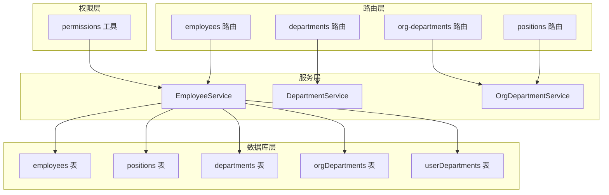
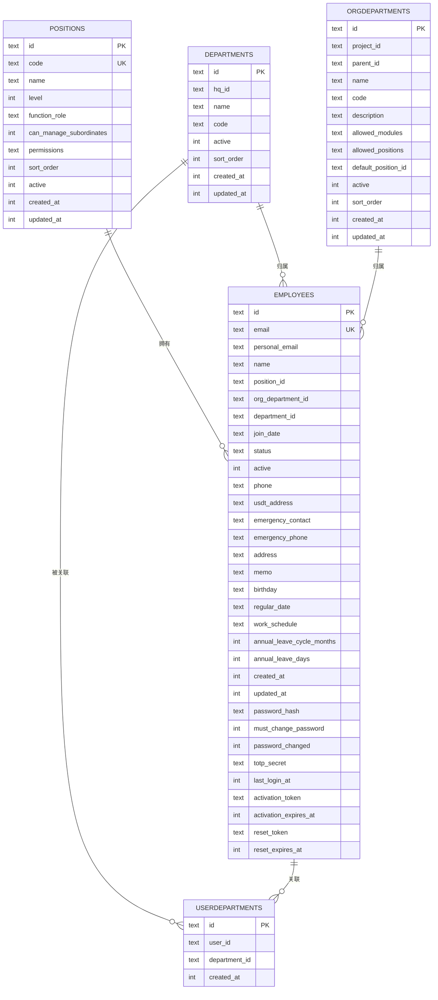
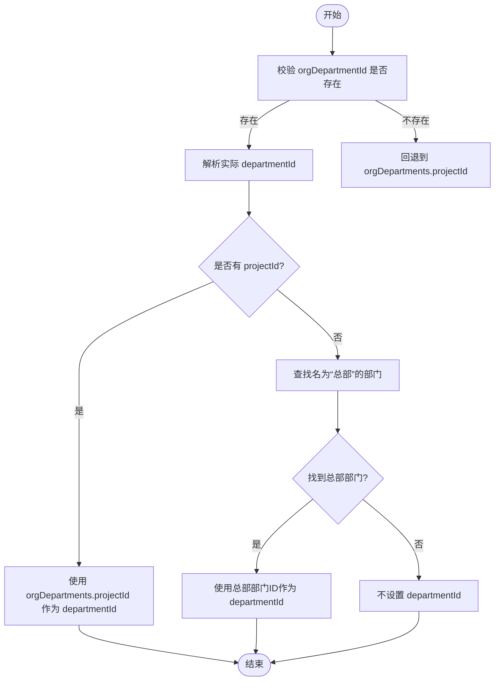
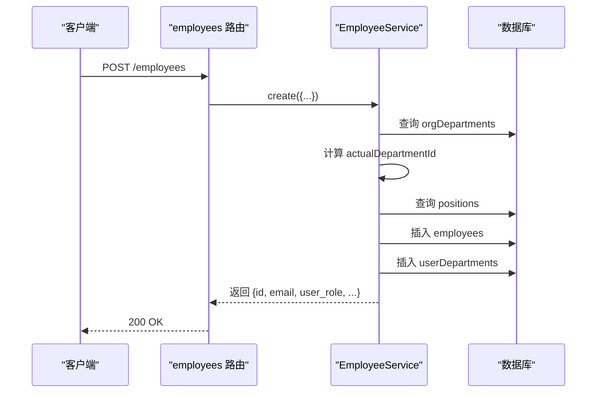
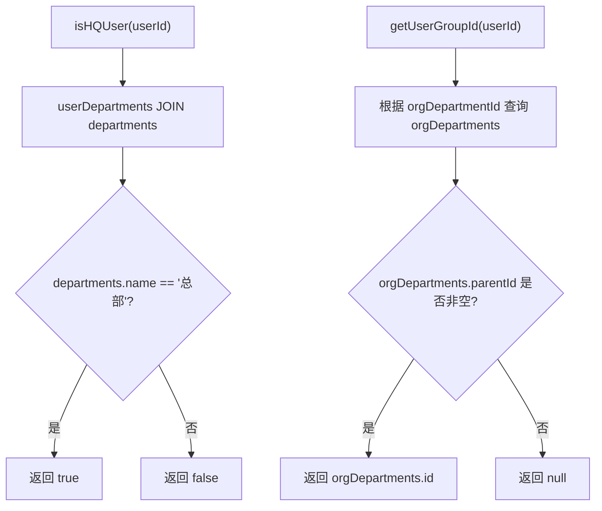
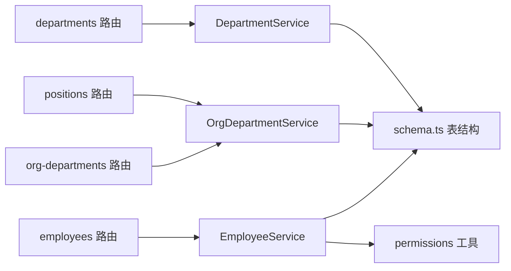

# 组织架构

<cite>
**本文引用的文件**
- [schema.ts](file://backend/src/db/schema.ts)
- [EmployeeService.ts](file://backend/src/services/EmployeeService.ts)
- [employees.ts](file://backend/src/routes/v2/employees.ts)
- [permissions.ts](file://backend/src/utils/permissions.ts)
- [employee.schema.ts](file://backend/src/schemas/employee.schema.ts)
- [departments.ts](file://backend/src/routes/v2/master-data/departments.ts)
- [org-departments.ts](file://backend/src/routes/v2/master-data/org-departments.ts)
- [positions.ts](file://backend/src/routes/v2/master-data/positions.ts)
- [OrgDepartmentService.ts](file://backend/src/services/OrgDepartmentService.ts)
- [DepartmentService.ts](file://backend/src/services/DepartmentService.ts)
- [employees.test.ts](file://backend/test/employees.test.ts)
</cite>

## 目录
1. [简介](#简介)
2. [项目结构](#项目结构)
3. [核心组件](#核心组件)
4. [架构总览](#架构总览)
5. [详细组件分析](#详细组件分析)
6. [依赖关系分析](#依赖关系分析)
7. [性能考量](#性能考量)
8. [故障排查指南](#故障排查指南)
9. [结论](#结论)
10. [附录](#附录)

## 简介
本文件围绕员工组织架构展开，聚焦 employees 表中与组织归属相关的字段（positionId、orgDepartmentId、departmentId），解释 positions 表如何通过 level 和 functionRole 定义职位层级与角色；阐述 departments 与 orgDepartments 如何共同构建多层级组织架构；说明 userDepartments 多对多关联表的设计目的与使用场景；结合 EmployeeService 的 create 与 update 方法，解释在创建员工时如何确定实际的 departmentId 与用户角色；最后给出 ER 图与前端权限控制实践（isHQUser、getUserGroupId 等）。

## 项目结构
- 数据库层：定义了 employees、positions、departments、orgDepartments、userDepartments 等核心表结构。
- 服务层：EmployeeService 提供员工生命周期管理与权限辅助方法；OrgDepartmentService/DepartmentService 提供组织部门默认结构与查询能力。
- 路由层：employees 路由负责员工 CRUD 与状态变更；master-data 下的 departments、org-departments、positions 路由负责组织与职位维护。
- 权限层：permissions 工具函数提供基于职位层级的数据访问过滤与权限判定。

图表来源
- [schema.ts](file://backend/src/db/schema.ts#L14-L117)
- [EmployeeService.ts](file://backend/src/services/EmployeeService.ts#L1-L758)
- [employees.ts](file://backend/src/routes/v2/employees.ts#L1-L602)
- [permissions.ts](file://backend/src/utils/permissions.ts#L1-L273)
- [org-departments.ts](file://backend/src/routes/v2/master-data/org-departments.ts#L1-L126)
- [departments.ts](file://backend/src/routes/v2/master-data/departments.ts#L1-L439)
- [positions.ts](file://backend/src/routes/v2/master-data/positions.ts#L1-L88)
- [OrgDepartmentService.ts](file://backend/src/services/OrgDepartmentService.ts#L1-L129)
- [DepartmentService.ts](file://backend/src/services/DepartmentService.ts#L1-L182)

章节来源
- [schema.ts](file://backend/src/db/schema.ts#L14-L117)
- [EmployeeService.ts](file://backend/src/services/EmployeeService.ts#L1-L758)
- [employees.ts](file://backend/src/routes/v2/employees.ts#L1-L602)
- [permissions.ts](file://backend/src/utils/permissions.ts#L1-L273)

## 核心组件
- employees 表：存储员工基本信息与组织归属字段（positionId、orgDepartmentId、departmentId）。
- positions 表：定义职位层级（level）与功能角色（functionRole），并包含可管理下级标志与权限配置。
- departments 表：项目/部门实体，支持排序与激活状态。
- orgDepartments 表：组织部门树形结构，支持项目根节点、父子关系、默认职位、模块授权等。
- userDepartments 表：员工与部门的多对多关联，用于记录员工的“可归属部门集合”。

章节来源
- [schema.ts](file://backend/src/db/schema.ts#L14-L117)

## 架构总览
员工组织架构采用三层组织维度：
- 项目/部门维度：departmentId 指向 departments 中的某个项目或部门。
- 组织/组维度：orgDepartmentId 指向 orgDepartments 中的组织部门（可为项目根或子组）。
- 职位维度：positionId 指向 positions，决定用户的层级（level）与角色（functionRole）。

图表来源
- [schema.ts](file://backend/src/db/schema.ts#L14-L117)

## 详细组件分析

### 字段定义与层级关系
- positionId
  - 作用：标识员工的职位，决定其在权限体系中的层级与角色。
  - 关键属性：level（1-总部、2-项目、3-组）、functionRole（如 admin、employee 等）。
- orgDepartmentId
  - 作用：标识员工所属的组织部门（可为项目根或子组），用于组级权限与数据访问范围。
- departmentId
  - 作用：标识员工所属的项目/部门，用于项目级权限与数据访问范围。

图表来源
- [EmployeeService.ts](file://backend/src/services/EmployeeService.ts#L95-L108)

章节来源
- [schema.ts](file://backend/src/db/schema.ts#L14-L48)
- [EmployeeService.ts](file://backend/src/services/EmployeeService.ts#L95-L108)

### positions 表：层级与角色
- level
  - 1：总部人员（可访问全部数据）
  - 2：项目人员（仅能访问本项目数据）
  - 3：组成员（仅能访问本组数据或仅能访问自己）
- functionRole
  - 用于标识用户角色（如 admin、employee），在创建员工时作为返回的 userRole。
- canManageSubordinates
  - 用于判断是否具备管理下级的权限，影响数据访问范围与审批范围。

章节来源
- [schema.ts](file://backend/src/db/schema.ts#L50-L63)
- [EmployeeService.ts](file://backend/src/services/EmployeeService.ts#L228-L232)
- [permissions.ts](file://backend/src/utils/permissions.ts#L1-L273)

### departments 与 orgDepartments：多层级组织架构
- departments
  - 代表项目/部门实体，支持排序与激活状态。
- orgDepartments
  - 支持项目根节点（parentId 为空）与子组（parentId 指向上级），并可配置默认职位、允许模块、允许职位等。
- 默认组织部门
  - 当某项目尚未建立组织部门时，系统会在查询时自动创建默认组织部门（含项目根与开发部子组等）。

章节来源
- [schema.ts](file://backend/src/db/schema.ts#L65-L109)
- [OrgDepartmentService.ts](file://backend/src/services/OrgDepartmentService.ts#L16-L89)
- [DepartmentService.ts](file://backend/src/services/DepartmentService.ts#L1-L182)

### userDepartments：多对多关联设计
- 设计目的
  - 允许员工同时归属于多个部门，便于跨部门协作与权限扩展。
- 使用场景
  - 在创建员工时，若确定了实际 departmentId，则插入一条 userDepartments 记录，确保后续权限与数据访问范围正确。
  - 在更新员工时，若传入新的 departmentId，且 userDepartments 中不存在对应记录，则自动插入。

章节来源
- [schema.ts](file://backend/src/db/schema.ts#L111-L117)
- [EmployeeService.ts](file://backend/src/services/EmployeeService.ts#L204-L217)
- [EmployeeService.ts](file://backend/src/services/EmployeeService.ts#L461-L480)

### EmployeeService.create：创建员工时的部门与角色确定
- 步骤概览
  - 生成公司邮箱并校验个人邮箱唯一性。
  - 根据 orgDepartmentId 获取组织部门信息。
  - 确定实际 departmentId：
    - 若传入 departmentId 则直接使用；
    - 否则优先使用 orgDepartments.projectId；
    - 若仍为空，则查找名为“总部”的部门作为 fallback；
    - 否则不设置 departmentId。
  - 获取职位信息，得到 functionRole 作为 userRole 返回。
  - 插入 employees 记录并设置认证字段（激活令牌等）。
  - 插入 userDepartments 记录，确保员工与部门的多对多关联。
- 返回值
  - 包含 user_role（来自 positions.functionRole 或默认 employee）。

图表来源
- [employees.ts](file://backend/src/routes/v2/employees.ts#L184-L241)
- [EmployeeService.ts](file://backend/src/services/EmployeeService.ts#L20-L255)

章节来源
- [employees.ts](file://backend/src/routes/v2/employees.ts#L184-L241)
- [EmployeeService.ts](file://backend/src/services/EmployeeService.ts#L20-L255)

### EmployeeService.update：更新员工时的部门与角色
- 更新逻辑
  - 更新 employees 字段（如 departmentId、orgDepartmentId、positionId 等）。
  - 若传入新的 departmentId，检查 userDepartments 是否已存在对应记录，不存在则插入。
- 影响
  - 可能改变员工的数据访问范围与权限边界（取决于其 positionId 与部门层级）。

章节来源
- [EmployeeService.ts](file://backend/src/services/EmployeeService.ts#L405-L483)

### 前端权限控制：isHQUser 与 getUserGroupId
- isHQUser(userId)
  - 通过 userDepartments 与 departments 的内连接，判断用户是否归属于名为“总部”的部门。
- getUserGroupId(userId)
  - 基于员工的 orgDepartmentId，查询 orgDepartments 并要求其 parentId 非空，从而返回组织部门 ID（即用户所在组的上级组织单位 ID）。
- getUserOrgDepartmentId(userId)
  - 直接返回员工的 orgDepartmentId。
- getUserDepartmentIds(userId)
  - 返回用户在 userDepartments 中的所有 departmentId 列表。
- getUserDepartmentId(userId)
  - 返回用户主部门 ID（取第一个）。

图表来源
- [EmployeeService.ts](file://backend/src/services/EmployeeService.ts#L696-L726)

章节来源
- [EmployeeService.ts](file://backend/src/services/EmployeeService.ts#L696-L757)

### 数据访问过滤：getDataAccessFilter
- 规则
  - 总部人员（level=1）：可访问全部数据。
  - 项目人员（level=2）：仅能访问本项目（departmentId）数据。
  - 组长（team_leader）：仅能访问本组（orgDepartmentId）数据。
  - 工程师（team_engineer）或其他：仅能访问自己的数据（ownerColumn=id）。
- 应用
  - 在 employees 列表查询时，根据用户职位动态生成 where 条件与绑定参数，实现最小权限访问。

章节来源
- [permissions.ts](file://backend/src/utils/permissions.ts#L196-L263)
- [employees.ts](file://backend/src/routes/v2/employees.ts#L46-L103)

## 依赖关系分析
- EmployeeService 依赖
  - employees、positions、departments、orgDepartments、userDepartments 表结构。
  - permissions 工具用于数据访问过滤与权限判定。
- OrgDepartmentService/DepartmentService 依赖
  - orgDepartments、positions、departments 表结构。
  - DepartmentService 用于为新项目创建默认组织部门（项目根与开发部子组）。
- 路由层依赖
  - employees 路由调用 EmployeeService 的 create/update/getAll 等方法，并在列表查询时应用权限过滤。
  - master-data 路由提供组织与职位的维护入口。

图表来源
- [EmployeeService.ts](file://backend/src/services/EmployeeService.ts#L1-L758)
- [permissions.ts](file://backend/src/utils/permissions.ts#L1-L273)
- [OrgDepartmentService.ts](file://backend/src/services/OrgDepartmentService.ts#L1-L129)
- [DepartmentService.ts](file://backend/src/services/DepartmentService.ts#L1-L182)
- [employees.ts](file://backend/src/routes/v2/employees.ts#L1-L602)
- [org-departments.ts](file://backend/src/routes/v2/master-data/org-departments.ts#L1-L126)
- [departments.ts](file://backend/src/routes/v2/master-data/departments.ts#L1-L439)
- [positions.ts](file://backend/src/routes/v2/master-data/positions.ts#L1-L88)

## 性能考量
- 查询优化
  - employees 列表查询时，通过 getDataAccessFilter 动态生成 where 条件，避免不必要的全表扫描。
  - departments 路由对部门列表使用查询缓存，减少重复查询开销。
- 关联查询
  - EmployeeService.buildEmployeeQuery 使用 LEFT JOIN 连接 departments、orgDepartments、positions，建议在相关列上建立索引以提升查询性能。
- 事务与原子性
  - D1 不支持传统事务，EmployeeService.create 采用顺序执行与回滚策略，注意在高并发场景下的冲突与一致性风险。

章节来源
- [departments.ts](file://backend/src/routes/v2/master-data/departments.ts#L43-L66)
- [EmployeeService.ts](file://backend/src/services/EmployeeService.ts#L307-L356)

## 故障排查指南
- 创建员工时报错“组织部门不存在”
  - 检查 orgDepartmentId 是否有效；若为总部项目，系统会在查询时自动创建默认组织部门。
- “总部”部门缺失导致 departmentId 无法确定
  - 确认 departments 中是否存在名为“总部”的部门；若不存在，系统不会回退到该部门。
- 权限不足或数据访问受限
  - 检查用户 position.level 与 functionRole；确认是否为总部、项目或组成员；核对 getDataAccessFilter 的 where 条件。
- 更新员工后权限未生效
  - 确认是否传入新的 departmentId；若传入，需确保 userDepartments 中已存在对应记录。

章节来源
- [EmployeeService.ts](file://backend/src/services/EmployeeService.ts#L95-L108)
- [permissions.ts](file://backend/src/utils/permissions.ts#L196-L263)
- [OrgDepartmentService.ts](file://backend/src/services/OrgDepartmentService.ts#L16-L89)

## 结论
本组织架构通过 positionId、orgDepartmentId、departmentId 三者协同，实现了从总部到项目再到组的多层级权限与数据访问控制。positions 的 level 与 functionRole 决定了用户的角色与范围，departments 与 orgDepartments 共同构建了灵活的组织树，userDepartments 则保证了员工与部门的多对多关联。EmployeeService 在创建与更新员工时，严谨地确定实际 departmentId 与用户角色，并通过权限工具实现最小权限访问。前端可通过 isHQUser、getUserGroupId 等方法快速判断用户权限范围，保障业务安全与易用性。

## 附录
- 测试用例参考
  - 员工列表与更新流程的测试覆盖，验证了组织部门与职位在实际业务中的行为。

章节来源
- [employees.test.ts](file://backend/test/employees.test.ts#L140-L214)