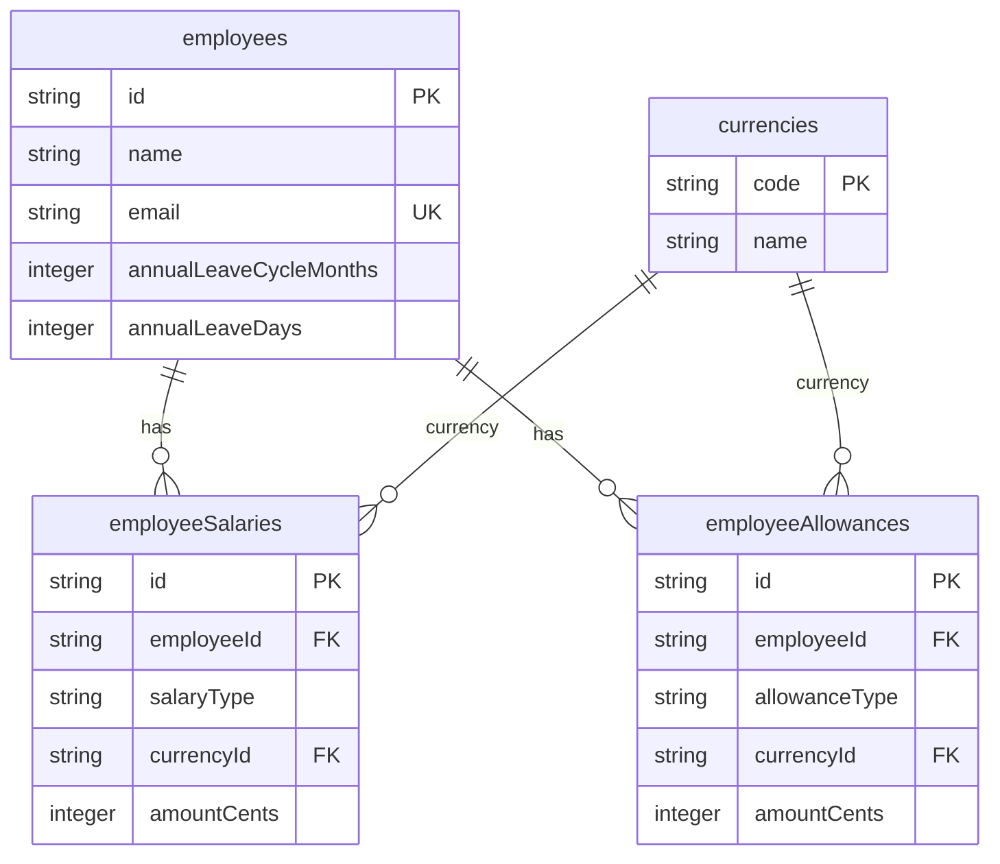
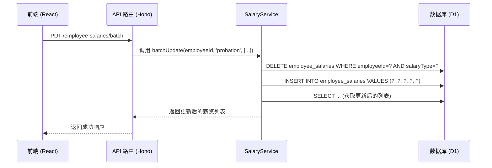
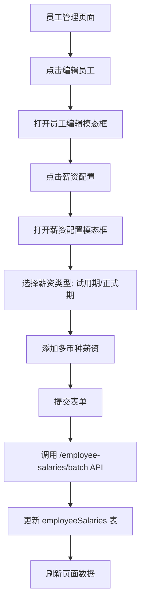

# 薪酬配置

<cite>
**本文档引用文件**   
- [schema.ts](file://backend/src/db/schema.ts)
- [employee.schema.ts](file://backend/src/schemas/employee.schema.ts)
- [SalaryService.ts](file://backend/src/services/SalaryService.ts)
- [AllowanceService.ts](file://backend/src/services/AllowanceService.ts)
- [employee-salaries.ts](file://backend/src/routes/v2/employee-salaries.ts)
- [employee-allowances.ts](file://backend/src/routes/v2/employee-allowances.ts)
- [employees.ts](file://backend/src/routes/v2/employees.ts)
- [EmployeeService.ts](file://backend/src/services/EmployeeService.ts)
- [EmployeeManagementPage.tsx](file://frontend/src/features/hr/pages/EmployeeManagementPage.tsx)
- [SalaryConfigModal.tsx](file://frontend/src/features/employees/components/modals/SalaryConfigModal.tsx)
- [AllowanceConfigModal.tsx](file://frontend/src/features/employees/components/modals/AllowanceConfigModal.tsx)
- [employee.schema.ts](file://frontend/src/validations/employee.schema.ts)
</cite>

## 目录
1. [年假配置](#年假配置)
2. [薪酬数据模型设计](#薪酬数据模型设计)
3. [员工创建时的薪酬初始化](#员工创建时的薪酬初始化)
4. [薪酬信息的查询与更新](#薪酬信息的查询与更新)
5. [前端薪资管理页面](#前端薪资管理页面)

## 年假配置

`employees` 表中的 `annualLeaveCycleMonths` 和 `annualLeaveDays` 字段用于管理员工的年假额度。`annualLeaveCycleMonths` 定义了年假计算周期的月数（例如12个月为一年），而 `annualLeaveDays` 则指定了在此周期内员工享有的带薪年假天数。这两个字段与 `employeeLeaves` 表配合使用，系统通过计算员工的在职时间与年假周期的关系，自动或手动确认其年假余额，并在员工申请休假时进行核销。

**Section sources**
- [schema.ts](file://backend/src/db/schema.ts#L34-L35)
- [employee.schema.ts](file://backend/src/schemas/employee.schema.ts#L54-L55)
- [EmployeeService.ts](file://backend/src/services/EmployeeService.ts#L158-L159)

## 薪酬数据模型设计

薪酬数据模型采用分离式设计，将核心员工信息与薪酬、补贴信息解耦。主表 `employees` 仅包含员工的基本信息和状态，而具体的薪酬数据则存储在两个独立的表中：`employeeSalaries` 和 `employeeAllowances`。

`employeeSalaries` 表用于存储员工的薪资信息，其关键字段包括：
- `employeeId`: 关联的员工ID。
- `salaryType`: 薪资类型，区分“probation”（试用期）和“regular”（正式期）。
- `currencyId`: 币种ID，支持多币种薪资。
- `amountCents`: 薪资金额，以分为单位存储，避免浮点数精度问题。

`employeeAllowances` 表用于存储员工的各类补贴信息，其结构与 `employeeSalaries` 类似，关键字段包括：
- `employeeId`: 关联的员工ID。
- `allowanceType`: 补贴类型，如“living”（生活补贴）、“housing”（住房补贴）等。
- `currencyId`: 币种ID。
- `amountCents`: 补贴金额，同样以分为单位。

这种设计的优势在于：
1. **灵活性**：支持为同一员工配置多种币种的薪资和补贴。
2. **可扩展性**：易于添加新的补贴类型，无需修改表结构。
3. **数据一致性**：通过服务层的批量更新操作，确保同一类型（如试用期薪资）的所有记录被原子性地更新。

**Diagram sources **
- [schema.ts](file://backend/src/db/schema.ts#L14-L38)
- [schema.ts](file://backend/src/db/schema.ts#L220-L229)
- [schema.ts](file://backend/src/db/schema.ts#L231-L239)
- [schema.ts](file://backend/src/db/schema.ts#L213-L218)

**Section sources**
- [schema.ts](file://backend/src/db/schema.ts#L220-L239)
- [migration_add_salary_tables.sql](file://backend/src/db/migration_add_salary_tables.sql)
- [migration_force_recreate_salary_tables.sql](file://backend/src/db/migration_force_recreate_salary_tables.sql)

## 员工创建时的薪酬初始化

在创建新员工时，通过 `CreateEmployeeSchema` 中的 `probationSalaries` 和 `regularSalaries` 字段来初始化其薪酬。当调用 `/employees` 接口创建员工时，后端的 `EmployeeService.create` 方法会接收这些薪酬数据。

在 `EmployeeService.create` 方法中，员工的基本信息被插入 `employees` 表后，系统会根据传入的 `probationSalaries` 和 `regularSalaries` 数组，调用 `SalaryService` 的相关方法，将这些薪资记录分别以“probation”和“regular”类型批量插入到 `employeeSalaries` 表中。这确保了新员工在创建时就具备完整的薪酬配置。

**Section sources**
- [employee.schema.ts](file://backend/src/schemas/employee.schema.ts#L71-L107)
- [employees.ts](file://backend/src/routes/v2/employees.ts#L184-L240)
- [EmployeeService.ts](file://backend/src/services/EmployeeService.ts#L20-L233)

## 薪酬信息的查询与更新

系统通过 `SalaryService` 和 `AllowanceService` 两个服务类来提供对薪酬和补贴信息的查询与更新功能。

`SalaryService` 提供了以下核心方法：
- `list(employeeId, salaryType?)`: 查询指定员工的薪资列表，可按类型过滤。
- `batchUpdate(employeeId, salaryType, salaries)`: 批量更新员工的某类薪资。该方法会先删除该类型的所有现有记录，再插入新的记录，确保数据的原子性。

`AllowanceService` 提供了与 `SalaryService` 对称的 `list` 和 `batchUpdate` 方法，用于管理补贴信息。

这些服务通过 `employee-salaries.ts` 和 `employee-allowances.ts` 路由暴露为 RESTful API。例如，`PUT /employee-salaries/batch` 接口接收包含 `employeeId`、`salaryType` 和 `salaries` 数组的请求体，调用 `SalaryService.batchUpdate` 来更新数据，并记录审计日志。

**Diagram sources **
- [SalaryService.ts](file://backend/src/services/SalaryService.ts#L103-L172)
- [employee-salaries.ts](file://backend/src/routes/v2/employee-salaries.ts#L158-L221)
- [AllowanceService.ts](file://backend/src/services/AllowanceService.ts#L103-L175)
- [employee-allowances.ts](file://backend/src/routes/v2/employee-allowances.ts#L160-L224)

**Section sources**
- [SalaryService.ts](file://backend/src/services/SalaryService.ts)
- [AllowanceService.ts](file://backend/src/services/AllowanceService.ts)
- [employee-salaries.ts](file://backend/src/routes/v2/employee-salaries.ts)
- [employee-allowances.ts](file://backend/src/routes/v2/employee-allowances.ts)

## 前端薪资管理页面

前端的薪资管理功能主要在 `EmployeeManagementPage` 和 `SalaryPaymentsPage` 中实现。`EmployeeManagementPage` 的员工信息展开行中，通过 `SensitiveField` 组件展示员工的试用期工资、转正工资及各类补贴，这些数据由后端在查询员工列表时一并返回。

当用户点击“编辑”按钮时，会弹出 `EmployeeFormModal`。该模态框内部集成了 `SalaryConfigModal` 和 `AllowanceConfigModal`，允许管理员为员工配置多币种的试用期/正式期薪资以及各类补贴。这些模态框使用 `useZodForm` 进行表单验证，并通过 `useUpdateEmployeeSalaries` 和 `useUpdateEmployeeAllowances` 等自定义 Hook 调用后端的批量更新 API。

`SalaryPaymentsPage` 则负责薪资的发放流程，它依赖于 `employeeSalaries` 表中的数据来生成薪资单，并在发放时展示和确认最终的薪资金额。

**Diagram sources **
- [EmployeeManagementPage.tsx](file://frontend/src/features/hr/pages/EmployeeManagementPage.tsx#L247-L266)
- [SalaryConfigModal.tsx](file://frontend/src/features/employees/components/modals/SalaryConfigModal.tsx)
- [AllowanceConfigModal.tsx](file://frontend/src/features/employees/components/modals/AllowanceConfigModal.tsx)
- [employee.schema.ts](file://frontend/src/validations/employee.schema.ts#L106-L118)

**Section sources**
- [EmployeeManagementPage.tsx](file://frontend/src/features/hr/pages/EmployeeManagementPage.tsx)
- [SalaryConfigModal.tsx](file://frontend/src/features/employees/components/modals/SalaryConfigModal.tsx)
- [AllowanceConfigModal.tsx](file://frontend/src/features/employees/components/modals/AllowanceConfigModal.tsx)
- [employee.schema.ts](file://frontend/src/validations/employee.schema.ts)