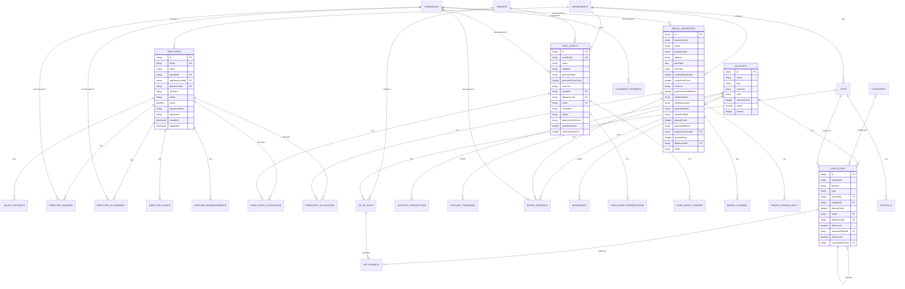

# 数据库设计

<cite>
**本文档引用的文件**   
- [schema.ts](file://backend/src/db/schema.ts)
- [schema.sql](file://backend/src/db/schema.sql)
- [migration_add_salary_tables.sql](file://backend/src/db/migration_add_salary_tables.sql)
- [migration_add_cash_flow_reversal_fields.sql](file://backend/src/db/migration_add_cash_flow_reversal_fields.sql)
- [optimistic-lock.ts](file://backend/src/utils/optimistic-lock.ts)
- [state-machine.ts](file://backend/src/utils/state-machine.ts)
- [business.schema.ts](file://backend/src/schemas/business.schema.ts)
- [common.schema.ts](file://backend/src/schemas/common.schema.ts)
- [drizzle.config.ts](file://backend/drizzle.config.ts)
</cite>

## 目录
1. [简介](#简介)
2. [核心实体表结构](#核心实体表结构)
3. [数据库迁移管理](#数据库迁移管理)
4. [并发控制与状态机](#并发控制与状态机)
5. [类型安全的数据库操作](#类型安全的数据库操作)
6. [数据库ER图](#数据库er图)

## 简介
本项目采用Drizzle ORM进行数据库设计，构建了一个全面的财务管理系统。数据库设计围绕员工、账户、财务流水、固定资产和租赁物业等核心业务实体展开，通过规范的表结构、主外键关系和索引策略，确保数据的完整性、一致性和查询性能。系统通过数据库迁移文件管理模式变更，利用乐观锁实现并发控制，并结合Zod模式定义确保类型安全的数据库操作。

## 核心实体表结构
数据库设计包含多个核心实体表，每个表都有明确的字段定义、数据类型和约束。

### 员工表 (employees)
员工表是系统的核心，存储所有员工的详细信息，包括个人信息、职位、部门和认证信息。

**表结构**
- `id`: TEXT, 主键
- `email`: TEXT, 唯一，非空
- `name`: TEXT, 员工姓名
- `positionId`: TEXT, 外键，关联职位
- `orgDepartmentId`: TEXT, 外键，关联组织部门
- `departmentId`: TEXT, 外键，关联部门
- `joinDate`: TEXT, 入职日期
- `status`: TEXT, 员工状态
- `active`: INTEGER, 是否激活
- `passwordHash`: TEXT, 密码哈希值
- `totpSecret`: TEXT, TOTP密钥
- `createdAt`: INTEGER, 创建时间
- `updatedAt`: INTEGER, 更新时间

**主外键关系**
- 无直接外键，但`positionId`、`orgDepartmentId`、`departmentId`分别关联`positions`、`org_departments`、`departments`表。

**索引策略**
- 在`email`字段上创建唯一索引，确保邮箱唯一性。
- 在`department_id`、`org_department_id`、`active`字段上创建索引，优化查询性能。

**Section sources**
- [schema.ts](file://backend/src/db/schema.ts#L14-L48)
- [schema.sql](file://backend/src/db/schema.sql#L8-L48)

### 账户表 (accounts)
账户表用于管理公司的各类财务账户，支持多币种。

**表结构**
- `id`: TEXT, 主键
- `name`: TEXT, 账户名称，非空
- `type`: TEXT, 账户类型，非空
- `currency`: TEXT, 币种，非空
- `alias`: TEXT, 别名
- `accountNumber`: TEXT, 账号
- `openingCents`: INTEGER, 期初余额（分）
- `active`: INTEGER, 是否激活
- `version`: INTEGER, 乐观锁版本号

**主外键关系**
- 无外键。

**索引策略**
- 无显式索引，但主键`id`自动创建索引。

**Section sources**
- [schema.ts](file://backend/src/db/schema.ts#L139-L149)
- [schema.sql](file://backend/src/db/schema.sql#L174-L184)

### 财务流水表 (cash_flows)
财务流水表记录所有的收入和支出交易。

**表结构**
- `id`: TEXT, 主键
- `voucherNo`: TEXT, 凭证号
- `bizDate`: TEXT, 业务日期，非空
- `type`: TEXT, 类型（income/expense），非空
- `accountId`: TEXT, 外键，关联账户，非空
- `categoryId`: TEXT, 外键，关联类别
- `amountCents`: INTEGER, 金额（分），非空
- `siteId`: TEXT, 外键，关联站点
- `departmentId`: TEXT, 外键，关联部门
- `isReversal`: INTEGER, 是否为红冲记录
- `reversalOfFlowId`: TEXT, 冲正的原始流水ID
- `isReversed`: INTEGER, 是否已被冲正
- `reversedByFlowId`: TEXT, 冲正记录ID

**主外键关系**
- `accountId` 外键关联 `accounts(id)`
- `categoryId` 外键关联 `categories(id)`
- `siteId` 外键关联 `sites(id)`
- `departmentId` 外键关联 `departments(id)`
- `reversalOfFlowId` 外键关联 `cash_flows(id)`

**索引策略**
- `idxAccountBiz`: 在`accountId`和`bizDate`上创建复合索引，优化按账户和日期查询。
- `idxType`: 在`type`上创建索引，优化按类型查询。
- `idxReversal`: 在`reversalOfFlowId`上创建索引，优化红冲查询。

**Section sources**
- [schema.ts](file://backend/src/db/schema.ts#L159-L188)
- [schema.sql](file://backend/src/db/schema.sql#L186-L203)

### 固定资产表 (fixed_assets)
固定资产表用于管理公司的固定资产，如设备、家具等。

**表结构**
- `id`: TEXT, 主键
- `assetCode`: TEXT, 资产代码，唯一，非空
- `name`: TEXT, 资产名称，非空
- `category`: TEXT, 类别
- `purchaseDate`: TEXT, 购买日期
- `purchasePriceCents`: INTEGER, 购买价格（分），非空
- `currency`: TEXT, 币种，非空
- `vendorId`: TEXT, 外键，关联供应商
- `departmentId`: TEXT, 外键，关联部门
- `siteId`: TEXT, 外键，关联站点
- `custodian`: TEXT, 保管人
- `status`: TEXT, 状态（in_use, idle, maintenance, scrapped, sold）
- `depreciationMethod`: TEXT, 折旧方法
- `usefulLifeYears`: INTEGER, 使用年限
- `currentValueCents`: INTEGER, 当前价值（分）
- `createdBy`: TEXT, 创建人
- `createdAt`: INTEGER, 创建时间
- `updatedAt`: INTEGER, 更新时间

**主外键关系**
- `vendorId` 外键关联 `vendors(id)`
- `departmentId` 外键关联 `departments(id)`
- `siteId` 外键关联 `sites(id)`

**索引策略**
- `asset_code`字段上有唯一索引，确保资产代码唯一性。

**Section sources**
- [schema.ts](file://backend/src/db/schema.ts#L506-L530)
- [schema.sql](file://backend/src/db/schema.sql#L471-L496)

### 租赁物业表 (rental_properties)
租赁物业表用于管理公司租赁的办公场所、宿舍等物业。

**表结构**
- `id`: TEXT, 主键
- `propertyCode`: TEXT, 物业代码，非空
- `name`: TEXT, 物业名称，非空
- `propertyType`: TEXT, 物业类型（office, dormitory, apartment, warehouse），非空
- `address`: TEXT, 地址
- `areaSqm`: REAL, 面积（平方米）
- `rentType`: TEXT, 租金类型（monthly, yearly）
- `monthlyRentCents`: INTEGER, 月租金（分）
- `yearlyRentCents`: INTEGER, 年租金（分）
- `currency`: TEXT, 币种，非空
- `paymentPeriodMonths`: INTEGER, 付款周期（月）
- `landlordName`: TEXT, 房东姓名
- `landlordContact`: TEXT, 房东联系方式
- `leaseStartDate`: TEXT, 租赁开始日期
- `leaseEndDate`: TEXT, 租赁结束日期
- `depositCents`: INTEGER, 押金（分）
- `paymentMethod`: TEXT, 付款方式
- `paymentAccountId`: TEXT, 外键，关联付款账户
- `paymentDay`: INTEGER, 付款日
- `departmentId`: TEXT, 外键，关联部门
- `status`: TEXT, 状态（active, inactive）
- `memo`: TEXT, 备注
- `contractFileUrl`: TEXT, 合同文件URL
- `createdBy`: TEXT, 创建人
- `createdAt`: INTEGER, 创建时间
- `updatedAt`: INTEGER, 更新时间

**主外键关系**
- `paymentAccountId` 外键关联 `accounts(id)`
- `departmentId` 外键关联 `departments(id)`

**索引策略**
- 无显式索引，但主键`id`自动创建索引。

**Section sources**
- [schema.ts](file://backend/src/db/schema.ts#L576-L603)
- [schema.sql](file://backend/src/db/schema.sql#L546-L573)

## 数据库迁移管理
数据库模式的变更通过Drizzle CLI生成和应用迁移文件来管理，确保模式变更的可追溯性和一致性。

### 迁移文件生成与应用
迁移文件位于`backend/src/db/`目录下，以`migration_`为前缀。例如，`migration_add_salary_tables.sql`文件用于添加薪资相关表。

```sql
-- 添加薪资相关表
CREATE TABLE IF NOT EXISTS employee_salaries (
  id TEXT PRIMARY KEY,
  employee_id TEXT NOT NULL,
  salary_type TEXT NOT NULL, -- 'probation', 'regular'
  currency_id TEXT NOT NULL,
  amount_cents INTEGER NOT NULL,
  effective_date TEXT,
  created_at INTEGER,
  updated_at INTEGER
);

CREATE TABLE IF NOT EXISTS employee_allowances (
  id TEXT PRIMARY KEY,
  employee_id TEXT NOT NULL,
  allowance_type TEXT NOT NULL, -- 'living', 'housing', 'transportation', 'meal'
  currency_id TEXT NOT NULL,
  amount_cents INTEGER NOT NULL,
  created_at INTEGER,
  updated_at INTEGER
);
```

**Section sources**
- [migration_add_salary_tables.sql](file://backend/src/db/migration_add_salary_tables.sql#L1-L21)

### 红冲功能迁移
`migration_add_cash_flow_reversal_fields.sql`文件为财务流水表添加了红冲功能所需的字段。

```sql
-- 添加现金流水红冲相关字段
ALTER TABLE cash_flows ADD COLUMN is_reversal INTEGER DEFAULT 0;
ALTER TABLE cash_flows ADD COLUMN reversal_of_flow_id TEXT;
ALTER TABLE cash_flows ADD COLUMN is_reversed INTEGER DEFAULT 0;
ALTER TABLE cash_flows ADD COLUMN reversed_by_flow_id TEXT;

-- 创建索引以优化查询性能
CREATE INDEX IF NOT EXISTS idx_cash_flows_reversal ON cash_flows(reversal_of_flow_id);
```

此迁移通过添加`is_reversal`、`reversal_of_flow_id`等字段，实现了对错误流水的冲正功能，同时创建了索引以优化相关查询性能。

**Section sources**
- [migration_add_cash_flow_reversal_fields.sql](file://backend/src/db/migration_add_cash_flow_reversal_fields.sql#L1-L18)

## 并发控制与状态机
系统通过乐观锁和状态机机制确保数据的一致性和业务流程的正确性。

### 乐观锁实现
在多个表中引入了`version`字段作为乐观锁版本号，如`accounts`、`employee_leaves`、`borrowings`等表。当更新记录时，会检查当前版本号是否与预期版本号一致，若不一致则抛出并发修改错误。

```typescript
/**
 * 乐观锁工具函数
 * 用于实现并发控制，防止数据冲突
 */
export function validateVersion(currentVersion: number | null, expectedVersion: number | null): void {
  if (currentVersion === null || expectedVersion === null) {
    // 如果版本号为空，跳过验证（向后兼容）
    return
  }

  if (currentVersion !== expectedVersion) {
    throw Errors.BUSINESS_ERROR(
      '数据已被其他用户修改，请刷新后重试',
      {
        code: ErrorCodes.BUS_CONCURRENT_MODIFICATION,
        currentVersion,
        expectedVersion,
      }
    )
  }
}

/**
 * 递增版本号
 */
export function incrementVersion(version: number | null): number {
  return (version || 0) + 1
}
```

**Section sources**
- [optimistic-lock.ts](file://backend/src/utils/optimistic-lock.ts#L1-L41)

### 状态机管理
系统使用状态机来管理业务流程的状态转换，确保状态流转的合法性。例如，薪资支付状态机定义了从`pending_employee_confirmation`到`completed`的合法状态流转。

```typescript
/**
 * 薪资支付状态机
 * 状态流转: pending_employee_confirmation → pending_finance_approval → pending_payment → pending_payment_confirmation → completed
 */
export const salaryPaymentStateMachine = new StateMachine({
  pending_employee_confirmation: ['pending_finance_approval', 'deleted'],
  pending_finance_approval: ['pending_payment', 'pending_employee_confirmation'],
  pending_payment: ['pending_payment_confirmation'],
  pending_payment_confirmation: ['completed'],
  completed: [], // 终态，不允许转换
})
```

**Section sources**
- [state-machine.ts](file://backend/src/utils/state-machine.ts#L44-L54)

## 类型安全的数据库操作
系统结合Zod模式定义，实现了类型安全的数据库操作，确保API请求数据的有效性和类型安全。

### Zod模式定义
在`backend/src/schemas/`目录下定义了各种Zod模式，用于验证API请求数据。例如，`createEmployeeSchema`定义了创建员工时所需的数据结构和验证规则。

```typescript
/**
 * 创建员工Schema
 */
export const createEmployeeSchema = z.object({
  name: z.string().min(1, 'name参数必填'),
  orgDepartmentId: uuidSchema,
  positionId: uuidSchema,
  departmentId: uuidSchema.optional(),
  joinDate: dateSchema,
  email: emailSchema,
  birthday: dateSchema,
  // ... 其他字段
})
```

### 请求验证
在API路由中使用Zod模式进行请求验证，确保传入的数据符合预期。

```typescript
// 在API路由中使用
app.post('/employees', validateJson(createEmployeeSchema), async (c) => {
  const data = getValidatedData<typeof createEmployeeSchema>(c)
  // 处理数据
})
```

**Section sources**
- [business.schema.ts](file://backend/src/schemas/business.schema.ts#L42-L86)
- [common.schema.ts](file://backend/src/schemas/common.schema.ts#L1-L234)

## 数据库ER图
以下ER图展示了主要实体之间的关系。



**Diagram sources **
- [schema.ts](file://backend/src/db/schema.ts#L14-L706)
- [schema.sql](file://backend/src/db/schema.sql#L8-L678)