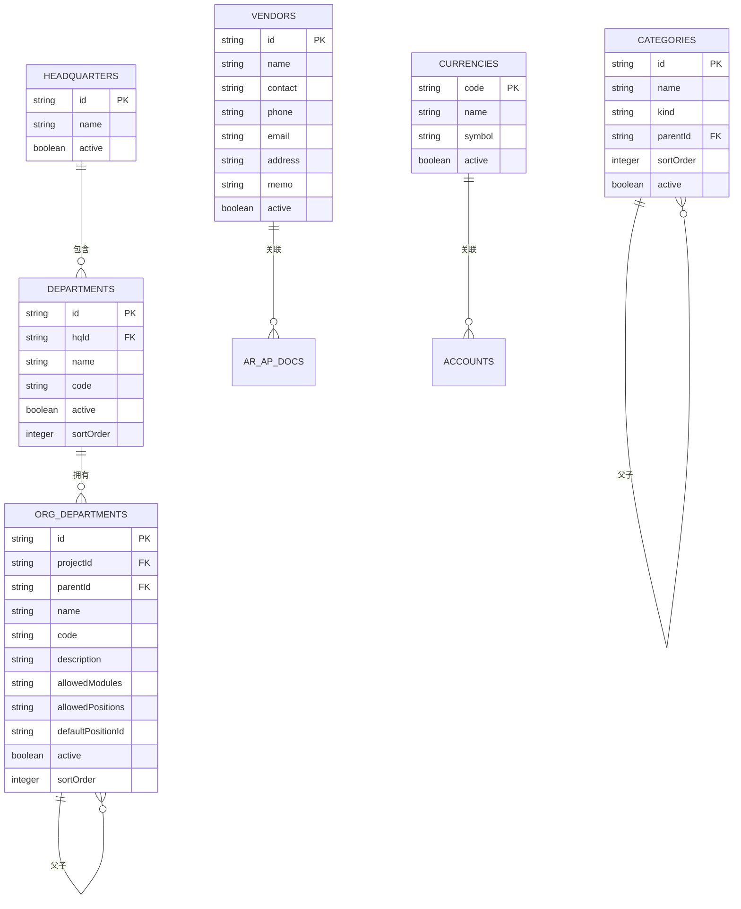
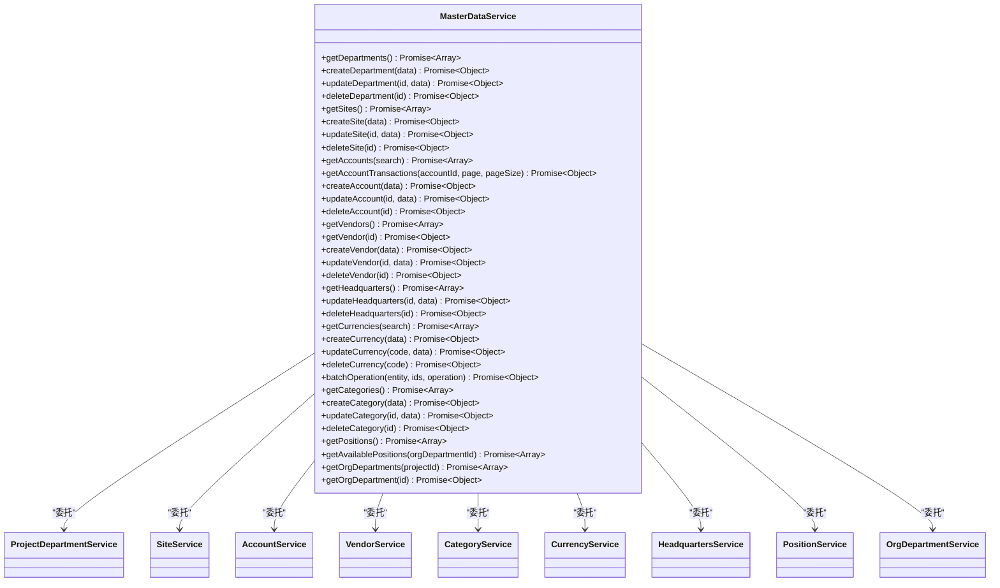
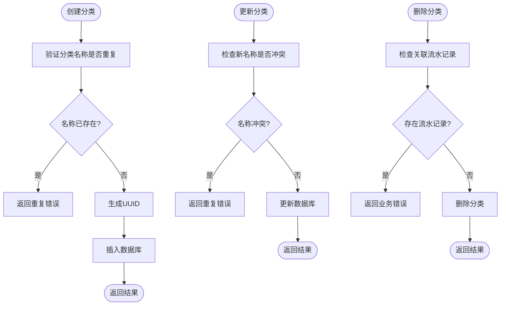
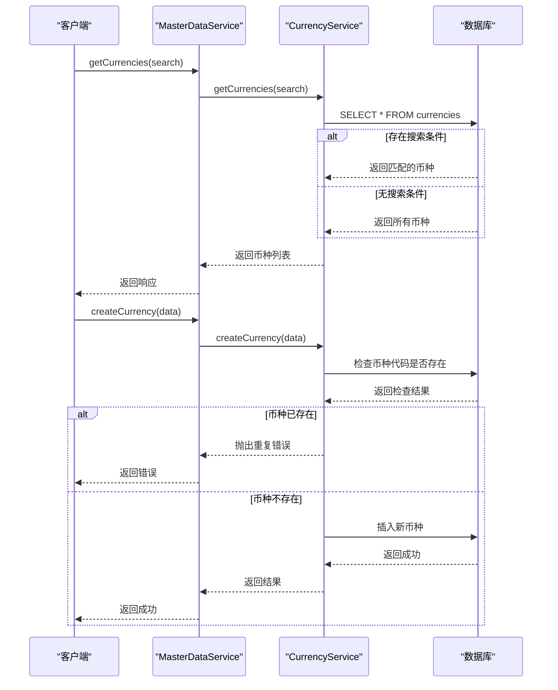
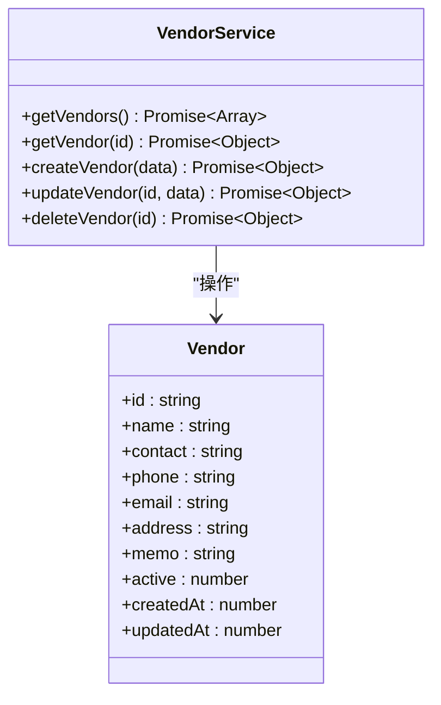
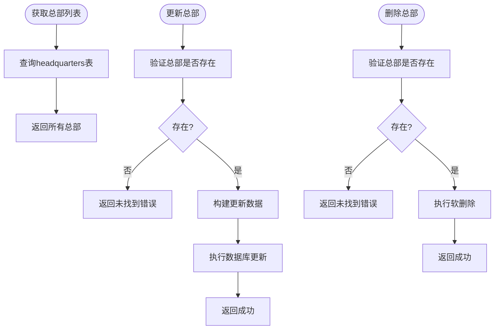
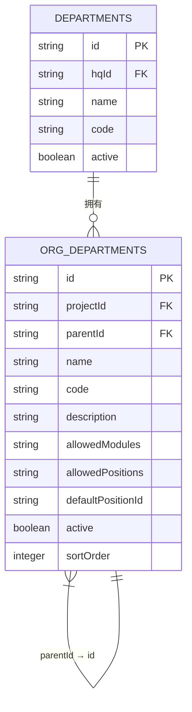

# 主数据管理模型

<cite>
**本文档引用的文件**   
- [schema.ts](file://backend/src/db/schema.ts)
- [MasterDataService.ts](file://backend/src/services/MasterDataService.ts)
- [categories.ts](file://backend/src/routes/v2/master-data/categories.ts)
- [currencies.ts](file://backend/src/routes/v2/master-data/currencies.ts)
- [vendors.ts](file://backend/src/routes/v2/master-data/vendors.ts)
- [headquarters.ts](file://backend/src/routes/v2/master-data/headquarters.ts)
- [departments.ts](file://backend/src/routes/v2/master-data/departments.ts)
- [org-departments.ts](file://backend/src/routes/v2/master-data/org-departments.ts)
- [CategoryService.ts](file://backend/src/services/CategoryService.ts)
- [CurrencyService.ts](file://backend/src/services/CurrencyService.ts)
- [VendorService.ts](file://backend/src/services/VendorService.ts)
- [HeadquartersService.ts](file://backend/src/services/HeadquartersService.ts)
- [OrgDepartmentService.ts](file://backend/src/services/OrgDepartmentService.ts)
- [DepartmentService.ts](file://backend/src/services/DepartmentService.ts)
- [master-data.schema.ts](file://backend/src/schemas/master-data.schema.ts)
</cite>

## 目录
1. [简介](#简介)
2. [核心主数据表结构](#核心主数据表结构)
3. [主数据关系与层级](#主数据关系与层级)
4. [主数据服务接口](#主数据服务接口)
5. [财务分类体系](#财务分类体系)
6. [币种管理](#币种管理)
7. [供应商管理](#供应商管理)
8. [总部与部门管理](#总部与部门管理)
9. [组织架构管理](#组织架构管理)
10. [结论](#结论)

## 简介
本系统采用主数据管理模式，集中管理财务系统中的核心基础数据。主数据包括财务分类、币种、供应商、总部、部门和组织部门等关键实体，通过统一的接口和服务进行管理。系统采用门面模式（Facade Pattern）的`MasterDataService`作为统一入口，委托给具体的主数据服务类进行处理。所有主数据操作都通过RESTful API暴露，并实现了权限控制、审计日志和缓存机制。

**Section sources**
- [MasterDataService.ts](file://backend/src/services/MasterDataService.ts#L1-L261)
- [schema.ts](file://backend/src/db/schema.ts#L1-L706)

## 核心主数据表结构
系统中的核心主数据表定义了财务系统的基础架构和业务实体。这些表通过Drizzle ORM在SQLite数据库中定义，每个表都有明确的字段和约束。

### categories表
`categories`表用于存储财务分类信息，支持收入和支出两种类型。该表通过`parentId`字段实现多级分类的树形结构。

**字段说明：**
- `id`: 分类唯一标识符（UUID）
- `name`: 分类名称，必填
- `kind`: 分类类型，值为`income`（收入）或`expense`（支出），必填
- `parentId`: 父分类ID，用于构建层级关系，可为空（表示根节点）
- `sortOrder`: 排序序号，用于控制显示顺序
- `active`: 激活状态，0表示禁用，1表示启用

**Section sources**
- [schema.ts](file://backend/src/db/schema.ts#L343-L350)

### currencies表
`currencies`表用于管理系统支持的所有币种，确保财务数据的货币一致性。

**字段说明：**
- `code`: 币种代码，作为主键，通常为3位大写字母（如CNY、USD）
- `name`: 币种名称，必填
- `symbol`: 币种符号（如¥、$）
- `active`: 激活状态，0表示禁用，1表示启用

**Section sources**
- [schema.ts](file://backend/src/db/schema.ts#L213-L218)

### vendors表
`vendors`表用于存储供应商的相关信息，是应付账款（AP）业务的基础。

**字段说明：**
- `id`: 供应商唯一标识符（UUID）
- `name`: 供应商名称，必填且唯一
- `contact`: 联系人姓名
- `phone`: 联系电话
- `email`: 联系邮箱
- `address`: 地址
- `memo`: 备注信息
- `active`: 激活状态，0表示禁用，1表示启用
- `createdAt`: 创建时间戳
- `updatedAt`: 更新时间戳

**Section sources**
- [schema.ts](file://backend/src/db/schema.ts#L82-L93)

### headquarters表
`headquarters`表用于定义总部实体，作为组织架构的顶层节点。

**字段说明：**
- `id`: 总部唯一标识符（UUID）
- `name`: 总部名称，必填
- `active`: 激活状态，0表示禁用，1表示启用

**Section sources**
- [schema.ts](file://backend/src/db/schema.ts#L76-L80)

### departments表
`departments`表代表项目或部门，是业务运营的基本单位。

**字段说明：**
- `id`: 部门唯一标识符（UUID）
- `hqId`: 所属总部ID，关联`headquarters`表
- `name`: 部门名称，必填
- `code`: 部门代码
- `active`: 激活状态，0表示禁用，1表示启用
- `sortOrder`: 排序序号
- `createdAt`: 创建时间戳
- `updatedAt`: 更新时间戳

**Section sources**
- [schema.ts](file://backend/src/db/schema.ts#L65-L74)

### orgDepartments表
`orgDepartments`表代表组织内的具体部门，与`departments`表共同构建完整的组织架构。

**字段说明：**
- `id`: 组织部门唯一标识符（UUID）
- `projectId`: 项目ID，关联`departments`表
- `parentId`: 父部门ID，用于构建层级关系
- `name`: 部门名称，必填
- `code`: 部门代码
- `description`: 描述信息
- `allowedModules`: 允许访问的模块列表，存储为JSON字符串
- `allowedPositions`: 允许的职位列表，存储为JSON字符串
- `defaultPositionId`: 默认职位ID
- `active`: 激活状态，0表示禁用，1表示启用
- `sortOrder`: 排序序号
- `createdAt`: 创建时间戳
- `updatedAt`: 更新时间戳

**Section sources**
- [schema.ts](file://backend/src/db/schema.ts#L95-L109)

## 主数据关系与层级
主数据表之间通过外键和逻辑关系构建了复杂的业务模型。`departments`和`orgDepartments`表共同构成了系统的组织架构，其中`departments`代表项目/部门，而`orgDepartments`代表组织内的具体部门。

**Diagram sources**
- [schema.ts](file://backend/src/db/schema.ts#L65-L109)
- [schema.ts](file://backend/src/db/schema.ts#L343-L350)

## 主数据服务接口
`MasterDataService`作为主数据管理的门面服务，提供了统一的API接口，将请求委托给具体的子服务进行处理。

**Diagram sources**
- [MasterDataService.ts](file://backend/src/services/MasterDataService.ts#L1-L261)

## 财务分类体系
`categories`表通过`parentId`字段构建了多级财务分类体系，支持`income`（收入）和`expense`（支出）两种类型。这种树形结构允许用户创建任意深度的分类层级，满足复杂的财务管理需求。

### 分类服务实现
`CategoryService`提供了对财务分类的CRUD操作，包含业务逻辑验证：

- **创建分类**：检查分类名称是否重复
- **更新分类**：检查新名称是否与其他分类冲突
- **删除分类**：检查是否有流水记录关联，若有则禁止删除

**Diagram sources**
- [CategoryService.ts](file://backend/src/services/CategoryService.ts#L1-L78)
- [schema.ts](file://backend/src/db/schema.ts#L343-L350)

## 币种管理
`currencies`表管理系统支持的所有币种，确保财务数据的货币一致性。每个币种由3位代码唯一标识，并包含名称和符号信息。

### 币种服务实现
`CurrencyService`提供了对币种的完整管理功能：

- **查询币种**：支持按名称或代码搜索
- **创建币种**：检查币种代码是否已存在
- **更新币种**：可修改名称和激活状态
- **删除币种**：检查是否有账户使用该币种，若有则禁止删除

**Diagram sources**
- [CurrencyService.ts](file://backend/src/services/CurrencyService.ts#L1-L78)
- [currencies.ts](file://backend/src/routes/v2/master-data/currencies.ts#L1-L318)

## 供应商管理
`vendors`表存储供应商的联系信息和状态，是应付账款（AP）业务的基础。供应商信息包括名称、联系人、电话、邮箱、地址和备注等。

### 供应商服务实现
`VendorService`提供了对供应商的完整生命周期管理：

- **查询供应商**：返回所有激活状态的供应商，按名称排序
- **获取供应商详情**：根据ID查询单个供应商
- **创建供应商**：生成UUID并设置创建时间
- **更新供应商**：支持部分字段更新，自动更新时间戳
- **删除供应商**：软删除，将`active`字段设为0

**Diagram sources**
- [VendorService.ts](file://backend/src/services/VendorService.ts#L1-L94)
- [vendors.ts](file://backend/src/routes/v2/master-data/vendors.ts#L1-L260)

## 总部与部门管理
`headquarters`表作为总部实体的定义，而`departments`表代表项目/部门。这两个表共同构成了系统的顶层组织结构。

### 总部服务实现
`HeadquartersService`提供了对总部的管理功能：

- **获取总部列表**：返回所有总部
- **更新总部**：可修改名称和激活状态
- **删除总部**：软删除，将`active`字段设为0

**Diagram sources**
- [HeadquartersService.ts](file://backend/src/services/HeadquartersService.ts#L1-L45)
- [headquarters.ts](file://backend/src/routes/v2/master-data/headquarters.ts#L1-L166)

## 组织架构管理
`departments`和`orgDepartments`表共同构建了系统的组织架构。`departments`代表项目/部门，而`orgDepartments`代表组织内的具体部门，通过`projectId`和`parentId`形成层级关系。

### 组织部门服务实现
`OrgDepartmentService`和`DepartmentService`协同工作，提供完整的组织架构管理：

- **获取组织部门**：支持按项目ID查询，自动为总部创建默认组织部门
- **获取组织部门详情**：返回单个组织部门的详细信息
- **创建默认组织部门**：为新项目或总部创建预设的部门结构

**Diagram sources**
- [OrgDepartmentService.ts](file://backend/src/services/OrgDepartmentService.ts#L1-L129)
- [DepartmentService.ts](file://backend/src/services/DepartmentService.ts#L1-L182)
- [departments.ts](file://backend/src/routes/v2/master-data/departments.ts#L1-L439)
- [org-departments.ts](file://backend/src/routes/v2/master-data/org-departments.ts#L1-L126)

## 结论
本系统通过精心设计的主数据模型，实现了对财务核心数据的统一管理。`categories`表通过`parentId`字段构建了灵活的多级财务分类体系，支持收入和支出两种类型。`currencies`表管理系统支持的所有币种，确保了财务数据的货币一致性。`vendors`表存储了供应商的完整联系信息，为应付账款业务提供了基础。`headquarters`表作为总部实体的定义，与`departments`表共同构成了系统的顶层组织结构。`departments`和`orgDepartments`表通过`projectId`和`parentId`字段形成了清晰的层级关系，共同构建了完整的组织架构。`MasterDataService`作为统一的门面服务，提供了简洁的API接口，将请求委托给具体的子服务进行处理，实现了关注点分离和代码复用。整个主数据管理模型设计合理，扩展性强，能够满足复杂的财务管理需求。