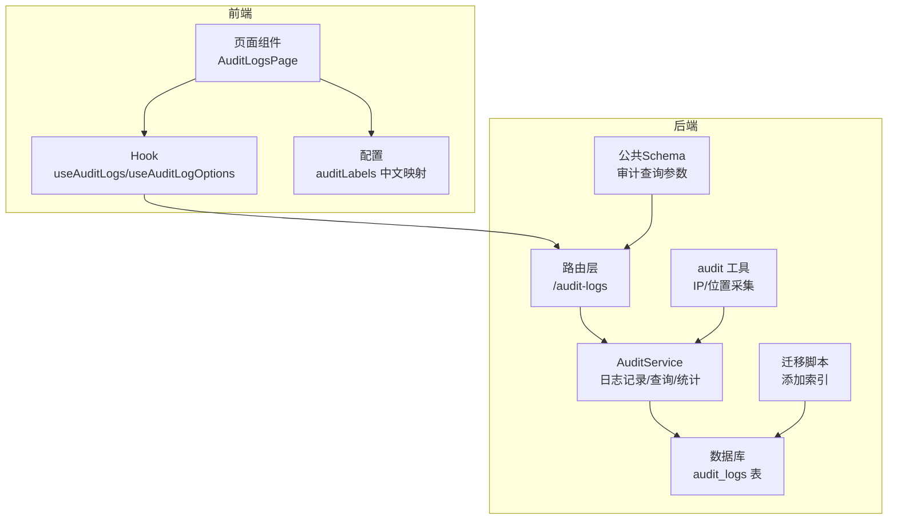
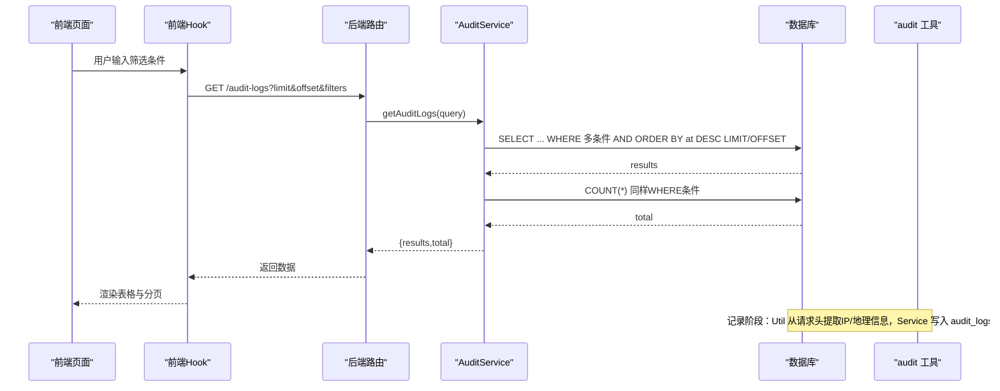
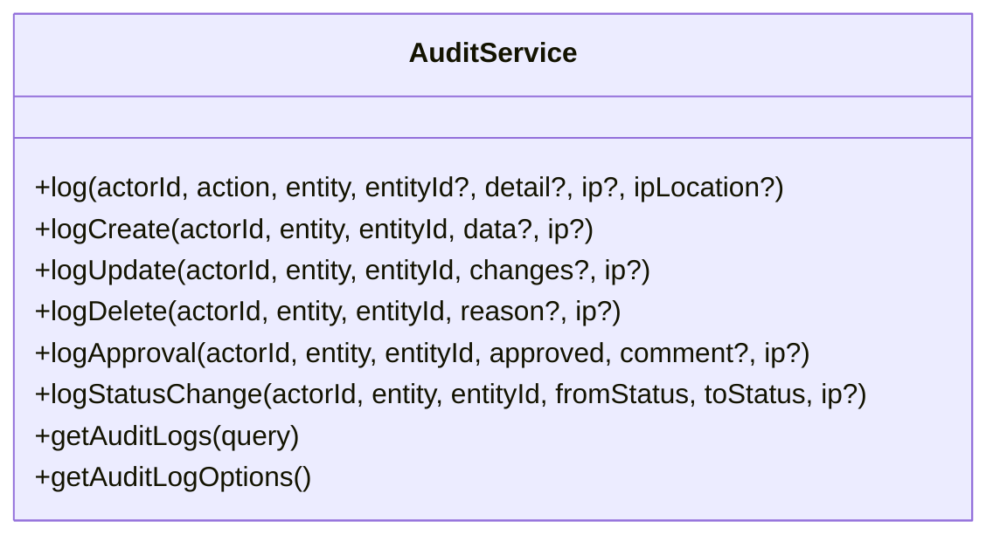
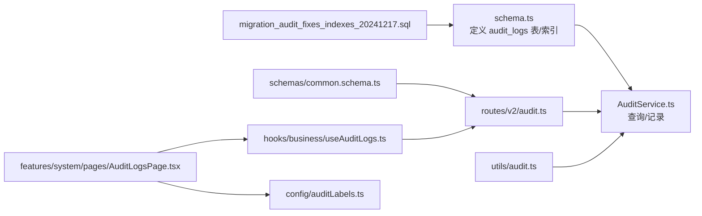
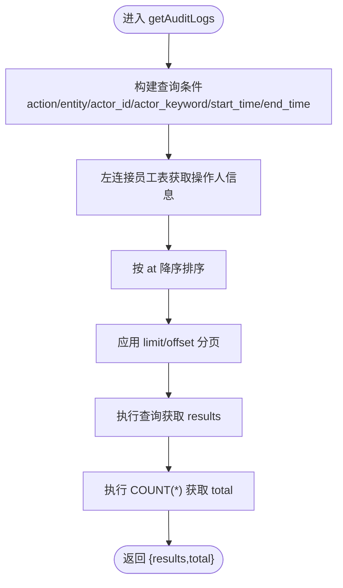
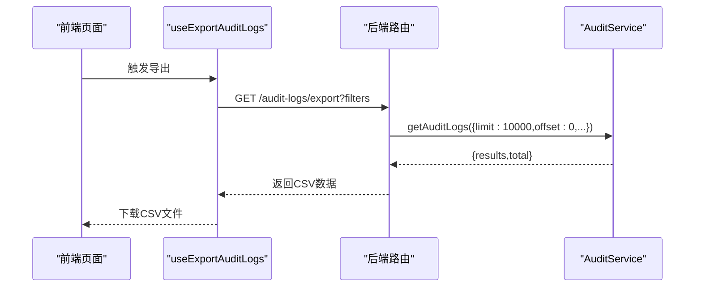

# 审计日志模型

<cite>
**本文引用的文件列表**
- [schema.ts](file://backend/src/db/schema.ts)
- [migration_audit_fixes_indexes_20241217.sql](file://backend/src/db/migration_audit_fixes_indexes_20241217.sql)
- [AuditService.ts](file://backend/src/services/AuditService.ts)
- [audit.ts](file://backend/src/utils/audit.ts)
- [audit.ts（路由）](file://backend/src/routes/v2/audit.ts)
- [common.schema.ts](file://backend/src/schemas/common.schema.ts)
- [useAuditLogs.ts](file://frontend/src/hooks/business/useAuditLogs.ts)
- [AuditLogsPage.tsx](file://frontend/src/features/system/pages/AuditLogsPage.tsx)
- [auditLabels.ts](file://frontend/src/config/auditLabels.ts)
- [audit.test.ts](file://backend/test/routes/audit.test.ts)
</cite>

## 目录
1. [简介](#简介)
2. [项目结构](#项目结构)
3. [核心组件](#核心组件)
4. [架构总览](#架构总览)
5. [详细组件分析](#详细组件分析)
6. [依赖关系分析](#依赖关系分析)
7. [性能考量](#性能考量)
8. [故障排查指南](#故障排查指南)
9. [结论](#结论)
10. [附录](#附录)

## 简介
本文件系统性梳理审计日志模型 auditLogs 的表结构、字段语义及其在系统安全中的关键作用，并结合后端服务层与前端界面，说明如何通过统一的审计记录、查询与导出能力支撑合规与风控需求。重点覆盖：
- 字段设计：actorId、action、entity、entityId、at、detail、ip、ipLocation 的含义与用途
- 索引优化：idx_audit_logs_time、idx_audit_logs_entity 如何提升时间范围与实体检索性能
- 服务能力：AuditService 提供的日志记录、多条件过滤、分页统计与选项查询
- 前后端集成：路由、Schema、Hook、页面如何协同完成审计日志的展示与导出

## 项目结构
审计日志模型贯穿后端数据库定义、服务层、工具层、路由层与前端页面与Hook，形成“记录—查询—展示—导出”的闭环。

图表来源
- [schema.ts](file://backend/src/db/schema.ts#L675-L692)
- [migration_audit_fixes_indexes_20241217.sql](file://backend/src/db/migration_audit_fixes_indexes_20241217.sql#L1-L13)
- [AuditService.ts](file://backend/src/services/AuditService.ts#L1-L277)
- [audit.ts](file://backend/src/utils/audit.ts#L1-L90)
- [audit.ts（路由）](file://backend/src/routes/v2/audit.ts#L1-L224)
- [common.schema.ts](file://backend/src/schemas/common.schema.ts#L193-L206)
- [useAuditLogs.ts](file://frontend/src/hooks/business/useAuditLogs.ts#L1-L116)
- [AuditLogsPage.tsx](file://frontend/src/features/system/pages/AuditLogsPage.tsx#L1-L192)
- [auditLabels.ts](file://frontend/src/config/auditLabels.ts#L1-L263)

章节来源
- [schema.ts](file://backend/src/db/schema.ts#L675-L692)
- [migration_audit_fixes_indexes_20241217.sql](file://backend/src/db/migration_audit_fixes_indexes_20241217.sql#L1-L13)
- [AuditService.ts](file://backend/src/services/AuditService.ts#L1-L277)
- [audit.ts](file://backend/src/utils/audit.ts#L1-L90)
- [audit.ts（路由）](file://backend/src/routes/v2/audit.ts#L1-L224)
- [common.schema.ts](file://backend/src/schemas/common.schema.ts#L193-L206)
- [useAuditLogs.ts](file://frontend/src/hooks/business/useAuditLogs.ts#L1-L116)
- [AuditLogsPage.tsx](file://frontend/src/features/system/pages/AuditLogsPage.tsx#L1-L192)
- [auditLabels.ts](file://frontend/src/config/auditLabels.ts#L1-L263)

## 核心组件
- 数据表：audit_logs
  - 字段与约束：主键 id；actorId 标识操作者；action 记录操作类型；entity、entityId 指明被操作实体类型与ID；at 时间戳；detail 存储变更详情；ip、ipLocation 记录来源IP与地理信息
  - 索引：idx_audit_logs_time（at）、idx_audit_logs_entity（entity_id）
- 服务层：AuditService
  - 日志记录：log、logCreate、logUpdate、logDelete、logApproval、logStatusChange
  - 查询统计：getAuditLogs（多条件过滤、分页、总数统计）
  - 选项查询：getAuditLogOptions（动作、实体、操作人）
- 工具层：audit 工具
  - 从请求头提取 IP 与地理信息，封装异步记录，保证不影响主流程
- 路由层：/audit-logs
  - 列表查询、过滤选项、导出CSV、手动创建审计日志
- 前端：页面与Hook
  - 页面负责筛选、分页、列渲染与导出；Hook 负责构建查询参数、调用接口与缓存策略

章节来源
- [schema.ts](file://backend/src/db/schema.ts#L675-L692)
- [migration_audit_fixes_indexes_20241217.sql](file://backend/src/db/migration_audit_fixes_indexes_20241217.sql#L6-L9)
- [AuditService.ts](file://backend/src/services/AuditService.ts#L62-L277)
- [audit.ts](file://backend/src/utils/audit.ts#L1-L90)
- [audit.ts（路由）](file://backend/src/routes/v2/audit.ts#L1-L224)
- [common.schema.ts](file://backend/src/schemas/common.schema.ts#L193-L206)
- [useAuditLogs.ts](file://frontend/src/hooks/business/useAuditLogs.ts#L1-L116)
- [AuditLogsPage.tsx](file://frontend/src/features/system/pages/AuditLogsPage.tsx#L1-L192)
- [auditLabels.ts](file://frontend/src/config/auditLabels.ts#L1-L263)

## 架构总览
审计日志从“记录”到“查询/导出”的端到端流程如下：

图表来源
- [audit.ts（路由）](file://backend/src/routes/v2/audit.ts#L27-L61)
- [AuditService.ts](file://backend/src/services/AuditService.ts#L170-L242)
- [audit.ts](file://backend/src/utils/audit.ts#L33-L90)
- [schema.ts](file://backend/src/db/schema.ts#L675-L692)

## 详细组件分析

### 数据表：audit_logs
- 字段语义
  - actorId：执行操作的用户标识，用于关联到员工表以显示姓名与邮箱
  - action：标准化的操作类型，如登录、创建、更新、删除、审批、状态变更等
  - entity/entityId：被操作实体的类型与ID，便于按对象类型快速检索
  - at：Unix毫秒级时间戳，用于时间范围查询与排序
  - detail：JSON字符串或文本，记录变更前后对比或附加说明
  - ip/ipLocation：记录来源IP与地理信息，辅助安全审计
- 索引设计
  - idx_audit_logs_time(at)：加速按时间范围的查询与排序
  - idx_audit_logs_entity(entity_id)：加速按实体ID的检索
- 业务价值
  - 安全审计：追踪谁在何时对哪些对象做了什么操作，支持回溯与取证
  - 合规要求：满足监管对操作留痕的要求
  - 风控预警：异常时间段、异常IP、异常实体访问可作为告警依据

章节来源
- [schema.ts](file://backend/src/db/schema.ts#L675-L692)
- [migration_audit_fixes_indexes_20241217.sql](file://backend/src/db/migration_audit_fixes_indexes_20241217.sql#L6-L9)

### 服务层：AuditService
- 日志记录
  - log：统一入口，写入所有字段，时间戳取当前毫秒
  - logCreate/logUpdate/logDelete/logApproval/logStatusChange：便捷方法，自动序列化变更详情
- 查询与统计
  - getAuditLogs：支持 action、entity、actor_id、actor_keyword（模糊匹配员工姓名/邮箱）、start_time/end_time 多条件过滤；默认按 at 降序；支持 limit/offset 分页；同时返回 total
  - getAuditLogOptions：返回可用的动作、实体与操作人选项，便于前端筛选器
- 性能与健壮性
  - 使用左连接员工表获取操作人信息，避免缺失 actorId 时的查询失败
  - 统计总数采用与查询相同的 WHERE 条件，保证一致性

图表来源
- [AuditService.ts](file://backend/src/services/AuditService.ts#L62-L277)

章节来源
- [AuditService.ts](file://backend/src/services/AuditService.ts#L62-L277)

### 工具层：audit 工具
- IP/地理信息采集
  - 从请求头读取客户端IP与国家/城市信息，组装为 ip 与 ipLocation
- 异步记录
  - 在有 userId 或 session 的情况下异步写入审计日志，使用 waitUntil 确保不阻塞主请求
  - 出错时记录日志但不影响主流程

章节来源
- [audit.ts](file://backend/src/utils/audit.ts#L1-L90)

### 路由层：/audit-logs
- 接口职责
  - GET /audit-logs：分页查询审计日志，支持多条件过滤
  - GET /audit-logs/options：获取动作、实体、操作人的下拉选项
  - GET /audit-logs/export：导出CSV，包含时间、操作人、邮箱、操作、实体类型、实体ID、IP、IP归属地、详情
  - POST /audit-logs：手动创建审计日志（用于特殊场景）
- 权限控制
  - 查看与导出均需要相应权限，未授权返回 403
- 参数校验
  - 使用公共 Schema 对查询参数进行校验，包括 action、entity、actorId、actorKeyword、startTime、endTime、limit、offset

章节来源
- [audit.ts（路由）](file://backend/src/routes/v2/audit.ts#L1-L224)
- [common.schema.ts](file://backend/src/schemas/common.schema.ts#L193-L206)

### 前端：页面与Hook
- 页面组件
  - 支持按操作类型、对象类型、操作人关键词、时间范围筛选
  - 展示时间、操作人、动作、对象类型、对象ID、详情、IP与地理信息
  - 支持刷新与导出CSV
- Hook
  - useAuditLogs：构建查询参数、调用接口、分页与缓存
  - useAuditLogOptions：获取筛选选项
  - useExportAuditLogs：导出CSV
- 中文映射
  - auditLabels 提供动作与对象类型的中文标签、颜色与详情字段的中文解释，提升可读性

章节来源
- [AuditLogsPage.tsx](file://frontend/src/features/system/pages/AuditLogsPage.tsx#L1-L192)
- [useAuditLogs.ts](file://frontend/src/hooks/business/useAuditLogs.ts#L1-L116)
- [auditLabels.ts](file://frontend/src/config/auditLabels.ts#L1-L263)

## 依赖关系分析
- 后端
  - schema.ts 定义 audit_logs 表与索引
  - migration_audit_fixes_indexes_20241217.sql 确保索引存在
  - AuditService 依赖 schema.ts 中的表定义与 drizzle-orm 查询语法
  - audit 路由依赖 AuditService 与权限校验
  - audit 工具依赖请求上下文与会话信息
- 前端
  - 页面依赖 Hook 与配置映射
  - Hook 依赖 API 客户端与 React Query

图表来源
- [schema.ts](file://backend/src/db/schema.ts#L675-L692)
- [migration_audit_fixes_indexes_20241217.sql](file://backend/src/db/migration_audit_fixes_indexes_20241217.sql#L1-L13)
- [AuditService.ts](file://backend/src/services/AuditService.ts#L1-L277)
- [audit.ts（路由）](file://backend/src/routes/v2/audit.ts#L1-L224)
- [common.schema.ts](file://backend/src/schemas/common.schema.ts#L193-L206)
- [useAuditLogs.ts](file://frontend/src/hooks/business/useAuditLogs.ts#L1-L116)
- [AuditLogsPage.tsx](file://frontend/src/features/system/pages/AuditLogsPage.tsx#L1-L192)
- [auditLabels.ts](file://frontend/src/config/auditLabels.ts#L1-L263)

## 性能考量
- 索引策略
  - idx_audit_logs_time(at)：用于按时间范围过滤与排序，显著降低大表扫描成本
  - idx_audit_logs_entity(entity_id)：用于按实体ID检索，提升特定对象操作历史查询效率
- 查询优化建议
  - 多条件组合时优先利用 at 与 entity_id 上的索引
  - 分页 limit/offset 默认值与最大值应在路由层与服务层统一约束，避免超大数据量查询
  - actor_keyword 使用模糊匹配可能无法命中索引，建议仅在必要时使用
- 记录开销
  - 异步记录避免阻塞主流程，但需关注高并发下的写入压力与磁盘IO
- 导出性能
  - 导出接口限制最大查询条数，避免一次性导出过大结果集

章节来源
- [migration_audit_fixes_indexes_20241217.sql](file://backend/src/db/migration_audit_fixes_indexes_20241217.sql#L6-L9)
- [AuditService.ts](file://backend/src/services/AuditService.ts#L170-L242)
- [audit.ts（路由）](file://backend/src/routes/v2/audit.ts#L102-L174)

## 故障排查指南
- 无权限访问
  - 现象：返回 403
  - 排查：确认用户是否具备 system.audit.view 或 system.audit.export 权限
- 查询结果为空
  - 现象：空结果或 total=0
  - 排查：检查时间范围、实体类型、操作类型、操作人关键词是否过于严格；确认 at 字段单位为毫秒
- IP/地理信息为空
  - 现象：ip/ipLocation 为 null
  - 排查：确认请求头是否存在 cf-connecting-ip、cf-ipcountry、cf-ipcity；网络代理是否透传这些头部
- 导出CSV内容异常
  - 现象：导出文件缺少字段或乱码
  - 排查：确认导出接口参数与后端字段映射一致；浏览器编码设置为 UTF-8-BOM
- 前端筛选无效
  - 现象：筛选后无变化
  - 排查：确认 useAuditLogs 构造的查询字符串是否包含 limit/offset 与各过滤参数；页面是否重置了分页

章节来源
- [audit.ts（路由）](file://backend/src/routes/v2/audit.ts#L53-L61)
- [audit.ts（路由）](file://backend/src/routes/v2/audit.ts#L117-L174)
- [audit.ts](file://backend/src/utils/audit.ts#L1-L31)
- [AuditLogsPage.tsx](file://frontend/src/features/system/pages/AuditLogsPage.tsx#L1-L192)
- [useAuditLogs.ts](file://frontend/src/hooks/business/useAuditLogs.ts#L1-L116)

## 结论
audit_logs 表通过标准化的字段设计与索引策略，为系统提供了高效、可追溯的安全审计能力。后端服务层提供统一的日志记录与查询接口，前端页面与Hook实现友好的筛选、分页与导出体验。配合权限控制与异步记录机制，整体方案兼顾性能、可维护性与用户体验。

## 附录

### 字段与索引说明
- 字段
  - actorId：标识操作者，支持通过员工表关联显示姓名与邮箱
  - action：标准化操作类型，便于统计与筛选
  - entity/entityId：定位被操作对象，支持按对象类型与ID检索
  - at：时间戳，支持时间范围过滤与排序
  - detail：详情，建议为JSON字符串，便于前端解析与展示
  - ip/ipLocation：来源IP与地理信息，辅助安全审计
- 索引
  - idx_audit_logs_time：按 at 建立索引，加速时间范围查询
  - idx_audit_logs_entity：按 entity_id 建立索引，加速实体检索

章节来源
- [schema.ts](file://backend/src/db/schema.ts#L675-L692)
- [migration_audit_fixes_indexes_20241217.sql](file://backend/src/db/migration_audit_fixes_indexes_20241217.sql#L6-L9)

### 查询流程图（getAuditLogs）

图表来源
- [AuditService.ts](file://backend/src/services/AuditService.ts#L170-L242)

### 前后端交互示例（导出CSV）

图表来源
- [audit.ts（路由）](file://backend/src/routes/v2/audit.ts#L102-L174)
- [AuditService.ts](file://backend/src/services/AuditService.ts#L170-L242)