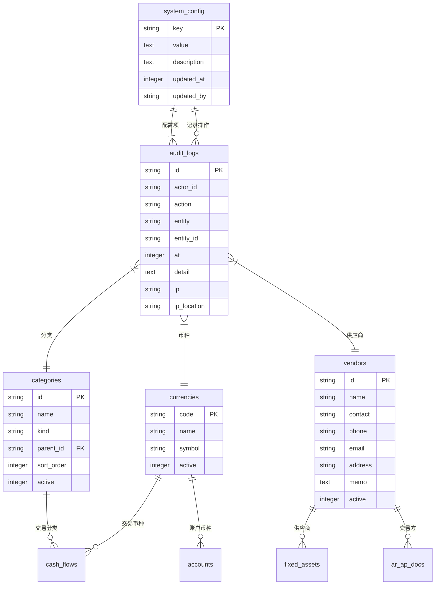

# 系统与主数据模型

<cite>
**本文档引用文件**  
- [schema.ts](file://backend/src/db/schema.ts)
- [schema.sql](file://backend/src/db/schema.sql)
- [SystemConfigService.ts](file://backend/src/services/SystemConfigService.ts)
- [system-config.ts](file://backend/src/routes/v2/system-config.ts)
- [MasterDataService.ts](file://backend/src/services/MasterDataService.ts)
- [categories.ts](file://backend/src/routes/v2/master-data/categories.ts)
- [currencies.ts](file://backend/src/routes/v2/master-data/currencies.ts)
- [vendors.ts](file://backend/src/routes/v2/master-data/vendors.ts)
- [audit.ts](file://backend/src/utils/audit.ts)
- [master-data.schema.ts](file://backend/src/schemas/master-data.schema.ts)
</cite>

## 目录
1. [系统配置表 (systemConfig)](#系统配置表-systemconfig)
2. [财务分类表 (categories)](#财务分类表-categories)
3. [币种管理表 (currencies)](#币种管理表-currencies)
4. [供应商信息表 (vendors)](#供应商信息表-vendors)
5. [审计日志表 (auditLogs)](#审计日志表-auditlogs)
6. [主数据模型关系图](#主数据模型关系图)

## 系统配置表 (systemConfig)

`system_config` 表用于存储系统级的配置信息，采用键值对（Key-Value）结构，能够灵活地管理各种全局设置。该表是系统运行的基础，支持动态更新而无需修改代码。

- **key**: 配置项的唯一标识符，作为主键，例如 `email_notification_enabled` 用于控制邮件通知功能的开关。
- **value**: 配置项的实际值，存储为文本类型。该字段支持存储字符串或JSON格式的数据，以适应复杂配置需求。
- **description**: 对配置项的描述，用于说明其用途。
- **updated_at**: 记录配置项最后一次更新的时间戳。
- **updated_by**: 记录最后一次更新该配置项的用户ID。

系统通过 `SystemConfigService` 服务类提供对配置的读写操作。当读取配置时，服务会尝试将 `value` 字段解析为JSON对象，若解析失败则返回原始字符串值。更新配置时，服务会记录操作者、更新时间和新值，并通过 `onConflictDoUpdate` 机制实现插入或更新操作。API路由 `/system-config/{key}` 提供了基于权限控制的配置更新接口，确保只有授权用户才能修改系统设置。

**Section sources**
- [schema.ts](file://backend/src/db/schema.ts#L3-L9)
- [schema.sql](file://backend/src/db/schema.sql#L107-L114)
- [SystemConfigService.ts](file://backend/src/services/SystemConfigService.ts#L1-L61)
- [system-config.ts](file://backend/src/routes/v2/system-config.ts#L1-L243)

## 财务分类表 (categories)

`categories` 表用于构建财务系统的多级分类体系，支持收入和支出两大类别的管理。该表的设计支持无限层级的分类结构，便于企业根据自身业务需求进行精细化的财务核算。

- **id**: 分类的唯一标识符，作为主键。
- **name**: 分类名称，不能为空。
- **kind**: 分类类型，值为 `income`（收入）或 `expense`（支出），用于区分分类的性质。
- **parent_id**: 父级分类的ID，用于构建树形结构。顶级分类的 `parent_id` 为 `null`。
- **sort_order**: 排序序号，用于控制同一层级分类的显示顺序。
- **active**: 状态标识，1表示启用，0表示禁用。

通过 `parent_id` 字段，系统可以递归地查询出完整的分类树。`MasterDataService` 和 `CategoryService` 服务类提供了创建、更新和删除分类的功能。前端通过 `/api/v2/master-data/categories` 接口获取分类列表，并利用缓存机制（`createQueryCache`）提升性能。创建分类时，需要指定其名称、类型和父级分类（可选），从而实现灵活的分类管理。

**Section sources**
- [schema.ts](file://backend/src/db/schema.ts#L343-L350)
- [schema.sql](file://backend/src/db/schema.sql#L342-L350)
- [MasterDataService.ts](file://backend/src/services/MasterDataService.ts#L223-L239)
- [categories.ts](file://backend/src/routes/v2/master-data/categories.ts#L1-L232)
- [master-data.schema.ts](file://backend/src/schemas/master-data.schema.ts#L74-L87)

## 币种管理表 (currencies)

`currencies` 表用于管理系统支持的所有币种，为多币种财务处理提供基础支持。

- **code**: 币种代码，作为主键，通常为3位ISO标准代码（如CNY、USD）。
- **name**: 币种名称，不能为空。
- **symbol**: 币种符号（如¥、$），可选。
- **active**: 状态标识，1表示启用，0表示禁用。

该表通过 `CurrencyService` 服务进行管理，并由 `MasterDataService` 统一对外提供接口。系统支持通过 `/api/v2/master-data/currencies` 接口进行币种的增删改查操作，并实现了批量操作功能（如批量启用、禁用或删除）。所有操作均会触发审计日志记录。前端在获取币种列表时，可以指定 `activeOnly=true` 参数来过滤仅显示启用的币种。

**Section sources**
- [schema.ts](file://backend/src/db/schema.ts#L213-L218)
- [schema.sql](file://backend/src/db/schema.sql#L148-L154)
- [MasterDataService.ts](file://backend/src/services/MasterDataService.ts#L170-L186)
- [currencies.ts](file://backend/src/routes/v2/master-data/currencies.ts#L1-L318)
- [master-data.schema.ts](file://backend/src/schemas/master-data.schema.ts#L92-L100)

## 供应商信息表 (vendors)

`vendors` 表用于存储供应商的相关信息，是应付账款（AP）等业务模块的基础数据。

- **id**: 供应商的唯一标识符，作为主键。
- **name**: 供应商名称，不能为空。
- **contact**: 联系人姓名。
- **phone**: 联系电话。
- **email**: 联系邮箱。
- **address**: 供应商地址。
- **memo**: 备注信息。
- **active**: 状态标识，1表示启用，0表示禁用。

`VendorService` 服务类提供了对供应商数据的完整CRUD操作。`MasterDataService` 将这些功能封装后通过 `/api/v2/master-data/vendors` 接口暴露给前端。用户可以对供应商进行搜索、创建、编辑和删除。删除操作会先检查该供应商是否已被引用，以保证数据完整性。所有对供应商的修改都会被记录到审计日志中。

**Section sources**
- [schema.ts](file://backend/src/db/schema.ts#L82-L93)
- [schema.sql](file://backend/src/db/schema.sql#L410-L422)
- [MasterDataService.ts](file://backend/src/services/MasterDataService.ts#L116-L154)
- [vendors.ts](file://backend/src/routes/v2/master-data/vendors.ts#L1-L260)
- [master-data.schema.ts](file://backend/src/schemas/master-data.schema.ts#L105-L117)

## 审计日志表 (auditLogs)

`audit_logs` 表是系统安全与合规性的核心组件，用于记录所有关键操作，提供完整的操作追溯能力。

- **id**: 日志记录的唯一标识符，作为主键。
- **actor_id**: 操作者（用户）的ID，标识执行操作的用户。
- **action**: 操作类型，如 `create`、`update`、`delete`、`batch` 等。
- **entity**: 操作的实体类型，如 `category`、`currency`、`vendor`、`system_config` 等。
- **entity_id**: 被操作实体的ID。
- **at**: 操作发生的时间戳。
- **detail**: 操作的详细信息，通常为JSON格式，记录操作前后的数据变化或操作参数。
- **ip**: 操作者的IP地址，通过Cloudflare的 `cf-connecting-ip` 或 `x-forwarded-for` 头部获取。
- **ip_location**: IP地址的地理位置信息，由 `cf-ipcountry` 和 `cf-ipcity` 头部信息拼接而成。

审计日志的记录由 `logAuditAction` 工具函数触发，该函数在各个业务操作的API路由中被调用。例如，当更新一个系统配置时，`system-config.ts` 中的路由处理器会调用 `logAuditAction` 来记录此次更新。日志记录被设计为异步操作，通过 `executionCtx.waitUntil()` 确保日志写入不会阻塞主业务流程。表中创建了 `idx_audit_logs_time` 索引，以优化基于时间范围的查询性能，这对于审计和故障排查至关重要。

**Section sources**
- [schema.ts](file://backend/src/db/schema.ts#L675-L692)
- [schema.sql](file://backend/src/db/schema.sql#L128-L139)
- [audit.ts](file://backend/src/utils/audit.ts#L1-L90)
- [system-config.ts](file://backend/src/routes/v2/system-config.ts#L178)
- [categories.ts](file://backend/src/routes/v2/master-data/categories.ts#L117)
- [currencies.ts](file://backend/src/routes/v2/master-data/currencies.ts#L313)
- [vendors.ts](file://backend/src/routes/v2/master-data/vendors.ts#L157)

## 主数据模型关系图

**Diagram sources**
- [schema.ts](file://backend/src/db/schema.ts#L3-L9)
- [schema.ts](file://backend/src/db/schema.ts#L343-L350)
- [schema.ts](file://backend/src/db/schema.ts#L213-L218)
- [schema.ts](file://backend/src/db/schema.ts#L82-L93)
- [schema.ts](file://backend/src/db/schema.ts#L675-L692)