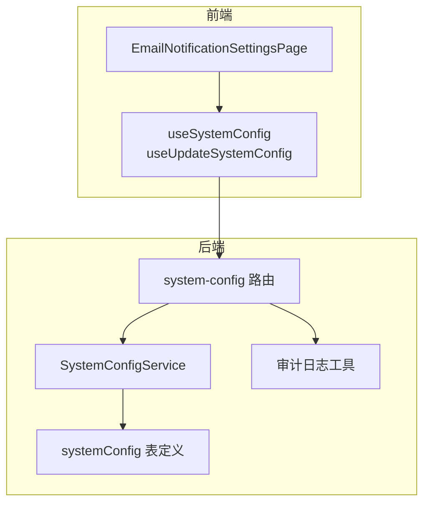
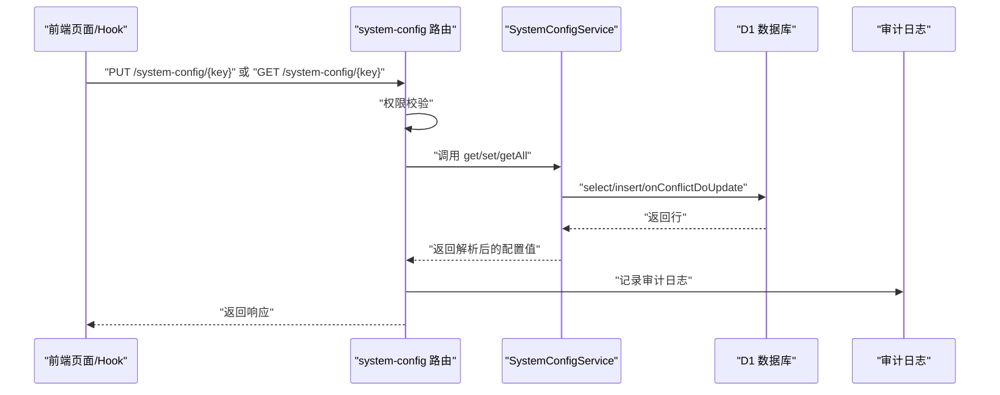
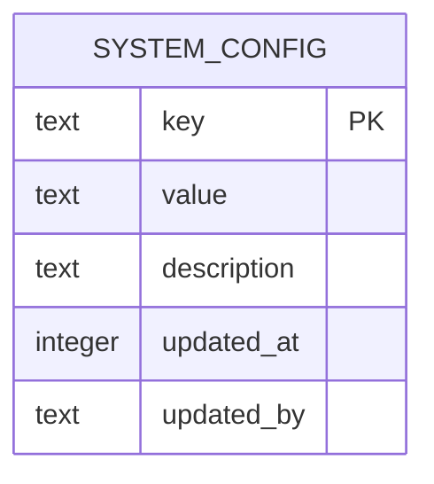
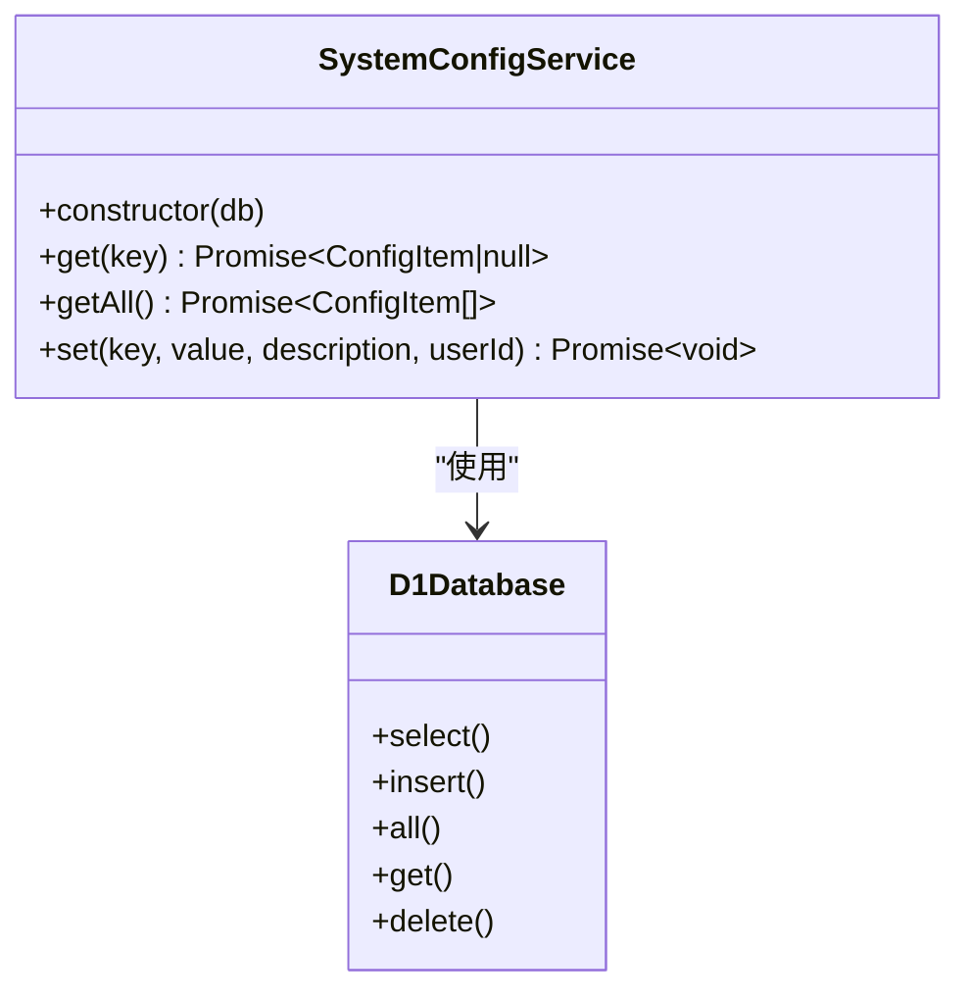
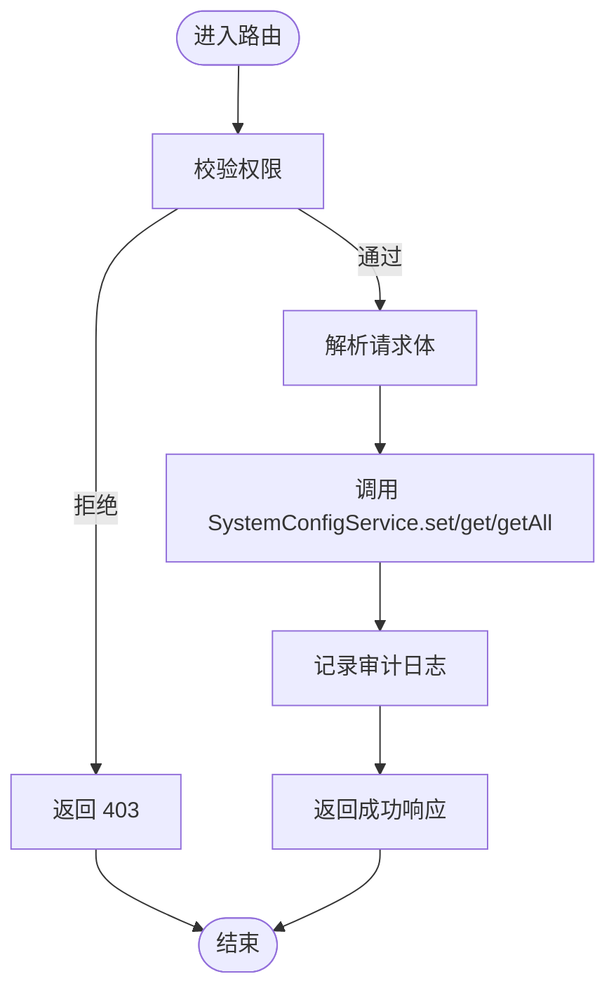
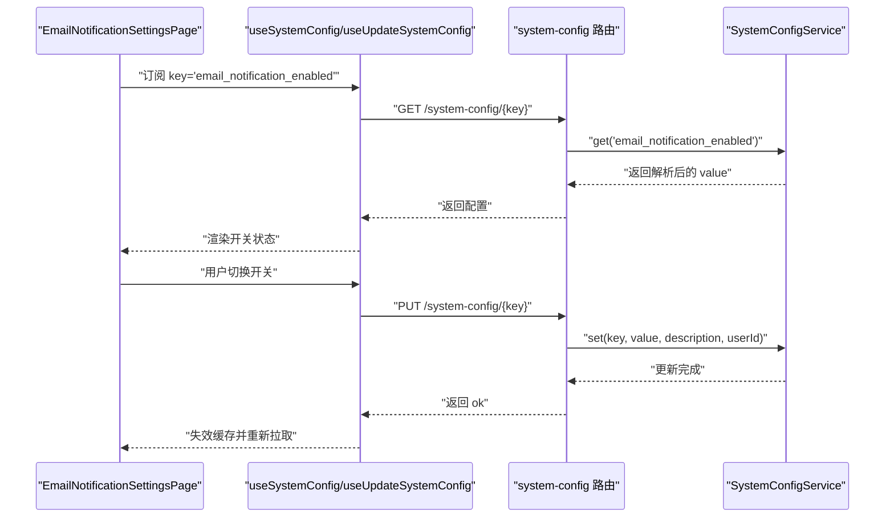
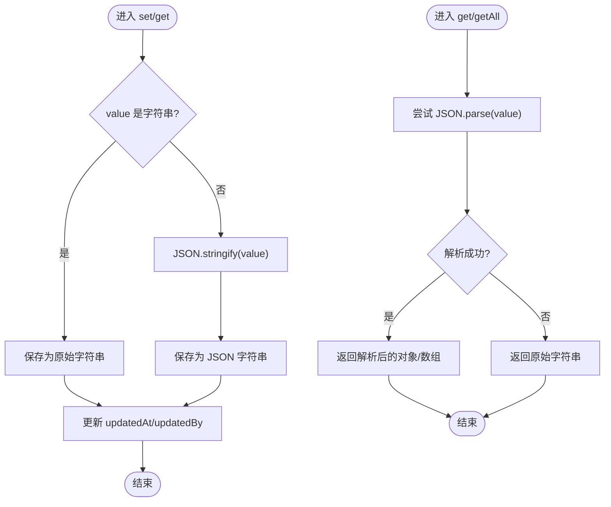
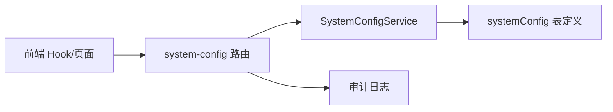

# 系统配置模型

<cite>
**本文引用的文件**
- [SystemConfigService.ts](file://backend/src/services/SystemConfigService.ts)
- [schema.ts](file://backend/src/db/schema.ts)
- [system-config.ts](file://backend/src/routes/v2/system-config.ts)
- [business.schema.ts](file://backend/src/schemas/business.schema.ts)
- [useSystemConfig.ts](file://frontend/src/hooks/business/useSystemConfig.ts)
- [EmailNotificationSettingsPage.tsx](file://frontend/src/features/system/pages/EmailNotificationSettingsPage.tsx)
- [audit.ts](file://backend/src/utils/audit.ts)
- [SystemConfigService.test.ts](file://backend/test/services/SystemConfigService.test.ts)
</cite>

## 目录
1. [简介](#简介)
2. [项目结构](#项目结构)
3. [核心组件](#核心组件)
4. [架构总览](#架构总览)
5. [详细组件分析](#详细组件分析)
6. [依赖关系分析](#依赖关系分析)
7. [性能考量](#性能考量)
8. [故障排查指南](#故障排查指南)
9. [结论](#结论)
10. [附录](#附录)

## 简介
本文件系统性梳理“系统配置模型”，围绕 systemConfig 表的结构与用途展开，重点说明：
- key 字段作为主键，唯一标识配置项；
- value 字段用于存储配置值，支持字符串与 JSON 格式；
- description 字段提供配置项描述；
- updatedAt 和 updatedBy 字段记录配置的最后更新时间与操作者，确保配置变更的可追溯性；
- 结合 SystemConfigService 的 get、getAll、set 方法，解释读取、批量获取与更新逻辑，以及 JSON 值的自动解析与序列化；
- 提供通过服务层安全操作配置数据的实践路径与示例路径。

## 项目结构
系统配置模型由三层协作实现：
- 数据层：systemConfig 表定义与 D1 存储；
- 服务层：SystemConfigService 封装 CRUD 与 JSON 解析/序列化；
- 接口层：路由系统暴露配置的查询与更新接口，并进行权限校验与审计日志记录。

图表来源
- [system-config.ts](file://backend/src/routes/v2/system-config.ts#L1-L243)
- [SystemConfigService.ts](file://backend/src/services/SystemConfigService.ts#L1-L61)
- [schema.ts](file://backend/src/db/schema.ts#L1-L12)
- [audit.ts](file://backend/src/utils/audit.ts#L1-L90)
- [useSystemConfig.ts](file://frontend/src/hooks/business/useSystemConfig.ts#L1-L41)
- [EmailNotificationSettingsPage.tsx](file://frontend/src/features/system/pages/EmailNotificationSettingsPage.tsx#L1-L76)

章节来源
- [system-config.ts](file://backend/src/routes/v2/system-config.ts#L1-L243)
- [SystemConfigService.ts](file://backend/src/services/SystemConfigService.ts#L1-L61)
- [schema.ts](file://backend/src/db/schema.ts#L1-L12)
- [useSystemConfig.ts](file://frontend/src/hooks/business/useSystemConfig.ts#L1-L41)
- [EmailNotificationSettingsPage.tsx](file://frontend/src/features/system/pages/EmailNotificationSettingsPage.tsx#L1-L76)

## 核心组件
- systemConfig 表
  - key：主键，唯一标识配置项；
  - value：文本字段，存储配置值（字符串或 JSON 字符串）；
  - description：文本字段，配置项描述；
  - updatedAt：整型时间戳，记录最后更新时间；
  - updatedBy：文本字段，记录最后更新的操作者 ID。
- SystemConfigService
  - get(key)：按 key 查询配置，若 value 为合法 JSON，则自动解析为对象/数组；
  - getAll()：查询所有配置，逐条尝试解析 JSON；
  - set(key, value, description, userId)：将 value 序列化为字符串后写入，同时更新 updatedAt 与 updatedBy；若 key 冲突则执行 onConflictDoUpdate。
- 路由层
  - 提供查询单个配置、批量查询配置、更新配置的接口；
  - 在更新时记录审计日志并进行权限校验。

章节来源
- [schema.ts](file://backend/src/db/schema.ts#L1-L12)
- [SystemConfigService.ts](file://backend/src/services/SystemConfigService.ts#L1-L61)
- [system-config.ts](file://backend/src/routes/v2/system-config.ts#L1-L243)

## 架构总览
系统配置的调用链路如下：

图表来源
- [system-config.ts](file://backend/src/routes/v2/system-config.ts#L1-L243)
- [SystemConfigService.ts](file://backend/src/services/SystemConfigService.ts#L1-L61)
- [audit.ts](file://backend/src/utils/audit.ts#L1-L90)

## 详细组件分析

### 数据模型：systemConfig 表
- 主键约束：key 为主键，保证每个配置项唯一；
- 值存储策略：value 以字符串形式存储，支持纯字符串与 JSON 字符串；
- 追溯字段：updatedAt 与 updatedBy 记录变更时间与操作者；
- 业务意义：统一管理全局开关、参数、策略等系统级配置。

图表来源
- [schema.ts](file://backend/src/db/schema.ts#L1-L12)

章节来源
- [schema.ts](file://backend/src/db/schema.ts#L1-L12)

### 服务层：SystemConfigService
- get(key)
  - 读取单条配置；
  - 若 value 是合法 JSON 字符串，则解析为对象/数组返回；
  - 非 JSON 字符串保持原样返回；
  - 未找到返回 null。
- getAll()
  - 读取全部配置；
  - 对每条记录尝试解析 JSON，解析失败则返回原始字符串。
- set(key, value, description, userId)
  - 将 value 序列化为字符串（字符串保持原样，对象/数组转 JSON）；
  - 写入 updatedAt 为当前毫秒时间戳，updatedBy 为传入用户 ID；
  - 使用 onConflictDoUpdate 按 key 冲突更新，确保幂等。

图表来源
- [SystemConfigService.ts](file://backend/src/services/SystemConfigService.ts#L1-L61)

章节来源
- [SystemConfigService.ts](file://backend/src/services/SystemConfigService.ts#L1-L61)

### 接口层：system-config 路由
- 权限控制：对“查看”和“更新”两类操作分别进行权限校验；
- 单个配置查询：返回 key、value、description；
- 批量配置查询：返回一个键值映射；
- 更新配置：接收 value 与 description，调用服务层 set 并记录审计日志；
- 错误处理：对缺失 key、权限不足、资源不存在等情况返回相应错误码。

图表来源
- [system-config.ts](file://backend/src/routes/v2/system-config.ts#L1-L243)
- [audit.ts](file://backend/src/utils/audit.ts#L1-L90)

章节来源
- [system-config.ts](file://backend/src/routes/v2/system-config.ts#L1-L243)
- [business.schema.ts](file://backend/src/schemas/business.schema.ts#L593-L600)

### 前端集成：useSystemConfig 与页面
- useSystemConfig(key)：基于 React Query 查询单个配置，带 5 分钟缓存；
- useUpdateSystemConfig()：提交更新，成功后失效对应查询缓存；
- EmailNotificationSettingsPage 页面：以开关形式展示 email_notification_enabled 配置，支持即时切换。

图表来源
- [useSystemConfig.ts](file://frontend/src/hooks/business/useSystemConfig.ts#L1-L41)
- [EmailNotificationSettingsPage.tsx](file://frontend/src/features/system/pages/EmailNotificationSettingsPage.tsx#L1-L76)
- [system-config.ts](file://backend/src/routes/v2/system-config.ts#L1-L243)
- [SystemConfigService.ts](file://backend/src/services/SystemConfigService.ts#L1-L61)

章节来源
- [useSystemConfig.ts](file://frontend/src/hooks/business/useSystemConfig.ts#L1-L41)
- [EmailNotificationSettingsPage.tsx](file://frontend/src/features/system/pages/EmailNotificationSettingsPage.tsx#L1-L76)

### JSON 值解析与序列化的流程
- 写入流程（set）：非字符串值会被 JSON.stringify 序列化为字符串；字符串保持原样；同时更新 updatedAt 与 updatedBy。
- 读取流程（get/getAll）：尝试对 value 进行 JSON.parse；解析失败则回退为原始字符串。

图表来源
- [SystemConfigService.ts](file://backend/src/services/SystemConfigService.ts#L1-L61)

章节来源
- [SystemConfigService.ts](file://backend/src/services/SystemConfigService.ts#L1-L61)

## 依赖关系分析
- SystemConfigService 依赖 D1 数据库与 systemConfig 表定义；
- 路由层依赖 SystemConfigService 与权限校验工具；
- 审计日志工具在更新配置时被调用，记录操作者、实体与详情；
- 前端通过自定义 Hook 与页面组件消费配置数据。

图表来源
- [system-config.ts](file://backend/src/routes/v2/system-config.ts#L1-L243)
- [SystemConfigService.ts](file://backend/src/services/SystemConfigService.ts#L1-L61)
- [schema.ts](file://backend/src/db/schema.ts#L1-L12)
- [audit.ts](file://backend/src/utils/audit.ts#L1-L90)
- [useSystemConfig.ts](file://frontend/src/hooks/business/useSystemConfig.ts#L1-L41)

章节来源
- [system-config.ts](file://backend/src/routes/v2/system-config.ts#L1-L243)
- [SystemConfigService.ts](file://backend/src/services/SystemConfigService.ts#L1-L61)
- [audit.ts](file://backend/src/utils/audit.ts#L1-L90)

## 性能考量
- JSON 解析开销：get/getAll 对每条记录进行 try/catch JSON.parse，复杂 JSON 会带来额外 CPU 开销；建议：
  - 控制 value 的复杂度与体积；
  - 对频繁读取的配置采用本地缓存（前端已内置 5 分钟缓存）；
  - 大型配置建议拆分或分组，减少单次传输与解析成本。
- 写入幂等：set 使用 onConflictDoUpdate，避免重复插入；建议：
  - 仅在必要时更新 description，减少不必要的字段变更；
  - 批量更新时合并请求，降低往返次数。
- 审计日志异步：审计日志通过 waitUntil 异步记录，避免阻塞主流程，但需关注日志系统的吞吐能力。

## 故障排查指南
- 配置读取为字符串而非对象
  - 现象：get 返回的 value 为字符串，不是期望的对象/数组；
  - 原因：value 为非 JSON 字符串或 JSON.parse 失败；
  - 处理：确认写入时是否传入了非字符串值；若确需对象，请确保写入前为合法 JSON。
- 配置更新未生效
  - 现象：调用更新接口后，读取仍为旧值；
  - 原因：前端缓存未失效或权限不足导致未写入；
  - 处理：确认权限校验通过；调用更新后触发查询失效；检查 updatedBy 与 updatedAt 是否更新。
- 审计日志缺失
  - 现象：更新后未产生审计记录；
  - 原因：缺少 userId 或审计服务未注入；
  - 处理：确保请求上下文包含 userId；确认审计服务可用。

章节来源
- [SystemConfigService.ts](file://backend/src/services/SystemConfigService.ts#L1-L61)
- [system-config.ts](file://backend/src/routes/v2/system-config.ts#L1-L243)
- [audit.ts](file://backend/src/utils/audit.ts#L1-L90)
- [SystemConfigService.test.ts](file://backend/test/services/SystemConfigService.test.ts#L1-L95)

## 结论
systemConfig 表为系统级配置的核心载体，通过 key 唯一标识、value 支持字符串与 JSON、updatedAt/updatedBy 提供可追溯的变更记录，配合 SystemConfigService 的读写封装与路由层的权限与审计机制，实现了安全、可控、可观测的配置管理。前端通过 Hook 与页面组件实现即插即用的配置开关与参数管理，整体设计简洁、扩展性强。

## 附录
- 实际代码示例路径（不展示具体代码内容）
  - 读取单个配置：[get(key)](file://backend/src/services/SystemConfigService.ts#L9-L21)
  - 批量读取配置：[getAll()](file://backend/src/services/SystemConfigService.ts#L23-L35)
  - 更新配置并记录审计：[set(key, value, description, userId)](file://backend/src/services/SystemConfigService.ts#L37-L59)，[路由更新接口](file://backend/src/routes/v2/system-config.ts#L160-L181)，[审计日志记录](file://backend/src/routes/v2/system-config.ts#L176-L179)，[审计工具](file://backend/src/utils/audit.ts#L1-L90)
  - 前端查询与更新：[useSystemConfig(key)](file://frontend/src/hooks/business/useSystemConfig.ts#L16-L24)，[useUpdateSystemConfig()](file://frontend/src/hooks/business/useSystemConfig.ts#L29-L40)，[EmailNotificationSettingsPage](file://frontend/src/features/system/pages/EmailNotificationSettingsPage.tsx#L1-L76)
  - 表结构定义：[systemConfig 表](file://backend/src/db/schema.ts#L1-L12)
  - 验证模式：[updateSystemConfigSchema](file://backend/src/schemas/business.schema.ts#L593-L600)