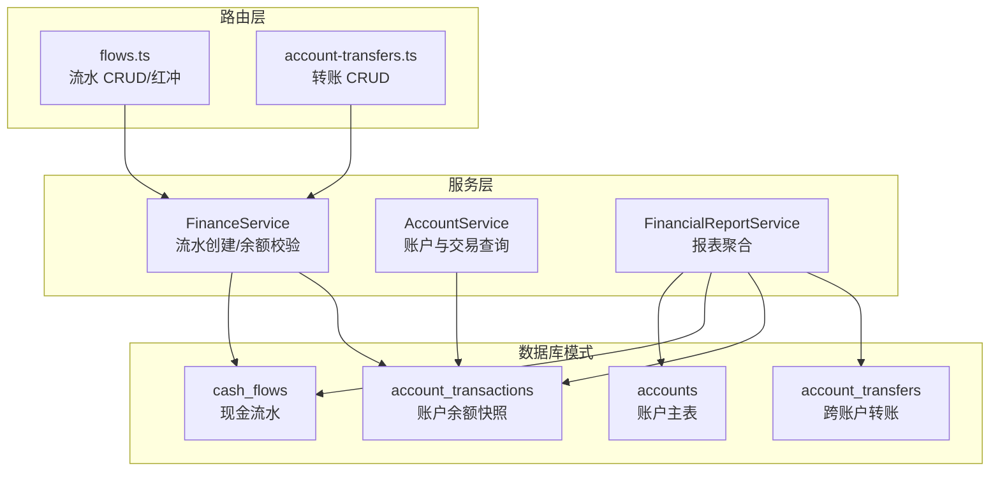
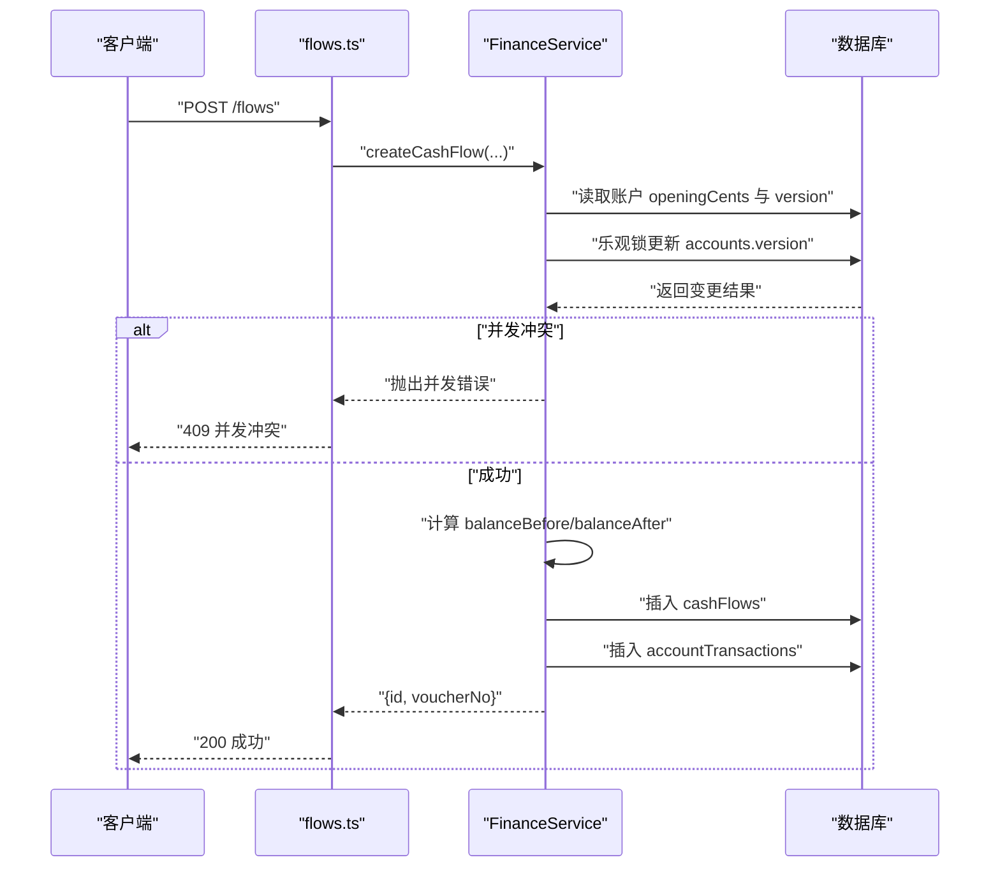
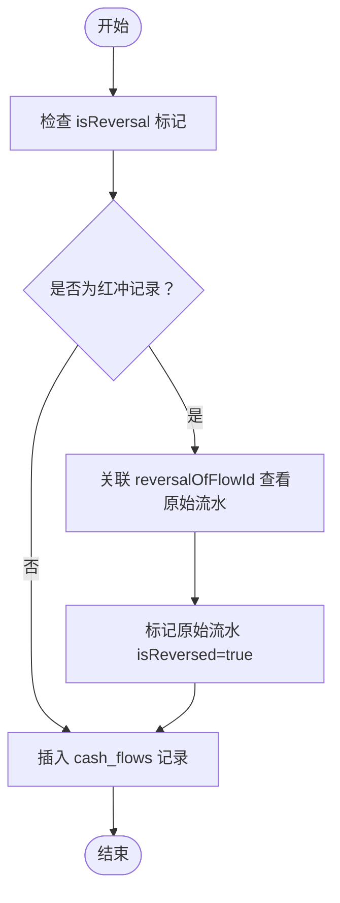
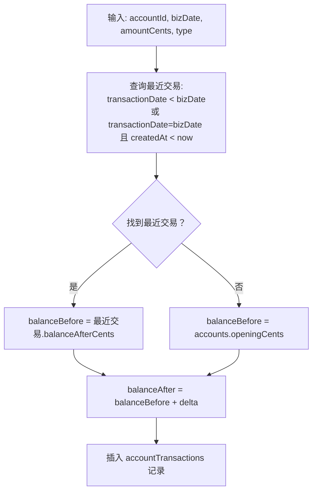
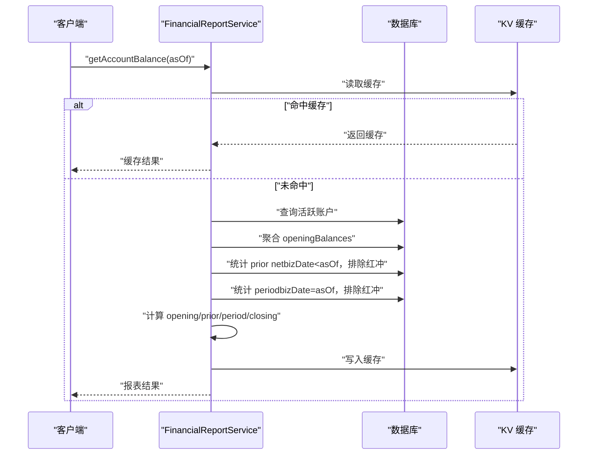
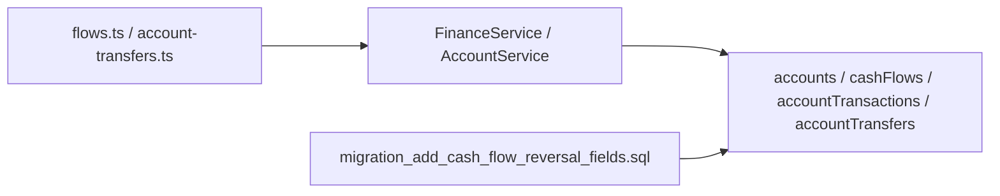
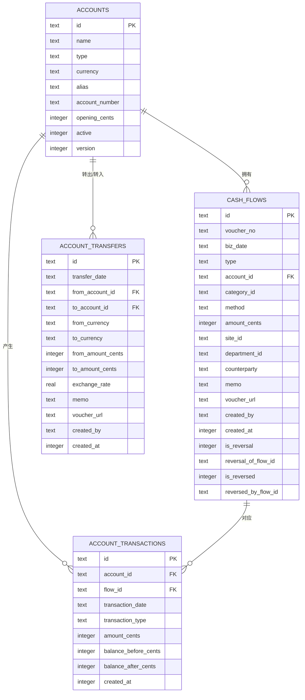

# 财务数据模型

<cite>
**本文引用的文件**
- [schema.ts](file://backend/src/db/schema.ts)
- [schema.sql](file://backend/src/db/schema.sql)
- [migration_add_cash_flow_reversal_fields.sql](file://backend/src/db/migration_add_cash_flow_reversal_fields.sql)
- [flows.ts](file://backend/src/routes/v2/flows.ts)
- [account-transfers.ts](file://backend/src/routes/v2/account-transfers.ts)
- [AccountService.ts](file://backend/src/services/AccountService.ts)
- [FinanceService.ts](file://backend/src/services/FinanceService.ts)
- [FinancialReportService.ts](file://backend/src/services/FinancialReportService.ts)
</cite>

## 目录
1. [简介](#简介)
2. [项目结构](#项目结构)
3. [核心组件](#核心组件)
4. [架构总览](#架构总览)
5. [详细组件分析](#详细组件分析)
6. [依赖分析](#依赖分析)
7. [性能考量](#性能考量)
8. [故障排查指南](#故障排查指南)
9. [结论](#结论)
10. [附录](#附录)

## 简介
本文件系统性梳理财务数据模型，聚焦以下核心表：
- accounts：账户主表，记录账户类型、币种与乐观锁版本
- cashFlows：现金流水表，记录业务日期、收支类型、金额、凭证与红冲机制
- accountTransactions：账户余额时序快照表，按交易日期与创建时间维护余额前后值
- accountTransfers：跨账户转账表，记录转出/转入币种、金额与汇率

同时结合 FinancialReportService 中的 SQL 查询，说明如何基于上述表生成财务报表，并通过 ER 图展示账户、流水、转账之间的关系。

## 项目结构
财务数据模型由数据库模式定义与服务层查询组成：
- 数据库模式定义：schema.ts（Drizzle ORM 定义）与 schema.sql（SQLite 原生建表语句）
- 业务路由与服务：flows.ts（流水 CRUD 与红冲）、account-transfers.ts（转账 CRUD）、AccountService.ts（账户与交易查询）、FinanceService.ts（流水创建与余额校验）、FinancialReportService.ts（报表聚合）
- 迁移脚本：migration_add_cash_flow_reversal_fields.sql（新增红冲字段与索引）

图表来源
- [schema.ts](file://backend/src/db/schema.ts#L139-L206)
- [schema.sql](file://backend/src/db/schema.sql#L173-L216)
- [schema.sql](file://backend/src/db/schema.sql#L424-L439)
- [flows.ts](file://backend/src/routes/v2/flows.ts#L327-L566)
- [account-transfers.ts](file://backend/src/routes/v2/account-transfers.ts#L1-L235)
- [AccountService.ts](file://backend/src/services/AccountService.ts#L46-L82)
- [FinanceService.ts](file://backend/src/services/FinanceService.ts#L70-L229)
- [FinancialReportService.ts](file://backend/src/services/FinancialReportService.ts#L165-L274)

章节来源
- [schema.ts](file://backend/src/db/schema.ts#L139-L206)
- [schema.sql](file://backend/src/db/schema.sql#L173-L216)
- [schema.sql](file://backend/src/db/schema.sql#L424-L439)
- [flows.ts](file://backend/src/routes/v2/flows.ts#L327-L566)
- [account-transfers.ts](file://backend/src/routes/v2/account-transfers.ts#L1-L235)
- [AccountService.ts](file://backend/src/services/AccountService.ts#L46-L82)
- [FinanceService.ts](file://backend/src/services/FinanceService.ts#L70-L229)
- [FinancialReportService.ts](file://backend/src/services/FinancialReportService.ts#L165-L274)

## 核心组件
- accounts（账户主表）
  - 关键字段：id、name、type（账户类型）、currency（币种）、alias、accountNumber、openingCents（期初分）、active、version（乐观锁版本）
  - 设计要点：version 字段用于乐观锁；余额不持久化到 accounts，通过 accountTransactions 计算
- cashFlows（现金流水）
  - 关键字段：id、voucherNo、bizDate（业务日期）、type（income/expense）、accountId、categoryId、method、amountCents、siteId、departmentId、counterparty、memo、voucherUrl、createdBy、createdAt
  - 红冲机制：isReversal（是否为红冲记录）、reversalOfFlowId（冲正的原始流水ID）、isReversed（是否已被冲正）、reversedByFlowId（冲正记录ID）
  - 索引策略：idxAccountBiz（accountId, bizDate）、idxType（type）、idxReversal（reversalOfFlowId）
- accountTransactions（账户余额快照）
  - 关键字段：id、accountId、flowId、transactionDate、transactionType、amountCents、balanceBeforeCents、balanceAfterCents、createdAt
  - 索引策略：idxAccountDate（accountId, transactionDate）
- accountTransfers（跨账户转账）
  - 关键字段：id、transferDate、fromAccountId、toAccountId、fromCurrency、toCurrency、fromAmountCents、toAmountCents、exchangeRate、memo、voucherUrl、createdBy、createdAt
  - 设计要点：exchangeRate 采用 REAL 存储，便于汇率精度；转账金额以分存储

章节来源
- [schema.ts](file://backend/src/db/schema.ts#L139-L206)
- [schema.sql](file://backend/src/db/schema.sql#L173-L216)
- [schema.sql](file://backend/src/db/schema.sql#L424-L439)
- [migration_add_cash_flow_reversal_fields.sql](file://backend/src/db/migration_add_cash_flow_reversal_fields.sql#L1-L18)

## 架构总览
财务数据模型围绕“账户—流水—转账”三张核心表构建，配合服务层完成：
- 流水创建：FinanceService 在事务中执行余额校验与账户版本乐观锁，再插入 cashFlows 与 accountTransactions
- 余额查询：AccountService 通过 accountTransactions 与 cashFlows 联合查询账户交易明细
- 报表生成：FinancialReportService 基于 accounts、cashFlows、openingBalances 与 KV 缓存生成账户余额报表

图表来源
- [flows.ts](file://backend/src/routes/v2/flows.ts#L327-L566)
- [FinanceService.ts](file://backend/src/services/FinanceService.ts#L70-L229)

## 详细组件分析

### accounts 表：账户类型、币种与乐观锁
- 账户类型（type）与币种（currency）用于区分资产/负债/收入/成本等分类与记账币种
- 乐观锁（version）用于防止并发修改账户状态导致的数据竞争
- 余额不直接存储在 accounts，而是通过 accountTransactions 的余额快照计算得出

章节来源
- [schema.ts](file://backend/src/db/schema.ts#L139-L149)
- [schema.sql](file://backend/src/db/schema.sql#L173-L184)
- [FinanceService.ts](file://backend/src/services/FinanceService.ts#L146-L166)

### cashFlows 表：财务流水与红冲机制
- 业务日期（bizDate）与收支类型（type）构成报表统计的关键维度
- 金额以“分”存储（amountCents），统一货币单位便于计算
- 红冲机制：
  - isReversal：标记该条流水是否为红冲
  - reversalOfFlowId：指向被冲正的原始流水
  - isReversed：标记原始流水是否已被冲正
  - reversedByFlowId：指向冲正流水
- 索引策略：
  - idxAccountBiz：加速按账户+业务日期的查询
  - idxType：加速按流水类型的查询
  - idxReversal：加速按冲正关联的查询

图表来源
- [schema.ts](file://backend/src/db/schema.ts#L159-L188)
- [schema.sql](file://backend/src/db/schema.sql#L187-L203)
- [migration_add_cash_flow_reversal_fields.sql](file://backend/src/db/migration_add_cash_flow_reversal_fields.sql#L1-L18)

章节来源
- [schema.ts](file://backend/src/db/schema.ts#L159-L188)
- [schema.sql](file://backend/src/db/schema.sql#L187-L203)
- [migration_add_cash_flow_reversal_fields.sql](file://backend/src/db/migration_add_cash_flow_reversal_fields.sql#L1-L18)

### accountTransactions 表：账户余额时序记录
- 通过“交易日期 + 创建时间”排序，定位某时刻前的最后一条交易，从而得到“余额前值”
- 插入时计算 balanceBeforeCents 与 balanceAfterCents，形成连续的时间序列快照
- 该表是余额计算与明细查询的基础

图表来源
- [FinanceService.ts](file://backend/src/services/FinanceService.ts#L41-L68)
- [FinanceService.ts](file://backend/src/services/FinanceService.ts#L172-L190)
- [schema.ts](file://backend/src/db/schema.ts#L190-L206)

章节来源
- [FinanceService.ts](file://backend/src/services/FinanceService.ts#L41-L68)
- [FinanceService.ts](file://backend/src/services/FinanceService.ts#L172-L190)
- [schema.ts](file://backend/src/db/schema.ts#L190-L206)

### accountTransfers 表：跨账户转账与汇率
- 转账金额以“分”存储，避免浮点误差
- exchangeRate 采用 REAL 类型，便于汇率精度；前端传入数值，服务端按约定计算 toAmountCents
- 支持按 fromAccountId、toAccountId、transferDate 进行查询筛选

章节来源
- [schema.ts](file://backend/src/db/schema.ts#L448-L476)
- [schema.sql](file://backend/src/db/schema.sql#L424-L439)
- [account-transfers.ts](file://backend/src/routes/v2/account-transfers.ts#L1-L235)

### FinancialReportService：基于表的报表生成
- 账户余额报表（getAccountBalance）：
  - 读取活跃账户清单
  - 聚合 openingBalances（期初余额）
  - 统计 bizDate < asOf 的净流入/流出（排除 isReversal=1 的记录）
  - 统计 bizDate = asOf 的当日收入/支出
  - 计算 opening + prior_net + income - expense 得到期末余额
  - 结果写入 KV 缓存，键名包含 asOf
- 费用汇总/明细：
  - 通过 cashFlows 与 categories、accounts、departments、sites 左联接，按类别/部门等维度聚合
- 借款汇总/明细：
  - 通过 borrowings、repayments 与 employees 左联接，按用户维度统计

图表来源
- [FinancialReportService.ts](file://backend/src/services/FinancialReportService.ts#L165-L274)

章节来源
- [FinancialReportService.ts](file://backend/src/services/FinancialReportService.ts#L165-L274)

## 依赖分析
- 路由层依赖服务层：
  - flows.ts 依赖 FinanceService 完成流水创建与红冲
  - account-transfers.ts 依赖 AccountTransferService 完成转账创建与查询
- 服务层依赖数据库模式：
  - FinanceService/AccountService/FinancialReportService 依赖 accounts、cashFlows、accountTransactions、accountTransfers 等表
- 数据库模式依赖迁移脚本：
  - migration_add_cash_flow_reversal_fields.sql 为 cash_flows 表添加红冲相关字段与索引

图表来源
- [flows.ts](file://backend/src/routes/v2/flows.ts#L327-L566)
- [account-transfers.ts](file://backend/src/routes/v2/account-transfers.ts#L1-L235)
- [FinanceService.ts](file://backend/src/services/FinanceService.ts#L70-L229)
- [AccountService.ts](file://backend/src/services/AccountService.ts#L46-L82)
- [FinancialReportService.ts](file://backend/src/services/FinancialReportService.ts#L165-L274)
- [migration_add_cash_flow_reversal_fields.sql](file://backend/src/db/migration_add_cash_flow_reversal_fields.sql#L1-L18)

章节来源
- [flows.ts](file://backend/src/routes/v2/flows.ts#L327-L566)
- [account-transfers.ts](file://backend/src/routes/v2/account-transfers.ts#L1-L235)
- [FinanceService.ts](file://backend/src/services/FinanceService.ts#L70-L229)
- [AccountService.ts](file://backend/src/services/AccountService.ts#L46-L82)
- [FinancialReportService.ts](file://backend/src/services/FinancialReportService.ts#L165-L274)
- [migration_add_cash_flow_reversal_fields.sql](file://backend/src/db/migration_add_cash_flow_reversal_fields.sql#L1-L18)

## 性能考量
- 索引策略
  - cash_flows.idxAccountBiz(accountId, bizDate)：加速按账户与业务日期的流水查询
  - cash_flows.idxType(type)：加速按流水类型的统计
  - cash_flows.idxReversal(reversalOfFlowId)：加速红冲关联查询
  - account_transactions.idxAccountDate(accountId, transactionDate)：加速按账户与交易日期的余额快照查询
- 报表缓存
  - FinancialReportService 对账户余额报表结果进行 KV 缓存，减少重复聚合开销
- 金额单位统一
  - 所有金额以“分”存储，避免浮点运算误差，提升统计准确性

章节来源
- [schema.ts](file://backend/src/db/schema.ts#L183-L206)
- [schema.sql](file://backend/src/db/schema.sql#L313-L330)
- [FinancialReportService.ts](file://backend/src/services/FinancialReportService.ts#L165-L274)

## 故障排查指南
- 并发创建流水失败
  - 现象：创建流水时报“账户状态已变更（并发冲突）”
  - 原因：accounts.version 乐观锁更新失败，说明同一账户存在并发写入
  - 处理：重试请求，或在调用侧增加幂等与重试逻辑
  - 参考实现：FinanceService 在创建流水时对 accounts.version 执行乐观锁更新
- 余额不足
  - 现象：创建支出流水时报“账户余额不足”
  - 原因：balanceBefore < amountCents
  - 处理：检查账户余额快照与历史流水，确认是否存在未结算或红冲影响
  - 参考实现：FinanceService 在创建流水前计算 balanceBefore 并进行校验
- 红冲与冲正
  - 现象：报表中出现负数或异常波动
  - 原因：未正确排除 isReversal=1 的记录或未标记 isReversed/reversedByFlowId
  - 处理：确认红冲流水字段完整，报表查询时过滤 isReversal=0
  - 参考实现：FinancialReportService 在统计期间内排除 isReversal=1 的流水

章节来源
- [FinanceService.ts](file://backend/src/services/FinanceService.ts#L146-L166)
- [FinanceService.ts](file://backend/src/services/FinanceService.ts#L172-L186)
- [FinancialReportService.ts](file://backend/src/services/FinancialReportService.ts#L210-L238)
- [migration_add_cash_flow_reversal_fields.sql](file://backend/src/db/migration_add_cash_flow_reversal_fields.sql#L1-L18)

## 结论
本财务数据模型通过 accounts、cashFlows、accountTransactions、accountTransfers 四张核心表，实现了：
- 明确的账户类型与币种管理
- 严谨的流水与余额时序快照
- 完备的红冲机制与索引优化
- 高效的报表聚合与缓存策略

配合服务层的并发控制与余额校验，能够稳定支撑日常财务记账与报表生成需求。

## 附录

### ER 图：账户、流水、转账关系

图表来源
- [schema.ts](file://backend/src/db/schema.ts#L139-L206)
- [schema.sql](file://backend/src/db/schema.sql#L173-L216)
- [schema.sql](file://backend/src/db/schema.sql#L424-L439)