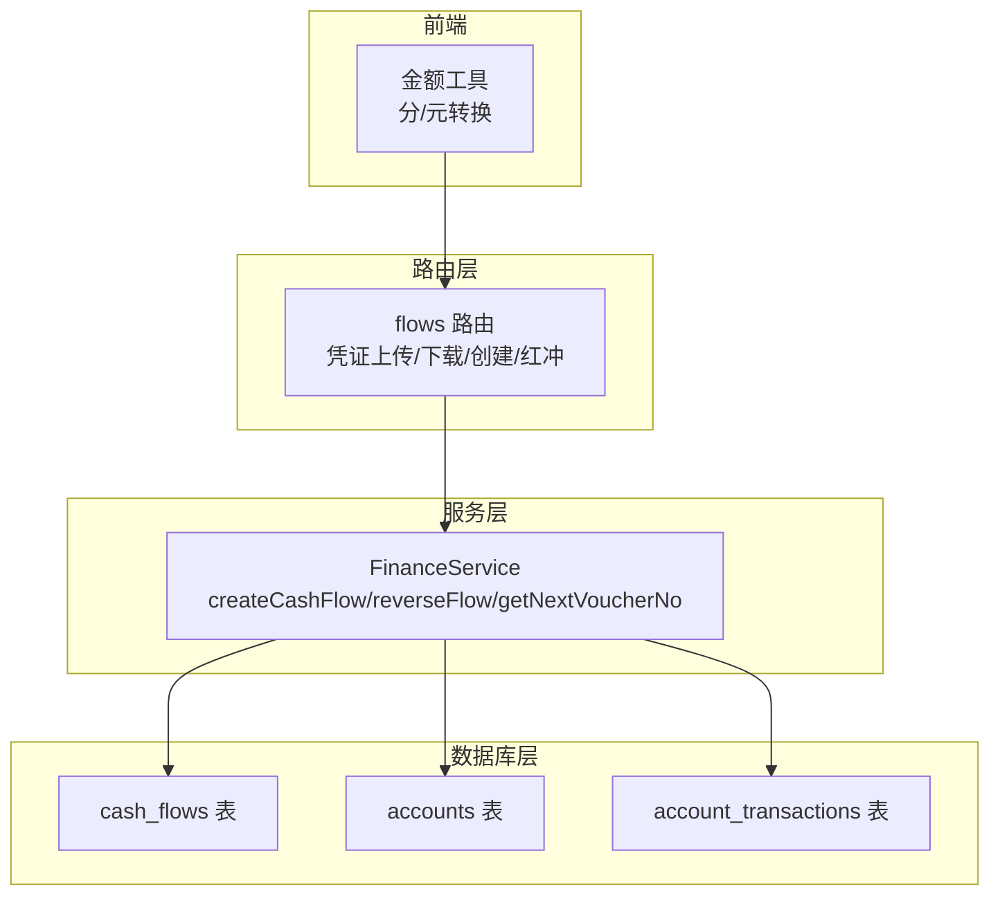
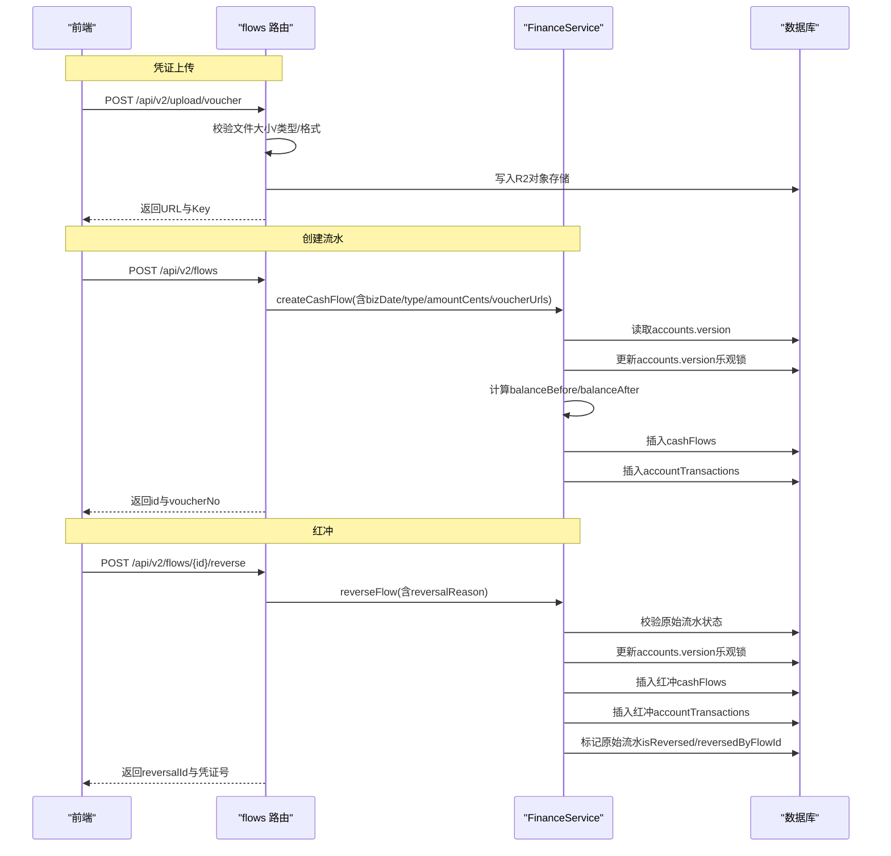
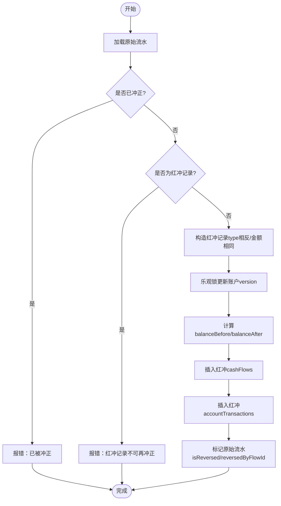
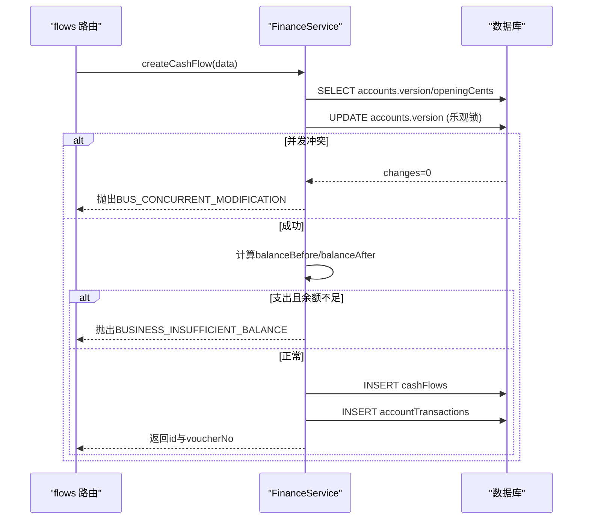
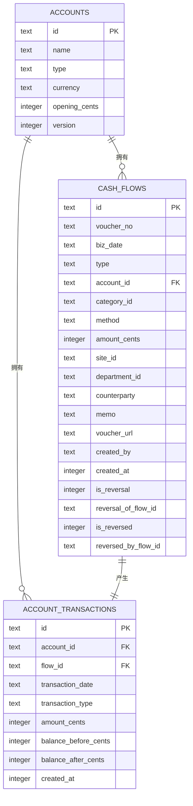

# 财务流水

<cite>
**本文引用的文件**
- [schema.ts](file://backend/src/db/schema.ts)
- [schema.sql](file://backend/src/db/schema.sql)
- [FinanceService.ts](file://backend/src/services/FinanceService.ts)
- [flows.ts](file://backend/src/routes/v2/flows.ts)
- [business.schema.ts](file://backend/src/schemas/business.schema.ts)
- [migration_add_cash_flow_reversal_fields.sql](file://backend/src/db/migration_add_cash_flow_reversal_fields.sql)
- [optimistic-lock.ts](file://backend/src/utils/optimistic-lock.ts)
- [amount.ts](file://frontend/src/utils/amount.ts)
</cite>

## 目录
1. [简介](#简介)
2. [项目结构](#项目结构)
3. [核心组件](#核心组件)
4. [架构总览](#架构总览)
5. [详细组件分析](#详细组件分析)
6. [依赖关系分析](#依赖关系分析)
7. [性能考量](#性能考量)
8. [故障排查指南](#故障排查指南)
9. [结论](#结论)

## 简介
本文件聚焦“财务流水”数据模型，系统性解析 cashFlows 表的结构、字段语义与业务逻辑，并围绕以下主题展开：
- bizDate（业务日期）与 createdAt（创建时间）的差异与用途
- amountCents（金额，单位为分）的设计原则与前端展示
- 红冲机制：isReversal、reversalOfFlowId、isReversed、reversedByFlowId 的协同工作
- FinanceService 中 createCashFlow 的实现要点，以及通过 accounts.version 字段实现的乐观锁，如何避免并发修改导致的余额不一致
- API 路由中凭证（voucherUrl）的上传与验证流程

## 项目结构
财务流水相关的核心代码分布在数据库 schema、服务层、路由层与前端工具函数中：
- 数据层：cashFlows、accounts、accountTransactions 等表定义
- 服务层：FinanceService 提供凭证号生成、流水创建、余额校验、红冲等能力
- 路由层：flows 路由提供凭证上传、下载、流水创建、红冲等接口
- 前端：金额工具函数统一处理分与元的转换

图表来源
- [schema.ts](file://backend/src/db/schema.ts#L159-L206)
- [FinanceService.ts](file://backend/src/services/FinanceService.ts#L70-L229)
- [flows.ts](file://backend/src/routes/v2/flows.ts#L207-L325)

章节来源
- [schema.ts](file://backend/src/db/schema.ts#L159-L206)
- [schema.sql](file://backend/src/db/schema.sql#L186-L216)
- [FinanceService.ts](file://backend/src/services/FinanceService.ts#L70-L229)
- [flows.ts](file://backend/src/routes/v2/flows.ts#L207-L325)

## 核心组件
- cashFlows 表：存储每笔资金变动的明细，含业务日期、类型、金额、凭证、归属部门/站点、摘要、创建人与时间，以及红冲相关字段
- accounts 表：账户基础信息与版本号，用于乐观锁
- accountTransactions 表：账户交易历史，记录每笔流水的余额前后值
- FinanceService：业务核心，负责凭证号生成、余额校验、流水创建、红冲与事务一致性
- flows 路由：对外暴露凭证上传/下载、流水创建、红冲等 API

章节来源
- [schema.ts](file://backend/src/db/schema.ts#L159-L206)
- [FinanceService.ts](file://backend/src/services/FinanceService.ts#L70-L229)
- [flows.ts](file://backend/src/routes/v2/flows.ts#L207-L325)

## 架构总览
下图展示了凭证上传、流水创建与红冲的关键调用链路与数据流转。

图表来源
- [flows.ts](file://backend/src/routes/v2/flows.ts#L207-L325)
- [FinanceService.ts](file://backend/src/services/FinanceService.ts#L70-L229)
- [FinanceService.ts](file://backend/src/services/FinanceService.ts#L285-L437)

## 详细组件分析

### cashFlows 表结构与字段语义
- 主键与标识
  - id：流水唯一标识
  - voucherNo：凭证号，用于审计与归档
- 业务与归属
  - bizDate：业务发生日期（YYYY-MM-DD），用于按业务日期统计与对账
  - type：流水类型，income 或 expense
  - accountId：账户ID
  - categoryId/siteId/departmentId：分类、站点、部门归属
  - counterparty/memo：交易对手与摘要
- 金额与凭证
  - amountCents：金额（分），统一计量单位便于精确计算与比较
  - voucherUrl：凭证URL（JSON数组或字符串兼容），支持多张凭证
- 时间与创建
  - createdAt：记录创建时间戳
  - createdBy：创建人
- 红冲相关
  - isReversal：是否为红冲记录（0/1）
  - reversalOfFlowId：冲正的原始流水ID
  - isReversed：是否已被冲正（0/1）
  - reversedByFlowId：冲正记录ID

章节来源
- [schema.ts](file://backend/src/db/schema.ts#L159-L206)
- [schema.sql](file://backend/src/db/schema.sql#L186-L216)
- [migration_add_cash_flow_reversal_fields.sql](file://backend/src/db/migration_add_cash_flow_reversal_fields.sql#L1-L18)

### bizDate 与 createdAt 的区别与用途
- bizDate（业务日期）
  - 语义：业务实际发生的时间，决定流水的会计期间与对账周期
  - 索引：表级索引，便于按业务日期快速检索
- createdAt（创建时间）
  - 语义：流水记录在系统中的创建时间戳，用于排序与审计
  - 用途：列表默认按 bizDate、createdAt 降序排列，保证业务日期相近的记录按创建先后展示

章节来源
- [schema.ts](file://backend/src/db/schema.ts#L159-L206)
- [FinanceService.ts](file://backend/src/services/FinanceService.ts#L241-L268)

### amountCents 的设计原理
- 统一使用“分”作为最小货币单位，避免浮点误差
- 前端工具函数提供分/元转换与格式化，确保展示与输入一致
- 服务层与数据库均以整数存储，保证跨模块一致性

章节来源
- [schema.ts](file://backend/src/db/schema.ts#L159-L206)
- [amount.ts](file://frontend/src/utils/amount.ts#L1-L104)

### 红冲机制：isReversal、reversalOfFlowId、isReversed、reversedByFlowId
- 协作流程
  - 原始流水：type 为 income 或 expense，amountCents 为正值
  - 红冲记录：type 与原始相反，amountCents 相同，memo 包含原凭证号与冲正原因
  - 关联字段：
    - isReversal=1 标记为红冲记录
    - reversalOfFlowId 指向原始流水ID
    - isReversed=1 标记原始流水已被冲正
    - reversedByFlowId 指向红冲记录ID
- 业务约束
  - 不允许对已冲正的流水再次冲正
  - 不允许对红冲记录再次冲正
  - 红冲记录与原始流水共同构成“可追溯”的冲正闭环

图表来源
- [FinanceService.ts](file://backend/src/services/FinanceService.ts#L285-L437)
- [migration_add_cash_flow_reversal_fields.sql](file://backend/src/db/migration_add_cash_flow_reversal_fields.sql#L1-L18)

章节来源
- [FinanceService.ts](file://backend/src/services/FinanceService.ts#L285-L437)
- [migration_add_cash_flow_reversal_fields.sql](file://backend/src/db/migration_add_cash_flow_reversal_fields.sql#L1-L18)

### FinanceService.createCashFlow 的实现要点与并发控制
- 凭证号生成
  - 根据 bizDate 计算当日流水数量，生成 JZ+日期+序号 的凭证号
- 余额校验与乐观锁
  - 读取账户 openingCents 与 version
  - 通过更新 accounts.version 实现乐观锁，若变更数为0则判定并发冲突
  - 在“锁定”状态下重新计算 balanceBefore，再进行支出余额校验
- 流水与交易记录
  - 插入 cashFlows 记录
  - 插入 accountTransactions，记录余额前后值
- 错误处理
  - 账户不存在、余额不足、并发冲突等场景均有明确错误码与提示

图表来源
- [FinanceService.ts](file://backend/src/services/FinanceService.ts#L70-L229)

章节来源
- [FinanceService.ts](file://backend/src/services/FinanceService.ts#L70-L229)

### API 路由：凭证上传与验证流程
- 上传
  - 接口：POST /api/v2/upload/voucher
  - 校验：文件大小（<=10MB）、类型（image/jpeg/png/gif/webp）、格式（要求前端转换为WebP）
  - 存储：写入 R2 对象存储，返回 URL 与 Key
- 下载
  - 接口：GET /api/v2/vouchers/{key}
  - 校验：路径合法性，返回对象内容与缓存头
- 更新凭证
  - 接口：PUT /api/v2/flows/{id}/voucher
  - 校验：voucherUrls 必填且非空
  - 处理：将 JSON 数组写入 cashFlows.voucherUrl 字段

章节来源
- [flows.ts](file://backend/src/routes/v2/flows.ts#L207-L325)
- [flows.ts](file://backend/src/routes/v2/flows.ts#L428-L492)
- [business.schema.ts](file://backend/src/schemas/business.schema.ts#L11-L41)

## 依赖关系分析
- 表间依赖
  - cashFlows.account_id -> accounts.id
  - accountTransactions.flow_id -> cashFlows.id
- 服务依赖
  - FinanceService 依赖 schema.ts 中的 cashFlows、accounts、accountTransactions 定义
  - flows 路由依赖 FinanceService 与权限/审计工具
- 前端依赖
  - 金额工具函数与后端统一使用“分”为单位，避免精度问题

图表来源
- [schema.ts](file://backend/src/db/schema.ts#L139-L206)

章节来源
- [schema.ts](file://backend/src/db/schema.ts#L139-L206)

## 性能考量
- 索引策略
  - cashFlows 表：按 account_id、biz_date、type、reversal_of_flow_id 建立索引，提升查询与红冲关联效率
- 事务与锁
  - 通过 accounts.version 的乐观锁，避免并发写入导致的余额不一致
  - 红冲流程在事务内执行，确保原子性
- 数据类型
  - 金额统一使用整型（分），避免浮点运算误差
- 前端展示
  - 金额转换与格式化在前端完成，减少后端负担

章节来源
- [schema.ts](file://backend/src/db/schema.ts#L159-L206)
- [FinanceService.ts](file://backend/src/services/FinanceService.ts#L70-L229)
- [amount.ts](file://frontend/src/utils/amount.ts#L1-L104)

## 故障排查指南
- 并发冲突（BUS_CONCURRENT_MODIFICATION）
  - 现象：更新 accounts.version 时 changes=0
  - 处理：提示用户刷新页面后重试
- 余额不足（BUSINESS_INSUFFICIENT_BALANCE）
  - 现象：支出流水余额不足
  - 处理：检查账户余额与历史交易，确认业务日期与金额
- 红冲异常
  - 已冲正流水再次冲正：提示“该流水已被冲正”
  - 红冲记录再次冲正：提示“红冲记录不能再次冲正”
- 凭证上传失败
  - 文件过大/类型不符/格式不正确：根据路由层校验返回相应错误
- 乐观锁工具
  - validateVersion/incrementVersion：用于通用乐观锁场景（如其他实体）

章节来源
- [FinanceService.ts](file://backend/src/services/FinanceService.ts#L70-L229)
- [FinanceService.ts](file://backend/src/services/FinanceService.ts#L285-L437)
- [flows.ts](file://backend/src/routes/v2/flows.ts#L207-L325)
- [optimistic-lock.ts](file://backend/src/utils/optimistic-lock.ts#L1-L41)

## 结论
cashFlows 表通过 bizDate、amountCents、凭证URL与红冲字段，构建了清晰、可追溯的财务流水模型。FinanceService 在创建与红冲流程中采用“基于版本号的乐观锁”，有效避免并发修改导致的余额不一致；flows 路由提供了完整的凭证上传/下载与流水管理接口。配合前端金额工具，形成从前端输入到数据库存储再到展示的一致性闭环。