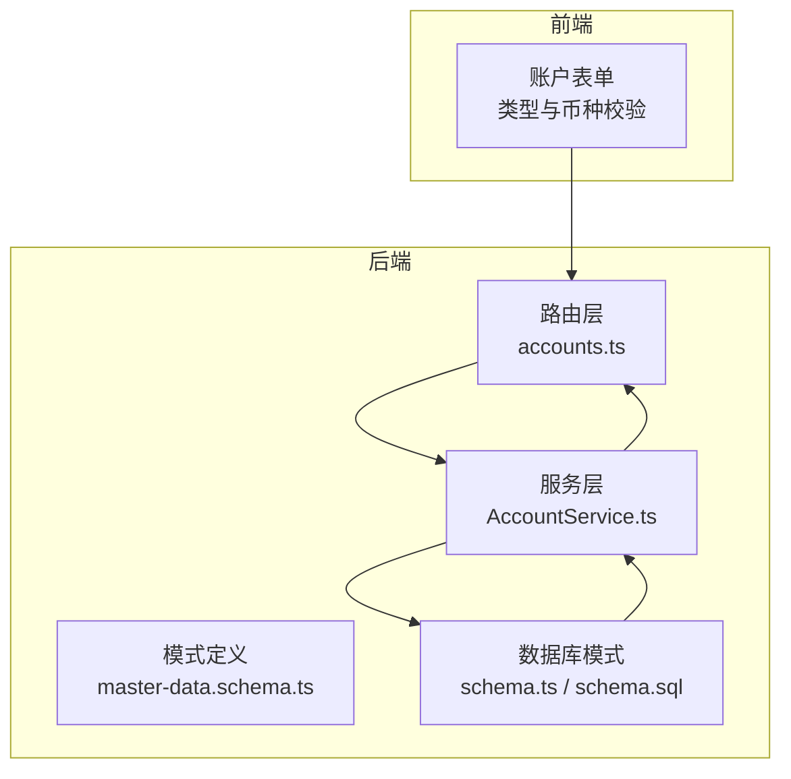
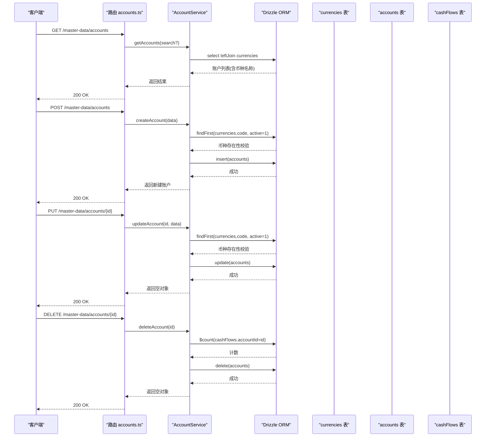
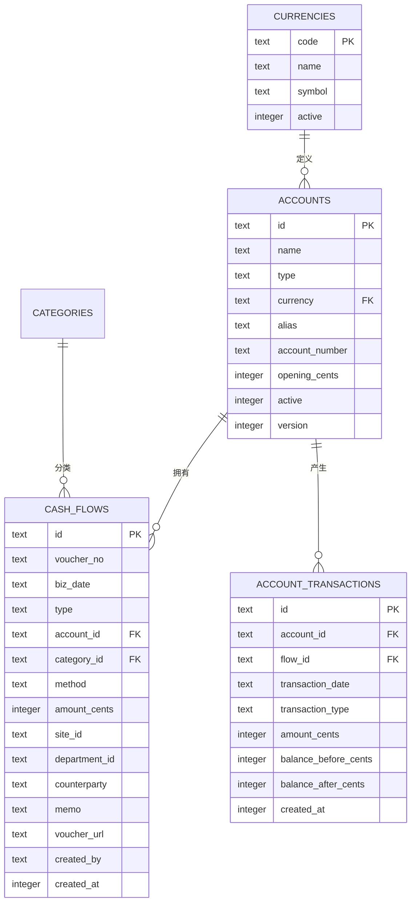
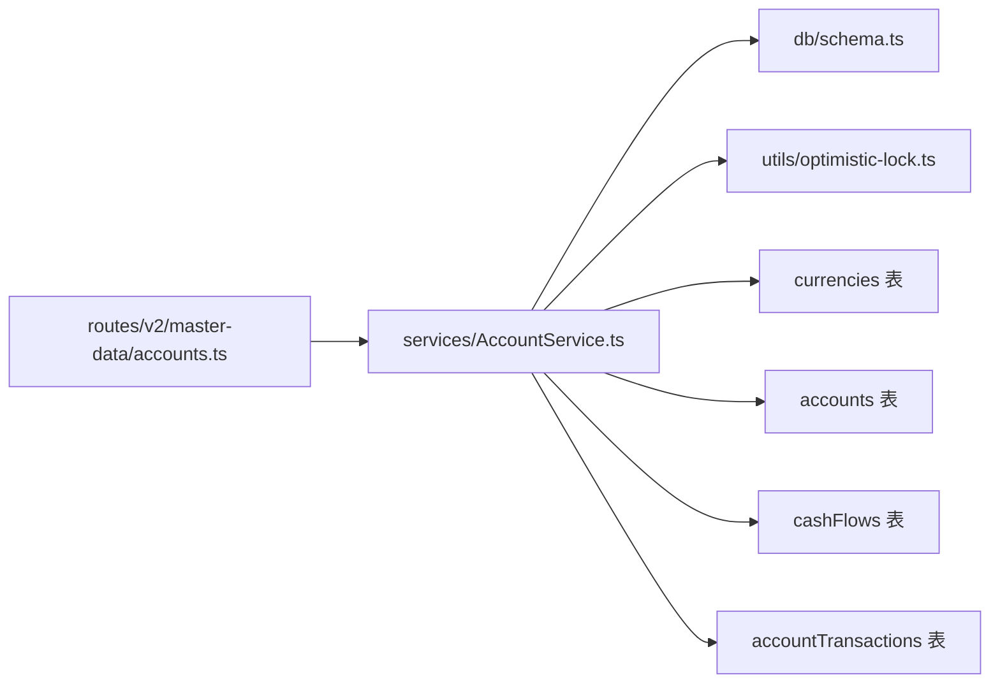

# 账户管理

<cite>
**本文引用的文件**
- [backend/src/db/schema.ts](file://backend/src/db/schema.ts)
- [backend/src/db/schema.sql](file://backend/src/db/schema.sql)
- [backend/src/services/AccountService.ts](file://backend/src/services/AccountService.ts)
- [backend/src/routes/v2/master-data/accounts.ts](file://backend/src/routes/v2/master-data/accounts.ts)
- [backend/src/schemas/master-data.schema.ts](file://backend/src/schemas/master-data.schema.ts)
- [backend/src/utils/optimistic-lock.ts](file://backend/src/utils/optimistic-lock.ts)
- [backend/test/services/AccountService.test.ts](file://backend/test/services/AccountService.test.ts)
- [backend/openapi.json](file://backend/openapi.json)
- [frontend/src/validations/account.schema.ts](file://frontend/src/validations/account.schema.ts)
- [frontend/src/types/schema.d.ts](file://frontend/src/types/schema.d.ts)
</cite>

## 目录
1. [简介](#简介)
2. [项目结构](#项目结构)
3. [核心组件](#核心组件)
4. [架构总览](#架构总览)
5. [详细组件分析](#详细组件分析)
6. [依赖关系分析](#依赖关系分析)
7. [性能考量](#性能考量)
8. [故障排查指南](#故障排查指南)
9. [结论](#结论)
10. [附录](#附录)

## 简介
本文件围绕账户管理数据模型进行系统化梳理，重点解析 accounts 表的结构与设计，涵盖：
- 账户类型（type）的分类与业务含义
- 币种（currency）字段与 currencies 表的关联机制
- 乐观锁（version）在并发更新中的作用
- 别名（alias）与账号（accountNumber）字段的用途
- 结合 AccountService 的 getAccounts、createAccount、updateAccount 方法，说明查询、创建与更新逻辑，包括币种有效性校验与删除时的流水记录检查
- ER 图展示 accounts 表与 cashFlows、accountTransactions 等表的关系

## 项目结构
账户管理功能由后端路由、服务层、数据库模式与前端校验共同组成，核心路径如下：
- 路由层：定义账户列表、交易明细、创建、更新、删除接口
- 服务层：封装账户查询、创建、更新、删除的业务逻辑
- 数据库层：accounts、currencies、cashFlows、accountTransactions 等表
- 前端校验：对账户类型、币种长度等进行约束

图表来源
- [backend/src/routes/v2/master-data/accounts.ts](file://backend/src/routes/v2/master-data/accounts.ts#L1-L310)
- [backend/src/services/AccountService.ts](file://backend/src/services/AccountService.ts#L1-L168)
- [backend/src/schemas/master-data.schema.ts](file://backend/src/schemas/master-data.schema.ts#L52-L70)
- [backend/src/db/schema.ts](file://backend/src/db/schema.ts#L139-L149)
- [backend/src/db/schema.sql](file://backend/src/db/schema.sql#L173-L184)

章节来源
- [backend/src/routes/v2/master-data/accounts.ts](file://backend/src/routes/v2/master-data/accounts.ts#L1-L310)
- [backend/src/services/AccountService.ts](file://backend/src/services/AccountService.ts#L1-L168)
- [backend/src/schemas/master-data.schema.ts](file://backend/src/schemas/master-data.schema.ts#L52-L70)
- [backend/src/db/schema.ts](file://backend/src/db/schema.ts#L139-L149)
- [backend/src/db/schema.sql](file://backend/src/db/schema.sql#L173-L184)

## 核心组件
- accounts 表：存储账户基本信息，含类型、币种、别名、账号、期初金额、启用状态与乐观锁版本号
- currencies 表：币种字典，提供币种代码、名称、符号与启用状态
- cashFlows 表：资金流水，记录每笔收支与账户关联
- accountTransactions 表：账户交易快照，记录每次流水对账户余额的影响

章节来源
- [backend/src/db/schema.ts](file://backend/src/db/schema.ts#L139-L149)
- [backend/src/db/schema.ts](file://backend/src/db/schema.ts#L213-L218)
- [backend/src/db/schema.ts](file://backend/src/db/schema.ts#L190-L206)
- [backend/src/db/schema.sql](file://backend/src/db/schema.sql#L173-L184)
- [backend/src/db/schema.sql](file://backend/src/db/schema.sql#L186-L216)

## 架构总览
账户管理的典型调用链路如下：
- 查询账户：路由 -> 服务 -> 数据库（左连接 currencies 获取币种名称）
- 创建账户：路由 -> 服务 -> 数据库（校验币种有效性）
- 更新账户：路由 -> 服务 -> 数据库（校验币种有效性）
- 删除账户：路由 -> 服务 -> 数据库（检查是否存在流水）

图表来源
- [backend/src/routes/v2/master-data/accounts.ts](file://backend/src/routes/v2/master-data/accounts.ts#L48-L83)
- [backend/src/routes/v2/master-data/accounts.ts](file://backend/src/routes/v2/master-data/accounts.ts#L177-L214)
- [backend/src/routes/v2/master-data/accounts.ts](file://backend/src/routes/v2/master-data/accounts.ts#L247-L269)
- [backend/src/routes/v2/master-data/accounts.ts](file://backend/src/routes/v2/master-data/accounts.ts#L295-L309)
- [backend/src/services/AccountService.ts](file://backend/src/services/AccountService.ts#L15-L44)
- [backend/src/services/AccountService.ts](file://backend/src/services/AccountService.ts#L84-L116)
- [backend/src/services/AccountService.ts](file://backend/src/services/AccountService.ts#L118-L166)

## 详细组件分析

### accounts 表结构与字段语义
- 字段说明
  - id：主键
  - name：账户名称
  - type：账户类型，枚举值包括 cash、bank、alipay、wechat、other
  - currency：币种代码，外键关联 currencies.code
  - alias：账户别名，支持模糊搜索
  - accountNumber：账号/卡号等，支持模糊搜索
  - openingCents：期初金额（分）
  - active：启用状态（1/0）
  - version：乐观锁版本号，默认 1
- 关键索引与约束
  - 主键：id
  - 外键：currency -> currencies.code
  - 其他：无显式外键约束（通过业务层保证一致性）

章节来源
- [backend/src/db/schema.ts](file://backend/src/db/schema.ts#L139-L149)
- [backend/src/db/schema.sql](file://backend/src/db/schema.sql#L173-L184)
- [backend/src/schemas/master-data.schema.ts](file://backend/src/schemas/master-data.schema.ts#L55-L66)
- [backend/openapi.json](file://backend/openapi.json#L1400-L1509)

### 账户类型（type）分类与业务含义
- 分类枚举：cash、bank、alipay、wechat、other
- 业务含义
  - cash：现金账户
  - bank：银行账户
  - alipay：支付宝账户
  - wechat：微信账户
  - other：其他账户类型
- 前端与后端均对 type 进行枚举约束，确保输入合法

章节来源
- [backend/src/schemas/master-data.schema.ts](file://backend/src/schemas/master-data.schema.ts#L58-L60)
- [frontend/src/validations/account.schema.ts](file://frontend/src/validations/account.schema.ts#L10-L11)
- [frontend/src/types/schema.d.ts](file://frontend/src/types/schema.d.ts#L1062-L1076)
- [backend/openapi.json](file://backend/openapi.json#L1412-L1420)

### 币种（currency）与 currencies 表关联
- 关联方式：accounts.currency -> currencies.code
- 有效性校验
  - 创建与更新时，服务层会查询 currencies 并要求 active=1
  - 币种代码统一转为大写并去空白
- 前端与后端对币种长度进行约束（3 个字符）

章节来源
- [backend/src/services/AccountService.ts](file://backend/src/services/AccountService.ts#L92-L98)
- [backend/src/services/AccountService.ts](file://backend/src/services/AccountService.ts#L132-L141)
- [backend/src/schemas/master-data.schema.ts](file://backend/src/schemas/master-data.schema.ts#L61-L61)
- [backend/src/db/schema.ts](file://backend/src/db/schema.ts#L213-L218)
- [backend/src/db/schema.sql](file://backend/src/db/schema.sql#L149-L154)
- [backend/openapi.json](file://backend/openapi.json#L1422-L1426)

### 乐观锁（version）在并发更新中的作用
- 设计意图：避免并发更新导致的数据覆盖
- 实现要点
  - accounts 表包含 version 字段
  - 服务层未直接使用乐观锁工具函数进行并发校验
  - 若需启用乐观锁保护，可在更新时读取当前 version，并在更新条件中校验预期 version，若不一致则抛出并发冲突错误
- 建议
  - 在 updateAccount 中增加版本号校验与递增逻辑，以提升并发安全性

章节来源
- [backend/src/db/schema.ts](file://backend/src/db/schema.ts#L148-L148)
- [backend/src/utils/optimistic-lock.ts](file://backend/src/utils/optimistic-lock.ts#L16-L32)

### 别名（alias）与账号（accountNumber）字段用途
- alias：便于快速检索与识别，支持模糊搜索
- accountNumber：记录银行账号、卡号等，支持模糊搜索
- 搜索策略：getAccounts 支持按 name、alias、accountNumber 进行模糊匹配

章节来源
- [backend/src/services/AccountService.ts](file://backend/src/services/AccountService.ts#L32-L41)
- [backend/test/services/AccountService.test.ts](file://backend/test/services/AccountService.test.ts#L76-L100)

### 查询逻辑（getAccounts）
- 功能
  - 支持按名称、别名、账号模糊搜索
  - 左连接 currencies 获取币种名称
  - 默认按 name 排序
- 性能
  - 可根据需要在路由层添加后端过滤参数（如 activeOnly、accountType、currency），服务层已预留过滤逻辑

章节来源
- [backend/src/services/AccountService.ts](file://backend/src/services/AccountService.ts#L15-L44)
- [backend/src/routes/v2/master-data/accounts.ts](file://backend/src/routes/v2/master-data/accounts.ts#L48-L83)

### 创建逻辑（createAccount）
- 步骤
  - 规范化币种代码（大写、去空白）
  - 校验币种存在且启用
  - 插入 accounts 记录（默认 active=1，openingCents 默认 0）
- 错误处理
  - 币种不存在或停用时抛出“不存在”错误

章节来源
- [backend/src/services/AccountService.ts](file://backend/src/services/AccountService.ts#L84-L116)
- [backend/test/services/AccountService.test.ts](file://backend/test/services/AccountService.test.ts#L114-L179)

### 更新逻辑（updateAccount）
- 步骤
  - 支持逐项更新（name、type、currency、alias、accountNumber、active）
  - 币种更新时同样进行有效性校验
  - 空更新会抛出“没有需要更新的字段”错误
- 错误处理
  - 币种不存在或停用时抛出“不存在”错误
  - 无变更字段时抛出“没有需要更新的字段”

章节来源
- [backend/src/services/AccountService.ts](file://backend/src/services/AccountService.ts#L118-L166)
- [backend/test/services/AccountService.test.ts](file://backend/test/services/AccountService.test.ts#L181-L233)

### 删除逻辑（deleteAccount）
- 步骤
  - 校验账户存在
  - 检查是否存在与该账户关联的 cashFlows 记录
  - 若存在流水则拒绝删除；否则删除账户
- 错误处理
  - 账户不存在抛出“不存在”错误
  - 存在流水时抛出“无法删除，该账户还有流水记录”错误

章节来源
- [backend/src/services/AccountService.ts](file://backend/src/services/AccountService.ts#L152-L166)
- [backend/test/services/AccountService.test.ts](file://backend/test/services/AccountService.test.ts#L235-L281)

### 交易明细查询（getAccountTransactions）
- 功能
  - 查询某账户的交易快照（accountTransactions），并关联 cashFlows 与 categories
  - 支持分页与排序
- 关联关系
  - accountTransactions.flow_id -> cashFlows.id
  - cashFlows.category_id -> categories.id

章节来源
- [backend/src/services/AccountService.ts](file://backend/src/services/AccountService.ts#L46-L82)
- [backend/src/db/schema.ts](file://backend/src/db/schema.ts#L190-L206)
- [backend/src/db/schema.ts](file://backend/src/db/schema.ts#L159-L188)

### ER 图：accounts 与相关表的关系

图表来源
- [backend/src/db/schema.ts](file://backend/src/db/schema.ts#L139-L149)
- [backend/src/db/schema.ts](file://backend/src/db/schema.ts#L213-L218)
- [backend/src/db/schema.ts](file://backend/src/db/schema.ts#L159-L188)
- [backend/src/db/schema.ts](file://backend/src/db/schema.ts#L190-L206)

## 依赖关系分析
- 路由层依赖服务层，服务层依赖数据库模式与工具函数
- 服务层对币种进行有效性校验，依赖 currencies 表
- 删除账户依赖 cashFlows 表的流水计数
- 交易明细查询依赖 accountTransactions 与 cashFlows 的关联

图表来源
- [backend/src/routes/v2/master-data/accounts.ts](file://backend/src/routes/v2/master-data/accounts.ts#L1-L310)
- [backend/src/services/AccountService.ts](file://backend/src/services/AccountService.ts#L1-L168)
- [backend/src/db/schema.ts](file://backend/src/db/schema.ts#L139-L149)
- [backend/src/utils/optimistic-lock.ts](file://backend/src/utils/optimistic-lock.ts#L1-L41)

章节来源
- [backend/src/routes/v2/master-data/accounts.ts](file://backend/src/routes/v2/master-data/accounts.ts#L1-L310)
- [backend/src/services/AccountService.ts](file://backend/src/services/AccountService.ts#L1-L168)
- [backend/src/db/schema.ts](file://backend/src/db/schema.ts#L139-L149)

## 性能考量
- 查询优化
  - 账户列表默认按 name 排序，建议在高频搜索场景下考虑建立复合索引（如 name、alias、accountNumber）
  - 交易明细查询按 transactionDate 降序，建议在 account_id + transaction_date 上建立索引
- 币种校验
  - 创建/更新时对币种进行 active=1 校验，避免无效币种进入系统
- 并发安全
  - accounts.version 字段存在但未在服务层启用乐观锁校验，建议在更新时引入版本号校验与递增，以降低并发冲突风险

章节来源
- [backend/src/services/AccountService.ts](file://backend/src/services/AccountService.ts#L15-L44)
- [backend/src/services/AccountService.ts](file://backend/src/services/AccountService.ts#L46-L82)
- [backend/src/utils/optimistic-lock.ts](file://backend/src/utils/optimistic-lock.ts#L16-L40)

## 故障排查指南
- 创建失败：币种无效或停用
  - 现象：抛出“币种不存在”错误
  - 处理：确认 currencies 表中币种 code 存在且 active=1
- 更新失败：币种无效或无变更字段
  - 现象：抛出“币种不存在”或“没有需要更新的字段”
  - 处理：修正币种代码或至少提供一个可更新字段
- 删除失败：账户仍有流水记录
  - 现象：抛出“无法删除，该账户还有流水记录”错误
  - 处理：先清理相关 cashFlows 或迁移至其他账户后再删除

章节来源
- [backend/src/services/AccountService.ts](file://backend/src/services/AccountService.ts#L92-L98)
- [backend/src/services/AccountService.ts](file://backend/src/services/AccountService.ts#L132-L141)
- [backend/src/services/AccountService.ts](file://backend/src/services/AccountService.ts#L146-L149)
- [backend/src/services/AccountService.ts](file://backend/src/services/AccountService.ts#L158-L161)
- [backend/test/services/AccountService.test.ts](file://backend/test/services/AccountService.test.ts#L160-L178)
- [backend/test/services/AccountService.test.ts](file://backend/test/services/AccountService.test.ts#L256-L281)

## 结论
- accounts 表是账户管理的核心，承载了账户类型、币种、别名、账号、期初金额、启用状态与乐观锁版本号等关键信息
- 服务层通过严格的币种有效性校验与删除前的流水检查，保障了数据一致性
- 建议在更新流程中启用乐观锁校验与递增，进一步提升并发安全性
- 通过 ER 图与调用序列图，可以清晰地理解账户与流水、交易快照之间的关系，便于后续扩展与维护

## 附录
- 前端类型定义与校验
  - 前端对账户类型与币种长度进行约束，与后端保持一致
- OpenAPI 定义
  - 接口对账户类型与币种长度进行约束，确保前后端一致

章节来源
- [frontend/src/validations/account.schema.ts](file://frontend/src/validations/account.schema.ts#L1-L28)
- [frontend/src/types/schema.d.ts](file://frontend/src/types/schema.d.ts#L1062-L1127)
- [backend/openapi.json](file://backend/openapi.json#L1400-L1509)