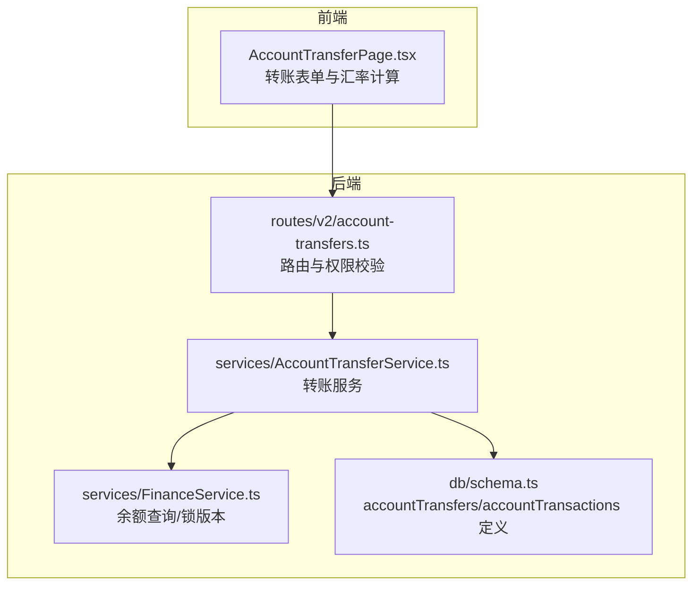
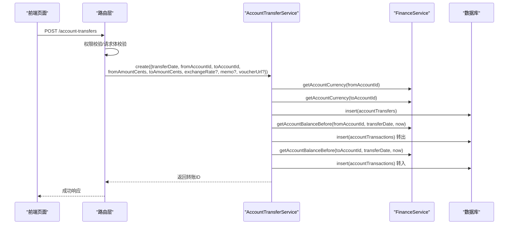
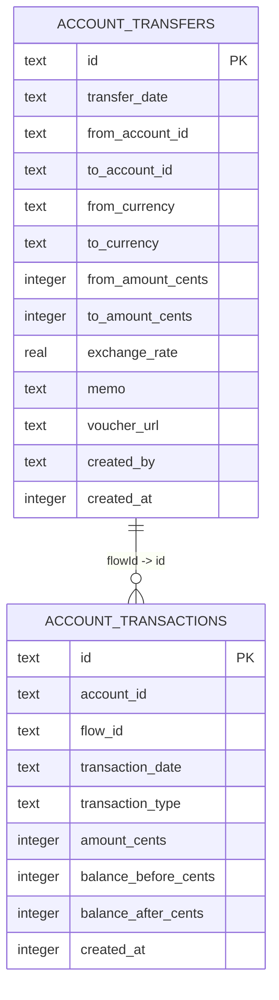
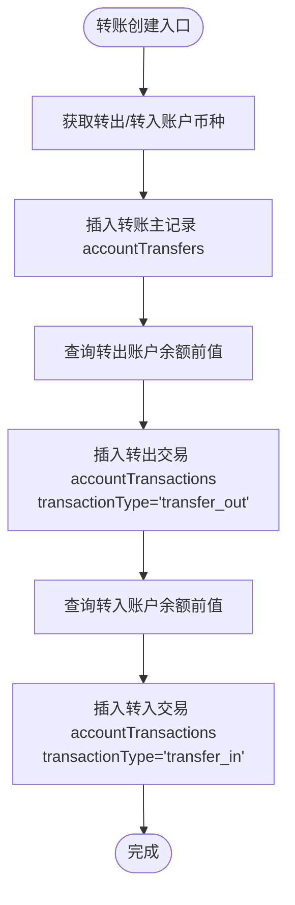
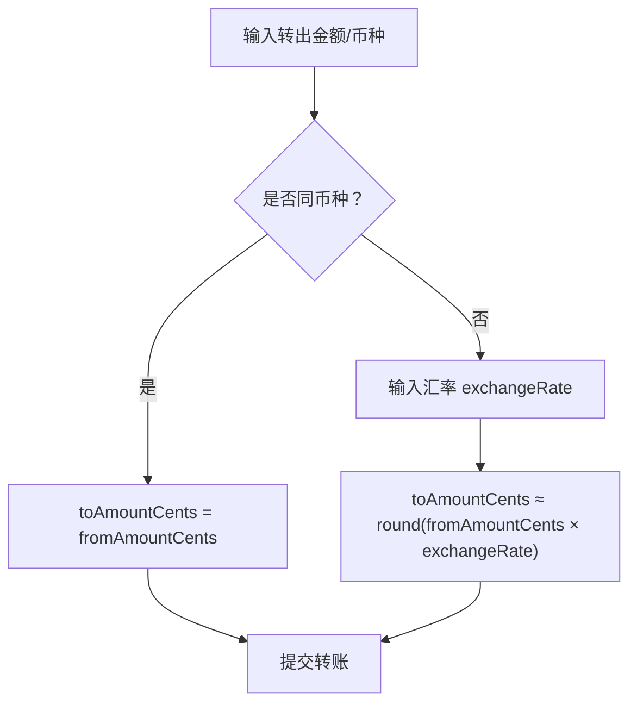
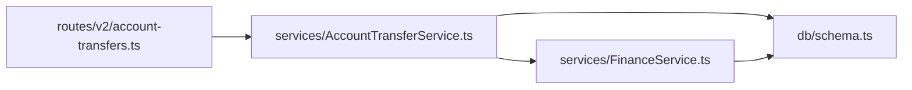

# 转账操作

<cite>
**本文引用的文件**
- [AccountTransferService.ts](file://backend/src/services/AccountTransferService.ts)
- [FinanceService.ts](file://backend/src/services/FinanceService.ts)
- [schema.ts](file://backend/src/db/schema.ts)
- [account-transfers.ts](file://backend/src/routes/v2/account-transfers.ts)
- [business.schema.ts](file://backend/src/schemas/business.schema.ts)
- [AccountTransferPage.tsx](file://frontend/src/features/finance/pages/AccountTransferPage.tsx)
- [AccountTransferService.test.ts](file://backend/test/services/AccountTransferService.test.ts)
- [openapi.json](file://backend/openapi.json)
</cite>

## 目录
1. [简介](#简介)
2. [项目结构](#项目结构)
3. [核心组件](#核心组件)
4. [架构总览](#架构总览)
5. [详细组件分析](#详细组件分析)
6. [依赖关系分析](#依赖关系分析)
7. [性能考量](#性能考量)
8. [故障排查指南](#故障排查指南)
9. [结论](#结论)
10. [附录](#附录)

## 简介
本文件围绕“转账操作”这一核心业务，系统化梳理 accountTransfers 表的数据模型、与账户余额的时序一致性关系、跨币种转账的处理逻辑，以及从接口到服务层的完整调用链路。重点说明：
- fromAccountId（转出账户）与 toAccountId（转入账户）的关联与约束
- fromAmountCents / toAmountCents 的设计与校验
- exchangeRate（汇率）在跨币种转账中的作用与精度考虑
- memo（备注）与 voucherUrl（凭证）字段的用途
- 通过 AccountTransferService.create 方法，如何以两条 accountTransactions 记录（转出/转入）保证余额时序一致与原子性

## 项目结构
围绕转账功能的相关模块分布如下：
- 后端路由层：负责请求校验、鉴权与响应封装
- 服务层：实现转账业务逻辑，读取账户币种与余额，生成转账记录与两条交易流水
- 数据层：定义 accountTransfers 与 accountTransactions 表结构
- 前端页面：提供转账表单、汇率计算与凭证上传

图表来源
- [account-transfers.ts](file://backend/src/routes/v2/account-transfers.ts#L1-L235)
- [AccountTransferService.ts](file://backend/src/services/AccountTransferService.ts#L1-L148)
- [FinanceService.ts](file://backend/src/services/FinanceService.ts#L1-L443)
- [schema.ts](file://backend/src/db/schema.ts#L190-L206)

章节来源
- [account-transfers.ts](file://backend/src/routes/v2/account-transfers.ts#L1-L235)
- [AccountTransferService.ts](file://backend/src/services/AccountTransferService.ts#L1-L148)
- [FinanceService.ts](file://backend/src/services/FinanceService.ts#L1-L443)
- [schema.ts](file://backend/src/db/schema.ts#L190-L206)

## 核心组件
- 路由与权限控制：对转账接口进行权限校验与请求体校验，构造服务层输入并记录审计日志
- 账户转账服务：创建转账主记录，查询转出/转入账户余额，插入两条 accountTransactions 记录，保证时序一致
- 金融服务：提供账户币种查询与余额前值计算，用于构建交易流水的 balanceBefore/balanceAfter
- 数据模型：accountTransfers 存储转账主记录；accountTransactions 存储每笔账户的交易流水，形成余额时序

章节来源
- [account-transfers.ts](file://backend/src/routes/v2/account-transfers.ts#L118-L184)
- [AccountTransferService.ts](file://backend/src/services/AccountTransferService.ts#L44-L124)
- [FinanceService.ts](file://backend/src/services/FinanceService.ts#L41-L68)
- [schema.ts](file://backend/src/db/schema.ts#L448-L476)

## 架构总览
转账创建的端到端流程如下：

图表来源
- [account-transfers.ts](file://backend/src/routes/v2/account-transfers.ts#L149-L184)
- [AccountTransferService.ts](file://backend/src/services/AccountTransferService.ts#L44-L124)
- [FinanceService.ts](file://backend/src/services/FinanceService.ts#L41-L68)

## 详细组件分析

### 数据模型：accountTransfers 与 accountTransactions
- accountTransfers
  - 主键：id
  - 关键字段：transferDate、fromAccountId、toAccountId、fromCurrency、toCurrency、fromAmountCents、toAmountCents、exchangeRate、memo、voucherUrl、createdBy、createdAt
  - 设计要点：
    - fromAccountId 与 toAccountId 必填且不可相同（服务层校验）
    - fromAmountCents / toAmountCents 非负整数
    - exchangeRate 使用 real 类型，支持浮点存储
    - memo 与 voucherUrl 用于业务备注与凭证链接
- accountTransactions
  - 主键：id
  - 关键字段：accountId、flowId、transactionDate、transactionType、amountCents、balanceBeforeCents、balanceAfterCents、createdAt
  - 设计要点：
    - flowId 关联到转账主记录（accountTransfers.id）
    - 通过 balanceBeforeCents 与 balanceAfterCents 维持账户余额时序一致性
    - 交易类型包括 transfer_out 与 transfer_in

图表来源
- [schema.ts](file://backend/src/db/schema.ts#L448-L476)
- [schema.ts](file://backend/src/db/schema.ts#L190-L206)

章节来源
- [schema.ts](file://backend/src/db/schema.ts#L190-L206)
- [schema.ts](file://backend/src/db/schema.ts#L448-L476)

### 账户关联与余额时序一致性
- fromAccountId 与 toAccountId 的关联
  - 路由层与服务层均要求两个账户不同，避免自转账
  - 服务层在创建转账记录时同步获取两个账户的币种，确保后续两条交易流水的币种一致性
- 余额时序一致性
  - 服务层通过 FinanceService.getAccountBalanceBefore(accountId, date, timestamp) 计算“转账当日/之前”的最后一条交易的 balanceAfter，作为本次转账的 balanceBefore
  - 转出：amountCents 为负，balanceAfter = balanceBefore - fromAmountCents
  - 转入：amountCents 为正，balanceAfter = balanceBefore + toAmountCents
  - 两条 accountTransactions 记录共同构成账户余额的连续时序，保证历史可追溯

图表来源
- [AccountTransferService.ts](file://backend/src/services/AccountTransferService.ts#L44-L124)
- [FinanceService.ts](file://backend/src/services/FinanceService.ts#L41-L68)

章节来源
- [AccountTransferService.ts](file://backend/src/services/AccountTransferService.ts#L44-L124)
- [FinanceService.ts](file://backend/src/services/FinanceService.ts#L41-L68)

### 跨币种转账与汇率 exchangeRate
- 同币种转账
  - fromAmountCents 与 toAmountCents 数值相等
  - 不需要 exchangeRate 字段参与
- 跨币种转账
  - 需要 exchangeRate（real 类型）与 fromAmountCents 计算 toAmountCents
  - 前端页面提示：不同币种转账需提供实时汇率，并在输入汇率时自动计算转入金额
  - 路由层与服务层对 exchangeRate 的类型为 number（可空），schema 层定义为 real，便于存储浮点值

图表来源
- [business.schema.ts](file://backend/src/schemas/business.schema.ts#L258-L273)
- [AccountTransferService.ts](file://backend/src/services/AccountTransferService.ts#L67-L76)
- [AccountTransferPage.tsx](file://frontend/src/features/finance/pages/AccountTransferPage.tsx#L250-L362)

章节来源
- [business.schema.ts](file://backend/src/schemas/business.schema.ts#L258-L273)
- [AccountTransferService.ts](file://backend/src/services/AccountTransferService.ts#L67-L76)
- [AccountTransferPage.tsx](file://frontend/src/features/finance/pages/AccountTransferPage.tsx#L250-L362)

### 备注 memo 与凭证 voucherUrl
- memo：用于记录转账备注，便于审计与对账
- voucherUrl：存储凭证文件链接，支持数组形式（后端统一序列化为 JSON 字符串），前端提供上传与预览能力

章节来源
- [account-transfers.ts](file://backend/src/routes/v2/account-transfers.ts#L156-L167)
- [AccountTransferService.ts](file://backend/src/services/AccountTransferService.ts#L57-L76)
- [AccountTransferPage.tsx](file://frontend/src/features/finance/pages/AccountTransferPage.tsx#L328-L350)

### 接口与数据契约
- 请求体字段与校验
  - transferDate、fromAccountId、toAccountId、fromAmountCents、toAmountCents、exchangeRate（可选）、memo（可选）、voucherUrl（可选）
  - 校验规则：金额必须为正整数；转出账户与转入账户不可相同；可选字段按需提供
- 响应体字段
  - 包含创建成功的转账 ID

章节来源
- [business.schema.ts](file://backend/src/schemas/business.schema.ts#L258-L273)
- [account-transfers.ts](file://backend/src/routes/v2/account-transfers.ts#L118-L184)
- [openapi.json](file://backend/openapi.json#L9481-L9524)

### 原子性与并发控制
- 两条 accountTransactions 的插入顺序
  - 先插入转出记录，再插入转入记录，确保 balanceBefore/balanceAfter 的时序正确
- 并发冲突处理
  - 余额计算依赖历史交易的 balanceAfter，避免直接读取账户表余额导致的竞态
  - 余额前值查询使用 transactionDate 与 createdAt 的组合排序，保证“转账时刻”的前一交易存在
- 原子性保障
  - 当前转账创建流程在单次请求中执行，未显式包裹数据库事务；两条交易记录的插入顺序与余额计算逻辑共同保证时序一致性
  - 若需更强的原子性，可在服务层将转账主记录与两条交易记录放入数据库事务中执行

章节来源
- [AccountTransferService.ts](file://backend/src/services/AccountTransferService.ts#L79-L124)
- [FinanceService.ts](file://backend/src/services/FinanceService.ts#L41-L68)

## 依赖关系分析
- 路由层依赖服务层：负责鉴权、参数校验与审计日志
- 服务层依赖金融服务与数据库：查询币种与余额、写入转账与交易记录
- 数据层依赖 Drizzle ORM：定义表结构与索引

图表来源
- [account-transfers.ts](file://backend/src/routes/v2/account-transfers.ts#L1-L235)
- [AccountTransferService.ts](file://backend/src/services/AccountTransferService.ts#L1-L148)
- [FinanceService.ts](file://backend/src/services/FinanceService.ts#L1-L443)
- [schema.ts](file://backend/src/db/schema.ts#L190-L206)

章节来源
- [account-transfers.ts](file://backend/src/routes/v2/account-transfers.ts#L1-L235)
- [AccountTransferService.ts](file://backend/src/services/AccountTransferService.ts#L1-L148)
- [FinanceService.ts](file://backend/src/services/FinanceService.ts#L1-L443)
- [schema.ts](file://backend/src/db/schema.ts#L190-L206)

## 性能考量
- 查询余额前值
  - 使用复合排序与索引（按账户与交易日期排序）提升查询效率
- 事务与锁
  - 余额计算依赖历史交易，避免直接更新账户余额字段，减少锁竞争
- 建议
  - 在高并发场景下，可将转账主记录与两条交易记录放入数据库事务，确保强一致
  - 对高频查询的账户余额可考虑缓存策略（需配合审计与一致性约束）

[本节为通用指导，无需列出具体文件来源]

## 故障排查指南
- 常见错误与定位
  - 参数校验失败：检查请求体字段类型与非空约束
  - 账户币种不匹配：确认同币种转账时 toAmountCents 与 fromAmountCents 的一致性
  - 汇率缺失：跨币种转账需提供 exchangeRate
  - 权限不足：确认路由层权限校验是否通过
- 审计与溯源
  - 路由层记录审计日志，便于追踪转账创建行为
  - 两条 accountTransactions 记录可回溯余额变化轨迹

章节来源
- [business.schema.ts](file://backend/src/schemas/business.schema.ts#L258-L273)
- [account-transfers.ts](file://backend/src/routes/v2/account-transfers.ts#L149-L184)

## 结论
转账操作通过 accountTransfers 与 accountTransactions 两张表协同，实现了：
- 明确的账户关联与金额约束
- 跨币种转账的汇率支持与前端辅助计算
- 基于历史交易的余额时序一致性
- 审计与凭证管理

在现有实现基础上，若需更强的一致性与并发控制，可在服务层引入数据库事务包裹转账主记录与两条交易记录的写入。

[本节为总结性内容，无需列出具体文件来源]

## 附录

### 字段对照与示例路径
- 账户转账主记录字段定义：[accountTransfers 定义](file://backend/src/db/schema.ts#L448-L476)
- 账户交易流水字段定义：[accountTransactions 定义](file://backend/src/db/schema.ts#L190-L206)
- 账户币种查询：[FinanceService.getAccountCurrency](file://backend/src/services/FinanceService.ts#L270-L277)
- 余额前值查询：[FinanceService.getAccountBalanceBefore](file://backend/src/services/FinanceService.ts#L41-L68)
- 转账创建服务：[AccountTransferService.create](file://backend/src/services/AccountTransferService.ts#L44-L124)
- 路由与权限校验：[routes/account-transfers](file://backend/src/routes/v2/account-transfers.ts#L118-L184)
- 请求体校验规则：[business.schema.ts](file://backend/src/schemas/business.schema.ts#L258-L273)
- 前端转账表单与汇率计算：[AccountTransferPage.tsx](file://frontend/src/features/finance/pages/AccountTransferPage.tsx#L250-L362)
- 单元测试用例：[AccountTransferService.test.ts](file://backend/test/services/AccountTransferService.test.ts#L127-L161)
- OpenAPI 响应字段：[openapi.json](file://backend/openapi.json#L9481-L9524)