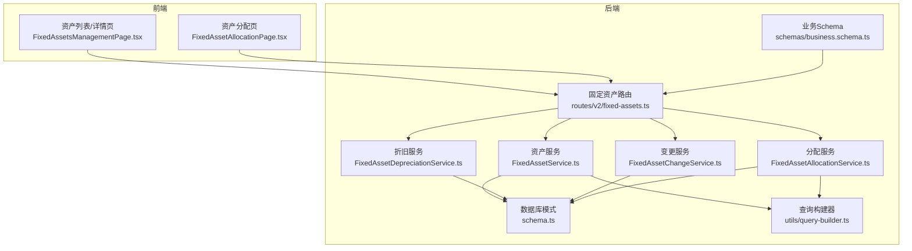
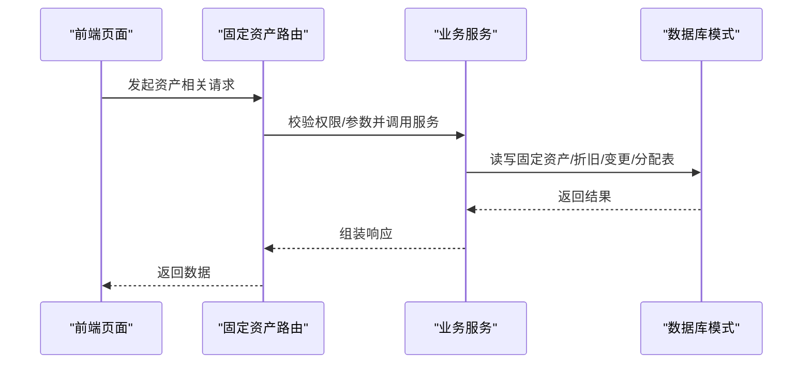
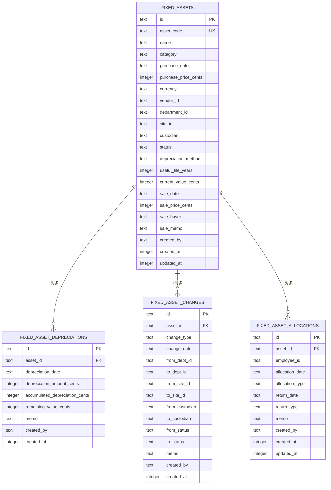

# 固定资产管理数据模型

<cite>
**本文引用的文件列表**
- [schema.ts](file://backend/src/db/schema.ts)
- [fixed-assets.ts](file://backend/src/routes/v2/fixed-assets.ts)
- [FixedAssetService.ts](file://backend/src/services/FixedAssetService.ts)
- [FixedAssetDepreciationService.ts](file://backend/src/services/FixedAssetDepreciationService.ts)
- [FixedAssetChangeService.ts](file://backend/src/services/FixedAssetChangeService.ts)
- [FixedAssetAllocationService.ts](file://backend/src/services/FixedAssetAllocationService.ts)
- [business.schema.ts](file://backend/src/schemas/business.schema.ts)
- [query-builder.ts](file://backend/src/utils/query-builder.ts)
- [FixedAssetsManagementPage.tsx](file://frontend/src/features/assets/pages/FixedAssetsManagementPage.tsx)
- [FixedAssetAllocationPage.tsx](file://frontend/src/features/assets/pages/FixedAssetAllocationPage.tsx)
</cite>

## 目录
1. [引言](#引言)
2. [项目结构](#项目结构)
3. [核心组件](#核心组件)
4. [架构总览](#架构总览)
5. [详细组件分析](#详细组件分析)
6. [依赖关系分析](#依赖关系分析)
7. [性能考量](#性能考量)
8. [故障排查指南](#故障排查指南)
9. [结论](#结论)
10. [附录](#附录)

## 引言
本文件系统性梳理固定资产管理的数据模型与业务流程，围绕以下核心表展开：
- 固定资产主表：fixedAssets
- 折旧明细表：fixedAssetDepreciations
- 资产变更记录表：fixedAssetChanges
- 资产分配记录表：fixedAssetAllocations

文档重点说明：
- fixedAssets 如何贯穿资产全生命周期（编码、采购、折旧、状态、处置等）
- fixedAssetDepreciations 如何记录每期折旧、累计折旧与剩余价值
- fixedAssetChanges 如何追踪状态变更、部门/站点/责任人调拨、采购/销售等操作历史
- fixedAssetAllocations 如何管理资产与员工的分配与归还
- ER 关系图展示资产-折旧明细、资产-变更记录、资产-分配记录的 1 对多关系

## 项目结构
固定资产管理相关的核心代码分布在后端数据库模式、路由、服务层与前端页面中，形成“模式定义—接口—业务—UI”的完整链路。

图表来源
- [schema.ts](file://backend/src/db/schema.ts#L506-L574)
- [fixed-assets.ts](file://backend/src/routes/v2/fixed-assets.ts#L1-L120)
- [FixedAssetService.ts](file://backend/src/services/FixedAssetService.ts#L1-L120)
- [FixedAssetDepreciationService.ts](file://backend/src/services/FixedAssetDepreciationService.ts#L1-L79)
- [FixedAssetChangeService.ts](file://backend/src/services/FixedAssetChangeService.ts#L1-L115)
- [FixedAssetAllocationService.ts](file://backend/src/services/FixedAssetAllocationService.ts#L1-L120)
- [business.schema.ts](file://backend/src/schemas/business.schema.ts#L276-L334)
- [query-builder.ts](file://backend/src/utils/query-builder.ts#L1-L177)
- [FixedAssetsManagementPage.tsx](file://frontend/src/features/assets/pages/FixedAssetsManagementPage.tsx#L1-L120)
- [FixedAssetAllocationPage.tsx](file://frontend/src/features/assets/pages/FixedAssetAllocationPage.tsx#L1-L120)

章节来源
- [schema.ts](file://backend/src/db/schema.ts#L506-L574)
- [fixed-assets.ts](file://backend/src/routes/v2/fixed-assets.ts#L1-L120)

## 核心组件
- 固定资产主表 fixedAssets：承载资产全生命周期关键字段，如资产编码、采购信息、折旧方法、使用状态、当前净值、处置信息等。
- 折旧明细表 fixedAssetDepreciations：按期记录折旧金额、累计折旧、剩余价值，并同步更新资产当前净值。
- 变更记录表 fixedAssetChanges：统一记录资产的状态变更、部门/站点/责任人调拨、采购、销售等事件。
- 分配记录表 fixedAssetAllocations：记录资产与员工的分配/归还，支持分配类型与归还类型区分。

章节来源
- [schema.ts](file://backend/src/db/schema.ts#L506-L574)
- [FixedAssetService.ts](file://backend/src/services/FixedAssetService.ts#L106-L181)
- [FixedAssetDepreciationService.ts](file://backend/src/services/FixedAssetDepreciationService.ts#L17-L76)
- [FixedAssetChangeService.ts](file://backend/src/services/FixedAssetChangeService.ts#L16-L79)
- [FixedAssetAllocationService.ts](file://backend/src/services/FixedAssetAllocationService.ts#L106-L208)

## 架构总览
固定资产管理采用“路由-服务-模式”分层设计，前端通过路由触发服务，服务通过 Drizzle ORM 操作 SQLite 模式，保证强一致与事务性。

图表来源
- [fixed-assets.ts](file://backend/src/routes/v2/fixed-assets.ts#L313-L765)
- [FixedAssetService.ts](file://backend/src/services/FixedAssetService.ts#L183-L226)
- [FixedAssetDepreciationService.ts](file://backend/src/services/FixedAssetDepreciationService.ts#L17-L76)
- [FixedAssetChangeService.ts](file://backend/src/services/FixedAssetChangeService.ts#L16-L79)
- [FixedAssetAllocationService.ts](file://backend/src/services/FixedAssetAllocationService.ts#L106-L208)
- [schema.ts](file://backend/src/db/schema.ts#L506-L574)

## 详细组件分析

### 固定资产主表 fixedAssets
- 字段要点
  - 资产编码：唯一索引，用于全局唯一标识
  - 采购信息：购买日期、购买价格（分）、币种、供应商、部门、站点
  - 使用信息：责任人、状态（在用/闲置/维修中/报废/出售）
  - 折旧信息：折旧方法、预计使用年限、当前净值
  - 处置信息：出售日期、出售价格、买家、备注
  - 元数据：创建/更新时间、创建者
- 生命周期
  - 创建：录入资产基础信息，默认状态为在用，当前净值等于购买价格
  - 更新：可修改名称、类别、采购信息、部门/站点/责任人、状态、备注等
  - 删除：若存在折旧记录则禁止删除
  - 处置：销售时更新状态为已出售，并记录销售流水与变更
- 与其它表的关系
  - 与 fixedAssetDepreciations：一对多（一个资产有多条折旧记录）
  - 与 fixedAssetChanges：一对多（一个资产有多条变更记录）
  - 与 fixedAssetAllocations：一对多（一个资产有多条分配记录）

章节来源
- [schema.ts](file://backend/src/db/schema.ts#L506-L530)
- [FixedAssetService.ts](file://backend/src/services/FixedAssetService.ts#L183-L226)
- [FixedAssetService.ts](file://backend/src/services/FixedAssetService.ts#L228-L311)
- [FixedAssetService.ts](file://backend/src/services/FixedAssetService.ts#L313-L468)
- [FixedAssetService.ts](file://backend/src/services/FixedAssetService.ts#L470-L607)

### 折旧明细表 fixedAssetDepreciations
- 字段要点
  - 关联资产：assetId
  - 折旧期：depreciationDate
  - 金额：depreciationAmountCents
  - 累计折旧：accumulatedDepreciationCents
  - 剩余价值：remainingValueCents
  - 元数据：memo、createdBy、createdAt
- 业务逻辑
  - 按期新增折旧记录，累计折旧为历史累计+本期金额
  - 剩余价值=购买价格-累计折旧
  - 事务内同时更新资产当前净值
  - 防止累计折旧超过购买价格
- 与 fixedAssets 的关系
  - 一对一更新：每条折旧记录都会同步更新资产的 current_value

章节来源
- [schema.ts](file://backend/src/db/schema.ts#L532-L542)
- [FixedAssetDepreciationService.ts](file://backend/src/services/FixedAssetDepreciationService.ts#L17-L76)

### 资产变更记录表 fixedAssetChanges
- 字段要点
  - 关联资产：assetId
  - 变更类型：changeType（状态变更、调拨、分配、归还、采购、销售）
  - 时间：changeDate
  - 部门/站点/责任人：from/to Dept/Site/Custodian
  - 状态：from/to Status
  - 元数据：memo、createdBy、createdAt
- 业务逻辑
  - 调拨：记录 from/to 部门/站点/责任人变化，并原子性更新资产表相应字段
  - 分配/归还：记录责任人与状态变化
  - 采购/销售：记录状态变化与摘要信息
- 与 fixedAssets 的关系
  - 一对一更新：调拨时同步更新资产的部门/站点/责任人

章节来源
- [schema.ts](file://backend/src/db/schema.ts#L544-L560)
- [FixedAssetChangeService.ts](file://backend/src/services/FixedAssetChangeService.ts#L16-L79)
- [FixedAssetAllocationService.ts](file://backend/src/services/FixedAssetAllocationService.ts#L106-L208)

### 资产分配记录表 fixedAssetAllocations
- 字段要点
  - 关联资产/员工：assetId、employeeId
  - 分配信息：allocationDate、allocationType、expectedReturnDate
  - 归还信息：returnDate、returnType
  - 元数据：memo、createdBy、createdAt、updatedAt
- 业务逻辑
  - 分配：校验资产状态为在用或闲置；确保同一资产未有未归还分配；更新资产状态为在用、责任人、部门；记录分配变更
  - 归还：校验存在未归还分配；更新归还日期/类型/备注；更新资产状态为闲置、清空责任人
- 与 fixedAssets 的关系
  - 一对一更新：分配/归还时同步更新资产状态与责任人

章节来源
- [schema.ts](file://backend/src/db/schema.ts#L562-L574)
- [FixedAssetAllocationService.ts](file://backend/src/services/FixedAssetAllocationService.ts#L106-L208)
- [FixedAssetAllocationService.ts](file://backend/src/services/FixedAssetAllocationService.ts#L210-L288)

### 接口与业务流程

#### 资产创建与详情
- 创建资产：路由层校验权限，服务层校验唯一性并写入资产表，返回资产标识
- 详情加载：服务层一次性查询资产、部门、站点、供应商、币种、创建人、折旧明细、变更记录，并批量映射名称

章节来源
- [fixed-assets.ts](file://backend/src/routes/v2/fixed-assets.ts#L313-L385)
- [FixedAssetService.ts](file://backend/src/services/FixedAssetService.ts#L183-L226)
- [FixedAssetService.ts](file://backend/src/services/FixedAssetService.ts#L106-L181)

#### 折旧记录
- 新增折旧：服务层计算累计折旧与剩余价值，事务内插入折旧记录并更新资产净值

章节来源
- [fixed-assets.ts](file://backend/src/routes/v2/fixed-assets.ts#L487-L546)
- [FixedAssetDepreciationService.ts](file://backend/src/services/FixedAssetDepreciationService.ts#L17-L76)

#### 资产调拨
- 调拨：服务层校验必填项，事务内插入变更记录并更新资产的部门/站点/责任人

章节来源
- [fixed-assets.ts](file://backend/src/routes/v2/fixed-assets.ts#L548-L611)
- [FixedAssetChangeService.ts](file://backend/src/services/FixedAssetChangeService.ts#L16-L79)

#### 资产采购与销售
- 采购：服务层校验账户有效性与币种一致性，事务内创建资产、生成流水与交易记录，并记录采购变更
- 销售：服务层校验资产状态，事务内更新资产状态与销售信息，生成流水与交易记录，并记录销售变更

章节来源
- [fixed-assets.ts](file://backend/src/routes/v2/fixed-assets.ts#L613-L765)
- [FixedAssetService.ts](file://backend/src/services/FixedAssetService.ts#L313-L468)
- [FixedAssetService.ts](file://backend/src/services/FixedAssetService.ts#L470-L607)

#### 资产分配与归还
- 分配：服务层校验资产状态与员工有效性，确保无未归还分配，事务内插入分配记录、更新资产状态与责任人，并记录分配变更
- 归还：服务层校验存在未归还分配，事务内更新归还信息、更新资产状态与责任人，并记录归还变更

章节来源
- [fixed-assets.ts](file://backend/src/routes/v2/fixed-assets.ts#L767-L888)
- [FixedAssetAllocationService.ts](file://backend/src/services/FixedAssetAllocationService.ts#L106-L208)
- [FixedAssetAllocationService.ts](file://backend/src/services/FixedAssetAllocationService.ts#L210-L288)

### 前端使用场景
- 资产管理页：支持创建、编辑、删除、调拨、折旧记录；详情页展示折旧与变更历史
- 资产分配页：支持分配与归还，筛选未归还/已归还记录

章节来源
- [FixedAssetsManagementPage.tsx](file://frontend/src/features/assets/pages/FixedAssetsManagementPage.tsx#L1-L120)
- [FixedAssetAllocationPage.tsx](file://frontend/src/features/assets/pages/FixedAssetAllocationPage.tsx#L1-L120)

## 依赖关系分析

图表来源
- [schema.ts](file://backend/src/db/schema.ts#L506-L574)

章节来源
- [schema.ts](file://backend/src/db/schema.ts#L506-L574)

## 性能考量
- 批量关联查询优化
  - 服务层使用统一的查询构建器提取关联 ID 并并行批量查询，减少 N+1 查询
- 事务边界
  - 采购/销售/折旧/分配/归还均在事务内执行，保证数据一致性
- 索引与排序
  - 折旧与变更按日期/创建时间降序查询，利于分页与最新记录展示

章节来源
- [FixedAssetService.ts](file://backend/src/services/FixedAssetService.ts#L59-L88)
- [FixedAssetService.ts](file://backend/src/services/FixedAssetService.ts#L126-L139)
- [query-builder.ts](file://backend/src/utils/query-builder.ts#L49-L107)

## 故障排查指南
- 删除资产失败
  - 若资产存在折旧记录，服务层会拒绝删除
- 折旧金额超限
  - 当累计折旧超过购买价格时，服务层抛出业务错误
- 资产不可分配
  - 仅在用或闲置资产可分配；若已有未归还分配则不可再次分配
- 资产未分配或已归还
  - 归还前需存在未归还分配

章节来源
- [FixedAssetService.ts](file://backend/src/services/FixedAssetService.ts#L288-L310)
- [FixedAssetDepreciationService.ts](file://backend/src/services/FixedAssetDepreciationService.ts#L42-L47)
- [FixedAssetAllocationService.ts](file://backend/src/services/FixedAssetAllocationService.ts#L120-L151)
- [FixedAssetAllocationService.ts](file://backend/src/services/FixedAssetAllocationService.ts#L213-L238)

## 结论
固定资产管理数据模型以 fixedAssets 为核心，通过 fixedAssetDepreciations、fixedAssetChanges、fixedAssetAllocations 三张表分别覆盖“价值变动”、“历史轨迹”和“人员绑定”，形成完整的资产全生命周期闭环。服务层采用事务与批量查询优化，前端提供直观的管理与分配界面，整体具备良好的扩展性与可维护性。

## 附录

### 字段业务含义速查
- 资产编码（asset_code）：资产唯一标识，用于全局检索与关联
- 采购日期/价格/币种：资产成本基线
- 部门/站点/责任人：资产物理与责任归属
- 状态（status）：资产当前状态（在用/闲置/维修中/报废/出售）
- 折旧方法/年限：折旧策略与周期
- 当前净值（current_value_cents）：购买价格-累计折旧
- 出售日期/价格/买家/备注：处置信息
- 分配类型（allocation_type）：入职/调拨/临时借用
- 归还类型（return_type）：离职/调拨/过期/其他

章节来源
- [schema.ts](file://backend/src/db/schema.ts#L506-L574)
- [business.schema.ts](file://backend/src/schemas/business.schema.ts#L276-L334)