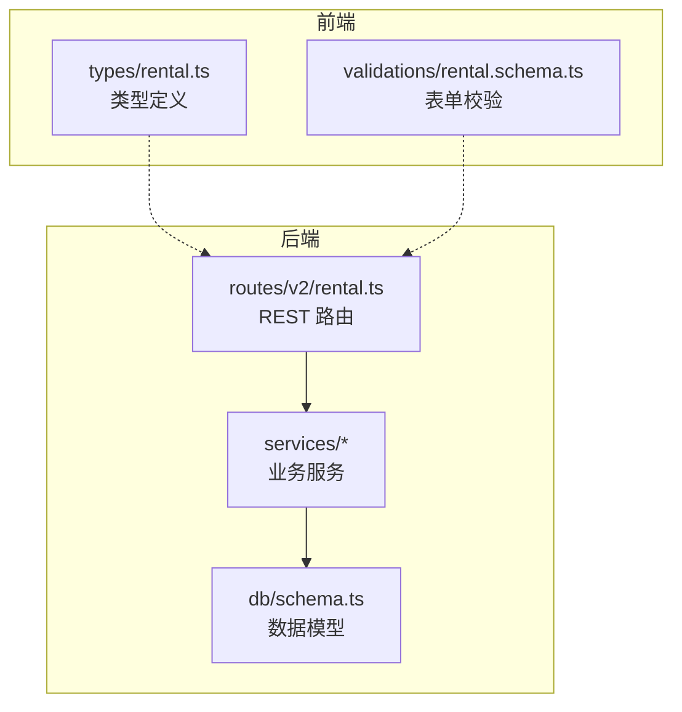
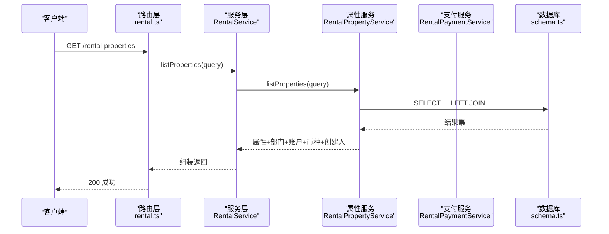
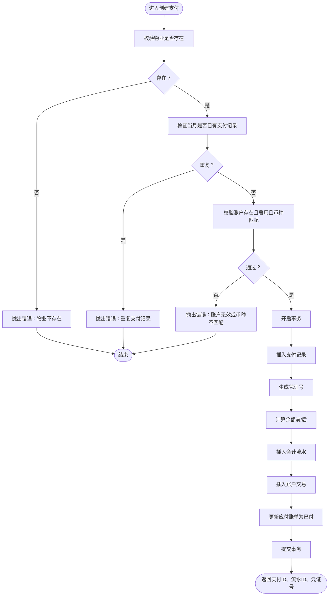
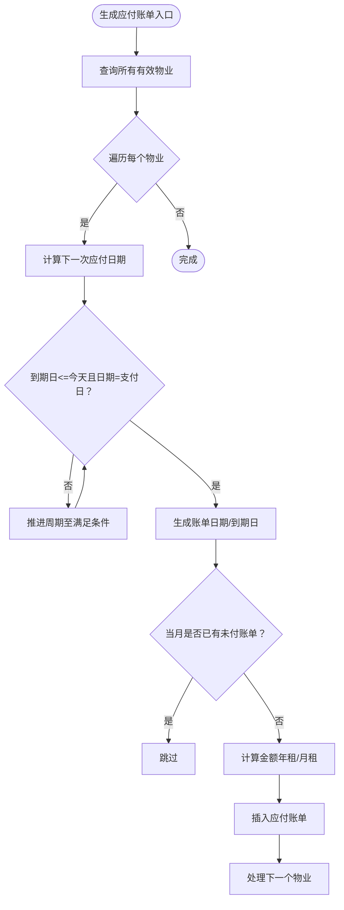
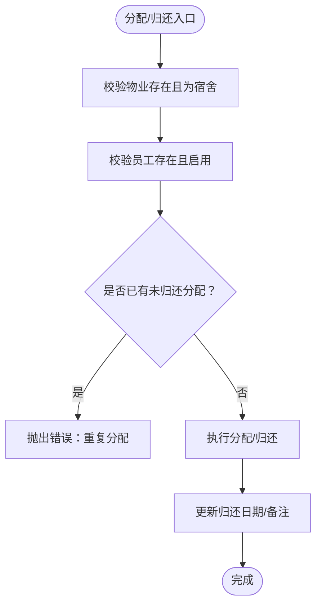
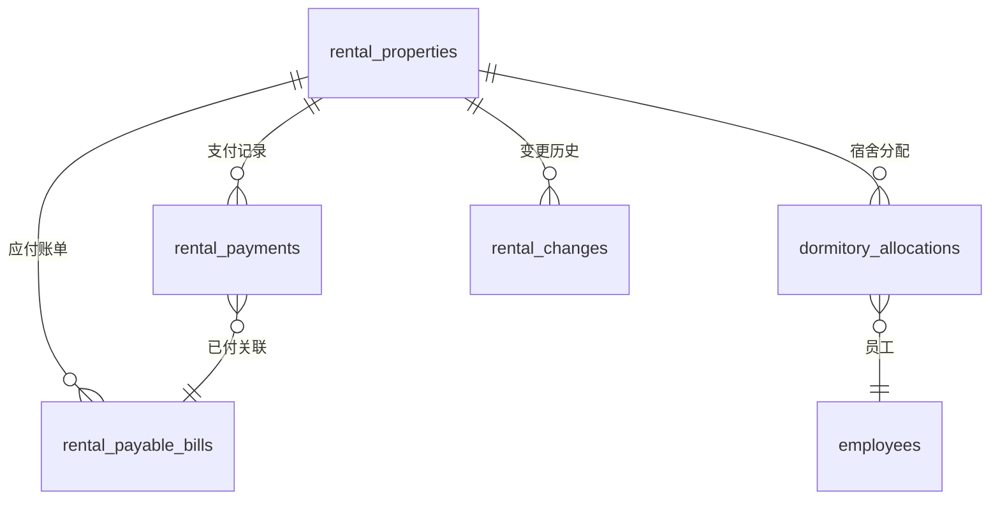
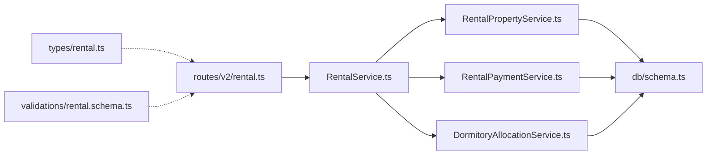

# 租赁管理数据模型

<cite>
**本文引用的文件**
- [schema.ts](file://backend/src/db/schema.ts)
- [RentalService.ts](file://backend/src/services/RentalService.ts)
- [RentalPropertyService.ts](file://backend/src/services/RentalPropertyService.ts)
- [RentalPaymentService.ts](file://backend/src/services/RentalPaymentService.ts)
- [DormitoryAllocationService.ts](file://backend/src/services/DormitoryAllocationService.ts)
- [rental.ts](file://backend/src/routes/v2/rental.ts)
- [rental.ts（前端类型）](file://frontend/src/types/rental.ts)
- [rental.schema.ts（前端校验）](file://frontend/src/validations/rental.schema.ts)
- [rental.test.ts（后端测试）](file://backend/test/routes/rental.test.ts)
- [0000_snapshot.json](file://backend/drizzle/meta/0000_snapshot.json)
- [drizzle.config.ts](file://backend/drizzle.config.ts)
</cite>

## 目录
1. [引言](#引言)
2. [项目结构](#项目结构)
3. [核心组件](#核心组件)
4. [架构总览](#架构总览)
5. [详细组件分析](#详细组件分析)
6. [依赖分析](#依赖分析)
7. [性能考虑](#性能考虑)
8. [故障排查指南](#故障排查指南)
9. [结论](#结论)
10. [附录](#附录)

## 引言
本文件系统化梳理租赁管理数据模型，围绕以下核心表展开：rentalProperties（租赁物业）、rentalPayments（租金支付）、rentalPayableBills（应付租金账单）、rentalChanges（合同变更历史）、dormitoryAllocations（宿舍分配）。文档将从表结构、业务语义、服务层实现、路由接口、前后端类型与校验、以及ER关系图等维度进行深入解析，并给出常见问题排查建议与优化建议。

## 项目结构
- 数据库模式定义位于后端数据库层，采用 Drizzle ORM 的 SQLite 模式定义文件。
- 业务服务层封装 CRUD 与流程逻辑，如创建支付时联动生成会计流水与账户交易。
- 路由层提供 REST 接口，统一响应格式与权限控制。
- 前端提供类型定义与表单校验，确保数据一致性与可用性。

图表来源
- [rental.ts](file://backend/src/routes/v2/rental.ts#L1-L120)
- [RentalService.ts](file://backend/src/services/RentalService.ts#L1-L60)
- [schema.ts](file://backend/src/db/schema.ts#L576-L673)
- [rental.ts（前端类型）](file://frontend/src/types/rental.ts#L1-L144)
- [rental.schema.ts（前端校验）](file://frontend/src/validations/rental.schema.ts#L1-L83)

章节来源
- [schema.ts](file://backend/src/db/schema.ts#L576-L673)
- [RentalService.ts](file://backend/src/services/RentalService.ts#L1-L60)
- [rental.ts](file://backend/src/routes/v2/rental.ts#L1-L120)
- [rental.ts（前端类型）](file://frontend/src/types/rental.ts#L1-L144)
- [rental.schema.ts（前端校验）](file://frontend/src/validations/rental.schema.ts#L1-L83)

## 核心组件
- rentalProperties：记录物业基本信息、计租规则、房东与合同文件、部门归属、状态等。
- rentalPayments：记录每笔实际支付，包含支付日期、年月、金额、账户、凭证、分类等，并与会计流水与账户交易联动。
- rentalPayableBills：记录应付账单，含账单日期、到期日、年月、金额、周期、状态、已付关联等。
- rentalChanges：记录合同关键字段变更（起止时间、租金、状态等），支持审计与追溯。
- dormitoryAllocations：记录宿舍分配与归还，支持按员工、房间、床铺、是否归还查询。

章节来源
- [schema.ts](file://backend/src/db/schema.ts#L576-L673)
- [RentalPropertyService.ts](file://backend/src/services/RentalPropertyService.ts#L1-L120)
- [RentalPaymentService.ts](file://backend/src/services/RentalPaymentService.ts#L1-L120)
- [DormitoryAllocationService.ts](file://backend/src/services/DormitoryAllocationService.ts#L1-L80)

## 架构总览
后端采用“路由 -> 服务 -> 数据库”的分层架构。路由负责请求解析与权限校验，服务封装业务流程并调用数据库，数据库层通过 Drizzle ORM 定义实体与索引。

图表来源
- [rental.ts](file://backend/src/routes/v2/rental.ts#L24-L80)
- [RentalService.ts](file://backend/src/services/RentalService.ts#L23-L50)
- [RentalPropertyService.ts](file://backend/src/services/RentalPropertyService.ts#L20-L43)
- [schema.ts](file://backend/src/db/schema.ts#L576-L603)

## 详细组件分析

### 表：rentalProperties（租赁物业）
- 关键字段与语义
  - 物业标识：propertyCode、name、propertyType（office、dormitory）
  - 计租规则：rentType（monthly/yearly）、monthlyRentCents、yearlyRentCents、paymentPeriodMonths、paymentDay
  - 合同与房东：leaseStartDate、leaseEndDate、landlordName、landlordContact、contractFileUrl
  - 财务与组织：currency、paymentAccountId、departmentId、status（active/inactive）、memo
  - 时间戳：createdAt、updatedAt、createdBy
- 业务要点
  - 办公室类型可绑定部门，宿舍类型不绑定部门。
  - 支持根据状态、类型、部门过滤列表。
  - 更新关键字段会自动记录变更历史。
- 查询与关联
  - 列表/详情联结部门、支付账户、币种、创建人。
  - 提供“分配数量”统计（宿舍分配且未归还的数量）。

章节来源
- [schema.ts](file://backend/src/db/schema.ts#L576-L603)
- [RentalPropertyService.ts](file://backend/src/services/RentalPropertyService.ts#L20-L84)
- [RentalService.ts](file://backend/src/services/RentalService.ts#L23-L50)

### 表：rentalPayments（租金支付）
- 关键字段与语义
  - 关联：propertyId、year、month（唯一性约束）
  - 支付：paymentDate、amountCents、currency、accountId、categoryId、paymentMethod
  - 凭证与备注：voucherUrl、memo
  - 时间戳：createdAt、updatedAt、createdBy
- 业务要点
  - 创建支付时，校验账户有效性与币种匹配。
  - 创建支付时，事务内同时写入会计流水与账户交易，保证一致性。
  - 自动将对应月份的应付账单标记为已付（若存在未付账单）。
- 流程图（创建支付）

图表来源
- [RentalPaymentService.ts](file://backend/src/services/RentalPaymentService.ts#L53-L211)

章节来源
- [schema.ts](file://backend/src/db/schema.ts#L605-L621)
- [RentalPaymentService.ts](file://backend/src/services/RentalPaymentService.ts#L53-L211)

### 表：rentalPayableBills（应付租金账单）
- 关键字段与语义
  - 关联：propertyId、year、month
  - 账单：billDate、dueDate、amountCents、currency、paymentPeriodMonths
  - 状态：status（unpaid/paid/cancelled）、paidDate、paidPaymentId
  - 时间戳：createdAt、updatedAt、createdBy
- 业务要点
  - 自动生成：基于租期、支付周期、到期日提前一定天数生成。
  - 支持按状态、日期范围查询。
  - 手动标记为已付时，进行幂等校验。
- 流程图（生成应付账单）

图表来源
- [RentalPaymentService.ts](file://backend/src/services/RentalPaymentService.ts#L244-L344)

章节来源
- [schema.ts](file://backend/src/db/schema.ts#L656-L673)
- [RentalPaymentService.ts](file://backend/src/services/RentalPaymentService.ts#L244-L344)

### 表：rentalChanges（合同变更历史）
- 关键字段与语义
  - 关联：propertyId、changeDate
  - 变更类型：modify、renew、terminate
  - 对比值：from/to 的 leaseStart/leaseEnd、monthlyRentCents、status 等
  - 备注与审计：memo、createdBy、createdAt
- 业务要点
  - 更新属性的关键字段时，自动记录变更。
  - 支持单独创建变更记录，便于审计与回溯。

章节来源
- [schema.ts](file://backend/src/db/schema.ts#L623-L640)
- [RentalPropertyService.ts](file://backend/src/services/RentalPropertyService.ts#L178-L211)

### 表：dormitoryAllocations（宿舍分配）
- 关键字段与语义
  - 关联：propertyId、employeeId
  - 分配：roomNumber、bedNumber、allocationDate、monthlyRentCents
  - 归还：returnDate、memo
  - 时间戳：createdAt、updatedAt、createdBy
- 业务要点
  - 仅宿舍类型物业可分配。
  - 同一员工在同一物业上未归还的分配记录唯一。
  - 支持按是否归还、员工、物业筛选。
- 流程图（分配/归还）

图表来源
- [DormitoryAllocationService.ts](file://backend/src/services/DormitoryAllocationService.ts#L80-L177)

章节来源
- [schema.ts](file://backend/src/db/schema.ts#L641-L654)
- [DormitoryAllocationService.ts](file://backend/src/services/DormitoryAllocationService.ts#L80-L177)

### ER 图：物业-账单-支付-变更-宿舍分配

图表来源
- [schema.ts](file://backend/src/db/schema.ts#L576-L673)

## 依赖分析
- 路由层依赖服务层，服务层依赖数据库层。
- 服务层内部模块解耦：属性、支付、分配各司其职。
- 前端类型与校验与后端路由/服务形成契约，保障数据一致性。

图表来源
- [rental.ts](file://backend/src/routes/v2/rental.ts#L1-L120)
- [RentalService.ts](file://backend/src/services/RentalService.ts#L1-L60)
- [RentalPropertyService.ts](file://backend/src/services/RentalPropertyService.ts#L1-L60)
- [RentalPaymentService.ts](file://backend/src/services/RentalPaymentService.ts#L1-L60)
- [DormitoryAllocationService.ts](file://backend/src/services/DormitoryAllocationService.ts#L1-L60)
- [schema.ts](file://backend/src/db/schema.ts#L576-L673)
- [rental.ts（前端类型）](file://frontend/src/types/rental.ts#L1-L144)
- [rental.schema.ts（前端校验）](file://frontend/src/validations/rental.schema.ts#L1-L83)

章节来源
- [rental.ts](file://backend/src/routes/v2/rental.ts#L1-L120)
- [RentalService.ts](file://backend/src/services/RentalService.ts#L1-L60)
- [RentalPropertyService.ts](file://backend/src/services/RentalPropertyService.ts#L1-L60)
- [RentalPaymentService.ts](file://backend/src/services/RentalPaymentService.ts#L1-L60)
- [DormitoryAllocationService.ts](file://backend/src/services/DormitoryAllocationService.ts#L1-L60)
- [schema.ts](file://backend/src/db/schema.ts#L576-L673)
- [rental.ts（前端类型）](file://frontend/src/types/rental.ts#L1-L144)
- [rental.schema.ts（前端校验）](file://frontend/src/validations/rental.schema.ts#L1-L83)

## 性能考虑
- 索引与查询
  - 应在常用查询字段上建立索引，如应付账单的 dueDate、status、propertyId；支付记录的 propertyId、year、month；分配记录的 propertyId、employeeId、returnDate 等。
  - 当前模式中已为部分表定义索引，建议结合实际查询模式评估是否需要补充。
- 事务与一致性
  - 支付创建时的会计流水与账户交易在事务内完成，避免数据不一致。
- 分页与排序
  - 列表查询默认按时间倒序，建议前端使用游标分页或服务端分页参数，避免一次性加载过多数据。

[本节为通用指导，无需特定文件来源]

## 故障排查指南
- 常见错误与定位
  - 物业不存在：创建/更新/删除物业时，若找不到对应记录会抛出“未找到”错误。
  - 支付重复：同一物业当月重复创建支付会触发“重复支付记录”错误。
  - 账户无效或币种不匹配：创建支付时会校验账户状态与币种，不满足条件会报错。
  - 已归还/已支付：分配归还与账单标记已付均做幂等校验，避免重复操作。
- 日志与审计
  - 路由层在关键操作后记录审计日志，便于追踪操作人与操作内容。
- 单元测试参考
  - 后端测试覆盖了路由层的主要场景，可作为接口行为的参考。

章节来源
- [RentalPropertyService.ts](file://backend/src/services/RentalPropertyService.ts#L111-L177)
- [RentalPaymentService.ts](file://backend/src/services/RentalPaymentService.ts#L76-L110)
- [DormitoryAllocationService.ts](file://backend/src/services/DormitoryAllocationService.ts#L114-L177)
- [rental.test.ts（后端测试）](file://backend/test/routes/rental.test.ts#L1-L120)

## 结论
该租赁管理数据模型以清晰的表结构与严格的业务服务层实现了“物业-账单-支付-变更-分配”的闭环管理。通过 Drizzle ORM 的强类型定义与事务一致性保障，配合路由层的权限与审计机制，能够稳定支撑日常租赁业务。建议后续结合实际查询模式完善索引策略，并持续优化前端类型与校验，提升整体可用性与可维护性。

[本节为总结，无需特定文件来源]

## 附录
- 前端类型与校验
  - 类型定义涵盖属性、支付、账单、分配、变更等核心对象。
  - 校验规则覆盖必填项、枚举值、金额范围、日期合法性等。
- 数据库快照
  - Drizzle 元数据快照展示了各表的列、索引、外键等结构信息，便于对比与迁移。

章节来源
- [rental.ts（前端类型）](file://frontend/src/types/rental.ts#L1-L144)
- [rental.schema.ts（前端校验）](file://frontend/src/validations/rental.schema.ts#L1-L83)
- [0000_snapshot.json](file://backend/drizzle/meta/0000_snapshot.json#L1-L200)
- [drizzle.config.ts](file://backend/drizzle.config.ts#L1-L8)