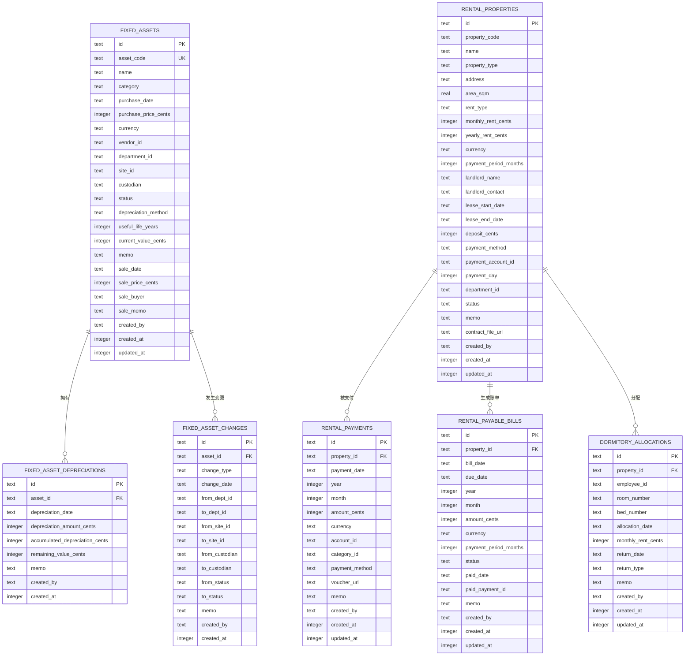

# 资产与租赁数据模型

<cite>
**本文引用的文件**
- [schema.ts](file://backend/src/db/schema.ts)
- [FixedAssetService.ts](file://backend/src/services/FixedAssetService.ts)
- [FixedAssetDepreciationService.ts](file://backend/src/services/FixedAssetDepreciationService.ts)
- [FixedAssetChangeService.ts](file://backend/src/services/FixedAssetChangeService.ts)
- [RentalPropertyService.ts](file://backend/src/services/RentalPropertyService.ts)
- [RentalPaymentService.ts](file://backend/src/services/RentalPaymentService.ts)
- [DormitoryAllocationService.ts](file://backend/src/services/DormitoryAllocationService.ts)
- [fixed-assets.ts](file://backend/src/routes/v2/fixed-assets.ts)
- [rental.ts](file://backend/src/routes/v2/rental.ts)
- [FinanceService.ts](file://backend/src/services/FinanceService.ts)
- [cash_flows 表定义](file://backend/src/db/schema.sql)
</cite>

## 目录
1. [简介](#简介)
2. [项目结构](#项目结构)
3. [核心组件](#核心组件)
4. [架构总览](#架构总览)
5. [详细组件分析](#详细组件分析)
6. [依赖关系分析](#依赖关系分析)
7. [性能考量](#性能考量)
8. [故障排查指南](#故障排查指南)
9. [结论](#结论)
10. [附录](#附录)

## 简介
本文件系统性梳理财务系统中的“资产与租赁”数据模型，重点覆盖以下核心表与服务：
- 固定资产：fixedAssets
- 固定资产折旧：fixedAssetDepreciations
- 资产变更记录：fixedAssetChanges
- 资产分配：fixedAssetAllocations
- 租赁物业：rentalProperties
- 租金支付：rentalPayments
- 应付账单：rentalPayableBills
- 宿舍分配：dormitoryAllocations
- 资产变更记录：rentalChanges

文档从数据结构、业务流程、状态机、服务层实现、路由接口、以及 ER 关系图等多个维度进行深入解析，并提供面向非技术读者的可读化说明与最佳实践建议。

## 项目结构
围绕资产与租赁主题，后端采用分层设计：
- 数据层：Drizzle ORM 定义的 SQLite 表结构
- 服务层：针对各实体的业务服务（如 FixedAssetService、RentalPaymentService 等）
- 路由层：OpenAPI 路由定义，封装权限校验与响应格式
- 金融集成：通过 FinanceService 与 cash_flows、account_transactions 进行资金流水联动

图表来源
- [schema.ts](file://backend/src/db/schema.ts#L506-L673)
- [FixedAssetService.ts](file://backend/src/services/FixedAssetService.ts#L1-L608)
- [FixedAssetDepreciationService.ts](file://backend/src/services/FixedAssetDepreciationService.ts#L1-L79)
- [FixedAssetChangeService.ts](file://backend/src/services/FixedAssetChangeService.ts#L1-L115)
- [RentalPropertyService.ts](file://backend/src/services/RentalPropertyService.ts#L1-L291)
- [RentalPaymentService.ts](file://backend/src/services/RentalPaymentService.ts#L1-L400)
- [DormitoryAllocationService.ts](file://backend/src/services/DormitoryAllocationService.ts#L1-L177)
- [FinanceService.ts](file://backend/src/services/FinanceService.ts#L1-L200)
- [fixed-assets.ts](file://backend/src/routes/v2/fixed-assets.ts#L1-L800)
- [rental.ts](file://backend/src/routes/v2/rental.ts#L1-L800)

章节来源
- [schema.ts](file://backend/src/db/schema.ts#L506-L673)
- [fixed-assets.ts](file://backend/src/routes/v2/fixed-assets.ts#L1-L800)
- [rental.ts](file://backend/src/routes/v2/rental.ts#L1-L800)

## 核心组件
本节聚焦四大核心实体及其关键字段与业务含义。

- 固定资产（fixedAssets）
  - 关键字段：资产编号、名称、类别、采购日期、采购价（分）、币种、供应商、部门、站点、保管人、状态、折旧方法、使用年限、当前净值、销售相关字段、备注、创建者、时间戳
  - 状态机（status）：in_use、idle、maintenance、scrapped、sold
  - 用途：全生命周期管理（采购、折旧、调拨、处置）

- 固定资产折旧（fixedAssetDepreciations）
  - 关键字段：资产ID、折旧日期、折旧金额（分）、累计折旧（分）、剩余价值（分）、备注、创建者、时间戳
  - 作用：记录每次折旧明细，驱动资产净值更新

- 租赁物业（rentalProperties）
  - 关键字段：物业编号、名称、类型（办公/宿舍/公寓/仓库）、地址、面积、计租方式（月/年）、月租/年租、币种、付款周期（月）、房东姓名/联系方式、起止租期、押金、付款方式、付款账户、付款日、部门、状态、备注、合同文件、创建者、时间戳
  - 状态：active、inactive

- 租金支付（rentalPayments）
  - 关键字段：物业ID、支付日期、年、月、金额（分）、币种、账户、科目、付款方式、凭证附件、备注、创建者、时间戳
  - 作用：记录实际付款，联动应付账单状态

- 应付账单（rentalPayableBills）
  - 关键字段：物业ID、开票日、到期日、年、月、金额（分）、币种、付款周期、状态（unpaid/paid）、实付日期、对应支付ID、备注、创建者、时间戳
  - 作用：自动生成与跟踪待付租金

- 资产变更记录（fixedAssetChanges）
  - 关键字段：资产ID、变更类型（状态变更、转移、分配、归还、采购、处置）、变更日期、来源/目标部门/站点/保管人、来源/目标状态、备注、创建者、时间戳
  - 作用：审计追踪资产全生命周期变更

- 宿舍分配（dormitoryAllocations）
  - 关键字段：物业ID、员工ID、房间号/床号、分配日期、月租（分）、归还日期、归还类型、备注、创建者、时间戳
  - 作用：宿舍类资产的人员分配与归还管理

章节来源
- [schema.ts](file://backend/src/db/schema.ts#L506-L673)

## 架构总览
下图展示资产、折旧、物业、租金支付、应付账单之间的 ER 关系与流向。

图表来源
- [schema.ts](file://backend/src/db/schema.ts#L506-L673)

## 详细组件分析

### 固定资产（fixedAssets）全生命周期管理
- 采购：通过路由创建资产并联动生成现金流水与会计交易记录，同时写入资产变更记录
- 折旧：按期或按次创建折旧记录，自动更新累计折旧与剩余价值，并同步更新资产净值
- 调拨/转移：记录部门、站点、保管人的变更，形成变更日志
- 处置（变卖）：更新资产状态为 sold，并生成收入流水与会计交易
- 删除：存在折旧记录时禁止删除，确保历史可追溯

图表来源
- [fixed-assets.ts](file://backend/src/routes/v2/fixed-assets.ts#L646-L692)
- [FixedAssetService.ts](file://backend/src/services/FixedAssetService.ts#L313-L468)
- [FinanceService.ts](file://backend/src/services/FinanceService.ts#L1-L200)

章节来源
- [FixedAssetService.ts](file://backend/src/services/FixedAssetService.ts#L1-L608)
- [FixedAssetDepreciationService.ts](file://backend/src/services/FixedAssetDepreciationService.ts#L1-L79)
- [FixedAssetChangeService.ts](file://backend/src/services/FixedAssetChangeService.ts#L1-L115)
- [fixed-assets.ts](file://backend/src/routes/v2/fixed-assets.ts#L1-L800)

### 固定资产折旧（fixedAssetDepreciations）明细记录
- 业务要点
  - 按资产维度累加折旧，限制累计折旧不超过购买价
  - 同步更新资产表的 current_value_cents
  - 支持多条折旧记录，便于月结与审计
- 错误处理
  - 当累计折旧超过购买价时拒绝创建折旧记录

图表来源
- [FixedAssetDepreciationService.ts](file://backend/src/services/FixedAssetDepreciationService.ts#L1-L79)

章节来源
- [FixedAssetDepreciationService.ts](file://backend/src/services/FixedAssetDepreciationService.ts#L1-L79)

### 租赁物业（rentalProperties）管理
- 业务要点
  - 支持按类型、状态、部门过滤
  - 关键字段变更会生成变更记录（rentalChanges）
  - 删除前检查是否存在付款记录，避免破坏历史
- 字段说明
  - 计租方式（monthly/yearly）、付款周期、付款日、房东信息、部门（仅办公类）
  - 状态：active/inactive

图表来源
- [RentalPropertyService.ts](file://backend/src/services/RentalPropertyService.ts#L1-L291)
- [schema.ts](file://backend/src/db/schema.ts#L576-L603)

章节来源
- [RentalPropertyService.ts](file://backend/src/services/RentalPropertyService.ts#L1-L291)
- [schema.ts](file://backend/src/db/schema.ts#L576-L603)

### 租金支付（rentalPayments）与应付账单（rentalPayableBills）
- 业务要点
  - 按年/月唯一性约束，避免重复支付
  - 支付时生成现金流水与会计交易，并将对应应付账单标记为 paid
  - 支持批量生成应付账单（基于租期、付款周期、付款日）
- 流程图

图表来源
- [RentalPaymentService.ts](file://backend/src/services/RentalPaymentService.ts#L1-L211)
- [cash_flows 表定义](file://backend/src/db/schema.sql#L511-L543)

章节来源
- [RentalPaymentService.ts](file://backend/src/services/RentalPaymentService.ts#L1-L400)

### 宿舍分配（dormitoryAllocations）
- 业务要点
  - 仅对宿舍类型物业生效
  - 同一员工在同一物业不可重复分配（未归还）
  - 归还时更新归还日期与备注
- 与租赁物业的关系
  - 通过 propertyId 关联 rentalProperties
  - 与 rentalPayments 无直接关联，但可作为员工费用核算的参考

章节来源
- [DormitoryAllocationService.ts](file://backend/src/services/DormitoryAllocationService.ts#L1-L177)
- [schema.ts](file://backend/src/db/schema.ts#L641-L654)

## 依赖关系分析
- 服务间耦合
  - FixedAssetService 依赖 FinanceService 以生成凭证与会计分录
  - RentalPaymentService 依赖 FinanceService 生成凭证与会计分录
  - 固定资产与租赁模块均依赖公共的 cash_flows 与 account_transactions 表
- 外部依赖
  - Drizzle ORM（SQLite）
  - 权限中间件（路由层）
  - 响应封装工具（apiSuccess、错误码）

图表来源
- [FixedAssetService.ts](file://backend/src/services/FixedAssetService.ts#L1-L608)
- [RentalPaymentService.ts](file://backend/src/services/RentalPaymentService.ts#L1-L400)
- [FinanceService.ts](file://backend/src/services/FinanceService.ts#L1-L200)
- [cash_flows 表定义](file://backend/src/db/schema.sql#L511-L543)
- [fixed-assets.ts](file://backend/src/routes/v2/fixed-assets.ts#L1-L800)
- [rental.ts](file://backend/src/routes/v2/rental.ts#L1-L800)

章节来源
- [schema.ts](file://backend/src/db/schema.ts#L506-L673)
- [fixed-assets.ts](file://backend/src/routes/v2/fixed-assets.ts#L1-L800)
- [rental.ts](file://backend/src/routes/v2/rental.ts#L1-L800)

## 性能考量
- 查询优化
  - 对高频查询字段建立索引（如 cash_flows 的业务日期、类型、冲正关联字段）
  - 使用分页与条件过滤，避免一次性加载大量折旧与支付明细
- 事务边界
  - 资产采购、变卖、折旧、支付等关键流程均在事务内执行，保证一致性
- 数据规模
  - 折旧与支付记录可能随时间增长，建议定期归档历史数据或按月分区
- 缓存策略
  - 对只读列表（如资产分类、币种、部门）可引入短期缓存

[本节为通用指导，无需特定文件引用]

## 故障排查指南
- 固定资产
  - 删除失败：若存在折旧记录，服务会拒绝删除；请先清理折旧或迁移折旧数据
  - 状态变更：更新资产状态会自动写入变更记录；可通过变更记录回溯历史
- 折旧
  - 折旧超限：累计折旧不得高于购买价；请检查折旧金额与周期
- 租赁
  - 重复支付：同一物业同一年/月只能有一条支付记录；请核对账单状态
  - 无法删除物业：若存在付款记录，服务会拒绝删除；请先删除相关支付
- 账户与币种
  - 支付与采购需与账户币种一致；否则会报错

章节来源
- [FixedAssetService.ts](file://backend/src/services/FixedAssetService.ts#L288-L310)
- [FixedAssetDepreciationService.ts](file://backend/src/services/FixedAssetDepreciationService.ts#L42-L47)
- [RentalPaymentService.ts](file://backend/src/services/RentalPaymentService.ts#L87-L104)
- [RentalPropertyService.ts](file://backend/src/services/RentalPropertyService.ts#L213-L239)

## 结论
本数据模型围绕“资产全生命周期”与“租赁收支闭环”构建，通过严格的事务与审计机制保障数据一致性与可追溯性。fixedAssets 与 fixedAssetDepreciations 实现了折旧的精细化管理；rentalProperties 与 rentalPayments/rentalPayableBills 形成完整的租务闭环；配套的变更记录与宿舍分配进一步完善了资产管理的完整性与合规性。建议在生产环境中结合权限控制、审计日志与定期对账，持续优化查询与事务性能。

[本节为总结性内容，无需特定文件引用]

## 附录
- 状态机速查
  - 固定资产状态：in_use、idle、maintenance、scrapped、sold
  - 租赁物业状态：active、inactive
  - 应付账单状态：unpaid、paid
- 常用字段单位
  - 金额统一使用“分”存储，便于精确计算与跨币种对账
- 接口一览（节选）
  - 固定资产：创建、更新、删除、折旧、转移、采购、变卖、列表、详情
  - 租赁：物业列表、详情、创建、更新、删除、变更记录、支付列表、创建支付、删除支付、生成应付账单、应付账单列表、标记已付

章节来源
- [fixed-assets.ts](file://backend/src/routes/v2/fixed-assets.ts#L1-L800)
- [rental.ts](file://backend/src/routes/v2/rental.ts#L1-L800)