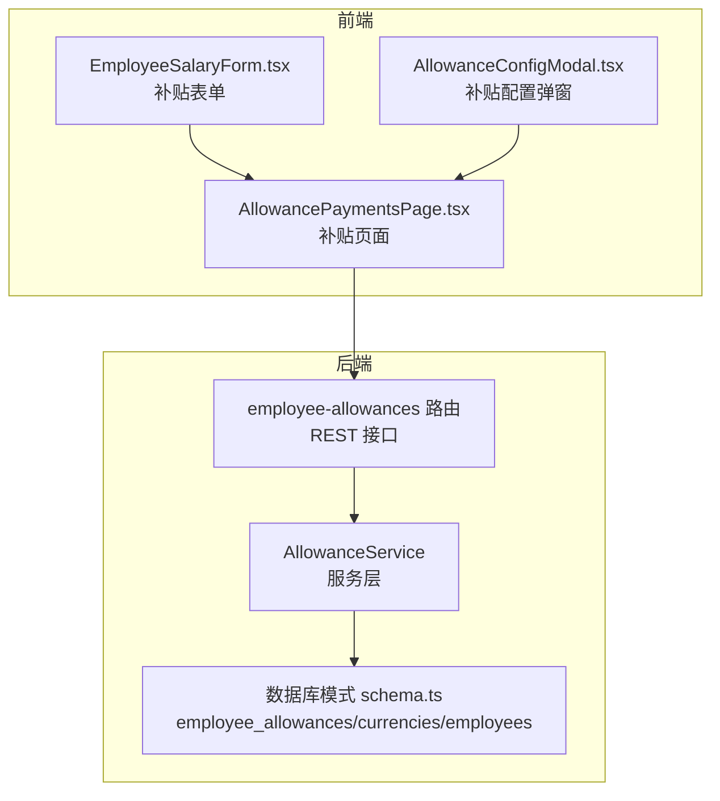
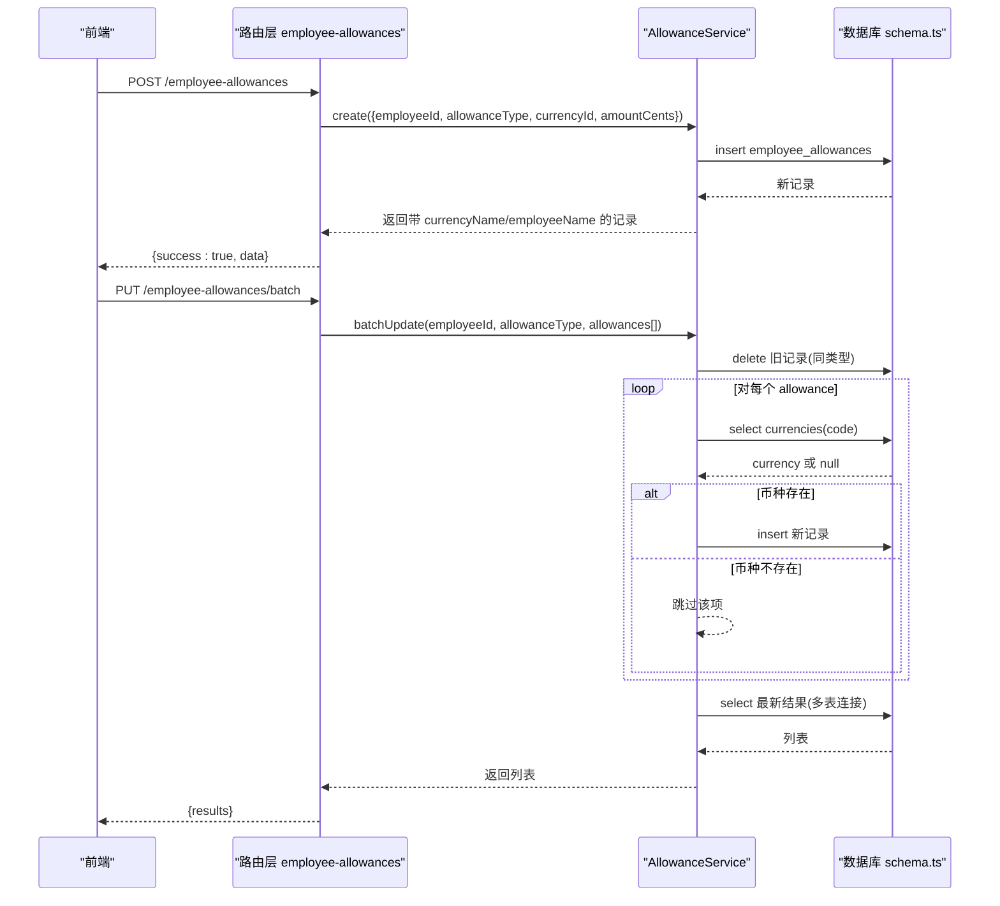
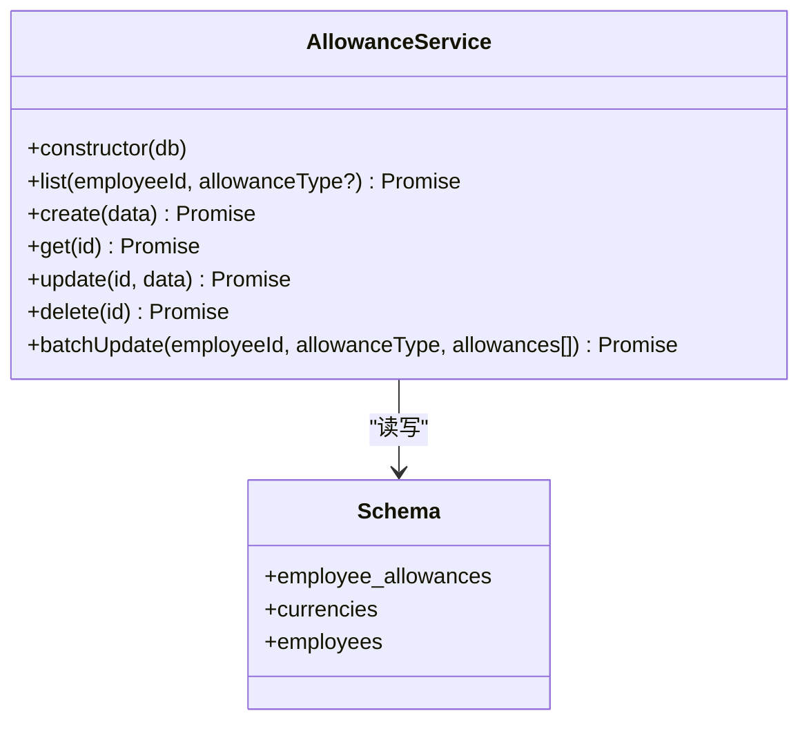
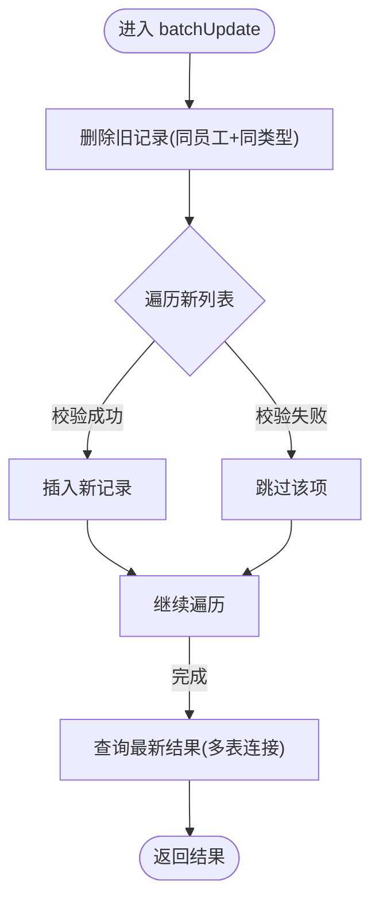

# 员工津贴服务

<cite>
**本文引用的文件**
- [AllowanceService.ts](file://backend/src/services/AllowanceService.ts)
- [schema.ts](file://backend/src/db/schema.ts)
- [employee-allowances.ts](file://backend/src/routes/v2/employee-allowances.ts)
- [AllowanceService.test.ts](file://backend/test/services/AllowanceService.test.ts)
- [employee-allowances.test.ts](file://backend/test/routes/employee-allowances.test.ts)
- [EmployeeSalaryForm.tsx](file://frontend/src/features/employees/components/forms/EmployeeSalaryForm.tsx)
- [AllowanceConfigModal.tsx](file://frontend/src/features/employees/components/modals/AllowanceConfigModal.tsx)
- [AllowancePaymentsPage.tsx](file://frontend/src/features/hr/pages/AllowancePaymentsPage.tsx)
- [openapi.json](file://backend/openapi.json)
</cite>

## 目录
1. [简介](#简介)
2. [项目结构](#项目结构)
3. [核心组件](#核心组件)
4. [架构总览](#架构总览)
5. [详细组件分析](#详细组件分析)
6. [依赖关系分析](#依赖关系分析)
7. [性能与精度考虑](#性能与精度考虑)
8. [故障排查指南](#故障排查指南)
9. [结论](#结论)

## 简介
本文件系统性解析 AllowanceService 的实现，重点覆盖以下方面：
- 津贴配置：通过 create 方法为员工按类型配置多币种补贴。
- 查询能力：通过 list 和 get 方法查询单条或多条津贴记录，并通过多表连接返回员工姓名与币种名称。
- 批量更新：通过 batchUpdate 实现“先删后插”的策略，确保同一类型下只保留最新配置；同时进行币种存在性校验。
- 更新与删除：提供 update 与 delete 方法，分别用于修改金额与删除记录。
- 数据精度设计：amountCents 字段用于避免浮点数精度问题，统一以“分”为单位存储。
- 多表连接查询：在查询接口中通过左连接 employee_allowances、currencies、employees 获取关联信息。

## 项目结构
AllowanceService 位于后端服务层，配合路由层暴露 REST 接口，前端通过表单与模态框提交配置，最终落库到 employee_allowances 表，并与 currencies、employees 表建立关联。

图表来源
- [AllowanceService.ts](file://backend/src/services/AllowanceService.ts#L1-L177)
- [employee-allowances.ts](file://backend/src/routes/v2/employee-allowances.ts#L89-L224)
- [schema.ts](file://backend/src/db/schema.ts#L213-L239)
- [EmployeeSalaryForm.tsx](file://frontend/src/features/employees/components/forms/EmployeeSalaryForm.tsx#L16-L147)
- [AllowanceConfigModal.tsx](file://frontend/src/features/employees/components/modals/AllowanceConfigModal.tsx#L1-L30)
- [AllowancePaymentsPage.tsx](file://frontend/src/features/hr/pages/AllowancePaymentsPage.tsx#L21-L51)

章节来源
- [AllowanceService.ts](file://backend/src/services/AllowanceService.ts#L1-L177)
- [employee-allowances.ts](file://backend/src/routes/v2/employee-allowances.ts#L89-L224)
- [schema.ts](file://backend/src/db/schema.ts#L213-L239)

## 核心组件
- AllowanceService：提供 list、create、get、update、delete、batchUpdate 六大方法，负责与数据库交互。
- 路由层 employee-allowances：将 HTTP 请求映射到服务层方法，处理参数校验与响应封装。
- 数据库模式：employee_allowances、currencies、employees 三张表构成津贴数据模型。

章节来源
- [AllowanceService.ts](file://backend/src/services/AllowanceService.ts#L1-L177)
- [employee-allowances.ts](file://backend/src/routes/v2/employee-allowances.ts#L89-L224)
- [schema.ts](file://backend/src/db/schema.ts#L213-L239)

## 架构总览
后端采用“路由 -> 服务 -> 数据库”的分层架构。路由层负责请求解析与响应包装，服务层负责业务逻辑与数据访问，数据库层使用 Drizzle ORM 进行 SQLite 访问。

图表来源
- [employee-allowances.ts](file://backend/src/routes/v2/employee-allowances.ts#L122-L224)
- [AllowanceService.ts](file://backend/src/services/AllowanceService.ts#L31-L175)
- [schema.ts](file://backend/src/db/schema.ts#L213-L239)

## 详细组件分析

### AllowanceService 类与方法
- list(employeeId, allowanceType?)
  - 功能：按员工与可选类型查询津贴，返回包含 allowance、currencyName、employeeName 的结果集。
  - 关键点：使用左连接 currencies 与 employees，按 allowanceType 与 currency.code 排序。
- create(data)
  - 功能：创建一条津贴记录，自动生成 id 与时间戳，返回刚创建的记录（含关联名）。
- get(id)
  - 功能：按 id 查询单条记录并返回关联名。
- update(id, { amountCents })
  - 功能：更新指定记录的 amountCents 并更新时间戳，返回更新后的记录。
- delete(id)
  - 功能：删除指定 id 的记录，若不存在则返回 null。
- batchUpdate(employeeId, allowanceType, allowances[])
  - 功能：对某员工某类型进行批量替换，策略为“先删后插”，并对每条 allowance 校验币种存在性。

图表来源
- [AllowanceService.ts](file://backend/src/services/AllowanceService.ts#L1-L177)
- [schema.ts](file://backend/src/db/schema.ts#L213-L239)

章节来源
- [AllowanceService.ts](file://backend/src/services/AllowanceService.ts#L11-L175)
- [schema.ts](file://backend/src/db/schema.ts#L213-L239)

### 路由层对接
- POST /employee-allowances
  - 参数：employeeId、allowanceType、currencyId、amountCents
  - 返回：带 currencyName 与 employeeName 的完整记录
- PUT /employee-allowances/batch
  - 参数：employeeId、allowanceType、allowances[{ currencyId, amountCents }]
  - 返回：批量更新后的列表，包含关联名

章节来源
- [employee-allowances.ts](file://backend/src/routes/v2/employee-allowances.ts#L89-L224)
- [openapi.json](file://backend/openapi.json#L10145-L10182)

### 前端交互
- 表单与模态框
  - EmployeeSalaryForm.tsx：展示补贴类型（living、housing、transportation、meal），支持多币种配置。
  - AllowanceConfigModal.tsx：按类型弹窗配置补贴，内部使用 amountCents 与 currencyId。
  - AllowancePaymentsPage.tsx：HR 页面展示与操作补贴发放。

章节来源
- [EmployeeSalaryForm.tsx](file://frontend/src/features/employees/components/forms/EmployeeSalaryForm.tsx#L16-L147)
- [AllowanceConfigModal.tsx](file://frontend/src/features/employees/components/modals/AllowanceConfigModal.tsx#L1-L30)
- [AllowancePaymentsPage.tsx](file://frontend/src/features/hr/pages/AllowancePaymentsPage.tsx#L21-L51)

### 批量更新流程（batchUpdate）
- 步骤概览
  - 删除该员工该类型的所有旧记录
  - 遍历新列表：校验币种存在性，存在则插入新记录
  - 返回该员工该类型的新列表（多表连接）

图表来源
- [AllowanceService.ts](file://backend/src/services/AllowanceService.ts#L103-L175)

章节来源
- [AllowanceService.ts](file://backend/src/services/AllowanceService.ts#L103-L175)
- [AllowanceService.test.ts](file://backend/test/services/AllowanceService.test.ts#L136-L171)
- [employee-allowances.test.ts](file://backend/test/routes/employee-allowances.test.ts#L161-L185)

### 多表连接查询
- list/get 使用左连接 currencies 与 employees，返回 currencyName 与 employeeName 字段，便于前端直接展示。
- OpenAPI 定义了返回字段结构，包含 id、employeeId、allowanceType、currencyId、amountCents、currencyName、employeeName。

章节来源
- [AllowanceService.ts](file://backend/src/services/AllowanceService.ts#L11-L101)
- [openapi.json](file://backend/openapi.json#L10145-L10182)

## 依赖关系分析
- 服务层依赖 Drizzle ORM 与 schema.ts 中的表定义。
- 路由层依赖服务层实例，负责参数校验与审计日志。
- 前端依赖路由层提供的接口，使用 amountCents 与 currencyId 进行配置。

图表来源
- [employee-allowances.ts](file://backend/src/routes/v2/employee-allowances.ts#L89-L224)
- [AllowanceService.ts](file://backend/src/services/AllowanceService.ts#L1-L177)
- [schema.ts](file://backend/src/db/schema.ts#L213-L239)

章节来源
- [employee-allowances.ts](file://backend/src/routes/v2/employee-allowances.ts#L89-L224)
- [AllowanceService.ts](file://backend/src/services/AllowanceService.ts#L1-L177)
- [schema.ts](file://backend/src/db/schema.ts#L213-L239)

## 性能与精度考虑
- amountCents 设计
  - 采用整数“分”为单位，避免浮点数精度误差，适合财务场景。
  - 前端表单与模态框均使用 amountCents 字段，保证前后一致。
- 批量更新策略
  - “先删后插”确保同一类型下只保留最新配置，减少冗余数据。
  - 对每条 allowance 校验币种存在性，避免脏数据入库。
- 查询排序
  - list/get 按 allowanceType 与 currency.code 排序，提升展示一致性与可读性。

章节来源
- [AllowanceService.ts](file://backend/src/services/AllowanceService.ts#L31-L175)
- [EmployeeSalaryForm.tsx](file://frontend/src/features/employees/components/forms/EmployeeSalaryForm.tsx#L110-L139)
- [AllowanceConfigModal.tsx](file://frontend/src/features/employees/components/modals/AllowanceConfigModal.tsx#L1-L30)

## 故障排查指南
- 批量更新无返回或部分缺失
  - 检查 allowances 数组中是否包含非法项（currencyId 缺失或币种不存在），服务层会跳过这些项。
  - 参考测试用例验证行为。
- 查询不到关联名
  - 确认 currencies 与 employees 表中对应记录存在且状态有效。
- 删除后仍可查询
  - 确认删除方法返回值与 get 查询结果是否一致，检查 id 是否正确。
- 前端金额显示异常
  - 确认前端使用 amountCents 字段而非元，避免除法导致的浮点误差。

章节来源
- [AllowanceService.test.ts](file://backend/test/services/AllowanceService.test.ts#L1-L172)
- [employee-allowances.test.ts](file://backend/test/routes/employee-allowances.test.ts#L146-L185)
- [AllowanceService.ts](file://backend/src/services/AllowanceService.ts#L74-L101)

## 结论
AllowanceService 提供了完整的员工津贴配置、查询与批量更新能力，采用“先删后插”的策略与币种校验，确保数据一致性与准确性。通过 amountCents 字段与多表连接查询，既满足财务精度要求，又便于前端展示。建议在生产环境中持续关注审计日志与错误监控，确保批量更新过程的可观测性与可回溯性。