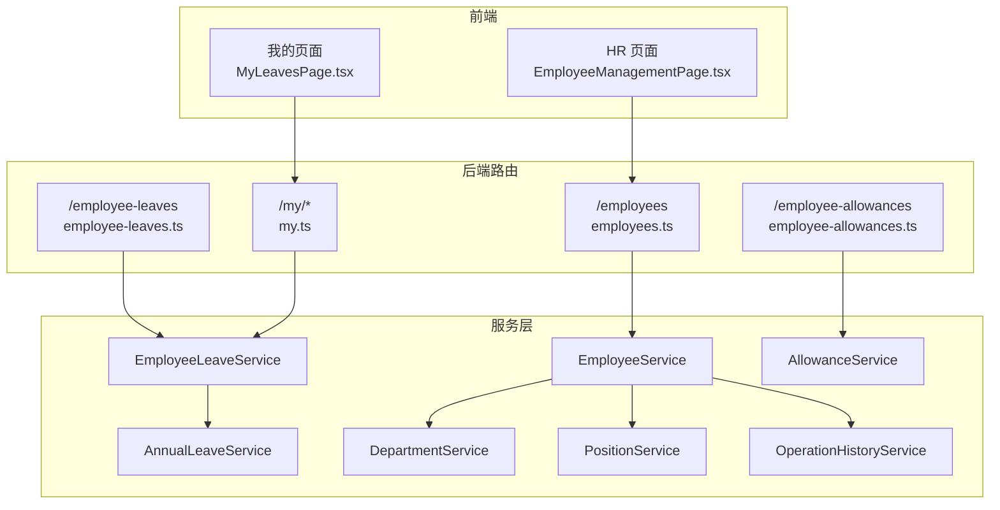
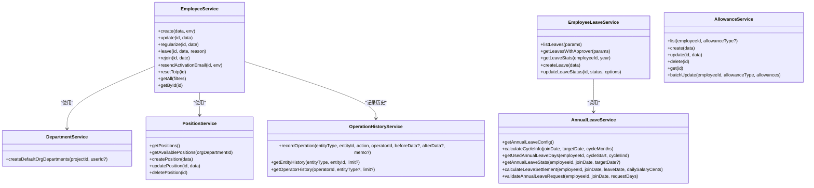
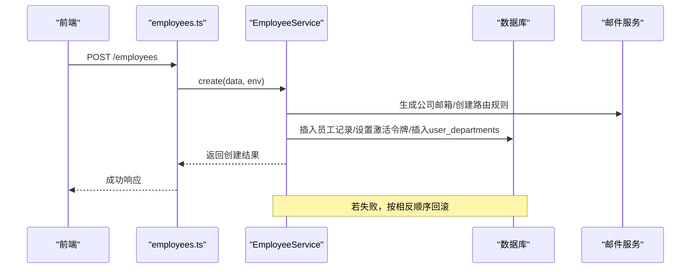
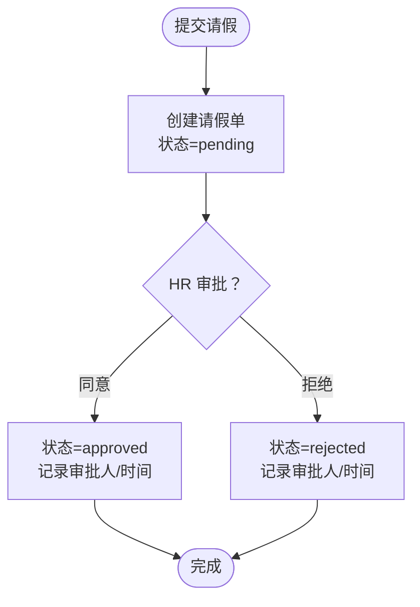
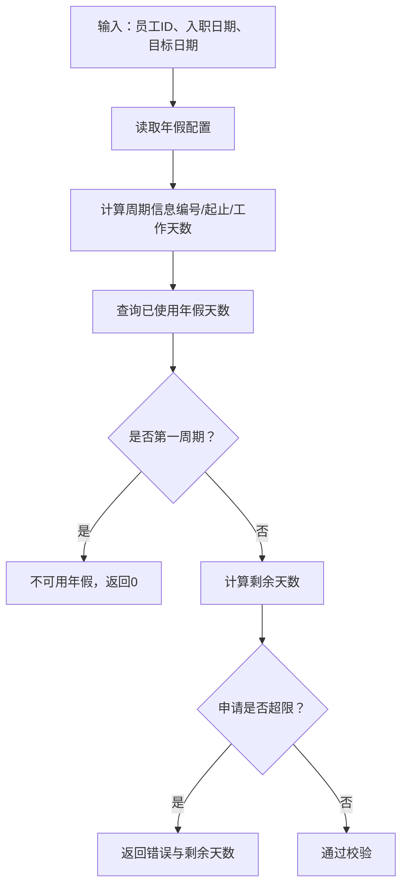
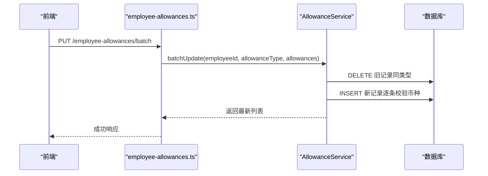
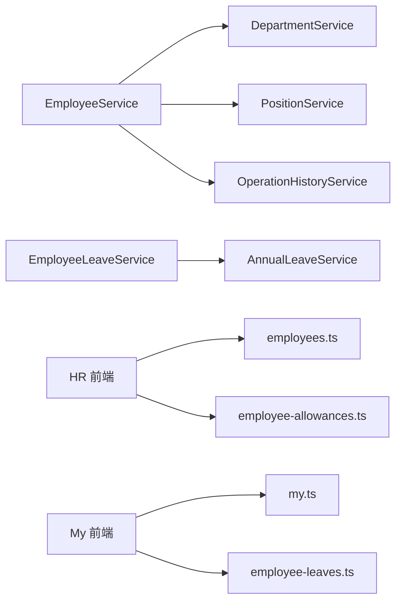

# 员工管理服务

<cite>
**本文引用的文件**
- [backend/src/services/EmployeeService.ts](file://backend/src/services/EmployeeService.ts)
- [backend/src/services/EmployeeLeaveService.ts](file://backend/src/services/EmployeeLeaveService.ts)
- [backend/src/services/AnnualLeaveService.ts](file://backend/src/services/AnnualLeaveService.ts)
- [backend/src/services/AllowanceService.ts](file://backend/src/services/AllowanceService.ts)
- [backend/src/services/DepartmentService.ts](file://backend/src/services/DepartmentService.ts)
- [backend/src/services/PositionService.ts](file://backend/src/services/PositionService.ts)
- [backend/src/services/OperationHistoryService.ts](file://backend/src/services/OperationHistoryService.ts)
- [backend/src/routes/v2/employees.ts](file://backend/src/routes/v2/employees.ts)
- [backend/src/routes/v2/employee-leaves.ts](file://backend/src/routes/v2/employee-leaves.ts)
- [backend/src/routes/v2/employee-allowances.ts](file://backend/src/routes/v2/employee-allowances.ts)
- [backend/src/routes/v2/my.ts](file://backend/src/routes/v2/my.ts)
- [frontend/src/features/hr/pages/EmployeeManagementPage.tsx](file://frontend/src/features/hr/pages/EmployeeManagementPage.tsx)
- [frontend/src/features/my/pages/MyLeavesPage.tsx](file://frontend/src/features/my/pages/MyLeavesPage.tsx)
- [frontend/src/features/employees/components/modals/EditEmployeeModal.tsx](file://frontend/src/features/employees/components/modals/EditEmployeeModal.tsx)
</cite>

## 目录
1. [简介](#简介)
2. [项目结构](#项目结构)
3. [核心组件](#核心组件)
4. [架构总览](#架构总览)
5. [详细组件分析](#详细组件分析)
6. [依赖分析](#依赖分析)
7. [性能考虑](#性能考虑)
8. [故障排查指南](#故障排查指南)
9. [结论](#结论)
10. [附录](#附录)

## 简介
本文件面向员工管理相关服务模块的实现细节，围绕以下目标展开：
- 深入解析 EmployeeService 如何封装员工全生命周期管理逻辑（入职、转正、离职、信息变更），以及与 DepartmentService、PositionService 的协作关系。
- 详解 EmployeeLeaveService 与 AnnualLeaveService 在请假流程中的职责划分，如何通过状态机管理请假单状态。
- 解释 AllowanceService 如何处理员工津贴配置与发放规则。
- 结合代码示例展示员工信息变更时，如何通过顺序执行与回滚策略保证数据一致性，并记录操作历史。
- 说明这些服务如何与前端 HR 模块与 my 模块集成，支持员工自助与 HR 管理两种场景。

## 项目结构
后端采用分层架构，服务层位于 backend/src/services，路由层位于 backend/src/routes/v2，前端位于 frontend/src。员工管理涉及的核心服务与路由如下：
- 服务层：EmployeeService、EmployeeLeaveService、AnnualLeaveService、AllowanceService、DepartmentService、PositionService、OperationHistoryService
- 路由层：employees.ts（HR 管理）、employee-leaves.ts（请假管理）、employee-allowances.ts（津贴管理）、my.ts（员工自助）

图表来源
- [backend/src/routes/v2/employees.ts](file://backend/src/routes/v2/employees.ts#L1-L602)
- [backend/src/routes/v2/employee-leaves.ts](file://backend/src/routes/v2/employee-leaves.ts#L1-L176)
- [backend/src/routes/v2/employee-allowances.ts](file://backend/src/routes/v2/employee-allowances.ts#L1-L261)
- [backend/src/routes/v2/my.ts](file://backend/src/routes/v2/my.ts#L1-L858)
- [backend/src/services/EmployeeService.ts](file://backend/src/services/EmployeeService.ts#L1-L758)
- [backend/src/services/EmployeeLeaveService.ts](file://backend/src/services/EmployeeLeaveService.ts#L1-L182)
- [backend/src/services/AnnualLeaveService.ts](file://backend/src/services/AnnualLeaveService.ts#L1-L227)
- [backend/src/services/AllowanceService.ts](file://backend/src/services/AllowanceService.ts#L1-L177)
- [backend/src/services/DepartmentService.ts](file://backend/src/services/DepartmentService.ts#L1-L182)
- [backend/src/services/PositionService.ts](file://backend/src/services/PositionService.ts#L1-L224)
- [backend/src/services/OperationHistoryService.ts](file://backend/src/services/OperationHistoryService.ts#L1-L108)

章节来源
- [backend/src/routes/v2/employees.ts](file://backend/src/routes/v2/employees.ts#L1-L602)
- [backend/src/routes/v2/employee-leaves.ts](file://backend/src/routes/v2/employee-leaves.ts#L1-L176)
- [backend/src/routes/v2/employee-allowances.ts](file://backend/src/routes/v2/employee-allowances.ts#L1-L261)
- [backend/src/routes/v2/my.ts](file://backend/src/routes/v2/my.ts#L1-L858)

## 核心组件
- EmployeeService：负责员工全生命周期管理（入职、转正、离职、信息变更、账号相关操作），并提供用户信息查询与权限相关能力。
- EmployeeLeaveService：负责请假申请的创建、状态更新与统计查询。
- AnnualLeaveService：负责年假配置、周期计算、已用天数统计、离职结算与超额校验。
- AllowanceService：负责员工津贴的增删改查与批量更新。
- DepartmentService/PositionService：提供组织部门与职位维度的数据与默认配置能力，支撑员工入职时的部门/职位选择与默认配置。
- OperationHistoryService：记录业务操作历史，便于审计与追溯。

章节来源
- [backend/src/services/EmployeeService.ts](file://backend/src/services/EmployeeService.ts#L1-L758)
- [backend/src/services/EmployeeLeaveService.ts](file://backend/src/services/EmployeeLeaveService.ts#L1-L182)
- [backend/src/services/AnnualLeaveService.ts](file://backend/src/services/AnnualLeaveService.ts#L1-L227)
- [backend/src/services/AllowanceService.ts](file://backend/src/services/AllowanceService.ts#L1-L177)
- [backend/src/services/DepartmentService.ts](file://backend/src/services/DepartmentService.ts#L1-L182)
- [backend/src/services/PositionService.ts](file://backend/src/services/PositionService.ts#L1-L224)
- [backend/src/services/OperationHistoryService.ts](file://backend/src/services/OperationHistoryService.ts#L1-L108)

## 架构总览
下图展示了员工管理相关服务之间的交互关系与数据流向。

图表来源
- [backend/src/services/EmployeeService.ts](file://backend/src/services/EmployeeService.ts#L1-L758)
- [backend/src/services/EmployeeLeaveService.ts](file://backend/src/services/EmployeeLeaveService.ts#L1-L182)
- [backend/src/services/AnnualLeaveService.ts](file://backend/src/services/AnnualLeaveService.ts#L1-L227)
- [backend/src/services/AllowanceService.ts](file://backend/src/services/AllowanceService.ts#L1-L177)
- [backend/src/services/DepartmentService.ts](file://backend/src/services/DepartmentService.ts#L1-L182)
- [backend/src/services/PositionService.ts](file://backend/src/services/PositionService.ts#L1-L224)
- [backend/src/services/OperationHistoryService.ts](file://backend/src/services/OperationHistoryService.ts#L1-L108)

## 详细组件分析

### EmployeeService：员工全生命周期管理
- 入职（create）
  - 生成公司邮箱、确保个人邮箱唯一、根据 orgDepartmentId 决定实际部门、读取职位以确定用户角色、创建员工记录、建立邮件路由规则、设置激活令牌、写入 user_departments。
  - 由于 D1 不支持传统事务，采用顺序执行与回滚策略：若任一步骤失败，按相反顺序删除已创建记录，保证原子性。
- 转正（regularize）
  - 将员工状态更新为“regular”，并记录转正日期。
- 离职（leave）
  - 将员工状态更新为“resigned”，标记为非活跃；同时禁用用户登录（通过邮箱字段更新）。
- 重新入职（rejoin）
  - 将员工状态重置为“probation”，启用账户并更新入职日期。
- 信息变更（update）
  - 支持多字段更新，包含部门/组织部门/职位/联系方式/工作安排/年假配置等；当变更部门时，同步维护 user_departments。
- 用户相关能力
  - 提供用户信息查询、职位权限查询、是否总部用户判断、用户组 ID 获取、用户部门 ID 列表与主部门 ID 获取等。

图表来源
- [backend/src/routes/v2/employees.ts](file://backend/src/routes/v2/employees.ts#L156-L241)
- [backend/src/services/EmployeeService.ts](file://backend/src/services/EmployeeService.ts#L20-L255)

章节来源
- [backend/src/services/EmployeeService.ts](file://backend/src/services/EmployeeService.ts#L1-L758)
- [backend/src/routes/v2/employees.ts](file://backend/src/routes/v2/employees.ts#L1-L602)

### EmployeeLeaveService：请假流程与状态机
- 数据模型
  - 请假单包含员工标识、类型、起止日期、天数、状态、审批人与审批时间等字段。
- 状态机
  - 状态包括：pending（待审批）、approved（已批准）、rejected（已拒绝）。状态更新时记录审批人与审批时间。
- 主要功能
  - 列表查询（支持按员工、状态、年份过滤）
  - 统计查询（按类型统计已用天数）
  - 创建请假单（初始状态为 pending）
  - 更新请假状态（支持批准/拒绝）

图表来源
- [backend/src/services/EmployeeLeaveService.ts](file://backend/src/services/EmployeeLeaveService.ts#L1-L182)
- [backend/src/routes/v2/employee-leaves.ts](file://backend/src/routes/v2/employee-leaves.ts#L1-L176)

章节来源
- [backend/src/services/EmployeeLeaveService.ts](file://backend/src/services/EmployeeLeaveService.ts#L1-L182)
- [backend/src/routes/v2/employee-leaves.ts](file://backend/src/routes/v2/employee-leaves.ts#L1-L176)

### AnnualLeaveService：年假配置与结算
- 年假配置
  - 从系统配置表读取周期月数、每周期天数、未休折算系数等参数。
- 周期计算
  - 根据入职日期与目标日期计算当前周期编号、周期起止、周期内工作天数等。
- 统计与校验
  - 统计某周期内已使用天数；校验申请是否超过剩余天数；计算离职结算金额（按比例与未休折算系数）。

图表来源
- [backend/src/services/AnnualLeaveService.ts](file://backend/src/services/AnnualLeaveService.ts#L1-L227)

章节来源
- [backend/src/services/AnnualLeaveService.ts](file://backend/src/services/AnnualLeaveService.ts#L1-L227)

### AllowanceService：津贴配置与发放规则
- 功能点
  - 列表查询（支持按员工与类型过滤）
  - 单条创建、更新、删除
  - 批量更新（先删除同类型旧记录，再插入新记录）
- 规则
  - 批量更新时对币种有效性进行校验；更新与删除均返回对应实体，便于前端展示。

图表来源
- [backend/src/routes/v2/employee-allowances.ts](file://backend/src/routes/v2/employee-allowances.ts#L160-L224)
- [backend/src/services/AllowanceService.ts](file://backend/src/services/AllowanceService.ts#L1-L177)

章节来源
- [backend/src/services/AllowanceService.ts](file://backend/src/services/AllowanceService.ts#L1-L177)
- [backend/src/routes/v2/employee-allowances.ts](file://backend/src/routes/v2/employee-allowances.ts#L1-L261)

### 与 DepartmentService、PositionService 的协作
- 入职时
  - 依据 orgDepartmentId 获取组织部门信息，决定实际部门（优先使用 orgDepartment 对应的项目部门，否则回退到“总部”部门）。
  - 依据 positionId 获取职位信息，确定用户角色与权限。
- 职位可用性
  - PositionService 提供按组织部门筛选可用职位的能力，并按级别分组返回。

章节来源
- [backend/src/services/EmployeeService.ts](file://backend/src/services/EmployeeService.ts#L85-L118)
- [backend/src/services/DepartmentService.ts](file://backend/src/services/DepartmentService.ts#L1-L182)
- [backend/src/services/PositionService.ts](file://backend/src/services/PositionService.ts#L1-L224)

### 数据一致性与操作历史
- 数据一致性
  - D1 不支持传统事务，EmployeeService 在 create/update 中采用顺序执行与回滚策略：若任一步骤失败，按相反顺序删除已创建记录，避免脏数据。
- 操作历史
  - OperationHistoryService 提供记录业务操作历史的能力，支持按实体类型/ID 查询历史，便于审计与问题追踪。

章节来源
- [backend/src/services/EmployeeService.ts](file://backend/src/services/EmployeeService.ts#L137-L255)
- [backend/src/services/OperationHistoryService.ts](file://backend/src/services/OperationHistoryService.ts#L1-L108)

### 前端集成：HR 与 my 模块
- HR 模块（EmployeeManagementPage）
  - 支持员工列表、状态筛选、账号管理（重置密码、启用/停用、发送激活邮件、重置2FA）、批量刷新等。
  - 通过 employees.ts 路由与 EmployeeService 交互。
- my 模块（MyLeavesPage）
  - 支持员工自助发起请假、查看统计与历史记录。
  - 通过 my.ts 路由与 EmployeeLeaveService 交互。
- 编辑员工（EditEmployeeModal）
  - 支持并行更新员工基本信息、薪资与各类补贴，确保一次提交完成多处变更。

章节来源
- [frontend/src/features/hr/pages/EmployeeManagementPage.tsx](file://frontend/src/features/hr/pages/EmployeeManagementPage.tsx#L1-L367)
- [frontend/src/features/my/pages/MyLeavesPage.tsx](file://frontend/src/features/my/pages/MyLeavesPage.tsx#L1-L183)
- [frontend/src/features/employees/components/modals/EditEmployeeModal.tsx](file://frontend/src/features/employees/components/modals/EditEmployeeModal.tsx#L1-L295)
- [backend/src/routes/v2/employees.ts](file://backend/src/routes/v2/employees.ts#L1-L602)
- [backend/src/routes/v2/my.ts](file://backend/src/routes/v2/my.ts#L1-L858)

## 依赖分析
- 服务间耦合
  - EmployeeService 依赖 DepartmentService 与 PositionService 以确定部门与职位信息。
  - EmployeeLeaveService 依赖 AnnualLeaveService 进行年假超额校验与统计。
  - EmployeeService 依赖 OperationHistoryService 记录业务操作历史。
- 外部依赖
  - 邮件路由服务（Cloudflare Email Routing）用于公司邮箱与个人邮箱的转发规则创建与验证。
  - 前端通过 OpenAPI 路由与后端交互，路由层负责鉴权、权限校验与参数校验。

图表来源
- [backend/src/services/EmployeeService.ts](file://backend/src/services/EmployeeService.ts#L1-L758)
- [backend/src/services/EmployeeLeaveService.ts](file://backend/src/services/EmployeeLeaveService.ts#L1-L182)
- [backend/src/services/AnnualLeaveService.ts](file://backend/src/services/AnnualLeaveService.ts#L1-L227)
- [backend/src/services/DepartmentService.ts](file://backend/src/services/DepartmentService.ts#L1-L182)
- [backend/src/services/PositionService.ts](file://backend/src/services/PositionService.ts#L1-L224)
- [backend/src/services/OperationHistoryService.ts](file://backend/src/services/OperationHistoryService.ts#L1-L108)
- [backend/src/routes/v2/employees.ts](file://backend/src/routes/v2/employees.ts#L1-L602)
- [backend/src/routes/v2/employee-leaves.ts](file://backend/src/routes/v2/employee-leaves.ts#L1-L176)
- [backend/src/routes/v2/employee-allowances.ts](file://backend/src/routes/v2/employee-allowances.ts#L1-L261)
- [backend/src/routes/v2/my.ts](file://backend/src/routes/v2/my.ts#L1-L858)

章节来源
- [backend/src/services/EmployeeService.ts](file://backend/src/services/EmployeeService.ts#L1-L758)
- [backend/src/services/EmployeeLeaveService.ts](file://backend/src/services/EmployeeLeaveService.ts#L1-L182)
- [backend/src/services/AnnualLeaveService.ts](file://backend/src/services/AnnualLeaveService.ts#L1-L227)
- [backend/src/services/DepartmentService.ts](file://backend/src/services/DepartmentService.ts#L1-L182)
- [backend/src/services/PositionService.ts](file://backend/src/services/PositionService.ts#L1-L224)
- [backend/src/services/OperationHistoryService.ts](file://backend/src/services/OperationHistoryService.ts#L1-L108)

## 性能考虑
- 查询优化
  - EmployeeService 的 getAll/getById 使用左连接查询员工、部门、组织部门与职位信息，建议在相关列上建立索引以提升排序与过滤性能。
- 事务与回滚
  - D1 不支持传统事务，EmployeeService 采用顺序执行与回滚策略，注意回滚成本与失败路径覆盖。
- 批量更新
  - AllowanceService 的批量更新先删除旧记录再插入新记录，建议在高并发场景下控制单次批量规模，避免锁竞争。
- 前端缓存
  - 前端使用 React Query 进行数据缓存与失效，合理设置查询键与过期策略，减少重复请求。

## 故障排查指南
- 入职失败回滚
  - 现象：创建员工后部分步骤失败导致数据不一致。
  - 排查：检查回滚逻辑是否按相反顺序删除已创建记录；确认邮件路由创建与激活令牌设置是否成功。
- 邮件路由验证
  - 现象：激活邮件无法发送或路由未生效。
  - 排查：确认 Cloudflare Email Routing 配置与验证状态；检查 ensureDestinationAddress 与 createRoutingRule 的调用结果。
- 请假状态异常
  - 现象：请假状态未正确更新或审批人缺失。
  - 排查：确认 updateLeaveStatus 的调用参数（status/memo/approvedBy）；检查路由层权限校验。
- 年假超额
  - 现象：申请被拒绝提示超出剩余天数。
  - 排查：调用 validateAnnualLeaveRequest 检查周期与剩余天数；核对 AnnualLeaveService 的配置参数。
- 津贴批量更新失败
  - 现象：批量更新后未生效或报错。
  - 排查：确认币种有效性；检查 AllowanceService 的批量更新流程与错误日志。

章节来源
- [backend/src/services/EmployeeService.ts](file://backend/src/services/EmployeeService.ts#L137-L255)
- [backend/src/services/EmployeeLeaveService.ts](file://backend/src/services/EmployeeLeaveService.ts#L153-L181)
- [backend/src/services/AnnualLeaveService.ts](file://backend/src/services/AnnualLeaveService.ts#L197-L226)
- [backend/src/services/AllowanceService.ts](file://backend/src/services/AllowanceService.ts#L103-L176)

## 结论
本模块通过清晰的服务边界与路由层协作，实现了员工全生命周期管理、请假流程与年假结算、津贴配置与发放等核心能力。尽管 D1 不支持传统事务，但通过顺序执行与回滚策略保障了数据一致性；AnnualLeaveService 提供了灵活的年假配置与校验机制；AllowanceService 支持高效的批量更新。前后端通过 OpenAPI 路由与权限校验紧密集成，既满足 HR 管理场景，也支持员工自助操作。

## 附录
- 员工自助与 HR 管理的关键接口
  - 入职：employees.ts 的 POST /employees
  - 信息变更：employees.ts 的 PUT /employees/{id}
  - 转正/离职/重新入职：employees.ts 的 POST /employees/{id}/regularize、POST /employees/{id}/leave、POST /employees/{id}/rejoin
  - 请假：employee-leaves.ts 的 GET /、POST /、PUT /{id}/status
  - 津贴：employee-allowances.ts 的 GET /employee-allowances、POST /employee-allowances、PUT /employee-allowances/batch、DELETE /employee-allowances/{id}
  - 我的请假：my.ts 的 GET /my/leaves、POST /my/leaves

章节来源
- [backend/src/routes/v2/employees.ts](file://backend/src/routes/v2/employees.ts#L1-L602)
- [backend/src/routes/v2/employee-leaves.ts](file://backend/src/routes/v2/employee-leaves.ts#L1-L176)
- [backend/src/routes/v2/employee-allowances.ts](file://backend/src/routes/v2/employee-allowances.ts#L1-L261)
- [backend/src/routes/v2/my.ts](file://backend/src/routes/v2/my.ts#L1-L858)