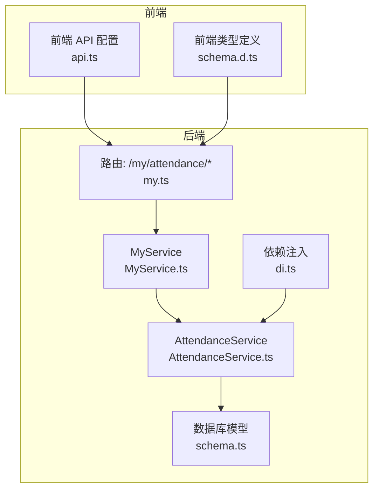
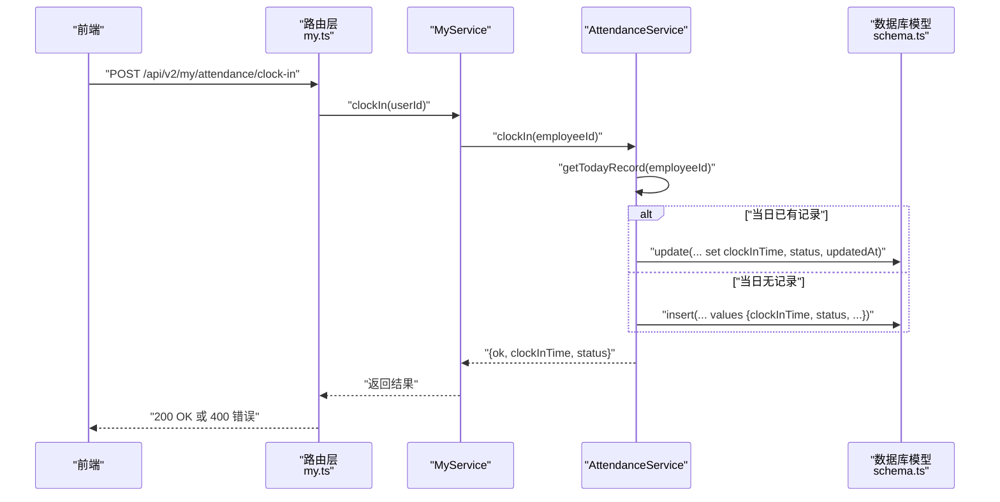
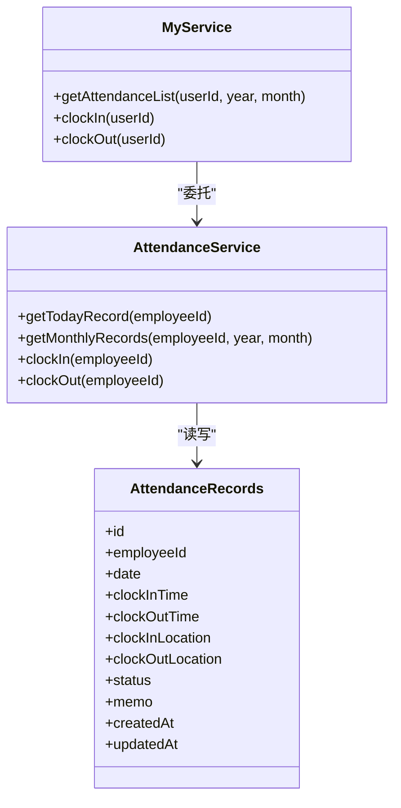
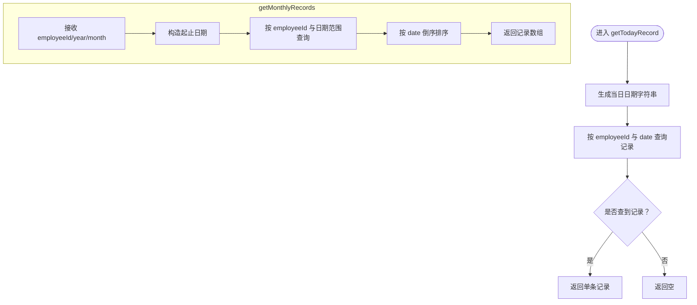
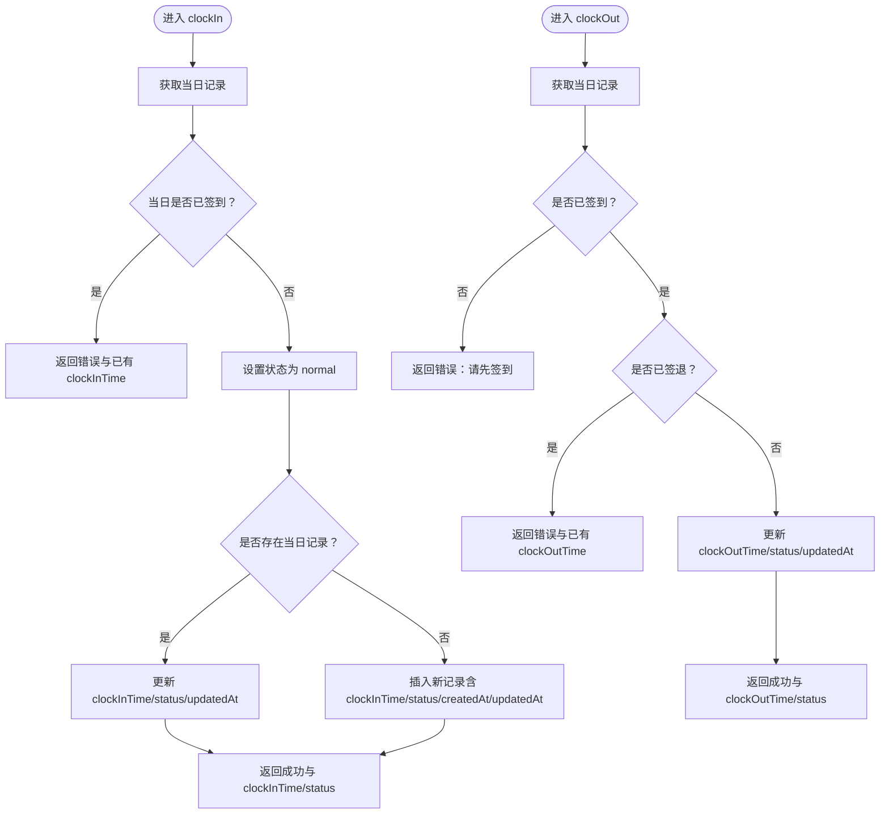
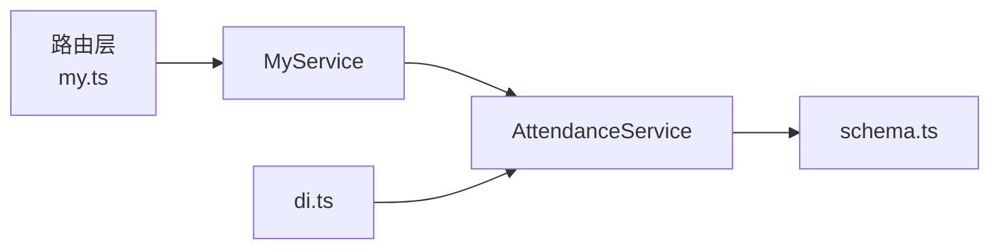

# 员工考勤服务

<cite>
**本文引用的文件**
- [AttendanceService.ts](file://backend/src/services/AttendanceService.ts)
- [schema.ts](file://backend/src/db/schema.ts)
- [my.ts](file://backend/src/routes/v2/my.ts)
- [MyService.ts](file://backend/src/services/MyService.ts)
- [di.ts](file://backend/src/middleware/di.ts)
- [schema.d.ts](file://frontend/src/types/schema.d.ts)
- [api.ts](file://frontend/src/config/api.ts)
</cite>

## 目录
1. [简介](#简介)
2. [项目结构](#项目结构)
3. [核心组件](#核心组件)
4. [架构总览](#架构总览)
5. [详细组件分析](#详细组件分析)
6. [依赖关系分析](#依赖关系分析)
7. [性能考量](#性能考量)
8. [故障排查指南](#故障排查指南)
9. [结论](#结论)

## 简介
本文件深入解析 AttendanceService 的实现，重点覆盖以下方面：
- 员工签到/签退流程与业务规则
- 考勤记录管理：当日记录查询与月度记录查询
- 防重复签到/签退的检查机制
- 考勤状态（正常、迟到、早退）的判定与存储
- 时间戳（clockInTime/clockOutTime）的存储与处理方式
- 结合代码路径示例，展示“当日首次签到”与“非首次签到”的不同逻辑

## 项目结构
后端采用分层设计：路由层负责接口定义与鉴权校验，服务层封装业务逻辑，数据库层使用 Drizzle ORM 映射 SQLite 表结构。考勤相关的关键文件如下：
- 路由层：/backend/src/routes/v2/my.ts 定义了 /my/attendance/* 接口
- 服务层：/backend/src/services/AttendanceService.ts 实现签到/签退与记录查询
- 上层服务：/backend/src/services/MyService.ts 将用户 ID 解析为员工 ID 并调用 AttendanceService
- 数据库模型：/backend/src/db/schema.ts 定义 attendance_records 表结构
- 依赖注入：/backend/src/middleware/di.ts 注入 AttendanceService 实例
- 前端类型与 API 配置：/frontend/src/types/schema.d.ts 与 /frontend/src/config/api.ts

图表来源
- [my.ts](file://backend/src/routes/v2/my.ts#L655-L858)
- [MyService.ts](file://backend/src/services/MyService.ts#L323-L348)
- [AttendanceService.ts](file://backend/src/services/AttendanceService.ts#L1-L98)
- [schema.ts](file://backend/src/db/schema.ts#L412-L424)
- [di.ts](file://backend/src/middleware/di.ts#L96-L96)

章节来源
- [my.ts](file://backend/src/routes/v2/my.ts#L655-L858)
- [MyService.ts](file://backend/src/services/MyService.ts#L323-L348)
- [AttendanceService.ts](file://backend/src/services/AttendanceService.ts#L1-L98)
- [schema.ts](file://backend/src/db/schema.ts#L412-L424)
- [di.ts](file://backend/src/middleware/di.ts#L96-L96)

## 核心组件
- AttendanceService：提供 getTodayRecord、getMonthlyRecords、clockIn、clockOut 四个核心方法，负责考勤数据的读取与写入。
- MyService：在路由层之上，将用户上下文转换为员工 ID，并委托 AttendanceService 执行具体业务。
- 路由层：定义 /my/attendance/today、/my/attendance、/my/attendance/clock-in、/my/attendance/clock-out 接口，进行鉴权与错误处理。
- 数据库模型：attendance_records 表包含日期、员工标识、上下班时间戳、位置信息、状态与时间戳等字段。

章节来源
- [AttendanceService.ts](file://backend/src/services/AttendanceService.ts#L1-L98)
- [MyService.ts](file://backend/src/services/MyService.ts#L323-L348)
- [my.ts](file://backend/src/routes/v2/my.ts#L655-L858)
- [schema.ts](file://backend/src/db/schema.ts#L412-L424)

## 架构总览
下图展示了从前端请求到数据库更新的整体流程，以及各组件之间的依赖关系。

图表来源
- [my.ts](file://backend/src/routes/v2/my.ts#L721-L788)
- [MyService.ts](file://backend/src/services/MyService.ts#L333-L339)
- [AttendanceService.ts](file://backend/src/services/AttendanceService.ts#L37-L72)
- [schema.ts](file://backend/src/db/schema.ts#L412-L424)

## 详细组件分析

### AttendanceService 类与方法
- getTodayRecord(employeeId)
  - 功能：按员工 ID 与当前日期查询当日考勤记录。
  - 关键点：使用 Drizzle ORM 的 where 条件组合，返回单条记录或空。
  - 复杂度：O(1) 查询，索引依赖表结构定义。
- getMonthlyRecords(employeeId, year, month)
  - 功能：查询指定年月的全部考勤记录并按日期倒序排列。
  - 关键点：使用 SQL 片段对日期范围进行过滤；返回多条记录。
- clockIn(employeeId)
  - 功能：员工当日签到。
  - 防重复签到检查：若当日记录存在且 clockInTime 已有值，则直接返回错误与已有时间戳。
  - 首次签到逻辑：若当日无记录则插入新记录；若已有记录则仅更新 clockInTime、status、updatedAt。
  - 状态：默认状态为“正常”，后续可扩展为“迟到/早退/迟到早退”。
- clockOut(employeeId)
  - 功能：员工当日签退。
  - 防重复签退检查：若不存在签到记录或 clockOutTime 已有值，则返回错误。
  - 签退更新：更新 clockOutTime 与 updatedAt；status 继承现有值（默认“正常”）。

图表来源
- [AttendanceService.ts](file://backend/src/services/AttendanceService.ts#L1-L98)
- [MyService.ts](file://backend/src/services/MyService.ts#L323-L348)
- [schema.ts](file://backend/src/db/schema.ts#L412-L424)

章节来源
- [AttendanceService.ts](file://backend/src/services/AttendanceService.ts#L1-L98)
- [schema.ts](file://backend/src/db/schema.ts#L412-L424)

### 考勤记录查询：getTodayRecord 与 getMonthlyRecords
- getTodayRecord
  - 输入：employeeId
  - 过程：构造“当日日期”字符串，查询 attendance_records 中匹配 employeeId 与 date 的记录。
  - 输出：单条记录对象或空。
- getMonthlyRecords
  - 输入：employeeId、year、month
  - 过程：构造起止日期字符串，使用 SQL 片段进行日期范围过滤，并按 date 倒序排序。
  - 输出：记录数组。

图表来源
- [AttendanceService.ts](file://backend/src/services/AttendanceService.ts#L9-L17)
- [AttendanceService.ts](file://backend/src/services/AttendanceService.ts#L19-L35)

章节来源
- [AttendanceService.ts](file://backend/src/services/AttendanceService.ts#L9-L17)
- [AttendanceService.ts](file://backend/src/services/AttendanceService.ts#L19-L35)

### 签到/签退业务逻辑：clockIn 与 clockOut
- 防重复签到/签退检查
  - 签到：若当日记录存在且 clockInTime 已有值，直接返回错误与已有时间戳。
  - 签退：若不存在签到记录或 clockOutTime 已有值，直接返回错误。
- 当日首次签到与非首次签到
  - 非首次签到：已有记录时仅更新 clockInTime、status、updatedAt。
  - 首次签到：无记录时插入新记录，包含 clockInTime、status、createdAt、updatedAt。
- 签退更新
  - 更新 clockOutTime 与 updatedAt；status 继承现有值（默认“正常”）。

图表来源
- [AttendanceService.ts](file://backend/src/services/AttendanceService.ts#L37-L72)
- [AttendanceService.ts](file://backend/src/services/AttendanceService.ts#L74-L98)

章节来源
- [AttendanceService.ts](file://backend/src/services/AttendanceService.ts#L37-L72)
- [AttendanceService.ts](file://backend/src/services/AttendanceService.ts#L74-L98)

### 考勤状态与时间戳处理
- 状态字段
  - 字段定义：status 在 attendance_records 中为 text 类型，支持 normal、late、early、late_early 等枚举值。
  - 默认值：clockIn 时默认设置为 normal；clockOut 时继承现有状态。
  - 扩展建议：可在 MyService 层根据工作日历与排班 schedule 计算迟到/早退规则，再回写到 status。
- 时间戳字段
  - 字段定义：clockInTime、clockOutTime 为 integer 类型，存储毫秒级时间戳。
  - 存储方式：签到/签退时以 Date.now() 的数值写入。
  - 处理方式：前端通常以毫秒时间戳显示，如 MyCenterPage 中格式化函数所示。

章节来源
- [schema.ts](file://backend/src/db/schema.ts#L412-L424)
- [MyCenterPage.tsx](file://frontend/src/features/my/pages/MyCenterPage.tsx#L89-L103)

### 前后端对接与 API 规范
- 后端路由
  - /my/attendance/today：获取当日考勤记录
  - /my/attendance：按年/月查询考勤列表
  - /my/attendance/clock-in：签到
  - /my/attendance/clock-out：签退
- 前端类型与 API 配置
  - 类型定义：/frontend/src/types/schema.d.ts 中定义了考勤记录的数据结构（含 clockInTime、clockOutTime、status 等）。
  - API 基址：/frontend/src/config/api.ts 中配置了 /api/v2/my/attendance/* 的路径。

章节来源
- [my.ts](file://backend/src/routes/v2/my.ts#L655-L858)
- [schema.d.ts](file://frontend/src/types/schema.d.ts#L8246-L8397)
- [api.ts](file://frontend/src/config/api.ts#L170-L172)

## 依赖关系分析
- 组件耦合
  - MyService 对 AttendanceService 存在强依赖，用于将用户上下文映射为员工上下文并转发业务请求。
  - AttendanceService 依赖 Drizzle ORM 与 schema.ts 中的表结构，不直接依赖路由层。
- 外部依赖
  - Drizzle ORM：用于数据库查询与更新。
  - SQLite：作为底层存储引擎。
- 可能的循环依赖
  - 当前结构清晰，无明显循环依赖迹象。

图表来源
- [my.ts](file://backend/src/routes/v2/my.ts#L655-L858)
- [MyService.ts](file://backend/src/services/MyService.ts#L323-L348)
- [AttendanceService.ts](file://backend/src/services/AttendanceService.ts#L1-L98)
- [schema.ts](file://backend/src/db/schema.ts#L412-L424)
- [di.ts](file://backend/src/middleware/di.ts#L96-L96)

章节来源
- [my.ts](file://backend/src/routes/v2/my.ts#L655-L858)
- [MyService.ts](file://backend/src/services/MyService.ts#L323-L348)
- [AttendanceService.ts](file://backend/src/services/AttendanceService.ts#L1-L98)
- [schema.ts](file://backend/src/db/schema.ts#L412-L424)
- [di.ts](file://backend/src/middleware/di.ts#L96-L96)

## 性能考量
- 查询复杂度
  - getTodayRecord 与 getMonthlyRecords 均为单表查询，时间复杂度近似 O(1) 到 O(n)（n 为当月记录数），取决于数据库索引与数据量。
- 写入复杂度
  - 首次签到为一次 insert，非首次签到为一次 update，均为 O(1)。
- 建议
  - 为 attendance_records.employeeId 与 date 字段建立复合索引，可显著提升 getTodayRecord 与 getMonthlyRecords 的查询性能。
  - 对于高频签到场景，可考虑批量写入或异步处理，避免阻塞请求线程。

## 故障排查指南
- 常见错误与定位
  - “请先签到”：clockOut 时未检测到签到记录，检查 getTodayRecord 是否正确返回当日记录。
  - “今日已签到/今日已签退”：重复签到/签退被拦截，确认前端按钮状态与后端返回值一致。
  - “未找到员工记录”：MyService 中未解析到 employeeId，检查用户登录态与员工档案是否存在。
- 日志与审计
  - 路由层在签到/签退成功后会记录审计日志，便于追踪异常行为。
- 前端验证
  - 前端按钮禁用逻辑基于 record.clockInTime 与 record.clockOutTime，确保与后端返回保持一致。

章节来源
- [AttendanceService.ts](file://backend/src/services/AttendanceService.ts#L37-L98)
- [MyService.ts](file://backend/src/services/MyService.ts#L333-L348)
- [my.ts](file://backend/src/routes/v2/my.ts#L764-L857)

## 结论
AttendanceService 提供了简洁而健壮的考勤能力：通过 getTodayRecord 与 getMonthlyRecords 实现考勤数据的快速查询；通过 clockIn 与 clockOut 实现防重复签到/签退的严格控制；通过状态字段与时间戳字段支持后续扩展（如迟到/早退判定）。结合路由层与上层服务，形成清晰的职责分离与良好的可维护性。建议后续在 MyService 层引入工作日历与排班规则，完善迟到/早退的自动化判定，进一步提升系统的智能化水平。