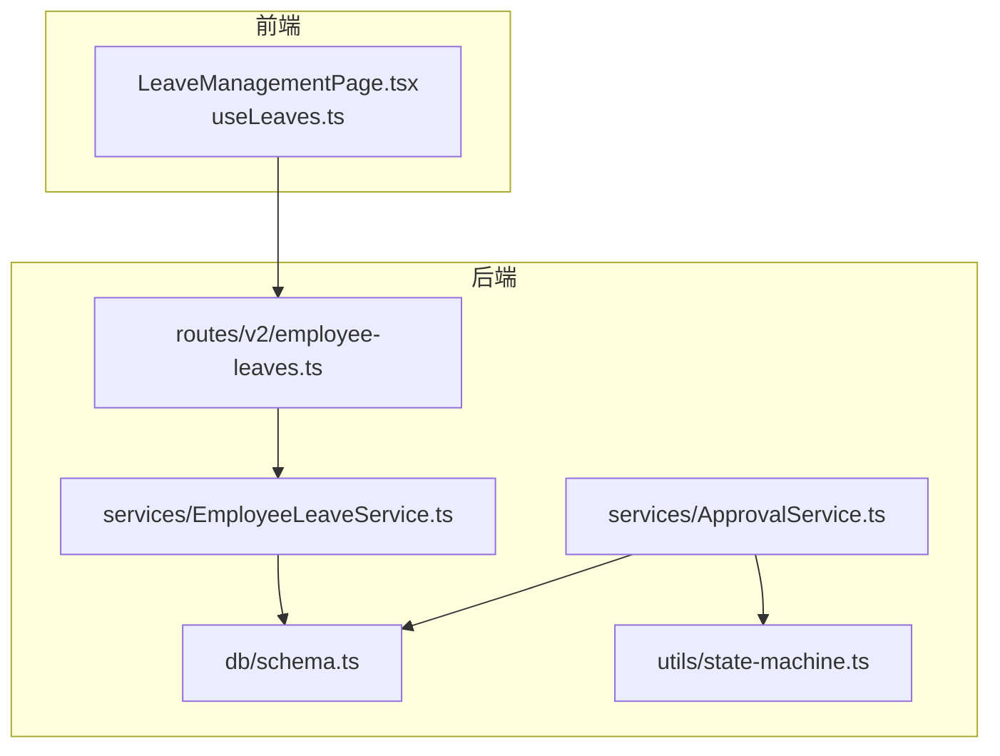
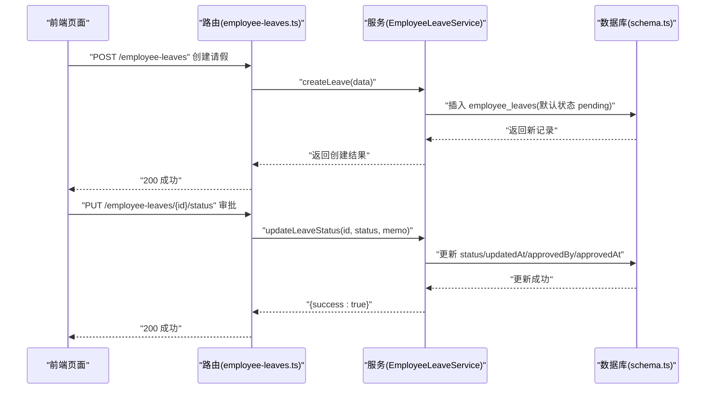
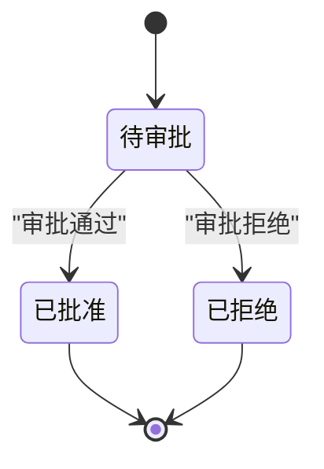
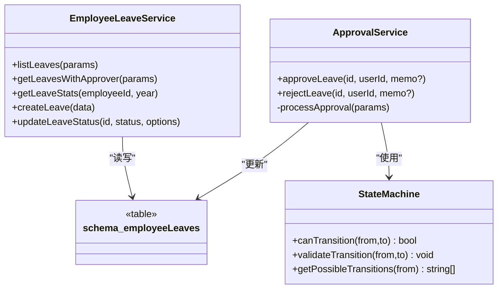

# 员工请假服务

<cite>
**本文引用的文件**
- [EmployeeLeaveService.ts](file://backend/src/services/EmployeeLeaveService.ts)
- [employee-leaves.ts](file://backend/src/routes/v2/employee-leaves.ts)
- [schema.ts](file://backend/src/db/schema.ts)
- [state-machine.ts](file://backend/src/utils/state-machine.ts)
- [ApprovalService.ts](file://backend/src/services/ApprovalService.ts)
- [AnnualLeaveService.ts](file://backend/src/services/AnnualLeaveService.ts)
- [LeaveManagementPage.tsx](file://frontend/src/features/hr/pages/LeaveManagementPage.tsx)
- [useLeaves.ts](file://frontend/src/hooks/business/useLeaves.ts)
</cite>

## 目录
1. [简介](#简介)
2. [项目结构](#项目结构)
3. [核心组件](#核心组件)
4. [架构总览](#架构总览)
5. [详细组件分析](#详细组件分析)
6. [依赖关系分析](#依赖关系分析)
7. [性能考量](#性能考量)
8. [故障排查指南](#故障排查指南)
9. [结论](#结论)
10. [附录](#附录)

## 简介
本文件系统性解析后端 EmployeeLeaveService 的实现，重点覆盖：
- 请假申请的创建与默认状态
- 审批状态管理与状态机规则
- 请假记录查询与统计分析
- approvedBy 与 approvedAt 字段在审批流程中的更新机制
- 跨年度请假查询与 SQLite strftime 函数的使用
- 前端交互与 API 路由对接

该服务围绕 SQLite 表 employee_leaves 构建，提供请假申请、审批、查询与统计能力，并通过状态机确保审批流程的合规性。

## 项目结构
后端采用分层设计：路由层负责请求校验与权限控制，服务层封装业务逻辑，数据库层通过 Drizzle ORM 访问 SQLite。前端通过 React Query 与后端 API 交互。

图表来源
- [employee-leaves.ts](file://backend/src/routes/v2/employee-leaves.ts#L1-L176)
- [EmployeeLeaveService.ts](file://backend/src/services/EmployeeLeaveService.ts#L1-L182)
- [schema.ts](file://backend/src/db/schema.ts#L269-L284)
- [state-machine.ts](file://backend/src/utils/state-machine.ts#L1-L89)
- [ApprovalService.ts](file://backend/src/services/ApprovalService.ts#L1-L376)

章节来源
- [employee-leaves.ts](file://backend/src/routes/v2/employee-leaves.ts#L1-L176)
- [EmployeeLeaveService.ts](file://backend/src/services/EmployeeLeaveService.ts#L1-L182)
- [schema.ts](file://backend/src/db/schema.ts#L269-L284)

## 核心组件
- 路由层：定义请假列表、创建、审批等接口，包含参数校验与权限检查。
- 服务层：实现请假记录的创建、状态更新、查询与统计。
- 数据模型：employee_leaves 表定义请假实体及其字段。
- 状态机：统一约束请假状态转换规则。
- 审批服务：复用状态机与通用审批流程，支持 approve/reject。

章节来源
- [employee-leaves.ts](file://backend/src/routes/v2/employee-leaves.ts#L1-L176)
- [EmployeeLeaveService.ts](file://backend/src/services/EmployeeLeaveService.ts#L1-L182)
- [schema.ts](file://backend/src/db/schema.ts#L269-L284)
- [state-machine.ts](file://backend/src/utils/state-machine.ts#L79-L89)
- [ApprovalService.ts](file://backend/src/services/ApprovalService.ts#L152-L350)

## 架构总览
请假模块的端到端流程如下：

图表来源
- [employee-leaves.ts](file://backend/src/routes/v2/employee-leaves.ts#L112-L175)
- [EmployeeLeaveService.ts](file://backend/src/services/EmployeeLeaveService.ts#L100-L181)
- [schema.ts](file://backend/src/db/schema.ts#L269-L284)

## 详细组件分析

### 1) 请假申请创建
- 默认状态：创建时 status 设为 pending。
- 时间戳：createdAt/updatedAt 初始化为当前时间。
- 可选字段：reason/memo 等按需传入。
- 返回值：返回新创建的请假记录对象。

章节来源
- [EmployeeLeaveService.ts](file://backend/src/services/EmployeeLeaveService.ts#L100-L151)

### 2) 审批状态管理与状态机
- 允许的转换：
  - pending → approved
  - pending → rejected
- 终态：approved/rejected 不再允许进一步转换。
- 审批流程中的字段更新：
  - 当状态为 approved 或 rejected 时，若提供了 approvedBy，则同时更新 approvedBy 与 approvedAt。
  - 可选 memo 字段也会被写入。
  - updatedAt 总是更新。

图表来源
- [state-machine.ts](file://backend/src/utils/state-machine.ts#L79-L89)
- [EmployeeLeaveService.ts](file://backend/src/services/EmployeeLeaveService.ts#L153-L181)

章节来源
- [state-machine.ts](file://backend/src/utils/state-machine.ts#L79-L89)
- [EmployeeLeaveService.ts](file://backend/src/services/EmployeeLeaveService.ts#L153-L181)

### 3) 查询与统计

#### 3.1 列表查询 listLeaves
- 支持过滤条件：employeeId、status、year（通过 SQLite 的 strftime 提取年份）。
- 排序：按 createdAt 降序。
- 关联：左连接员工表以获取员工姓名；approvedBy 字段用于审批人标识。

章节来源
- [EmployeeLeaveService.ts](file://backend/src/services/EmployeeLeaveService.ts#L10-L52)
- [employee-leaves.ts](file://backend/src/routes/v2/employee-leaves.ts#L43-L81)

#### 3.2 统计分析 getLeaveStats
- 统计维度：按 leaveType 分组。
- 条件：employeeId、status='approved'、year（通过 strftime 提取）。
- 结果：每种 leaveType 的已批准请假总天数。

章节来源
- [EmployeeLeaveService.ts](file://backend/src/services/EmployeeLeaveService.ts#L81-L98)

#### 3.3 跨年度请假查询与日期过滤
- 使用 SQLite 的 strftime('%Y', startDate)=year 实现按年过滤。
- 该策略适用于跨年度请假记录的筛选与统计。

章节来源
- [EmployeeLeaveService.ts](file://backend/src/services/EmployeeLeaveService.ts#L36-L40)
- [EmployeeLeaveService.ts](file://backend/src/services/EmployeeLeaveService.ts#L92-L94)

### 4) 审批流程中的字段更新机制
- approvedBy：当审批通过或拒绝且提供了审批人 ID 时写入。
- approvedAt：当审批通过或拒绝且提供了审批人 ID 时写入当前时间戳。
- updatedAt：每次状态更新都会刷新。
- memo：可选备注随审批一起写入。

章节来源
- [employee-leaves.ts](file://backend/src/routes/v2/employee-leaves.ts#L157-L175)
- [EmployeeLeaveService.ts](file://backend/src/services/EmployeeLeaveService.ts#L153-L181)

### 5) 数据模型与字段说明
- 主表：employee_leaves
- 关键字段：
  - id、employeeId、leaveType、startDate、endDate、days、status、reason、memo、approvedBy、approvedAt、version、createdAt、updatedAt

章节来源
- [schema.ts](file://backend/src/db/schema.ts#L269-L284)

### 6) 前端集成与交互
- 页面组件：LeaveManagementPage.tsx 提供请假列表、搜索、创建、编辑、审批等交互。
- Hook：useLeaves.ts 封装查询、创建、更新、删除、审批的 API 调用与缓存失效。
- 路由：后端 routes/v2/employee-leaves.ts 定义了对应的 API 端点与权限校验。

章节来源
- [LeaveManagementPage.tsx](file://frontend/src/features/hr/pages/LeaveManagementPage.tsx#L1-L563)
- [useLeaves.ts](file://frontend/src/hooks/business/useLeaves.ts#L1-L103)
- [employee-leaves.ts](file://backend/src/routes/v2/employee-leaves.ts#L1-L176)

## 依赖关系分析

图表来源
- [EmployeeLeaveService.ts](file://backend/src/services/EmployeeLeaveService.ts#L1-L182)
- [ApprovalService.ts](file://backend/src/services/ApprovalService.ts#L152-L350)
- [state-machine.ts](file://backend/src/utils/state-machine.ts#L1-L89)
- [schema.ts](file://backend/src/db/schema.ts#L269-L284)

章节来源
- [EmployeeLeaveService.ts](file://backend/src/services/EmployeeLeaveService.ts#L1-L182)
- [ApprovalService.ts](file://backend/src/services/ApprovalService.ts#L152-L350)
- [state-machine.ts](file://backend/src/utils/state-machine.ts#L1-L89)
- [schema.ts](file://backend/src/db/schema.ts#L269-L284)

## 性能考量
- 查询过滤：listLeaves 与 getLeaveStats 使用了基于字符串的日期过滤（strftime），建议在 startDate 上建立索引以提升查询效率。
- 统计聚合：getLeaveStats 对 leaveType 分组求和，建议对 employeeId、status、leaveType 建立复合索引以优化统计查询。
- 审批更新：updateLeaveStatus 仅更新必要字段，避免全量更新，减少写放大。

[本节为通用建议，不直接分析具体文件]

## 故障排查指南
- 审批状态不可逆：
  - 若尝试将 approved/rejected 状态再次变更，状态机会拒绝转换。请检查调用方是否正确判断当前状态。
- 审批人信息缺失：
  - 当 status 变更为 approved/rejected 但未提供 approvedBy 时，approvedBy 与 approvedAt 不会被更新。请确保审批接口传入审批人 ID。
- 日期过滤异常：
  - 使用 year 参数时，确保传入的是四位数字年份字符串，否则 strftime 过滤可能不生效。
- 跨年度统计偏差：
  - getLeaveStats 仅统计 approved 的记录，请确认筛选条件中 status 已设置为 approved。

章节来源
- [state-machine.ts](file://backend/src/utils/state-machine.ts#L16-L42)
- [EmployeeLeaveService.ts](file://backend/src/services/EmployeeLeaveService.ts#L153-L181)
- [employee-leaves.ts](file://backend/src/routes/v2/employee-leaves.ts#L157-L175)

## 结论
EmployeeLeaveService 提供了完整的请假生命周期管理：从创建、审批到查询与统计。通过状态机保证审批流程的合规性，借助 SQLite 的 strftime 实现灵活的日期过滤与统计。前后端协作清晰，路由层负责权限与参数校验，服务层专注业务逻辑，数据模型简洁明确。建议后续完善索引与日志，以进一步提升性能与可观测性。

[本节为总结性内容，不直接分析具体文件]

## 附录

### A. API 端点概览
- GET /v2/employee-leaves：列出请假记录（支持 employeeId、status 过滤）
- POST /v2/employee-leaves：创建请假申请
- PUT /v2/employee-leaves/{id}/status：更新请假状态（支持 approved/rejected）

章节来源
- [employee-leaves.ts](file://backend/src/routes/v2/employee-leaves.ts#L43-L175)

### B. 请假类型与状态映射（前端）
- leave_type：sick、annual、personal、other
- status：pending、approved、rejected

章节来源
- [LeaveManagementPage.tsx](file://frontend/src/features/hr/pages/LeaveManagementPage.tsx#L22-L27)

### C. 年假统计与请假扣减（参考）
- 年假服务 AnnualLeaveService 提供年假配置、周期计算、使用统计与结算。
- 在薪资生成等场景中会根据非年假类型的请假天数进行扣减。

章节来源
- [AnnualLeaveService.ts](file://backend/src/services/AnnualLeaveService.ts#L1-L226)