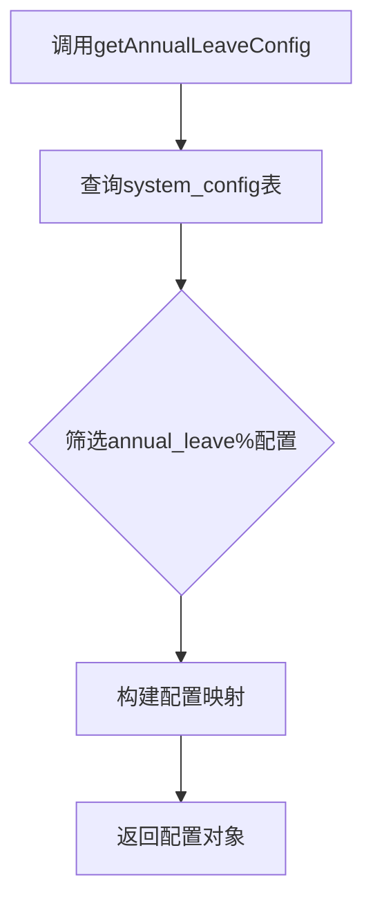
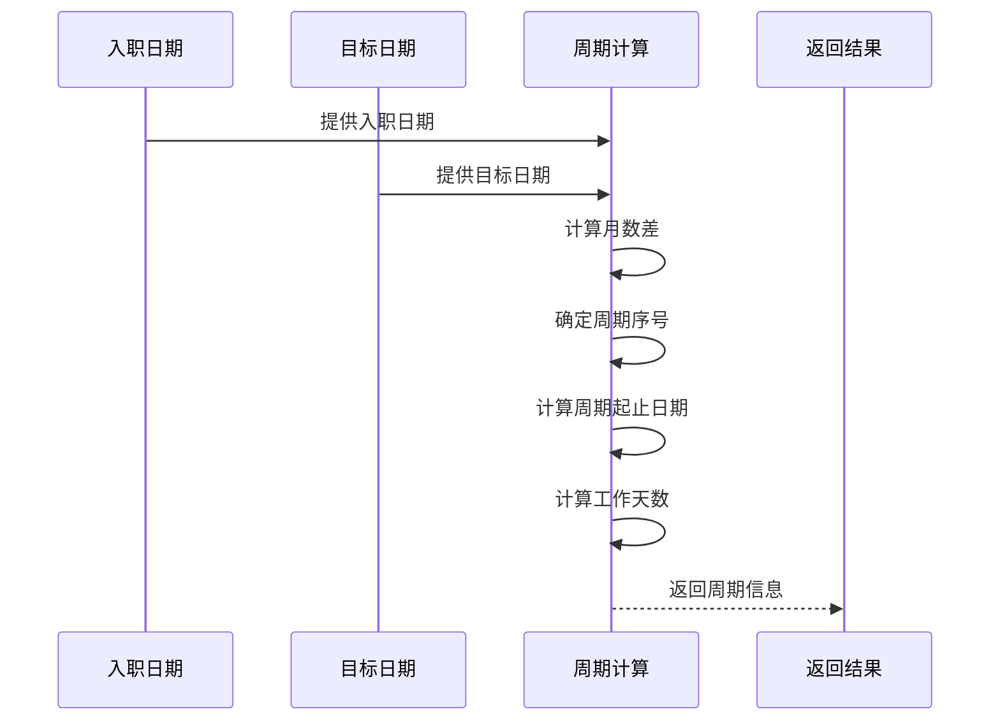
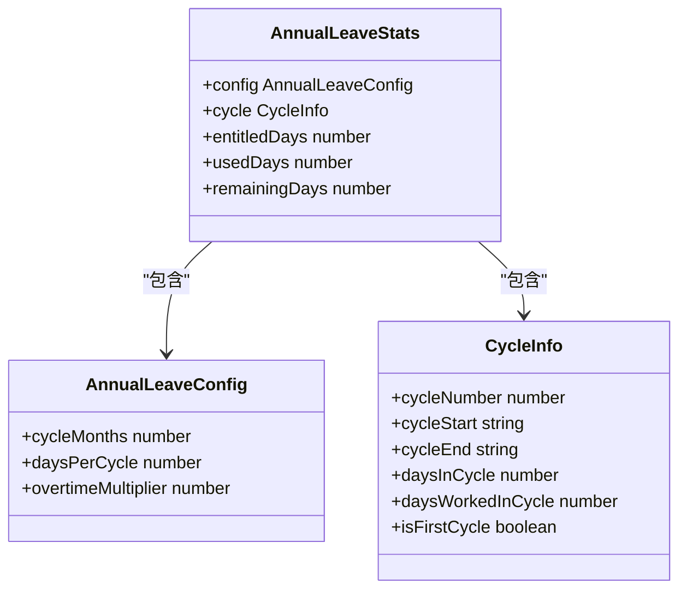
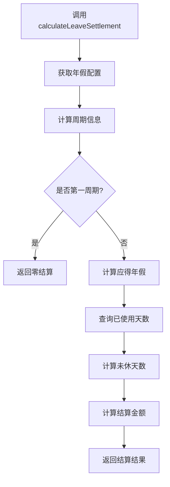
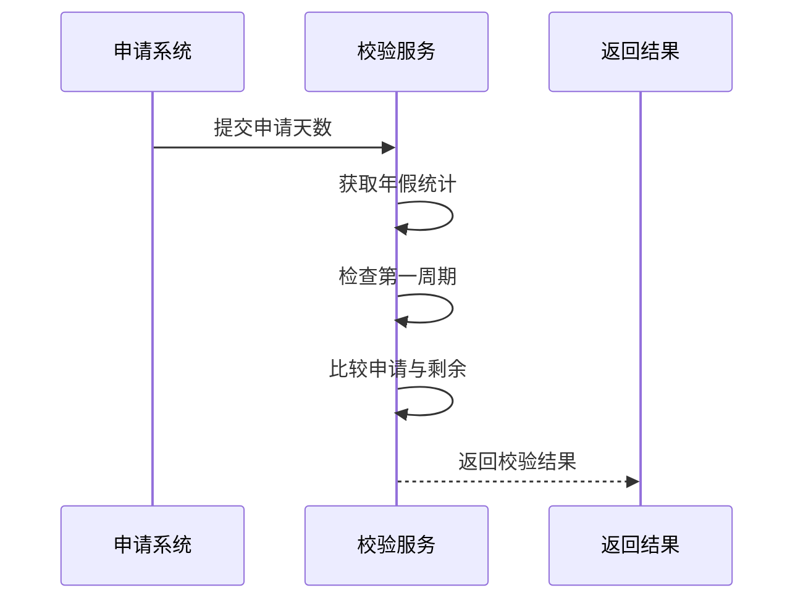
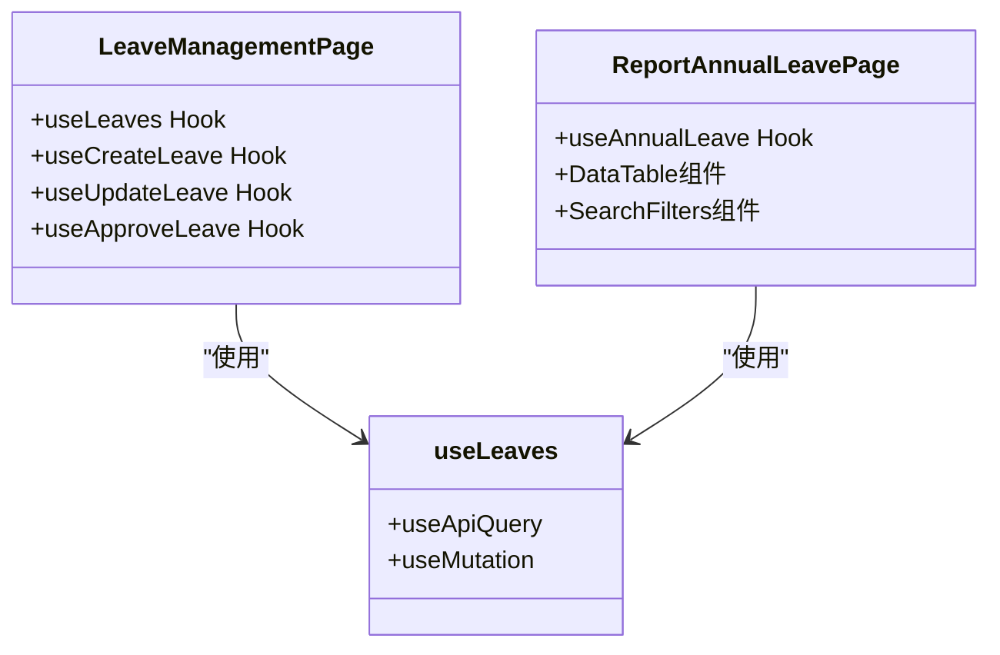

# 年假管理服务

<cite>
**本文档引用的文件**  
- [AnnualLeaveService.ts](file://backend/src/services/AnnualLeaveService.ts)
- [schema.ts](file://backend/src/db/schema.ts)
- [SystemConfigService.ts](file://backend/src/services/SystemConfigService.ts)
- [employee-leaves.ts](file://backend/src/routes/v2/employee-leaves.ts)
- [EmployeeLeaveService.ts](file://backend/src/services/EmployeeLeaveService.ts)
- [LeaveManagementPage.tsx](file://frontend/src/features/hr/pages/LeaveManagementPage.tsx)
- [useLeaves.ts](file://frontend/src/hooks/business/useLeaves.ts)
- [api.ts](file://frontend/src/config/api.ts)
- [ReportAnnualLeavePage.tsx](file://frontend/src/features/reports/pages/ReportAnnualLeavePage.tsx)
- [useReports.ts](file://frontend/src/hooks/business/useReports.ts)
- [reports.ts](file://backend/src/routes/v2/reports.ts)
</cite>

## 目录
1. [简介](#简介)
2. [年假配置管理](#年假配置管理)
3. [年假周期计算](#年假周期计算)
4. [年假统计功能](#年假统计功能)
5. [离职年假结算](#离职年假结算)
6. [年假申请校验](#年假申请校验)
7. [系统交互流程](#系统交互流程)
8. [前端界面集成](#前端界面集成)

## 简介
年假管理服务（AnnualLeaveService）是企业人力资源管理系统中的核心组件，负责处理员工年假相关的所有计算和管理功能。该服务支持半年制（6个月）和年制（12个月）两种周期模式，提供完整的年假配置、统计、结算和校验功能。服务通过与系统配置、员工信息和请假记录等数据源的交互，实现了精确的年假计算和管理。

**Section sources**
- [AnnualLeaveService.ts](file://backend/src/services/AnnualLeaveService.ts#L1-L227)

## 年假配置管理
年假配置管理功能通过`getAnnualLeaveConfig`方法从系统配置中读取年假规则。系统配置存储在`system_config`表中，包含年假周期月数、每周期年假天数和未休折算系数等关键参数。

`getAnnualLeaveConfig`方法查询所有以"annual_leave"为前缀的配置项，将其转换为配置对象返回。配置项包括：
- `annual_leave_cycle_months`：周期月数（6或12）
- `annual_leave_days_per_cycle`：每周期年假天数
- `annual_leave_overtime_multiplier`：未休折算系数

**Diagram sources**
- [AnnualLeaveService.ts](file://backend/src/services/AnnualLeaveService.ts#L45-L63)
- [schema.ts](file://backend/src/db/schema.ts#L3-L9)
- [SystemConfigService.ts](file://backend/src/services/SystemConfigService.ts#L6-L61)

**Section sources**
- [AnnualLeaveService.ts](file://backend/src/services/AnnualLeaveService.ts#L45-L63)
- [schema.ts](file://backend/src/db/schema.ts#L3-L9)

## 年假周期计算
年假周期计算功能通过`calculateCycleInfo`方法实现，该方法根据员工入职日期和目标日期计算年假周期信息。计算过程包括确定当前周期序号、周期开始和结束日期以及工作天数。

计算逻辑如下：
1. 计算入职日期到目标日期的完整月数
2. 根据周期月数确定当前周期序号
3. 计算周期开始和结束日期
4. 计算周期总天数和已工作天数

**Diagram sources**
- [AnnualLeaveService.ts](file://backend/src/services/AnnualLeaveService.ts#L65-L103)

**Section sources**
- [AnnualLeaveService.ts](file://backend/src/services/AnnualLeaveService.ts#L65-L103)

## 年假统计功能
年假统计功能通过`getAnnualLeaveStats`方法实现，该方法计算员工的应享、已用和剩余年假天数。统计过程结合了年假配置、周期信息和已使用天数。

统计逻辑包括：
1. 获取年假配置
2. 计算当前周期信息
3. 确定应得年假天数（第一周期无年假）
4. 查询已使用年假天数
5. 计算剩余年假天数

**Diagram sources**
- [AnnualLeaveService.ts](file://backend/src/services/AnnualLeaveService.ts#L26-L32)
- [AnnualLeaveService.ts](file://backend/src/services/AnnualLeaveService.ts#L129-L152)

**Section sources**
- [AnnualLeaveService.ts](file://backend/src/services/AnnualLeaveService.ts#L129-L152)

## 离职年假结算
离职年假结算功能通过`calculateLeaveSettlement`方法实现，该方法在员工离职时计算未休年假的补偿金额。结算过程考虑了按比例应得年假、已使用天数和日薪等因素。

结算逻辑如下：
1. 获取年假配置和周期信息
2. 处理第一周期特殊情况（无年假）
3. 按工作天数比例计算应得年假
4. 查询已使用年假天数
5. 计算未休天数和结算金额

**Diagram sources**
- [AnnualLeaveService.ts](file://backend/src/services/AnnualLeaveService.ts#L154-L195)

**Section sources**
- [AnnualLeaveService.ts](file://backend/src/services/AnnualLeaveService.ts#L154-L195)

## 年假申请校验
年假申请校验功能通过`validateAnnualLeaveRequest`方法实现，该方法校验年假申请是否超额。校验过程确保员工不会申请超过剩余年假天数的假期。

校验逻辑包括：
1. 获取员工年假统计信息
2. 检查是否为第一周期（不享有年假）
3. 比较申请天数与剩余天数
4. 返回校验结果和提示信息

**Diagram sources**
- [AnnualLeaveService.ts](file://backend/src/services/AnnualLeaveService.ts#L197-L225)

**Section sources**
- [AnnualLeaveService.ts](file://backend/src/services/AnnualLeaveService.ts#L197-L225)

## 系统交互流程
年假管理服务与其他系统组件紧密集成，形成完整的年假管理流程。后端服务通过API路由暴露功能，前端界面通过HTTP请求调用这些API。

主要交互流程包括：
1. 员工提交年假申请
2. 系统校验申请是否超额
3. 管理员审批请假申请
4. 系统更新已使用年假天数
5. 生成年假统计报表

**Diagram sources**
- [employee-leaves.ts](file://backend/src/routes/v2/employee-leaves.ts#L1-L176)
- [EmployeeLeaveService.ts](file://backend/src/services/EmployeeLeaveService.ts#L1-L182)
- [schema.ts](file://backend/src/db/schema.ts#L269-L284)

**Section sources**
- [employee-leaves.ts](file://backend/src/routes/v2/employee-leaves.ts#L1-L176)
- [EmployeeLeaveService.ts](file://backend/src/services/EmployeeLeaveService.ts#L1-L182)

## 前端界面集成
前端界面通过React组件和Hooks与年假管理服务集成，提供用户友好的操作界面。主要组件包括请假管理页面、年假统计报表和相关业务Hooks。

前端集成特点：
- 使用Ant Design组件库构建界面
- 通过React Query管理数据状态
- 实现表单验证和错误处理
- 提供实时数据刷新功能

**Diagram sources**
- [LeaveManagementPage.tsx](file://frontend/src/features/hr/pages/LeaveManagementPage.tsx#L1-L563)
- [ReportAnnualLeavePage.tsx](file://frontend/src/features/reports/pages/ReportAnnualLeavePage.tsx#L1-L212)
- [useLeaves.ts](file://frontend/src/hooks/business/useLeaves.ts#L1-L103)
- [useReports.ts](file://frontend/src/hooks/business/useReports.ts#L242-L254)

**Section sources**
- [LeaveManagementPage.tsx](file://frontend/src/features/hr/pages/LeaveManagementPage.tsx#L1-L563)
- [ReportAnnualLeavePage.tsx](file://frontend/src/features/reports/pages/ReportAnnualLeavePage.tsx#L1-L212)
- [useLeaves.ts](file://frontend/src/hooks/business/useLeaves.ts#L1-L103)
- [api.ts](file://frontend/src/config/api.ts#L1-L188)
- [reports.ts](file://backend/src/routes/v2/reports.ts#L681-L735)