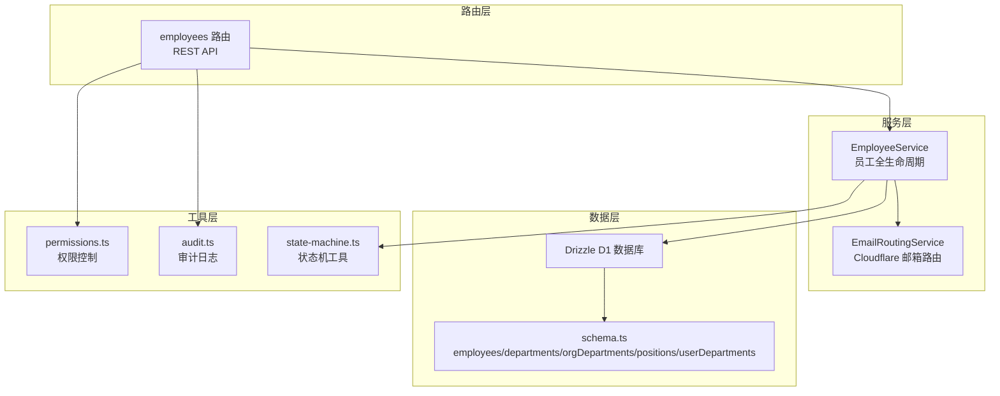
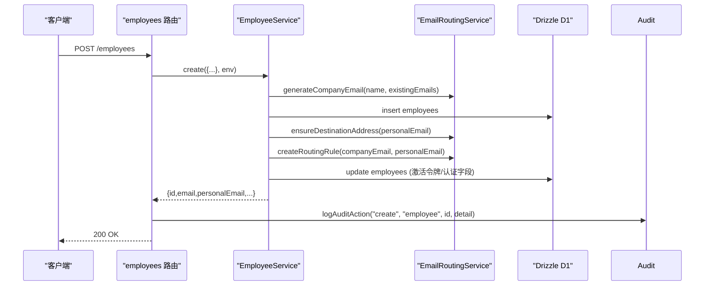
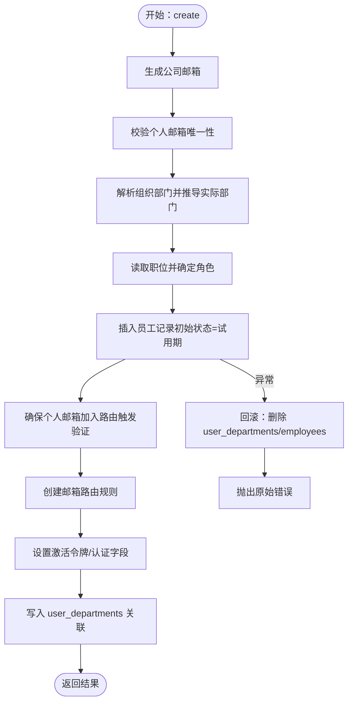
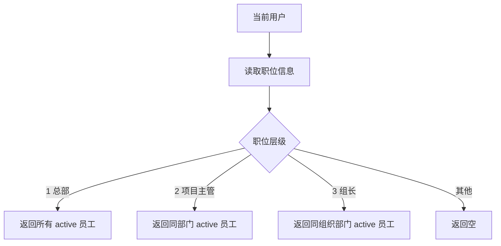
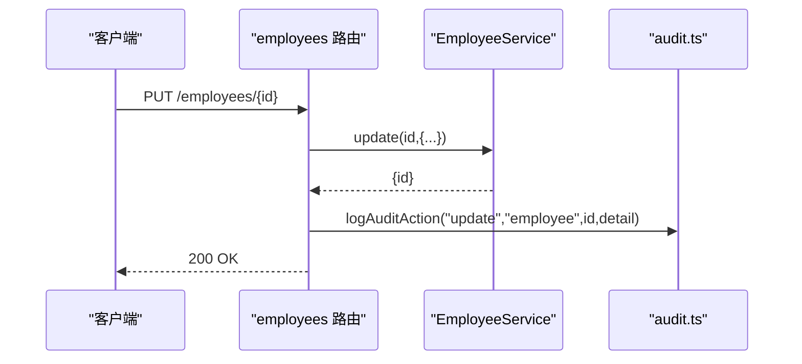
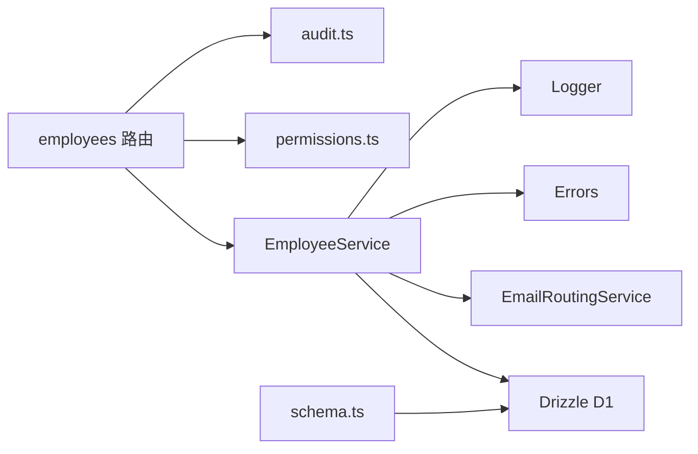

# 核心员工服务

<cite>
**本文引用的文件**
- [EmployeeService.ts](file://backend/src/services/EmployeeService.ts)
- [employees.ts](file://backend/src/routes/v2/employees.ts)
- [employee.schema.ts](file://backend/src/schemas/employee.schema.ts)
- [EmailRoutingService.ts](file://backend/src/services/EmailRoutingService.ts)
- [schema.ts](file://backend/src/db/schema.ts)
- [audit.ts](file://backend/src/utils/audit.ts)
- [permissions.ts](file://backend/src/utils/permissions.ts)
- [state-machine.ts](file://backend/src/utils/state-machine.ts)
- [EmployeeService.test.ts](file://backend/test/services/EmployeeService.test.ts)
</cite>

## 目录
1. [简介](#简介)
2. [项目结构](#项目结构)
3. [核心组件](#核心组件)
4. [架构总览](#架构总览)
5. [详细组件分析](#详细组件分析)
6. [依赖分析](#依赖分析)
7. [性能考量](#性能考量)
8. [故障排查指南](#故障排查指南)
9. [结论](#结论)
10. [附录](#附录)

## 简介
本文件深入解析后端核心员工服务 EmployeeService 的实现，覆盖员工全生命周期管理的关键能力：创建、更新、转正、离职、复职等。重点说明：
- 员工创建时的复杂事务处理流程与回滚机制，如何在 D1 不支持传统事务的情况下保证数据一致性
- 与 Cloudflare Email Routing 服务的集成，包括公司邮箱生成、个人邮箱路由配置与验证
- 员工状态机（试用、正式、离职）的转换逻辑与业务规则
- 员工与部门、职位的关联关系管理
- 基于职位层级的权限控制，通过 getSubordinateEmployeeIds 实现的上下级可见范围
- 员工信息变更时的数据验证与审计日志记录机制

## 项目结构
围绕员工服务的相关模块分布如下：
- 服务层：EmployeeService（员工全生命周期）、EmailRoutingService（邮箱路由）
- 路由层：employees 路由（REST API）
- 数据层：Drizzle ORM + SQLite（D1），数据库模式定义
- 工具层：权限控制、审计日志、状态机工具
- 校验层：OpenAPI Schema（输入校验）

图表来源
- [employees.ts](file://backend/src/routes/v2/employees.ts#L1-L602)
- [EmployeeService.ts](file://backend/src/services/EmployeeService.ts#L1-L758)
- [EmailRoutingService.ts](file://backend/src/services/EmailRoutingService.ts#L1-L220)
- [schema.ts](file://backend/src/db/schema.ts#L1-L706)
- [permissions.ts](file://backend/src/utils/permissions.ts#L1-L273)
- [audit.ts](file://backend/src/utils/audit.ts#L1-L90)
- [state-machine.ts](file://backend/src/utils/state-machine.ts#L1-L89)

章节来源
- [employees.ts](file://backend/src/routes/v2/employees.ts#L1-L602)
- [EmployeeService.ts](file://backend/src/services/EmployeeService.ts#L1-L758)
- [schema.ts](file://backend/src/db/schema.ts#L1-L706)

## 核心组件
- 员工服务 EmployeeService：提供创建、更新、转正、离职、复职、查询、权限辅助等能力；内部集成邮箱路由与回滚策略
- 邮箱路由服务 EmailRoutingService：负责公司邮箱生成、个人邮箱路由规则创建与验证
- 路由 employees.ts：定义 REST 接口，调用服务层并记录审计日志
- 数据模式 schema.ts：定义 employees、departments、orgDepartments、positions、userDepartments 等表结构
- 权限工具 permissions.ts：基于职位层级与权限配置实现数据访问过滤
- 审计工具 audit.ts：异步记录审计日志，包含 IP 与地理位置信息
- 状态机工具 state-machine.ts：通用状态机，可扩展用于员工状态转换校验

章节来源
- [EmployeeService.ts](file://backend/src/services/EmployeeService.ts#L1-L758)
- [EmailRoutingService.ts](file://backend/src/services/EmailRoutingService.ts#L1-L220)
- [employees.ts](file://backend/src/routes/v2/employees.ts#L1-L602)
- [schema.ts](file://backend/src/db/schema.ts#L1-L706)
- [permissions.ts](file://backend/src/utils/permissions.ts#L1-L273)
- [audit.ts](file://backend/src/utils/audit.ts#L1-L90)
- [state-machine.ts](file://backend/src/utils/state-machine.ts#L1-L89)

## 架构总览
员工服务采用“路由层-服务层-数据层-工具层”的分层架构，配合权限与审计工具，形成完整的员工生命周期管理闭环。

图表来源
- [employees.ts](file://backend/src/routes/v2/employees.ts#L184-L241)
- [EmployeeService.ts](file://backend/src/services/EmployeeService.ts#L20-L255)
- [EmailRoutingService.ts](file://backend/src/services/EmailRoutingService.ts#L35-L169)
- [audit.ts](file://backend/src/utils/audit.ts#L33-L90)

## 详细组件分析

### 员工创建流程与回滚机制
- 输入参数：姓名、个人邮箱、组织部门、部门、职位、入职日期、工作日程、年假周期/天数等
- 处理步骤：
  1) 生成公司邮箱（基于姓名与现有邮箱去重）
  2) 校验个人邮箱唯一性
  3) 解析组织部门，推导实际部门（优先 orgDepartment.projectId，否则“总部”，否则报错）
  4) 读取职位，决定用户角色
  5) 插入员工记录，初始状态为“试用期”，active=1
  6) 确保个人邮箱加入 Cloudflare 邮箱路由（触发验证）
  7) 创建邮箱路由规则（公司邮箱 -> 个人邮箱）
  8) 设置激活令牌与过期时间，便于后续激活邮件发送
  9) 写入 user_departments 关联
- 回滚策略：采用“按相反顺序删除”的回滚，跟踪已创建资源标志位，异常时依次删除 user_departments、employees 记录，并记录错误日志

图表来源
- [EmployeeService.ts](file://backend/src/services/EmployeeService.ts#L20-L255)
- [EmailRoutingService.ts](file://backend/src/services/EmailRoutingService.ts#L77-L169)

章节来源
- [EmployeeService.ts](file://backend/src/services/EmployeeService.ts#L20-L255)

### 员工状态机与业务规则
- 状态枚举：probation（试用期）、regular（正式）、resigned（离职）
- 转正：将状态置为 regular，并记录 regularDate
- 离职：将状态置为 resigned，active=0，追加 memo 离职原因，同时禁用登录（通过 personalEmail 与 email 关联）
- 复职：将状态置为 probation，active=1，重置 joinDate
- 未在 EmployeeService 中内置显式的状态机校验器，但可复用通用状态机工具扩展

章节来源
- [EmployeeService.ts](file://backend/src/services/EmployeeService.ts#L485-L564)
- [state-machine.ts](file://backend/src/utils/state-machine.ts#L1-L89)

### 员工与部门、职位的关联关系
- 员工表 employees 关联：
  - departmentId：项目/部门
  - orgDepartmentId：组织部门（组）
  - positionId：职位
- userDepartments：多部门关联表，支持员工在多个部门的关联
- 查询构建：buildEmployeeQuery 通过 LEFT JOIN 将部门、组织部门、职位信息拼装为统一视图

章节来源
- [schema.ts](file://backend/src/db/schema.ts#L14-L48)
- [schema.ts](file://backend/src/db/schema.ts#L111-L116)
- [EmployeeService.ts](file://backend/src/services/EmployeeService.ts#L307-L355)

### 基于职位层级的权限控制与下级可见范围
- getSubordinateEmployeeIds：根据当前用户的 positionId 与层级，返回可查看的员工 ID 列表
  - 总部（level=1）：返回所有 active 员工
  - 项目主管（level=2）：返回同部门 active 员工
  - 组长（team_leader）：返回同组织部门 active 员工
  - 其他：返回空
- 路由层 employees 路由在查询列表时，使用 getDataAccessFilter 将上述逻辑映射为 SQL 过滤条件，确保最小权限访问

图表来源
- [EmployeeService.ts](file://backend/src/services/EmployeeService.ts#L566-L621)
- [permissions.ts](file://backend/src/utils/permissions.ts#L196-L263)

章节来源
- [EmployeeService.ts](file://backend/src/services/EmployeeService.ts#L566-L621)
- [permissions.ts](file://backend/src/utils/permissions.ts#L196-L263)

### 与 Cloudflare Email Routing 的集成
- 公司邮箱生成：基于姓名生成前缀，去重后拼接域名
- 个人邮箱路由：确保目标地址存在（触发 Cloudflare 验证），创建路由规则将公司邮箱转发到个人邮箱
- 路由创建失败时记录错误日志，不影响员工记录写入（仍返回部分成功标记）

章节来源
- [EmailRoutingService.ts](file://backend/src/services/EmailRoutingService.ts#L35-L169)
- [EmployeeService.ts](file://backend/src/services/EmployeeService.ts#L122-L183)

### 数据验证与审计日志
- 输入校验：employees 路由使用 OpenAPI Schema（CreateEmployeeSchema、UpdateEmployeeSchema、RegularizeEmployeeSchema、EmployeeLeaveSchema、EmployeeRejoinSchema）对请求体进行严格校验
- 审计日志：路由层在关键操作（创建、更新、重置密码、重发激活邮件、重置TOTP、转正、离职、复职）后调用 logAuditAction，异步记录操作人、实体、详情、IP 与地理位置

图表来源
- [employees.ts](file://backend/src/routes/v2/employees.ts#L362-L396)
- [audit.ts](file://backend/src/utils/audit.ts#L33-L90)

章节来源
- [employee.schema.ts](file://backend/src/schemas/employee.schema.ts#L1-L118)
- [employees.ts](file://backend/src/routes/v2/employees.ts#L155-L602)
- [audit.ts](file://backend/src/utils/audit.ts#L33-L90)

### API 与路由行为
- 列表查询：支持按状态、部门、组织部门、姓名、邮箱、职位过滤，结合权限过滤返回受限结果
- 单条查询：鉴权后调用服务层 getById
- 创建：鉴权后调用服务层 create，返回公司邮箱、路由创建状态等
- 更新：鉴权后调用服务层 update，支持部门/组织部门/职位/手机号/邮箱/工作日程/年假等字段
- 转正/离职/复职：分别对应 regularize/leave/rejoin，均受权限控制
- 重发激活邮件/重置TOTP：管理员操作，记录审计日志

章节来源
- [employees.ts](file://backend/src/routes/v2/employees.ts#L46-L103)
- [employees.ts](file://backend/src/routes/v2/employees.ts#L155-L602)

## 依赖分析
- 组件耦合
  - EmployeeService 依赖 Drizzle D1、EmailRoutingService、EmailService、Logger、Errors
  - 路由层依赖权限工具与审计工具
  - 数据层依赖 schema.ts 定义的表结构
- 外部依赖
  - Cloudflare Email Routing API（用于邮箱路由创建与验证）
  - Cloudflare 请求头（用于审计日志中的 IP 与地理位置）

图表来源
- [EmployeeService.ts](file://backend/src/services/EmployeeService.ts#L1-L758)
- [employees.ts](file://backend/src/routes/v2/employees.ts#L1-L602)
- [schema.ts](file://backend/src/db/schema.ts#L1-L706)

章节来源
- [EmployeeService.ts](file://backend/src/services/EmployeeService.ts#L1-L758)
- [employees.ts](file://backend/src/routes/v2/employees.ts#L1-L602)
- [schema.ts](file://backend/src/db/schema.ts#L1-L706)

## 性能考量
- D1 不支持传统事务：EmployeeService 采用顺序执行与回滚策略，避免跨语句原子性问题
- 查询优化：buildEmployeeQuery 通过 LEFT JOIN 聚合部门/组织部门/职位信息，减少多次查询
- 审计日志异步化：audit.ts 使用 waitUntil 异步提交，避免阻塞主流程
- 路由层权限过滤：getDataAccessFilter 将权限映射为 SQL 条件，减少不必要的数据传输

[本节为通用指导，不涉及具体文件分析]

## 故障排查指南
- 创建失败回滚
  - 现象：创建过程中任一步骤失败，系统回滚已创建的 user_departments 与 employees 记录
  - 排查：检查回滚日志与原始错误，确认邮箱路由是否成功创建
  - 参考路径：[EmployeeService.ts](file://backend/src/services/EmployeeService.ts#L233-L254)
- 邮箱路由验证未通过
  - 现象：ensureDestinationAddress 返回失败或 409，createRoutingRule 返回错误
  - 排查：确认 CF_ACCOUNT_ID、CF_ZONE_ID、CF_EMAIL_TOKEN 配置正确，检查 Cloudflare 控制台验证状态
  - 参考路径：[EmailRoutingService.ts](file://backend/src/services/EmailRoutingService.ts#L77-L169)
- 权限访问受限
  - 现象：列表查询为空或 403
  - 排查：确认用户职位层级与 canManageSubordinates 标志，检查 getDataAccessFilter 生成的 where 条件
  - 参考路径：[permissions.ts](file://backend/src/utils/permissions.ts#L196-L263)
- 审计日志缺失
  - 现象：操作后未记录审计
  - 排查：确认执行上下文存在 waitUntil，AuditService 注入正常，且 userId 可获取
  - 参考路径：[audit.ts](file://backend/src/utils/audit.ts#L33-L90)

章节来源
- [EmployeeService.ts](file://backend/src/services/EmployeeService.ts#L233-L254)
- [EmailRoutingService.ts](file://backend/src/services/EmailRoutingService.ts#L77-L169)
- [permissions.ts](file://backend/src/utils/permissions.ts#L196-L263)
- [audit.ts](file://backend/src/utils/audit.ts#L33-L90)

## 结论
EmployeeService 通过严格的输入校验、完善的权限过滤与审计日志，以及与 Cloudflare Email Routing 的深度集成，实现了员工全生命周期管理的高可用与可追溯性。尽管 D1 不支持传统事务，但通过顺序执行与回滚策略，有效保障了数据一致性。建议后续可引入通用状态机对状态转换进行强约束，并持续优化路由层的权限过滤与审计日志的可观测性。

[本节为总结性内容，不涉及具体文件分析]

## 附录
- 测试参考：单元测试覆盖了创建、更新、查询、迁移场景，可作为集成与回归测试的依据
  - 参考路径：[EmployeeService.test.ts](file://backend/test/services/EmployeeService.test.ts#L1-L237)

章节来源
- [EmployeeService.test.ts](file://backend/test/services/EmployeeService.test.ts#L1-L237)