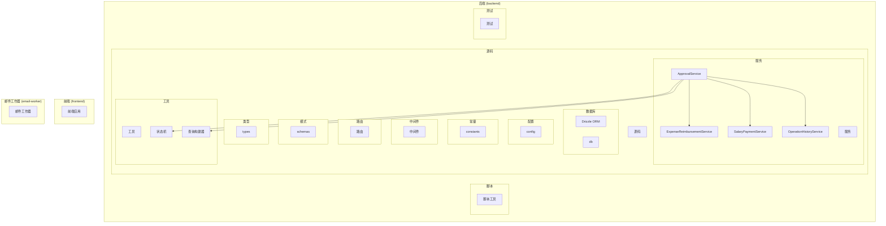
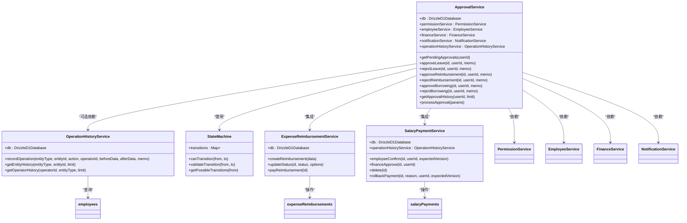
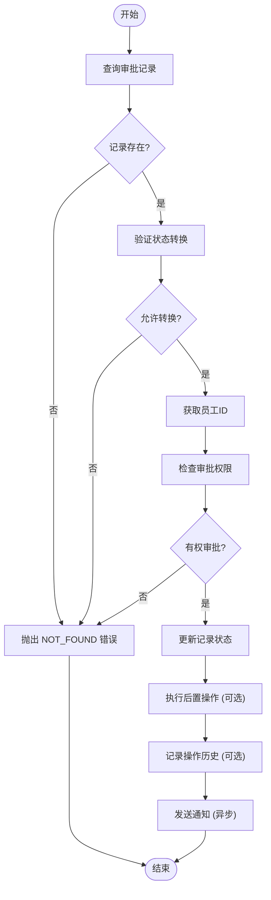
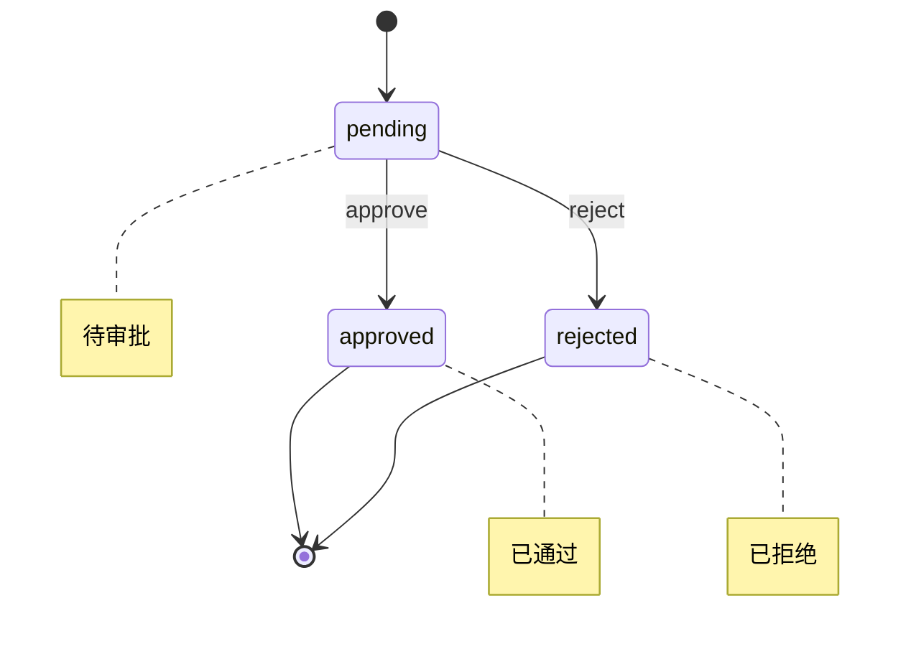
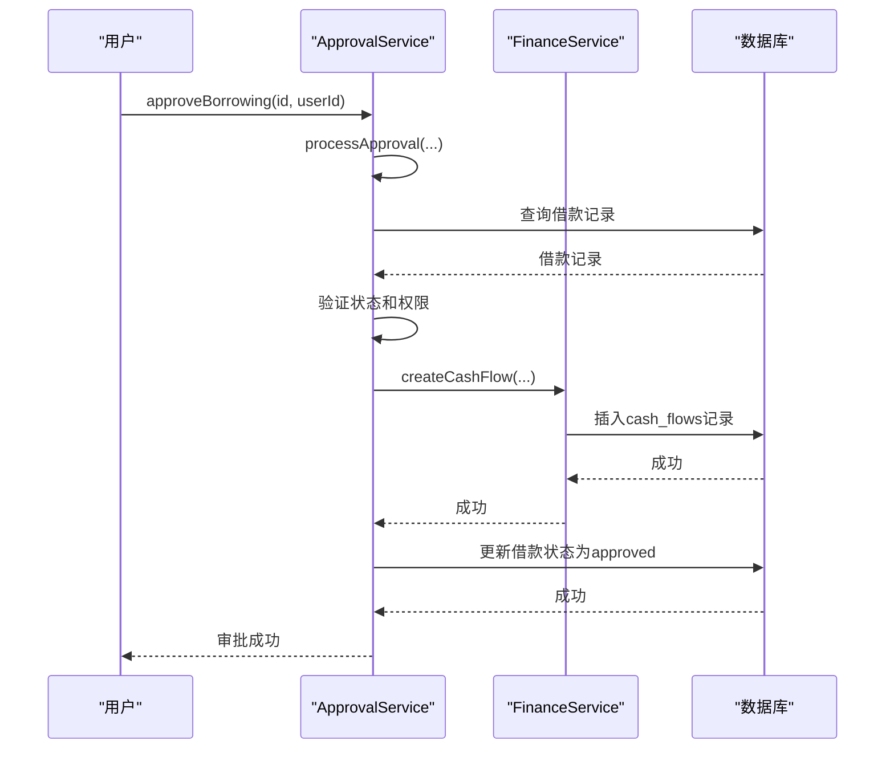
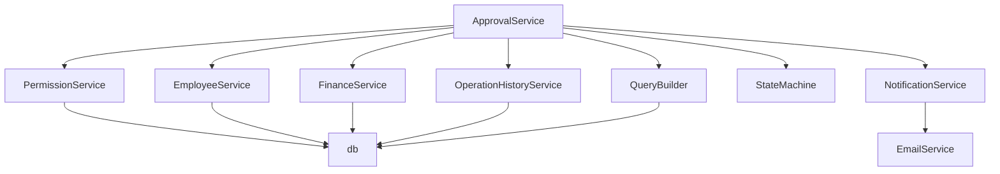

# 审批管理服务

<cite>
**本文档引用的文件**   
- [ApprovalService.ts](file://backend/src/services/ApprovalService.ts)
- [ExpenseReimbursementService.ts](file://backend/src/services/ExpenseReimbursementService.ts)
- [SalaryPaymentService.ts](file://backend/src/services/SalaryPaymentService.ts)
- [OperationHistoryService.ts](file://backend/src/services/OperationHistoryService.ts)
- [state-machine.ts](file://backend/src/utils/state-machine.ts)
- [schema.ts](file://backend/src/db/schema.ts)
- [approvals.ts](file://backend/src/routes/v2/approvals.ts)
- [di.ts](file://backend/src/middleware/di.ts)
</cite>

## 目录
1. [简介](#简介)
2. [项目结构](#项目结构)
3. [核心组件](#核心组件)
4. [架构概述](#架构概述)
5. [详细组件分析](#详细组件分析)
6. [依赖分析](#依赖分析)
7. [性能考虑](#性能考虑)
8. [故障排除指南](#故障排除指南)
9. [结论](#结论)
10. [附录](#附录)（如有必要）

## 简介
本文档深入解析审批管理服务的设计与实现机制。重点阐述ApprovalService如何实现灵活的审批流引擎，支持多级审批、会签、或签等模式。详细说明其与各类业务服务（如ExpenseReimbursementService、SalaryPaymentService）的集成方式，如何通过事件或调用触发审批流程。解释审批状态机的设计，包括待审批、已通过、已拒绝、已撤销等状态的转换规则。结合OperationHistoryService说明如何记录完整的审批操作历史，支持审计追溯。提供实际审批场景（如报销审批）的代码示例，展示审批创建、查询、处理的完整流程。

## 项目结构
本项目采用分层架构设计，主要分为前端、后端和邮件工作器三个部分。后端服务是审批管理的核心，其结构清晰，按功能模块划分。

**图表来源**
- [ApprovalService.ts](file://backend/src/services/ApprovalService.ts)
- [ExpenseReimbursementService.ts](file://backend/src/services/ExpenseReimbursementService.ts)
- [SalaryPaymentService.ts](file://backend/src/services/SalaryPaymentService.ts)
- [OperationHistoryService.ts](file://backend/src/services/OperationHistoryService.ts)
- [state-machine.ts](file://backend/src/utils/state-machine.ts)
- [query-builder.ts](file://backend/src/utils/query-builder.ts)

**章节来源**
- [backend/src](file://backend/src)

## 核心组件
审批管理服务的核心组件包括`ApprovalService`、`OperationHistoryService`和`state-machine`。`ApprovalService`是审批逻辑的中心，负责处理所有类型的审批请求。`OperationHistoryService`负责记录所有业务操作的历史，为审计提供支持。`state-machine`模块定义了各种业务实体的状态流转规则，确保状态转换的合法性。

**章节来源**
- [ApprovalService.ts](file://backend/src/services/ApprovalService.ts#L31-L644)
- [OperationHistoryService.ts](file://backend/src/services/OperationHistoryService.ts#L8-L107)
- [state-machine.ts](file://backend/src/utils/state-machine.ts#L7-L88)

## 架构概述
审批管理服务采用依赖注入（DI）模式，通过`di.ts`文件统一管理所有服务的实例化和依赖注入。`ApprovalService`作为核心服务，依赖于`PermissionService`进行权限校验，`EmployeeService`获取员工信息，`FinanceService`处理财务相关操作，`NotificationService`发送通知，以及`OperationHistoryService`记录操作历史。

**图表来源**
- [ApprovalService.ts](file://backend/src/services/ApprovalService.ts#L31-L644)
- [OperationHistoryService.ts](file://backend/src/services/OperationHistoryService.ts#L8-L107)
- [state-machine.ts](file://backend/src/utils/state-machine.ts#L7-L88)
- [ExpenseReimbursementService.ts](file://backend/src/services/ExpenseReimbursementService.ts#L8-L169)
- [SalaryPaymentService.ts](file://backend/src/services/SalaryPaymentService.ts#L22-L325)

## 详细组件分析

### ApprovalService 分析
`ApprovalService`是审批系统的核心，它提供了一个统一的接口来处理不同类型的审批请求。该服务通过`processApproval`私有方法实现了审批逻辑的复用，避免了代码重复。

#### 审批流程处理
`processApproval`方法是审批逻辑的核心，它在一个数据库事务中执行以下步骤：
1.  **查询记录**：根据ID从指定表中查询待审批的记录。
2.  **状态验证**：使用`stateMachine.validateTransition`检查从当前状态到目标状态的转换是否合法。
3.  **权限校验**：调用`permissionService.canApprove`检查审批人是否有权审批该记录。
4.  **更新记录**：更新记录的状态、审批人、审批时间等字段。
5.  **执行后置操作**：如果提供了`afterUpdate`回调，则执行它（例如，借款审批通过后自动创建支出流水）。
6.  **记录操作历史**：如果配置了`operationHistoryService`，则记录此次操作。
7.  **发送通知**：异步发送审批结果通知，不阻塞主流程。

**图表来源**
- [ApprovalService.ts](file://backend/src/services/ApprovalService.ts#L152-L228)

#### 批量审批功能
`ApprovalService`提供了对请假、报销和借款的批量审批和拒绝功能。这些方法（如`batchApproveReimbursements`）通过遍历ID列表，逐个调用单个审批方法，并捕获每个操作的结果，最终返回成功和失败的列表。

**章节来源**
- [ApprovalService.ts](file://backend/src/services/ApprovalService.ts#L436-L581)

### 状态机设计
系统使用`state-machine.ts`中的`StateMachine`类来管理各种业务实体的状态流转。每个状态机都预定义了合法的状态转换规则。

**图表来源**
- [state-machine.ts](file://backend/src/utils/state-machine.ts#L73-L77)

### 与业务服务的集成
`ApprovalService`通过依赖注入的方式与各类业务服务集成。例如，当审批借款时，`approveBorrowing`方法会调用`FinanceService.createCashFlow`来创建相应的支出流水。

**图表来源**
- [ApprovalService.ts](file://backend/src/services/ApprovalService.ts#L378-L414)
- [FinanceService.ts](file://backend/src/services/FinanceService.ts)

### 操作历史记录
`OperationHistoryService`负责记录所有关键业务操作的历史。`ApprovalService`在每次审批操作后，会调用`recordOperation`方法，将操作的详细信息（包括操作前后的数据）存入`businessOperationHistory`表。

**章节来源**
- [OperationHistoryService.ts](file://backend/src/services/OperationHistoryService.ts#L14-L48)
- [ApprovalService.ts](file://backend/src/services/ApprovalService.ts#L218-L221)

## 依赖分析
`ApprovalService`的依赖关系清晰，遵循了依赖倒置原则。它依赖于抽象的服务接口，而不是具体的实现，这使得系统更易于测试和维护。

**图表来源**
- [di.ts](file://backend/src/middleware/di.ts#L78-L85)
- [ApprovalService.ts](file://backend/src/services/ApprovalService.ts#L33-L38)

**章节来源**
- [di.ts](file://backend/src/middleware/di.ts#L41-L155)

## 性能考虑
`ApprovalService`在性能方面做了优化。例如，`getPendingApprovals`方法使用了`QueryBuilder.buildEmployeeJoinQuery`来优化员工信息的关联查询，减少了数据库的查询开销。此外，发送通知是异步进行的，不会阻塞审批流程，保证了主流程的响应速度。

## 故障排除指南
当审批功能出现问题时，可以按照以下步骤进行排查：
1.  **检查权限**：确认审批人是否有足够的权限进行审批操作。
2.  **检查状态机**：查看`state-machine.ts`中的定义，确认当前状态是否允许转换到目标状态。
3.  **查看操作历史**：通过`OperationHistoryService`查询相关记录的操作历史，了解操作的完整流程。
4.  **检查数据库事务**：由于审批操作在事务中执行，任何步骤的失败都会导致整个事务回滚。

**章节来源**
- [ApprovalService.ts](file://backend/src/services/ApprovalService.ts#L191-L194)
- [state-machine.ts](file://backend/src/utils/state-machine.ts#L27-L32)
- [OperationHistoryService.ts](file://backend/src/services/OperationHistoryService.ts#L54-L76)

## 结论
审批管理服务设计精良，通过`ApprovalService`实现了灵活、可复用的审批流引擎。它利用状态机确保了业务状态的合法性，通过操作历史服务提供了强大的审计能力，并与各类业务服务无缝集成。该服务的模块化设计和清晰的依赖关系使其易于维护和扩展。