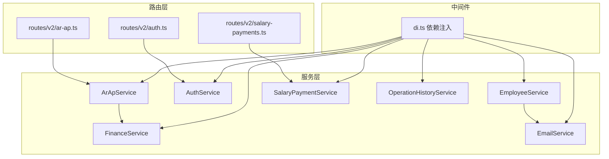
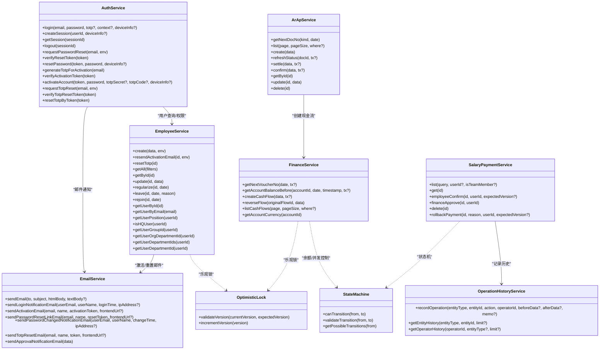
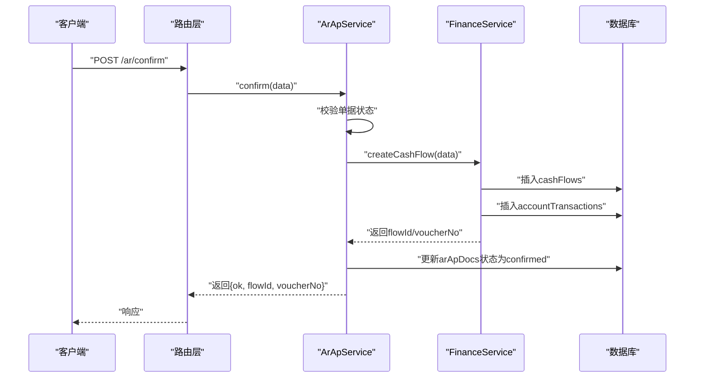

# 服务层架构

<cite>
**本文引用的文件**
- [backend/src/services/EmployeeService.ts](file://backend/src/services/EmployeeService.ts)
- [backend/src/services/FinanceService.ts](file://backend/src/services/FinanceService.ts)
- [backend/src/services/AuthService.ts](file://backend/src/services/AuthService.ts)
- [backend/src/services/ArApService.ts](file://backend/src/services/ArApService.ts)
- [backend/src/services/SalaryPaymentService.ts](file://backend/src/services/SalaryPaymentService.ts)
- [backend/src/services/EmailService.ts](file://backend/src/services/EmailService.ts)
- [backend/src/services/OperationHistoryService.ts](file://backend/src/services/OperationHistoryService.ts)
- [backend/src/middleware/di.ts](file://backend/src/middleware/di.ts)
- [backend/src/utils/optimistic-lock.ts](file://backend/src/utils/optimistic-lock.ts)
- [backend/src/utils/state-machine.ts](file://backend/src/utils/state-machine.ts)
- [backend/src/routes/v2/auth.ts](file://backend/src/routes/v2/auth.ts)
- [backend/src/routes/v2/salary-payments.ts](file://backend/src/routes/v2/salary-payments.ts)
- [backend/src/routes/v2/ar-ap.ts](file://backend/src/routes/v2/ar-ap.ts)
</cite>

## 目录
1. [引言](#引言)
2. [项目结构](#项目结构)
3. [核心组件](#核心组件)
4. [架构总览](#架构总览)
5. [详细组件分析](#详细组件分析)
6. [依赖关系分析](#依赖关系分析)
7. [性能考量](#性能考量)
8. [故障排查指南](#故障排查指南)
9. [结论](#结论)
10. [附录](#附录)

## 引言
本文件系统化梳理后端服务层的架构设计与实现，重点阐释以下主题：
- 服务类如何遵循单一职责原则，封装特定领域的业务规则与操作；
- 服务之间的依赖关系与依赖注入机制；
- 服务方法的设计模式：事务一致性、乐观锁并发控制、操作历史追踪；
- 通过复杂业务流程（如薪资发放）展示多服务协同；
- 服务层与数据库访问层（Drizzle ORM）及外部服务（邮件）的交互与异常处理策略。

## 项目结构
服务层位于 backend/src/services，围绕财务与人力资源等核心领域划分服务类，配合中间件进行依赖注入，路由层通过上下文变量调用具体服务。

图表来源
- [backend/src/middleware/di.ts](file://backend/src/middleware/di.ts#L41-L155)
- [backend/src/routes/v2/auth.ts](file://backend/src/routes/v2/auth.ts#L81-L144)
- [backend/src/routes/v2/salary-payments.ts](file://backend/src/routes/v2/salary-payments.ts#L40-L203)
- [backend/src/routes/v2/ar-ap.ts](file://backend/src/routes/v2/ar-ap.ts#L194-L437)

章节来源
- [backend/src/middleware/di.ts](file://backend/src/middleware/di.ts#L41-L155)

## 核心组件
- EmployeeService：负责员工生命周期管理、用户认证字段初始化、邮箱路由与激活邮件发送、用户权限与组织关系查询等。
- FinanceService：负责现金流与会计分录的核心逻辑，包括凭证号生成、余额校验、红冲、乐观锁并发控制、事务一致性保障。
- AuthService：负责登录、会话、密码重置、TOTP绑定与重置、激活流程、审计日志与邮件通知。
- ArApService：负责应收应付单据的创建、状态维护、结算、确认（联动FinanceService创建现金流）。
- SalaryPaymentService：负责薪资支付的查询、状态机驱动的审批与支付流程、乐观锁与操作历史记录。
- EmailService：封装邮件发送接口，统一模板与错误处理。
- OperationHistoryService：记录业务操作历史，便于审计与回溯。

章节来源
- [backend/src/services/EmployeeService.ts](file://backend/src/services/EmployeeService.ts#L1-L758)
- [backend/src/services/FinanceService.ts](file://backend/src/services/FinanceService.ts#L1-L443)
- [backend/src/services/AuthService.ts](file://backend/src/services/AuthService.ts#L1-L495)
- [backend/src/services/ArApService.ts](file://backend/src/services/ArApService.ts#L1-L264)
- [backend/src/services/SalaryPaymentService.ts](file://backend/src/services/SalaryPaymentService.ts#L1-L326)
- [backend/src/services/EmailService.ts](file://backend/src/services/EmailService.ts#L1-L469)
- [backend/src/services/OperationHistoryService.ts](file://backend/src/services/OperationHistoryService.ts#L1-L108)

## 架构总览
服务层采用“领域服务+工具函数”的组合：
- 领域服务：围绕业务实体与流程封装，如薪资、应收应付、资金流水、员工与认证。
- 工具函数：乐观锁、状态机、查询构造器等，提升可复用性与一致性。
- 依赖注入：在中间件中集中初始化各服务实例，路由层通过上下文变量获取所需服务，避免硬编码耦合。

图表来源
- [backend/src/services/EmployeeService.ts](file://backend/src/services/EmployeeService.ts#L1-L758)
- [backend/src/services/FinanceService.ts](file://backend/src/services/FinanceService.ts#L1-L443)
- [backend/src/services/AuthService.ts](file://backend/src/services/AuthService.ts#L1-L495)
- [backend/src/services/ArApService.ts](file://backend/src/services/ArApService.ts#L1-L264)
- [backend/src/services/SalaryPaymentService.ts](file://backend/src/services/SalaryPaymentService.ts#L1-L326)
- [backend/src/services/EmailService.ts](file://backend/src/services/EmailService.ts#L1-L469)
- [backend/src/services/OperationHistoryService.ts](file://backend/src/services/OperationHistoryService.ts#L1-L108)
- [backend/src/utils/state-machine.ts](file://backend/src/utils/state-machine.ts#L1-L89)
- [backend/src/utils/optimistic-lock.ts](file://backend/src/utils/optimistic-lock.ts#L1-L41)

## 详细组件分析

### EmployeeService：员工与认证领域
- 单一职责：员工创建、状态变更（试用期转正、离职、复职）、用户信息与权限查询、邮箱路由与激活邮件。
- 关键设计：
  - 顺序执行与回滚：在不支持传统事务的环境中，通过资源跟踪与逆序删除实现回滚。
  - 邮箱路由集成：与外部邮件路由服务对接，确保个人邮箱加入路由白名单。
  - 权限与组织：提供用户所属部门、组织部门、岗位权限查询能力。
- 错误处理：统一使用业务错误与NOT_FOUND/UNAUTHORIZED等错误码，保证一致的错误语义。

章节来源
- [backend/src/services/EmployeeService.ts](file://backend/src/services/EmployeeService.ts#L1-L758)

### FinanceService：资金与会计领域
- 单一职责：凭证号生成、余额计算、现金流创建、红冲、账户余额并发控制。
- 关键设计：
  - 乐观锁：通过更新账户版本字段实现并发冲突检测；若失败则提示“并发冲突”，要求重试。
  - 余额校验：基于历史交易计算余额，支出场景下进行余额充足性检查。
  - 事务一致性：红冲流程使用数据库事务包裹，确保原始流水与红冲流水的一致性。
- 错误处理：针对账户不存在、余额不足、并发冲突等场景抛出明确的业务错误。

章节来源
- [backend/src/services/FinanceService.ts](file://backend/src/services/FinanceService.ts#L1-L443)

### AuthService：认证与会话领域
- 单一职责：登录、会话管理、密码重置、TOTP绑定与重置、激活流程、审计日志与邮件通知。
- 关键设计：
  - 设备指纹与信任设备：新设备登录需要TOTP验证并通过后加入信任设备。
  - 单点登录：删除旧会话（KV与DB），写入新会话并设置TTL。
  - 审计日志：登录、登出、密码重置、激活、TOTP重置等关键动作均记录审计。
- 与外部服务：通过EmailService发送登录提醒、激活、重置密码、TOTP重置等邮件。

章节来源
- [backend/src/services/AuthService.ts](file://backend/src/services/AuthService.ts#L1-L495)
- [backend/src/services/EmailService.ts](file://backend/src/services/EmailService.ts#L1-L469)

### ArApService：应收应付领域
- 单一职责：单据创建、状态维护、结算、确认（联动FinanceService创建现金流）。
- 关键设计：
  - 状态刷新：根据结算汇总自动更新单据状态（open/partially_settled/settled）。
  - 确认流程：确认时调用FinanceService创建现金流，同时写入结算记录并更新单据状态。
- 错误处理：对单据不存在、账户状态异常、重复确认等进行保护。

章节来源
- [backend/src/services/ArApService.ts](file://backend/src/services/ArApService.ts#L1-L264)
- [backend/src/services/FinanceService.ts](file://backend/src/services/FinanceService.ts#L1-L443)

### SalaryPaymentService：薪资支付领域
- 单一职责：薪资支付列表、详情、员工确认、财务审批、删除与回退。
- 关键设计：
  - 状态机：严格的状态转换约束，确保流程合规。
  - 乐观锁：在状态变更前校验版本号，防止并发覆盖。
  - 操作历史：每次状态变更记录前后数据，便于审计与回溯。
- 错误处理：对非法状态、待审批分配未完成、版本不匹配等情况进行保护。

章节来源
- [backend/src/services/SalaryPaymentService.ts](file://backend/src/services/SalaryPaymentService.ts#L1-L326)
- [backend/src/utils/state-machine.ts](file://backend/src/utils/state-machine.ts#L1-L89)
- [backend/src/utils/optimistic-lock.ts](file://backend/src/utils/optimistic-lock.ts#L1-L41)
- [backend/src/services/OperationHistoryService.ts](file://backend/src/services/OperationHistoryService.ts#L1-L108)

### EmailService：邮件通知
- 单一职责：统一邮件发送接口与模板，屏蔽底层邮件工作器细节。
- 关键设计：
  - 模板化：登录提醒、激活、重置密码、TOTP重置、审批通知等模板。
  - 错误处理：对未配置、网络异常、工作器返回失败等情况记录日志并返回错误信息。

章节来源
- [backend/src/services/EmailService.ts](file://backend/src/services/EmailService.ts#L1-L469)

### OperationHistoryService：操作历史
- 单一职责：记录业务实体的操作历史，支持按实体与操作人检索。
- 关键设计：
  - 结构化存储：beforeData/afterData以JSON形式保存，便于审计与回溯。
  - 容错：获取操作人名称失败时不中断历史记录。

章节来源
- [backend/src/services/OperationHistoryService.ts](file://backend/src/services/OperationHistoryService.ts#L1-L108)

## 依赖关系分析
- 依赖注入：在中间件中集中初始化服务实例，注入到上下文变量，路由层通过 c.var.services.* 获取。
- 服务间依赖：
  - ArApService 依赖 FinanceService 创建现金流；
  - AuthService 依赖 EmployeeService 查询用户信息与权限；
  - EmployeeService 依赖 EmailService 发送激活/重置邮件；
  - SalaryPaymentService 依赖 OperationHistoryService 记录历史；
  - FinanceService 与 SalaryPaymentService 共同依赖乐观锁工具与状态机工具。

图表来源
- [backend/src/routes/v2/ar-ap.ts](file://backend/src/routes/v2/ar-ap.ts#L405-L437)
- [backend/src/services/ArApService.ts](file://backend/src/services/ArApService.ts#L188-L243)
- [backend/src/services/FinanceService.ts](file://backend/src/services/FinanceService.ts#L146-L229)

章节来源
- [backend/src/middleware/di.ts](file://backend/src/middleware/di.ts#L41-L155)
- [backend/src/routes/v2/ar-ap.ts](file://backend/src/routes/v2/ar-ap.ts#L405-L437)
- [backend/src/services/ArApService.ts](file://backend/src/services/ArApService.ts#L188-L243)
- [backend/src/services/FinanceService.ts](file://backend/src/services/FinanceService.ts#L146-L229)

## 性能考量
- 并发控制：
  - FinanceService 使用账户版本字段的乐观锁，避免余额计算与更新的竞态；
  - SalaryPaymentService 使用版本号与状态机双重约束，减少无效重试。
- 数据访问：
  - FinanceService 在余额计算时依赖历史交易排序与限制，避免全表扫描；
  - ArApService 在查询单据列表时使用并行查询结算与站点信息，降低延迟。
- 缓存与会话：
  - AuthService 使用KV存储会话，DB作为持久化备份，兼顾性能与一致性。

章节来源
- [backend/src/services/FinanceService.ts](file://backend/src/services/FinanceService.ts#L146-L229)
- [backend/src/services/SalaryPaymentService.ts](file://backend/src/services/SalaryPaymentService.ts#L117-L171)
- [backend/src/routes/v2/ar-ap.ts](file://backend/src/routes/v2/ar-ap.ts#L341-L370)
- [backend/src/services/AuthService.ts](file://backend/src/services/AuthService.ts#L150-L219)

## 故障排查指南
- 登录失败/被拒绝：
  - 检查用户是否存在、是否启用、密码是否正确、是否绑定TOTP；
  - 新设备登录需验证TOTP，确认信任设备策略。
- 账户余额不足或并发冲突：
  - FinanceService 在支出场景下进行余额校验与乐观锁冲突检测；
  - 若出现“并发冲突”，提示刷新后重试。
- 薪资支付状态不可变更：
  - 检查状态机允许的转换路径，确认分配状态与审批状态满足前置条件；
  - 若版本不匹配，前端应重新拉取最新版本号后重试。
- 邮件发送失败：
  - 检查 EMAIL_SERVICE 与 EMAIL_TOKEN 是否配置；
  - 查看 EmailService 返回的错误信息与日志。

章节来源
- [backend/src/services/AuthService.ts](file://backend/src/services/AuthService.ts#L34-L148)
- [backend/src/services/FinanceService.ts](file://backend/src/services/FinanceService.ts#L146-L229)
- [backend/src/utils/state-machine.ts](file://backend/src/utils/state-machine.ts#L1-L89)
- [backend/src/utils/optimistic-lock.ts](file://backend/src/utils/optimistic-lock.ts#L1-L41)
- [backend/src/services/EmailService.ts](file://backend/src/services/EmailService.ts#L107-L145)

## 结论
服务层通过清晰的领域划分、严格的并发控制与状态机约束、完善的审计与历史记录，实现了高内聚、低耦合的业务封装。依赖注入与路由层解耦进一步提升了可维护性与可测试性。在复杂业务流程（如薪资发放）中，多服务协同与工具函数的复用确保了数据一致性与用户体验。

## 附录

### 依赖注入与路由调用示例
- 依赖注入：中间件集中初始化各服务实例并注入上下文变量。
- 路由调用：路由层通过 c.var.services.* 获取服务实例，调用对应方法。

章节来源
- [backend/src/middleware/di.ts](file://backend/src/middleware/di.ts#L41-L155)
- [backend/src/routes/v2/auth.ts](file://backend/src/routes/v2/auth.ts#L81-L144)
- [backend/src/routes/v2/salary-payments.ts](file://backend/src/routes/v2/salary-payments.ts#L40-L203)
- [backend/src/routes/v2/ar-ap.ts](file://backend/src/routes/v2/ar-ap.ts#L194-L437)