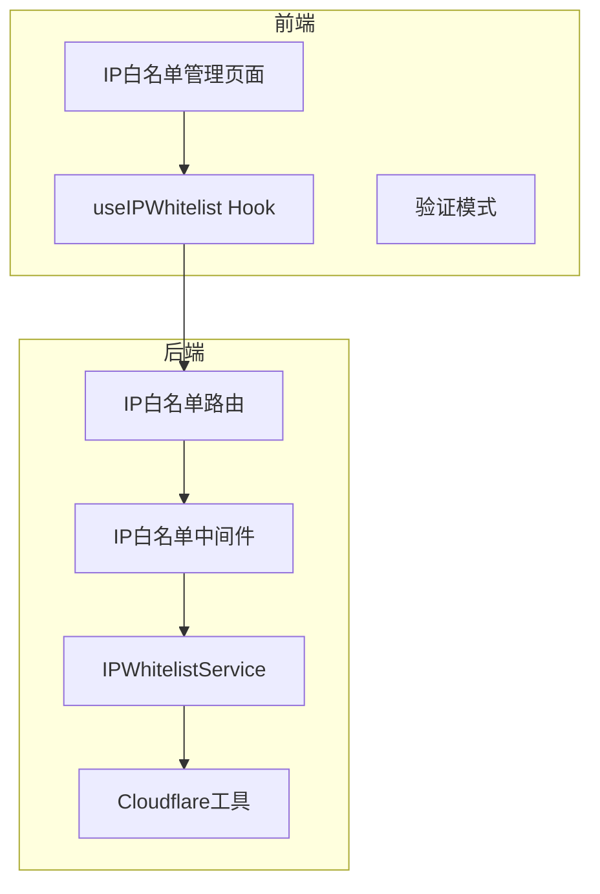
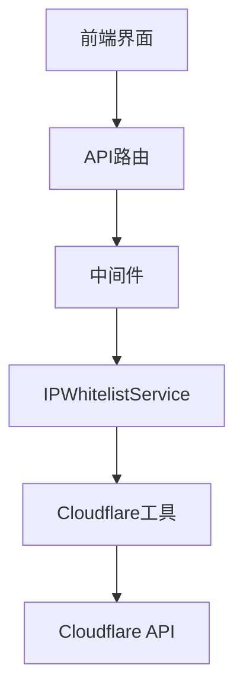
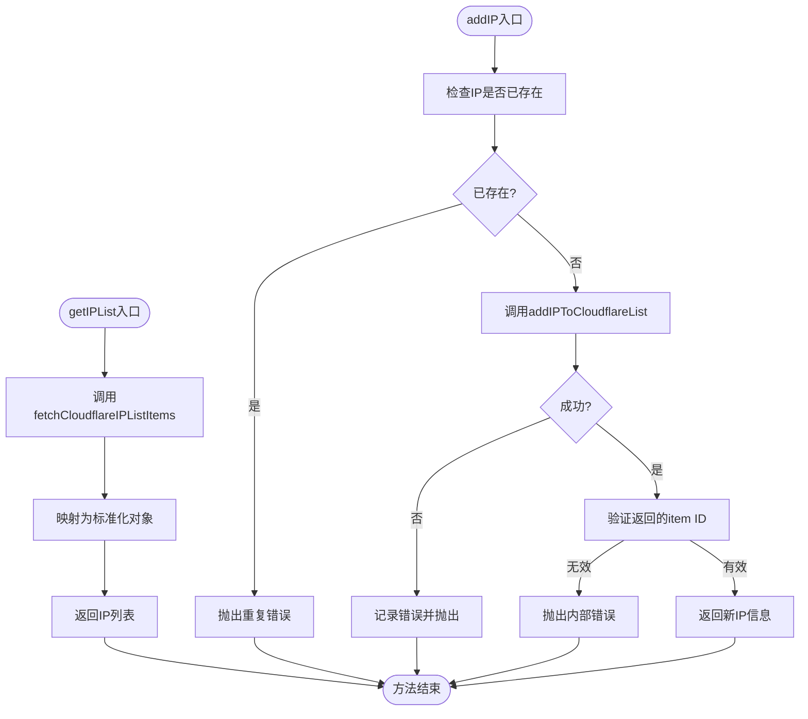
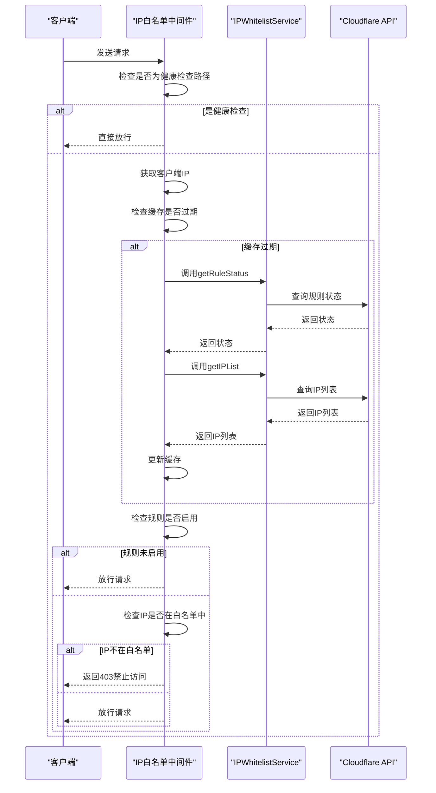
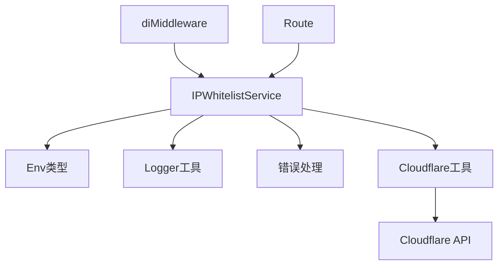

# IP白名单服务

<cite>
**本文档引用文件**  
- [IPWhitelistService.ts](file://backend/src/services/IPWhitelistService.ts)
- [ipWhitelist.ts](file://backend/src/middleware/ipWhitelist.ts)
- [cloudflare.ts](file://backend/src/utils/cloudflare.ts)
- [ip-whitelist.ts](file://backend/src/routes/v2/ip-whitelist.ts)
- [di.ts](file://backend/src/middleware/di.ts)
- [types.ts](file://backend/src/types.ts)
- [wrangler.toml](file://backend/wrangler.toml)
- [IPWhitelistManagementPage.tsx](file://frontend/src/features/system/pages/IPWhitelistManagementPage.tsx)
- [useIPWhitelist.ts](file://frontend/src/hooks/business/useIPWhitelist.ts)
- [ipWhitelist.schema.ts](file://frontend/src/validations/ipWhitelist.schema.ts)
- [ip-whitelist.test.ts](file://backend/test/routes/ip-whitelist.test.ts)
</cite>

## 目录
1. [简介](#简介)
2. [项目结构](#项目结构)
3. [核心组件](#核心组件)
4. [架构概述](#架构概述)
5. [详细组件分析](#详细组件分析)
6. [依赖分析](#依赖分析)
7. [性能考虑](#性能考虑)
8. [故障排除指南](#故障排除指南)
9. [结论](#结论)

## 简介
IP白名单服务是系统安全架构的核心组件，通过与Cloudflare API集成实现网络层访问控制。该服务允许管理员配置受信任的IP地址列表，并通过Cloudflare的防火墙规则对访问请求进行过滤。服务设计遵循微服务架构原则，通过环境变量注入依赖，实现了与Cloudflare基础设施的无缝集成。IP白名单中间件在请求处理链中执行实时IP验证，确保只有来自受信任网络的请求能够访问系统资源。该服务支持单个和批量IP管理操作，并提供了完整的审计日志记录功能。

## 项目结构
IP白名单功能在项目中具有清晰的分层结构，包括后端服务、中间件、路由处理、前端管理界面和验证模式。后端服务位于`backend/src/services/`目录下，中间件位于`backend/src/middleware/`目录，路由定义在`backend/src/routes/v2/`目录中。前端管理页面位于`frontend/src/features/system/pages/`目录，相关的业务逻辑Hook和验证模式分别位于`frontend/src/hooks/business/`和`frontend/src/validations/`目录中。这种分层结构确保了功能的模块化和可维护性。



**图源**  
- [IPWhitelistManagementPage.tsx](file://frontend/src/features/system/pages/IPWhitelistManagementPage.tsx)
- [useIPWhitelist.ts](file://frontend/src/hooks/business/useIPWhitelist.ts)
- [ip-whitelist.ts](file://backend/src/routes/v2/ip-whitelist.ts)
- [ipWhitelist.ts](file://backend/src/middleware/ipWhitelist.ts)
- [IPWhitelistService.ts](file://backend/src/services/IPWhitelistService.ts)
- [cloudflare.ts](file://backend/src/utils/cloudflare.ts)

**章节源**  
- [IPWhitelistManagementPage.tsx](file://frontend/src/features/system/pages/IPWhitelistManagementPage.tsx)
- [ip-whitelist.ts](file://backend/src/routes/v2/ip-whitelist.ts)

## 核心组件
IP白名单服务的核心组件包括IPWhitelistService类、ipWhitelist中间件和相关的Cloudflare工具函数。IPWhitelistService类封装了所有与IP列表管理相关的业务逻辑，通过构造函数注入Env对象来访问Cloudflare API凭证。中间件组件负责在请求处理过程中验证客户端IP地址，决定是否放行请求。Cloudflare工具函数提供了与Cloudflare API交互的底层支持，包括IP列表和防火墙规则的管理。这些组件通过依赖注入机制在应用启动时被正确初始化和连接。

**章节源**  
- [IPWhitelistService.ts](file://backend/src/services/IPWhitelistService.ts)
- [ipWhitelist.ts](file://backend/src/middleware/ipWhitelist.ts)
- [cloudflare.ts](file://backend/src/utils/cloudflare.ts)

## 架构概述
IP白名单服务采用分层架构设计，从上到下分为前端界面层、API路由层、中间件层、服务层和工具层。前端界面通过React组件和自定义Hook与后端API交互，提供用户友好的管理界面。API路由层定义了RESTful接口，处理来自前端的HTTP请求。中间件层在请求处理链中执行IP验证，确保安全策略的实施。服务层封装了核心业务逻辑，而工具层提供了与Cloudflare API交互的底层支持。这种分层架构确保了关注点分离，提高了代码的可测试性和可维护性。



**图源**  
- [IPWhitelistManagementPage.tsx](file://frontend/src/features/system/pages/IPWhitelistManagementPage.tsx)
- [ip-whitelist.ts](file://backend/src/routes/v2/ip-whitelist.ts)
- [ipWhitelist.ts](file://backend/src/middleware/ipWhitelist.ts)
- [IPWhitelistService.ts](file://backend/src/services/IPWhitelistService.ts)
- [cloudflare.ts](file://backend/src/utils/cloudflare.ts)

## 详细组件分析

### IPWhitelistService分析
IPWhitelistService是IP白名单功能的核心服务类，负责管理受信任的IP地址列表。该服务通过构造函数注入Env对象，从而访问Cloudflare API所需的凭证和配置信息。服务提供了多种方法来操作IP列表，包括获取列表、添加单个IP、批量添加IP、删除IP等。所有操作都通过Cloudflare API执行，确保IP列表在Cloudflare网络边缘生效。

#### 服务类图
```mermaid
classDiagram
class IPWhitelistService {
-env : Env
+constructor(env : Env)
+getIPList() : Promise~IPWhitelistItem[]~
+addIP(ip : string, description? : string) : Promise~IPWhitelistItem~
+batchAddIPs(ips : {ip : string, description? : string}[]) : Promise~BatchAddResult~
+batchDeleteIPs(ids : string[]) : Promise~BatchDeleteResult~
+deleteIP(id : string) : Promise~{ok : boolean}~
+getRuleStatus() : Promise~{enabled : boolean}~
+createRule() : Promise~{ok : boolean, ruleId : string, rulesetId : string}~
+toggleRule(enabled : boolean) : Promise~{ok : boolean, enabled : boolean}~
}
class IPWhitelistItem {
+id : string
+ipAddress : string
+description : string | null
+cloudflareRuleId : string
+createdAt : number
+updatedAt : number
}
class BatchAddResult {
+success : boolean
+successCount : number
+failedCount : number
+errors : {ip : string, error : string}[]
}
class BatchDeleteResult {
+success : boolean
+successCount : number
+failedCount : number
}
IPWhitelistService --> IPWhitelistItem : "返回"
IPWhitelistService --> BatchAddResult : "返回"
IPWhitelistService --> BatchDeleteResult : "返回"
```

**图源**  
- [IPWhitelistService.ts](file://backend/src/services/IPWhitelistService.ts)

**章节源**  
- [IPWhitelistService.ts](file://backend/src/services/IPWhitelistService.ts)

### getIPList和addIP方法逻辑
getIPList方法从Cloudflare API获取当前的IP白名单列表，并将其转换为应用内部的数据结构。该方法首先调用fetchCloudflareIPListItems工具函数获取原始数据，然后映射为包含id、ipAddress、description等字段的标准化对象数组。addIP方法用于向白名单添加新的IP地址，它首先检查IP是否已存在以避免重复，然后调用addIPToCloudflareList工具函数将IP添加到Cloudflare列表中。如果添加成功，返回包含新IP详细信息的对象；如果失败，则抛出相应的错误。



**图源**  
- [IPWhitelistService.ts](file://backend/src/services/IPWhitelistService.ts)

**章节源**  
- [IPWhitelistService.ts](file://backend/src/services/IPWhitelistService.ts#L18-L57)

### 中间件集成与请求验证流程
ipWhitelist中间件在请求到达业务逻辑之前执行IP验证。中间件首先检查请求路径，对健康检查等特殊路径直接放行。然后从请求头中获取客户端IP地址，通常通过CF-Connecting-IP头获取。中间件使用内存缓存来存储IP列表和规则状态，以减少对Cloudflare API的频繁调用。当缓存过期时，中间件会刷新缓存。如果规则已启用且客户端IP不在白名单中，中间件返回403禁止访问响应；否则，请求将继续处理。



**图源**  
- [ipWhitelist.ts](file://backend/src/middleware/ipWhitelist.ts)

**章节源**  
- [ipWhitelist.ts](file://backend/src/middleware/ipWhitelist.ts#L12-L75)

## 依赖分析
IP白名单服务依赖于多个内部和外部组件。内部依赖包括Env类型定义、Logger工具、错误处理模块和Cloudflare工具函数。外部依赖主要是Cloudflare API，通过专用的API Token进行身份验证。服务通过依赖注入机制获取这些依赖，确保了松耦合和可测试性。在应用启动时，di中间件负责创建IPWhitelistService实例并将其注入到请求上下文中，供其他组件使用。



**图源**  
- [IPWhitelistService.ts](file://backend/src/services/IPWhitelistService.ts)
- [types.ts](file://backend/src/types.ts)
- [cloudflare.ts](file://backend/src/utils/cloudflare.ts)
- [di.ts](file://backend/src/middleware/di.ts)

**章节源**  
- [IPWhitelistService.ts](file://backend/src/services/IPWhitelistService.ts)
- [types.ts](file://backend/src/types.ts)
- [cloudflare.ts](file://backend/src/utils/cloudflare.ts)
- [di.ts](file://backend/src/middleware/di.ts)

## 性能考虑
IP白名单服务在设计时充分考虑了性能因素。中间件使用内存缓存来存储IP列表和规则状态，缓存有效期为1分钟，这大大减少了对Cloudflare API的调用频率。缓存机制确保了在高并发场景下，IP验证操作能够快速完成，而不会成为性能瓶颈。此外，服务提供了批量操作接口，允许一次性添加或删除多个IP地址，减少了网络往返次数。对于Cloudflare API的异步操作，服务实现了适当的等待和验证机制，确保操作的可靠性。

## 故障排除指南
当IP白名单服务出现问题时，可以按照以下步骤进行排查：首先检查Cloudflare API凭证是否正确配置，包括CF_IP_LISTS_TOKEN、CF_FIREWALL_TOKEN、CF_ACCOUNT_ID和CF_ZONE_ID。其次，查看日志中的错误信息，特别是与Cloudflare API通信相关的错误。如果IP列表无法同步，检查网络连接和Cloudflare API的可用性。对于中间件不生效的问题，确认中间件是否已正确注册到应用的中间件链中。最后，确保前端和后端的版本兼容，API接口定义一致。

**章节源**  
- [IPWhitelistService.ts](file://backend/src/services/IPWhitelistService.ts)
- [ipWhitelist.ts](file://backend/src/middleware/ipWhitelist.ts)
- [cloudflare.ts](file://backend/src/utils/cloudflare.ts)
- [wrangler.toml](file://backend/wrangler.toml)

## 结论
IP白名单服务通过与Cloudflare基础设施的深度集成，为系统提供了强大的网络层访问控制能力。服务设计合理，代码结构清晰，遵循了良好的软件工程实践。通过环境变量注入依赖，服务具有良好的可配置性和可移植性。中间件的缓存机制确保了高性能的请求验证，而丰富的API接口支持灵活的IP管理操作。整体而言，该服务是系统安全架构的重要组成部分，有效保护了系统资源免受未授权访问。