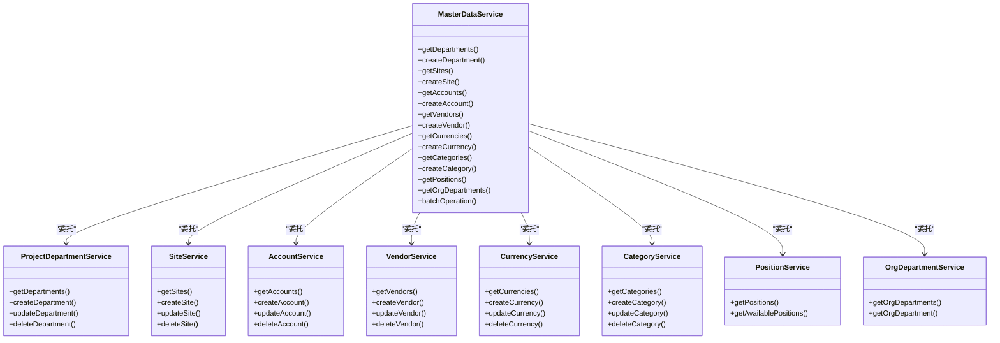
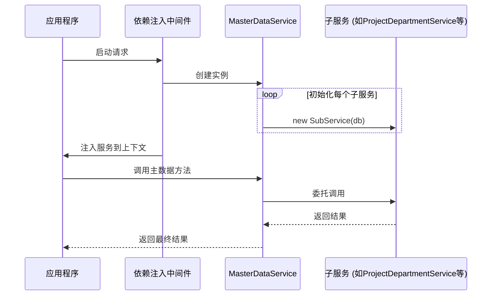
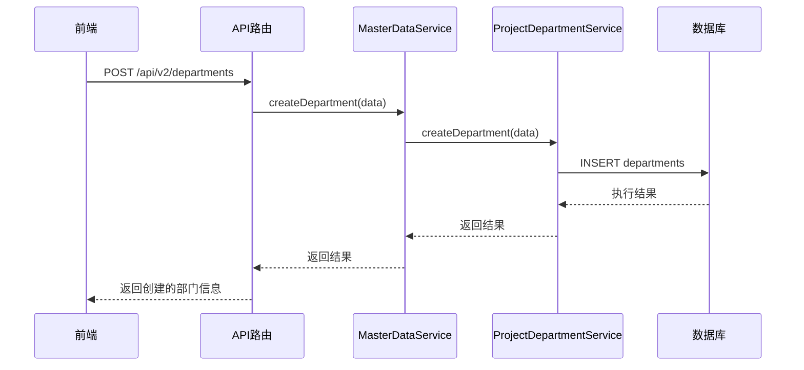
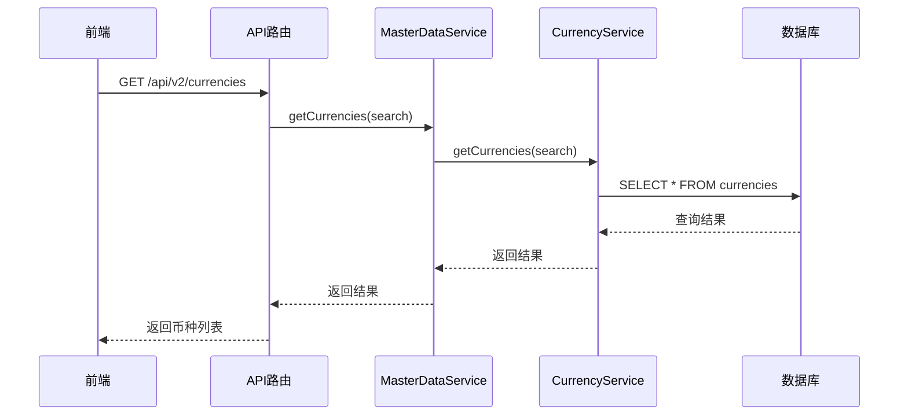
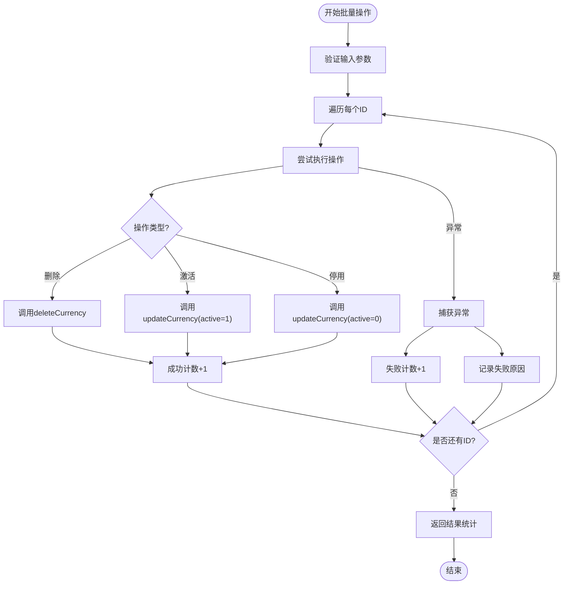
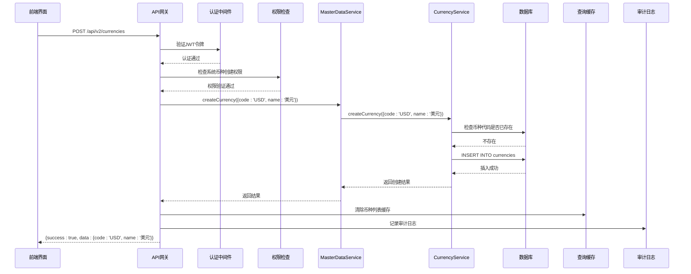
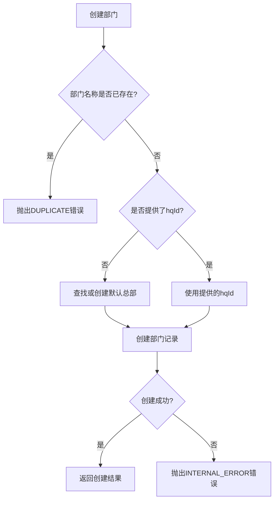
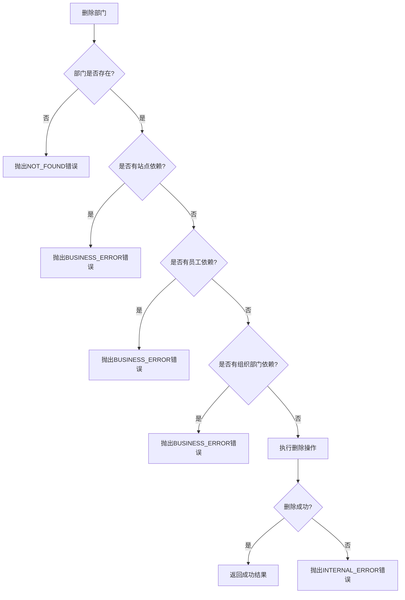

# 主数据服务

<cite>
**本文档引用的文件**  
- [MasterDataService.ts](file://backend/src/services/MasterDataService.ts)
- [ProjectDepartmentService.ts](file://backend/src/services/ProjectDepartmentService.ts)
- [SiteService.ts](file://backend/src/services/SiteService.ts)
- [AccountService.ts](file://backend/src/services/AccountService.ts)
- [CurrencyService.ts](file://backend/src/services/CurrencyService.ts)
- [VendorService.ts](file://backend/src/services/VendorService.ts)
- [CategoryService.ts](file://backend/src/services/CategoryService.ts)
- [PositionService.ts](file://backend/src/services/PositionService.ts)
- [OrgDepartmentService.ts](file://backend/src/services/OrgDepartmentService.ts)
- [departments.ts](file://backend/src/routes/v2/master-data/departments.ts)
- [currencies.ts](file://backend/src/routes/v2/master-data/currencies.ts)
- [di.ts](file://backend/src/middleware/di.ts)
- [errors.ts](file://backend/src/utils/errors.ts)
</cite>

## 目录
1. [引言](#引言)
2. [核心架构设计](#核心架构设计)
3. [服务依赖注入机制](#服务依赖注入机制)
4. [CRUD操作代理实现](#crud操作代理实现)
5. [批量数据处理](#批量数据处理)
6. [API调用流程示例](#api调用流程示例)
7. [数据一致性与业务规则验证](#数据一致性与业务规则验证)
8. [结论](#结论)

## 引言

主数据服务（MasterDataService）是系统配置的核心组件，采用门面模式统一管理组织架构、部门、站点、账户、供应商、币种、分类和职位等主数据。该服务通过依赖注入整合多个子服务，为上层应用提供统一的主数据访问接口。本文档将深入解析其内部实现机制，阐述其架构设计、操作代理、批量处理以及在前后端数据交互中的桥梁作用。

## 核心架构设计

主数据服务采用了门面（Facade）设计模式，作为统一入口协调多个具体的主数据管理服务。这种设计模式将复杂的子系统接口封装起来，为客户端提供一个简化的统一接口。

**图表来源**  
- [MasterDataService.ts](file://backend/src/services/MasterDataService.ts)
- [ProjectDepartmentService.ts](file://backend/src/services/ProjectDepartmentService.ts)
- [SiteService.ts](file://backend/src/services/SiteService.ts)
- [AccountService.ts](file://backend/src/services/AccountService.ts)
- [VendorService.ts](file://backend/src/services/VendorService.ts)
- [CurrencyService.ts](file://backend/src/services/CurrencyService.ts)
- [CategoryService.ts](file://backend/src/services/CategoryService.ts)
- [PositionService.ts](file://backend/src/services/PositionService.ts)
- [OrgDepartmentService.ts](file://backend/src/services/OrgDepartmentService.ts)

**章节来源**  
- [MasterDataService.ts](file://backend/src/services/MasterDataService.ts#L1-L261)

## 服务依赖注入机制

主数据服务通过依赖注入（DI）模式在构造函数中初始化所有依赖的子服务。这种设计实现了控制反转，使得服务之间的耦合度降低，提高了代码的可测试性和可维护性。

**图表来源**  
- [MasterDataService.ts](file://backend/src/services/MasterDataService.ts#L29-L39)
- [di.ts](file://backend/src/middleware/di.ts#L71)

**章节来源**  
- [MasterDataService.ts](file://backend/src/services/MasterDataService.ts#L6-L39)
- [di.ts](file://backend/src/middleware/di.ts#L41-L156)

## CRUD操作代理实现

主数据服务通过方法代理的方式，将具体的CRUD操作委托给相应的子服务实现。每个主数据实体都有对应的方法，这些方法只是简单地调用底层服务的同名方法。

### 部门管理代理

部门管理功能通过`ProjectDepartmentService`实现，`MasterDataService`提供了`getDepartments`、`createDepartment`、`updateDepartment`和`deleteDepartment`等方法作为代理。

**图表来源**  
- [MasterDataService.ts](file://backend/src/services/MasterDataService.ts#L43-L57)
- [ProjectDepartmentService.ts](file://backend/src/services/ProjectDepartmentService.ts#L67-L108)
- [departments.ts](file://backend/src/routes/v2/master-data/departments.ts#L96-L133)

**章节来源**  
- [MasterDataService.ts](file://backend/src/services/MasterDataService.ts#L41-L57)
- [ProjectDepartmentService.ts](file://backend/src/services/ProjectDepartmentService.ts#L67-L108)

### 币种管理代理

币种管理功能通过`CurrencyService`实现，`MasterDataService`提供了`getCurrencies`、`createCurrency`、`updateCurrency`和`deleteCurrency`等方法作为代理。

**图表来源**  
- [MasterDataService.ts](file://backend/src/services/MasterDataService.ts#L172-L186)
- [CurrencyService.ts](file://backend/src/services/CurrencyService.ts#L14-L25)
- [currencies.ts](file://backend/src/routes/v2/master-data/currencies.ts#L44-L77)

**章节来源**  
- [MasterDataService.ts](file://backend/src/services/MasterDataService.ts#L170-L186)
- [CurrencyService.ts](file://backend/src/services/CurrencyService.ts#L14-L25)

## 批量数据处理

`batchOperation`方法实现了对主数据的批量操作功能，支持删除、激活和停用等批量操作。该方法通过循环遍历ID列表，对每个实体执行相应的操作，并收集成功和失败的结果。

**图表来源**  
- [MasterDataService.ts](file://backend/src/services/MasterDataService.ts#L188-L221)
- [currencies.ts](file://backend/src/routes/v2/master-data/currencies.ts#L288-L317)

**章节来源**  
- [MasterDataService.ts](file://backend/src/services/MasterDataService.ts#L188-L221)

## API调用流程示例

以币种配置的API调用流程为例，展示主数据服务在前后端数据交互中的桥梁作用。从前端发起请求到后端返回响应，主数据服务作为核心协调者，连接了路由层、业务逻辑层和数据访问层。

**图表来源**  
- [currencies.ts](file://backend/src/routes/v2/master-data/currencies.ts#L108-L141)
- [MasterDataService.ts](file://backend/src/services/MasterDataService.ts#L176-L178)
- [CurrencyService.ts](file://backend/src/services/CurrencyService.ts#L28-L44)
- [errors.ts](file://backend/src/utils/errors.ts)

**章节来源**  
- [currencies.ts](file://backend/src/routes/v2/master-data/currencies.ts#L108-L141)
- [MasterDataService.ts](file://backend/src/services/MasterDataService.ts#L176-L186)

## 数据一致性与业务规则验证

主数据服务在保持数据一致性和执行业务规则验证方面承担着重要职责。通过在子服务中实现严格的验证逻辑，确保了主数据的完整性和正确性。

### 业务规则验证

系统通过`Errors`工具类定义了统一的错误处理机制，包括资源不存在、字段重复、权限不足等常见业务错误。在创建和更新操作时，服务会进行相应的业务规则验证。

**图表来源**  
- [ProjectDepartmentService.ts](file://backend/src/services/ProjectDepartmentService.ts#L68-L73)
- [errors.ts](file://backend/src/utils/errors.ts#L35-L55)

**章节来源**  
- [ProjectDepartmentService.ts](file://backend/src/services/ProjectDepartmentService.ts#L67-L108)
- [errors.ts](file://backend/src/utils/errors.ts#L35-L55)

### 数据一致性保障

在删除操作时，系统会检查数据的依赖关系，防止因删除操作导致数据不一致。例如，删除部门前会检查是否有站点、员工或组织部门依赖于该部门。

**图表来源**  
- [ProjectDepartmentService.ts](file://backend/src/services/ProjectDepartmentService.ts#L135-L164)
- [errors.ts](file://backend/src/utils/errors.ts#L49)

**章节来源**  
- [ProjectDepartmentService.ts](file://backend/src/services/ProjectDepartmentService.ts#L135-L164)

## 结论

主数据服务作为系统配置的核心，通过门面模式有效地整合了多个子服务，为系统提供了统一的主数据管理接口。其架构设计体现了高内聚、低耦合的原则，通过依赖注入实现了服务间的松耦合。服务通过代理模式将CRUD操作委托给具体的子服务实现，保持了代码的清晰性和可维护性。批量操作功能通过统一的接口支持多种操作类型，提高了数据管理的效率。在API调用流程中，主数据服务作为前后端数据交互的桥梁，协调了认证、权限、缓存、审计等多个环节。通过严格的业务规则验证和数据一致性检查，确保了主数据的完整性和正确性，为整个系统的稳定运行提供了坚实的基础。