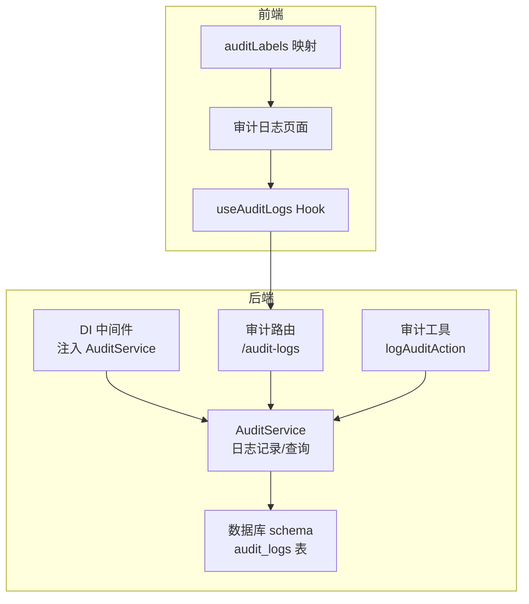
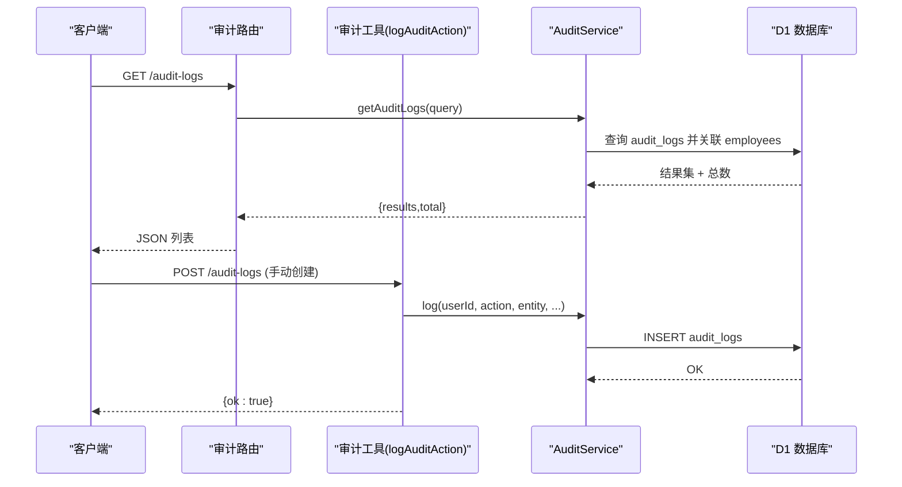
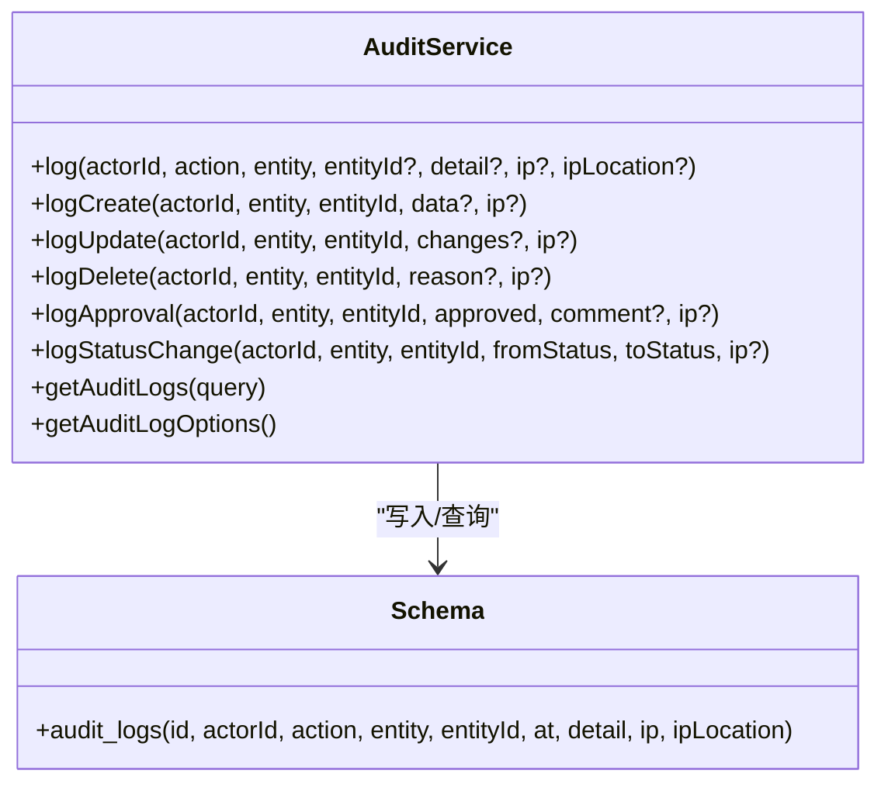
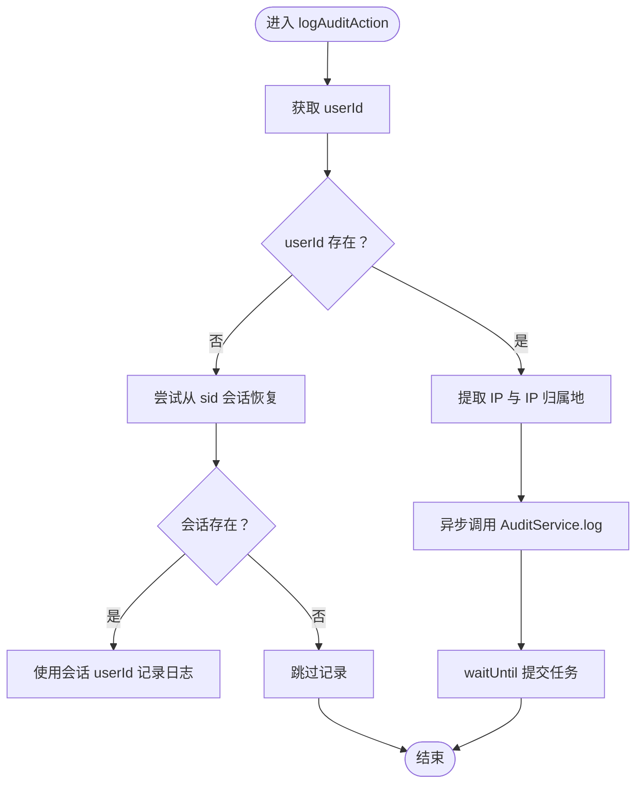
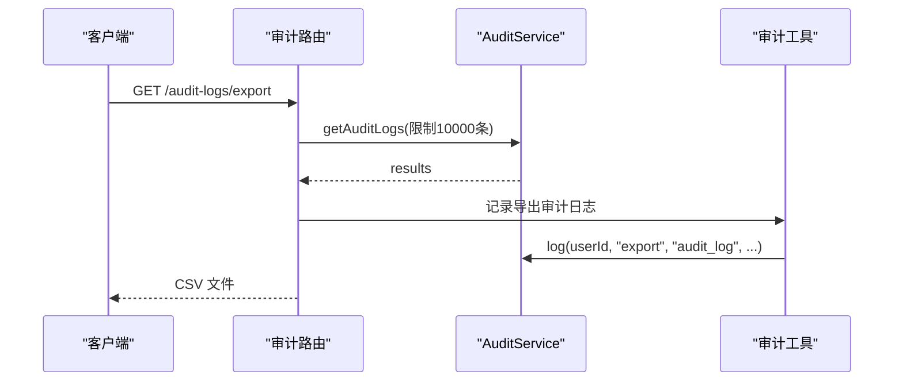
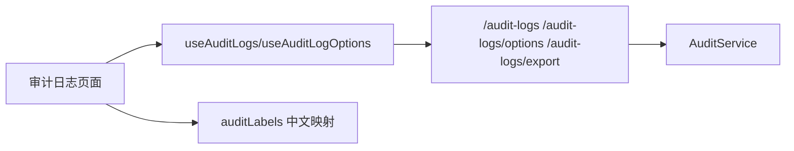
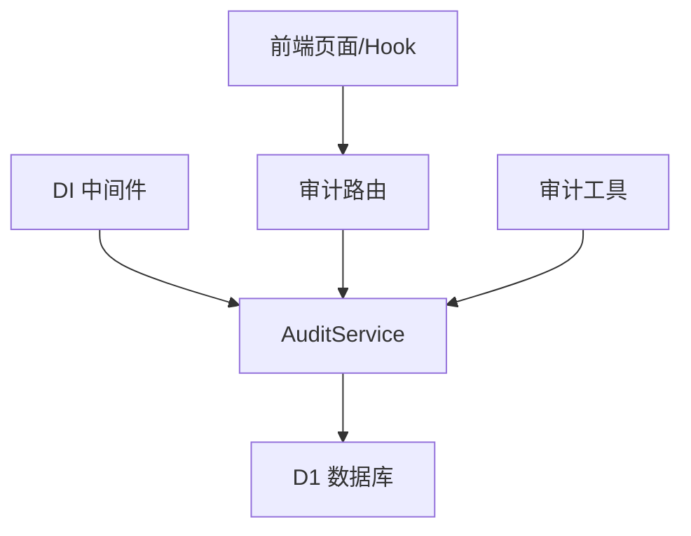
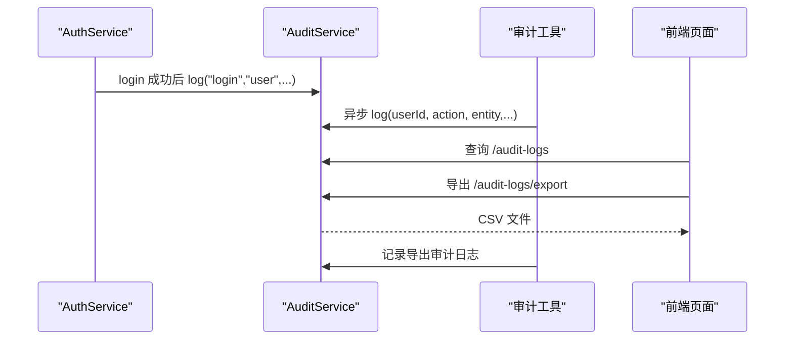

# 审计服务

<cite>
**本文引用的文件列表**
- [AuditService.ts](file://backend/src/services/AuditService.ts)
- [audit.ts](file://backend/src/utils/audit.ts)
- [audit.ts（路由）](file://backend/src/routes/v2/audit.ts)
- [AuthService.ts](file://backend/src/services/AuthService.ts)
- [schema.ts](file://backend/src/db/schema.ts)
- [di.ts](file://backend/src/middleware/di.ts)
- [auditLabels.ts](file://frontend/src/config/auditLabels.ts)
- [AuditLogsPage.tsx](file://frontend/src/features/system/pages/AuditLogsPage.tsx)
- [useAuditLogs.ts](file://frontend/src/hooks/business/useAuditLogs.ts)
- [audit.test.ts](file://backend/test/routes/audit.test.ts)
</cite>

## 目录
1. [简介](#简介)
2. [项目结构](#项目结构)
3. [核心组件](#核心组件)
4. [架构总览](#架构总览)
5. [组件详解](#组件详解)
6. [依赖关系分析](#依赖关系分析)
7. [性能与扩展性](#性能与扩展性)
8. [故障排查指南](#故障排查指南)
9. [结论](#结论)
10. [附录](#附录)

## 简介
本文件系统性梳理审计服务 AuditService 的设计与实现，重点说明其如何记录关键业务操作与系统事件，包括：
- 审计日志字段：操作用户、动作类型、目标资源、变更详情、客户端信息（IP、IP归属地）、时间戳
- 日志持久化：写入审计日志表 audit_logs
- 调用方式：在认证登录/登出、关键数据修改等场景中由服务层或中间件工具统一记录
- 查询与分析：后端提供查询接口与导出能力，前端提供可视化界面与筛选条件

## 项目结构
围绕审计功能的相关模块分布如下：
- 后端服务层：AuditService 提供日志记录与查询能力
- 工具层：audit 工具函数封装了从请求上下文提取用户与客户端信息，并异步落盘
- 路由层：审计相关接口（查询、导出、手动创建）
- 中间件注入：DI 中间件将 AuditService 注入到请求上下文中
- 数据模型：审计日志表 schema 定义
- 前端：审计日志页面、查询 Hook、标签映射

图表来源
- [di.ts](file://backend/src/middleware/di.ts#L41-L155)
- [audit.ts（路由）](file://backend/src/routes/v2/audit.ts#L1-L224)
- [audit.ts（工具）](file://backend/src/utils/audit.ts#L1-L90)
- [AuditService.ts](file://backend/src/services/AuditService.ts#L1-L277)
- [schema.ts](file://backend/src/db/schema.ts#L675-L692)
- [AuditLogsPage.tsx](file://frontend/src/features/system/pages/AuditLogsPage.tsx#L1-L192)
- [useAuditLogs.ts](file://frontend/src/hooks/business/useAuditLogs.ts#L1-L116)
- [auditLabels.ts](file://frontend/src/config/auditLabels.ts#L1-L263)

章节来源
- [di.ts](file://backend/src/middleware/di.ts#L41-L155)
- [audit.ts（路由）](file://backend/src/routes/v2/audit.ts#L1-L224)
- [audit.ts（工具）](file://backend/src/utils/audit.ts#L1-L90)
- [AuditService.ts](file://backend/src/services/AuditService.ts#L1-L277)
- [schema.ts](file://backend/src/db/schema.ts#L675-L692)
- [AuditLogsPage.tsx](file://frontend/src/features/system/pages/AuditLogsPage.tsx#L1-L192)
- [useAuditLogs.ts](file://frontend/src/hooks/business/useAuditLogs.ts#L1-L116)
- [auditLabels.ts](file://frontend/src/config/auditLabels.ts#L1-L263)

## 核心组件
- AuditService：提供统一的日志记录入口与查询能力，支持标准动作类型与实体类型常量，支持便捷方法（创建/更新/删除/审批/状态变更）与复杂查询（按动作、实体、操作人、时间范围等）
- audit 工具函数：从请求上下文提取用户标识、IP 与 IP 归属地，异步调用 AuditService 记录日志，避免阻塞主流程
- 审计路由：提供审计日志查询、过滤选项、导出 CSV、手动创建审计日志的接口
- DI 中间件：将 AuditService 注入到请求上下文，供各业务路由与服务调用
- 数据模型：audit_logs 表定义了审计日志的字段与索引
- 前端页面与 Hook：提供审计日志的查询、筛选、导出与详情展示

章节来源
- [AuditService.ts](file://backend/src/services/AuditService.ts#L1-L277)
- [audit.ts（工具）](file://backend/src/utils/audit.ts#L1-L90)
- [audit.ts（路由）](file://backend/src/routes/v2/audit.ts#L1-L224)
- [di.ts](file://backend/src/middleware/di.ts#L41-L155)
- [schema.ts](file://backend/src/db/schema.ts#L675-L692)
- [AuditLogsPage.tsx](file://frontend/src/features/system/pages/AuditLogsPage.tsx#L1-L192)
- [useAuditLogs.ts](file://frontend/src/hooks/business/useAuditLogs.ts#L1-L116)
- [auditLabels.ts](file://frontend/src/config/auditLabels.ts#L1-L263)

## 架构总览
审计日志的产生与消费链路如下：
- 业务层或工具层通过 AuditService 记录日志
- 审计工具从请求上下文提取用户与客户端信息，异步提交给 AuditService
- 审计路由提供查询、导出与手动创建接口
- 前端页面通过 Hook 调用后端接口，展示审计日志并支持筛选与导出

图表来源
- [audit.ts（路由）](file://backend/src/routes/v2/audit.ts#L26-L174)
- [audit.ts（工具）](file://backend/src/utils/audit.ts#L33-L89)
- [AuditService.ts](file://backend/src/services/AuditService.ts#L170-L242)
- [schema.ts](file://backend/src/db/schema.ts#L675-L692)

## 组件详解

### AuditService：日志记录与查询
- 日志字段
  - actorId：操作用户标识
  - action：动作类型（登录、登出、创建、更新、删除、审批、状态变更、财务类等）
  - entity：实体类型（用户、员工、部门、组织部门、职位、账户、现金流、应收应付、薪资、补贴、借款、还款、费用、固定资产、租赁、请假、审批等）
  - entityId：目标资源标识
  - detail：变更详情（JSON 字符串）
  - ip/ipLocation：客户端 IP 与 IP 归属地
  - at：时间戳
- 核心方法
  - log：通用记录方法
  - logCreate/logUpdate/logDelete/logApproval/logStatusChange：便捷方法
  - getAuditLogs：支持按动作、实体、操作人关键词、时间范围等条件查询，返回分页结果与总数
  - getAuditLogOptions：返回可选的动作、实体与操作人列表
- 数据持久化
  - 通过 Drizzle ORM 写入 audit_logs 表，包含时间与实体索引

图表来源
- [AuditService.ts](file://backend/src/services/AuditService.ts#L62-L277)
- [schema.ts](file://backend/src/db/schema.ts#L675-L692)

章节来源
- [AuditService.ts](file://backend/src/services/AuditService.ts#L1-L277)
- [schema.ts](file://backend/src/db/schema.ts#L675-L692)

### 审计工具函数：logAuditAction
- 功能
  - 从请求上下文提取 userId；若缺失，尝试从 Cookie 的 sid 与会话中恢复
  - 从 Cloudflare 请求头提取 IP 与 IP 归属地（国家/城市）
  - 异步调用 AuditService.log，使用 waitUntil 在 Worker 环境下避免阻塞
  - 出错时记录日志，不影响主流程
- 关键点
  - 保证在无执行上下文时也能优雅降级
  - 当 userId 缺失且无法从会话恢复时，可能无法记录审计日志

图表来源
- [audit.ts（工具）](file://backend/src/utils/audit.ts#L33-L89)

章节来源
- [audit.ts（工具）](file://backend/src/utils/audit.ts#L1-L90)

### 审计路由：查询、导出与手动创建
- 接口
  - GET /audit-logs：分页查询审计日志，支持动作、实体、操作人关键词、时间范围
  - GET /audit-logs/options：返回动作、实体、操作人的可选值
  - GET /audit-logs/export：导出 CSV（最大 10000 条）
  - POST /audit-logs：手动创建审计日志（需登录）
- 权限控制
  - 查询与导出需要系统审计查看权限
  - 手动创建需要登录态

图表来源
- [audit.ts（路由）](file://backend/src/routes/v2/audit.ts#L102-L174)
- [audit.ts（工具）](file://backend/src/utils/audit.ts#L33-L89)
- [AuditService.ts](file://backend/src/services/AuditService.ts#L170-L242)

章节来源
- [audit.ts（路由）](file://backend/src/routes/v2/audit.ts#L1-L224)

### DI 中间件：注入 AuditService
- 在请求进入时初始化并注入 AuditService，供后续路由与服务使用
- 保证每个请求上下文都有可用的审计服务实例

章节来源
- [di.ts](file://backend/src/middleware/di.ts#L41-L155)

### 数据模型：audit_logs 表
- 字段：id、actorId、action、entity、entityId、at、detail、ip、ipLocation
- 索引：at、entityId，便于按时间与实体快速检索

章节来源
- [schema.ts](file://backend/src/db/schema.ts#L675-L692)

### 前端集成：审计日志页面与 Hook
- 页面功能
  - 支持按动作、实体、操作人关键词、时间范围筛选
  - 分页展示，支持刷新与导出 CSV
  - 详情列支持格式化展示（中文标签、金额单位换算、ID 截断）
- Hook
  - useAuditLogs：构建查询参数并发起请求
  - useAuditLogOptions：获取可选的动作与实体
  - useExportAuditLogs：导出 CSV
- 标签映射
  - 将动作与实体映射为中文标签，支持详情字段与状态值的本地化展示

图表来源
- [AuditLogsPage.tsx](file://frontend/src/features/system/pages/AuditLogsPage.tsx#L1-L192)
- [useAuditLogs.ts](file://frontend/src/hooks/business/useAuditLogs.ts#L1-L116)
- [auditLabels.ts](file://frontend/src/config/auditLabels.ts#L1-L263)

章节来源
- [AuditLogsPage.tsx](file://frontend/src/features/system/pages/AuditLogsPage.tsx#L1-L192)
- [useAuditLogs.ts](file://frontend/src/hooks/business/useAuditLogs.ts#L1-L116)
- [auditLabels.ts](file://frontend/src/config/auditLabels.ts#L1-L263)

## 依赖关系分析
- 组件耦合
  - AuditService 依赖 Drizzle ORM 与数据库 schema
  - 审计工具依赖请求上下文与会话获取用户信息
  - 审计路由依赖权限校验与审计服务
  - DI 中间件集中注入审计服务，降低各路由重复初始化成本
- 外部依赖
  - Cloudflare 请求头用于提取 IP 与 IP 归属地
  - 前端通过 HTTP API 与后端交互

图表来源
- [di.ts](file://backend/src/middleware/di.ts#L41-L155)
- [audit.ts（路由）](file://backend/src/routes/v2/audit.ts#L1-L224)
- [audit.ts（工具）](file://backend/src/utils/audit.ts#L1-L90)
- [AuditService.ts](file://backend/src/services/AuditService.ts#L1-L277)

章节来源
- [di.ts](file://backend/src/middleware/di.ts#L41-L155)
- [audit.ts（路由）](file://backend/src/routes/v2/audit.ts#L1-L224)
- [audit.ts（工具）](file://backend/src/utils/audit.ts#L1-L90)
- [AuditService.ts](file://backend/src/services/AuditService.ts#L1-L277)

## 性能与扩展性
- 查询性能
  - audit_logs 表对 at 与 entityId 建有索引，适合按时间与实体过滤
  - 查询接口默认限制每页 100 条，导出接口限制 10000 条，避免大查询导致延迟
- 异步落盘
  - 审计工具通过 waitUntil 异步提交日志，避免阻塞主请求路径
- 可扩展性
  - 动作类型与实体类型采用常量枚举，便于统一管理与扩展
  - 详情字段建议遵循统一结构（JSON），便于前端格式化展示

[本节为通用指导，无需列出具体文件来源]

## 故障排查指南
- 审计日志未记录
  - 检查请求上下文是否存在 userId 或会话（sid）是否有效
  - 确认 DI 中间件已正确注入 AuditService
  - 若在测试环境或无 ExecutionContext，工具函数会优雅降级
- 导出 CSV 失败
  - 确认导出接口权限与查询参数（时间范围、动作、实体、操作人关键词）
  - 检查后端日志中是否有异常
- 前端展示异常
  - 确认前端 Hook 的查询参数构建是否正确
  - 检查 auditLabels 的映射是否覆盖对应动作与实体

章节来源
- [audit.ts（工具）](file://backend/src/utils/audit.ts#L33-L89)
- [audit.ts（路由）](file://backend/src/routes/v2/audit.ts#L102-L174)
- [useAuditLogs.ts](file://frontend/src/hooks/business/useAuditLogs.ts#L1-L116)

## 结论
AuditService 通过标准化的动作与实体类型、统一的日志记录入口与便捷的查询接口，实现了对关键业务操作与系统事件的完整审计追踪。配合审计工具函数与 DI 中间件，能够在不影响主流程的前提下可靠地记录审计日志；前端页面与 Hook 则提供了直观的查询、筛选与导出能力，满足安全审计与操作追溯的需求。

[本节为总结性内容，无需列出具体文件来源]

## 附录

### 审计日志生成与查询流程（实战示例）
- 场景一：用户登录
  - AuthService.login 成功后调用 AuditService.log 记录登录日志
  - 审计工具从请求上下文提取 IP 与 IP 归属地，异步提交
- 场景二：创建 AR/AP 单据
  - 业务完成后调用 logAuditAction 记录动作类型 settle、实体类型 ar_ap_doc
  - 审计路由导出接口被调用，同时记录一次导出审计日志
- 场景三：前端查询与导出
  - 前端页面通过 useAuditLogs 发起查询，支持动作、实体、操作人关键词、时间范围
  - 导出 CSV 时，后端将结果集转换为 CSV 并触发一次导出审计日志

图表来源
- [AuthService.ts](file://backend/src/services/AuthService.ts#L130-L140)
- [audit.ts（工具）](file://backend/src/utils/audit.ts#L33-L89)
- [audit.ts（路由）](file://backend/src/routes/v2/audit.ts#L102-L174)
- [AuditLogsPage.tsx](file://frontend/src/features/system/pages/AuditLogsPage.tsx#L1-L192)

章节来源
- [AuthService.ts](file://backend/src/services/AuthService.ts#L130-L140)
- [audit.ts（工具）](file://backend/src/utils/audit.ts#L33-L89)
- [audit.ts（路由）](file://backend/src/routes/v2/audit.ts#L102-L174)
- [AuditLogsPage.tsx](file://frontend/src/features/system/pages/AuditLogsPage.tsx#L1-L192)