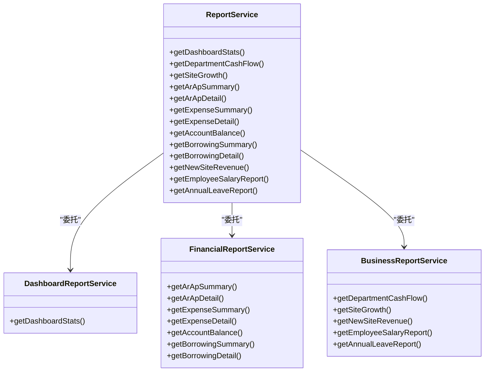

# 报表服务

<cite>
**本文档引用的文件**   
- [ReportService.ts](file://backend/src/services/ReportService.ts)
- [FinancialReportService.ts](file://backend/src/services/FinancialReportService.ts)
- [BusinessReportService.ts](file://backend/src/services/BusinessReportService.ts)
- [DashboardReportService.ts](file://backend/src/services/DashboardReportService.ts)
- [reports.ts](file://backend/src/routes/v2/reports.ts)
- [schema.ts](file://backend/src/db/schema.ts)
- [ReportAccountBalancePage.tsx](file://frontend/src/features/reports/pages/ReportAccountBalancePage.tsx)
- [ReportEmployeeSalaryPage.tsx](file://frontend/src/features/reports/pages/ReportEmployeeSalaryPage.tsx)
</cite>

## 目录
1. [引言](#引言)
2. [报表服务架构](#报表服务架构)
3. [核心报表类型与数据处理](#核心报表类型与数据处理)
4. [报表生成流程与数据聚合](#报表生成流程与数据聚合)
5. [业务场景与数据洞察](#业务场景与数据洞察)
6. [结论](#结论)

## 引言
报表服务（ReportService）是财务系统的核心门面组件，负责聚合多个子服务，为前端提供统一的报表访问接口。该服务采用门面模式，将复杂的报表生成逻辑封装起来，简化了客户端的调用。通过深入分析其架构和实现，我们可以理解系统如何将原始的财务、人事和业务数据转化为有价值的业务洞察，支持财务分析和管理决策。

## 报表服务架构

报表服务作为门面，协调了多个具体的报表服务类，包括`DashboardReportService`、`FinancialReportService`和`BusinessReportService`。这种设计模式实现了关注点分离，使得每个子服务可以专注于特定领域的报表生成，而门面服务则负责路由请求和整合结果。



**图表来源**
- [ReportService.ts](file://backend/src/services/ReportService.ts#L13-L84)
- [DashboardReportService.ts](file://backend/src/services/DashboardReportService.ts#L20-L196)
- [FinancialReportService.ts](file://backend/src/services/FinancialReportService.ts#L22-L373)
- [BusinessReportService.ts](file://backend/src/services/BusinessReportService.ts#L21-L548)

**章节来源**
- [ReportService.ts](file://backend/src/services/ReportService.ts#L1-L84)

## 核心报表类型与数据处理

报表服务支持多种核心报表类型，每种报表都针对特定的业务需求，其数据查询逻辑和聚合计算方法各不相同。

### 财务报表
财务报表主要由`FinancialReportService`处理，涵盖应收应付（AR/AP）、费用、账户余额和借款等关键财务数据。

#### 应收应付（AR/AP）报表
- **数据查询逻辑**：通过`arApDocs`表查询指定日期范围内的应收或应付单据，同时关联结算记录以计算已结算金额。
- **聚合计算方法**：计算总金额、已结算金额，并按单据状态（如“已开票”、“部分结算”、“已结算”）进行分组统计。
- **结果格式化**：返回包含汇总信息（总金额、已结算金额、按状态分布）和明细列表的结构化数据。

#### 账户余额报表
- **数据查询逻辑**：首先获取所有活跃账户，然后分别查询期初余额、期前净发生额和期间发生额。
- **聚合计算方法**：通过加总期初余额和期前净发生额得到期初余额，再根据期间的收入和支出计算期末余额。
- **结果格式化**：为每个账户提供详细的余额变动信息，包括期初、收入、支出和期末余额。

### 业务报表
业务报表由`BusinessReportService`处理，侧重于业务运营和人力资源数据。

#### 员工薪资报表
- **数据查询逻辑**：查询员工信息、薪资记录和请假记录，确保数据的完整性和准确性。
- **聚合计算方法**：根据员工的入职日期、薪资标准和请假天数，按月计算应发工资。计算逻辑考虑了试用期和转正后的不同薪资标准。
- **结果格式化**：返回包含员工姓名、部门、基础工资、工作天数、请假天数和应发工资等详细信息的列表。

#### 年假报表
- **数据查询逻辑**：结合员工信息和年假配置，计算每个员工在特定周期内的年假额度、已使用天数和剩余天数。
- **聚合计算方法**：调用`AnnualLeaveService`的统计方法，根据员工的入职日期和年假政策进行计算。
- **结果格式化**：提供员工的年假周期、应享天数、已用天数和剩余天数等关键信息。

### 仪表盘报表
仪表盘报表由`DashboardReportService`生成，为用户提供实时的业务概览。

- **数据查询逻辑**：综合查询当日和当月的流水、账户、应收应付和借款等数据。
- **聚合计算方法**：对各类数据进行汇总统计，如当日收入、支出、账户总数等。
- **结果格式化**：返回一个包含多个统计模块（今日统计、本月统计、账户统计、应收应付统计、借款统计和最近流水）的复合对象。

**章节来源**
- [FinancialReportService.ts](file://backend/src/services/FinancialReportService.ts#L28-L373)
- [BusinessReportService.ts](file://backend/src/services/BusinessReportService.ts#L28-L548)
- [DashboardReportService.ts](file://backend/src/services/DashboardReportService.ts#L26-L196)

## 报表生成流程与数据聚合

报表服务的生成流程遵循一个清晰的模式：接收请求、验证权限、路由到具体服务、执行数据查询与聚合、格式化结果并返回。

### 请求路由与权限验证
当客户端发起报表请求时，后端路由（如`/api/reports/account-balance`）会首先通过中间件验证用户权限。例如，`validateScope`函数会检查用户是否有权访问指定部门的数据。验证通过后，请求被路由到`ReportService`的相应方法。

### 数据查询与聚合
以账户余额报表为例，其数据聚合过程如下：
1.  **获取活跃账户**：从`accounts`表中查询所有状态为激活的账户。
2.  **计算期初余额**：将期初余额（`openingBalances`）与期前的流水（`cashFlows`）相加，得到每个账户在查询日期之前的总余额。
3.  **计算期间发生额**：查询指定日期当天的收入和支出流水。
4.  **计算期末余额**：将期初余额与当天的净发生额（收入减去支出）相加，得到最终的期末余额。

```mermaid
flowchart TD
A[开始] --> B[接收请求: asOf=2023-10-01]
B --> C[验证用户权限]
C --> D[调用ReportService.getAccountBalance()]
D --> E[调用FinancialReportService.getAccountBalance()]
E --> F[查询活跃账户]
F --> G[查询期初余额和期前流水]
G --> H[查询期间流水]
H --> I[计算期初余额 = 期初余额 + 期前净发生额]
I --> J[计算期末余额 = 期初余额 + 当日收入 - 当日支出]
J --> K[格式化结果]
K --> L[返回JSON数据]
L --> M[结束]
```

**图表来源**
- [FinancialReportService.ts](file://backend/src/services/FinancialReportService.ts#L165-L273)
- [reports.ts](file://backend/src/routes/v2/reports.ts#L479-L515)

**章节来源**
- [FinancialReportService.ts](file://backend/src/services/FinancialReportService.ts#L165-L273)

## 业务场景与数据洞察

报表服务在实际业务场景中发挥着至关重要的作用，能够将原始数据转化为支持决策的洞察。

### 财务分析场景
在月末财务结算时，财务人员可以使用**应收应付汇总报表**来快速了解本月的应收账款和应付账款总额。通过分析“按状态分布”的数据，他们可以识别出哪些账款是“已开票”但未结算的，从而优先跟进催收或安排付款，有效管理现金流。

### 管理决策场景
人力资源经理可以利用**员工薪资报表**进行人力成本分析。通过导出全年的薪资数据，他们可以计算各部门的平均工资、总人力成本，并与预算进行对比。此外，结合**年假报表**，经理可以了解员工的年假使用情况，评估团队的工作负荷和员工福利的使用效率，为未来的招聘和团队建设提供数据支持。

## 结论
报表服务通过门面模式，成功地将复杂的报表生成逻辑进行了封装和抽象。它不仅提供了统一的接口，还通过委托给专门的子服务，实现了高内聚、低耦合的架构设计。通过对财务、人事和业务数据的深度查询、聚合与格式化，该服务能够生成多样化的报表，为财务分析和管理决策提供了坚实的数据基础。其清晰的流程和可扩展的架构，确保了系统能够持续满足不断变化的业务需求。