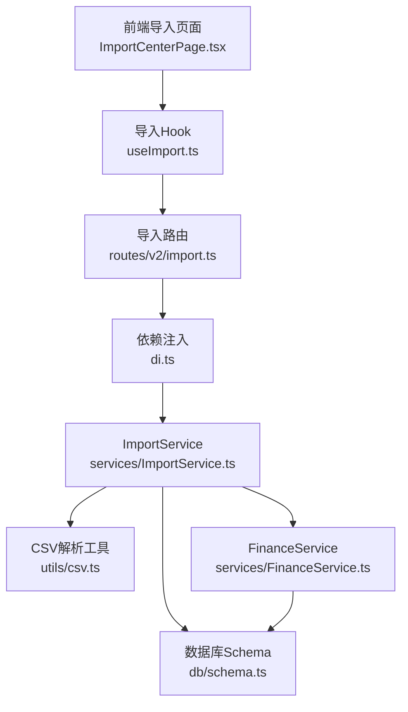
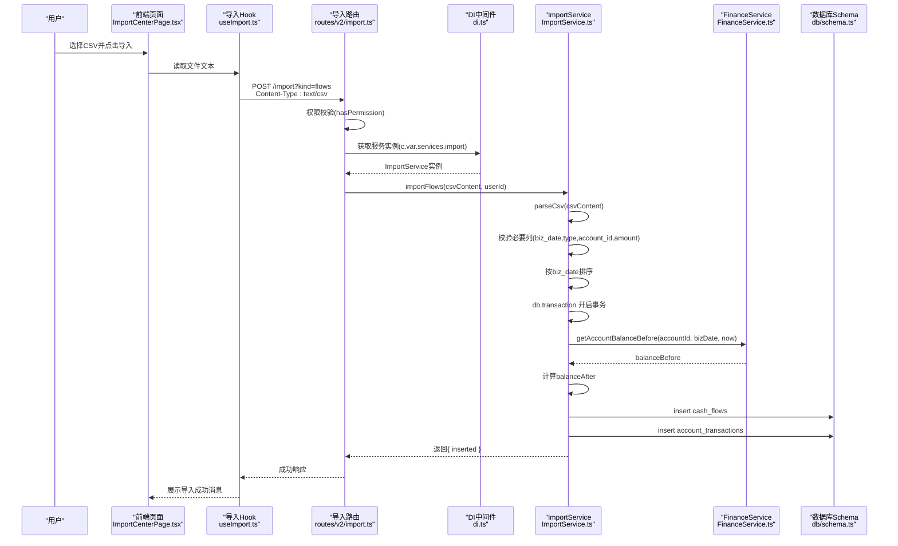
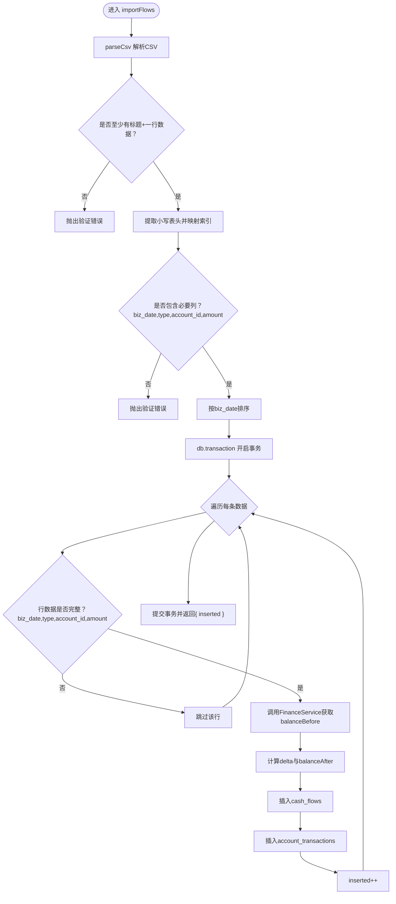
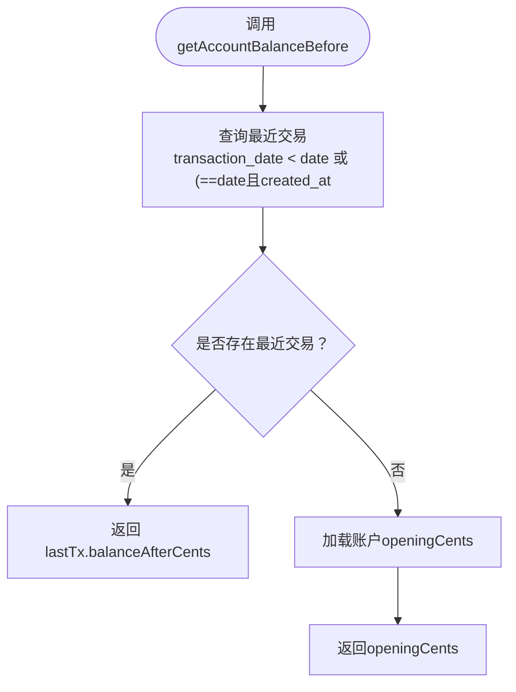
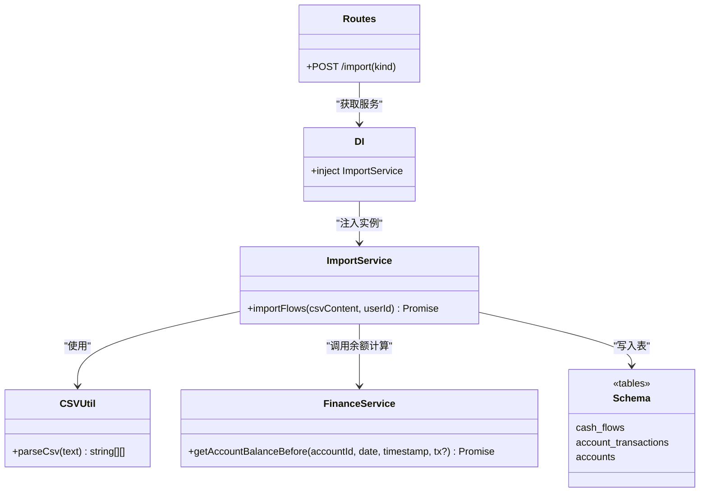

# 数据导入服务

<cite>
**本文引用的文件列表**
- [ImportService.ts](file://backend/src/services/ImportService.ts)
- [import.ts](file://backend/src/routes/v2/import.ts)
- [csv.ts](file://backend/src/utils/csv.ts)
- [FinanceService.ts](file://backend/src/services/FinanceService.ts)
- [schema.ts](file://backend/src/db/schema.ts)
- [common.schema.ts](file://backend/src/schemas/common.schema.ts)
- [di.ts](file://backend/src/middleware/di.ts)
- [errors.ts](file://backend/src/utils/errors.ts)
- [errorCodes.ts](file://backend/src/constants/errorCodes.ts)
- [ImportService.test.ts](file://backend/test/services/ImportService.test.ts)
- [ImportCenterPage.tsx](file://frontend/src/features/finance/pages/ImportCenterPage.tsx)
- [useImport.ts](file://frontend/src/hooks/business/useImport.ts)
- [import-flows-example.csv](file://frontend/public/examples/import-flows-example.csv)
</cite>

## 目录
1. [简介](#简介)
2. [项目结构与入口](#项目结构与入口)
3. [核心组件](#核心组件)
4. [架构总览](#架构总览)
5. [详细组件分析](#详细组件分析)
6. [依赖关系分析](#依赖关系分析)
7. [性能与可靠性考量](#性能与可靠性考量)
8. [故障排查指南](#故障排查指南)
9. [结论](#结论)
10. [附录：字段与示例](#附录字段与示例)

## 简介
本文件围绕 ImportService 的数据导入处理流程进行深入解析，覆盖从文件上传、CSV 解析、数据验证、转换为内部模型、到批量写入数据库的完整链路。重点说明其在保证数据完整性、处理导入错误与提供反馈结果方面的设计考量，并结合财务流水批量导入的实际场景，给出端到端的处理序列图与流程图。

## 项目结构与入口
- 后端路由层通过 OpenAPI 路由定义导入接口，校验请求参数与鉴权后调用 ImportService。
- ImportService 负责解析 CSV、校验必要字段、按日期排序、逐条插入“现金流水”和“账户交易历史”，并在单事务内完成。
- FinanceService 提供余额计算与并发控制能力，确保导入过程中的余额一致性。
- DI 中间件注入 ImportService 实例，供路由层调用。
- 前端提供导入页面与示例 CSV 下载，用户选择 CSV 后通过自定义 Hook 发起导入请求。

图表来源
- [import.ts](file://backend/src/routes/v2/import.ts#L1-L84)
- [di.ts](file://backend/src/middleware/di.ts#L41-L60)
- [ImportService.ts](file://backend/src/services/ImportService.ts#L1-L126)
- [csv.ts](file://backend/src/utils/csv.ts#L1-L15)
- [FinanceService.ts](file://backend/src/services/FinanceService.ts#L1-L200)
- [schema.ts](file://backend/src/db/schema.ts#L139-L206)
- [ImportCenterPage.tsx](file://frontend/src/features/finance/pages/ImportCenterPage.tsx#L1-L87)
- [useImport.ts](file://frontend/src/hooks/business/useImport.ts#L1-L15)

章节来源
- [import.ts](file://backend/src/routes/v2/import.ts#L1-L84)
- [di.ts](file://backend/src/middleware/di.ts#L41-L60)
- [ImportService.ts](file://backend/src/services/ImportService.ts#L1-L126)
- [csv.ts](file://backend/src/utils/csv.ts#L1-L15)
- [FinanceService.ts](file://backend/src/services/FinanceService.ts#L1-L200)
- [schema.ts](file://backend/src/db/schema.ts#L139-L206)
- [ImportCenterPage.tsx](file://frontend/src/features/finance/pages/ImportCenterPage.tsx#L1-L87)
- [useImport.ts](file://frontend/src/hooks/business/useImport.ts#L1-L15)

## 核心组件
- ImportService：负责 CSV 解析、字段校验、按日期排序、逐条插入 cash_flows 与 account_transactions，并在单事务中完成，确保原子性与一致性。
- FinanceService：提供账户余额计算（基于历史交易）、并发冲突检测（乐观锁版本号+更新尝试）、余额检查等能力，保障导入过程中的余额正确性。
- CSV 工具：提供基础 CSV 行解析，按逗号分隔并去除空白，满足 MVP 场景。
- 路由与权限：导入路由校验 kind 参数与用户权限，读取请求体文本并调用 ImportService。
- DI 注入：在中间件中创建 ImportService 实例并注入上下文，供路由使用。
- 错误体系：统一业务错误与系统错误，便于前端展示与监控。

章节来源
- [ImportService.ts](file://backend/src/services/ImportService.ts#L1-L126)
- [FinanceService.ts](file://backend/src/services/FinanceService.ts#L1-L200)
- [csv.ts](file://backend/src/utils/csv.ts#L1-L15)
- [import.ts](file://backend/src/routes/v2/import.ts#L1-L84)
- [di.ts](file://backend/src/middleware/di.ts#L41-L60)
- [errors.ts](file://backend/src/utils/errors.ts#L1-L228)
- [errorCodes.ts](file://backend/src/constants/errorCodes.ts#L1-L32)

## 架构总览
下图展示了从用户上传 CSV 到数据库落库的端到端链路，包括权限校验、CSV 解析、数据验证、余额计算与事务写入。

图表来源
- [ImportCenterPage.tsx](file://frontend/src/features/finance/pages/ImportCenterPage.tsx#L1-L87)
- [useImport.ts](file://frontend/src/hooks/business/useImport.ts#L1-L15)
- [import.ts](file://backend/src/routes/v2/import.ts#L1-L84)
- [di.ts](file://backend/src/middleware/di.ts#L41-L60)
- [ImportService.ts](file://backend/src/services/ImportService.ts#L1-L126)
- [FinanceService.ts](file://backend/src/services/FinanceService.ts#L1-L200)
- [schema.ts](file://backend/src/db/schema.ts#L139-L206)

## 详细组件分析

### ImportService：CSV 导入主流程
- CSV 解析：使用 parseCsv 将文本拆分为二维数组，过滤空行并按逗号分割。
- 字段校验：要求包含 biz_date、type、account_id、amount；缺失则抛出验证错误。
- 排序策略：按 biz_date 升序排序，确保余额计算顺序正确。
- 事务与逐条写入：开启单事务，逐条插入 cash_flows 与 account_transactions，保证原子性。
- 余额计算：调用 FinanceService.getAccountBalanceBefore 获取“之前余额”，根据 type 计算“之后余额”，并写入交易记录。
- 时间戳与顺序：使用 Date.now() + inserted 作为 createdAt，避免同一毫秒内插入顺序不确定。
- 返回值：返回插入数量，便于前端反馈。

图表来源
- [ImportService.ts](file://backend/src/services/ImportService.ts#L1-L126)
- [FinanceService.ts](file://backend/src/services/FinanceService.ts#L41-L68)

章节来源
- [ImportService.ts](file://backend/src/services/ImportService.ts#L1-L126)

### FinanceService：余额计算与并发控制
- 余额计算：通过 accountTransactions 查询“指定日期/时间之前”的最后一条交易，返回其 balanceAfterCents；若无历史，则回退到账户 openingCents。
- 并发控制：在创建流水时，先尝试更新 accounts.version（乐观锁），若更新失败则判定为并发冲突，抛出 BUS_CONCURRENT_MODIFICATION 错误。
- 余额检查：当类型为 expense 时，比较 balanceBefore 与 amountCents，不足则抛出 BUSINESS_INSUFFICIENT_BALANCE 错误。

图表来源
- [FinanceService.ts](file://backend/src/services/FinanceService.ts#L41-L68)

章节来源
- [FinanceService.ts](file://backend/src/services/FinanceService.ts#L1-L200)
- [errorCodes.ts](file://backend/src/constants/errorCodes.ts#L1-L32)
- [errors.ts](file://backend/src/utils/errors.ts#L1-L228)

### 路由与权限：导入接口
- OpenAPI 路由定义：POST /import，查询参数 kind 支持 flows、AR、AP、opening。
- 权限校验：调用 hasPermission 检查 finance.flow.create 权限，未授权抛出 403。
- 请求体：读取纯文本 CSV，按 kind 分派到对应导入逻辑。
- 错误处理：统一通过 errorHandlerV2 输出标准错误结构。

章节来源
- [import.ts](file://backend/src/routes/v2/import.ts#L1-L84)
- [common.schema.ts](file://backend/src/schemas/common.schema.ts#L93-L99)
- [errors.ts](file://backend/src/utils/errors.ts#L138-L227)

### DI 注入与服务绑定
- 在 DI 中间件中创建 ImportService 实例并注入 c.set('services', { import })，供路由层通过 c.var.services.import 使用。

章节来源
- [di.ts](file://backend/src/middleware/di.ts#L41-L60)

### 前端集成与示例
- 导入页面：提供 kind 选择、示例文件下载、文件上传与导入按钮。
- 示例 CSV：包含 flows 类型的字段模板，便于用户对照填写。
- 导入 Hook：以 text/csv 形式发送 CSV 文本至 /import?kind=flows。

章节来源
- [ImportCenterPage.tsx](file://frontend/src/features/finance/pages/ImportCenterPage.tsx#L1-L87)
- [useImport.ts](file://frontend/src/hooks/business/useImport.ts#L1-L15)
- [import-flows-example.csv](file://frontend/public/examples/import-flows-example.csv#L1-L5)

## 依赖关系分析
- ImportService 依赖：
  - CSV 工具：parseCsv
  - FinanceService：余额计算与并发控制
  - 数据库 Schema：cash_flows、account_transactions、accounts
  - 错误体系：Errors 工具
- 路由依赖：
  - 权限校验：hasPermission
  - OpenAPI 路由与参数校验：csvImportQuerySchema
- DI 依赖：
  - 通过中间件注入 ImportService 实例

图表来源
- [ImportService.ts](file://backend/src/services/ImportService.ts#L1-L126)
- [FinanceService.ts](file://backend/src/services/FinanceService.ts#L1-L200)
- [csv.ts](file://backend/src/utils/csv.ts#L1-L15)
- [schema.ts](file://backend/src/db/schema.ts#L139-L206)
- [import.ts](file://backend/src/routes/v2/import.ts#L1-L84)
- [di.ts](file://backend/src/middleware/di.ts#L41-L60)

章节来源
- [ImportService.ts](file://backend/src/services/ImportService.ts#L1-L126)
- [FinanceService.ts](file://backend/src/services/FinanceService.ts#L1-L200)
- [csv.ts](file://backend/src/utils/csv.ts#L1-L15)
- [schema.ts](file://backend/src/db/schema.ts#L139-L206)
- [import.ts](file://backend/src/routes/v2/import.ts#L1-L84)
- [di.ts](file://backend/src/middleware/di.ts#L41-L60)

## 性能与可靠性考量
- 事务与原子性：整批数据在一个事务中处理，保证要么全部成功，要么全部回滚，避免中间态。
- 逐条写入与顺序：逐条插入并使用递增时间戳，确保同毫秒内顺序稳定，有利于余额计算一致性。
- 余额计算复杂度：getAccountBalanceBefore 通过索引与排序查找最近交易，时间复杂度近似 O(log N)（受索引影响）。
- 并发控制：通过乐观锁版本号更新，避免多并发写入导致的余额不一致。
- 错误粒度：单条数据异常不会中断整批导入，但当前实现会逐条处理，建议在大规模导入时考虑分块与批量写入优化（当前注释表明逐条更安全）。
- CSV 解析：当前解析器不支持复杂引号转义，适合 MVP 场景；如需支持复杂 CSV，应引入专用 CSV 解析库。

章节来源
- [ImportService.ts](file://backend/src/services/ImportService.ts#L1-L126)
- [FinanceService.ts](file://backend/src/services/FinanceService.ts#L146-L170)
- [schema.ts](file://backend/src/db/schema.ts#L189-L206)

## 故障排查指南
- 常见错误类型与含义：
  - 缺少必要列：biz_date、type、account_id、amount 任一缺失将触发验证错误。
  - 权限不足：未授予 finance.flow.create 权限将返回 403。
  - 并发冲突：账户版本号更新失败，提示“账户状态已变更（并发冲突）”，请重试。
  - 余额不足：支出类型且余额小于所需金额，提示“账户余额不足”。
- 建议排查步骤：
  - 确认 CSV 文件是否包含必要列，且首行为表头。
  - 检查日期格式与金额格式是否符合预期。
  - 若出现并发冲突，稍后重试或减少并发导入。
  - 查看返回的错误码与详情，定位具体问题字段。
- 单元测试参考：
  - 测试覆盖了 CSV 正常导入、余额计算、错误场景（无效 CSV）等关键路径。

章节来源
- [errors.ts](file://backend/src/utils/errors.ts#L1-L228)
- [errorCodes.ts](file://backend/src/constants/errorCodes.ts#L1-L32)
- [ImportService.test.ts](file://backend/test/services/ImportService.test.ts#L1-L74)

## 结论
ImportService 通过“逐条处理 + 事务 + 余额计算 + 并发控制”的组合，在保证数据完整性与一致性的同时，提供了清晰的错误反馈与可观测性。对于财务流水批量导入，该实现能够可靠地完成从 CSV 到数据库的全链路处理。未来可在保持一致性的前提下，评估引入批量写入与更健壮的 CSV 解析器，以进一步提升吞吐量与易用性。

## 附录：字段与示例
- flows 类型 CSV 字段说明（必填/可选）：
  - 必填：biz_date（日期）、type（income/expense）、account_id（账户ID）、amount（金额）
  - 可选：site_id、department_id、counterparty、memo、category_id、voucher_no、method
- 示例文件：前端提供示例 CSV 下载，便于用户对照填写。

章节来源
- [ImportCenterPage.tsx](file://frontend/src/features/finance/pages/ImportCenterPage.tsx#L49-L57)
- [import-flows-example.csv](file://frontend/public/examples/import-flows-example.csv#L1-L5)