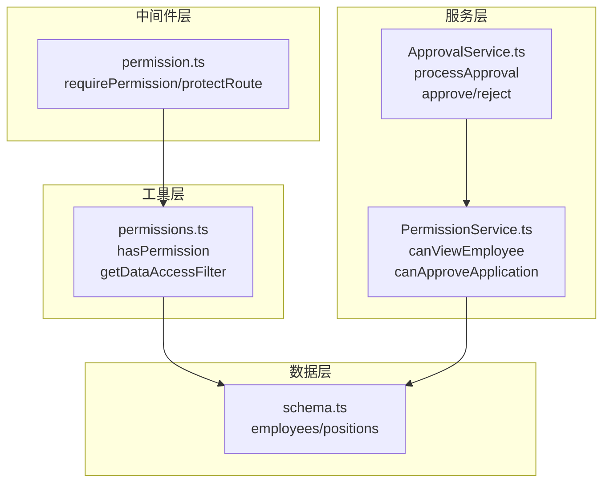
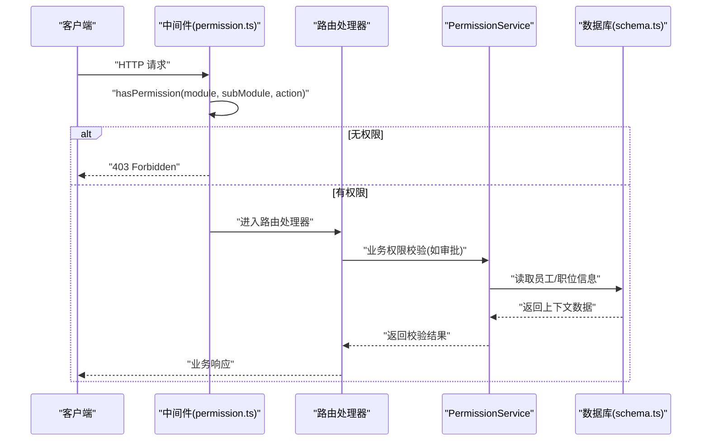
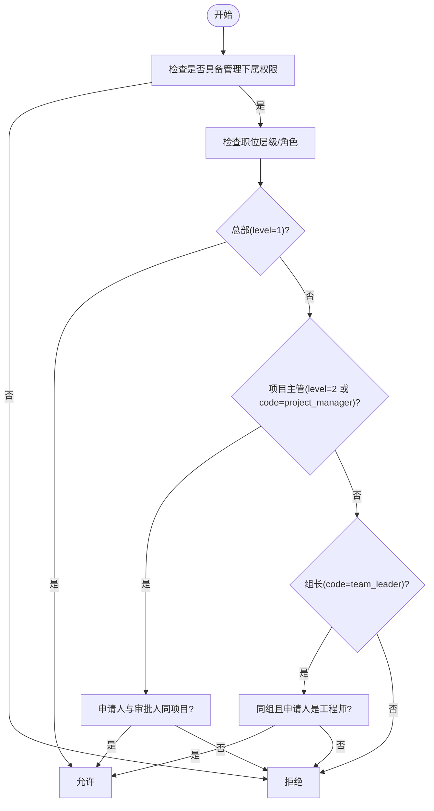
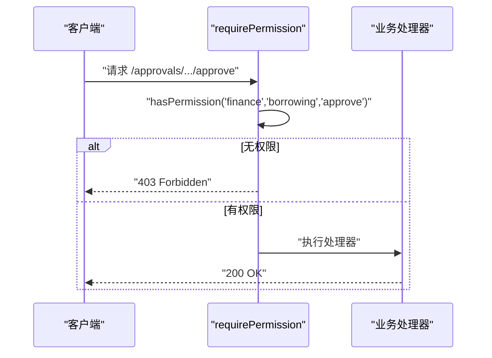
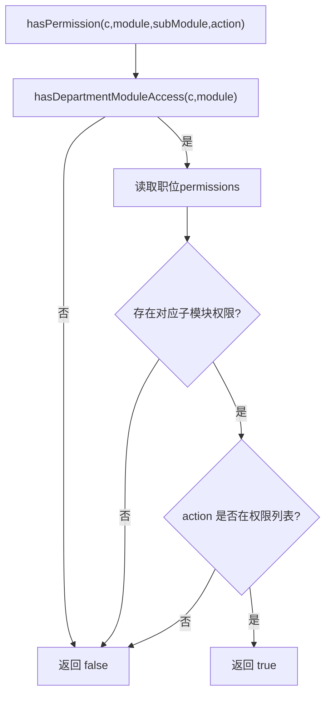
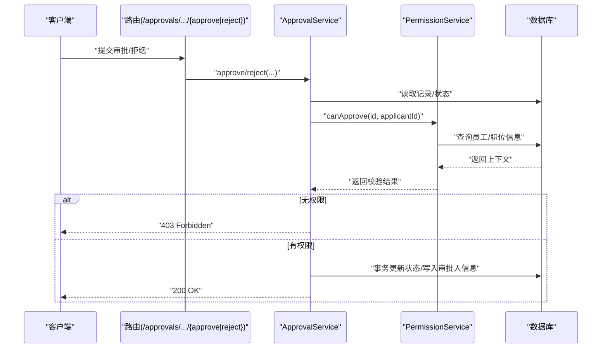
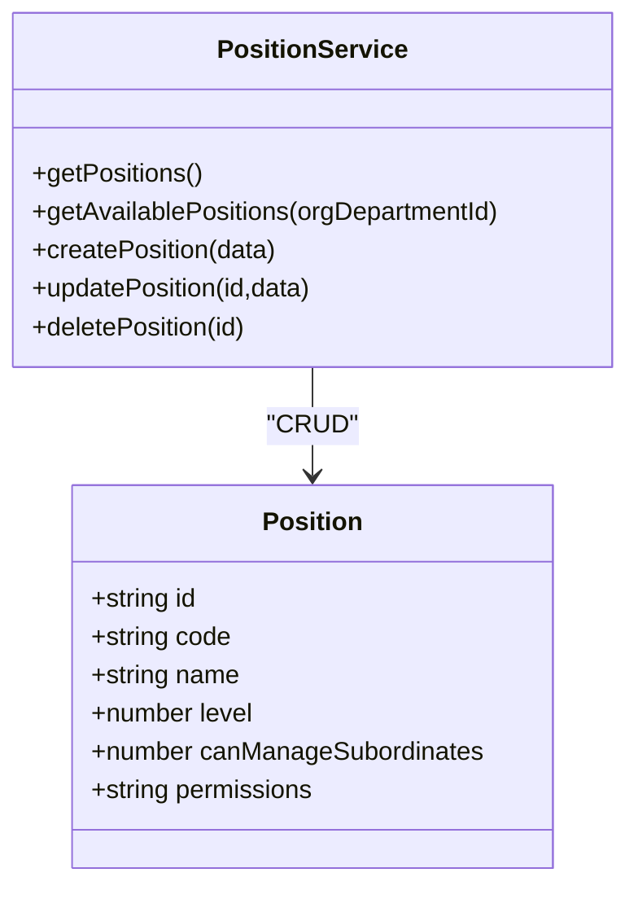
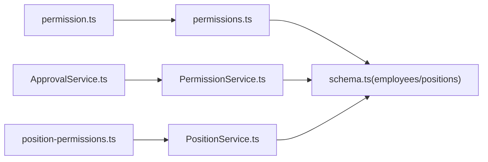

# 权限服务

<cite>
**本文引用的文件**
- [PermissionService.ts](file://backend/src/services/PermissionService.ts)
- [permission.ts](file://backend/src/middleware/permission.ts)
- [permissions.ts](file://backend/src/utils/permissions.ts)
- [ApprovalService.ts](file://backend/src/services/ApprovalService.ts)
- [position-permissions.ts](file://backend/src/routes/v2/position-permissions.ts)
- [PositionService.ts](file://backend/src/services/PositionService.ts)
- [schema.ts](file://backend/src/db/schema.ts)
- [errors.ts](file://backend/src/utils/errors.ts)
- [RBAC.test.ts](file://backend/test/services/RBAC.test.ts)
- [approvals.test.ts](file://backend/test/routes/approvals.test.ts)
</cite>

## 目录
1. [简介](#简介)
2. [项目结构](#项目结构)
3. [核心组件](#核心组件)
4. [架构总览](#架构总览)
5. [详细组件分析](#详细组件分析)
6. [依赖关系分析](#依赖关系分析)
7. [性能考量](#性能考量)
8. [故障排查指南](#故障排查指南)
9. [结论](#结论)
10. [附录](#附录)

## 简介
本文件深入解析 PermissionService 的权限控制机制，说明其如何基于用户职位、部门等上下文信息执行细粒度的权限判断，并支持系统功能的动态启用与禁用。文档覆盖中间件层（permission.ts）对请求进行预授权拦截，以及在业务逻辑层（如 ApprovalService）进行操作级权限验证的双重应用模式。通过审批流程与敏感数据访问场景，展示权限校验的执行流程与失败处理机制。

## 项目结构
权限体系由三层协同构成：
- 中间件层：在路由入口处统一校验模块/子模块/动作权限，快速拒绝无权访问。
- 工具层：提供 hasPermission、getDataAccessFilter 等能力，支撑模块级与数据级权限。
- 服务层：PermissionService 提供业务级权限判断（如“能否查看某员工”、“能否审批某申请”），ApprovalService 在关键业务操作前再次校验。

图表来源
- [permission.ts](file://backend/src/middleware/permission.ts#L1-L43)
- [permissions.ts](file://backend/src/utils/permissions.ts#L1-L273)
- [PermissionService.ts](file://backend/src/services/PermissionService.ts#L1-L147)
- [ApprovalService.ts](file://backend/src/services/ApprovalService.ts#L1-L645)
- [schema.ts](file://backend/src/db/schema.ts#L1-L120)

章节来源
- [permission.ts](file://backend/src/middleware/permission.ts#L1-L43)
- [permissions.ts](file://backend/src/utils/permissions.ts#L1-L273)
- [PermissionService.ts](file://backend/src/services/PermissionService.ts#L1-L147)
- [ApprovalService.ts](file://backend/src/services/ApprovalService.ts#L1-L645)
- [schema.ts](file://backend/src/db/schema.ts#L1-L120)

## 核心组件
- PermissionService：面向业务的权限判断，包括“查看员工数据”和“审批申请”的规则实现。
- permission 中间件：在路由层以模块/子模块/动作为维度进行快速权限拦截。
- permissions 工具：提供 hasPermission、hasDepartmentModuleAccess、getDataAccessFilter 等基础能力。
- ApprovalService：在审批流程中调用 PermissionService 进行二次校验，确保操作级权限。
- PositionService/position-permissions 路由：维护职位与权限配置，支持系统功能的动态启用/禁用。

章节来源
- [PermissionService.ts](file://backend/src/services/PermissionService.ts#L1-L147)
- [permission.ts](file://backend/src/middleware/permission.ts#L1-L43)
- [permissions.ts](file://backend/src/utils/permissions.ts#L1-L273)
- [ApprovalService.ts](file://backend/src/services/ApprovalService.ts#L1-L645)
- [PositionService.ts](file://backend/src/services/PositionService.ts#L1-L224)
- [position-permissions.ts](file://backend/src/routes/v2/position-permissions.ts#L1-L251)

## 架构总览
下图展示了权限控制在系统中的位置与交互路径。

图表来源
- [permission.ts](file://backend/src/middleware/permission.ts#L1-L43)
- [permissions.ts](file://backend/src/utils/permissions.ts#L99-L125)
- [PermissionService.ts](file://backend/src/services/PermissionService.ts#L1-L147)
- [schema.ts](file://backend/src/db/schema.ts#L14-L63)

## 详细组件分析

### PermissionService：业务级权限判断
- 查看员工数据（canViewEmployee）
  - 总部人员（level=1）可查看所有人。
  - 工程师（team_engineer）仅能查看本人。
  - 项目主管（level=2）可查看本项目所有人。
  - 组长（team_leader）可查看本组工程师。
  - 其他情况返回 false。
- 审批申请（canApproveApplication/canApprove）
  - 必须具备“可管理下属”权限（canManageSubordinates=1）。
  - 总部主管（hq_manager）可审批所有人。
  - 项目主管（project_manager）可审批本项目所有人。
  - 组长仅能审批本组工程师，且申请人必须为工程师。
  - 支持通过 actorId/applicantId 快捷查询并复用审批规则。

图表来源
- [PermissionService.ts](file://backend/src/services/PermissionService.ts#L1-L147)

章节来源
- [PermissionService.ts](file://backend/src/services/PermissionService.ts#L1-L147)

### 中间件层：模块级权限拦截
- requirePermission(module, subModule, action)：在路由前调用 hasPermission，无权限直接抛出 403。
- protectRoute(handler)：包装 OpenAPI 路由，先校验权限再执行业务处理。

图表来源
- [permission.ts](file://backend/src/middleware/permission.ts#L1-L43)
- [position-permissions.ts](file://backend/src/routes/v2/position-permissions.ts#L131-L150)
- [position-permissions.ts](file://backend/src/routes/v2/position-permissions.ts#L185-L211)
- [position-permissions.ts](file://backend/src/routes/v2/position-permissions.ts#L239-L251)

章节来源
- [permission.ts](file://backend/src/middleware/permission.ts#L1-L43)
- [position-permissions.ts](file://backend/src/routes/v2/position-permissions.ts#L1-L251)

### 工具层：模块/数据访问权限
- hasPermission：先检查部门模块允许范围，再检查职位权限配置。
- hasDepartmentModuleAccess：总部人员豁免部门模块限制；支持通配符匹配（如 hr.*）。
- getDataAccessFilter：根据用户层级生成 SQL 过滤条件，支持按项目/组/个人维度过滤。

图表来源
- [permissions.ts](file://backend/src/utils/permissions.ts#L63-L125)

章节来源
- [permissions.ts](file://backend/src/utils/permissions.ts#L1-L273)

### 业务层：审批流程中的权限校验
- ApprovalService 在 processApproval 中调用 PermissionService.canApprove，确保审批人具备对申请人数据的审批权限。
- 对不同实体（请假/报销/借款）采用统一的状态机与事务处理，审批通过后可能触发额外业务（如创建现金流）。
- 若审批失败，统一抛出 403 并记录操作历史与审计日志。

图表来源
- [ApprovalService.ts](file://backend/src/services/ApprovalService.ts#L152-L229)
- [PermissionService.ts](file://backend/src/services/PermissionService.ts#L110-L146)
- [approvals.test.ts](file://backend/test/routes/approvals.test.ts#L84-L171)

章节来源
- [ApprovalService.ts](file://backend/src/services/ApprovalService.ts#L1-L645)
- [PermissionService.ts](file://backend/src/services/PermissionService.ts#L1-L147)
- [approvals.test.ts](file://backend/test/routes/approvals.test.ts#L84-L171)

### 职位与权限配置：系统功能动态启停
- PositionService 提供职位的增删改查与可用职位查询，支持按部门限定 allowedPositions。
- position-permissions 路由通过 hasPermission 对系统模块 position 的 create/update/delete/view 进行保护。
- 前端页面支持编辑职位权限配置（permissions 字段），后端以 JSON 存储并在工具层解析。

图表来源
- [PositionService.ts](file://backend/src/services/PositionService.ts#L1-L224)
- [position-permissions.ts](file://backend/src/routes/v2/position-permissions.ts#L1-L251)
- [schema.ts](file://backend/src/db/schema.ts#L50-L63)

章节来源
- [PositionService.ts](file://backend/src/services/PositionService.ts#L1-L224)
- [position-permissions.ts](file://backend/src/routes/v2/position-permissions.ts#L1-L251)
- [schema.ts](file://backend/src/db/schema.ts#L50-L63)

## 依赖关系分析
- 中间件依赖工具层 hasPermission，后者依赖职位与部门上下文。
- 服务层 PermissionService 依赖数据库 schema 中的 employees/positions 表。
- ApprovalService 依赖 PermissionService 与业务表（employeeLeaves、expenseReimbursements、borrowings）。
- 职位与权限配置由 PositionService/position-permissions 路由维护，最终影响工具层权限判定。

图表来源
- [permission.ts](file://backend/src/middleware/permission.ts#L1-L43)
- [permissions.ts](file://backend/src/utils/permissions.ts#L1-L273)
- [PermissionService.ts](file://backend/src/services/PermissionService.ts#L1-L147)
- [ApprovalService.ts](file://backend/src/services/ApprovalService.ts#L1-L645)
- [PositionService.ts](file://backend/src/services/PositionService.ts#L1-L224)
- [position-permissions.ts](file://backend/src/routes/v2/position-permissions.ts#L1-L251)
- [schema.ts](file://backend/src/db/schema.ts#L14-L63)

章节来源
- [permission.ts](file://backend/src/middleware/permission.ts#L1-L43)
- [permissions.ts](file://backend/src/utils/permissions.ts#L1-L273)
- [PermissionService.ts](file://backend/src/services/PermissionService.ts#L1-L147)
- [ApprovalService.ts](file://backend/src/services/ApprovalService.ts#L1-L645)
- [PositionService.ts](file://backend/src/services/PositionService.ts#L1-L224)
- [position-permissions.ts](file://backend/src/routes/v2/position-permissions.ts#L1-L251)
- [schema.ts](file://backend/src/db/schema.ts#L14-L63)

## 性能考量
- 中间件层 hasPermission 为 O(1) 判断，避免昂贵的数据库查询。
- PermissionService 的 canApproveApplication/canViewEmployee 会进行少量 DB 查询（员工/职位信息），建议在上层缓存常用上下文。
- ApprovalService 的批量审批通过循环逐条处理，若需更高吞吐，可考虑合并事务或引入队列异步处理。

## 故障排查指南
- 403 Forbidden
  - 中间件 requirePermission/protectRoute 抛出：确认模块/子模块/动作权限是否配置正确。
  - 业务层 ApprovalService 抛出：确认审批人与申请人之间的层级/组关系是否满足规则。
- 401 Unauthorized
  - 路由中未获取 userId：检查登录态与中间件注入。
- 无权限场景定位
  - 使用 RBAC 测试用例思路：构造 mock 上下文（userPosition、userEmployee、departmentModules），逐步缩小问题范围。
- 错误处理
  - 统一通过错误工具类抛出，便于前端识别与展示。

章节来源
- [permission.ts](file://backend/src/middleware/permission.ts#L1-L43)
- [errors.ts](file://backend/src/utils/errors.ts#L1-L130)
- [RBAC.test.ts](file://backend/test/services/RBAC.test.ts#L1-L241)
- [approvals.test.ts](file://backend/test/routes/approvals.test.ts#L84-L171)

## 结论
PermissionService 通过“模块级 + 业务级”的双层权限控制，结合中间件快速拦截与服务层细粒度校验，实现了对审批流程与敏感数据访问的可靠保护。配合职位权限配置与部门模块白名单，系统能够灵活地启用/禁用功能模块，满足多层级组织的精细化权限治理需求。

## 附录
- 关键路径参考
  - 中间件拦截：[permission.ts](file://backend/src/middleware/permission.ts#L1-L43)
  - 模块权限判定：[permissions.ts](file://backend/src/utils/permissions.ts#L99-L125)
  - 业务权限判定：[PermissionService.ts](file://backend/src/services/PermissionService.ts#L1-L147)
  - 审批流程校验：[ApprovalService.ts](file://backend/src/services/ApprovalService.ts#L152-L229)
  - 职位权限配置：[PositionService.ts](file://backend/src/services/PositionService.ts#L1-L224)、[position-permissions.ts](file://backend/src/routes/v2/position-permissions.ts#L1-L251)
  - 数据模型：[schema.ts](file://backend/src/db/schema.ts#L14-L63)