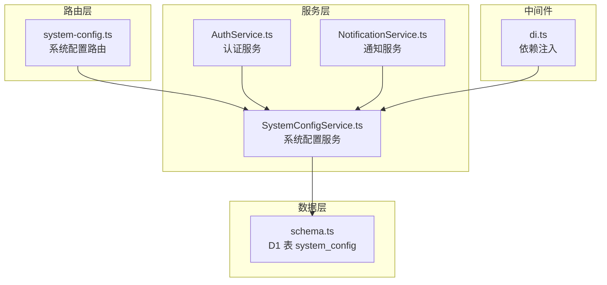
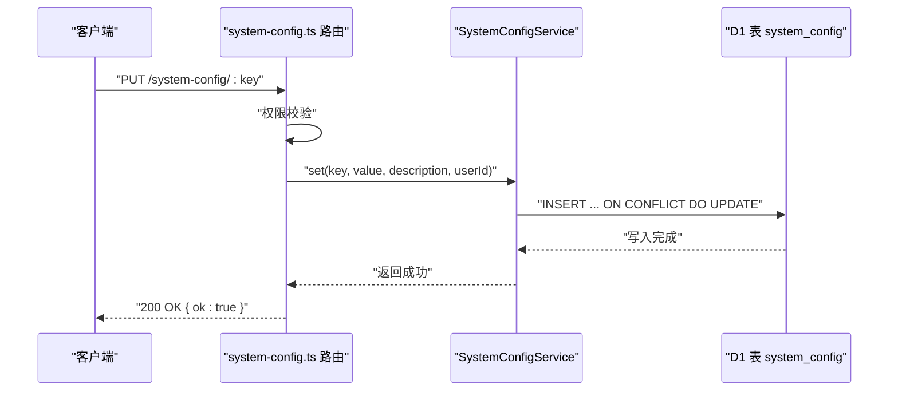
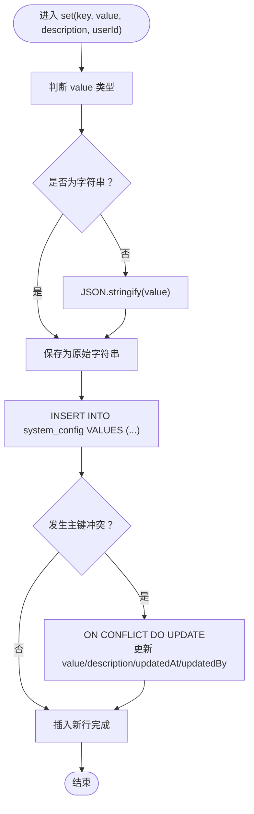
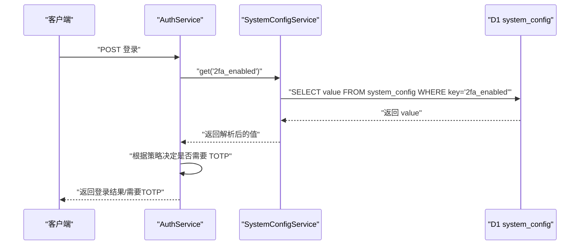
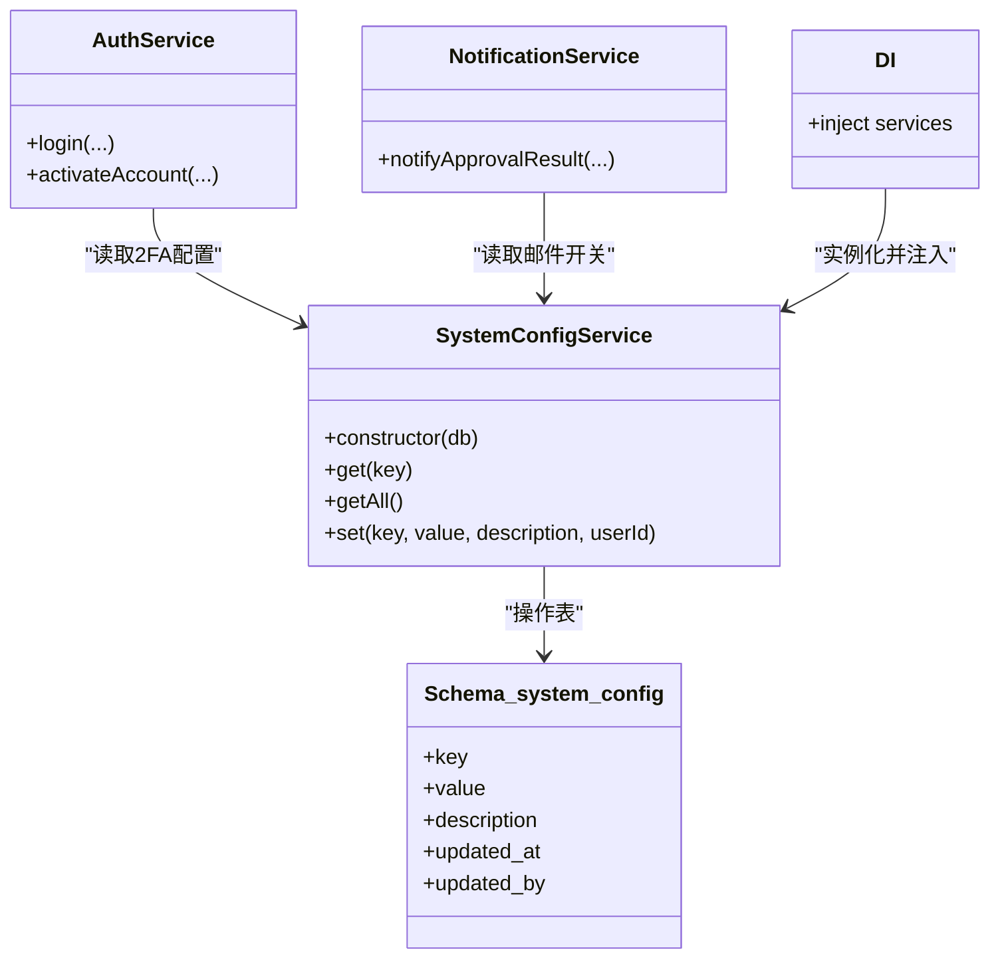

# 系统配置服务

<cite>
**本文引用的文件**
- [SystemConfigService.ts](file://backend/src/services/SystemConfigService.ts)
- [schema.ts](file://backend/src/db/schema.ts)
- [system-config.ts](file://backend/src/routes/v2/system-config.ts)
- [di.ts](file://backend/src/middleware/di.ts)
- [AuthService.ts](file://backend/src/services/AuthService.ts)
- [NotificationService.ts](file://backend/src/services/NotificationService.ts)
- [SystemConfigService.test.ts](file://backend/test/services/SystemConfigService.test.ts)
- [system-config.test.ts](file://backend/test/system-config.test.ts)
</cite>

## 目录
1. [简介](#简介)
2. [项目结构](#项目结构)
3. [核心组件](#核心组件)
4. [架构总览](#架构总览)
5. [详细组件分析](#详细组件分析)
6. [依赖关系分析](#依赖关系分析)
7. [性能考量](#性能考量)
8. [故障排查指南](#故障排查指南)
9. [结论](#结论)
10. [附录](#附录)

## 简介
本文件系统性解析 SystemConfigService 的设计与实现，重点说明：
- 基于 D1 的键值对系统参数存储与管理
- get、getAll、set 方法对 JSON 格式配置值的序列化与反序列化策略
- onConflictDoUpdate 在配置更新时的幂等性保证
- 作为系统行为开关（如 2FA 启用状态）与动态配置中心的关键作用
- 在 AuthService 中控制双因素认证策略、在 NotificationService 中管理邮件通知设置的集成方式
- 通过系统初始化或安全策略调整的场景，展示配置读取与变更的完整流程

## 项目结构
SystemConfigService 位于后端服务层，配合路由层、中间件依赖注入层以及业务服务层共同工作：
- 路由层：提供系统配置的 API 接口，负责鉴权与权限校验
- 服务层：SystemConfigService 提供配置的增删改查；AuthService 与 NotificationService 使用其进行策略控制
- 数据层：D1 表 system_config 存储键值对配置
- 中间件：DI 注入 SystemConfigService 到全局上下文，便于各服务调用

图表来源
- [system-config.ts](file://backend/src/routes/v2/system-config.ts#L1-L243)
- [SystemConfigService.ts](file://backend/src/services/SystemConfigService.ts#L1-L61)
- [schema.ts](file://backend/src/db/schema.ts#L1-L10)
- [di.ts](file://backend/src/middleware/di.ts#L41-L155)
- [AuthService.ts](file://backend/src/services/AuthService.ts#L1-L148)
- [NotificationService.ts](file://backend/src/services/NotificationService.ts#L1-L130)

章节来源
- [system-config.ts](file://backend/src/routes/v2/system-config.ts#L1-L243)
- [SystemConfigService.ts](file://backend/src/services/SystemConfigService.ts#L1-L61)
- [schema.ts](file://backend/src/db/schema.ts#L1-L10)
- [di.ts](file://backend/src/middleware/di.ts#L41-L155)

## 核心组件
- SystemConfigService：封装对 system_config 表的访问，提供 get、getAll、set 三个核心方法，并在 set 中通过 onConflictDoUpdate 实现幂等更新
- 路由层 system-config.ts：定义系统配置 API，包括按键查询、批量查询、更新等接口，并进行权限校验
- AuthService：在登录与激活流程中读取 2FA 开关配置，决定是否强制绑定与验证 TOTP
- NotificationService：在发送审批结果通知前读取邮件通知开关，决定是否发送邮件
- DI 中间件：在应用启动时创建 SystemConfigService 并注入到上下文，供路由与业务服务调用

章节来源
- [SystemConfigService.ts](file://backend/src/services/SystemConfigService.ts#L1-L61)
- [system-config.ts](file://backend/src/routes/v2/system-config.ts#L1-L243)
- [AuthService.ts](file://backend/src/services/AuthService.ts#L70-L114)
- [NotificationService.ts](file://backend/src/services/NotificationService.ts#L1-L75)
- [di.ts](file://backend/src/middleware/di.ts#L41-L155)

## 架构总览
SystemConfigService 以 D1 为持久化存储，采用“键-值-描述-更新时间-更新者”的结构，值字段统一以字符串存储，通过服务层在读取时尝试 JSON 解析，写入时根据值类型自动序列化。路由层负责鉴权与参数校验，业务服务通过依赖注入获取 SystemConfigService 实例，实现配置驱动的行为控制。

图表来源
- [system-config.ts](file://backend/src/routes/v2/system-config.ts#L113-L181)
- [SystemConfigService.ts](file://backend/src/services/SystemConfigService.ts#L37-L60)
- [schema.ts](file://backend/src/db/schema.ts#L1-L10)

## 详细组件分析

### SystemConfigService 设计与实现
- 数据模型
  - 表 system_config：key（主键）、value（文本）、description（可空）、updated_at（整数时间戳）、updated_by（字符串）
- get(key)
  - 读取单条记录，若存在则尝试对 value 字段执行 JSON.parse，解析失败则回退为原始字符串
  - 若不存在返回 null
- getAll()
  - 读取全部记录，逐条尝试 JSON.parse，解析失败保持原样
- set(key, value, description, userId)
  - 写入策略：若 value 是字符串则直接保存；否则 JSON.stringify 序列化
  - 使用 INSERT ... ON CONFLICT DO UPDATE，以 key 为主键冲突目标，原子性地更新 value、description、updatedAt、updatedBy
  - 幂等性：重复设置同一 key 时，不会产生新行，而是更新现有行，避免重复键与数据膨胀

图表来源
- [SystemConfigService.ts](file://backend/src/services/SystemConfigService.ts#L37-L60)
- [schema.ts](file://backend/src/db/schema.ts#L1-L10)

章节来源
- [SystemConfigService.ts](file://backend/src/services/SystemConfigService.ts#L1-L61)
- [schema.ts](file://backend/src/db/schema.ts#L1-L10)

### 路由层集成与权限控制
- 系统配置 API
  - GET /system-config：返回所有配置，值为解析后的对象或原始字符串
  - GET /system-config/:key：按键返回配置详情
  - PUT /system-config/:key：更新指定键的配置，记录审计日志
- 权限校验
  - 查看：需要 system.config.view 权限
  - 更新：需要 system.config.update 权限
- 值解析
  - 路由层在返回前对配置值不做二次解析，直接透传服务层解析结果

章节来源
- [system-config.ts](file://backend/src/routes/v2/system-config.ts#L1-L243)

### 依赖注入与全局可用性
- DI 中间件在应用启动时创建 SystemConfigService 实例，并注入到 c.set('services')，后续路由与业务服务可通过 c.var.services.systemConfig 获取
- 这种设计使得 SystemConfigService 成为跨服务共享的“动态配置中心”，无需在每个服务中重复构造

章节来源
- [di.ts](file://backend/src/middleware/di.ts#L41-L155)

### 在 AuthService 中的应用：2FA 策略控制
- 登录流程
  - 读取配置键 2fa_enabled
  - 若配置为 true 或 'true'，则强制要求用户已绑定 TOTP；新设备登录需验证 TOTP 并加入信任设备
  - 默认策略：若未设置该配置，默认视为启用
- 激活流程
  - 读取相同配置键，若启用则要求提供 TOTP 密钥与验证码，验证通过后绑定 TOTP 并自动登录

图表来源
- [AuthService.ts](file://backend/src/services/AuthService.ts#L70-L114)
- [SystemConfigService.ts](file://backend/src/services/SystemConfigService.ts#L9-L21)
- [schema.ts](file://backend/src/db/schema.ts#L1-L10)

章节来源
- [AuthService.ts](file://backend/src/services/AuthService.ts#L70-L114)

### 在 NotificationService 中的应用：邮件通知开关
- 发送审批结果通知前，读取配置键 email_notification_enabled
- 若值为 true 或 'true'，则继续发送邮件；否则直接返回，不发送通知
- 该策略避免了在未启用邮件通知时的无效调用与错误日志

章节来源
- [NotificationService.ts](file://backend/src/services/NotificationService.ts#L1-L75)

### 测试验证与边界行为
- 单元测试覆盖
  - set/get 基本流程、更新现有配置、返回 null 的非存在键、getAll 返回解析后的值、原始字符串值的容错解析
- 集成测试
  - 初始化 system_config 表并预置 email_notification_enabled=true，验证路由层读取与布尔判断逻辑

章节来源
- [SystemConfigService.test.ts](file://backend/test/services/SystemConfigService.test.ts#L1-L95)
- [system-config.test.ts](file://backend/test/system-config.test.ts#L1-L73)

## 依赖关系分析
- SystemConfigService 依赖 D1 表 system_config 的 schema 定义
- 路由层依赖 SystemConfigService 进行配置读写
- 业务服务（AuthService、NotificationService）依赖 SystemConfigService 进行策略控制
- DI 中间件负责实例化与注入，确保服务在运行时可用

图表来源
- [SystemConfigService.ts](file://backend/src/services/SystemConfigService.ts#L1-L61)
- [AuthService.ts](file://backend/src/services/AuthService.ts#L70-L114)
- [NotificationService.ts](file://backend/src/services/NotificationService.ts#L1-L75)
- [schema.ts](file://backend/src/db/schema.ts#L1-L10)
- [di.ts](file://backend/src/middleware/di.ts#L41-L155)

章节来源
- [SystemConfigService.ts](file://backend/src/services/SystemConfigService.ts#L1-L61)
- [schema.ts](file://backend/src/db/schema.ts#L1-L10)
- [di.ts](file://backend/src/middleware/di.ts#L41-L155)

## 性能考量
- 查询路径
  - get：单键查询，命中主键索引，复杂度 O(1)
  - getAll：全表扫描，复杂度 O(n)，建议在配置量较小的前提下使用
- 写入路径
  - set：INSERT ... ON CONFLICT DO UPDATE，原子性更新，避免重复键导致的数据膨胀
- JSON 解析
  - 读取时尝试解析，失败回退为字符串，减少异常开销与兼容性问题
- 缓存与外部依赖
  - 本服务未引入额外缓存层，适合小规模配置管理；若配置量增长，可考虑在上层增加只读缓存或分页查询

[本节为通用性能讨论，不涉及具体文件分析]

## 故障排查指南
- 配置读取为 null
  - 可能原因：键不存在；检查路由层参数与权限
  - 参考路径：[system-config.ts](file://backend/src/routes/v2/system-config.ts#L223-L242)
- 配置值解析异常
  - 可能原因：历史遗留的非 JSON 字符串；服务层已做 try/catch 回退
  - 参考路径：[SystemConfigService.ts](file://backend/src/services/SystemConfigService.ts#L9-L21)
- 更新未生效或重复键
  - 可能原因：未正确使用 ON CONFLICT DO UPDATE；确认 set 调用与主键冲突处理
  - 参考路径：[SystemConfigService.ts](file://backend/src/services/SystemConfigService.ts#L37-L60)
- 2FA 策略不符合预期
  - 可能原因：未设置 2fa_enabled 或值为 'false'；检查路由层默认策略与 AuthService 读取逻辑
  - 参考路径：[AuthService.ts](file://backend/src/services/AuthService.ts#L70-L114)
- 邮件通知未发送
  - 可能原因：未启用 email_notification_enabled；检查 NotificationService 读取逻辑
  - 参考路径：[NotificationService.ts](file://backend/src/services/NotificationService.ts#L1-L75)

章节来源
- [system-config.ts](file://backend/src/routes/v2/system-config.ts#L223-L242)
- [SystemConfigService.ts](file://backend/src/services/SystemConfigService.ts#L9-L60)
- [AuthService.ts](file://backend/src/services/AuthService.ts#L70-L114)
- [NotificationService.ts](file://backend/src/services/NotificationService.ts#L1-L75)

## 结论
SystemConfigService 以简洁的键值对模型与 D1 持久化，提供了可靠的系统配置管理能力。通过 JSON 序列化/反序列化与 ON CONFLICT DO UPDATE 的组合，既保证了灵活的配置值表达，又确保了更新的幂等性。在 AuthService 与 NotificationService 中的应用，体现了其作为“动态配置中心”的关键价值：将系统行为开关与策略决策从代码中解耦出来，便于在不重启服务的情况下快速调整安全策略与运营策略。

[本节为总结性内容，不涉及具体文件分析]

## 附录

### 关键流程示例：系统初始化与安全策略调整
- 场景一：启用 2FA
  - 步骤：通过路由层 PUT /system-config/2fa_enabled 设置为 true；登录时 AuthService 读取该配置并强制要求绑定与验证 TOTP
  - 参考路径：
    - [system-config.ts](file://backend/src/routes/v2/system-config.ts#L113-L181)
    - [AuthService.ts](file://backend/src/services/AuthService.ts#L70-L114)
- 场景二：关闭邮件通知
  - 步骤：通过路由层 PUT /system-config/email_notification_enabled 设置为 false；通知服务在发送前读取该配置并跳过发送
  - 参考路径：
    - [system-config.ts](file://backend/src/routes/v2/system-config.ts#L113-L181)
    - [NotificationService.ts](file://backend/src/services/NotificationService.ts#L1-L75)

章节来源
- [system-config.ts](file://backend/src/routes/v2/system-config.ts#L113-L181)
- [AuthService.ts](file://backend/src/services/AuthService.ts#L70-L114)
- [NotificationService.ts](file://backend/src/services/NotificationService.ts#L1-L75)