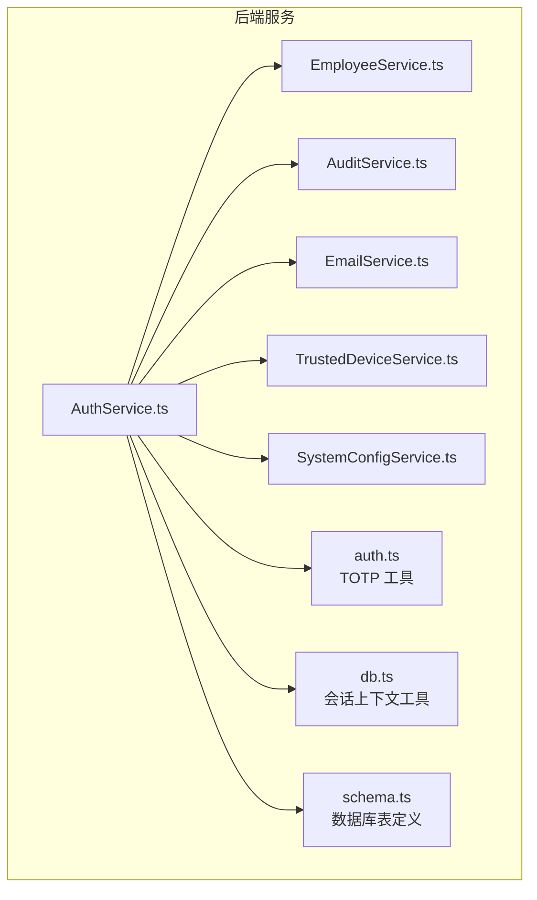
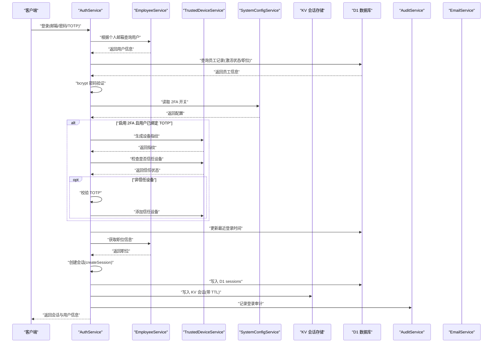
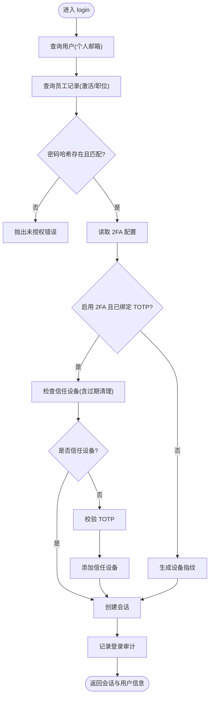
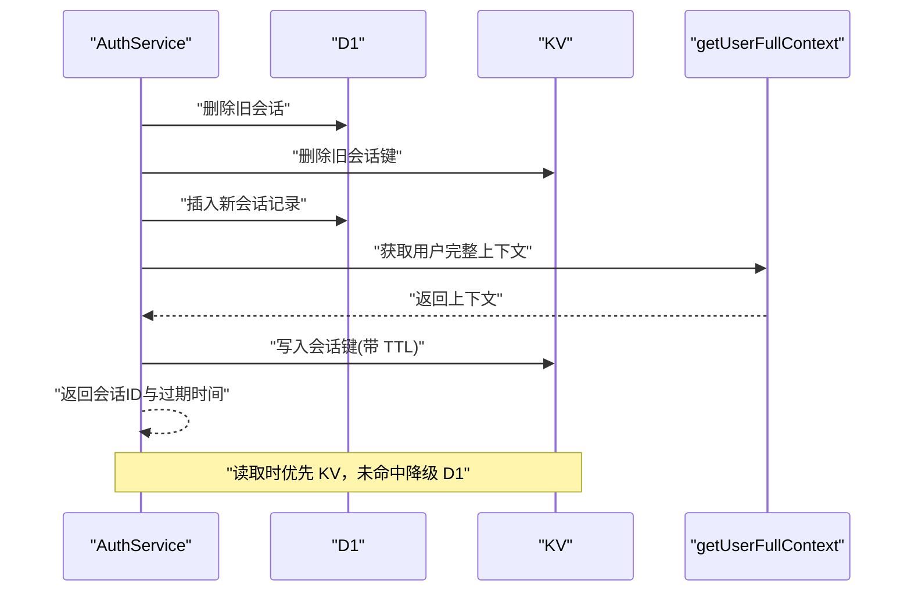
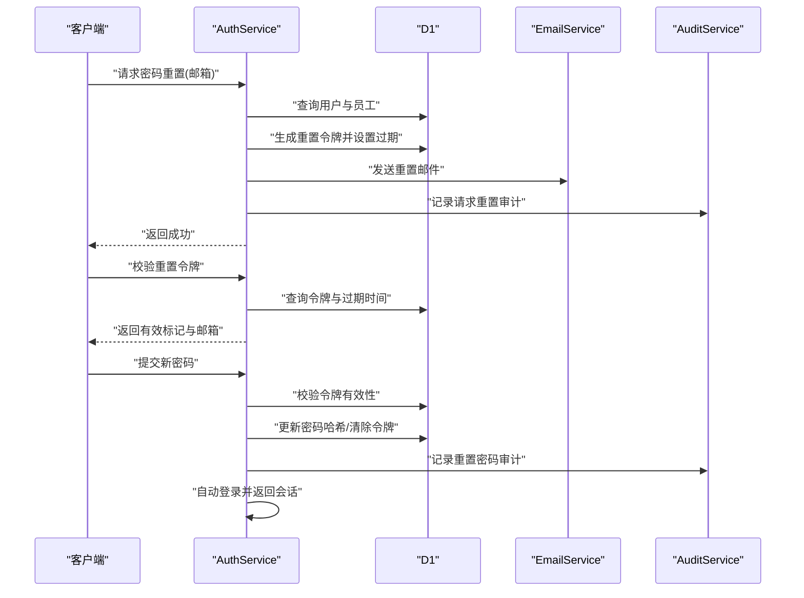
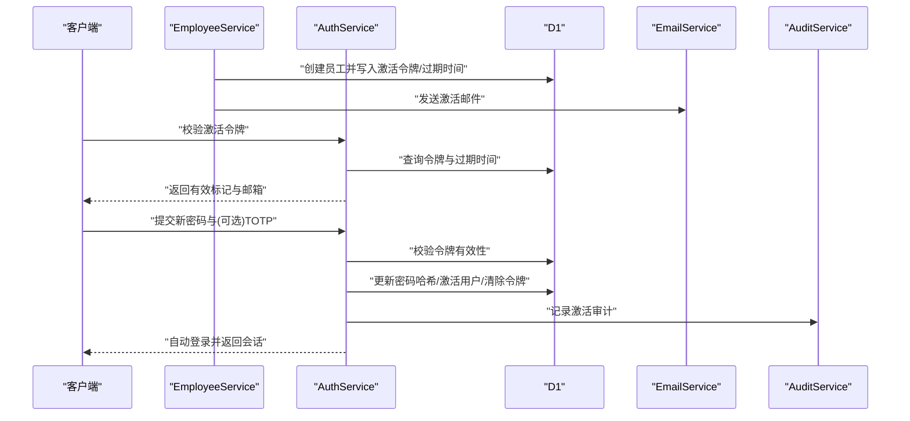
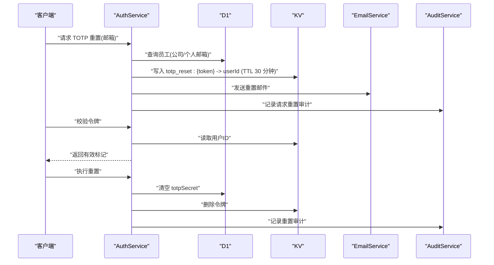
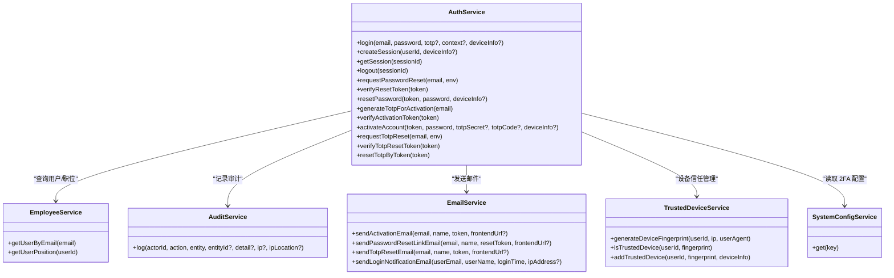

# 认证服务

<cite>
**本文引用的文件**
- [AuthService.ts](file://backend/src/services/AuthService.ts)
- [EmployeeService.ts](file://backend/src/services/EmployeeService.ts)
- [AuditService.ts](file://backend/src/services/AuditService.ts)
- [EmailService.ts](file://backend/src/services/EmailService.ts)
- [TrustedDeviceService.ts](file://backend/src/services/TrustedDeviceService.ts)
- [SystemConfigService.ts](file://backend/src/services/SystemConfigService.ts)
- [auth.ts](file://backend/src/utils/auth.ts)
- [db.ts](file://backend/src/utils/db.ts)
- [schema.ts](file://backend/src/db/schema.ts)
- [AuthService.test.ts](file://backend/test/services/AuthService.test.ts)
- [password_reset.test.ts](file://backend/test/services/password_reset.test.ts)
- [activation.test.ts](file://backend/test/services/activation.test.ts)
</cite>

## 目录
1. [简介](#简介)
2. [项目结构](#项目结构)
3. [核心组件](#核心组件)
4. [架构总览](#架构总览)
5. [详细组件分析](#详细组件分析)
6. [依赖关系分析](#依赖关系分析)
7. [性能考量](#性能考量)
8. [故障排查指南](#故障排查指南)
9. [结论](#结论)
10. [附录](#附录)

## 简介
本文件全面解析 AuthService 的认证体系实现，覆盖用户登录、会话管理、密码重置、账户激活、TOTP 双因素认证与可信设备机制，并深入剖析其与 EmployeeService、AuditService、EmailService、TrustedDeviceService、SystemConfigService 的协作关系。文档同时给出关键流程的时序图与数据流图，帮助读者快速理解系统在 Cloudflare Workers 环境下的安全边界与高可用设计。

## 项目结构
AuthService 位于后端服务目录下，围绕 D1（SQLite）与 KV（内存键值存储）构建，采用“D1 持久化 + KV 缓存”的双写策略保障会话高可用；通过系统配置开关控制 2FA 强制策略；通过审计服务记录关键事件；通过邮件服务发送安全通知与重置链接；通过可信设备服务实现“新设备首次 TOTP 验证 + 信任设备免二次验证”。

图表来源
- [AuthService.ts](file://backend/src/services/AuthService.ts#L1-L495)
- [EmployeeService.ts](file://backend/src/services/EmployeeService.ts#L1-L758)
- [AuditService.ts](file://backend/src/services/AuditService.ts#L1-L277)
- [EmailService.ts](file://backend/src/services/EmailService.ts#L1-L469)
- [TrustedDeviceService.ts](file://backend/src/services/TrustedDeviceService.ts#L1-L167)
- [SystemConfigService.ts](file://backend/src/services/SystemConfigService.ts#L1-L61)
- [auth.ts](file://backend/src/utils/auth.ts#L1-L17)
- [db.ts](file://backend/src/utils/db.ts#L1-L239)
- [schema.ts](file://backend/src/db/schema.ts#L1-L706)

章节来源
- [AuthService.ts](file://backend/src/services/AuthService.ts#L1-L495)
- [schema.ts](file://backend/src/db/schema.ts#L1-L706)

## 核心组件
- 认证服务（AuthService）：负责登录、会话创建与读取、登出、密码重置、账户激活、TOTP 重置等。
- 员工服务（EmployeeService）：提供用户查询、职位信息、组织与部门关联等。
- 审计服务（AuditService）：统一记录登录、登出、密码修改、重置、TOTP 绑定/重置等审计事件。
- 邮件服务（EmailService）：发送登录提醒、激活、密码重置、TOTP 重置等邮件。
- 可信设备服务（TrustedDeviceService）：设备指纹生成、信任设备判定与维护。
- 系统配置服务（SystemConfigService）：读取系统配置（如 2FA 开关）。
- 工具模块：TOTP 生成与校验、会话上下文与 KV 会话读取工具、数据库表定义。

章节来源
- [AuthService.ts](file://backend/src/services/AuthService.ts#L1-L495)
- [EmployeeService.ts](file://backend/src/services/EmployeeService.ts#L1-L758)
- [AuditService.ts](file://backend/src/services/AuditService.ts#L1-L277)
- [EmailService.ts](file://backend/src/services/EmailService.ts#L1-L469)
- [TrustedDeviceService.ts](file://backend/src/services/TrustedDeviceService.ts#L1-L167)
- [SystemConfigService.ts](file://backend/src/services/SystemConfigService.ts#L1-L61)
- [auth.ts](file://backend/src/utils/auth.ts#L1-L17)
- [db.ts](file://backend/src/utils/db.ts#L1-L239)
- [schema.ts](file://backend/src/db/schema.ts#L1-L706)

## 架构总览
AuthService 在登录流程中结合 bcrypt 密码验证、TOTP 双因素认证与可信设备机制，形成多层安全验证；在会话层面采用 KV 作为缓存、D1 作为持久化，实现高可用与审计能力；在密码找回与账户激活流程中，通过令牌生成、过期控制与安全审计确保安全性。

图表来源
- [AuthService.ts](file://backend/src/services/AuthService.ts#L34-L148)
- [EmployeeService.ts](file://backend/src/services/EmployeeService.ts#L624-L757)
- [TrustedDeviceService.ts](file://backend/src/services/TrustedDeviceService.ts#L14-L63)
- [SystemConfigService.ts](file://backend/src/services/SystemConfigService.ts#L9-L21)
- [AuditService.ts](file://backend/src/services/AuditService.ts#L65-L89)
- [db.ts](file://backend/src/utils/db.ts#L150-L239)

## 详细组件分析

### 登录流程与多层安全验证
- 密码验证：使用 bcrypt 对比用户密码哈希，失败则抛出未授权错误。
- 2FA 强制策略：通过 SystemConfigService 读取 2FA 开关，若启用且用户已绑定 TOTP，则要求 TOTP 验证；若用户未绑定 TOTP 且系统强制，则拒绝登录。
- 可信设备机制：对新设备生成设备指纹并检查信任状态；若非信任设备，要求用户提供 TOTP 并在验证通过后将设备加入信任列表；信任设备在 90 天内免 TOTP。
- 会话创建：登录成功后调用 createSession 创建会话，单点登录策略删除该用户旧会话，随后同时写入 D1 与 KV，并返回会话信息。
- 审计记录：登录成功后记录审计事件，包含用户标识、IP、设备信息等。

图表来源
- [AuthService.ts](file://backend/src/services/AuthService.ts#L34-L148)
- [TrustedDeviceService.ts](file://backend/src/services/TrustedDeviceService.ts#L14-L63)
- [SystemConfigService.ts](file://backend/src/services/SystemConfigService.ts#L9-L21)
- [AuditService.ts](file://backend/src/services/AuditService.ts#L65-L89)

章节来源
- [AuthService.ts](file://backend/src/services/AuthService.ts#L34-L148)
- [TrustedDeviceService.ts](file://backend/src/services/TrustedDeviceService.ts#L14-L63)
- [SystemConfigService.ts](file://backend/src/services/SystemConfigService.ts#L9-L21)
- [AuditService.ts](file://backend/src/services/AuditService.ts#L65-L89)

### 会话管理：KV 与 D1 双写策略
- 单点登录：登录前先删除该用户在 D1 中的历史会话，并逐个删除 KV 中对应会话键。
- D1 持久化：插入 sessions 记录，包含过期时间、IP、UA、创建与最后活跃时间等。
- KV 缓存：获取用户完整上下文（用户、职位、部门模块），序列化后写入 KV，TTL 为会话过期秒数。
- 会话读取：优先从 KV 读取，命中则返回；未命中则降级到 D1 查询并校验过期。
- 登出：记录审计事件，删除 KV 与 D1 中的会话记录。

图表来源
- [AuthService.ts](file://backend/src/services/AuthService.ts#L150-L198)
- [db.ts](file://backend/src/utils/db.ts#L150-L239)
- [schema.ts](file://backend/src/db/schema.ts#L118-L127)

章节来源
- [AuthService.ts](file://backend/src/services/AuthService.ts#L150-L198)
- [db.ts](file://backend/src/utils/db.ts#L150-L239)
- [schema.ts](file://backend/src/db/schema.ts#L118-L127)

### 密码重置流程：令牌生成、过期控制与安全审计
- 请求重置：根据个人邮箱查询用户与员工，生成 64 字符重置令牌（UUID 拼接），设置 1 小时过期时间，写入员工记录；若配置了邮件服务则发送重置邮件；记录审计事件。
- 校验令牌：查询员工记录，若不存在或已过期则抛出业务异常；通过后返回邮箱与有效标记。
- 重置密码：再次校验令牌有效性，使用 bcrypt 生成新密码哈希，清除令牌与过期时间，标记密码已修改，记录审计事件；若用户未绑定个人邮箱则抛出业务异常；随后自动登录并返回会话。

图表来源
- [AuthService.ts](file://backend/src/services/AuthService.ts#L229-L327)
- [EmailService.ts](file://backend/src/services/EmailService.ts#L250-L293)
- [AuditService.ts](file://backend/src/services/AuditService.ts#L65-L89)

章节来源
- [AuthService.ts](file://backend/src/services/AuthService.ts#L229-L327)
- [EmailService.ts](file://backend/src/services/EmailService.ts#L250-L293)
- [AuditService.ts](file://backend/src/services/AuditService.ts#L65-L89)

### 账户激活流程：令牌生成、过期控制与自动登录
- 生成激活令牌：员工创建时生成激活令牌与过期时间（24 小时），写入员工记录；后续可通过邮件服务发送激活邮件。
- 校验激活令牌：查询员工记录，若不存在或已过期则抛出业务异常；通过后返回邮箱与有效标记。
- 激活账户：校验令牌有效性；若启用 2FA 则要求提供 TOTP Secret 与验证码；使用 bcrypt 生成新密码哈希，激活用户、清除令牌与过期时间、标记密码已修改、可选绑定 TOTP；记录审计事件；随后自动登录并返回会话。

图表来源
- [EmployeeService.ts](file://backend/src/services/EmployeeService.ts#L186-L201)
- [AuthService.ts](file://backend/src/services/AuthService.ts#L349-L443)
- [EmailService.ts](file://backend/src/services/EmailService.ts#L194-L247)
- [AuditService.ts](file://backend/src/services/AuditService.ts#L65-L89)

章节来源
- [EmployeeService.ts](file://backend/src/services/EmployeeService.ts#L186-L201)
- [AuthService.ts](file://backend/src/services/AuthService.ts#L349-L443)
- [EmailService.ts](file://backend/src/services/EmailService.ts#L194-L247)
- [AuditService.ts](file://backend/src/services/AuditService.ts#L65-L89)

### TOTP 重置流程：基于 KV 的一次性令牌
- 请求重置：根据公司邮箱或个人邮箱查询员工，生成 32 字符重置令牌，写入 KV，TTL 30 分钟；若配置了邮件服务则发送重置邮件；记录审计事件。
- 校验令牌：从 KV 读取用户 ID，若不存在或已过期则抛出业务异常。
- 执行重置：从 KV 读取用户 ID，清空员工记录中的 totpSecret，删除 KV 中的令牌，记录审计事件。

图表来源
- [AuthService.ts](file://backend/src/services/AuthService.ts#L444-L493)
- [EmailService.ts](file://backend/src/services/EmailService.ts#L335-L382)
- [AuditService.ts](file://backend/src/services/AuditService.ts#L65-L89)

章节来源
- [AuthService.ts](file://backend/src/services/AuthService.ts#L444-L493)
- [EmailService.ts](file://backend/src/services/EmailService.ts#L335-L382)
- [AuditService.ts](file://backend/src/services/AuditService.ts#L65-L89)

### 与 EmployeeService、AuditService、EmailService 的协同
- 与 EmployeeService：登录时查询用户与员工记录、获取职位信息；激活/重置密码后更新员工记录；请求重置时查询员工以决定邮件目标邮箱。
- 与 AuditService：在登录、登出、密码重置、激活、TOTP 重置等关键动作记录审计事件，便于合规与追踪。
- 与 EmailService：发送登录提醒、激活邮件、密码重置邮件、TOTP 重置邮件，邮件内容包含链接与有效期提示。

章节来源
- [AuthService.ts](file://backend/src/services/AuthService.ts#L34-L148)
- [EmployeeService.ts](file://backend/src/services/EmployeeService.ts#L624-L757)
- [AuditService.ts](file://backend/src/services/AuditService.ts#L65-L89)
- [EmailService.ts](file://backend/src/services/EmailService.ts#L147-L382)

## 依赖关系分析
AuthService 的耦合主要体现在对 EmployeeService、AuditService、EmailService、TrustedDeviceService、SystemConfigService 的依赖；内部通过 bcrypt、TOTP 工具与 KV/D1 实现安全与高可用。整体依赖关系如下：

图表来源
- [AuthService.ts](file://backend/src/services/AuthService.ts#L1-L495)
- [EmployeeService.ts](file://backend/src/services/EmployeeService.ts#L1-L758)
- [AuditService.ts](file://backend/src/services/AuditService.ts#L1-L277)
- [EmailService.ts](file://backend/src/services/EmailService.ts#L1-L469)
- [TrustedDeviceService.ts](file://backend/src/services/TrustedDeviceService.ts#L1-L167)
- [SystemConfigService.ts](file://backend/src/services/SystemConfigService.ts#L1-L61)

章节来源
- [AuthService.ts](file://backend/src/services/AuthService.ts#L1-L495)
- [EmployeeService.ts](file://backend/src/services/EmployeeService.ts#L1-L758)
- [AuditService.ts](file://backend/src/services/AuditService.ts#L1-L277)
- [EmailService.ts](file://backend/src/services/EmailService.ts#L1-L469)
- [TrustedDeviceService.ts](file://backend/src/services/TrustedDeviceService.ts#L1-L167)
- [SystemConfigService.ts](file://backend/src/services/SystemConfigService.ts#L1-L61)

## 性能考量
- KV 优先读取：会话读取优先 KV，命中率高、延迟低；未命中降级 D1，保证一致性。
- 单点登录删除旧会话：避免 KV 与 D1 中冗余会话占用空间与查询开销。
- TTL 管理：KV 会话与信任设备均设置 TTL，减少过期数据清理成本。
- 令牌长度与过期：重置与激活令牌长度适中、过期时间合理，兼顾安全性与易用性。
- 2FA 与可信设备：在提升安全性的同时，通过信任设备减少重复验证次数，改善用户体验。

[本节为通用指导，不直接分析具体文件]

## 故障排查指南
- 登录失败（用户名或密码错误）：检查 bcrypt 密码哈希是否正确、用户是否激活、是否满足 2FA 强制策略。
- 2FA 未绑定或未启用：若系统强制 2FA 且用户未绑定 TOTP，登录会被拒绝；可通过 TOTP 重置流程解除。
- 信任设备问题：非信任设备首次登录需提供 TOTP；若设备指纹生成异常或过期，需重新验证并加入信任列表。
- 会话不可用：检查 KV 与 D1 中是否存在对应会话；确认 TTL 是否过期；确认单点登录是否清理了旧会话。
- 邮件发送失败：检查 EMAIL_SERVICE 与 EMAIL_TOKEN 配置；查看邮件服务返回的错误信息。
- 审计缺失：确认审计服务初始化与调用路径；检查审计日志表是否存在索引影响查询。

章节来源
- [AuthService.ts](file://backend/src/services/AuthService.ts#L34-L148)
- [TrustedDeviceService.ts](file://backend/src/services/TrustedDeviceService.ts#L14-L63)
- [EmailService.ts](file://backend/src/services/EmailService.ts#L107-L146)
- [AuditService.ts](file://backend/src/services/AuditService.ts#L65-L89)

## 结论
AuthService 通过 bcrypt、TOTP 与可信设备三重验证，结合 KV/D1 双写会话策略，在 Cloudflare Workers 环境下实现了高可用与强安全的认证体系。配合审计与邮件服务，形成了从登录、会话管理到密码找回与账户激活的闭环安全流程，满足企业级系统的合规与安全需求。

[本节为总结性内容，不直接分析具体文件]

## 附录
- 关键流程测试参考：
  - 登录与会话：[AuthService.test.ts](file://backend/test/services/AuthService.test.ts#L58-L119)
  - 密码重置：[password_reset.test.ts](file://backend/test/services/password_reset.test.ts#L113-L160)
  - 账户激活：[activation.test.ts](file://backend/test/services/activation.test.ts#L132-L172)

章节来源
- [AuthService.test.ts](file://backend/test/services/AuthService.test.ts#L58-L119)
- [password_reset.test.ts](file://backend/test/services/password_reset.test.ts#L113-L160)
- [activation.test.ts](file://backend/test/services/activation.test.ts#L132-L172)