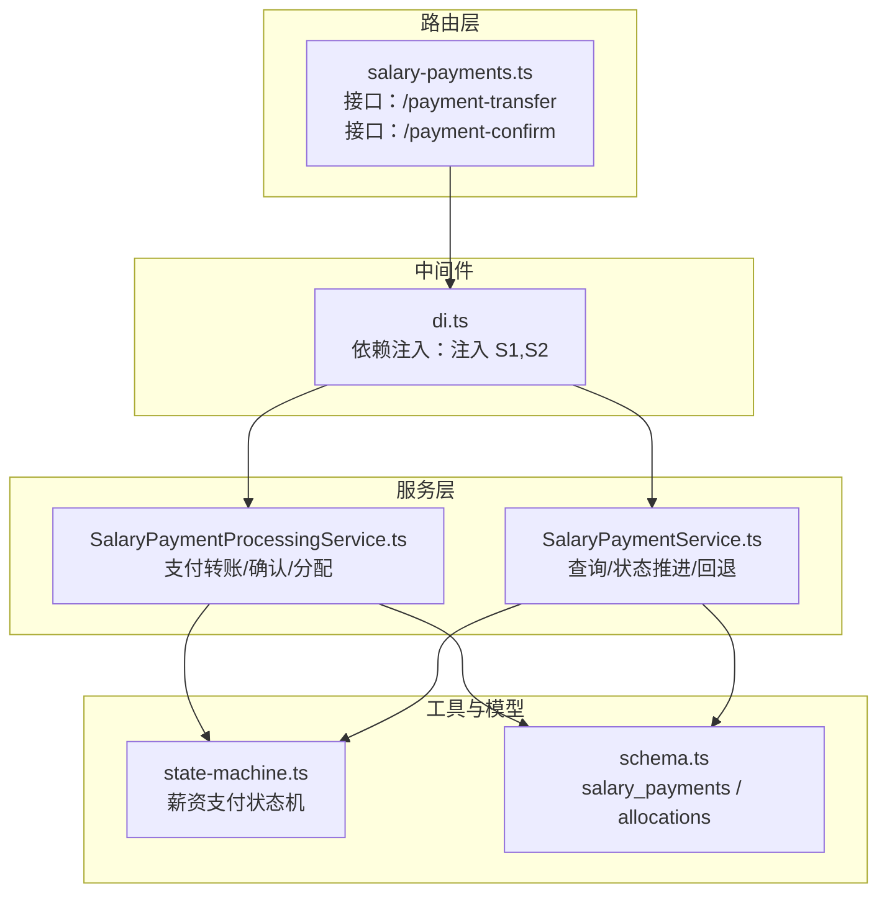
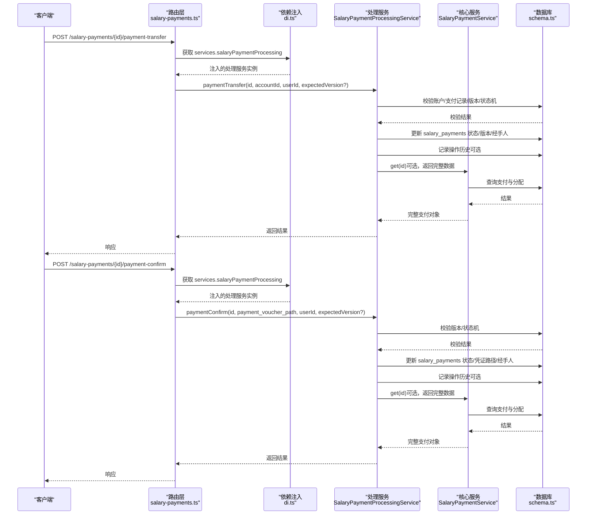
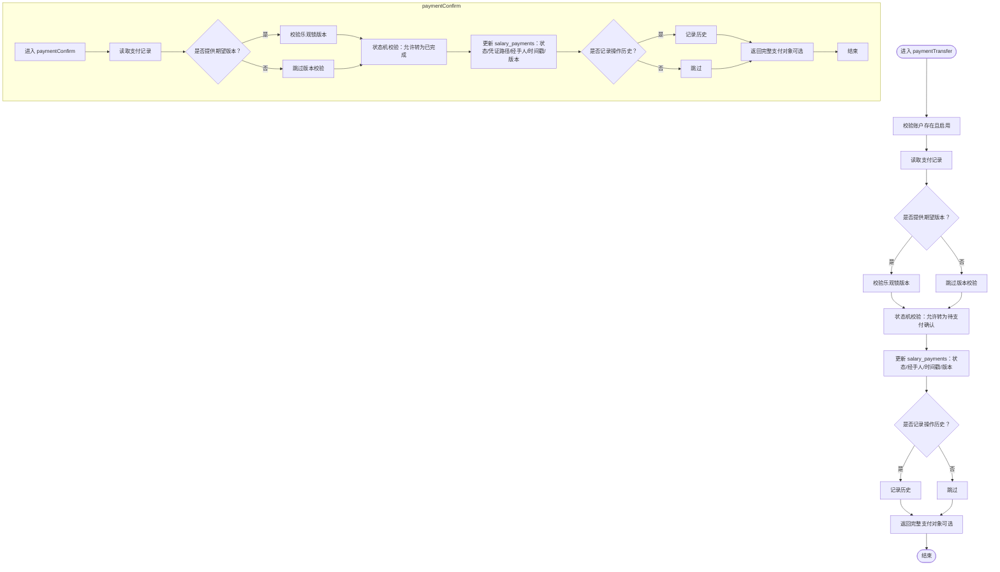
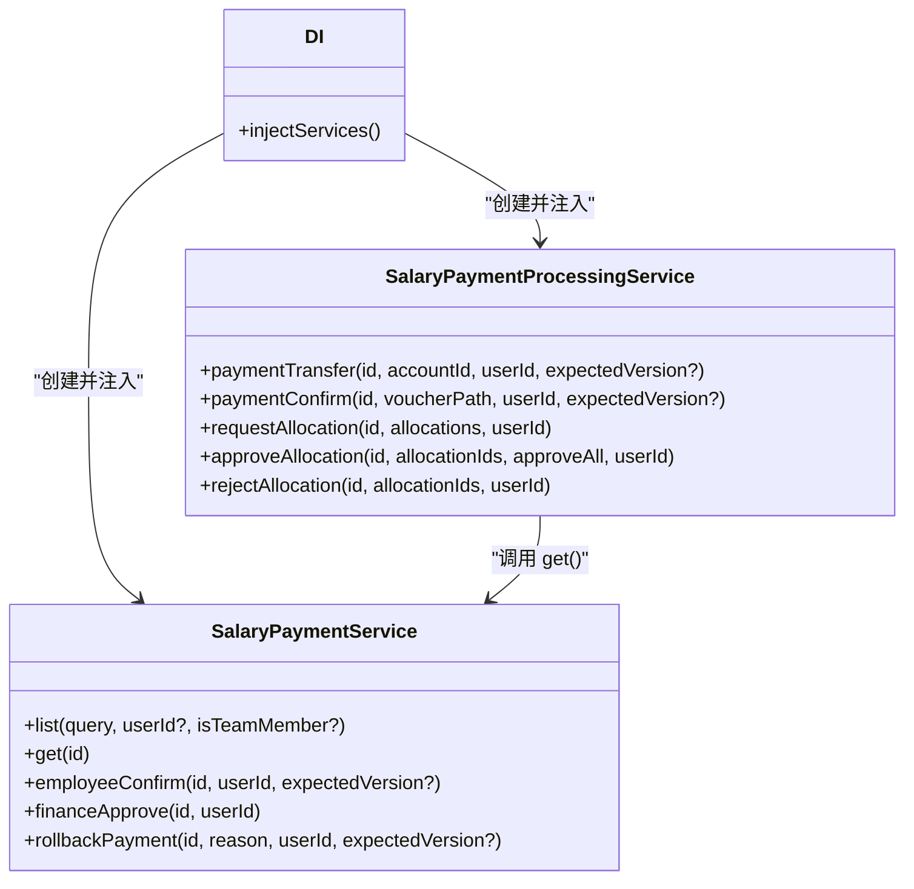
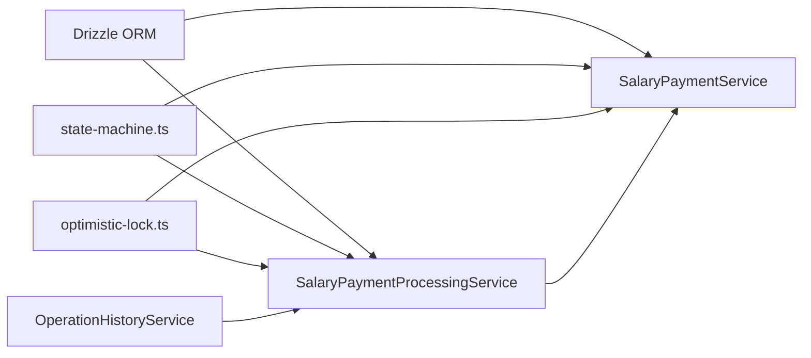

# 薪资支付处理服务

<cite>
**本文引用的文件**
- [SalaryPaymentProcessingService.ts](file://backend/src/services/SalaryPaymentProcessingService.ts)
- [SalaryPaymentService.ts](file://backend/src/services/SalaryPaymentService.ts)
- [di.ts](file://backend/src/middleware/di.ts)
- [salary-payments.ts](file://backend/src/routes/v2/salary-payments.ts)
- [state-machine.ts](file://backend/src/utils/state-machine.ts)
- [schema.ts](file://backend/src/db/schema.ts)
- [salary-payments.test.ts](file://backend/test/routes/salary-payments.test.ts)
- [openapi.json](file://backend/openapi.json)
- [SalaryPaymentsPage.tsx](file://frontend/src/features/hr/pages/SalaryPaymentsPage.tsx)
</cite>

## 目录
1. [简介](#简介)
2. [项目结构](#项目结构)
3. [核心组件](#核心组件)
4. [架构总览](#架构总览)
5. [详细组件分析](#详细组件分析)
6. [依赖分析](#依赖分析)
7. [性能考虑](#性能考虑)
8. [故障排查指南](#故障排查指南)
9. [结论](#结论)
10. [附录](#附录)

## 简介
本文件系统性地文档化“薪资支付处理服务”（SalaryPaymentProcessingService）的架构与实现，重点覆盖以下方面：
- 如何处理薪资发放的最终执行阶段（支付转账与结果确认）
- 与银行或支付网关的对接逻辑（当前代码未直接实现外部网关调用，但通过凭证路径与状态机驱动流程）
- paymentTransfer 方法如何发起实际的资金转账并更新薪资支付记录状态
- paymentConfirm 方法如何处理来自支付系统的回调，确认支付结果并更新系统状态
- 与 SalaryPaymentService 的协作方式（依赖注入与服务间调用）
- 异常处理机制（业务错误、乐观锁冲突、状态机校验等）

## 项目结构
围绕薪资支付处理的核心文件与职责如下：
- 后端服务层
  - SalaryPaymentProcessingService：负责支付转账、支付确认、多币种分配请求与审批
  - SalaryPaymentService：负责薪资支付的查询、状态推进、回退等核心流程
- 中间件与依赖注入
  - di.ts：集中初始化并注入服务实例（含 SalaryPaymentProcessingService 与 SalaryPaymentService）
- 路由层
  - salary-payments.ts：暴露 /salary-payments/{id}/payment-transfer 与 /salary-payments/{id}/payment-confirm 接口，调用处理服务
- 工具与模型
  - state-machine.ts：薪资支付状态机，约束合法状态转换
  - schema.ts：salary_payments 与 salary_payment_allocations 表结构定义
- 测试与前端
  - salary-payments.test.ts：接口测试，验证处理服务被正确调用
  - openapi.json：接口契约（参数、响应）
  - SalaryPaymentsPage.tsx：前端凭证上传与确认交互

图表来源
- [salary-payments.ts](file://backend/src/routes/v2/salary-payments.ts#L289-L377)
- [di.ts](file://backend/src/middleware/di.ts#L41-L70)
- [SalaryPaymentProcessingService.ts](file://backend/src/services/SalaryPaymentProcessingService.ts#L1-L177)
- [SalaryPaymentService.ts](file://backend/src/services/SalaryPaymentService.ts#L1-L171)
- [state-machine.ts](file://backend/src/utils/state-machine.ts#L45-L55)
- [schema.ts](file://backend/src/db/schema.ts#L286-L331)

章节来源
- [salary-payments.ts](file://backend/src/routes/v2/salary-payments.ts#L289-L377)
- [di.ts](file://backend/src/middleware/di.ts#L41-L70)

## 核心组件
- SalaryPaymentProcessingService
  - 支付转账：paymentTransfer(id, accountId, userId, expectedVersion?)
  - 支付确认：paymentConfirm(id, voucherPath, userId, expectedVersion?)
  - 分配管理：requestAllocation、approveAllocation、rejectAllocation
- SalaryPaymentService
  - 查询与聚合：list、get
  - 状态推进：employeeConfirm、financeApprove
  - 回退：rollbackPayment
- 依赖注入：在 di.ts 中创建并注入两个服务实例
- 状态机：salaryPaymentStateMachine 定义了合法状态转换

章节来源
- [SalaryPaymentProcessingService.ts](file://backend/src/services/SalaryPaymentProcessingService.ts#L30-L177)
- [SalaryPaymentService.ts](file://backend/src/services/SalaryPaymentService.ts#L86-L171)
- [di.ts](file://backend/src/middleware/di.ts#L41-L70)
- [state-machine.ts](file://backend/src/utils/state-machine.ts#L45-L55)

## 架构总览
薪资支付处理服务位于“路由 -> 依赖注入 -> 服务”的清晰分层中：
- 路由层接收请求，解析参数与主体，调用处理服务
- 依赖注入层统一创建并注入服务实例，确保服务间协作
- 处理服务执行业务逻辑（状态机校验、乐观锁、数据库更新、操作历史记录），必要时委托 SalaryPaymentService 获取完整数据
- 数据模型层提供表结构定义，支撑状态字段、版本号、分配明细等

图表来源
- [salary-payments.ts](file://backend/src/routes/v2/salary-payments.ts#L289-L377)
- [di.ts](file://backend/src/middleware/di.ts#L41-L70)
- [SalaryPaymentProcessingService.ts](file://backend/src/services/SalaryPaymentProcessingService.ts#L30-L177)
- [SalaryPaymentService.ts](file://backend/src/services/SalaryPaymentService.ts#L86-L171)
- [schema.ts](file://backend/src/db/schema.ts#L286-L331)

## 详细组件分析

### SalaryPaymentProcessingService：支付转账与确认
- 支付转账（paymentTransfer）
  - 输入：id、accountId、userId、expectedVersion?
  - 校验：
    - 账户存在且启用
    - 支付记录存在
    - 乐观锁版本校验（可选）
    - 状态机校验：从当前状态允许转换到“待支付确认”
  - 更新：
    - 设置状态为“pending_payment_confirmation”
    - 记录经手人与时间戳
    - 版本号递增
  - 历史记录：可选记录操作历史
  - 返回：通过 SalaryPaymentService.get(id) 返回完整支付对象（若注入）
- 支付确认（paymentConfirm）
  - 输入：id、payment_voucher_path、userId、expectedVersion?
  - 校验：
    - 支付记录存在
    - 乐观锁版本校验（可选）
    - 状态机校验：从“待支付确认”转换到“已完成”
  - 更新：
    - 设置状态为“completed”
    - 写入凭证路径与经手人时间戳
    - 版本号递增
  - 历史记录：可选记录操作历史
  - 返回：通过 SalaryPaymentService.get(id) 返回完整支付对象（若注入）

图表来源
- [SalaryPaymentProcessingService.ts](file://backend/src/services/SalaryPaymentProcessingService.ts#L30-L177)
- [state-machine.ts](file://backend/src/utils/state-machine.ts#L45-L55)
- [schema.ts](file://backend/src/db/schema.ts#L286-L331)

章节来源
- [SalaryPaymentProcessingService.ts](file://backend/src/services/SalaryPaymentProcessingService.ts#L30-L177)

### 与 SalaryPaymentService 的协作
- 依赖注入：在 di.ts 中创建 SalaryPaymentService 与 SalaryPaymentProcessingService 实例，并注入到上下文
- 协作方式：
  - SalaryPaymentProcessingService 在需要时调用 SalaryPaymentService.get(id) 获取完整支付对象（包含员工与部门名称、分配明细）
  - SalaryPaymentService 提供 list/get、employeeConfirm、financeApprove、rollbackPayment 等能力，处理流程推进与回退

图表来源
- [di.ts](file://backend/src/middleware/di.ts#L41-L70)
- [SalaryPaymentProcessingService.ts](file://backend/src/services/SalaryPaymentProcessingService.ts#L1-L177)
- [SalaryPaymentService.ts](file://backend/src/services/SalaryPaymentService.ts#L1-L171)

章节来源
- [di.ts](file://backend/src/middleware/di.ts#L41-L70)
- [SalaryPaymentService.ts](file://backend/src/services/SalaryPaymentService.ts#L86-L171)

### 与银行/支付网关的对接逻辑
- 当前代码未直接实现外部银行或支付网关的调用逻辑
- 支付确认通过凭证路径（payment_voucher_path）完成，表示系统侧记录支付凭证并标记完成
- 若需对接真实网关，可在 paymentTransfer/paymentConfirm 中扩展外部调用与重试策略；当前实现以凭证路径作为“支付完成”的证据

章节来源
- [SalaryPaymentProcessingService.ts](file://backend/src/services/SalaryPaymentProcessingService.ts#L118-L177)
- [salary-payments.ts](file://backend/src/routes/v2/salary-payments.ts#L334-L377)

### 分配管理（多币种）
- requestAllocation：校验币种、账户币种匹配（若提供账户），计算多币种总额并转换为基准币种（USDT），允许 1% 误差
- approveAllocation：支持全部批准或按 ID 批准，完成后检查是否全部批准并更新主支付记录的分配状态
- rejectAllocation：按 ID 拒绝分配

章节来源
- [SalaryPaymentProcessingService.ts](file://backend/src/services/SalaryPaymentProcessingService.ts#L179-L375)
- [schema.ts](file://backend/src/db/schema.ts#L318-L331)

## 依赖分析
- 组件耦合
  - SalaryPaymentProcessingService 依赖数据库、状态机、乐观锁工具、可选的 OperationHistoryService 与 SalaryPaymentService
  - SalaryPaymentService 依赖数据库、状态机、乐观锁工具、可选的 OperationHistoryService
- 外部依赖
  - Drizzle ORM（数据库访问）
  - UUID（分配记录 ID）
  - 日志与错误工具（Errors、Logger）
- 依赖注入
  - di.ts 统一创建并注入服务，避免循环依赖，便于测试替换

图表来源
- [SalaryPaymentProcessingService.ts](file://backend/src/services/SalaryPaymentProcessingService.ts#L1-L177)
- [SalaryPaymentService.ts](file://backend/src/services/SalaryPaymentService.ts#L1-L171)
- [state-machine.ts](file://backend/src/utils/state-machine.ts#L1-L89)
- [di.ts](file://backend/src/middleware/di.ts#L41-L70)

章节来源
- [SalaryPaymentProcessingService.ts](file://backend/src/services/SalaryPaymentProcessingService.ts#L1-L177)
- [SalaryPaymentService.ts](file://backend/src/services/SalaryPaymentService.ts#L1-L171)
- [di.ts](file://backend/src/middleware/di.ts#L41-L70)

## 性能考虑
- 数据库事务
  - 分配管理使用事务保证一致性（删除旧分配、插入新分配、更新主记录）
- 状态机与乐观锁
  - 通过状态机限制非法转换，避免无效写入
  - 乐观锁减少并发冲突导致的更新失败
- 查询优化
  - list 接口使用 QueryBuilder 优化员工关联查询
  - 分配明细按支付 ID 批量查询并映射，降低 N+1 查询风险

章节来源
- [SalaryPaymentProcessingService.ts](file://backend/src/services/SalaryPaymentProcessingService.ts#L228-L277)
- [SalaryPaymentService.ts](file://backend/src/services/SalaryPaymentService.ts#L28-L84)

## 故障排查指南
- 常见错误与定位
  - 业务错误（如账户停用、币种不匹配、分配总额不一致、状态不允许等）：由服务内部抛出，路由层捕获并返回
  - 乐观锁冲突：expectedVersion 与数据库版本不一致导致更新失败，需重新加载数据后重试
  - 状态机校验失败：当前状态不允许转换到目标状态
- 前端交互
  - 凭证上传：前端支持图片上传并生成凭证 URL，随后调用支付确认接口
  - 错误处理：前端提供错误边界与重试机制，提升用户体验

章节来源
- [SalaryPaymentProcessingService.ts](file://backend/src/services/SalaryPaymentProcessingService.ts#L30-L177)
- [SalaryPaymentService.ts](file://backend/src/services/SalaryPaymentService.ts#L173-L325)
- [SalaryPaymentsPage.tsx](file://frontend/src/features/hr/pages/SalaryPaymentsPage.tsx#L186-L233)

## 结论
- 薪资支付处理服务通过明确的职责划分与状态机约束，确保支付流程的可控与可审计
- 与核心服务的协作通过依赖注入实现松耦合，便于扩展与测试
- 当前实现以凭证路径作为支付完成证据，若需对接真实网关，可在处理服务中扩展外部调用与重试策略
- 建议后续完善：
  - 明确银行/支付网关对接点（如新增 bankTransfer 方法）
  - 增加重试与幂等设计（针对外部网关调用）
  - 增加更细粒度的日志与监控指标

## 附录

### 接口契约与调用示例
- 支付转账
  - 方法：POST /api/salary-payments/{id}/payment-transfer
  - 参数：accountId（必填）
  - 响应：success + data（包含 id 与 status）
- 支付确认
  - 方法：POST /api/salary-payments/{id}/payment-confirm
  - 参数：payment_voucher_path（必填）
  - 响应：success + data（包含 id 与 status）

章节来源
- [openapi.json](file://backend/openapi.json#L7297-L7336)
- [salary-payments.ts](file://backend/src/routes/v2/salary-payments.ts#L289-L377)

### 测试用例要点
- 路由层对处理服务的调用进行了模拟，验证接口返回结构与状态码
- 测试覆盖了支付转账、支付确认、分配请求与批准等关键路径

章节来源
- [salary-payments.test.ts](file://backend/test/routes/salary-payments.test.ts#L168-L236)