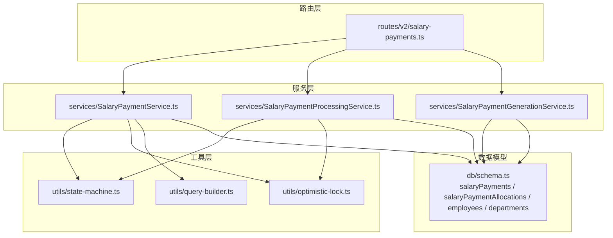
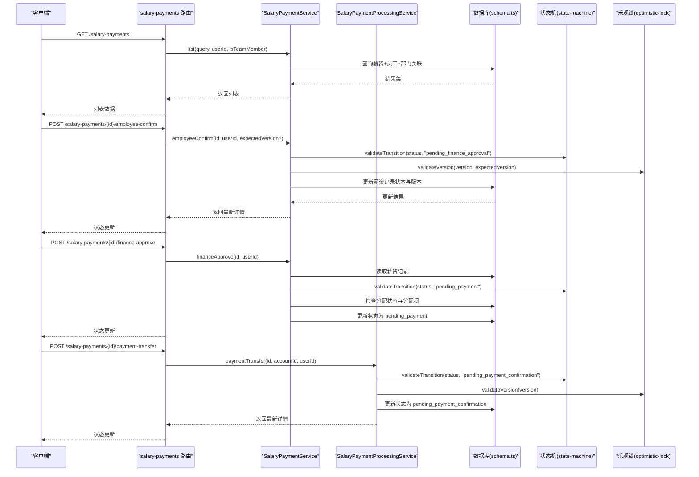
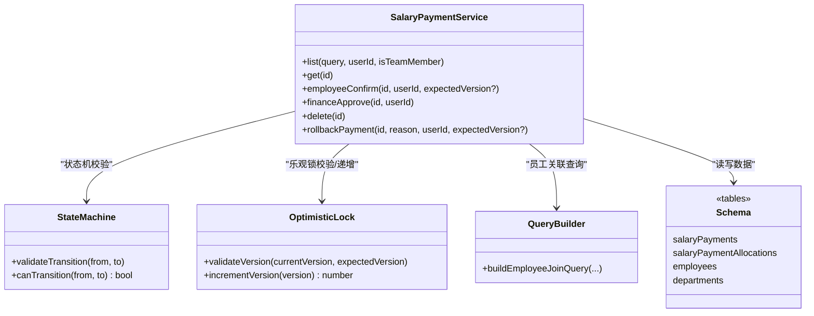
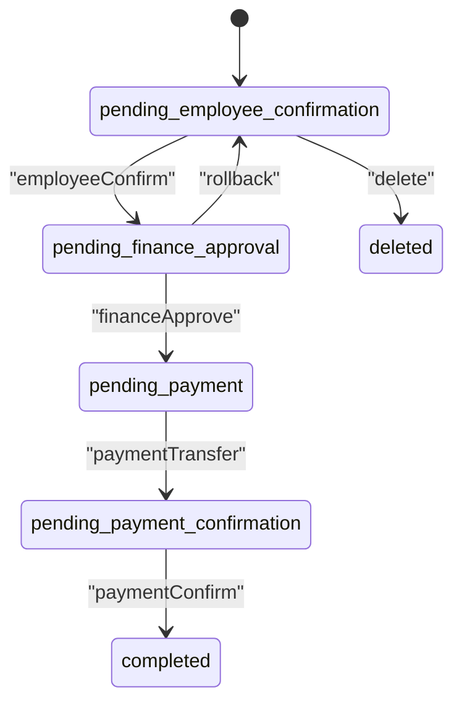
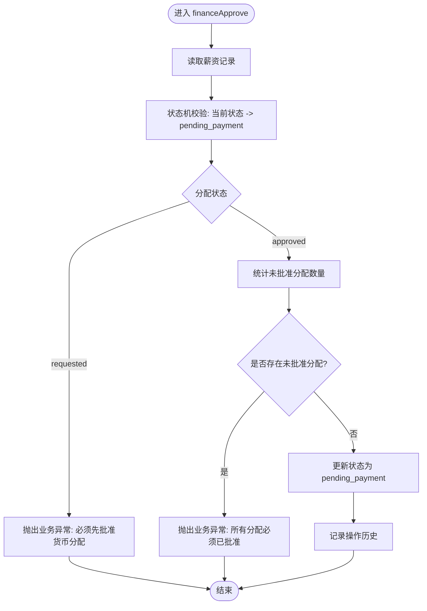
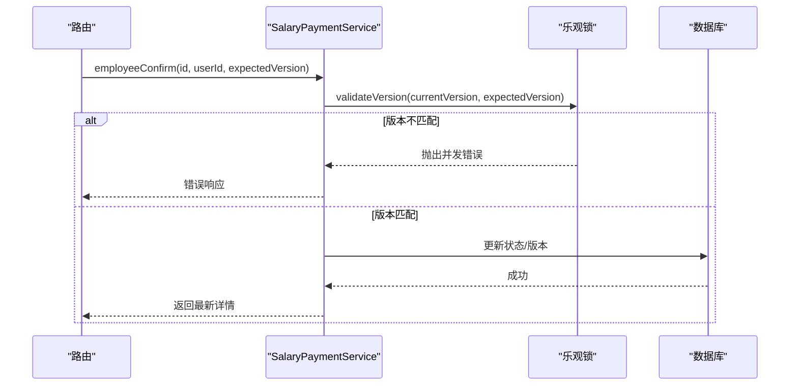
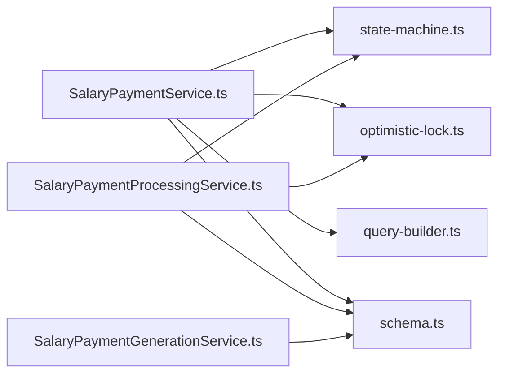

# 薪资支付核心服务

<cite>
**本文引用的文件**
- [SalaryPaymentService.ts](file://backend/src/services/SalaryPaymentService.ts)
- [salary-payments.ts](file://backend/src/routes/v2/salary-payments.ts)
- [schema.ts](file://backend/src/db/schema.ts)
- [state-machine.ts](file://backend/src/utils/state-machine.ts)
- [optimistic-lock.ts](file://backend/src/utils/optimistic-lock.ts)
- [query-builder.ts](file://backend/src/utils/query-builder.ts)
- [SalaryPaymentProcessingService.ts](file://backend/src/services/SalaryPaymentProcessingService.ts)
- [SalaryPaymentGenerationService.ts](file://backend/src/services/SalaryPaymentGenerationService.ts)
- [SalaryPaymentService.test.ts](file://backend/test/services/SalaryPaymentService.test.ts)
</cite>

## 目录
1. [简介](#简介)
2. [项目结构](#项目结构)
3. [核心组件](#核心组件)
4. [架构总览](#架构总览)
5. [详细组件分析](#详细组件分析)
6. [依赖关系分析](#依赖关系分析)
7. [性能考量](#性能考量)
8. [故障排查指南](#故障排查指南)
9. [结论](#结论)
10. [附录](#附录)

## 简介
本文件系统性文档化薪资支付核心服务（SalaryPaymentService）的架构与实现，重点覆盖：
- 在薪资发放流程中的核心作用：list 与 get 如何查询薪资支付记录并关联员工与部门信息
- employeeConfirm 员工确认流程：乐观锁版本控制与状态机状态转换验证
- financeApprove 财务审批逻辑：对货币分配状态的检查
- delete 删除限制条件与 rollbackPayment 回退机制
- 薪资支付状态流转图：pending_employee_confirmation、pending_finance_approval、pending_payment 等状态间的转换规则与业务约束

## 项目结构
围绕薪资支付的核心模块分布如下：
- 服务层：SalaryPaymentService、SalaryPaymentProcessingService、SalaryPaymentGenerationService
- 路由层：salary-payments 路由，提供查询、状态变更、转账、确认、分配请求与审批等接口
- 数据模型：salaryPayments、salaryPaymentAllocations、employees、departments 等
- 工具层：状态机（state-machine）、乐观锁（optimistic-lock）、通用查询构建器（query-builder）

图表来源
- [salary-payments.ts](file://backend/src/routes/v2/salary-payments.ts#L1-L604)
- [SalaryPaymentService.ts](file://backend/src/services/SalaryPaymentService.ts#L1-L326)
- [SalaryPaymentProcessingService.ts](file://backend/src/services/SalaryPaymentProcessingService.ts#L1-L378)
- [SalaryPaymentGenerationService.ts](file://backend/src/services/SalaryPaymentGenerationService.ts#L1-L278)
- [state-machine.ts](file://backend/src/utils/state-machine.ts#L1-L89)
- [optimistic-lock.ts](file://backend/src/utils/optimistic-lock.ts#L1-L41)
- [query-builder.ts](file://backend/src/utils/query-builder.ts#L1-L177)
- [schema.ts](file://backend/src/db/schema.ts#L286-L331)

章节来源
- [salary-payments.ts](file://backend/src/routes/v2/salary-payments.ts#L1-L604)
- [SalaryPaymentService.ts](file://backend/src/services/SalaryPaymentService.ts#L1-L326)
- [schema.ts](file://backend/src/db/schema.ts#L286-L331)

## 核心组件
- 薪资支付核心服务（SalaryPaymentService）
  - 提供 list、get 查询薪资支付记录，并关联员工与部门信息
  - 实现员工确认（employeeConfirm）、财务审批（financeApprove）、删除（delete）、回退（rollbackPayment）
  - 使用状态机与乐观锁保障并发安全与状态转换合法性
- 薪资支付处理服务（SalaryPaymentProcessingService）
  - 支付转账（paymentTransfer）、支付确认（paymentConfirm）
  - 货币分配请求（requestAllocation）、分配审批（approveAllocation）、分配拒绝（rejectAllocation）
- 薪资生成服务（SalaryPaymentGenerationService）
  - 生成薪资支付记录，计算工作日与请假扣减，按月批量创建待确认状态的薪资记录

章节来源
- [SalaryPaymentService.ts](file://backend/src/services/SalaryPaymentService.ts#L1-L326)
- [SalaryPaymentProcessingService.ts](file://backend/src/services/SalaryPaymentProcessingService.ts#L1-L378)
- [SalaryPaymentGenerationService.ts](file://backend/src/services/SalaryPaymentGenerationService.ts#L1-L278)

## 架构总览
薪资支付流程的关键交互如下：
- 路由层接收请求，调用对应服务
- 核心服务执行业务逻辑（状态机校验、乐观锁校验、数据库更新）
- 处理服务补充支付转账/确认与货币分配能力
- 生成服务负责初始薪资记录创建

图表来源
- [salary-payments.ts](file://backend/src/routes/v2/salary-payments.ts#L1-L604)
- [SalaryPaymentService.ts](file://backend/src/services/SalaryPaymentService.ts#L117-L236)
- [SalaryPaymentProcessingService.ts](file://backend/src/services/SalaryPaymentProcessingService.ts#L30-L177)
- [state-machine.ts](file://backend/src/utils/state-machine.ts#L45-L55)
- [optimistic-lock.ts](file://backend/src/utils/optimistic-lock.ts#L16-L40)
- [schema.ts](file://backend/src/db/schema.ts#L286-L331)

## 详细组件分析

### 薪资支付核心服务（SalaryPaymentService）
- list 与 get
  - list：基于 QueryBuilder 构建员工关联查询，返回薪资记录并附带员工姓名与部门名称；同时加载对应的货币分配明细，组装返回
  - get：单条查询薪资记录，关联员工与部门信息，并加载分配明细
- employeeConfirm
  - 读取薪资记录，校验期望版本（乐观锁），校验状态机允许从当前状态转换到“pending_finance_approval”
  - 更新状态、确认人与时间戳、版本号，记录操作历史
- financeApprove
  - 读取薪资记录，校验状态机允许从当前状态转换到“pending_payment”
  - 校验分配状态：若为 requested 则必须先批准；若为 approved，需确保所有分配项均已批准
  - 更新状态、审批人与时间戳，记录操作历史
- delete
  - 仅允许处于“pending_employee_confirmation”或“pending_finance_approval”的记录被删除
  - 使用事务删除分配明细与主记录
- rollbackPayment
  - 仅允许处于“pending_finance_approval”、“pending_payment”、“pending_payment_confirmation”的记录回退
  - 根据当前状态映射到目标状态，校验状态机允许的回退路径
  - 更新回退原因、回退人与时间戳，记录操作历史

图表来源
- [SalaryPaymentService.ts](file://backend/src/services/SalaryPaymentService.ts#L1-L326)
- [state-machine.ts](file://backend/src/utils/state-machine.ts#L1-L89)
- [optimistic-lock.ts](file://backend/src/utils/optimistic-lock.ts#L1-L41)
- [query-builder.ts](file://backend/src/utils/query-builder.ts#L1-L177)
- [schema.ts](file://backend/src/db/schema.ts#L286-L331)

章节来源
- [SalaryPaymentService.ts](file://backend/src/services/SalaryPaymentService.ts#L28-L116)
- [SalaryPaymentService.ts](file://backend/src/services/SalaryPaymentService.ts#L117-L236)
- [SalaryPaymentService.ts](file://backend/src/services/SalaryPaymentService.ts#L238-L326)

### 薪资支付状态机与状态流转
- 状态定义与允许转换：
  - pending_employee_confirmation → pending_finance_approval 或 deleted
  - pending_finance_approval → pending_payment 或回退到 pending_employee_confirmation
  - pending_payment → pending_payment_confirmation
  - pending_payment_confirmation → completed
  - completed 为终态，不允许进一步转换
- 路由层与服务层均依赖状态机进行转换校验，保证业务顺序正确

图表来源
- [state-machine.ts](file://backend/src/utils/state-machine.ts#L45-L55)

章节来源
- [state-machine.ts](file://backend/src/utils/state-machine.ts#L45-L55)

### 货币分配与财务审批逻辑
- financeApprove 对分配状态的检查：
  - 若分配状态为 requested，必须先批准货币分配
  - 若分配状态为 approved，需确保所有分配项均已批准（通过计数判断）
- 路由层提供分配请求与审批接口，处理服务负责分配的创建、审批与拒绝

图表来源
- [SalaryPaymentService.ts](file://backend/src/services/SalaryPaymentService.ts#L173-L236)
- [SalaryPaymentProcessingService.ts](file://backend/src/services/SalaryPaymentProcessingService.ts#L291-L375)

章节来源
- [SalaryPaymentService.ts](file://backend/src/services/SalaryPaymentService.ts#L173-L236)
- [SalaryPaymentProcessingService.ts](file://backend/src/services/SalaryPaymentProcessingService.ts#L291-L375)

### 乐观锁与并发控制
- validateVersion：当期望版本与当前版本不一致时，抛出并发修改错误
- incrementVersion：每次成功更新后递增版本号，避免后续更新因版本不匹配而失败
- 路由层在调用服务时可传入 expectedVersion，服务内部进行校验

图表来源
- [optimistic-lock.ts](file://backend/src/utils/optimistic-lock.ts#L16-L40)
- [SalaryPaymentService.ts](file://backend/src/services/SalaryPaymentService.ts#L117-L171)

章节来源
- [optimistic-lock.ts](file://backend/src/utils/optimistic-lock.ts#L16-L40)
- [SalaryPaymentService.ts](file://backend/src/services/SalaryPaymentService.ts#L117-L171)

### 删除与回退机制
- delete
  - 仅允许“pending_employee_confirmation”或“pending_finance_approval”的记录删除
  - 使用事务删除分配明细与主记录
- rollbackPayment
  - 仅允许“pending_finance_approval”、“pending_payment”、“pending_payment_confirmation”的记录回退
  - 根据当前状态映射到目标状态，校验状态机允许的回退路径
  - 更新回退原因、回退人与时间戳，记录操作历史

章节来源
- [SalaryPaymentService.ts](file://backend/src/services/SalaryPaymentService.ts#L238-L326)

### 查询与关联员工/部门
- list：使用 QueryBuilder 构建员工关联查询，自动关联 employees、departments、orgDepartments、positions，返回薪资记录并附带员工与部门信息；随后加载分配明细并合并返回
- get：单条查询薪资记录，关联员工与部门信息，并加载分配明细

章节来源
- [SalaryPaymentService.ts](file://backend/src/services/SalaryPaymentService.ts#L28-L116)
- [query-builder.ts](file://backend/src/utils/query-builder.ts#L23-L43)

## 依赖关系分析
- 服务间依赖
  - SalaryPaymentService 依赖状态机与乐观锁工具，依赖 QueryBuilder 进行员工关联查询
  - SalaryPaymentProcessingService 与 SalaryPaymentService 协作，处理支付转账/确认与货币分配
  - SalaryPaymentGenerationService 生成初始薪资记录，触发后续流程
- 数据模型依赖
  - 薪资记录与分配明细、员工与部门表存在外键关系，查询时通过左连接获取关联信息

图表来源
- [SalaryPaymentService.ts](file://backend/src/services/SalaryPaymentService.ts#L1-L326)
- [SalaryPaymentProcessingService.ts](file://backend/src/services/SalaryPaymentProcessingService.ts#L1-L378)
- [SalaryPaymentGenerationService.ts](file://backend/src/services/SalaryPaymentGenerationService.ts#L1-L278)
- [state-machine.ts](file://backend/src/utils/state-machine.ts#L1-L89)
- [optimistic-lock.ts](file://backend/src/utils/optimistic-lock.ts#L1-L41)
- [query-builder.ts](file://backend/src/utils/query-builder.ts#L1-L177)
- [schema.ts](file://backend/src/db/schema.ts#L286-L331)

章节来源
- [SalaryPaymentService.ts](file://backend/src/services/SalaryPaymentService.ts#L1-L326)
- [SalaryPaymentProcessingService.ts](file://backend/src/services/SalaryPaymentProcessingService.ts#L1-L378)
- [SalaryPaymentGenerationService.ts](file://backend/src/services/SalaryPaymentGenerationService.ts#L1-L278)
- [schema.ts](file://backend/src/db/schema.ts#L286-L331)

## 性能考量
- list 查询使用 QueryBuilder 构建员工关联查询，减少重复代码与提升可维护性
- 分配明细按薪资记录 ID 批量查询并缓存到 Map 中，降低二次查询成本
- 路由层对状态机与乐观锁的前置校验，避免无效数据库更新
- 货币分配审批时使用计数方式快速判断是否全部批准，避免逐条遍历

章节来源
- [SalaryPaymentService.ts](file://backend/src/services/SalaryPaymentService.ts#L28-L116)
- [query-builder.ts](file://backend/src/utils/query-builder.ts#L23-L43)
- [SalaryPaymentService.ts](file://backend/src/services/SalaryPaymentService.ts#L173-L236)

## 故障排查指南
- 并发修改冲突
  - 现象：更新失败或抛出“数据已被其他用户修改，请刷新后重试”
  - 排查：确认 expectedVersion 与当前版本一致；避免重复提交相同版本
- 状态转换非法
  - 现象：从 pending_employee_confirmation 直接 financeApprove 失败
  - 排查：确保已完成 employeeConfirm；检查状态机允许的转换路径
- 分配状态检查失败
  - 现象：financeApprove 抛出“必须先批准货币分配”或“所有分配必须已批准”
  - 排查：确认分配状态为 approved 且所有分配项已批准；或先请求分配并完成审批
- 删除限制
  - 现象：删除失败提示“当前状态不允许删除”
  - 排查：仅允许“pending_employee_confirmation”或“pending_finance_approval”的记录删除
- 回退限制
  - 现象：回退失败提示“当前状态不允许回退”
  - 排查：仅允许“pending_finance_approval”、“pending_payment”、“pending_payment_confirmation”的记录回退

章节来源
- [optimistic-lock.ts](file://backend/src/utils/optimistic-lock.ts#L16-L40)
- [state-machine.ts](file://backend/src/utils/state-machine.ts#L16-L42)
- [SalaryPaymentService.ts](file://backend/src/services/SalaryPaymentService.ts#L173-L236)
- [SalaryPaymentService.ts](file://backend/src/services/SalaryPaymentService.ts#L238-L326)

## 结论
SalaryPaymentService 作为薪资支付流程的核心，通过状态机与乐观锁保障了状态转换的合法性与并发安全性；通过 QueryBuilder 优化员工与部门关联查询，提升了查询效率。配合 SalaryPaymentProcessingService 的支付转账/确认与货币分配能力，以及 SalaryPaymentGenerationService 的初始生成能力，形成了完整的薪资支付闭环。删除与回退机制严格限定在受控状态下执行，确保业务流程的可控性与可审计性。

## 附录
- 路由与服务交互参考
  - 列表与详情：salary-payments 路由调用 SalaryPaymentService 的 list 与 get
  - 状态变更：employeeConfirm、financeApprove 由 SalaryPaymentService 执行
  - 支付处理：paymentTransfer、paymentConfirm 由 SalaryPaymentProcessingService 执行
  - 货币分配：requestAllocation、approveAllocation、rejectAllocation 由 SalaryPaymentProcessingService 执行
- 测试用例参考
  - 并发控制、状态机验证、多币种分配验证、回退功能均有测试覆盖

章节来源
- [salary-payments.ts](file://backend/src/routes/v2/salary-payments.ts#L1-L604)
- [SalaryPaymentService.test.ts](file://backend/test/services/SalaryPaymentService.test.ts#L1-L263)