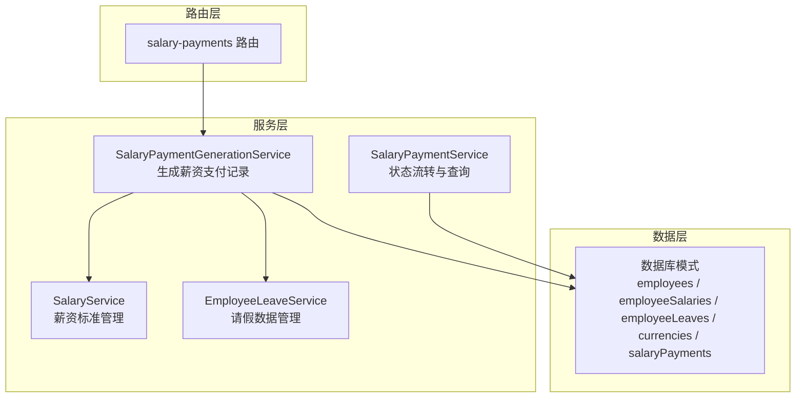
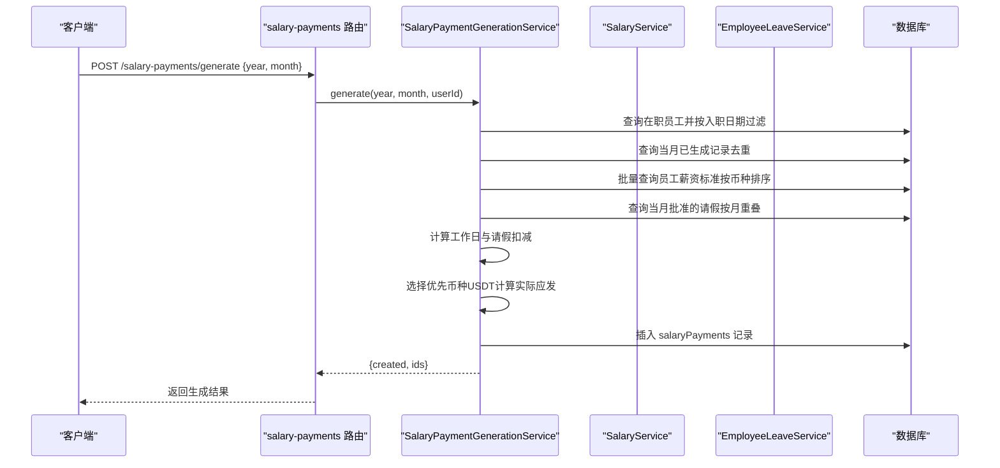
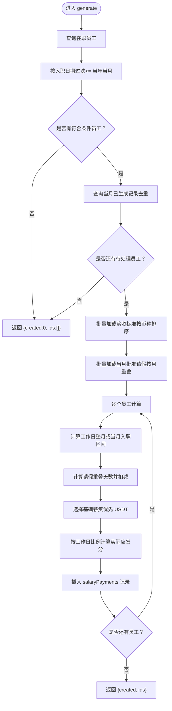
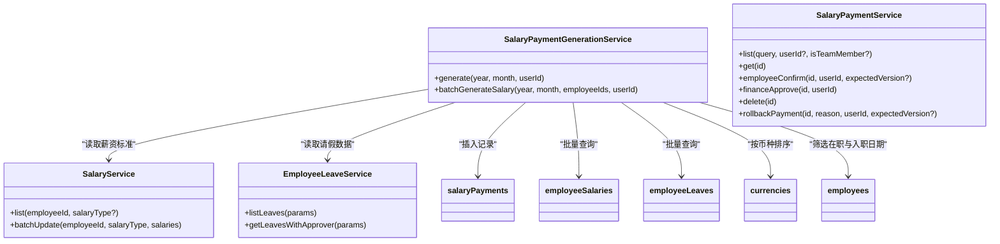

# 薪资支付生成服务

<cite>
**本文引用的文件**
- [SalaryPaymentGenerationService.ts](file://backend/src/services/SalaryPaymentGenerationService.ts)
- [SalaryService.ts](file://backend/src/services/SalaryService.ts)
- [EmployeeLeaveService.ts](file://backend/src/services/EmployeeLeaveService.ts)
- [SalaryPaymentService.ts](file://backend/src/services/SalaryPaymentService.ts)
- [salary-payments.ts](file://backend/src/routes/v2/salary-payments.ts)
- [schema.ts](file://backend/src/db/schema.ts)
- [di.ts](file://backend/src/middleware/di.ts)
- [SalaryPaymentGenerationService.test.ts](file://backend/test/routes/salary-payments.test.ts)
- [SalaryPaymentService.test.ts](file://backend/test/services/SalaryPaymentService.test.ts)
</cite>

## 目录
1. [简介](#简介)
2. [项目结构](#项目结构)
3. [核心组件](#核心组件)
4. [架构总览](#架构总览)
5. [详细组件分析](#详细组件分析)
6. [依赖关系分析](#依赖关系分析)
7. [性能考量](#性能考量)
8. [故障排查指南](#故障排查指南)
9. [结论](#结论)
10. [附录](#附录)

## 简介
本文件系统性文档化“薪资支付生成服务”（SalaryPaymentGenerationService）的架构与实现，重点覆盖以下内容：
- generate 方法如何批量筛选符合条件的员工、排除已生成记录、计算工作天数与请假扣减，并基于员工状态与币种优先级计算实际应发金额。
- 如何根据员工入职日期判断是否纳入当月薪资。
- batchGenerateSalary 的批量生成机制与与 generate 的复用策略。
- 与 SalaryService、EmployeeLeaveService 的集成点，用于获取薪资标准与请假数据。
- 通过生成 2023 年 12 月薪资的完整示例，展示服务调用流程与返回结果。

## 项目结构
围绕薪资支付生成的核心文件与职责如下：
- 后端路由层：salary-payments 路由负责接收请求并调用生成服务。
- 服务层：
  - SalaryPaymentGenerationService：生成薪资支付记录的主流程。
  - SalaryService：维护员工薪资标准（多币种）。
  - EmployeeLeaveService：提供请假数据（按月重叠计算）。
  - SalaryPaymentService：处理生成后薪资支付记录的状态流转与查询。
- 数据库模式：定义 employees、employeeSalaries、employeeLeaves、currencies、salaryPayments 等核心表结构。
- 依赖注入：在中间件中将服务实例注入到请求上下文。

图表来源
- [salary-payments.ts](file://backend/src/routes/v2/salary-payments.ts#L84-L95)
- [SalaryPaymentGenerationService.ts](file://backend/src/services/SalaryPaymentGenerationService.ts#L21-L211)
- [SalaryService.ts](file://backend/src/services/SalaryService.ts#L1-L186)
- [EmployeeLeaveService.ts](file://backend/src/services/EmployeeLeaveService.ts#L1-L182)
- [schema.ts](file://backend/src/db/schema.ts#L14-L316)

章节来源
- [salary-payments.ts](file://backend/src/routes/v2/salary-payments.ts#L84-L95)
- [di.ts](file://backend/src/middleware/di.ts#L114-L155)

## 核心组件
- SalaryPaymentGenerationService.generate(year, month, userId)
  - 入职日期判定：仅纳入入职日期不晚于当年当月的在职员工。
  - 已生成记录去重：按员工+年+月去重，避免重复生成。
  - 薪资标准获取：按员工类型（正式/试用）与币种排序，优先 USDT。
  - 请假扣减：按月度重叠区间计算请假天数并扣减。
  - 实际应发金额：按工作日比例计算，四舍五入为分。
  - 记录创建：写入 salaryPayments 表，初始状态为“待员工确认”。

- SalaryPaymentGenerationService.batchGenerateSalary(year, month, employeeIds, userId)
  - 限定员工集合，其余逻辑与 generate 复用。

- SalaryService.list / batchUpdate
  - 提供员工薪资标准的查询与批量更新能力，支持多币种。

- EmployeeLeaveService.listLeaves / getLeavesWithApprover
  - 提供请假列表与审批人信息，用于计算当月请假重叠天数。

- SalaryPaymentService.list / get / employeeConfirm / financeApprove / delete / rollbackPayment
  - 提供薪资支付记录的查询、状态流转与删除、回退等能力。

章节来源
- [SalaryPaymentGenerationService.ts](file://backend/src/services/SalaryPaymentGenerationService.ts#L21-L211)
- [SalaryPaymentGenerationService.ts](file://backend/src/services/SalaryPaymentGenerationService.ts#L213-L275)
- [SalaryService.ts](file://backend/src/services/SalaryService.ts#L1-L186)
- [EmployeeLeaveService.ts](file://backend/src/services/EmployeeLeaveService.ts#L1-L182)
- [SalaryPaymentService.ts](file://backend/src/services/SalaryPaymentService.ts#L1-L326)

## 架构总览
下图展示了从路由到服务再到数据库的调用链路与关键数据流。

图表来源
- [salary-payments.ts](file://backend/src/routes/v2/salary-payments.ts#L84-L95)
- [SalaryPaymentGenerationService.ts](file://backend/src/services/SalaryPaymentGenerationService.ts#L21-L211)
- [schema.ts](file://backend/src/db/schema.ts#L14-L316)

## 详细组件分析

### 组件一：SalaryPaymentGenerationService.generate
- 输入参数：year、month、userId
- 主要步骤：
  1) 筛选在职员工并按入职日期过滤（仅纳入入职日期不晚于当年当月的员工）。
  2) 查询当月已存在的薪资支付记录，按员工+年+月去重，排除已存在记录。
  3) 批量获取薪资标准：按员工类型（正式/试用）与币种排序，优先 USDT。
  4) 批量获取当月批准的请假：按月重叠区间计算请假天数并扣减工作日。
  5) 计算工作日：整月工作日减去请假天数；若当月入职，则按入职日到月末计算工作日。
  6) 选择基础薪资：优先 USDT，否则取该类型第一个币种；无则为 0。
  7) 计算实际应发金额：按工作日比例四舍五入为分。
  8) 写入 salaryPayments，状态初始化为“待员工确认”，返回创建数量与 ID 列表。

图表来源
- [SalaryPaymentGenerationService.ts](file://backend/src/services/SalaryPaymentGenerationService.ts#L21-L211)

章节来源
- [SalaryPaymentGenerationService.ts](file://backend/src/services/SalaryPaymentGenerationService.ts#L21-L211)

### 组件二：SalaryPaymentGenerationService.batchGenerateSalary
- 输入参数：year、month、employeeIds、userId
- 逻辑要点：
  - 限定员工集合为“在职且在给定 ID 列表内”的员工。
  - 其余流程与 generate 完全一致，包括入职日期过滤、去重、批量加载薪资与请假、计算与插入。
  - 注释提示：可考虑抽取公共逻辑避免重复代码，当前实现直接复用 generate。

章节来源
- [SalaryPaymentGenerationService.ts](file://backend/src/services/SalaryPaymentGenerationService.ts#L213-L275)

### 组件三：与 SalaryService 的集成
- 获取薪资标准：
  - 通过左连接 currencies，按币种排序，优先 USDT 的逻辑确保基础薪资优先使用 USDT。
  - 依据员工状态（正式/试用）筛选对应类型的薪资记录。
- 批量更新薪资：
  - 支持按员工类型批量删除并重建，保证同一类型只保留一个有效记录。
  - 在创建前校验币种存在性，避免无效币种写入。

章节来源
- [SalaryPaymentGenerationService.ts](file://backend/src/services/SalaryPaymentGenerationService.ts#L68-L87)
- [SalaryService.ts](file://backend/src/services/SalaryService.ts#L1-L186)

### 组件四：与 EmployeeLeaveService 的集成
- 获取请假数据：
  - 查询当月批准的请假，按月重叠区间计算请假天数并扣减工作日。
  - 仅统计 approved 状态的请假，避免未批准数据影响计算。
- 重叠区间计算：
  - 将请假起止日期与当月起止日期取交集，计算重叠天数并累加。

章节来源
- [SalaryPaymentGenerationService.ts](file://backend/src/services/SalaryPaymentGenerationService.ts#L88-L104)
- [EmployeeLeaveService.ts](file://backend/src/services/EmployeeLeaveService.ts#L1-L182)

### 组件五：路由与服务调用链
- 路由 salary-payments/generate 接收 {year, month}，调用 SalaryPaymentGenerationService.generate 并返回 {created, ids}。
- 依赖注入：在中间件中将 salaryPaymentGeneration 注入到 c.var.services，路由通过 c.var.services.salaryPaymentGeneration 调用。

章节来源
- [salary-payments.ts](file://backend/src/routes/v2/salary-payments.ts#L84-L95)
- [di.ts](file://backend/src/middleware/di.ts#L114-L155)

### 组件六：生成 2023 年 12 月薪资的示例流程
- 步骤概览：
  1) 客户端向 POST /salary-payments/generate 发送 {year: 2023, month: 12}。
  2) 路由层获取 userId 并调用 SalaryPaymentGenerationService.generate。
  3) 服务层执行筛选、去重、加载薪资与请假、计算工作日与请假扣减、选择基础薪资（优先 USDT）、计算实际应发金额并插入记录。
  4) 返回 {created, ids}，其中 created 为本次成功创建的记录数量，ids 为新生成记录的 ID 列表。
- 返回结果示例：
  - { created: 120, ids: ["a1b2c3...", "d4e5f6...", ...] }
  - 若无符合条件员工或全部已存在，则返回 { created: 0, ids: [] }。

章节来源
- [salary-payments.ts](file://backend/src/routes/v2/salary-payments.ts#L84-L95)
- [SalaryPaymentGenerationService.test.ts](file://backend/test/routes/salary-payments.test.ts#L100-L118)
- [SalaryPaymentService.test.ts](file://backend/test/services/SalaryPaymentService.test.ts#L62-L71)

## 依赖关系分析
- 服务间依赖：
  - 路由 salary-payments 调用 SalaryPaymentGenerationService.generate。
  - 生成服务内部依赖数据库（employees、employeeSalaries、employeeLeaves、currencies、salaryPayments）。
  - 生成服务读取 SalaryService 的薪资标准与 EmployeeLeaveService 的请假数据。
- 数据模型依赖：
  - employees：在职状态、入职日期、员工状态（正式/试用）。
  - employeeSalaries：员工薪资标准（按类型与币种）。
  - employeeLeaves：请假记录（批准状态、起止日期、天数）。
  - currencies：币种信息（用于优先 USDT 选择）。
  - salaryPayments：生成的薪资支付记录（状态、金额、时间戳等）。

图表来源
- [SalaryPaymentGenerationService.ts](file://backend/src/services/SalaryPaymentGenerationService.ts#L21-L275)
- [SalaryService.ts](file://backend/src/services/SalaryService.ts#L1-L186)
- [EmployeeLeaveService.ts](file://backend/src/services/EmployeeLeaveService.ts#L1-L182)
- [SalaryPaymentService.ts](file://backend/src/services/SalaryPaymentService.ts#L1-L326)
- [schema.ts](file://backend/src/db/schema.ts#L14-L316)

章节来源
- [SalaryPaymentGenerationService.ts](file://backend/src/services/SalaryPaymentGenerationService.ts#L21-L275)
- [SalaryService.ts](file://backend/src/services/SalaryService.ts#L1-L186)
- [EmployeeLeaveService.ts](file://backend/src/services/EmployeeLeaveService.ts#L1-L182)
- [SalaryPaymentService.ts](file://backend/src/services/SalaryPaymentService.ts#L1-L326)
- [schema.ts](file://backend/src/db/schema.ts#L14-L316)

## 性能考量
- 批量查询与分组：
  - 使用 inArray 一次性加载指定员工的薪资与请假数据，减少多次往返。
  - 使用 Map 对员工进行分组，降低后续循环中的查找成本。
- 币种排序：
  - 通过 ORDER BY 将 USDT 置前，便于优先选择，减少额外比较逻辑。
- 事务与原子性：
  - 生成过程包裹在事务中，确保筛选、去重、计算与插入的原子性，避免中间状态不一致。
- 时间复杂度估算：
  - 假设员工数为 N，当月请假记录为 M，查询与分组操作近似 O(N + M)，整体在大数据量下仍保持线性增长趋势。
- 建议优化：
  - 若员工规模较大，可在 salaryPayments 上增加索引（employeeId, year, month），加速去重查询。
  - 对 employeeLeaves 的日期范围查询可结合合适索引提升重叠区间计算效率。

[本节为通用性能讨论，无需列出具体文件来源]

## 故障排查指南
- 常见问题与定位：
  - 生成数量为 0：
    - 检查是否存在符合条件的在职员工（入职日期不晚于当年当月）。
    - 检查当月是否已有相同员工+年+月的记录。
  - 基础薪资为 0：
    - 确认员工是否存在对应类型的薪资记录；若无则会返回 0。
    - 确认币种 USDT 是否存在且有效。
  - 请假扣减异常：
    - 检查请假状态是否为 approved，起止日期是否与当月有重叠。
  - 生成后状态未更新：
    - 生成阶段仅创建记录并置为“待员工确认”，后续需经员工确认、财务审批、付款等流程。
- 关键断点参考：
  - 入职日期过滤与去重逻辑。
  - 薪资标准加载与币种排序。
  - 请假重叠区间计算。
  - 实际应发金额计算与插入。

章节来源
- [SalaryPaymentGenerationService.ts](file://backend/src/services/SalaryPaymentGenerationService.ts#L21-L211)
- [SalaryPaymentService.ts](file://backend/src/services/SalaryPaymentService.ts#L117-L326)

## 结论
SalaryPaymentGenerationService 通过清晰的筛选、去重、批量加载与计算流程，实现了对符合条件员工的薪资支付批量生成。其与 SalaryService 和 EmployeeLeaveService 的集成确保了薪资标准与请假数据的准确使用，并通过事务保障了生成过程的原子性。结合路由层的统一入口与状态流转服务，形成了完整的薪资支付生命周期管理。

[本节为总结性内容，无需列出具体文件来源]

## 附录
- 数据模型概览（关键字段）
  - employees：id、name、status、joinDate、active
  - employeeSalaries：employeeId、salaryType、currencyId、amountCents
  - employeeLeaves：employeeId、leaveType、startDate、endDate、days、status
  - currencies：code、name
  - salaryPayments：employeeId、year、month、salaryCents、status、allocationStatus

章节来源
- [schema.ts](file://backend/src/db/schema.ts#L14-L316)